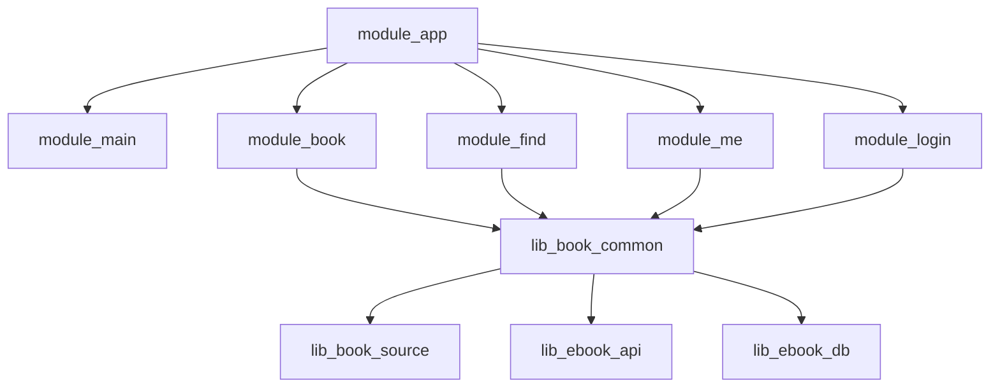
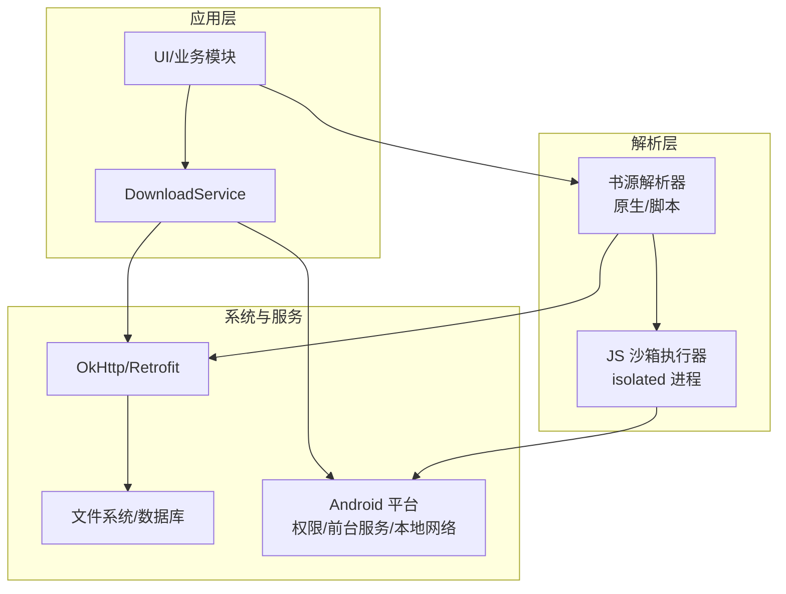
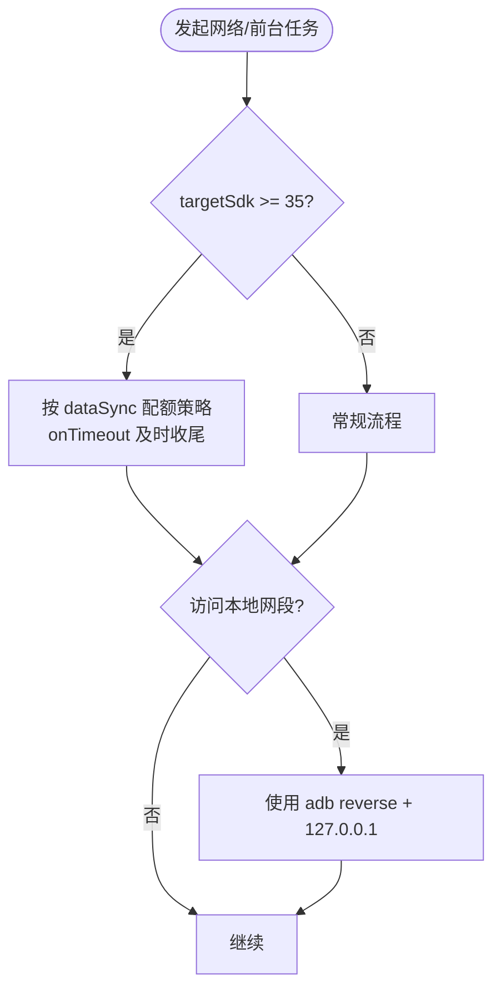
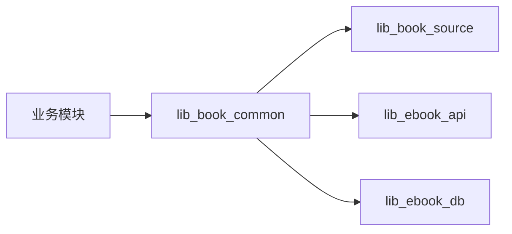

# 兼容性问题

<cite>
**本文引用的文件**
- [README.MD](file://README.MD)
- [gradle/libs.versions.toml](file://gradle/libs.versions.toml)
- [settings.gradle.kts](file://settings.gradle.kts)
- [gradle.properties](file://gradle.properties)
- [build.gradle.kts](file://build.gradle.kts)
- [AndroidApplicationConventionPlugin.kt](file://build-logic/convention/src/main/kotlin/com/xrn1997/convention/AndroidApplicationConventionPlugin.kt)
- [KotlinAndroid.kt](file://build-logic/convention/src/main/kotlin/com/xrn1997/convention/KotlinAndroid.kt)
- [module_app/AndroidManifest.xml](file://module_app/src/main/AndroidManifest.xml)
- [lib_book_common/AndroidManifest.xml](file://lib_book_common/src/main/AndroidManifest.xml)
- [DownloadService.kt](file://module_book/src/main/java/com/ebook/book/service/DownloadService.kt)
- [0028-untrusted-js-sandbox.md](file://docs/adr/0028-untrusted-js-sandbox.md)
- [0018-download-foreground-service-data-sync-quota.md](file://docs/adr/0018-download-foreground-service-data-sync-quota.md)
- [SandboxProcess.kt](file://lib_book_source/src/main/java/com/ebook/source/sandbox/SandboxProcess.kt)
- [JsSandboxConnector.kt](file://lib_book_source/src/main/java/com/ebook/source/sandbox/JsSandboxConnector.kt)
- [HostCompute.kt](file://lib_book_source/src/main/java/com/ebook/source/sandbox/HostCompute.kt)
</cite>

## 目录
1. [引言](#引言)
2. [项目结构](#项目结构)
3. [核心组件](#核心组件)
4. [架构总览](#架构总览)
5. [详细组件分析](#详细组件分析)
6. [依赖关系与冲突分析](#依赖关系与冲突分析)
7. [性能考量](#性能考量)
8. [故障排查指南](#故障排查指南)
9. [结论](#结论)
10. [附录](#附录)

## 引言
本指南聚焦于 Android 版本、设备形态、系统 ROM 定制与第三方库带来的兼容性风险，并结合本项目在 minSdk/targetSdk、权限最小化、前台服务配额、脚本沙箱隔离、网络本地访问限制等方面的实际实现，给出可操作的检测、降级与测试策略。目标读者既包括需要快速定位问题的工程师，也包括希望建立长期兼容性保障体系的团队。

## 项目结构
本项目采用多模块架构：业务模块（module_app/module_main/module_book/module_find/module_me/module_login）通过共享库（lib_book_common/lib_book_source/lib_ebook_api/lib_ebook_db）组织能力；构建配置集中在 build-logic 的约定插件中统一 SDK、工具链与发布策略。关键兼容性基线由 README 与构建约定共同约束：minSdk 26、targetSdk 37、JDK 17、AGP 9.x + Gradle 9.x。

图表来源
- [settings.gradle.kts:55-65](file://settings.gradle.kts#L55-L65)
- [README.MD:86-104](file://README.MD#L86-L104)

章节来源
- [README.MD:51-60](file://README.MD#L51-L60)
- [README.MD:86-104](file://README.MD#L86-L104)
- [settings.gradle.kts:1-65](file://settings.gradle.kts#L1-L65)

## 核心组件
- 构建与 SDK 基线：由约定插件集中管理 compileSdk/targetSdk/minSdk，确保全仓一致。
- 清单与权限：应用级清单仅声明必要权限，特性按需 required=false，避免安装过滤误伤。
- 前台服务与配额：下载服务使用 dataSync 类型并处理 targetSdk 35+ 的配额与启动限制。
- 脚本执行器：独立 isolated 进程 + QuickJS 内核，严格资源限制与白名单 API，适配低版本设备的能力缺失。
- 网络与本地访问：targetSdk 37 对“本地网络”的限制需通过 adb reverse 或公网 IP 规避。

章节来源
- [AndroidApplicationConventionPlugin.kt:30-45](file://build-logic/convention/src/main/kotlin/com/xrn1997/convention/AndroidApplicationConventionPlugin.kt#L30-L45)
- [KotlinAndroid.kt:30-45](file://build-logic/convention/src/main/kotlin/com/xrn1997/convention/KotlinAndroid.kt#L30-L45)
- [module_app/AndroidManifest.xml:5-43](file://module_app/src/main/AndroidManifest.xml#L5-L43)
- [0018-download-foreground-service-data-sync-quota.md:1-35](file://docs/adr/0018-download-foreground-service-data-sync-quota.md#L1-L35)
- [0028-untrusted-js-sandbox.md:14-43](file://docs/adr/0028-untrusted-js-sandbox.md#L14-L43)

## 架构总览
下图展示与兼容性密切相关的子系统交互：应用层调用下载服务与书源解析引擎；解析引擎可能进入隔离沙箱进程；网络请求受平台本地网络策略与客户端拦截器约束；构建与清单统一提供兼容性基线。

图表来源
- [DownloadService.kt:90-110](file://module_book/src/main/java/com/ebook/book/service/DownloadService.kt#L90-L110)
- [0028-untrusted-js-sandbox.md:14-43](file://docs/adr/0028-untrusted-js-sandbox.md#L14-L43)
- [module_app/AndroidManifest.xml:16-43](file://module_app/src/main/AndroidManifest.xml#L16-L43)

## 详细组件分析

### Android 版本差异与 API 演进
- 基线与范围：minSdk=26、targetSdk=37，所有新增能力必须覆盖 26-37 的行为差异。
- 前台服务数据同步配额：targetSdk 35+ 时 dataSync 前台服务存在 24 小时累计 6 小时上限，需在 onTimeout 中及时收尾并 stopSelf，避免 RemoteServiceException。
- 本地网络访问限制：targetSdk 37 起访问 10.0.0.0/8、192.168.0.0/16 等地址段需运行时权限；本项目不申请该权限，推荐用 adb reverse + 127.0.0.1 或公网 IP 调试。
- 低版本能力缺失：如某些 API 仅在更高版本可用（例如带 Executor 的 bindService 重载），必须在调用前进行版本判断，避免 NoClassDefFoundError 或 NoSuchMethodError。

图表来源
- [0018-download-foreground-service-data-sync-quota.md:1-35](file://docs/adr/0018-download-foreground-service-data-sync-quota.md#L1-L35)
- [module_app/AndroidManifest.xml:16-43](file://module_app/src/main/AndroidManifest.xml#L16-L43)

章节来源
- [README.MD:51-60](file://README.MD#L51-L60)
- [AndroidApplicationConventionPlugin.kt:30-45](file://build-logic/convention/src/main/kotlin/com/xrn1997/convention/AndroidApplicationConventionPlugin.kt#L30-L45)
- [KotlinAndroid.kt:30-45](file://build-logic/convention/src/main/kotlin/com/xrn1997/convention/KotlinAndroid.kt#L30-L45)
- [0018-download-foreground-service-data-sync-quota.md:1-35](file://docs/adr/0018-download-foreground-service-data-sync-quota.md#L1-L35)

### 设备兼容性与 ROM 定制异常
- 屏幕尺寸与窗口：Compose + Material3 + WindowSizeClass 适配不同密度/尺寸；避免硬编码尺寸，使用自适应布局。
- 相机特性：uses-feature 标记为 required=false，避免无相机设备被安装过滤挡掉。
- OEM 行为差异：部分厂商对前台服务/通知/权限有额外限制，建议通过真实设备矩阵验证。

章节来源
- [module_app/AndroidManifest.xml:21-30](file://module_app/src/main/AndroidManifest.xml#L21-L30)
- [libs.versions.toml:90-109](file://gradle/libs.versions.toml#L90-L109)

### 权限模型更新与最小化实践
- 仅声明必要权限：INTERNET、ACCESS_NETWORK_STATE、FOREGROUND_SERVICE；其他权限（如 CAMERA）仅声明且 required=false。
- 前台服务类型声明：dataSync 类型需在 manifest 中声明，避免 MissingForegroundServiceTypeException。
- 本地网络访问：targetSdk 37 下如需访问本机后端，优先使用 adb reverse + 127.0.0.1，避免申请 ACCESS_LOCAL_NETWORK。

章节来源
- [module_app/AndroidManifest.xml:16-43](file://module_app/src/main/AndroidManifest.xml#L16-L43)
- [0018-download-foreground-service-data-sync-quota.md:1-35](file://docs/adr/0018-download-foreground-service-data-sync-quota.md#L1-L35)

### 第三方库兼容性冲突解决
- 版本集中管理：所有依赖版本通过 libs.versions.toml 统一管理，避免隐式版本漂移。
- 依赖树分析与冲突消解：当出现类重复/方法缺失时，优先升级至已验证的稳定版本；必要时使用 exclude 或强制版本。
- 替代方案选择：优先使用维护活跃、API 稳定的库；若第三方库停止维护，评估替换成本与回归测试范围。

章节来源
- [libs.versions.toml:1-70](file://gradle/libs.versions.toml#L1-L70)

### 向后兼容性保证策略
- API 版本检测：对高版本 API 的使用包裹 Build.VERSION.SDK_INT 判断，避免在低版本设备上崩溃。
- 特性降级：当某特性不可用时回退到降级路径（如沙箱不可用则提示不可用而非静默失败）。
- 优雅降级：在网络不可达或本地网络受限场景，返回可理解错误并引导用户切换连接方式。

章节来源
- [0028-untrusted-js-sandbox.md:14-43](file://docs/adr/0028-untrusted-js-sandbox.md#L14-L43)
- [JsSandboxConnector.kt:1-30](file://lib_book_source/src/main/java/com/ebook/source/sandbox/JsSandboxConnector.kt#L1-L30)

### 兼容性测试方法与工具
- 多设备测试矩阵：覆盖不同 CPU 架构（arm64-v8a/x86_64）、不同 Android 版本（26-37）、不同厂商 ROM。
- 自动化测试：单元测试覆盖解析逻辑与边界条件；插桩测试覆盖 UI 与系统交互（权限、前台服务）。
- 用户反馈收集：结合日志上报与崩溃统计，定位特定版本/设备的兼容性问题。

章节来源
- [libs.versions.toml:139-150](file://gradle/libs.versions.toml#L139-L150)
- [0028-untrusted-js-sandbox.md:38-43](file://docs/adr/0028-untrusted-js-sandbox.md#L38-L43)

## 依赖关系与冲突分析
- 构建依赖：Gradle 9.4.1 + AGP 9.2.1 内置 Kotlin；KSP、Hilt、Room 等工具链版本集中管理。
- 模块依赖：业务模块依赖 lib_book_common，后者再依赖 lib_book_source、lib_ebook_api、lib_ebook_db，形成清晰分层。
- 潜在冲突点：
  - 多模块合并 Manifest 时的权限/特性叠加，需检查最终合并结果。
  - 第三方库与 AGP/Gradle 版本的兼容性，升级时需回归验证。

图表来源
- [settings.gradle.kts:55-65](file://settings.gradle.kts#L55-L65)
- [libs.versions.toml:150-237](file://gradle/libs.versions.toml#L150-L237)

章节来源
- [settings.gradle.kts:1-65](file://settings.gradle.kts#L1-L65)
- [libs.versions.toml:1-70](file://gradle/libs.versions.toml#L1-L70)

## 性能考量
- 前台服务配额：dataSync 类型在 targetSdk 35+ 下需严格控制运行时长，避免频繁触发 onTimeout。
- 沙箱执行开销：隔离进程冷启动与 IPC 带来延迟，应复用 runtime 并在任务边界重置上下文。
- 网络请求优化：合理使用缓存与分页，避免过多请求导致配额耗尽或超时。

章节来源
- [0018-download-foreground-service-data-sync-quota.md:1-35](file://docs/adr/0018-download-foreground-service-data-sync-quota.md#L1-L35)
- [0028-untrusted-js-sandbox.md:31-43](file://docs/adr/0028-untrusted-js-sandbox.md#L31-L43)

## 故障排查指南
- 下载闪退或服务异常：检查 DownloadService 是否按 dataSync 配额策略处理 onTimeout，并确认 manifest 已声明对应权限与类型。
- 沙箱不可用：确认 isolatedProcess 与进程门逻辑正确，低版本设备可能因能力缺失而拒绝执行。
- 无法访问本机后端：targetSdk 37 下访问本地网段需 adb reverse + 127.0.0.1，避免申请本地网络权限。
- 权限问题：核对合并后的 AndroidManifest.xml，确保所需权限已声明且未遗漏。

章节来源
- [DownloadService.kt:90-110](file://module_book/src/main/java/com/ebook/book/service/DownloadService.kt#L90-L110)
- [0028-untrusted-js-sandbox.md:14-43](file://docs/adr/0028-untrusted-js-sandbox.md#L14-L43)
- [module_app/AndroidManifest.xml:16-43](file://module_app/src/main/AndroidManifest.xml#L16-L43)

## 结论
通过统一的构建基线、最小化权限声明、前台服务配额管理与隔离沙箱机制，项目在 Android 26-37 范围内具备较强的兼容性保障。建议在持续集成中加入多设备矩阵测试与版本回归验证，结合用户反馈快速定位并修复兼容性问题。

## 附录
- 关键配置位置：
  - SDK 基线：build-logic 约定插件
  - 权限与特性：module_app/AndroidManifest.xml
  - 前台服务：DownloadService.kt
  - 沙箱执行：lib_book_source 中的沙箱相关类与 ADR 文档

章节来源
- [AndroidApplicationConventionPlugin.kt:30-45](file://build-logic/convention/src/main/kotlin/com/xrn1997/convention/AndroidApplicationConventionPlugin.kt#L30-L45)
- [KotlinAndroid.kt:30-45](file://build-logic/convention/src/main/kotlin/com/xrn1997/convention/KotlinAndroid.kt#L30-L45)
- [module_app/AndroidManifest.xml:16-43](file://module_app/src/main/AndroidManifest.xml#L16-L43)
- [DownloadService.kt:90-110](file://module_book/src/main/java/com/ebook/book/service/DownloadService.kt#L90-L110)
- [0028-untrusted-js-sandbox.md:14-43](file://docs/adr/0028-untrusted-js-sandbox.md#L14-L43)