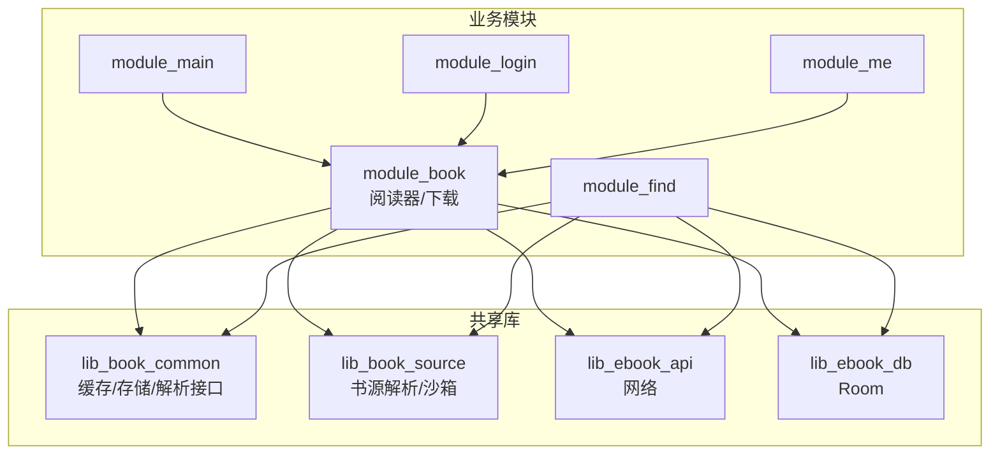
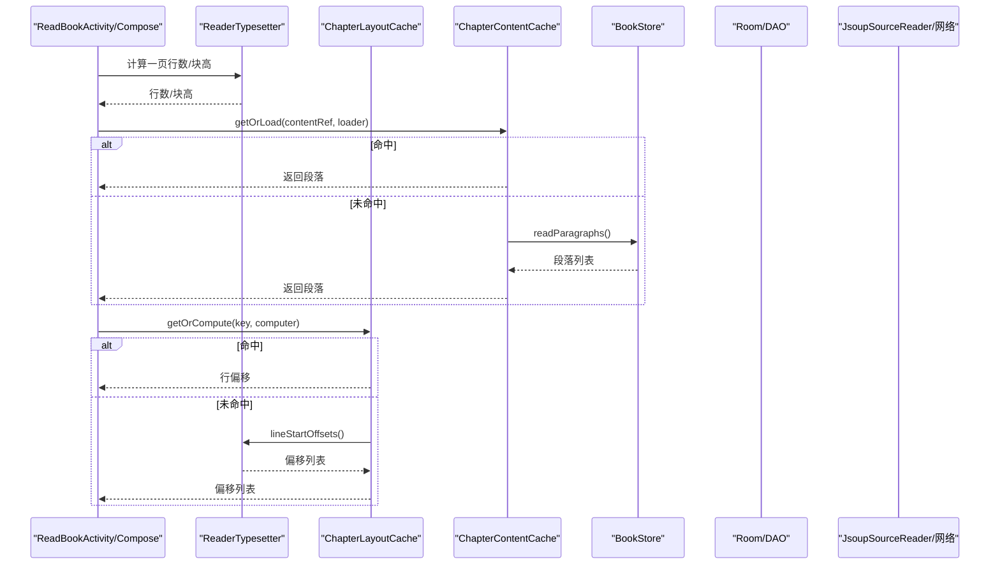
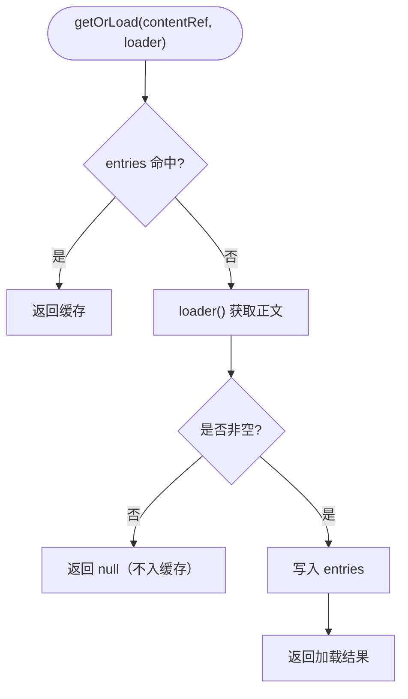
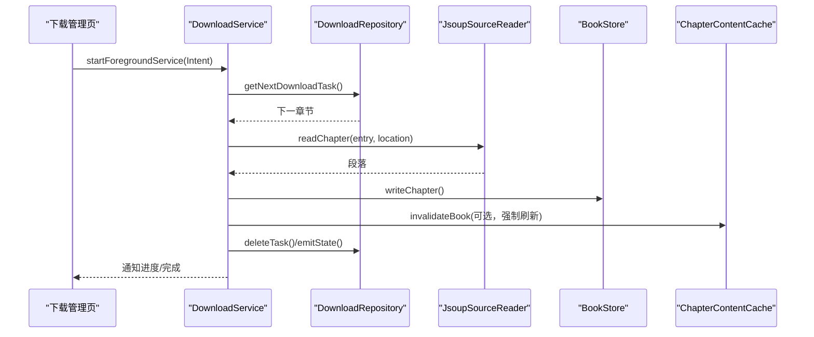
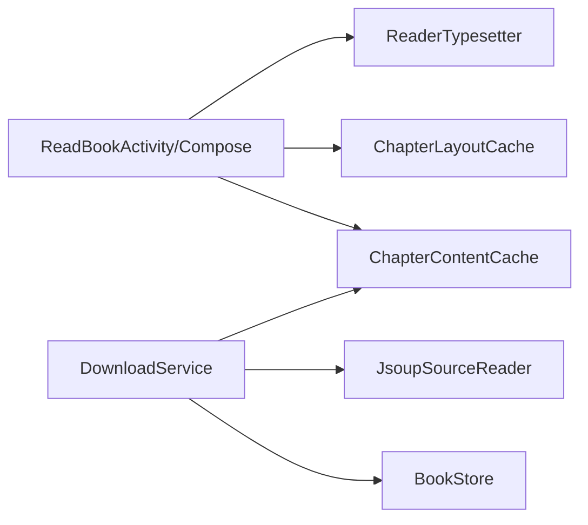

# 性能问题

<cite>
**本文引用的文件**
- [ChapterContentCache.kt](file://lib_book_common/src/main/java/com/ebook/common/store/ChapterContentCache.kt)
- [ChapterLayoutCache.kt](file://module_book/src/main/java/com/ebook/book/reader/ChapterLayoutCache.kt)
- [ReaderTypesetter.kt](file://module_book/src/main/java/com/ebook/book/reader/ReaderTypesetter.kt)
- [DownloadService.kt](file://module_book/src/main/java/com/ebook/book/service/DownloadService.kt)
- [BookStore.kt](file://lib_book_common/src/main/java/com/ebook/common/store/BookStore.kt)
- [DebugMemory.kt](file://module_book/src/androidTest/java/com/ebook/book/DebugMemory.kt)
- [libs.versions.toml](file://gradle/libs.versions.toml)
- [README.MD](file://README.MD)
</cite>

## 目录
1. [引言](#引言)
2. [项目结构（与性能相关）](#项目结构与性能相关)
3. [核心组件与性能要点](#核心组件与性能要点)
4. [架构总览（性能视角）](#架构总览性能视角)
5. [详细组件分析](#详细组件分析)
6. [依赖关系与耦合分析](#依赖关系与耦合分析)
7. [性能瓶颈定位方法](#性能瓶颈定位方法)
8. [常见瓶颈与优化策略](#常见瓶颈与优化策略)
9. [内存泄漏检测与治理](#内存泄漏检测与治理)
10. [性能测试与基准测试](#性能测试与基准测试)
11. [故障排查清单](#故障排查清单)
12. [结论](#结论)

## 引言
本指南面向 Android 电子书阅读器项目的性能问题诊断与优化，覆盖 CPU、内存、启动、UI 卡顿等常见问题；结合仓库中实际的缓存与渲染实现、下载服务、内容存储等关键路径，给出可落地的优化建议与排障步骤。

## 项目结构（与性能相关）
本项目采用多模块 MVVM 架构，阅读与下载是性能敏感路径：
- lib_book_common：共享领域能力，包含章节正文内存缓存、内容仓库等。
- module_book：阅读器 UI/排版、布局缓存、离线下载前台服务等。
- lib_ebook_api / lib_ebook_db：网络与数据库基础设施。
- build-logic：统一构建与优化配置入口。

**图表来源**
- [README.MD: 模块架构说明](file://README.MD)

**节来源**
- [README.MD](file://README.MD)

## 核心组件与性能要点
- 章节正文内存缓存：避免同一章多次 IO 解码，默认容量仅覆盖当前章与前后预读。
- 整章排版偏移缓存：将 O(章长) 的重排结果按“章节+字号+宽度”粒度缓存，翻页不再重复重排。
- 阅读器排版引擎：分页与渲染共用一套度量，避免错位导致的重排放大。
- 下载服务：前台数据同步类型，带重试、配额超时处理、通知与状态回传。
- 内容仓库：按书分目录、按章单文件，提供原子导入与占用统计。

**节来源**
- [ChapterContentCache.kt: 章节正文内存缓存](file://lib_book_common/src/main/java/com/ebook/common/store/ChapterContentCache.kt)
- [ChapterLayoutCache.kt: 整章排版偏移缓存](file://module_book/src/main/java/com/ebook/book/reader/ChapterLayoutCache.kt)
- [ReaderTypesetter.kt: 排版度量与分页一致性](file://module_book/src/main/java/com/ebook/book/reader/ReaderTypesetter.kt)
- [DownloadService.kt: 下载服务与配额超时](file://module_book/src/main/java/com/ebook/book/service/DownloadService.kt)
- [BookStore.kt: 内容仓库与占用统计](file://lib_book_common/src/main/java/com/ebook/common/store/BookStore.kt)

## 架构总览（性能视角）

**图表来源**
- [ChapterContentCache.kt: getOrLoad/失效](file://lib_book_common/src/main/java/com/ebook/common/store/ChapterContentCache.kt)
- [ChapterLayoutCache.kt: getOrCompute/键设计](file://module_book/src/main/java/com/ebook/book/reader/ChapterLayoutCache.kt)
- [ReaderTypesetter.kt: lineStartOffsets/measureBlock](file://module_book/src/main/java/com/ebook/book/reader/ReaderTypesetter.kt)
- [BookStore.kt: readParagraphs](file://lib_book_common/src/main/java/com/ebook/common/store/BookStore.kt)

## 详细组件分析

### 章节正文内存缓存（ChapterContentCache）
- 作用：以 content_ref 为键缓存章节段落，默认容量=3（当前章+前后各一章），减少重复 IO。
- 并发：使用 Mutex 保护 LinkedHashMap，getOrLoad 在锁外执行 loader，降低阻塞。
- 失效：支持按书剔除（基于 BookStore.cacheMarker 片段），下载强制刷新时调用以避免旧正文继续命中。
- 复杂度：查询 O(1)，淘汰 O(1)；删除按书遍历 key 集合 O(n)。

**图表来源**
- [ChapterContentCache.kt: 缓存读取/写入/失效](file://lib_book_common/src/main/java/com/ebook/common/store/ChapterContentCache.kt)

**节来源**
- [ChapterContentCache.kt](file://lib_book_common/src/main/java/com/ebook/common/store/ChapterContentCache.kt)

### 整章排版偏移缓存（ChapterLayoutCache）
- 作用：缓存整章的“每行起始偏移”，避免同章翻页重复 O(章长) 重排。
- 键设计：contentRef + contentLength + fontSizeSp + widthPx，确保重排与渲染一致且能感知强刷/换字体。
- 并发：用 synchronizedMap 包装，getOrCompute 在同步块内完成 check-then-act，防止并发预加载导致重复计算。
- 容量：默认 5，覆盖“当前章+前后两章”的余量。

**节来源**
- [ChapterLayoutCache.kt](file://module_book/src/main/java/com/ebook/book/reader/ChapterLayoutCache.kt)

### 排版引擎与分页一致性（ReaderTypesetter）
- 关键点：分页与渲染共用同一份 TextStyle/TextMeasurer/Density，避免两套管线产生行数差异。
- 测量：lineStartOffsets 为 O(章长)；fitRenderLineCount/measureBlock 通过探针文本获取真实行高与可视行数。
- 性能提示：超长章节翻页会放大 N×CPU 开销；应配合 ChapterLayoutCache 缓存偏移。

**节来源**
- [ReaderTypesetter.kt](file://module_book/src/main/java/com/ebook/book/reader/ReaderTypesetter.kt)

### 下载服务与并发控制（DownloadService）
- 前台服务：dataSync 类型，受 24h/6h 配额限制；onTimeout 做轻量收尾并停止服务。
- 任务队列：逐章抓取，失败最多重试 3 次，间隔 1s；章间间隔 800ms 降负载。
- 并发控制：isStartDownload/isDownloading 标志位；暂停不断开通知，取消则清队并结束。
- 缓存联动：强制刷新成功后调用 contentCache.invalidateBook，保证已打开阅读器看到新正文。

**图表来源**
- [DownloadService.kt: 启动/重试/配额/通知](file://module_book/src/main/java/com/ebook/book/service/DownloadService.kt)

**节来源**
- [DownloadService.kt](file://module_book/src/main/java/com/ebook/book/service/DownloadService.kt)

### 内容仓库与占用统计（BookStore）
- 组织：books/<书目录>/cNNNNN.txt；导入期使用 .tmp 暂存目录，commitImport 原子替换。
- 统计：storageUsage 一次遍历得出字节数与册数，避免多次 IO。
- 清理：reconcile 清理无主目录与散落文件，保障磁盘健康。

**节来源**
- [BookStore.kt](file://lib_book_common/src/main/java/com/ebook/common/store/BookStore.kt)

## 依赖关系与耦合分析
- 阅读器页面依赖 ReaderTypesetter 进行分页与渲染；同时依赖 ChapterLayoutCache 缓存偏移。
- 下载服务依赖 JsoupSourceReader 抓正文，依赖 BookStore 写章文件，并在强刷后失效 ChapterContentCache。
- 内容仓库被下载与阅读双端共享，需保证命名与路径一致性，否则出现“写不到/读不到”的性能假象。

**图表来源**
- [ReaderTypesetter.kt](file://module_book/src/main/java/com/ebook/book/reader/ReaderTypesetter.kt)
- [ChapterLayoutCache.kt](file://module_book/src/main/java/com/ebook/book/reader/ChapterLayoutCache.kt)
- [ChapterContentCache.kt](file://lib_book_common/src/main/java/com/ebook/common/store/ChapterContentCache.kt)
- [DownloadService.kt](file://module_book/src/main/java/com/ebook/book/service/DownloadService.kt)
- [BookStore.kt](file://lib_book_common/src/main/java/com/ebook/common/store/BookStore.kt)

**节来源**
- [ReaderTypesetter.kt](file://module_book/src/main/java/com/ebook/book/reader/ReaderTypesetter.kt)
- [ChapterLayoutCache.kt](file://module_book/src/main/java/com/ebook/book/reader/ChapterLayoutCache.kt)
- [ChapterContentCache.kt](file://lib_book_common/src/main/java/com/ebook/common/store/ChapterContentCache.kt)
- [DownloadService.kt](file://module_book/src/main/java/com/ebook/book/service/DownloadService.kt)
- [BookStore.kt](file://lib_book_common/src/main/java/com/ebook/common/store/BookStore.kt)

## 性能瓶颈定位方法
- CPU 占用过高
  - 关注点：同章频繁重排（ReaderTypesetter.lineStartOffsets）、大对象构造、正则/JSONPath 求值。
  - 工具：Systrace/Perfetto 记录 UI 线程与 Default 线程热点；Profiler 查看 CPU Flame Graph。
  - 代码锚点：ChapterLayoutCache.getOrCompute 应在并发下命中；ReaderTypesetter.measureBlock 使用探针避免估算误差。
- 内存使用异常
  - 关注点：章节正文、排版偏移、图片缓存、JS 沙箱进程。
  - 工具：Android Profiler Memory、Heap Dump、MAT 分析引用链。
  - 代码锚点：ChapterContentCache/ChapterLayoutCache 容量与失效；DebugMemory 用于基线对比 native heap。
- 启动速度慢
  - 关注点：Hilt 注入 Application 字段、冷启动初始化（通知通道、数据库）。
  - 工具：Startup Tracing、App Startup API 追踪。
  - 代码锚点：DownloadService.onCreate/startForeground 耗时；按需懒加载非关键资源。
- UI 卡顿
  - 关注点：主线程 IO、复杂排版、大图解码、列表滚动。
  - 工具：Profiler Frame Timeline、Layout Inspector。
  - 代码锚点：ReaderTypesetter 分页/渲染一致性；ChapterLayoutCache 缓存生效。

[本节为通用方法论，不直接分析具体文件]

## 常见瓶颈与优化策略
- 网络请求优化
  - 复用客户端、连接池；合理超时与重试；对书源站点限流（下载服务已有 800ms 章间间隔）。
  - 避免重复拉取：ChapterContentCache 命中优先；下载失败重试前退避。
- 数据库查询优化
  - 批量操作与事务；只选必要列；索引覆盖查询。
  - 避免在主线程执行重查询；Room 查询走协程/Flow。
- 图片加载优化
  - Coil 默认缓存；合理尺寸与格式；避免大图全量解码。
- 列表渲染优化
  - Compose LazyColumn 使用稳定 key；分页加载；避免在 item 中做重型计算。
- 排版与缓存
  - 使用 ChapterLayoutCache 缓存整章偏移；保持 ReaderTypesetter 分页与渲染一致；避免重复 measure。
- 下载并发控制
  - 控制重试次数与退避；失败出队防阻塞；配额超时及时收尾。

[本节为通用策略，不直接分析具体文件]

## 内存泄漏检测与治理
- LeakCanary 集成
  - 仓库中存在 debugApi 注释掉的 LeakCanary 依赖位置，可在调试版本启用以捕获 Activity/Fragment/ViewModel 生命周期相关的泄漏。
  - 建议：仅在 debug 开启，release 关闭以减少包体与开销。
- 常见泄漏场景
  - 长生命周期对象持有短生命周期 Context（如 Service、Dialog、Handler）。
  - ViewModel/Repository 中订阅 Flow/SharedFlow 未取消。
  - JS 沙箱回调在主进程侧形成强引用。
- 分析方法
  - 使用 Heap Dump + MAT 查找 GC Root 到实例的引用链；确认是否为预期持有。
  - 结合 DebugMemory 快照对比链路前后的 native heap 增量，定位 Room/SQLite 缓存膨胀。
- 治理原则
  - 遵循 MVVM 生命周期：ViewModel 负责短期状态，持久化由 Repository/DB 承担。
  - 清理回调与订阅：在 onDestroy/onCleared 中释放。
  - 谨慎使用静态/全局单例，必要时提供 clear/close。

**节来源**
- [libs.versions.toml: 依赖版本定义（含 LeakCanary 标记）](file://gradle/libs.versions.toml)
- [DebugMemory.kt: native heap 基线快照](file://module_book/src/androidTest/java/com/ebook/book/DebugMemory.kt)

## 性能测试与基准测试
- 单元测试
  - 针对排版算法（fitLines）、缓存命中率、下载重试逻辑等进行行为验证。
- 集成测试
  - 使用 connectedAndroidTest 跑端到端流程（阅读翻页、下载队列、通知更新）。
- 基准测试
  - 针对 ReaderTypesetter.lineStartOffsets 与 ChapterLayoutCache.getOrCompute 的耗时与命中率进行微基准。
  - 使用 Benchmark 或 JMH 在设备/模拟器上采集 P95/P99 延迟。
- 运行时监控
  - 使用 Profiler 帧率、CPU、内存曲线；结合 Systrace/Perfetto 录制卡顿片段。
  - 下载过程观察通知与状态回传时序，确认配额超时分支正常触发。

[本节为通用实践，不直接分析具体文件]

## 故障排查清单
- 阅读器翻页卡顿
  - 检查 ChapterLayoutCache 是否命中；确认 ReaderTypesetter 样式一致；避免主线程大对象构造。
- 章节正文重复 IO
  - 检查 ChapterContentCache 容量与失效时机；确认强刷后调用 invalidateBook。
- 下载长时间不停止
  - 检查 onTimeout 是否触发；确认失败任务出队与 skippedCount 计数；核对通知与状态回传。
- 启动闪退/慢
  - 检查 Hilt 注入 Application 字段；推迟非关键初始化；startForeground 快速返回。
- 内存持续增长
  - 使用 LeakCanary 捕获泄漏；Heap Dump 分析引用链；关注 SQLite 页缓存与图片缓存。

[本节为通用排障指引，不直接分析具体文件]

## 结论
本项目在阅读与下载两条关键路径上已通过“内容缓存+排版缓存+并发控制+配额管理”形成了较完善的性能基础。实际优化应围绕：
- 保证缓存命中与正确失效（章节正文、排版偏移）。
- 控制网络与 I/O 的并发与退避，避免打满配额与站点限流。
- 使用系统级工具（Profiler/Systrace/Perfetto）与内存工具（LeakCanary/MAT）持续观测。
- 以基准测试固化优化收益，回归验证翻页、下载、启动等体验指标。