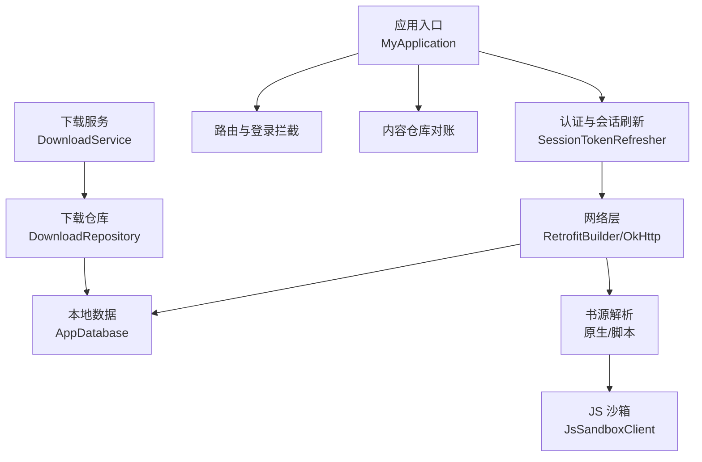
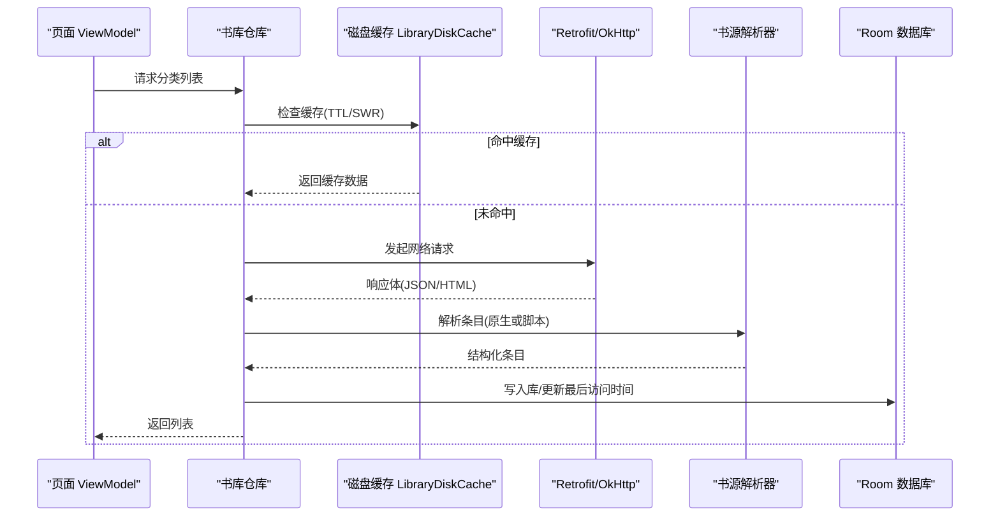
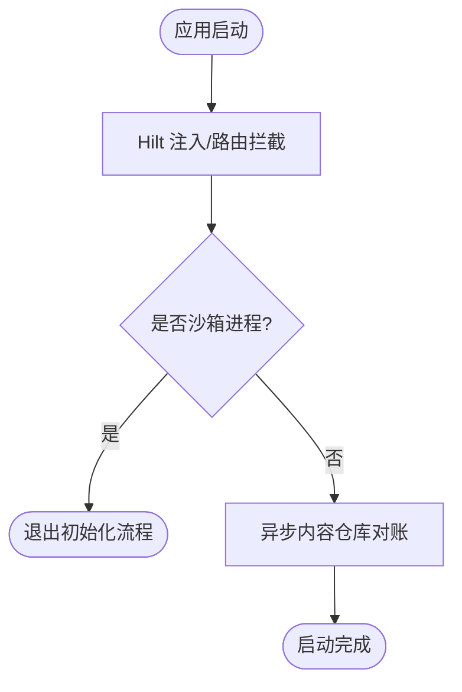
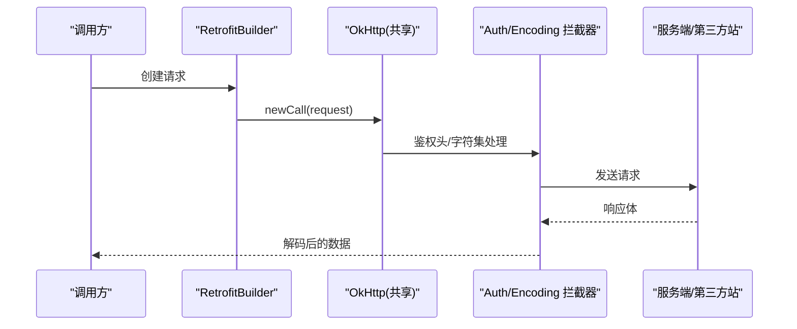
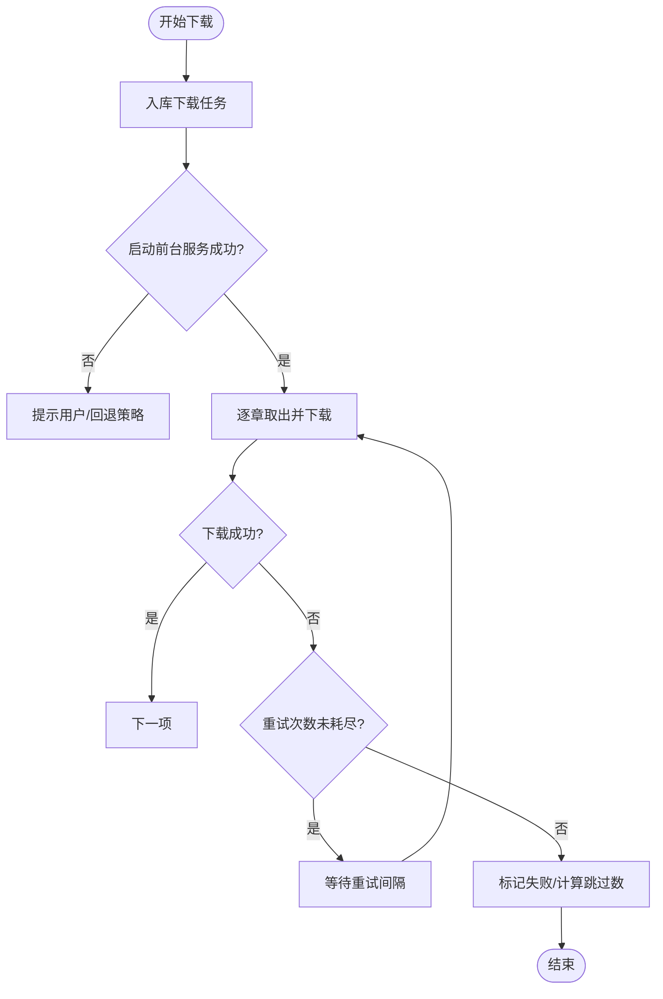
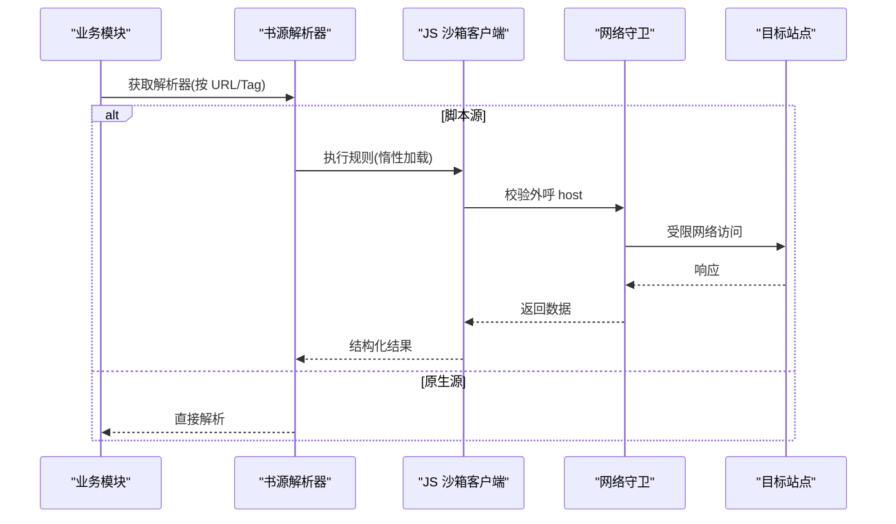
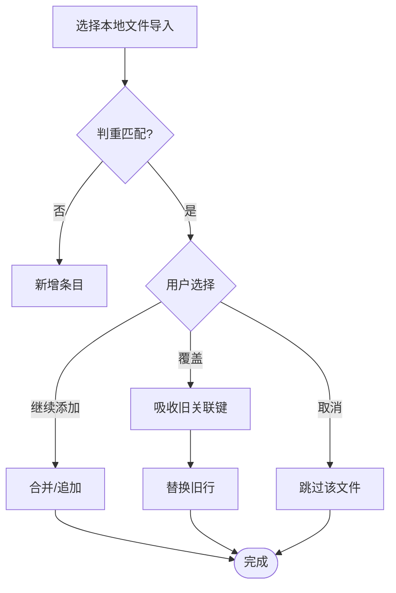
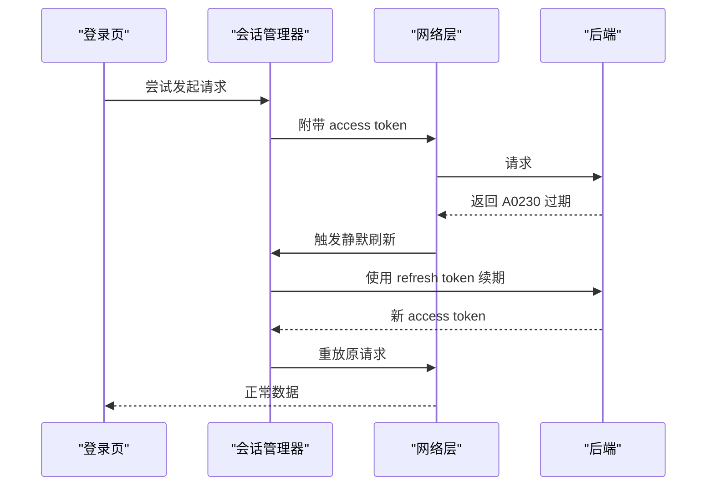
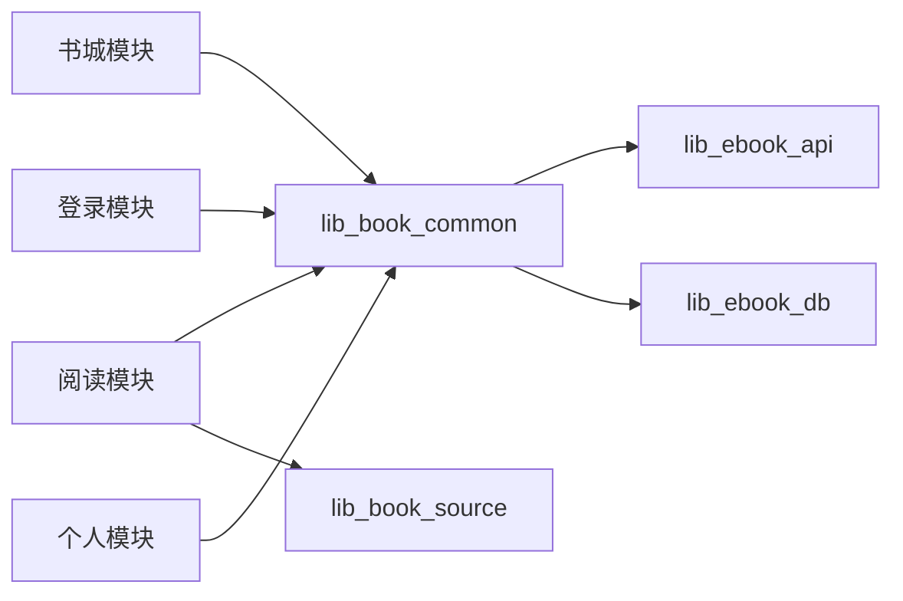

# 故障排除

<cite>
**本文引用的文件**
- [MyApplication.kt](file://module_app/src/main/java/com/ebook/MyApplication.kt)
- [AppDatabase.kt](file://lib_ebook_db/src/main/java/com/ebook/db/AppDatabase.kt)
- [RetrofitBuilder.kt](file://lib_ebook_api/src/main/java/com/ebook/api/RetrofitBuilder.kt)
- [DownloadService.kt](file://module_book/src/main/java/com/ebook/book/service/DownloadService.kt)
- [DownloadRepository.kt](file://module_book/src/main/java/com/ebook/book/repository/DownloadRepository.kt)
- [SessionTokenRefresher.kt](file://lib_book_common/src/main/java/com/ebook/common/domain/SessionTokenRefresher.kt)
- [FailureReport.kt](file://lib_book_common/src/main/java/com/ebook/common/util/FailureReport.kt)
- [EncodingInterceptor.kt](file://lib_ebook_api/src/main/java/com/ebook/api/intercepter/EncodingInterceptor.kt)
- [BookImportActivity.kt](file://module_book/src/main/java/com/ebook/book/ImportBookActivity.kt)
- [LoginActivity.kt](file://module_login/src/main/java/com/ebook/login/LoginActivity.kt)
- [SettingViewModel.kt](file://module_me/src/main/java/com/ebook/me/mvvm/viewmodel/SettingViewModel.kt)
- [JsSandboxClient.kt](file://lib_book_source/src/main/java/com/ebook/source/sandbox/JsSandboxClient.kt)
- [JsNetworkGuard.kt](file://lib_book_source/src/main/java/com/ebook/source/sandbox/JsNetworkGuard.kt)
- [ScriptRuleSet.kt](file://lib_book_source/src/main/java/com/ebook/source/script/ScriptRuleSet.kt)
- [LibraryDiskCache.kt](file://lib_book_common/src/main/java/com/ebook/common/analyze/source/LibraryDiskCache.kt)
</cite>

## 目录
1. [简介](#简介)
2. [项目结构（与故障定位相关）](#项目结构与故障定位相关)
3. [核心组件与常见故障域](#核心组件与常见故障域)
4. [架构总览](#架构总览)
5. [详细组件分析与排障指南](#详细组件分析与排障指南)
6. [依赖关系与耦合分析](#依赖关系与耦合分析)
7. [性能问题排查](#性能问题排查)
8. [调试技巧与工具链](#调试技巧与工具链)
9. [权限与兼容性](#权限与兼容性)
10. [数据库排障](#数据库排障)
11. [网络排障](#网络排障)
12. [常见问题案例与修复思路](#常见问题案例与修复思路)
13. [问题上报与社区支持](#问题上报与社区支持)
14. [结论](#结论)

## 简介
本指南面向开发者，聚焦在编译、运行、网络、数据库、权限、兼容性与性能等方面的系统化排障方法。内容基于仓库现有实现与约定，提供从“现象—线索—根因—处置”的完整路径，并给出关键代码位置以便快速定位。

## 项目结构（与故障定位相关）
- 应用入口与初始化：`module_app` 中的 `MyApplication` 负责路由拦截、沙箱进程门控、内容仓库对账等启动期逻辑。
- 数据层：`lib_ebook_db` 提供 Room 数据库装配；各模块通过 DAO 访问数据。
- 网络层：`lib_ebook_api` 提供 Retrofit 构建器与 OkHttp 共享客户端，统一鉴权与编码处理。
- 书源解析与脚本沙箱：`lib_book_source` 提供原生与脚本解析器，以及隔离进程执行 JS 的沙箱客户端与网络守卫。
- 业务模块：`module_book`（阅读与下载）、`module_find`（书城与搜索）、`module_login`（登录注册）、`module_me`（个人中心）。

**图表来源**
- [MyApplication.kt:19-44](file://module_app/src/main/java/com/ebook/MyApplication.kt#L19-L44)
- [RetrofitBuilder.kt:13-44](file://lib_ebook_api/src/main/java/com/ebook/api/RetrofitBuilder.kt#L13-L44)
- [AppDatabase.kt:8-75](file://lib_ebook_db/src/main/java/com/ebook/db/AppDatabase.kt#L8-L75)
- [JsSandboxClient.kt](file://lib_book_source/src/main/java/com/ebook/source/sandbox/JsSandboxClient.kt)
- [DownloadService.kt](file://module_book/src/main/java/com/ebook/book/service/DownloadService.kt)
- [DownloadRepository.kt](file://module_book/src/main/java/com/ebook/book/repository/DownloadRepository.kt)

**章节来源**
- [MyApplication.kt:19-44](file://module_app/src/main/java/com/ebook/MyApplication.kt#L19-L44)
- [RetrofitBuilder.kt:13-44](file://lib_ebook_api/src/main/java/com/ebook/api/RetrofitBuilder.kt#L13-L44)
- [AppDatabase.kt:8-75](file://lib_ebook_db/src/main/java/com/ebook/db/AppDatabase.kt#L8-L75)

## 核心组件与常见故障域
- 应用启动与会话恢复：冷启动为空 token，首个请求触发静默刷新；失败需全局处理会话过期。
- 网络请求与编码：统一拦截器注入鉴权头与字符集转换；第三方站点不携带用户凭证。
- 数据库迁移与一致性：Room schema 版本管理与迁移链；自然键与自增键混合主键策略。
- 下载任务与前台服务：按章队列、失败重试、配额限制与后台拉起约束。
- 书源解析与脚本执行：规则词法/求值/取文链路；沙箱隔离执行与白名单网络守卫。
- 缓存与离线读取：书城分类缓存策略与失效边界；本地书籍导入判重与合并。

**章节来源**
- [SessionTokenRefresher.kt](file://lib_book_common/src/main/java/com/ebook/common/domain/SessionTokenRefresher.kt)
- [RetrofitBuilder.kt:13-44](file://lib_ebook_api/src/main/java/com/ebook/api/RetrofitBuilder.kt#L13-L44)
- [AppDatabase.kt:26-38](file://lib_ebook_db/src/main/java/com/ebook/db/AppDatabase.kt#L26-L38)
- [DownloadService.kt](file://module_book/src/main/java/com/ebook/book/service/DownloadService.kt)
- [ScriptRuleSet.kt](file://lib_book_source/src/main/java/com/ebook/source/script/ScriptRuleSet.kt)
- [LibraryDiskCache.kt](file://lib_book_common/src/main/java/com/ebook/common/analyze/source/LibraryDiskCache.kt)

## 架构总览
下图展示典型“书城列表加载”调用链，体现网络、缓存、解析与 UI 的关系：

**图表来源**
- [LibraryDiskCache.kt](file://lib_book_common/src/main/java/com/ebook/common/analyze/source/LibraryDiskCache.kt)
- [RetrofitBuilder.kt:13-44](file://lib_ebook_api/src/main/java/com/ebook/api/RetrofitBuilder.kt#L13-L44)
- [ScriptRuleSet.kt](file://lib_book_source/src/main/java/com/ebook/source/script/ScriptRuleSet.kt)
- [AppDatabase.kt:8-75](file://lib_ebook_db/src/main/java/com/ebook/db/AppDatabase.kt#L8-L75)

## 详细组件分析与排障指南

### 应用启动与会话恢复
- 启动时完成 Hilt 注入、路由拦截与沙箱进程门控；异步进行内容仓库对账，失败仅记录日志不影响启动。
- 冷启动无 access token，首个请求触发静默刷新；A0230 过期由网络层收口并上报失败。

**图表来源**
- [MyApplication.kt:19-44](file://module_app/src/main/java/com/ebook/MyApplication.kt#L19-L44)

**章节来源**
- [MyApplication.kt:19-44](file://module_app/src/main/java/com/ebook/MyApplication.kt#L19-L44)
- [SessionTokenRefresher.kt](file://lib_book_common/src/main/java/com/ebook/common/domain/SessionTokenRefresher.kt)

### 网络层与编码处理
- Retrofit 复用共享 Call.Factory，附加鉴权拦截与 debug 脱敏日志；JSON 转换器优先，Scalars 殿后以兼容 HTML。
- 编码拦截器统一解码，避免 gbk/utf-8 错配导致乱码。

**图表来源**
- [RetrofitBuilder.kt:13-44](file://lib_ebook_api/src/main/java/com/ebook/api/RetrofitBuilder.kt#L13-L44)
- [EncodingInterceptor.kt](file://lib_ebook_api/src/main/java/com/ebook/api/intercepter/EncodingInterceptor.kt)

**章节来源**
- [RetrofitBuilder.kt:13-44](file://lib_ebook_api/src/main/java/com/ebook/api/RetrofitBuilder.kt#L13-L44)
- [EncodingInterceptor.kt](file://lib_ebook_api/src/main/java/com/ebook/api/intercepter/EncodingInterceptor.kt)

### 下载服务与任务管理
- 下载为前台服务，按章队列顺序执行；失败章在重试耗尽后出队，跳过数带进收尾文案。
- 发起下载先入库再拉服务，防止启动被拒丢任务；超时内只做轻量收尾。

**图表来源**
- [DownloadService.kt](file://module_book/src/main/java/com/ebook/book/service/DownloadService.kt)
- [DownloadRepository.kt](file://module_book/src/main/java/com/ebook/book/repository/DownloadRepository.kt)

**章节来源**
- [DownloadService.kt](file://module_book/src/main/java/com/ebook/book/service/DownloadService.kt)
- [DownloadRepository.kt](file://module_book/src/main/java/com/ebook/book/repository/DownloadRepository.kt)

### 书源解析与脚本沙箱
- 规则解析分原生与脚本两条路；脚本在隔离进程执行，受白名单网络守卫保护。
- 首次求值惰性加载脚本规则，异常类型化抛出；未装配执行器与执行失败区分。

**图表来源**
- [ScriptRuleSet.kt](file://lib_book_source/src/main/java/com/ebook/source/script/ScriptRuleSet.kt)
- [JsSandboxClient.kt](file://lib_book_source/src/main/java/com/ebook/source/sandbox/JsSandboxClient.kt)
- [JsNetworkGuard.kt](file://lib_book_source/src/main/java/com/ebook/source/sandbox/JsNetworkGuard.kt)

**章节来源**
- [ScriptRuleSet.kt](file://lib_book_source/src/main/java/com/ebook/source/script/ScriptRuleSet.kt)
- [JsSandboxClient.kt](file://lib_book_source/src/main/java/com/ebook/source/sandbox/JsSandboxClient.kt)
- [JsNetworkGuard.kt](file://lib_book_source/src/main/java/com/ebook/source/sandbox/JsNetworkGuard.kt)

### 本地书籍导入与判重
- 导入判重依据 comment_key 与书架当前主键匹配；非破坏“继续添加”占主按钮位；覆盖前吸收旧关联键。
- 补章仅针对本地目标书，要求旧书归一化章名序列为新前缀，分叉整笔放弃。

**图表来源**
- [BookImportActivity.kt](file://module_book/src/main/java/com/ebook/book/ImportBookActivity.kt)

**章节来源**
- [BookImportActivity.kt](file://module_book/src/main/java/com/ebook/book/ImportBookActivity.kt)

### 登录与会话管理
- 邮箱为主标识，三步注册；access token 只驻内存，refresh token 持久化；冷启动空 token 由首个请求静默刷新。
- A0230 过期统一在网络层处理，失败上报失败报告，引导回到登录。

**图表来源**
- [LoginActivity.kt](file://module_login/src/main/java/com/ebook/login/LoginActivity.kt)
- [SessionTokenRefresher.kt](file://lib_book_common/src/main/java/com/ebook/common/domain/SessionTokenRefresher.kt)

**章节来源**
- [LoginActivity.kt](file://module_login/src/main/java/com/ebook/login/LoginActivity.kt)
- [SessionTokenRefresher.kt](file://lib_book_common/src/main/java/com/ebook/common/domain/SessionTokenRefresher.kt)

## 依赖关系与耦合分析
- 模块间通过 Provider 接口与 TheRouter 解耦；功能模块互不依赖，跨模块导航统一走路由表。
- 网络层通过共享 OkHttp 与拦截器集中处理鉴权与编码；解析器与业务模块松耦合，按 URL/Tag 动态选择。
- 数据库通过 DAO 抽象，迁移链保证 schema 演进安全。

**图表来源**
- [RetrofitBuilder.kt:13-44](file://lib_ebook_api/src/main/java/com/ebook/api/RetrofitBuilder.kt#L13-L44)
- [AppDatabase.kt:8-75](file://lib_ebook_db/src/main/java/com/ebook/db/AppDatabase.kt#L8-L75)
- [ScriptRuleSet.kt](file://lib_book_source/src/main/java/com/ebook/source/script/ScriptRuleSet.kt)

**章节来源**
- [RetrofitBuilder.kt:13-44](file://lib_ebook_api/src/main/java/com/ebook/api/RetrofitBuilder.kt#L13-L44)
- [AppDatabase.kt:8-75](file://lib_ebook_db/src/main/java/com/ebook/db/AppDatabase.kt#L8-L75)
- [ScriptRuleSet.kt](file://lib_book_source/src/main/java/com/ebook/source/script/ScriptRuleSet.kt)

## 性能问题排查
- CPU 占用过高：优先检查脚本解析与正则求值路径；确认未在主线程执行沙箱请求；监控长耗时解析任务。
- 内存使用异常：关注大图加载与图片缓存；检查下载队列与临时文件清理；避免在 Application 中 eager 注入大对象。
- 启动速度慢：减少启动期同步操作；内容仓库对账已异步执行；避免冷启动大量网络请求。
- UI 卡顿：Compose 渲染瓶颈通常在 LazyColumn 的 key 与 item 重建；确保稳定唯一 key；避免频繁重组。

[本节为通用指导，无需具体文件引用]

## 调试技巧与工具链
- 日志分析：统一使用 Logger，级别控制并在 release 裁剪；关注会话刷新失败、解析异常与服务端错误码。
- 断点调试：在解析器求值入口、网络拦截器与下载队列关键点设置断点；独立模块模式可单独运行验证。
- 远程调试：使用 adb reverse + 本地后端基址；真机调试注意本地网络权限与回环地址配置。
- 崩溃堆栈分析：优先查看沙箱进程 binder 超时与 JNI 异常；下载失败与超时需结合任务状态定位。

**章节来源**
- [FailureReport.kt](file://lib_book_common/src/main/java/com/ebook/common/util/FailureReport.kt)
- [MyApplication.kt:19-44](file://module_app/src/main/java/com/ebook/MyApplication.kt#L19-L44)

## 权限与兼容性
- 运行时权限：拍照/相册/导入/下载通知需人工装机验证；Android 17 起访问本机后端需本地网络权限，建议用 adb reverse 规避。
- Manifest 权限：存储与前台服务相关权限不得随意删除；两份清单必须同步，合并结果需核对。
- 设备兼容：目标 SDK 37，minSdk 26；前台服务 dataSync 类型声明需满足配额限制。

**章节来源**
- [SettingViewModel.kt](file://module_me/src/main/java/com/ebook/me/mvvm/viewmodel/SettingViewModel.kt)
- [RetrofitBuilder.kt:13-44](file://lib_ebook_api/src/main/java/com/ebook/api/RetrofitBuilder.kt#L13-L44)

## 数据库排障
- 表结构变更：遵循 version+1、追加紧邻迁移、提交生成的 schema JSON；禁止 destructive migration。
- 数据迁移失败：检查自然键 REPLACE 与自增键 upsert 的主键回填；下载任务去重责任在仓库层。
- 查询性能：关注目录/正文分页判定与缓存策略；避免重复请求与串章。
- 死锁检测：批量写入时注意事务粒度与索引冲突；优先单条原子更新。

**章节来源**
- [AppDatabase.kt:26-38](file://lib_ebook_db/src/main/java/com/ebook/db/AppDatabase.kt#L26-L38)

## 网络排障
- 连接失败：检查后端基址与本地网络权限；确认 adb reverse 配置正确。
- 超时问题：调整 OkHttp 超时参数；检查脚本网络守卫白名单。
- SSL 证书错误：确保证书链有效；必要时启用 debug 脱敏日志。
- 代理配置：企业网络需配置代理；注意代理对第三方站点的影响。

**章节来源**
- [RetrofitBuilder.kt:13-44](file://lib_ebook_api/src/main/java/com/ebook/api/RetrofitBuilder.kt#L13-L44)
- [EncodingInterceptor.kt](file://lib_ebook_api/src/main/java/com/ebook/api/intercepter/EncodingInterceptor.kt)
- [JsNetworkGuard.kt](file://lib_book_source/src/main/java/com/ebook/source/sandbox/JsNetworkGuard.kt)

## 常见问题案例与修复思路
- 书城加载不出数据：检查缓存 TTL/SWR 策略与 lastAccessTime 更新；确认解析器返回结构化数据而非空列表。
- 登录成功后仍显示上一身份昵称：清会话只调用 clearSession，避免自行成对清理内存镜像。
- 下载通知常驻不消失：失败章重试耗尽后才出队；跳过数计入收尾文案。
- 脚本解析乱码：确认取文层显式字节解码，不走 body.string() 吞掉编码。
- 启动即崩溃（沙箱进程）：Application 字段注入过早，改为延迟注入 EntryPointAccessors。

**章节来源**
- [LibraryDiskCache.kt](file://lib_book_common/src/main/java/com/ebook/common/analyze/source/LibraryDiskCache.kt)
- [MyApplication.kt:46-61](file://module_app/src/main/java/com/ebook/MyApplication.kt#L46-L61)
- [DownloadService.kt](file://module_book/src/main/java/com/ebook/book/service/DownloadService.kt)
- [EncodingInterceptor.kt](file://lib_ebook_api/src/main/java/com/ebook/api/intercepter/EncodingInterceptor.kt)

## 问题上报与社区支持
- 提 Issue：描述清晰、复现步骤完整；附日志与堆栈。
- 贡献指南：遵循 Conventional Commits；提交前验证编译与安装。
- 文档参考：ADR 与规格文档作为事实源；脚本语法规格优先于实现差异。

**章节来源**
- [README.MD](file://README.MD)

## 结论
本指南围绕应用启动、网络、数据库、下载、书源解析与脚本沙箱等核心环节，提供了系统化的故障定位方法与调试技巧。建议在日常开发中结合日志、断点与测试用例，快速收敛问题范围，并通过迁移链与缓存策略保障稳定性。遇到问题时，优先对照本指南的关键代码位置与流程图，定位根因后再实施修复。