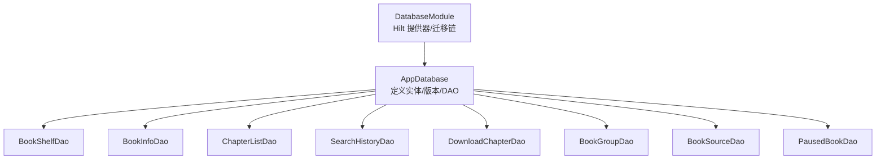
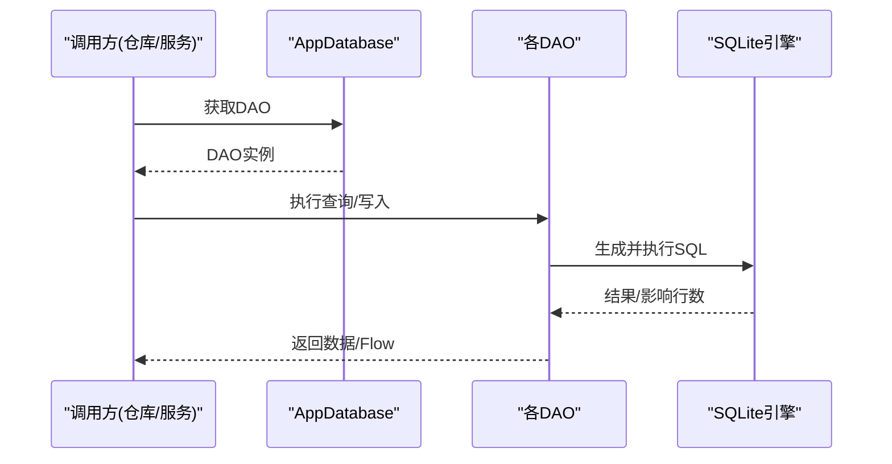
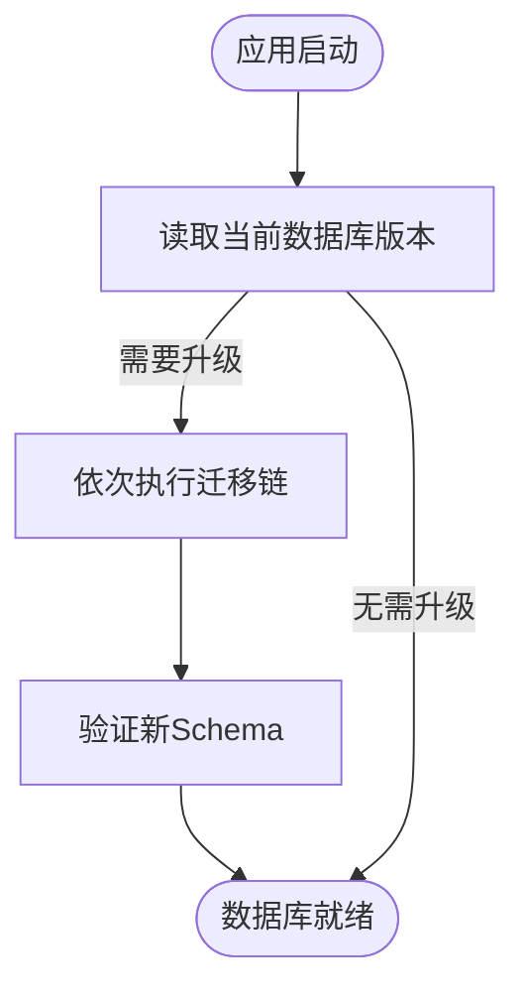
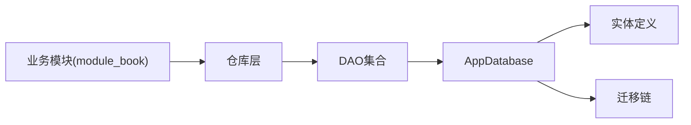

# 数据库问题

<cite>
**本文引用的文件**
- [AppDatabase.kt](file://lib_ebook_db/src/main/java/com/ebook/db/AppDatabase.kt)
- [DatabaseModule.kt](file://lib_ebook_db/src/main/java/com/ebook/db/di/DatabaseModule.kt)
- [BookShelfEntity.kt](file://lib_ebook_db/src/main/java/com/ebook/db/entity/BookShelfEntity.kt)
- [BookInfoEntity.kt](file://lib_ebook_db/src/main/java/com/ebook/db/entity/BookInfoEntity.kt)
- [ChapterListEntity.kt](file://lib_ebook_db/src/main/java/com/ebook/db/entity/ChapterListEntity.kt)
- [DownloadChapterEntity.kt](file://lib_ebook_db/src/main/java/com/ebook/db/entity/DownloadChapterEntity.kt)
- [SearchHistoryEntity.kt](file://lib_ebook_db/src/main/java/com/ebook/db/entity/SearchHistoryEntity.kt)
- [BookSourceEntity.kt](file://lib_ebook_db/src/main/java/com/ebook/db/entity/BookSourceEntity.kt)
- [PausedBookEntity.kt](file://lib_ebook_db/src/main/java/com/ebook/db/entity/PausedBookEntity.kt)
- [BookGroupEntity.kt](file://lib_ebook_db/src/main/java/com/ebook/db/entity/BookGroupEntity.kt)
- [BookShelfDao.kt](file://lib_ebook_db/src/main/java/com/ebook/db/dao/BookShelfDao.kt)
- [ChapterListDao.kt](file://lib_ebook_db/src/main/java/com/ebook/db/dao/ChapterListDao.kt)
- [DownloadChapterDao.kt](file://lib_ebook_db/src/main/java/com/ebook/db/dao/DownloadChapterDao.kt)
- [SearchHistoryDao.kt](file://lib_ebook_db/src/main/java/com/ebook/db/dao/SearchHistoryDao.kt)
- [BookSourceDao.kt](file://lib_ebook_db/src/main/java/com/ebook/db/dao/BookSourceDao.kt)
- [BookInfoDao.kt](file://lib_ebook_db/src/main/java/com/ebook/db/dao/BookInfoDao.kt)
- [BookGroupDao.kt](file://lib_ebook_db/src/main/java/com/ebook/db/dao/BookGroupDao.kt)
- [PausedBookDao.kt](file://lib_ebook_db/src/main/java/com/ebook/db/dao/PausedBookDao.kt)
</cite>

## 目录
1. [简介](#简介)
2. [项目结构](#项目结构)
3. [核心组件](#核心组件)
4. [架构总览](#架构总览)
5. [详细组件分析](#详细组件分析)
6. [依赖关系分析](#依赖关系分析)
7. [性能考虑](#性能考虑)
8. [故障排查指南](#故障排查指南)
9. [结论](#结论)
10. [附录](#附录)

## 简介
本指南聚焦 Room 数据库在应用中的常见问题与排障方法，涵盖表结构变更、数据迁移失败、查询性能问题、死锁检测、实体设计（主键策略、外键关系、索引优化）、数据同步（本地与远程一致性、冲突解决、增量同步）、调试方法（SQL 分析与执行计划、慢查询优化），以及备份恢复与完整性检查的最佳实践。内容基于仓库中 lib_ebook_db 的 AppDatabase、实体、DAO 与迁移链实现进行说明。

## 项目结构
- 数据库入口：AppDatabase 声明了所有持久化实体、版本与导出 schema；通过 DAO 暴露各表访问能力。
- 配置与迁移：DatabaseModule 提供 Hilt 注入点、迁移链与 BundledSQLiteDriver。
- 实体层：书架、书籍信息、章节目录、搜索历史、下载队列、作品分组、书源、按书暂停标记等实体定义主键、列名与索引。
- DAO 层：封装增删改查与 Flow 响应式查询，统一事务边界与排序口径。



图表来源
- [AppDatabase.kt:40-75](file://lib_ebook_db/src/main/java/com/ebook/db/AppDatabase.kt#L40-L75)
- [DatabaseModule.kt:192-208](file://lib_ebook_db/src/main/java/com/ebook/db/di/DatabaseModule.kt#L192-L208)

章节来源
- [AppDatabase.kt:1-76](file://lib_ebook_db/src/main/java/com/ebook/db/AppDatabase.kt#L1-L76)
- [DatabaseModule.kt:1-244](file://lib_ebook_db/src/main/java/com/ebook/db/di/DatabaseModule.kt#L1-L244)

## 核心组件
- 数据库实例与版本控制：AppDatabase 维护 version=8，启用 exportSchema=true，用于迁移与校验。
- 实体与主键策略：
  - 自然键表：book_shelf(note_url)、book_info(note_url)、chapter_list(content_ref)、book_source(url)、paused_book(note_url)。
  - 自增流水表：download_chapter(id) + 唯一索引，upsert 需先查回旧行回填 id。
- DAO 访问：
  - BookShelfDao 提供全量、Flow 观察、按 URL 查询与 upsert/更新/删除。
  - ChapterListDao 管理章节目录，含按 note_url 的索引。
  - DownloadChapterDao/ SearchHistoryDao/ BookSourceDao/ BookInfoDao/ BookGroupDao/ PausedBookDao 分别对应各自业务域。
- 迁移链：MIGRATION_1_2 至 MIGRATION_7_8 覆盖新增列、建表、重命名列、删表/列、清理数据等操作，使用 BundledSQLiteDriver。

章节来源
- [AppDatabase.kt:40-75](file://lib_ebook_db/src/main/java/com/ebook/db/AppDatabase.kt#L40-L75)
- [BookShelfEntity.kt:14-83](file://lib_ebook_db/src/main/java/com/ebook/db/entity/BookShelfEntity.kt#L14-L83)
- [BookInfoEntity.kt:13-73](file://lib_ebook_db/src/main/java/com/ebook/db/entity/BookInfoEntity.kt#L13-L73)
- [ChapterListEntity.kt:13-52](file://lib_ebook_db/src/main/java/com/ebook/db/entity/ChapterListEntity.kt#L13-L52)
- [DownloadChapterEntity.kt](file://lib_ebook_db/src/main/java/com/ebook/db/entity/DownloadChapterEntity.kt)
- [SearchHistoryEntity.kt](file://lib_ebook_db/src/main/java/com/ebook/db/entity/SearchHistoryEntity.kt)
- [BookSourceEntity.kt](file://lib_ebook_db/src/main/java/com/ebook/db/entity/BookSourceEntity.kt)
- [PausedBookEntity.kt](file://lib_ebook_db/src/main/java/com/ebook/db/entity/PausedBookEntity.kt)
- [BookGroupEntity.kt](file://lib_ebook_db/src/main/java/com/ebook/db/entity/BookGroupEntity.kt)
- [BookShelfDao.kt:19-109](file://lib_ebook_db/src/main/java/com/ebook/db/dao/BookShelfDao.kt#L19-L109)
- [DatabaseModule.kt:29-208](file://lib_ebook_db/src/main/java/com/ebook/db/di/DatabaseModule.kt#L29-L208)

## 架构总览
Room 数据库通过 Hilt 注入单例 AppDatabase，迁移链在构建时注册。DAO 被上层仓库调用，承担事务与 Flow 订阅。实体主键采用自然键或自增+唯一约束，确保幂等 upsert 与去重责任上移到仓库层。



图表来源
- [AppDatabase.kt:40-75](file://lib_ebook_db/src/main/java/com/ebook/db/AppDatabase.kt#L40-L75)
- [DatabaseModule.kt:192-208](file://lib_ebook_db/src/main/java/com/ebook/db/di/DatabaseModule.kt#L192-L208)

## 详细组件分析

### 表结构与主键策略
- 自然键表（REPLACE upsert）：
  - book_shelf：note_url 为主键，存储阅读进度、最后阅读时间、书源归属 tag。
  - book_info：note_url 为主键，存储书名、作者、封面等元数据。
  - chapter_list：content_ref 为主键，存储章节定位符（本地路径或远端URL），并按 note_url 建索引以加速按书查询。
  - book_source：url 为主键，存储书源规则与开关状态。
  - paused_book：note_url 为主键，记录按书暂停标记。
- 自增流水表：
  - download_chapter：id 自增主键，配合唯一索引实现任务去重；upsert 必须先查旧行回填 id，避免同唯一键重复插入。
  - search_history：自增 id，作为流水型数据存储。

```mermaid
erDiagram
  BOOK_SHELF {
    string note_url PK
    int dur_chapter
    int dur_chapter_page
    long final_date
    string tag
    string book_format
    string text_charset
    string match_name
    string match_author
  }
  BOOK_INFO {
    string name
    string tag
    string note_url PK
    string chapter_url
    long final_refresh_data
    string cover_url
    string author
    string introduce
    string origin
    string status
  }
  CHAPTER_LIST {
    string note_url
    int dur_chapter_index
    string content_ref PK
    string dur_chapter_name
    string tag
  }
  DOWNLOAD_CHAPTER {
    int id PK
    string chapter_url
    ... // 其他字段由实体定义
  }
  SEARCH_HISTORY {
    int id PK
    ... // 其他字段由实体定义
  }
  BOOK_SOURCE {
    string url PK
    string name
    string rule_json
    integer enabled
    integer weight
    string group_name
    integer is_user_imported
    integer added_at
    string format
  }
  PAUSED_BOOK {
    string note_url PK
  }
  BOOK_GROUP {
    string comment_key
    string note_url
    integer is_primary
  }

  BOOK_SHELF ||--o{ CHAPTER_LIST : "按 note_url 关联"
  BOOK_INFO ||--|| BOOK_SHELF : "按 note_url 一对一"
  BOOK_SOURCE ||--o{ BOOK_GROUP : "按 url/tag 关联"
```

图表来源
- [BookShelfEntity.kt:14-83](file://lib_ebook_db/src/main/java/com/ebook/db/entity/BookShelfEntity.kt#L14-L83)
- [BookInfoEntity.kt:13-73](file://lib_ebook_db/src/main/java/com/ebook/db/entity/BookInfoEntity.kt#L13-L73)
- [ChapterListEntity.kt:13-52](file://lib_ebook_db/src/main/java/com/ebook/db/entity/ChapterListEntity.kt#L13-L52)
- [DownloadChapterEntity.kt](file://lib_ebook_db/src/main/java/com/ebook/db/entity/DownloadChapterEntity.kt)
- [SearchHistoryEntity.kt](file://lib_ebook_db/src/main/java/com/ebook/db/entity/SearchHistoryEntity.kt)
- [BookSourceEntity.kt](file://lib_ebook_db/src/main/java/com/ebook/db/entity/BookSourceEntity.kt)
- [PausedBookEntity.kt](file://lib_ebook_db/src/main/java/com/ebook/db/entity/PausedBookEntity.kt)
- [BookGroupEntity.kt](file://lib_ebook_db/src/main/java/com/ebook/db/entity/BookGroupEntity.kt)

章节来源
- [BookShelfEntity.kt:14-83](file://lib_ebook_db/src/main/java/com/ebook/db/entity/BookShelfEntity.kt#L14-L83)
- [ChapterListEntity.kt:13-52](file://lib_ebook_db/src/main/java/com/ebook/db/entity/ChapterListEntity.kt#L13-L52)
- [DownloadChapterEntity.kt](file://lib_ebook_db/src/main/java/com/ebook/db/entity/DownloadChapterEntity.kt)
- [SearchHistoryEntity.kt](file://lib_ebook_db/src/main/java/com/ebook/db/entity/SearchHistoryEntity.kt)
- [BookSourceEntity.kt](file://lib_ebook_db/src/main/java/com/ebook/db/entity/BookSourceEntity.kt)
- [PausedBookEntity.kt](file://lib_ebook_db/src/main/java/com/ebook/db/entity/PausedBookEntity.kt)
- [BookGroupEntity.kt](file://lib_ebook_db/src/main/java/com/ebook/db/entity/BookGroupEntity.kt)

### 查询与事务
- BookShelfDao.getAllBooksFullInfo() 使用 @Transaction 包裹 @Relation 拼装，防止“书已删、章节仍在”的中间态。
- Flow 观察 getAllBooksFullInfoFlow() 与 getAllBooksFlow() 提供响应式刷新；注意事务内只做关联填充，写副作用不应放在 Flow 回调里。
- 批量查询 getBooksByUrls() 避免逐条 N+1 查询。

章节来源
- [BookShelfDao.kt:21-67](file://lib_ebook_db/src/main/java/com/ebook/db/dao/BookShelfDao.kt#L21-L67)

### 写入与幂等
- BookShelfDao.insert()/insertAll() 使用 REPLACE 语义，按 note_url upsert，要求传入完整实体以避免未赋值字段被默认值覆盖。
- update() 原地更新整行，不匹配主键时无操作，调用方需先确认存在。
- 下载队列 upsert：先查旧行回填 id，再插入/更新，保证同一 chapter_url 只有一条任务。

章节来源
- [BookShelfDao.kt:69-90](file://lib_ebook_db/src/main/java/com/ebook/db/dao/BookShelfDao.kt#L69-L90)
- [DownloadChapterDao.kt](file://lib_ebook_db/src/main/java/com/ebook/db/dao/DownloadChapterDao.kt)

### 迁移链与版本演进
- v1→v2：download_chapter 新增 force_refresh 列（默认 0）。
- v2→v3：创建 book_group 及索引，为 book_shelf 增加多格式相关列，重命名 chapter_list.dur_chapter_url → content_ref，删除本地书旧正文与目录。
- v3→v4：删除 book_content 表与 chapter_list.has_cache 列。
- v4→v5：创建 book_source 表（空表，运行时导入）。
- v5→v6：book_source 新增 format 列（DEFAULT 'native'）。
- v6→v7：删除内置源行并移除 is_user_imported 列。
- v7→v8：新建 paused_book 表。



图表来源
- [DatabaseModule.kt:29-208](file://lib_ebook_db/src/main/java/com/ebook/db/di/DatabaseModule.kt#L29-L208)

章节来源
- [DatabaseModule.kt:29-208](file://lib_ebook_db/src/main/java/com/ebook/db/di/DatabaseModule.kt#L29-L208)

### 数据同步（本地与远程）
- 一致性保证：
  - 自然键表通过 REPLACE upsert 保证幂等；下载队列通过唯一索引+先查后插保证去重。
  - 章节更新追加逻辑：仅当本地每章仍存在于远端且相对顺序一致时才追加，分叉整笔放弃；新索引取 max(durChapterIndex)+1，不沿用远端序号。
- 冲突解决策略：
  - 对目录/正文更新，若检测到分叉则放弃追加并记录最终刷新时间戳，避免静默错位。
- 增量同步机制：
  - 通过 chapter_list.content_ref 定位章节，结合 last refresh 时间戳与书架刷新间隔控制是否重抓目录。

章节来源
- [ChapterListEntity.kt:20-52](file://lib_ebook_db/src/main/java/com/ebook/db/entity/ChapterListEntity.kt#L20-L52)
- [BookInfoEntity.kt:30-42](file://lib_ebook_db/src/main/java/com/ebook/db/entity/BookInfoEntity.kt#L30-L42)
- [BookShelfEntity.kt:31-43](file://lib_ebook_db/src/main/java/com/ebook/db/entity/BookShelfEntity.kt#L31-L43)

## 依赖关系分析
- AppDatabase 依赖实体与 DAO，DAO 通过 Room 自动生成实现。
- DatabaseModule 通过 Hilt 提供 AppDatabase 与各 DAO，注册迁移链并使用 BundledSQLiteDriver。
- 各模块（如 module_book、module_find）通过仓库层调用 DAO，不直接耦合具体表结构。



图表来源
- [AppDatabase.kt:40-75](file://lib_ebook_db/src/main/java/com/ebook/db/AppDatabase.kt#L40-L75)
- [DatabaseModule.kt:192-208](file://lib_ebook_db/src/main/java/com/ebook/db/di/DatabaseModule.kt#L192-L208)

章节来源
- [AppDatabase.kt:40-75](file://lib_ebook_db/src/main/java/com/ebook/db/AppDatabase.kt#L40-L75)
- [DatabaseModule.kt:192-208](file://lib_ebook_db/src/main/java/com/ebook/db/di/DatabaseModule.kt#L192-L208)

## 性能考虑
- 索引优化：
  - chapter_list 按 note_url 建立索引，加速按书查询章节目录。
  - book_group 按 note_url 建立索引，支持评论桶与来源条目关联的高效查找。
- 查询批量化：
  - 使用 IN(:noteUrls) 批量判断是否在架，减少 N+1 查询。
- 事务边界：
  - @Relation 拼装必须在单一事务内，避免中间态不一致。
- Flow 响应式：
  - 仅在需要时订阅 Flow，避免频繁重建导致资源浪费。

章节来源
- [ChapterListEntity.kt:13-18](file://lib_ebook_db/src/main/java/com/ebook/db/entity/ChapterListEntity.kt#L13-L18)
- [BookShelfDao.kt:53-67](file://lib_ebook_db/src/main/java/com/ebook/db/dao/BookShelfDao.kt#L53-L67)
- [BookShelfDao.kt:21-46](file://lib_ebook_db/src/main/java/com/ebook/db/dao/BookShelfDao.kt#L21-L46)

## 故障排查指南

### 表结构变更与迁移失败
- 现象：升级后无法打开数据库，抛出 SchemaMismatch 或 Migration 异常。
- 排查步骤：
  - 核对 AppDatabase.version 与迁移链是否连续且完整。
  - 检查每个迁移是否包含必要的 ALTER/CREATE/DROP 语句，且顺序正确。
  - 确认 exportSchema=true 已提交最新 schema JSON。
  - 针对 v6→v7 的 book_source 列删除，确保先清理数据再 DROP COLUMN。
- 修复建议：
  - 补齐缺失迁移或修正迁移顺序；不要启用 fallbackToDestructiveMigration。
  - 对于新增 DEFAULT 列（如 v5→v6），确保 SQL 默认值与实体声明一致，避免覆盖安装与全新安装行为漂移。

章节来源
- [AppDatabase.kt:35-52](file://lib_ebook_db/src/main/java/com/ebook/db/AppDatabase.kt#L35-L52)
- [DatabaseModule.kt:29-208](file://lib_ebook_db/src/main/java/com/ebook/db/di/DatabaseModule.kt#L29-L208)

### 查询性能问题
- 现象：书架页加载慢、章节列表卡顿。
- 排查步骤：
  - 检查是否使用了批量查询（IN 子句）而非逐条查询。
  - 确认 @Relation 拼装处于事务中，避免多次往返。
  - 检查 chapter_list.note_url 是否有索引。
- 优化建议：
  - 使用 getAllBooksFullInfoFlow() 在 UI 层按需订阅，避免频繁重建。
  - 对高频查询字段建立合适索引（如 note_url）。

章节来源
- [BookShelfDao.kt:21-46](file://lib_ebook_db/src/main/java/com/ebook/db/dao/BookShelfDao.kt#L21-L46)
- [ChapterListEntity.kt:13-18](file://lib_ebook_db/src/main/java/com/ebook/db/entity/ChapterListEntity.kt#L13-L18)

### 死锁检测
- 现象：长时间无响应或报 SQLite lock timeout。
- 排查步骤：
  - 检查是否存在跨表的长事务或未释放的连接。
  - 确认 @Relation 拼装在同一事务中，避免混合读写造成锁竞争。
  - 下载队列与书架更新尽量避免同时写入相同 key。
- 优化建议：
  - 将写操作拆分到独立协程/线程，串行化同一主键的写入。
  - 使用较小的事务范围，尽快提交。

章节来源
- [BookShelfDao.kt:21-46](file://lib_ebook_db/src/main/java/com/ebook/db/dao/BookShelfDao.kt#L21-L46)
- [DownloadChapterDao.kt](file://lib_ebook_db/src/main/java/com/ebook/db/dao/DownloadChapterDao.kt)

### 实体设计问题与解决方案
- 主键策略：
  - 自然键表使用 REPLACE upsert，确保幂等；自增流水表通过唯一索引+先查后插去重。
- 外键关系：
  - 实体未声明 foreignKeys，级联删除需在调用方处理（如从书架移除时需清理关联表）。
- 索引优化：
  - chapter_list.note_url、book_group.note_url 已建索引，提升关联查询效率。

章节来源
- [BookShelfDao.kt:85-104](file://lib_ebook_db/src/main/java/com/ebook/db/dao/BookShelfDao.kt#L85-L104)
- [ChapterListEntity.kt:13-18](file://lib_ebook_db/src/main/java/com/ebook/db/entity/ChapterListEntity.kt#L13-L18)
- [BookGroupEntity.kt](file://lib_ebook_db/src/main/java/com/ebook/db/entity/BookGroupEntity.kt)

### 数据同步问题
- 一致性保证：
  - 通过自然键与唯一索引保证幂等与去重；章节追加需满足“本地每章仍存在于远端且顺序一致”。
- 冲突解决：
  - 检测到分叉则放弃追加，并记录最终刷新时间戳，避免静默错位。
- 增量同步：
  - 利用 chapter_list.content_ref 定位章节，结合书架刷新间隔控制重抓频率。

章节来源
- [ChapterListEntity.kt:20-52](file://lib_ebook_db/src/main/java/com/ebook/db/entity/ChapterListEntity.kt#L20-L52)
- [BookInfoEntity.kt:30-42](file://lib_ebook_db/src/main/java/com/ebook/db/entity/BookInfoEntity.kt#L30-L42)

### 调试方法
- SQL 分析：
  - 查看 DAO 中 @Query 生成的 SQL，结合 EXPLAIN QUERY PLAN 分析执行计划。
- 慢查询优化：
  - 为高频 WHERE/JOIN 字段添加索引（如 note_url）。
  - 使用 Flow 减少重复查询，避免 UI 层频繁触发。
- 日志与监控：
  - 在关键写入点添加日志，记录影响行数与耗时，定位瓶颈。

章节来源
- [BookShelfDao.kt:21-67](file://lib_ebook_db/src/main/java/com/ebook/db/dao/BookShelfDao.kt#L21-L67)
- [ChapterListEntity.kt:13-18](file://lib_ebook_db/src/main/java/com/ebook/db/entity/ChapterListEntity.kt#L13-L18)

### 案例与解决方案
- 迁移脚本编写：
  - v2→v3 重命名列并清理本地书旧数据；v6→v7 删除内置源行并移除列。
- 数据修复方法：
  - 对损坏的本地书数据，可参考 v2→v3 的清理逻辑重新导入。
- 性能调优技巧：
  - 使用批量查询与 Flow 响应式更新，减少数据库负载。

章节来源
- [DatabaseModule.kt:44-175](file://lib_ebook_db/src/main/java/com/ebook/db/di/DatabaseModule.kt#L44-L175)

### 备份恢复与完整性检查
- 备份：
  - 定期复制 ebook_db 文件（位于应用私有目录），或通过 ContentProvider 导出。
- 恢复：
  - 替换数据库文件后重启应用，确保版本与迁移链一致。
- 完整性检查：
  - 运行数据库一致性检查（如 PRAGMA integrity_check），发现损坏及时修复或重建。

章节来源
- [AppDatabase.kt:72-75](file://lib_ebook_db/src/main/java/com/ebook/db/AppDatabase.kt#L72-L75)

## 结论
本指南基于仓库中 Room 数据库的实现，系统梳理了表结构、迁移链、查询与写入模式，并提供常见问题的排查方法与优化建议。遵循自然键 upsert、唯一索引去重、合理索引与事务边界，可有效提升稳定性与性能。迁移链需保持连续且与实体声明一致，避免行为漂移。数据同步应关注一致性、冲突解决与增量机制，确保本地与远程数据的可靠对齐。

## 附录
- 实体清单与职责：
  - BookShelfEntity：书架与阅读进度。
  - BookInfoEntity：书籍元数据。
  - ChapterListEntity：章节目录。
  - DownloadChapterEntity：下载任务。
  - SearchHistoryEntity：搜索历史。
  - BookSourceEntity：书源规则。
  - PausedBookEntity：按书暂停标记。
  - BookGroupEntity：作品分组与评论桶关联。
- DAO 清单与职责：
  - BookShelfDao：书架 CRUD 与 Flow 观察。
  - ChapterListDao：章节目录管理。
  - DownloadChapterDao：下载任务管理。
  - SearchHistoryDao：搜索历史管理。
  - BookSourceDao：书源管理。
  - BookInfoDao：书籍信息管理。
  - BookGroupDao：作品分组管理。
  - PausedBookDao：按书暂停标记管理。

章节来源
- [AppDatabase.kt:40-75](file://lib_ebook_db/src/main/java/com/ebook/db/AppDatabase.kt#L40-L75)
- [DatabaseModule.kt:210-243](file://lib_ebook_db/src/main/java/com/ebook/db/di/DatabaseModule.kt#L210-L243)