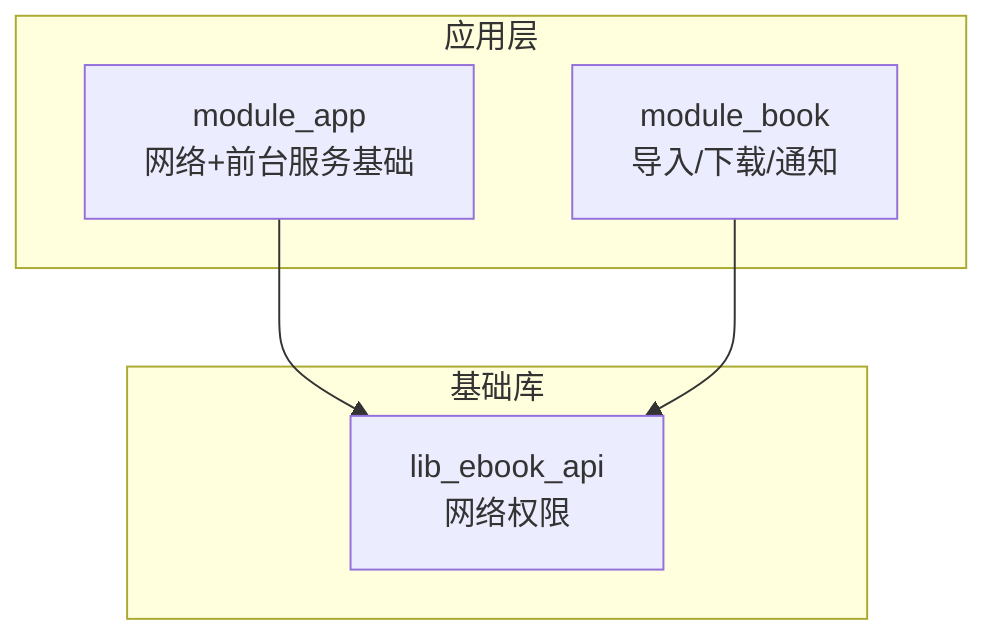
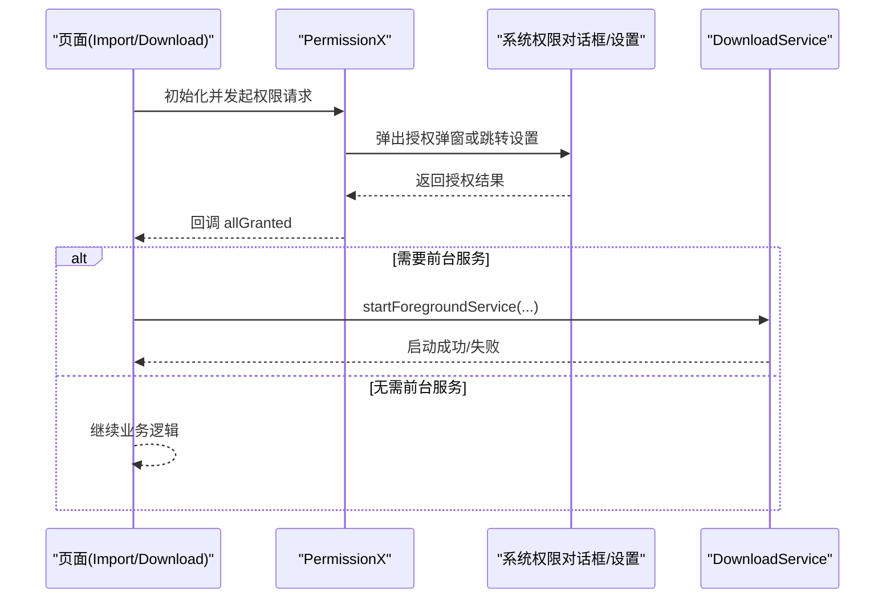
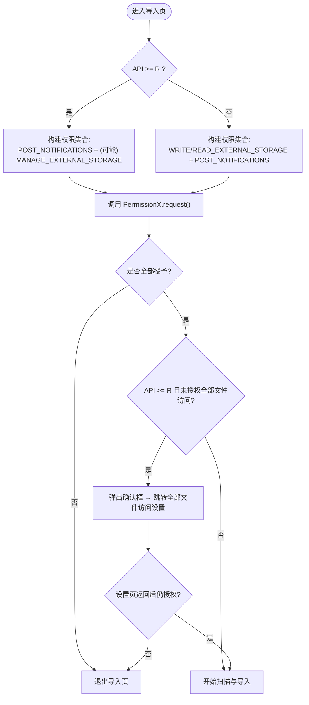
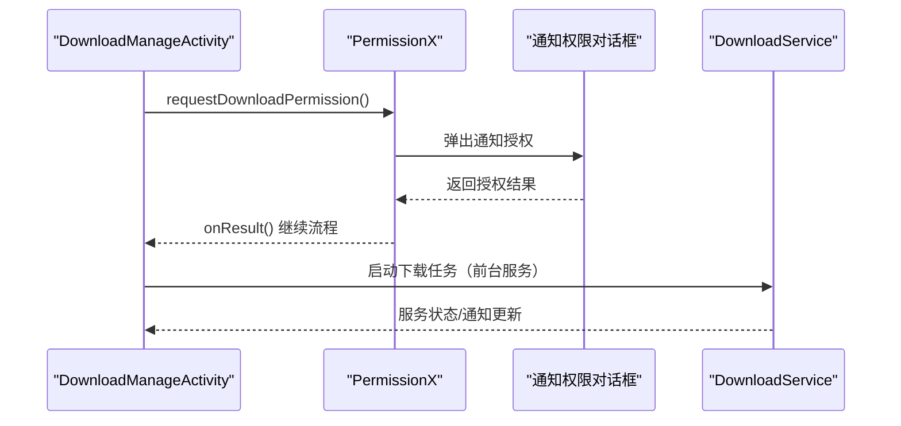
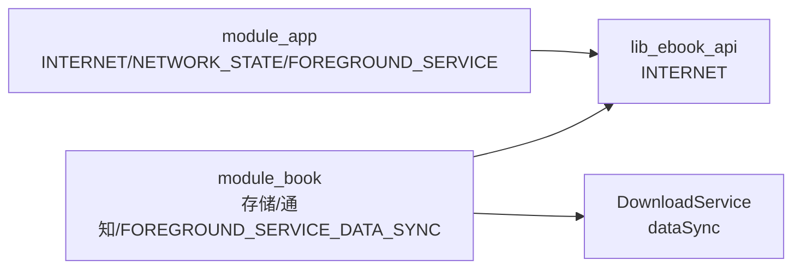

# 权限问题

<cite>
**本文引用的文件**
- [module_app/src/main/AndroidManifest.xml](file://module_app/src/main/AndroidManifest.xml)
- [module_book/src/main/AndroidManifest.xml](file://module_book/src/main/AndroidManifest.xml)
- [lib_ebook_api/src/main/AndroidManifest.xml](file://lib_ebook_api/src/main/AndroidManifest.xml)
- [docs/adr/0022-manifest-permission-minimization.md](file://docs/adr/0022-manifest-permission-minimization.md)
- [module_book/src/main/java/com/ebook/book/ImportBookActivity.kt](file://module_book/src/main/java/com/ebook/book/ImportBookActivity.kt)
- [module_book/src/main/java/com/ebook/book/DownloadManageActivity.kt](file://module_book/src/main/java/com/ebook/book/DownloadManageActivity.kt)
</cite>

## 目录
1. [简介](#简介)
2. [项目结构（与权限相关）](#项目结构与权限相关)
3. [核心组件](#核心组件)
4. [架构总览](#架构总览)
5. [详细组件分析](#详细组件分析)
6. [依赖关系分析](#依赖关系分析)
7. [性能考量](#性能考量)
8. [故障排查指南](#故障排查指南)
9. [结论](#结论)
10. [附录：权限清单与测试要点](#附录权限清单与测试要点)

## 简介
本指南聚焦于本项目中 Android 权限系统的运行机制、声明策略、运行时申请流程以及常见问题定位。内容覆盖存储权限、网络权限、前台服务权限与通知权限在工程中的使用点、申请时机、拒绝处理与回退逻辑，并结合 ADR 的“清单权限最小化”原则，说明如何做到“按需声明、按需申请、动态检查”。文末提供兼容性处理、用户引导、测试验证等实操建议。

## 项目结构（与权限相关）
本项目采用多模块架构，权限声明遵循“谁用谁声明”的最小化原则：
- module_app：仅声明网络与前台服务基础能力，不包含存储与通知权限。
- module_book：集中承载本地书导入、下载通知与前台服务等需要敏感权限的能力。
- lib_ebook_api：仅声明网络所需权限，作为底层 API 模块不引入业务权限。
- 其他模块（如 module_find、module_me）：按 ADR-0022 已清理为无多余权限声明。

图表来源
- [module_app/src/main/AndroidManifest.xml:1-43](file://module_app/src/main/AndroidManifest.xml#L1-L43)
- [module_book/src/main/AndroidManifest.xml:1-96](file://module_book/src/main/AndroidManifest.xml#L1-L96)
- [lib_ebook_api/src/main/AndroidManifest.xml:1-4](file://lib_ebook_api/src/main/AndroidManifest.xml#L1-L4)

章节来源
- [module_app/src/main/AndroidManifest.xml:1-43](file://module_app/src/main/AndroidManifest.xml#L1-L43)
- [module_book/src/main/AndroidManifest.xml:1-96](file://module_book/src/main/AndroidManifest.xml#L1-L96)
- [lib_ebook_api/src/main/AndroidManifest.xml:1-4](file://lib_ebook_api/src/main/AndroidManifest.xml#L1-L4)
- [docs/adr/0022-manifest-permission-minimization.md:1-53](file://docs/adr/0022-manifest-permission-minimization.md#L1-L53)

## 核心组件
- 权限声明最小化策略（ADR-0022）
  - 仅保留真正需要的权限项，删除历史遗留与未使用的权限。
  - 两份清单（集成与独立）保持逐条一致，避免差异导致的行为不一致。
- 运行时权限申请
  - 通过 PermissionX 统一封装解释、跳转设置页与请求回调。
  - 不同场景差异化处理：导入本地书需存储与通知；下载管理仅需通知提示。
- 前台服务与通知
  - DownloadService 声明 dataSync 类型以合法前台化。
  - POST_NOTIFICATIONS 用于展示下载进度通知，属于可选通道而非功能强依赖。

章节来源
- [docs/adr/0022-manifest-permission-minimization.md:12-47](file://docs/adr/0022-manifest-permission-minimization.md#L12-L47)
- [module_book/src/main/AndroidManifest.xml:16-30](file://module_book/src/main/AndroidManifest.xml#L16-L30)
- [module_book/src/main/java/com/ebook/book/DownloadManageActivity.kt:127-138](file://module_book/src/main/java/com/ebook/book/DownloadManageActivity.kt#L127-L138)

## 架构总览
权限在系统中的角色与流转如下：
- 声明阶段：各模块仅在自身清单中声明所需权限，合并后 APK 清单清晰可审。
- 运行阶段：页面在触发具体功能前进行权限检查与申请，必要时引导用户到系统设置。
- 服务阶段：前台服务按类型声明并配合通知权限保证体验。

图表来源
- [module_book/src/main/java/com/ebook/book/ImportBookActivity.kt:166-198](file://module_book/src/main/java/com/ebook/book/ImportBookActivity.kt#L166-L198)
- [module_book/src/main/java/com/ebook/book/DownloadManageActivity.kt:127-138](file://module_book/src/main/java/com/ebook/book/DownloadManageActivity.kt#L127-L138)
- [module_book/src/main/AndroidManifest.xml:39-42](file://module_book/src/main/AndroidManifest.xml#L39-L42)

## 详细组件分析

### 本地书籍导入页（ImportBookActivity）
- 权限需求
  - Android 11+：全部文件访问（MANAGE_EXTERNAL_STORAGE），通过 Settings 直达应用授权页。
  - Android 12L 及以下：WRITE/READ_EXTERNAL_STORAGE 回落路径。
  - 通知权限（POST_NOTIFICATIONS）：用于导入完成通知。
- 申请流程
  - 使用 PermissionX 统一解释与跳转设置。
  - Android 11+ 额外弹出 Compose 确认框，引导至全部文件访问设置。
  - 若最终未授权，回退退出导入流程。
- 兼容性与回退
  - 针对 per-app action 不可用的 ROM，回退到全量列表页。
  - 对低版本设备走传统存储权限申请。

图表来源
- [module_book/src/main/java/com/ebook/book/ImportBookActivity.kt:118-126](file://module_book/src/main/java/com/ebook/book/ImportBookActivity.kt#L118-L126)
- [module_book/src/main/java/com/ebook/book/ImportBookActivity.kt:166-198](file://module_book/src/main/java/com/ebook/book/ImportBookActivity.kt#L166-L198)
- [module_book/src/main/java/com/ebook/book/ImportBookActivity.kt:261-270](file://module_book/src/main/java/com/ebook/book/ImportBookActivity.kt#L261-L270)

章节来源
- [module_book/src/main/java/com/ebook/book/ImportBookActivity.kt:110-126](file://module_book/src/main/java/com/ebook/book/ImportBookActivity.kt#L110-L126)
- [module_book/src/main/java/com/ebook/book/ImportBookActivity.kt:166-198](file://module_book/src/main/java/com/ebook/book/ImportBookActivity.kt#L166-L198)
- [module_book/src/main/java/com/ebook/book/ImportBookActivity.kt:247-270](file://module_book/src/main/java/com/ebook/book/ImportBookActivity.kt#L247-L270)

### 下载管理页（DownloadManageActivity）
- 权限需求
  - 仅申请 POST_NOTIFICATIONS 用于下载进度通知，属于非阻塞通道。
- 申请策略
  - 打开下载管理页时申请通知权限，无论结果均回调继续业务。
  - 强调“拒绝通知不会阻断下载”，避免将通知作为下载前置门槛。
- 与前台服务协作
  - 下载服务声明 foregroundServiceType="dataSync"，合法前台化。
  - 通知权限缺失不影响服务启动，仅影响通知可见性。

图表来源
- [module_book/src/main/java/com/ebook/book/DownloadManageActivity.kt:127-138](file://module_book/src/main/java/com/ebook/book/DownloadManageActivity.kt#L127-L138)
- [module_book/src/main/AndroidManifest.xml:39-42](file://module_book/src/main/AndroidManifest.xml#L39-L42)

章节来源
- [module_book/src/main/java/com/ebook/book/DownloadManageActivity.kt:127-138](file://module_book/src/main/java/com/ebook/book/DownloadManageActivity.kt#L127-L138)
- [module_book/src/main/AndroidManifest.xml:39-42](file://module_book/src/main/AndroidManifest.xml#L39-L42)

### 清单权限最小化（ADR-0022）
- 原则
  - 每个模块只声明自己所需的权限，避免跨模块污染。
  - 两份清单（集成与独立）逐项对齐，确保行为一致。
  - 相机特性显式 required=false，避免误挡安装过滤。
- 落地
  - 合并后的 APK 清单仅保留必要权限，便于审计与合规。
  - 删除历史遗留（Wi-Fi、定位、电话、账号联系人、媒体读取等）。

章节来源
- [docs/adr/0022-manifest-permission-minimization.md:12-47](file://docs/adr/0022-manifest-permission-minimization.md#L12-L47)

## 依赖关系分析
- 模块间权限职责边界
  - module_app：INTERNET、ACCESS_NETWORK_STATE、FOREGROUND_SERVICE。
  - module_book：存储三项（MANAGE/WRITE/READ）、POST_NOTIFICATIONS、FOREGROUND_SERVICE_DATA_SYNC。
  - lib_ebook_api：INTERNET（基础网络能力）。
- 运行时权限与功能耦合
  - 导入本地书：存储权限 + 通知权限。
  - 下载管理：通知权限（非强依赖）。
  - 前台服务：需对应类型声明，否则无法合法前台化。

图表来源
- [module_app/src/main/AndroidManifest.xml:16-19](file://module_app/src/main/AndroidManifest.xml#L16-L19)
- [module_book/src/main/AndroidManifest.xml:16-29](file://module_book/src/main/AndroidManifest.xml#L16-L29)
- [lib_ebook_api/src/main/AndroidManifest.xml:3-4](file://lib_ebook_api/src/main/AndroidManifest.xml#L3-L4)
- [module_book/src/main/AndroidManifest.xml:39-42](file://module_book/src/main/AndroidManifest.xml#L39-L42)

章节来源
- [module_app/src/main/AndroidManifest.xml:16-19](file://module_app/src/main/AndroidManifest.xml#L16-L19)
- [module_book/src/main/AndroidManifest.xml:16-29](file://module_book/src/main/AndroidManifest.xml#L16-L29)
- [lib_ebook_api/src/main/AndroidManifest.xml:3-4](file://lib_ebook_api/src/main/AndroidManifest.xml#L3-L4)

## 性能考量
- 权限申请尽量延迟到用户操作触发时，避免冷启动阻塞。
- 通知权限为非阻塞通道，不应成为功能入口的前置门槛。
- 全部文件访问设置跳转需考虑 ROM 差异，快速回退减少卡顿。

## 故障排查指南
- 权限未生效
  - 核对合并清单是否包含目标权限（assembleDebug 后查看 merged_manifests）。
  - 检查是否在正确模块声明，避免被第三方库覆盖或遗漏。
- 权限申请弹窗不显示
  - 确认已在页面生命周期内调用 PermissionX.request。
  - 检查是否存在异常导致回调未执行。
- 权限被系统限制
  - 对于全部文件访问，ROM 可能不支持 per-app action，需回退到列表页。
  - 通知权限可在系统设置中手动开启。
- 前台服务启动失败
  - 确认已声明对应 foregroundServiceType（dataSync）。
  - 避免在主线程执行耗时操作，确保服务快速前台化。

章节来源
- [module_book/src/main/java/com/ebook/book/ImportBookActivity.kt:247-270](file://module_book/src/main/java/com/ebook/book/ImportBookActivity.kt#L247-L270)
- [module_book/src/main/AndroidManifest.xml:39-42](file://module_book/src/main/AndroidManifest.xml#L39-L42)

## 结论
本项目通过 ADR-0022 实现了清单权限最小化，并将运行时权限申请集中在导入与下载两个关键路径。通知权限作为非阻塞通道提升了用户体验，前台服务按类型声明保障稳定性。后续新增功能应遵循“按需声明、按需申请、动态检查”的原则，并在多模块间明确权限职责边界，确保合并清单简洁可审。

## 附录：权限清单与测试要点
- 清单权限清单
  - module_app：INTERNET、ACCESS_NETWORK_STATE、FOREGROUND_SERVICE。
  - module_book：MANAGE_EXTERNAL_STORAGE、WRITE_EXTERNAL_STORAGE、READ_EXTERNAL_STORAGE(maxSdk 32)、POST_NOTIFICATIONS、FOREGROUND_SERVICE_DATA_SYNC。
  - lib_ebook_api：INTERNET。
- 运行时权限申请点
  - 导入本地书：存储权限 + 通知权限 + 全部文件访问（Android 11+）。
  - 下载管理：通知权限（非阻塞）。
- 兼容性处理
  - Android 11+ 使用全部文件访问设置，支持 per-app action 与回退。
  - 低版本设备走传统存储权限申请。
- 用户引导
  - 使用 PermissionX 的解释与跳转设置能力，提升用户理解与成功率。
- 回退逻辑
  - 导入页在未授权时退出；下载页拒绝通知仍可继续下载。
- 测试验证
  - 在不同 Android 版本设备上验证权限申请与回退。
  - 校验合并清单中权限项是否符合预期。
  - 前台服务启动与通知显示在不同 ROM 上的表现。

章节来源
- [docs/adr/0022-manifest-permission-minimization.md:29-47](file://docs/adr/0022-manifest-permission-minimization.md#L29-L47)
- [module_book/src/main/java/com/ebook/book/ImportBookActivity.kt:118-126](file://module_book/src/main/java/com/ebook/book/ImportBookActivity.kt#L118-L126)
- [module_book/src/main/java/com/ebook/book/DownloadManageActivity.kt:127-138](file://module_book/src/main/java/com/ebook/book/DownloadManageActivity.kt#L127-L138)