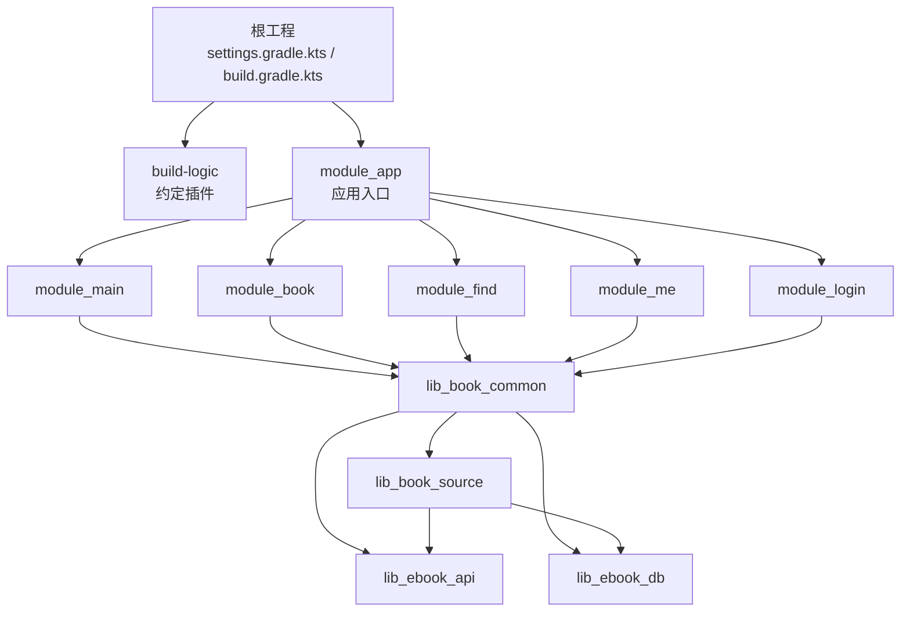
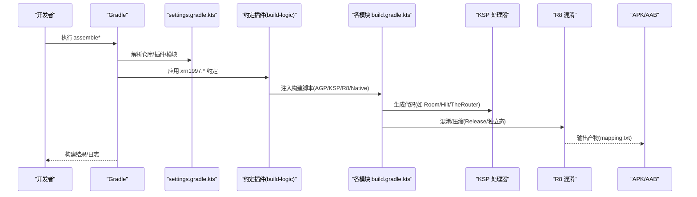
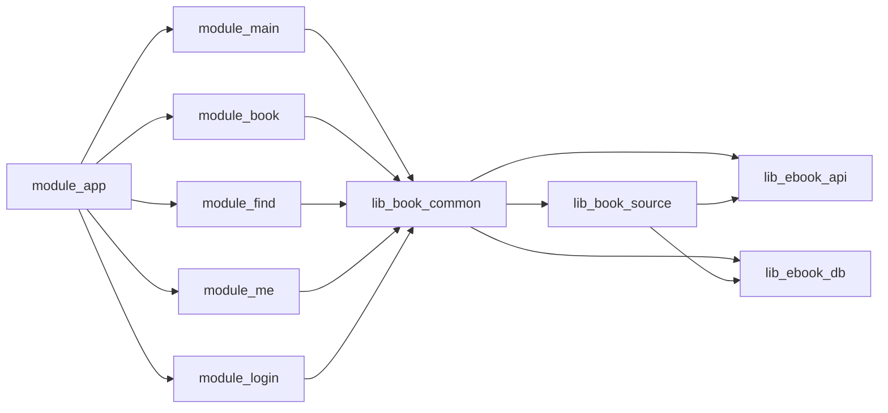

# 构建问题

<cite>
**本文引用的文件**
- [README.MD](file://README.MD)
- [gradle.properties](file://gradle.properties)
- [settings.gradle.kts](file://settings.gradle.kts)
- [build.gradle.kts](file://build.gradle.kts)
- [module_app/build.gradle.kts](file://module_app/build.gradle.kts)
- [gradle/libs.versions.toml](file://gradle/libs.versions.toml)
- [AGENTS.md](file://AGENTS.md)
- [docs/adr/0024-proguard-rules-overhaul.md](file://docs/adr/0024-proguard-rules-overhaul.md)
- [docs/adr/0028-untrusted-js-sandbox.md](file://docs/adr/0028-untrusted-js-sandbox.md)
</cite>

## 目录
1. [简介](#简介)
2. [项目结构与构建入口](#项目结构与构建入口)
3. [核心组件与约定](#核心组件与约定)
4. [架构总览](#架构总览)
5. [详细组件分析](#详细组件分析)
6. [依赖关系与冲突排查](#依赖关系与冲突排查)
7. [性能与缓存优化](#性能与缓存优化)
8. [故障排查指南](#故障排查指南)
9. [结论](#结论)
10. [附录：常用命令与排错清单](#附录：常用命令与排错清单)

## 简介
本指南面向 Android + Gradle（Kotlin DSL）多模块项目的构建问题排查，覆盖依赖冲突、版本不兼容、模块依赖、编译错误、资源合并、R8 混淆、NATIVE 库构建、独立模块模式（isModule）、TheRouter 路由表生成等常见问题，并提供可操作的诊断步骤与修复建议。

## 项目结构与构建入口
- 根工程通过 settings 声明所有子模块；根 build.gradle.kts 仅声明插件开关，实际构建逻辑下沉到 build-logic 约定插件与各模块的 build.gradle.kts。
- 应用入口为 module_app，支持 real/mock 双 flavor，集成态下依赖多个功能模块；独立开发时可通过 isModule=true 让功能模块以独立 App 运行。
- 工具链与依赖版本集中在 gradle/libs.versions.toml；Gradle Wrapper、仓库源、插件解析在 settings.gradle.kts 中集中配置。

图表来源
- [settings.gradle.kts:55-65](file://settings.gradle.kts#L55-L65)
- [module_app/build.gradle.kts:52-58](file://module_app/build.gradle.kts#L52-L58)

章节来源
- [settings.gradle.kts:1-65](file://settings.gradle.kts#L1-L65)
- [build.gradle.kts:1-15](file://build.gradle.kts#L1-L15)
- [module_app/build.gradle.kts:1-65](file://module_app/build.gradle.kts#L1-L65)

## 核心组件与约定
- AGP 内置 Kotlin：Android 模块不再单独应用 Kotlin 插件，Kotlin 能力由 AGP 提供；顶层 kotlin { compilerOptions {} } 仍可用。
- 版本目录统一：所有依赖与插件版本通过 libs.versions.toml 管理，避免散落硬编码。
- 双 flavor：real 连接真实后端，mock 使用内存数据源，便于无后端开发调试。
- 独立模块模式：isModule=true 时，各业务模块可作为独立 App 运行，便于单模块快速验证；提交态必须为 false。
- 混淆规则：release 开启 R8；consumer-rules.pro 作为唯一规则来源随 AAR 传播；proguard-rules.pro 仅在独立态执行 R8 时使用。
- Native 构建：lib_book_source 包含 QuickJS 引擎与 JNI 桥，通过 build-logic 的 native 约定插件进行 CMake/NDK 构建。

章节来源
- [AGENTS.md:1-200](file://AGENTS.md#L1-L200)
- [gradle/libs.versions.toml:1-238](file://gradle/libs.versions.toml#L1-L238)
- [docs/adr/0024-proguard-rules-overhaul.md:1-32](file://docs/adr/0024-proguard-rules-overhaul.md#L1-L32)
- [docs/adr/0028-untrusted-js-sandbox.md:1-66](file://docs/adr/0028-untrusted-js-sandbox.md#L1-L66)

## 架构总览
下图展示从 Gradle 解析到模块编译、混淆、打包的整体流程，以及关键配置点。

图表来源
- [settings.gradle.kts:1-43](file://settings.gradle.kts#L1-L43)
- [build.gradle.kts:1-15](file://build.gradle.kts#L1-L15)
- [module_app/build.gradle.kts:27-35](file://module_app/build.gradle.kts#L27-L35)
- [gradle/libs.versions.toml:214-238](file://gradle/libs.versions.toml#L214-L238)

## 详细组件分析

### 依赖与版本管理（libs.versions.toml）
- 作用：集中定义 AGP、Kotlin、Compose、Hilt、Room、Retrofit、OkHttp、TheRouter、Router 插件等版本。
- 常见风险：
  - AGP/Kotlin 版本不同步导致内置 Kotlin 行为不一致。
  - 第三方库版本过旧或与新 AGP/KSP 不兼容，出现类缺失、注解处理器异常。
  - 未通过版本目录引入导致重复定义与难以维护。

章节来源
- [gradle/libs.versions.toml:1-238](file://gradle/libs.versions.toml#L1-L238)

### 模块依赖与独立模式（isModule）
- 集成态（isModule=false）：module_app 依赖全部功能模块，产出完整应用。
- 独立态（isModule=true）：功能模块自身作为 App 运行，便于单模块调试；此时 module_app 不依赖功能模块。
- 注意事项：
  - 不要在命令行用 -PisModule=true 覆盖，会渗入 includeBuild(lib-common-build)，导致 lib_common 被错误套上 application 插件而失败。
  - 提交态必须为 false，否则集成构建产出的 app 为空壳。

章节来源
- [gradle.properties:21-30](file://gradle.properties#L21-L30)
- [module_app/build.gradle.kts:47-58](file://module_app/build.gradle.kts#L47-L58)

### 双 Flavor（real/mock）
- real：连接真实后端；mock：使用内存数据源，无需后端即可运行。
- 构建命令示例见 README；注意 local.properties 中 ebook.server.host 的配置对 real 模式有效。

章节来源
- [README.MD:60-84](file://README.MD#L60-L84)

### 混淆与规则（R8/ProGuard）
- Release 构建开启混淆；consumer-rules.pro 是唯一规则来源，随 AAR 传播；proguard-rules.pro 用于独立态执行 R8。
- 常见陷阱：
  - 功能模块在集成态开启 minify 会导致提前剥离类，造成 Missing class 错误；应关闭集成态功能模块的 R8。
  - TheRouter 反射面需 keep；JNI 入口（HostDispatcher.handle）需显式 keep，否则 release 包加载失败。
  - 行号属性只放 module_app，配合 mapping.txt 还原崩溃栈。

章节来源
- [docs/adr/0024-proguard-rules-overhaul.md:1-32](file://docs/adr/0024-proguard-rules-overhaul.md#L1-L32)
- [module_app/build.gradle.kts:27-35](file://module_app/build.gradle.kts#L27-L35)

### Native 构建（QuickJS + JNI）
- lib_book_source 包含 vendored QuickJS 与 JNI 桥，通过 build-logic 的 native 约定插件统一 NDK/CMake/ABI 策略。
- 风险点：
  - ABI 差异导致模拟器/真机无法加载 .so。
  - NDK/CMake 版本漂移导致不可复现构建。
  - HostDispatcher 类名被混淆导致运行时找不到入口。

章节来源
- [docs/adr/0028-untrusted-js-sandbox.md:37-44](file://docs/adr/0028-untrusted-js-sandbox.md#L37-L44)
- [gradle/libs.versions.toml:5-9](file://gradle/libs.versions.toml#L5-L9)

### TheRouter 路由表生成
- 通过 therouter 插件参与编译期扫描，生成路由映射；独立模式下跨模块路由可能静默丢失，需在测试宿主补占位。
- 变更 @Route 后需二次构建使 routeMap 生效。

章节来源
- [AGENTS.md:1-200](file://AGENTS.md#L1-L200)
- [gradle/libs.versions.toml:195-227](file://gradle/libs.versions.toml#L195-L227)

## 依赖关系与冲突排查

### 常见症状与定位思路
- 依赖冲突
  - 现象：编译报类缺失/重复类/方法签名不一致。
  - 定位：查看依赖树（Gradle Module Graph），确认是否有多版本传递引入；统一到版本目录。
  - 处理：在 libs.versions.toml 升级/对齐版本，必要时在模块内排除冲突传递依赖。
- 版本不兼容
  - 现象：KSP/AGP/Kotlin 组合报错，或注解处理器无法生成代码。
  - 处理：按 libs.versions.toml 中的版本矩阵升级，确保 AGP 内置 Kotlin 与 KSP/Kotlin 版本匹配。
- 模块依赖问题
  - 现象：独立态能编，集成态报 Missing class；或反过来。
  - 处理：检查 isModule 与模块依赖分支；确认 consumer-rules.pro/proguard-rules.pro 的使用场景。

章节来源
- [gradle/libs.versions.toml:1-238](file://gradle/libs.versions.toml#L1-L238)
- [module_app/build.gradle.kts:47-58](file://module_app/build.gradle.kts#L47-L58)
- [docs/adr/0024-proguard-rules-overhaul.md:1-32](file://docs/adr/0024-proguard-rules-overhaul.md#L1-L32)

### 依赖图可视化（示意）

图表来源
- [settings.gradle.kts:55-65](file://settings.gradle.kts#L55-L65)
- [module_app/build.gradle.kts:47-58](file://module_app/build.gradle.kts#L47-L58)

## 性能与缓存优化
- 增量构建：启用 KSP 增量与 intermodule 日志，减少全量编译时间。
- 并行构建：合理设置 org.gradle.parallel（默认已开启）与守护进程内存。
- 清理无效缓存：定期清理 .gradle 与 build 目录，避免历史产物干扰。

章节来源
- [gradle.properties:16-20](file://gradle.properties#L16-L20)
- [gradle.properties:30-36](file://gradle.properties#L30-L36)

## 故障排查指南

### 一、依赖冲突
- 症状：重复类、方法签名不一致、Missing class。
- 步骤：
  1) 打开 Gradle Module Graph 查看依赖树；
  2) 将相关依赖统一到 libs.versions.toml；
  3) 必要时在模块内 exclude 冲突传递依赖；
  4) 重新同步并 clean 构建。
- 预防：禁止在模块内硬编码版本号；新增依赖先查版本矩阵。

章节来源
- [gradle/libs.versions.toml:1-238](file://gradle/libs.versions.toml#L1-L238)

### 二、版本不兼容（AGP/Kotlin/KSP）
- 症状：KSP 不生成代码、注解处理器异常、内置 Kotlin 行为不一致。
- 步骤：
  1) 核对 AGP/Kotlin/KSP 版本是否在 libs.versions.toml 一致；
  2) 保持 AGP 内置 Kotlin 特性不变（不手动开 builtInKotlin/newDsl）；
  3) 更新后 clean 构建并检查 KSP 任务输出。
- 预防：升级前阅读 AGP/Kotlin 发布说明，关注 breaking changes。

章节来源
- [gradle/libs.versions.toml:1-238](file://gradle/libs.versions.toml#L1-L238)
- [AGENTS.md:1-200](file://AGENTS.md#L1-L200)

### 三、模块依赖问题（集成/独立态）
- 症状：独立态正常，集成态报 Missing class；或集成态正常，独立态启动失败。
- 步骤：
  1) 确认 isModule 值正确（提交态必须 false）；
  2) 检查 module_app 是否依赖功能模块（集成态）；
  3) 核对 consumer-rules.pro/proguard-rules.pro 使用场景；
  4) 对于 TheRouter，确保独立态有占位路由。
- 预防：遵循 isModule 约定，不在命令行覆盖。

章节来源
- [gradle.properties:21-30](file://gradle.properties#L21-L30)
- [module_app/build.gradle.kts:47-58](file://module_app/build.gradle.kts#L47-L58)
- [AGENTS.md:1-200](file://AGENTS.md#L1-L200)

### 四、Kotlin 编译错误
- 症状：类型推断失败、协程 API 不匹配、Composable 参数不合法。
- 步骤：
  1) 查看具体报错行，确认 Kotlin 版本与依赖；
  2) 若涉及 Compose，检查 compose BOM 与编译器版本；
  3) 清理并重建，排除缓存影响。
- 预防：统一通过版本目录管理 Kotlin/Compose 版本。

章节来源
- [gradle/libs.versions.toml:1-238](file://gradle/libs.versions.toml#L1-L238)

### 五、Android 资源编译错误
- 症状：资源 ID 冲突、合并失败、命名不规范。
- 步骤：
  1) 检查 res 命名与重复资源；
  2) 查看合并后的 Manifest 与资源列表；
  3) 清理 build 目录并重试。
- 预防：遵循 AndroidX 资源命名规范，避免跨模块重复资源。

章节来源
- [AGENTS.md:1-200](file://AGENTS.md#L1-L200)

### 六、R8 混淆规则缺失
- 症状：release 包崩溃、反射调用失败、TheRouter 路由失效。
- 步骤：
  1) 根据 mapping.txt 定位被混淆的类；
  2) 在 consumer-rules.pro 添加 keep 规则；
  3) 独立态 release 构建尽早暴露规则缺口。
- 预防：新增反射面前先查依赖自带规则，避免重复 keep。

章节来源
- [docs/adr/0024-proguard-rules-overhaul.md:1-32](file://docs/adr/0024-proguard-rules-overhaul.md#L1-L32)
- [module_app/build.gradle.kts:27-35](file://module_app/build.gradle.kts#L27-L35)

### 七、NATIVE 库构建失败
- 症状：.so 加载失败、模拟器/真机 ABI 不匹配、NDK/CMake 版本漂移。
- 步骤：
  1) 固定 NDK/CMake 版本（版本目录）；
  2) 调整 ABI 集合（debug 加 x86_64 以便模拟器）；
  3) 检查混淆是否影响 JNI 入口（HostDispatcher）。
- 预防：native 构建改动需在不同 ABI 上验证。

章节来源
- [docs/adr/0028-untrusted-js-sandbox.md:37-44](file://docs/adr/0028-untrusted-js-sandbox.md#L37-L44)
- [gradle/libs.versions.toml:5-9](file://gradle/libs.versions.toml#L5-L9)

### 八、独立模块构建问题（isModule、清单合并、TheRouter）
- isModule 设置不当：导致集成态空壳或独立态依赖缺失。
- 清单合并冲突：两份 Manifest 不同步，导致 Activity/权限不一致。
- TheRouter 路由表未生效：@Route 变更后需二次构建；独立态缺路由占位。

章节来源
- [gradle.properties:21-30](file://gradle.properties#L21-L30)
- [AGENTS.md:1-200](file://AGENTS.md#L1-L200)

### 九、构建命令与调试技巧
- 常用命令
  - 构建整个项目：./gradlew build
  - 构建指定模块（debug）：./gradlew :module_app:assembleDebug
  - 清理构建：./gradlew clean build
  - 生成 release APK：./gradlew :module_app:assembleRelease
  - 单元测试：./gradlew test
  - 集成测试：./gradlew connectedAndroidTest
  - Lint 检查：./gradlew lint
- 日志与缓存
  - 使用 --info/--debug 获取更详细日志；
  - 遇到缓存问题，清理 .gradle 与 build 目录；
  - 修改 @Route 后，再次构建使路由表生效。

章节来源
- [AGENTS.md:1-200](file://AGENTS.md#L1-L200)
- [README.MD:60-84](file://README.MD#L60-L84)

## 结论
- 通过集中化的版本目录与约定插件，项目构建了稳定一致的基线；
- 独立模块模式与双 flavor 提升了开发效率，但需严格遵守 isModule 与 flavor 约定；
- 混淆与 Native 构建是高风险区域，需结合 mapping.txt 与 ABI/NDK 策略进行专项验证；
- 建议将构建问题纳入团队共识：版本变更需回归验证，反射/JNI 变更需补充规则与用例。

## 附录：常用命令与排错清单
- 常用命令
  - ./gradlew build
  - ./gradlew :module_app:assembleDebug
  - ./gradlew clean build
  - ./gradlew :module_app:assembleRelease
  - ./gradlew test
  - ./gradlew connectedAndroidTest
  - ./gradlew lint
- 排错清单
  - 检查 isModule 值与模块依赖分支；
  - 核对 libs.versions.toml 版本矩阵；
  - 查看 Gradle Module Graph 定位依赖冲突；
  - 检查 consumer-rules.pro/proguard-rules.pro 使用场景；
  - 确认 TheRouter 路由表已二次构建；
  - 清理 .gradle 与 build 目录重试；
  - 使用 --info/--debug 查看详细日志。

章节来源
- [AGENTS.md:1-200](file://AGENTS.md#L1-L200)
- [README.MD:60-84](file://README.MD#L60-L84)