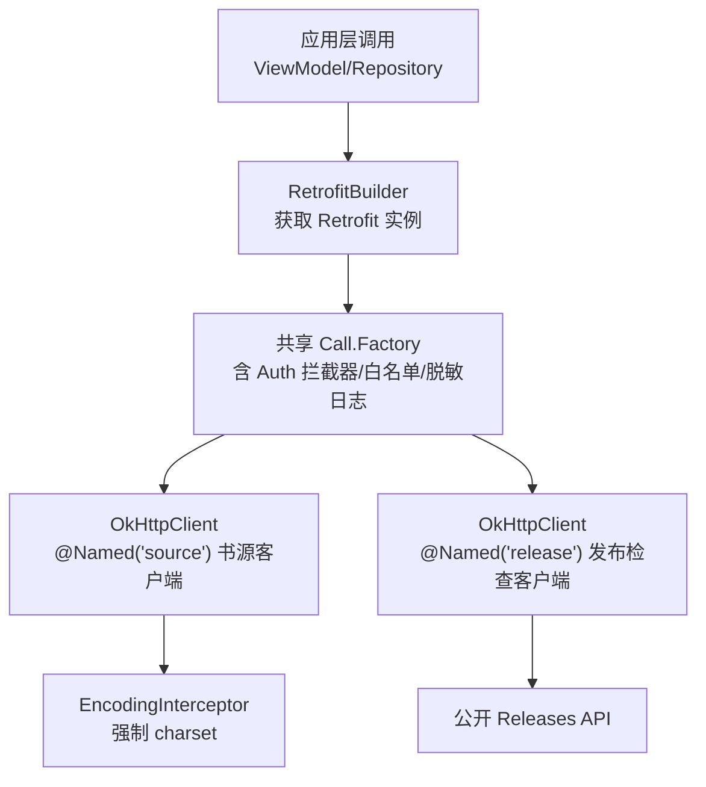
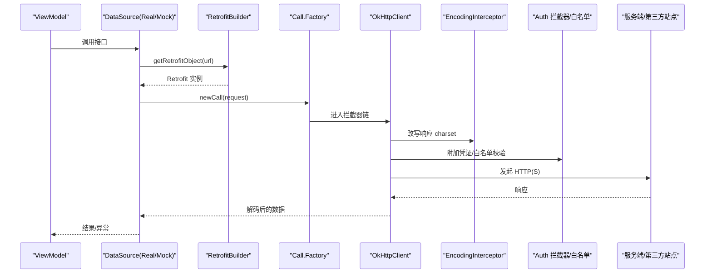
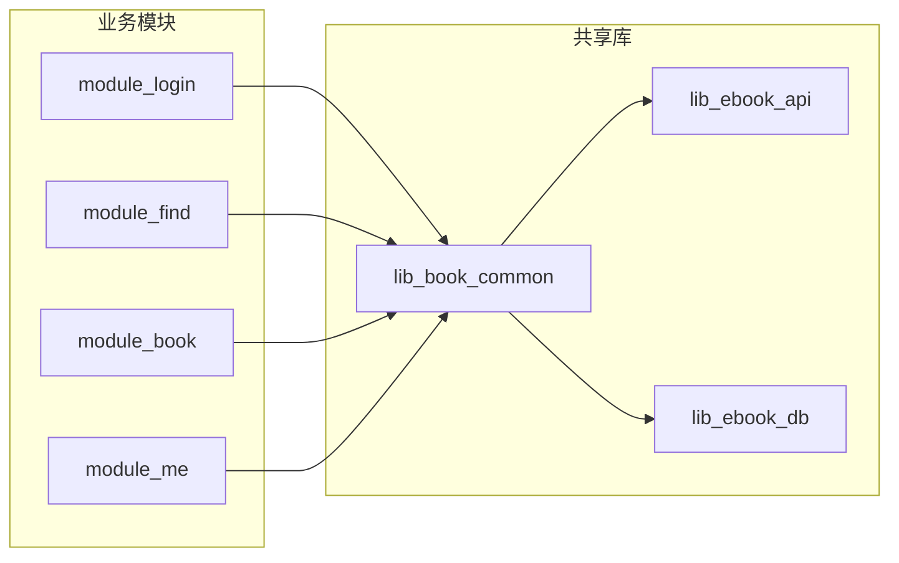
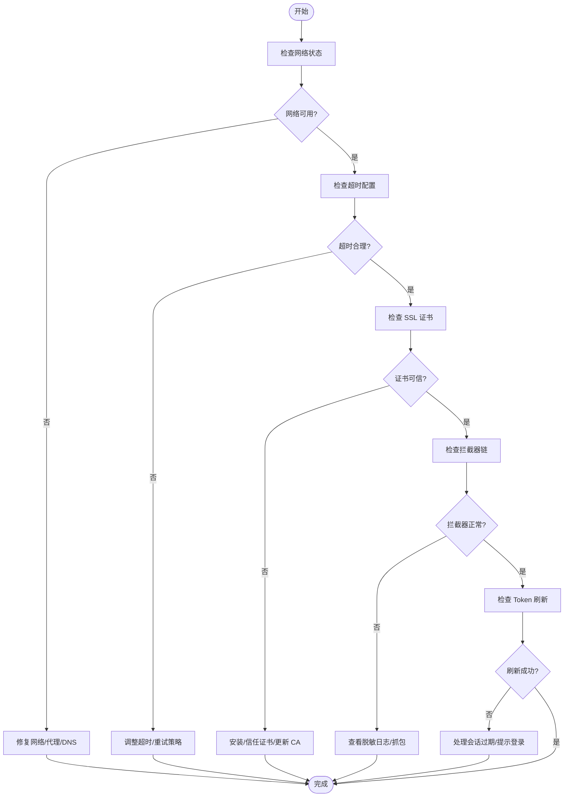

# 网络问题

<cite>
**本文引用的文件**
- [RetrofitBuilder.kt](file://lib_ebook_api/src/main/java/com/ebook/api/RetrofitBuilder.kt)
- [NetworkModule.kt（lib_ebook_api）](file://lib_ebook_api/src/main/java/com/ebook/api/utils/NetworkModule.kt)
- [EncodingInterceptor.kt](file://lib_ebook_api/src/main/java/com/ebook/api/intercepter/EncodingInterceptor.kt)
- [SessionTokenRefresher.kt](file://lib_book_common/src/main/java/com/ebook/common/domain/SessionTokenRefresher.kt)
- [NetworkModule.kt（module_app real）](file://module_app/src/real/java/com/ebook/di/NetworkModule.kt)
- [NetworkModule.kt（module_app mock）](file://module_app/src/mock/java/com/ebook/di/NetworkModule.kt)
- [ReleaseNetwork.kt](file://lib_ebook_api/src/main/java/com/ebook/api/service/release/ReleaseNetwork.kt)
- [UserNetworkTest.kt](file://lib_ebook_api/src/main/java/com/ebook/api/service/user/UserNetworkTest.kt)
- [CommentNetworkTest.kt](file://lib_ebook_api/src/main/java/com/ebook/api/service/comment/CommentNetworkTest.kt)
- [AGENTS.md](file://AGENTS.md)
</cite>

## 目录
1. [简介](#简介)
2. [项目结构](#项目结构)
3. [核心组件](#核心组件)
4. [架构总览](#架构总览)
5. [详细组件分析](#详细组件分析)
6. [依赖关系分析](#依赖关系分析)
7. [性能考量](#性能考量)
8. [故障排查指南](#故障排查指南)
9. [结论](#结论)
10. [附录：调试与最佳实践](#附录：调试与最佳实践)

## 简介
本指南聚焦网络问题的诊断与修复，覆盖连接失败、超时、SSL 证书验证、HTTP 请求失败常见原因（服务器无响应、DNS 解析失败、代理配置错误、防火墙拦截），并基于仓库中 Retrofit/OkHttp 实现、拦截器、认证 token 管理与刷新机制，给出可操作的排查步骤、工具方法和问题定位要点。同时提供本地开发环境配置建议、HTTPS 证书问题处理、跨域请求注意事项以及性能优化建议。

## 项目结构
本项目采用多模块架构，网络能力集中在 lib_ebook_api，业务通过 module_app 的 flavor 切换真实或 mock 后端；会话与鉴权逻辑下沉到 lib_book_common。关键路径如下：
- Retrofit 构建：统一复用共享 Call.Factory，避免重复创建 OkHttpClient，确保 debug 脱敏日志与白名单生效
- OkHttp 客户端：区分“书源”“发布检查”两类纯净客户端，均不带用户 token
- 编码拦截器：统一修正第三方站点返回的 Content-Type/字符集，避免中文乱码
- Token 静默刷新：单飞互斥，失败上报会话过期事件，由上层统一处置

**图表来源**
- [RetrofitBuilder.kt:13-45](file://lib_ebook_api/src/main/java/com/ebook/api/RetrofitBuilder.kt#L13-L45)
- [NetworkModule.kt（lib_ebook_api）:35-72](file://lib_ebook_api/src/main/java/com/ebook/api/utils/NetworkModule.kt#L35-L72)
- [EncodingInterceptor.kt:10-51](file://lib_ebook_api/src/main/java/com/ebook/api/intercepter/EncodingInterceptor.kt#L10-L51)

**章节来源**
- [RetrofitBuilder.kt:13-45](file://lib_ebook_api/src/main/java/com/ebook/api/RetrofitBuilder.kt#L13-L45)
- [NetworkModule.kt（lib_ebook_api）:35-72](file://lib_ebook_api/src/main/java/com/ebook/api/utils/NetworkModule.kt#L35-L72)
- [EncodingInterceptor.kt:10-51](file://lib_ebook_api/src/main/java/com/ebook/api/intercepter/EncodingInterceptor.kt#L10-L51)

## 核心组件
- Retrofit 构建器：使用注入的 Json 转换器与 Scalars 转换器，并通过共享 Call.Factory 注入 OkHttp 客户端，避免循环依赖与重复初始化
- OkHttp 客户端：
  - 书源客户端：短超时（10s）、添加编码拦截器、不携带 token
  - 发布检查客户端：仅访问 ASCII JSON 的公开 Releases API，同样不带 token
- 编码拦截器：将响应体 contentType 强制改写为指定 charset，避免第三方站点 charset 缺失导致的中文乱码
- Token 静默刷新：冷启动/并发场景下单飞互斥刷新 refresh token，成功则轮换并存入内存与持久化，失败则上报会话过期事件

**章节来源**
- [RetrofitBuilder.kt:13-45](file://lib_ebook_api/src/main/java/com/ebook/api/RetrofitBuilder.kt#L13-L45)
- [NetworkModule.kt（lib_ebook_api）:44-71](file://lib_ebook_api/src/main/java/com/ebook/api/utils/NetworkModule.kt#L44-L71)
- [EncodingInterceptor.kt:10-51](file://lib_ebook_api/src/main/java/com/ebook/api/intercepter/EncodingInterceptor.kt#L10-L51)
- [SessionTokenRefresher.kt:15-96](file://lib_book_common/src/main/java/com/ebook/common/domain/SessionTokenRefresher.kt#L15-L96)

## 架构总览
下图展示了从 UI/VM 发起网络请求到 OkHttp 执行的完整链路，包括拦截器链、认证与刷新、以及不同客户端的职责边界。

**图表来源**
- [RetrofitBuilder.kt:25-44](file://lib_ebook_api/src/main/java/com/ebook/api/RetrofitBuilder.kt#L25-L44)
- [NetworkModule.kt（lib_ebook_api）:44-71](file://lib_ebook_api/src/main/java/com/ebook/api/utils/NetworkModule.kt#L44-L71)
- [EncodingInterceptor.kt:27-51](file://lib_ebook_api/src/main/java/com/ebook/api/intercepter/EncodingInterceptor.kt#L27-L51)

## 详细组件分析

### Retrofit 与 OkHttp 配置
- Retrofit 构建时优先注册 kotlinx 序列化转换器，再挂 Scalars 转换器，保证 @Serializable 与 String 类型均可正确解析
- 通过 `callFactory` 复用共享 Call.Factory，避免每个 Network 类自建 OkHttpClient，确保统一的 debug 脱敏日志、白名单与超时策略
- 书源与发布检查分别使用独立的 OkHttpClient，遵循“不带 token”的隔离原则

**章节来源**
- [RetrofitBuilder.kt:25-44](file://lib_ebook_api/src/main/java/com/ebook/api/RetrofitBuilder.kt#L25-L44)
- [NetworkModule.kt（lib_ebook_api）:44-71](file://lib_ebook_api/src/main/java/com/ebook/api/utils/NetworkModule.kt#L44-L71)

### 编码拦截器
- 目的：第三方站点返回的 Content-Type 可能缺少 charset 或声明错误，导致中文正文乱码
- 实现：通过公开 API 包装 ResponseBody，强制设置 charset，流式透传，避免全量缓冲
- 适用场景：所有书源 HTML 抓取，尤其是非 UTF-8 站点

**章节来源**
- [EncodingInterceptor.kt:10-51](file://lib_ebook_api/src/main/java/com/ebook/api/intercepter/EncodingInterceptor.kt#L10-L51)

### 认证与 Token 刷新
- 设计要点：
  - 单飞互斥：使用 Mutex 串行化刷新，避免并发刷新的竞态与旧 refresh 被服务端删除导致的失败
  - 冷启动为空：access token 只驻内存，冷启动时无法比较触发值，但并发保护仍有效
  - 刷新失败：记录日志并返回空，上层根据业务统一处理（如提示登录）
  - 轮换存储：新 access token 进内存，refresh token 落盘，身份字段不重建，避免覆盖昵称/头像
- 影响范围：所有需要认证的接口在调用前由上层拦截器链处理，若 A0230 过期，先静默刷新并重放一次请求

**章节来源**
- [SessionTokenRefresher.kt:15-96](file://lib_book_common/src/main/java/com/ebook/common/domain/SessionTokenRefresher.kt#L15-L96)

### Flavor 切换与 Mock/Real 绑定
- Real flavor：User/Comment/Release 数据源绑定到真实后端实现
- Mock flavor：绑定到内存 mock 实现，载荷来自 assets 的 JSON，无需后端即可联调
- Release 检查在 mock 下走固定资产，避免 CI/离线开发对外网可达性的依赖

**章节来源**
- [NetworkModule.kt（module_app real）:14-35](file://module_app/src/real/java/com/ebook/di/NetworkModule.kt#L14-L35)
- [NetworkModule.kt（module_app mock）:14-37](file://module_app/src/mock/java/com/ebook/di/NetworkModule.kt#L14-L37)

## 依赖关系分析
- 模块依赖方向：业务模块 → lib_book_common → lib_ebook_api/lib_ebook_db
- 网络层职责：
  - lib_ebook_api：Retrofit/OkHttp 配置、服务接口、实体、拦截器
  - lib_book_common：会话管理、Token 刷新、通用工具
  - module_app：按 flavor 装配 DataSource 实现

**图表来源**
- [AGENTS.md](file://AGENTS.md)

**章节来源**
- [AGENTS.md](file://AGENTS.md)

## 性能考量
- 超时配置：
  - 书源客户端：连接/写入/读取均为 10s，快速失败减少阻塞
  - 发布检查客户端：连接/读取 10s，针对公开 API 优化
- 流式处理：编码拦截器以流式方式重写响应体，避免大响应全量缓冲
- 去重与缓存：列表分页按 noteUrl 去重，避免重复条目；书城缓存 TTL 6h，下拉强刷走明确策略（见仓库约定）
- 重试策略：当前未内置通用重试拦截器，建议在业务层按需重试（幂等 GET）并限制次数

[本节为通用指导，不直接分析具体文件]

## 故障排查指南

### 网络连接失败的诊断方法
- 网络状态检测
  - 观察是否处于飞行模式/无网络/受限网络
  - 确认本机 IP 与端口映射（例如 adb reverse 映射本机后端）
  - 确认 Android 版本对本地网络的权限要求（targetSdk 37 起 10.0.0.0/8、192.168.0.0/16 等需运行时权限；本项目不申请，建议使用 127.0.0.1 或公网 IP）
- 连接超时处理
  - 书源客户端 10s 超时，若频繁超时，检查目标站点的延迟与稳定性
  - 发布检查客户端 10s 超时，若 GitHub/Gitcode 不可达，考虑代理或网络质量
- SSL 证书验证问题
  - 若自签证书或企业 CA，需在设备信任该证书或调整客户端信任策略（谨慎操作）
  - 注意 HTTPS 握手阶段的 DNS 解析与 TLS 版本兼容性

**章节来源**
- [NetworkModule.kt（lib_ebook_api）:44-71](file://lib_ebook_api/src/main/java/com/ebook/api/utils/NetworkModule.kt#L44-L71)
- [AGENTS.md](file://AGENTS.md)

### HTTP 请求失败的常见原因
- 服务器无响应
  - 症状：超时、连接被拒
  - 排查：确认服务端健康、端口开放、负载均衡与健康检查
- DNS 解析失败
  - 症状：域名无法解析
  - 排查：检查设备 DNS 设置、运营商 DNS、是否启用 DoH/DoT；必要时切换网络或使用 hosts
- 代理配置错误
  - 症状：请求被代理拒绝或转发失败
  - 排查：系统代理/应用代理设置、代理地址与端口、认证信息
- 防火墙拦截
  - 症状：特定域名/IP 被阻断
  - 排查：企业防火墙策略、路由器 ACL、安全软件拦截

[本节为通用指导，不直接分析具体文件]

### 网络层关键组件的问题定位
- Retrofit 配置
  - 确认 baseUrl 是否正确注入（BuildConfig.EBOOK_SERVER_HOST）
  - 确认转换器是否注册（kotlinx serialization + Scalars）
- OkHttp 拦截器
  - 编码拦截器是否生效（Content-Type 是否被强制为预期 charset）
  - 认证拦截器是否按白名单附加 token（仅 ebook-server host）
- 认证 token 管理
  - 冷启动空 token 时的静默刷新流程是否正常
  - refresh token 失效或被服务端删除时的处理
- 请求重试机制
  - 当前未内置通用重试，幂等 GET 可在业务层增加重试与退避

**章节来源**
- [RetrofitBuilder.kt:25-44](file://lib_ebook_api/src/main/java/com/ebook/api/RetrofitBuilder.kt#L25-L44)
- [NetworkModule.kt（lib_ebook_api）:44-71](file://lib_ebook_api/src/main/java/com/ebook/api/utils/NetworkModule.kt#L44-L71)
- [SessionTokenRefresher.kt:15-96](file://lib_book_common/src/main/java/com/ebook/common/domain/SessionTokenRefresher.kt#L15-L96)

### 调试工具与方法
- 网络抓包
  - 使用 Charles/Fiddler/mitmproxy 进行抓包，注意 HTTPS 需安装证书
  - 移动端抓包需注意证书固定与系统信任链
- 请求日志分析
  - 利用共享 Call.Factory 的 debug 脱敏日志，查看请求头/体（注意敏感信息已脱敏）
  - 关注拦截器链的执行顺序与响应体 charset
- 响应数据检查
  - 对比 mock 资产与服务端响应结构一致性（RespDTO 信封、字段命名）
  - 确认 JSON 解析是否忽略未知字段（ignoreUnknownKeys=true）

**章节来源**
- [RetrofitBuilder.kt:13-45](file://lib_ebook_api/src/main/java/com/ebook/api/RetrofitBuilder.kt#L13-L45)
- [NetworkModule.kt（lib_ebook_api）:22-27](file://lib_ebook_api/src/main/java/com/ebook/api/utils/NetworkModule.kt#L22-L27)

### 具体问题解决方案
- 本地开发环境配置
  - 使用 adb reverse 映射本机后端端口，或通过 127.0.0.1 访问
  - BuildConfig 注入 ebook.server.host，避免硬编码
- HTTPS 证书问题
  - 生产环境使用可信 CA；测试环境可使用自签证书并在设备信任
  - 注意 TLS 版本与 cipher suite 兼容性
- 跨域请求处理
  - 移动端一般不受 CORS 限制，但服务端需正确设置响应头
  - 注意 Cookie/凭证跨域策略（如需跨域携带凭证）

**章节来源**
- [AGENTS.md](file://AGENTS.md)

## 结论
本项目网络层通过 Retrofit+OkHttp 的统一构建与拦截器链，实现了书源与发布检查的隔离、编码统一修正、认证 token 的静默刷新与失败上报。排查网络问题时，应优先从连接超时、DNS/代理/防火墙、SSL 证书、拦截器链执行顺序与日志入手，并结合 mock/real flavor 切换进行对比验证。结合本指南的诊断步骤与工具方法，可高效定位并解决大多数网络相关问题。

[本节为总结性内容，不直接分析具体文件]

## 附录：调试与最佳实践

### 调试流程图

[本图为概念流程，不直接映射具体代码文件]

### 最佳实践
- 统一超时与重试：书源短超时快速失败，幂等 GET 可增加有限重试与指数退避
- 流式处理大响应：避免全量缓冲，降低内存峰值
- 严格白名单：仅对可信 host 附加认证信息，防止 token 泄漏
- 日志脱敏：debug 模式输出必要信息，避免泄露敏感数据
- 资产契约一致：mock 资产与线上响应结构保持一致，避免解析失败

[本节为通用指导，不直接分析具体文件]