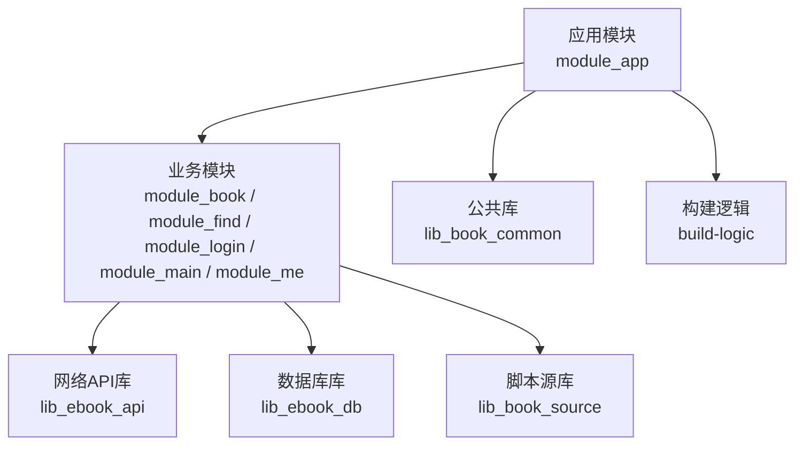
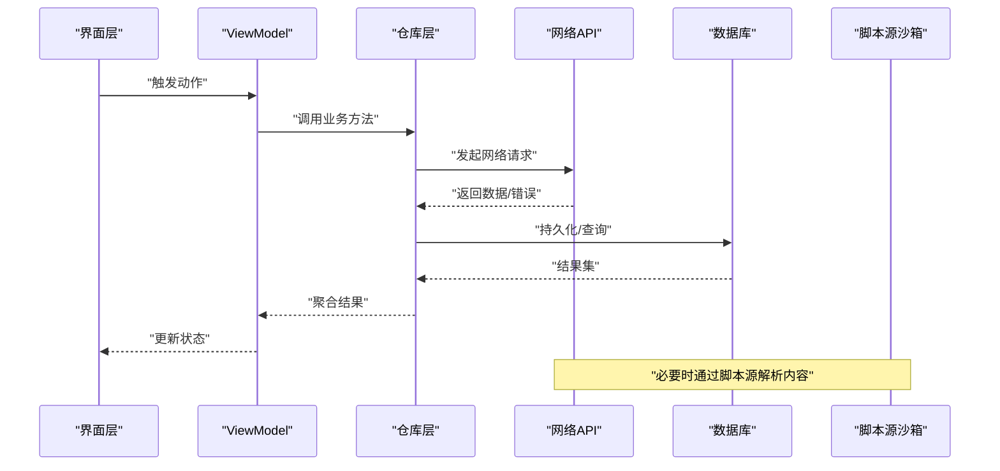
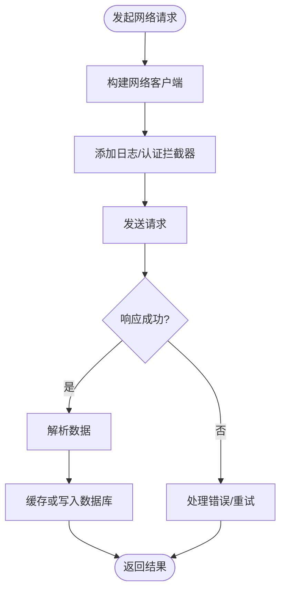
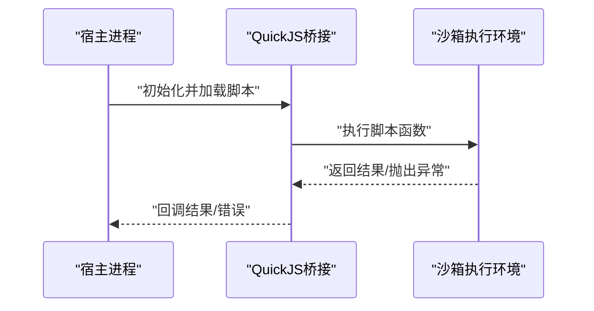
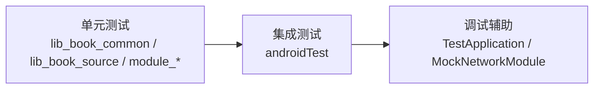
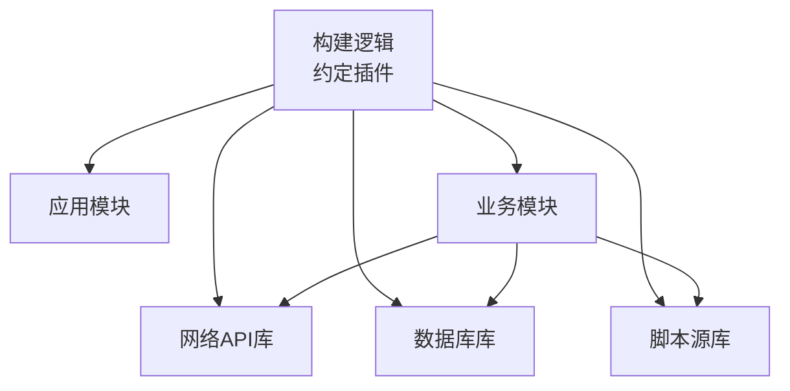

# 调试指南

<cite>
**本文引用的文件**
- [build.gradle.kts](file://build.gradle.kts)
- [gradle.properties](file://gradle.properties)
- [settings.gradle.kts](file://settings.gradle.kts)
- [compose_compiler_config.conf](file://compose_compiler_config.conf)
- [AndroidApplicationConventionPlugin.kt](file://build-logic/convention/src/main/kotlin/AndroidApplicationConventionPlugin.kt)
- [AndroidLintConventionPlugin.kt](file://build-logic/convention/src/main/kotlin/AndroidLintConventionPlugin.kt)
- [KotlinAndroid.kt](file://build-logic/convention/src/main/kotlin/build-logic/convention/src/main/kotlin/com/xrn1997/convention/KotlinAndroid.kt)
- [AndroidCompose.kt](file://build-logic/convention/src/main/kotlin/build-logic/convention/src/main/kotlin/com/xrn1997/convention/AndroidCompose.kt)
- [HiltConventionPlugin.kt](file://build-logic/convention/src/main/kotlin/HiltConventionPlugin.kt)
- [MyApplication.kt](file://module_app/src/main/java/com/ebook/MyApplication.kt)
- [AndroidManifest.xml（应用）](file://module_app/src/main/AndroidManifest.xml)
- [RetrofitBuilder.kt](file://lib_ebook_api/src/main/java/com/ebook/api/RetrofitBuilder.kt)
- [EncodingInterceptorTest.kt](file://lib_ebook_api/src/test/java/com/ebook/api/intercepter/EncodingInterceptorTest.kt)
- [AppDatabase.kt](file://lib_ebook_db/src/main/java/com/ebook/db/AppDatabase.kt)
- [BookInfoDaoTest.kt](file://lib_ebook_db/src/test/java/com/ebook/db/dao/BookInfoDaoTest.kt)
- [ImportBaselineTest.kt](file://module_book/src/androidTest/java/com/ebook/book/ImportBaselineTest.kt)
- [DebugMemory.kt](file://module_book/src/androidTest/java/com/ebook/book/DebugMemory.kt)
- [QuickJsBridgeTest.kt](file://lib_book_source/src/androidTest/java/com/ebook/source/sandbox/QuickJsBridgeTest.kt)
- [SandboxConnectionTest.kt](file://lib_book_source/src/androidTest/java/com/ebook/source/sandbox/SandboxConnectionTest.kt)
- [BookDetailViewModelSourceTest.kt](file://module_book/src/test/java/com/ebook/book/mvvm/viewmodel/BookDetailViewModelSourceTest.kt)
- [ReaderPageStoreTest.kt](file://module_book/src/test/java/com/ebook/book/reader/ReaderPageStoreTest.kt)
- [UserSessionManagerTest.kt](file://lib_book_common/src/test/java/com/ebook/common/domain/UserSessionManagerTest.kt)
- [FakeUserSessionManager.kt](file://lib_book_common/src/test/java/com/ebook/common/domain/FakeUserSessionManager.kt)
- [TestApplication.kt（find）](file://module_find/src/main/test/debug/TestApplication.kt)
- [MockNetworkModule.kt（find）](file://module_find/src/main/test/debug/MockNetworkModule.kt)
- [TestApplication.kt（me）](file://module_me/src/main/test/debug/TestApplication.kt)
- [MockNetworkModule.kt（me）](file://module_me/src/main/test/debug/MockNetworkModule.kt)
- [TestApplication.kt（login）](file://module_login/src/main/test/debug/TestApplication.kt)
- [MockNetworkModule.kt（login）](file://module_login/src/main/test/debug/MockNetworkModule.kt)
- [TestApplication.kt（main）](file://module_main/src/main/test/debug/TestApplication.kt)
- [MockNetworkModule.kt（main）](file://module_main/src/main/test/debug/MockNetworkModule.kt)
- [consumer-rules.pro（app）](file://module_app/consumer-rules.pro)
- [consumer-rules.pro（book）](file://module_book/consumer-rules.pro)
- [consumer-rules.pro（api）](file://lib_ebook_api/consumer-rules.pro)
- [consumer-rules.pro（db）](file://lib_ebook_db/consumer-rules.pro)
- [consumer-rules.pro（source）](file://lib_book_source/consumer-rules.pro)
</cite>

## 目录
1. [简介](#简介)
2. [项目结构与调试入口](#项目结构与调试入口)
3. [核心组件与调试点](#核心组件与调试点)
4. [架构总览](#架构总览)
5. [详细组件分析](#详细组件分析)
6. [依赖关系与调试耦合分析](#依赖关系与调试耦合分析)
7. [性能与稳定性调试](#性能与稳定性调试)
8. [故障排查指南](#故障排查指南)
9. [结论](#结论)
10. [附录：环境与配置最佳实践](#附录环境与配置最佳实践)

## 简介
本指南面向Android应用的日常调试、问题定位与质量保障，覆盖断点调试、日志调试、远程调试、模拟器调试，以及常用工具（Android Studio调试器、Logcat、ADB、网络抓包）。同时给出代码质量检查（Lint静态检查、单元测试、集成测试）的落地方式与执行路径，并提供崩溃堆栈分析、性能瓶颈定位、内存泄漏追踪等实战技巧。文末提供调试环境与配置的最佳实践，包括调试符号保留、日志级别控制、调试专用配置与工作流建议。

## 项目结构与调试入口
本项目采用多模块架构，包含应用入口、业务模块、公共库、数据层与脚本源沙箱等。调试入口与关键配置分布在以下位置：
- 应用启动与构建配置：根级构建脚本、Gradle属性、Compose编译器配置、约定插件。
- 应用模块：入口Application与清单，便于注入调试开关、网络拦截器等。
- 网络层：API模块中的网络构建类，适合注入HTTP日志或代理进行抓包。
- 数据库层：Room数据库定义与DAO测试，便于验证迁移与查询。
- 脚本源沙箱：JS桥接与连接测试，便于定位脚本执行与通信问题。
- 各模块的测试与调试辅助：含单元测试、UI/集成测试、测试用Application与Mock实现。

**图表来源**
- [AndroidApplicationConventionPlugin.kt:1-200](file://build-logic/convention/src/main/kotlin/AndroidApplicationConventionPlugin.kt#L1-L200)
- [AndroidManifest.xml（应用）:1-200](file://module_app/src/main/AndroidManifest.xml#L1-L200)
- [RetrofitBuilder.kt:1-200](file://lib_ebook_api/src/main/java/com/ebook/api/RetrofitBuilder.kt#L1-L200)

**章节来源**
- [build.gradle.kts:1-200](file://build.gradle.kts#L1-L200)
- [gradle.properties:1-200](file://gradle.properties#L1-L200)
- [settings.gradle.kts:1-200](file://settings.gradle.kts#L1-L200)
- [compose_compiler_config.conf:1-200](file://compose_compiler_config.conf#L1-L200)
- [AndroidApplicationConventionPlugin.kt:1-200](file://build-logic/convention/src/main/kotlin/AndroidApplicationConventionPlugin.kt#L1-L200)
- [MyApplication.kt:1-200](file://module_app/src/main/java/com/ebook/MyApplication.kt#L1-L200)
- [AndroidManifest.xml（应用）:1-200](file://module_app/src/main/AndroidManifest.xml#L1-L200)

## 核心组件与调试点
- 应用启动与初始化：在Application中进行全局初始化，可在此设置调试开关、日志级别、网络拦截器、数据库策略等。
- 网络请求：通过API模块的网络构建类统一创建客户端，便于注入日志拦截器、代理、重试策略与错误处理。
- 数据库操作：Room实体与DAO位于数据库库中，配合迁移与DAO测试，可在本地快速复现查询与同步问题。
- 脚本源沙箱：JS桥接与连接测试，用于调试第三方脚本解析与执行链路。
- 测试与调试辅助：各模块提供测试用例与调试用Application/Mock，便于隔离外部依赖并稳定复现问题。

**章节来源**
- [MyApplication.kt:1-200](file://module_app/src/main/java/com/ebook/MyApplication.kt#L1-L200)
- [RetrofitBuilder.kt:1-200](file://lib_ebook_api/src/main/java/com/ebook/api/RetrofitBuilder.kt#L1-L200)
- [AppDatabase.kt:1-200](file://lib_ebook_db/src/main/java/com/ebook/db/AppDatabase.kt#L1-L200)
- [QuickJsBridgeTest.kt:1-200](file://lib_book_source/src/androidTest/java/com/ebook/source/sandbox/QuickJsBridgeTest.kt#L1-L200)
- [SandboxConnectionTest.kt:1-200](file://lib_book_source/src/androidTest/java/com/ebook/source/sandbox/SandboxConnectionTest.kt#L1-L200)

## 架构总览
下图展示了应用层到数据层的调用链，便于理解调试时的请求流转与可能出错的环节：

**图表来源**
- [RetrofitBuilder.kt:1-200](file://lib_ebook_api/src/main/java/com/ebook/api/RetrofitBuilder.kt#L1-L200)
- [AppDatabase.kt:1-200](file://lib_ebook_db/src/main/java/com/ebook/db/AppDatabase.kt#L1-L200)
- [QuickJsBridgeTest.kt:1-200](file://lib_book_source/src/androidTest/java/com/ebook/source/sandbox/QuickJsBridgeTest.kt#L1-L200)

## 详细组件分析

### 网络层调试（API模块）
- 目标：捕获HTTP请求/响应、代理转发、编码与错误处理。
- 切入点：网络客户端构建类集中了网络相关配置，便于注入日志拦截器与代理；配套的编码拦截器测试可用于验证行为。
- 建议：
  - 使用日志拦截器打印请求头、URL、参数与响应体（注意脱敏）。
  - 在调试构建下启用代理以接入抓包工具。
  - 对异常分支与超时场景编写单测，确保失败路径可回归。

**图表来源**
- [RetrofitBuilder.kt:1-200](file://lib_ebook_api/src/main/java/com/ebook/api/RetrofitBuilder.kt#L1-L200)
- [EncodingInterceptorTest.kt:1-200](file://lib_ebook_api/src/test/java/com/ebook/api/intercepter/EncodingInterceptorTest.kt#L1-L200)

**章节来源**
- [RetrofitBuilder.kt:1-200](file://lib_ebook_api/src/main/java/com/ebook/api/RetrofitBuilder.kt#L1-L200)
- [EncodingInterceptorTest.kt:1-200](file://lib_ebook_api/src/test/java/com/ebook/api/intercepter/EncodingInterceptorTest.kt#L1-L200)

### 数据库层调试（DB模块）
- 目标：验证表结构、迁移与查询正确性。
- 切入点：Room数据库定义与DAO测试，便于快速复现实例迁移与数据一致性。
- 建议：
  - 使用Schema版本文件对比差异，确保迁移脚本完整。
  - 通过DAO测试覆盖增删改查与边界条件。
  - 在集成测试中模拟复杂查询与并发访问。

**图表来源**
- [AppDatabase.kt:1-200](file://lib_ebook_db/src/main/java/com/ebook/db/AppDatabase.kt#L1-L200)
- [BookInfoDaoTest.kt:1-200](file://lib_ebook_db/src/test/java/com/ebook/db/dao/BookInfoDaoTest.kt#L1-L200)

**章节来源**
- [AppDatabase.kt:1-200](file://lib_ebook_db/src/main/java/com/ebook/db/AppDatabase.kt#L1-L200)
- [BookInfoDaoTest.kt:1-200](file://lib_ebook_db/src/test/java/com/ebook/db/dao/BookInfoDaoTest.kt#L1-L200)

### 脚本源沙箱调试（Source模块）
- 目标：定位JS脚本解析、执行与桥接通信问题。
- 切入点：桥接与连接测试用例，可验证沙箱生命周期、事件传递与异常恢复。
- 建议：
  - 在测试环境中固定输入输出，逐步缩小问题范围。
  - 记录桥接调用的上下文信息，便于回溯。
  - 对异常分支增加用例，确保健壮性。

**图表来源**
- [QuickJsBridgeTest.kt:1-200](file://lib_book_source/src/androidTest/java/com/ebook/source/sandbox/QuickJsBridgeTest.kt#L1-L200)
- [SandboxConnectionTest.kt:1-200](file://lib_book_source/src/androidTest/java/com/ebook/source/sandbox/SandboxConnectionTest.kt#L1-L200)

**章节来源**
- [QuickJsBridgeTest.kt:1-200](file://lib_book_source/src/androidTest/java/com/ebook/source/sandbox/QuickJsBridgeTest.kt#L1-L200)
- [SandboxConnectionTest.kt:1-200](file://lib_book_source/src/androidTest/java/com/ebook/source/sandbox/SandboxConnectionTest.kt#L1-L200)

### 测试与调试辅助（各模块）
- 单元测试：覆盖业务逻辑与边界条件，便于快速验证变更影响。
- 集成测试：验证跨组件交互与真实环境下的行为。
- 调试专用：提供测试用Application与Mock网络模块，便于隔离外部依赖。

**图表来源**
- [UserSessionManagerTest.kt:1-200](file://lib_book_common/src/test/java/com/ebook/common/domain/UserSessionManagerTest.kt#L1-L200)
- [FakeUserSessionManager.kt:1-200](file://lib_book_common/src/test/java/com/ebook/common/domain/FakeUserSessionManager.kt#L1-200)
- [BookDetailViewModelSourceTest.kt:1-200](file://module_book/src/test/java/com/ebook/book/mvvm/viewmodel/BookDetailViewModelSourceTest.kt#L1-200)
- [ReaderPageStoreTest.kt:1-200](file://module_book/src/test/java/com/ebook/book/reader/ReaderPageStoreTest.kt#L1-200)
- [ImportBaselineTest.kt:1-200](file://module_book/src/androidTest/java/com/ebook/book/ImportBaselineTest.kt#L1-200)
- [TestApplication.kt（find）:1-200](file://module_find/src/main/test/debug/TestApplication.kt#L1-200)
- [MockNetworkModule.kt（find）:1-200](file://module_find/src/main/test/debug/MockNetworkModule.kt#L1-200)
- [TestApplication.kt（me）:1-200](file://module_me/src/main/test/debug/TestApplication.kt#L1-200)
- [MockNetworkModule.kt（me）:1-200](file://module_me/src/main/test/debug/MockNetworkModule.kt#L1-200)
- [TestApplication.kt（login）:1-200](file://module_login/src/main/test/debug/TestApplication.kt#L1-200)
- [MockNetworkModule.kt（login）:1-200](file://module_login/src/main/test/debug/MockNetworkModule.kt#L1-200)
- [TestApplication.kt（main）:1-200](file://module_main/src/main/test/debug/TestApplication.kt#L1-200)
- [MockNetworkModule.kt（main）:1-200](file://module_main/src/main/test/debug/MockNetworkModule.kt#L1-200)

**章节来源**
- [UserSessionManagerTest.kt:1-200](file://lib_book_common/src/test/java/com/ebook/common/domain/UserSessionManagerTest.kt#L1-200)
- [FakeUserSessionManager.kt:1-200](file://lib_book_common/src/test/java/com/ebook/common/domain/FakeUserSessionManager.kt#L1-200)
- [BookDetailViewModelSourceTest.kt:1-200](file://module_book/src/test/java/com/ebook/book/mvvm/viewmodel/BookDetailViewModelSourceTest.kt#L1-200)
- [ReaderPageStoreTest.kt:1-200](file://module_book/src/test/java/com/ebook/book/reader/ReaderPageStoreTest.kt#L1-200)
- [ImportBaselineTest.kt:1-200](file://module_book/src/androidTest/java/com/ebook/book/ImportBaselineTest.kt#L1-200)
- [TestApplication.kt（find）:1-200](file://module_find/src/main/test/debug/TestApplication.kt#L1-200)
- [MockNetworkModule.kt（find）:1-200](file://module_find/src/main/test/debug/MockNetworkModule.kt#L1-200)
- [TestApplication.kt（me）:1-200](file://module_me/src/main/test/debug/TestApplication.kt#L1-200)
- [MockNetworkModule.kt（me）:1-200](file://module_me/src/main/test/debug/MockNetworkModule.kt#L1-200)
- [TestApplication.kt（login）:1-200](file://module_login/src/main/test/debug/TestApplication.kt#L1-200)
- [MockNetworkModule.kt（login）:1-200](file://module_login/src/main/test/debug/MockNetworkModule.kt#L1-200)
- [TestApplication.kt（main）:1-200](file://module_main/src/main/test/debug/TestApplication.kt#L1-200)
- [MockNetworkModule.kt（main）:1-200](file://module_main/src/main/test/debug/MockNetworkModule.kt#L1-200)

## 依赖关系与调试耦合分析
- 构建逻辑：约定插件统一管理Android、Compose、Kotlin、Hilt、Lint等构建特性，便于在调试阶段统一开启/关闭功能。
- 模块依赖：业务模块依赖网络API、数据库与脚本源库；公共库被多模块复用，修改需考虑影响面。
- 调试建议：
  - 通过约定插件集中配置调试开关，减少分散配置带来的不一致。
  - 在单元测试中使用Mock替代外部依赖，降低耦合度。
  - 对关键依赖（如网络、数据库）建立契约测试，确保接口稳定。

**图表来源**
- [AndroidApplicationConventionPlugin.kt:1-200](file://build-logic/convention/src/main/kotlin/AndroidApplicationConventionPlugin.kt#L1-200)
- [AndroidLintConventionPlugin.kt:1-200](file://build-logic/convention/src/main/kotlin/AndroidLintConventionPlugin.kt#L1-200)
- [KotlinAndroid.kt:1-200](file://build-logic/convention/src/main/kotlin/build-logic/convention/src/main/kotlin/com/xrn1997/convention/KotlinAndroid.kt#L1-200)
- [AndroidCompose.kt:1-200](file://build-logic/convention/src/main/kotlin/build-logic/convention/src/main/kotlin/com/xrn1997/convention/AndroidCompose.kt#L1-200)
- [HiltConventionPlugin.kt:1-200](file://build-logic/convention/src/main/kotlin/HiltConventionPlugin.kt#L1-200)

**章节来源**
- [AndroidApplicationConventionPlugin.kt:1-200](file://build-logic/convention/src/main/kotlin/AndroidApplicationConventionPlugin.kt#L1-200)
- [AndroidLintConventionPlugin.kt:1-200](file://build-logic/convention/src/main/kotlin/AndroidLintConventionPlugin.kt#L1-200)
- [KotlinAndroid.kt:1-200](file://build-logic/convention/src/main/kotlin/build-logic/convention/src/main/kotlin/com/xrn1997/convention/KotlinAndroid.kt#L1-200)
- [AndroidCompose.kt:1-200](file://build-logic/convention/src/main/kotlin/build-logic/convention/src/main/kotlin/com/xrn1997/convention/AndroidCompose.kt#L1-200)
- [HiltConventionPlugin.kt:1-200](file://build-logic/convention/src/main/kotlin/HiltConventionPlugin.kt#L1-200)

## 性能与稳定性调试
- CPU与帧率：在Android Studio Profiler中观察主线程阻塞与渲染耗时，结合UI层测试定位卡顿点。
- 内存泄漏：使用LeakCanary或内存快照分析，优先关注长生命周期对象持有短生命周期引用。
- 网络性能：在API层加入延迟与重试统计，结合抓包工具分析慢请求。
- 数据库性能：对高频查询建立索引与分页，使用DAO测试评估优化效果。
- 脚本执行：监控沙箱执行时间与异常频率，避免阻塞主线程。

[本节为通用指导，无需特定文件来源]

## 故障排查指南
- 崩溃堆栈分析：
  - 收集崩溃日志与堆栈，定位至具体模块与调用链。
  - 在单元测试中复现最小场景，逐步缩小范围。
  - 对第三方依赖或系统行为，使用Mock隔离并验证。
- 网络问题：
  - 通过日志拦截器确认请求参数与响应码。
  - 使用代理工具抓取报文，核对协议与编码。
  - 针对超时与重试，增加用例覆盖失败分支。
- 数据库问题：
  - 对比Schema差异，检查迁移脚本是否遗漏字段或约束。
  - 使用DAO测试验证查询与事务一致性。
- 脚本源问题：
  - 固定输入输出，验证桥接调用与事件传递。
  - 对异常路径增加日志与测试，提升可观测性。

**章节来源**
- [RetrofitBuilder.kt:1-200](file://lib_ebook_api/src/main/java/com/ebook/api/RetrofitBuilder.kt#L1-200)
- [AppDatabase.kt:1-200](file://lib_ebook_db/src/main/java/com/ebook/db/AppDatabase.kt#L1-200)
- [QuickJsBridgeTest.kt:1-200](file://lib_book_source/src/androidTest/java/com/ebook/source/sandbox/QuickJsBridgeTest.kt#L1-200)
- [SandboxConnectionTest.kt:1-200](file://lib_book_source/src/androidTest/java/com/ebook/source/sandbox/SandboxConnectionTest.kt#L1-200)

## 结论
通过对应用启动、网络、数据库与脚本源沙箱的关键点进行系统化调试，结合单元测试与集成测试，可有效定位并修复问题。建议在调试阶段充分利用约定插件提供的统一配置，保持构建与调试的一致性；在网络与数据库层加强可观测性与测试覆盖；在脚本源沙箱中强化异常处理与日志记录。持续改进测试与调试流程，有助于提升整体质量与开发效率。

[本节为总结性内容，无需特定文件来源]

## 附录：环境与配置最佳实践
- 调试符号保留：
  - 在混淆规则文件中保留必要类与成员，确保崩溃堆栈可读。
  - 参考各模块的consumer-rules配置文件，按需调整保留策略。
- 日志级别控制：
  - 在调试构建中提高日志级别，发布构建中降低或关闭。
  - 通过网络拦截器集中管理日志输出，避免散落在业务代码。
- 调试专用配置：
  - 使用测试用Application与Mock网络模块隔离外部依赖。
  - 通过约定插件集中开启/关闭调试功能（如日志、分析、指标上报）。
- 工作流建议：
  - 先复现后修复：编写最小用例，确保问题可稳定复现。
  - 分层验证：从UI到业务再到数据层逐层排查。
  - 回归测试：修复后补充或完善用例，防止回退。

**章节来源**
- [consumer-rules.pro（app）:1-200](file://module_app/consumer-rules.pro#L1-200)
- [consumer-rules.pro（book）:1-200](file://module_book/consumer-rules.pro#L1-200)
- [consumer-rules.pro（api）:1-200](file://lib_ebook_api/consumer-rules.pro#L1-200)
- [consumer-rules.pro（db）:1-200](file://lib_ebook_db/consumer-rules.pro#L1-200)
- [consumer-rules.pro（source）:1-200](file://lib_book_source/consumer-rules.pro#L1-200)
- [TestApplication.kt（find）:1-200](file://module_find/src/main/test/debug/TestApplication.kt#L1-200)
- [MockNetworkModule.kt（find）:1-200](file://module_find/src/main/test/debug/MockNetworkModule.kt#L1-200)
- [TestApplication.kt（me）:1-200](file://module_me/src/main/test/debug/TestApplication.kt#L1-200)
- [MockNetworkModule.kt（me）:1-200](file://module_me/src/main/test/debug/MockNetworkModule.kt#L1-200)
- [TestApplication.kt（login）:1-200](file://module_login/src/main/test/debug/TestApplication.kt#L1-200)
- [MockNetworkModule.kt（login）:1-200](file://module_login/src/main/test/debug/MockNetworkModule.kt#L1-200)
- [TestApplication.kt（main）:1-200](file://module_main/src/main/test/debug/TestApplication.kt#L1-200)
- [MockNetworkModule.kt（main）:1-200](file://module_main/src/main/test/debug/MockNetworkModule.kt#L1-200)