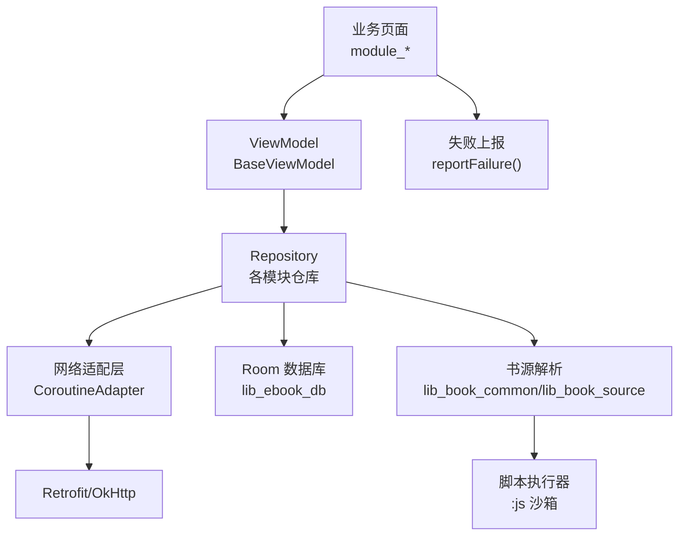
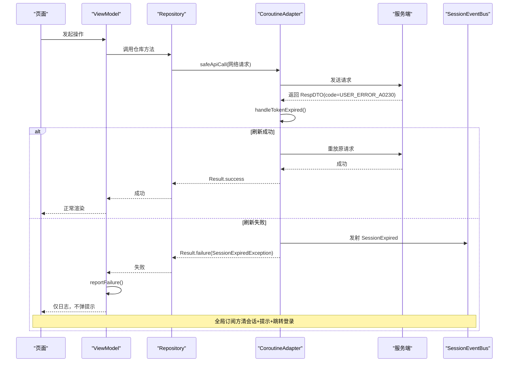
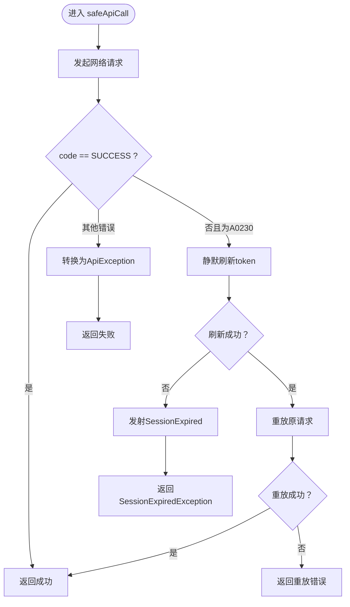
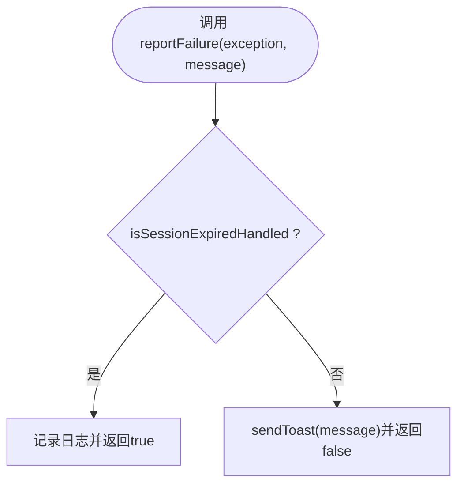
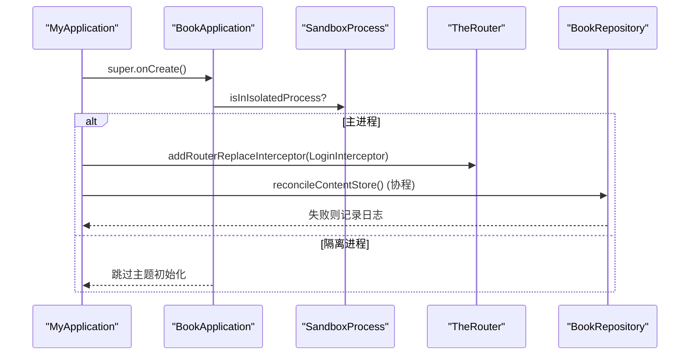
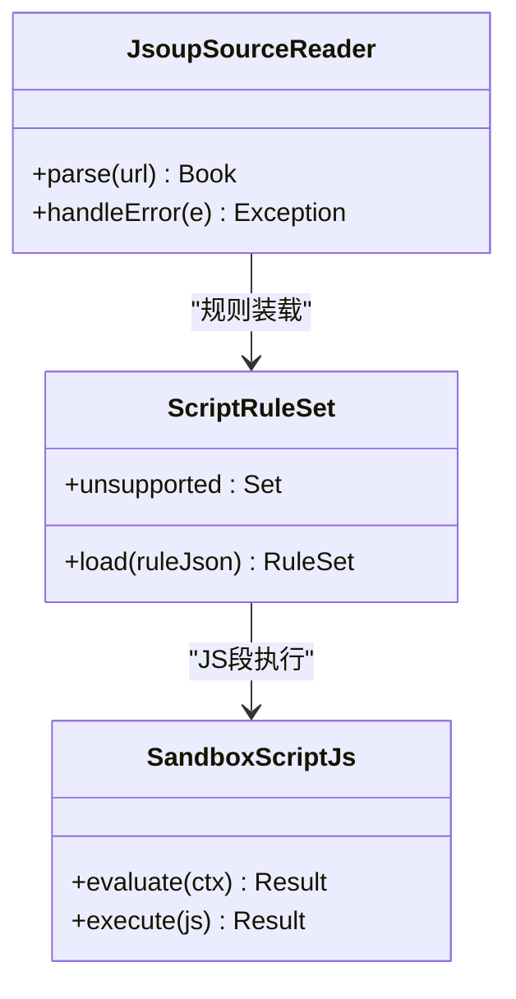
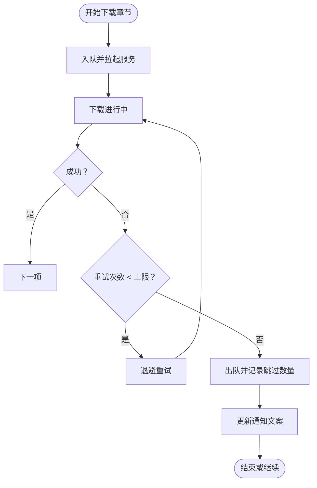
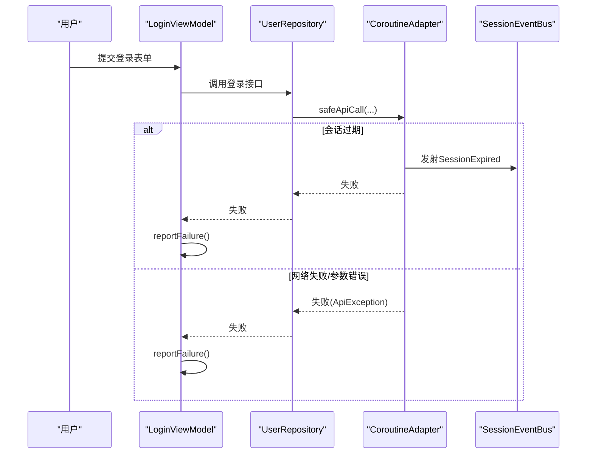
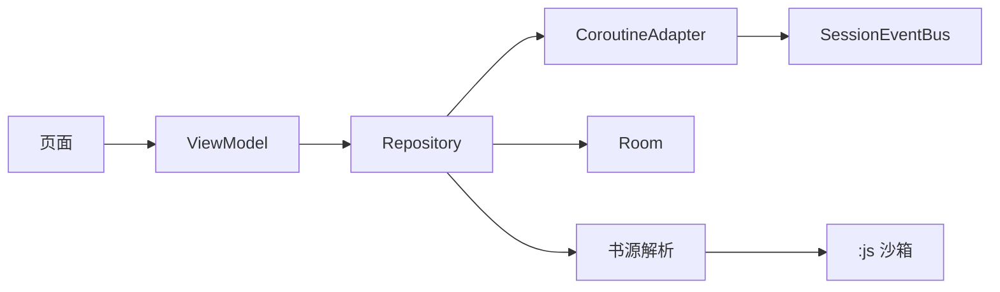

# 运行时错误

<cite>
**本文引用的文件**
- [FailureReport.kt](file://lib_book_common/src/main/java/com/ebook/common/util/FailureReport.kt)
- [CoroutineAdapter.kt](file://lib_ebook_api/src/main/java/com/ebook/api/utils/CoroutineAdapter.kt)
- [MyApplication.kt](file://module_app/src/main/java/com/ebook/MyApplication.kt)
- [BookApplication.kt](file://lib_book_common/src/main/java/com/ebook/common/BookApplication.kt)
- [JsoupSourceReader.kt](file://lib_book_common/src/main/java/com/ebook/common/analyze/source/JsoupSourceReader.kt)
- [ScriptRuleExceptions.kt](file://lib_book_source/src/main/java/com/ebook/source/script/ScriptRuleExceptions.kt)
- [SandboxScriptJs.kt](file://lib_book_source/src/main/java/com/ebook/source/script/SandboxScriptJs.kt)
- [DownloadService.kt](file://module_book/src/main/java/com/ebook/book/service/DownloadService.kt)
- [DownloadRepository.kt](file://module_book/src/main/java/com/ebook/book/repository/DownloadRepository.kt)
- [BookImportActivity.kt](file://module_book/src/main/java/com/ebook/book/ImportBookActivity.kt)
- [BookImportViewModel.kt](file://module_book/src/main/java/com/ebook/book/mvvm/viewmodel/BookImportViewModel.kt)
- [LoginViewModel.kt](file://module_login/src/main/java/com/ebook/login/mvvm/viewmodel/LoginViewModel.kt)
- [UserRepository.kt](file://module_login/src/main/java/com/ebook/login/repository/UserRepository.kt)
- [SettingActivity.kt](file://module_me/src/main/java/com/ebook/me/view/SettingActivity.kt)
- [ReleaseRepository.kt](file://module_me/src/main/java/com/ebook/me/repository/ReleaseRepository.kt)
- [README.MD](file://README.MD)
</cite>

## 目录
1. [简介](#简介)
2. [项目结构与错误处理边界](#项目结构与错误处理边界)
3. [核心组件](#核心组件)
4. [架构总览](#架构总览)
5. [详细组件分析](#详细组件分析)
6. [依赖关系分析](#依赖关系分析)
7. [性能与可靠性考虑](#性能与可靠性考虑)
8. [故障排查指南](#故障排查指南)
9. [结论](#结论)
10. [附录：常见错误场景与处置](#附录：常见错误场景与处置)

## 简介
本指南面向本项目的运行时错误处理，目标是帮助开发者理解并正确使用“全局异常捕获、错误上报策略、用户友好提示”的体系化方案。内容覆盖网络层会话过期统一处理、页面级失败归口上报、脚本解析与沙箱异常、下载服务异常、导入与权限相关错误、日志记录与分析方法，以及可恢复与不可恢复错误的分流策略与调试技巧。

## 项目结构与错误处理边界
本项目采用多模块 MVVM 架构，错误处理遵循“分层收敛、单一出口”的原则：
- 网络层（lib_ebook_api）负责统一封装请求、会话过期静默刷新与事件分发。
- 业务层（各 module_*）通过 ViewModel 调用仓库，统一使用失败上报通道呈现用户可见提示。
- 书源解析与脚本执行在 lib_book_source 中，发生异常时按类型区分“需重试/需修复规则/需终止”。
- 持久化与资源操作在 lib_ebook_db 与各模块仓库中，出现 I/O 或数据不一致时做降级与提示。
- 应用启动与进程隔离由 Application 与沙箱进程门控制，避免非主进程初始化导致的崩溃。

**图表来源**
- [CoroutineAdapter.kt:17-149](file://lib_ebook_api/src/main/java/com/ebook/api/utils/CoroutineAdapter.kt#L17-L149)
- [FailureReport.kt:7-53](file://lib_book_common/src/main/java/com/ebook/common/util/FailureReport.kt#L7-L53)

**章节来源**
- [README.MD](file://README.MD)

## 核心组件
- 失败上报归口：页面级统一通过 BaseViewModel 的 reportFailure 进行用户可见提示与日志记录，会话过期分支走全局处理，不再重复提示。
- 网络适配：safeApiCall 将网络请求转换为 Result，集中处理 A0230 会话过期、业务码转换与通用异常翻译；提供 isSessionExpiredHandled 供上层判断是否已全局处置。
- 应用入口：MyApplication 与 BookApplication 完成主题装配、路由拦截、沙箱进程门与内容仓库对账，启动期异常兜底仅记日志不阻断启动。
- 书源解析：Jsoup 解析与脚本解析分别处理 HTML/JSON/正则等失败，抛出类型化异常以便上层分类处理。
- 下载服务：前台服务在下载队列管理、重试与超时场景中保证任务出队与通知文案准确。
- 登录流程：登录 ViewModel 与 UserRepository 对网络失败、校验失败、会话状态变化进行处理，结合全局会话过期机制。

**章节来源**
- [FailureReport.kt:7-53](file://lib_book_common/src/main/java/com/ebook/common/util/FailureReport.kt#L7-L53)
- [CoroutineAdapter.kt:17-149](file://lib_ebook_api/src/main/java/com/ebook/api/utils/CoroutineAdapter.kt#L17-L149)
- [MyApplication.kt:19-65](file://module_app/src/main/java/com/ebook/MyApplication.kt#L19-L65)
- [BookApplication.kt:17-63](file://lib_book_common/src/main/java/com/ebook/common/BookApplication.kt#L17-L63)

## 架构总览
下图展示从页面到网络的错误流转路径，包含会话过期统一处理、失败上报与日志记录的关键节点。

**图表来源**
- [CoroutineAdapter.kt:41-149](file://lib_ebook_api/src/main/java/com/ebook/api/utils/CoroutineAdapter.kt#L41-L149)
- [FailureReport.kt:24-53](file://lib_book_common/src/main/java/com/ebook/common/util/FailureReport.kt#L24-L53)

## 详细组件分析

### 网络层：会话过期与统一异常处理
- safeApiCall 将网络请求置于 IO 线程，统一将业务码转换为 Result；遇到 USER_ERROR_A0230 触发静默刷新。
- handleTokenExpired 单飞刷新，成功后重放一次请求；刷新失败则发射 SessionExpired 事件，并返回带标记的失败。
- 上层通过 isSessionExpiredHandled 判断是否为已全局处置的会话过期，避免重复提示。

**图表来源**
- [CoroutineAdapter.kt:41-149](file://lib_ebook_api/src/main/java/com/ebook/api/utils/CoroutineAdapter.kt#L41-L149)

**章节来源**
- [CoroutineAdapter.kt:17-149](file://lib_ebook_api/src/main/java/com/ebook/api/utils/CoroutineAdapter.kt#L17-L149)

### 页面级失败上报：唯一归口与用户提示
- userMessage 将异常翻译为用户可见文案，优先取服务端消息。
- reportFailure 对会话过期分支静默（仅日志），其余情况通过 sendToast 提示用户；返回值用于上游根据失败类型分流收尾逻辑。
- 该设计确保“会话过期已由全局处置”的不变量不被破坏，避免用户看到重复提示。

**图表来源**
- [FailureReport.kt:24-53](file://lib_book_common/src/main/java/com/ebook/common/util/FailureReport.kt#L24-L53)

**章节来源**
- [FailureReport.kt:7-53](file://lib_book_common/src/main/java/com/ebook/common/util/FailureReport.kt#L7-L53)

### 应用启动与进程隔离：避免非主进程崩溃
- MyApplication 在 onCreate 中完成路由拦截与内容仓库对账，对账失败仅记录日志不影响启动。
- BookApplication 在 Application 生命周期内装配主题，并通过沙箱进程门防止在非 UI 进程执行主题初始化。
- 这两处保证了应用稳定启动，同时避免在隔离进程中访问受限资源导致崩溃。

**图表来源**
- [MyApplication.kt:19-65](file://module_app/src/main/java/com/ebook/MyApplication.kt#L19-L65)
- [BookApplication.kt:17-63](file://lib_book_common/src/main/java/com/ebook/common/BookApplication.kt#L17-L63)

**章节来源**
- [MyApplication.kt:19-65](file://module_app/src/main/java/com/ebook/MyApplication.kt#L19-L65)
- [BookApplication.kt:17-63](file://lib_book_common/src/main/java/com/ebook/common/BookApplication.kt#L17-L63)

### 书源解析与脚本执行：类型化异常与可恢复性
- Jsoup 解析失败会抛出类型化异常，便于上层区分“规则缺失/站点结构变更/网络问题”。
- 脚本执行失败抛出 JsExecutionFailedException，包含内核原文；未装配执行器抛 JsEvaluationPendingException。
- 上层应据此决定重试、提示用户更新规则或终止操作。

**图表来源**
- [JsoupSourceReader.kt](file://lib_book_common/src/main/java/com/ebook/common/analyze/source/JsoupSourceReader.kt)
- [ScriptRuleExceptions.kt](file://lib_book_source/src/main/java/com/ebook/source/script/ScriptRuleExceptions.kt)
- [SandboxScriptJs.kt](file://lib_book_source/src/main/java/com/ebook/source/script/SandboxScriptJs.kt)

**章节来源**
- [JsoupSourceReader.kt](file://lib_book_common/src/main/java/com/ebook/common/analyze/source/JsoupSourceReader.kt)
- [ScriptRuleExceptions.kt](file://lib_book_source/src/main/java/com/ebook/source/script/ScriptRuleExceptions.kt)
- [SandboxScriptJs.kt](file://lib_book_source/src/main/java/com/ebook/source/script/SandboxScriptJs.kt)

### 下载服务与队列：超时、重试与出队策略
- DownloadService 作为前台服务管理下载队列，失败章需在重试耗尽后出队，避免阻塞后续章节。
- DownloadRepository 负责入库与拉起服务，启动失败时需提示用户并保留任务待续跑。
- 超时与中断的收尾必须在数秒内完成，禁止长耗时操作。

**图表来源**
- [DownloadService.kt](file://module_book/src/main/java/com/ebook/book/service/DownloadService.kt)
- [DownloadRepository.kt](file://module_book/src/main/java/com/ebook/book/repository/DownloadRepository.kt)

**章节来源**
- [DownloadService.kt](file://module_book/src/main/java/com/ebook/book/service/DownloadService.kt)
- [DownloadRepository.kt](file://module_book/src/main/java/com/ebook/book/repository/DownloadRepository.kt)

### 登录与权限：网络失败与权限拒绝
- LoginViewModel 与 UserRepository 对登录请求的网络失败、参数校验失败、会话过期等进行处理；会话过期由全局处置，登录页只记录日志。
- 权限拒绝异常（如本地网络访问）由 OkHttp 直接报错，需在上层提示用户配置代理或使用公网地址。

**图表来源**
- [LoginViewModel.kt](file://module_login/src/main/java/com/ebook/login/mvvm/viewmodel/LoginViewModel.kt)
- [UserRepository.kt](file://module_login/src/main/java/com/ebook/login/repository/UserRepository.kt)
- [CoroutineAdapter.kt:41-149](file://lib_ebook_api/src/main/java/com/ebook/api/utils/CoroutineAdapter.kt#L41-L149)
- [FailureReport.kt:24-53](file://lib_book_common/src/main/java/com/ebook/common/util/FailureReport.kt#L24-L53)

**章节来源**
- [LoginViewModel.kt](file://module_login/src/main/java/com/ebook/login/mvvm/viewmodel/LoginViewModel.kt)
- [UserRepository.kt](file://module_login/src/main/java/com/ebook/login/repository/UserRepository.kt)
- [CoroutineAdapter.kt:41-149](file://lib_ebook_api/src/main/java/com/ebook/api/utils/CoroutineAdapter.kt#L41-L149)
- [FailureReport.kt:24-53](file://lib_book_common/src/main/java/com/ebook/common/util/FailureReport.kt#L24-L53)

### 导入书籍：I/O 异常与用户反馈
- ImportBookActivity 与 BookImportViewModel 对导入过程中的文件读取、格式识别、去重合并等操作进行异常处理。
- 导入失败需提示用户并给出可操作建议（如文件格式不支持、同名冲突选择覆盖等）。

**章节来源**
- [BookImportActivity.kt](file://module_book/src/main/java/com/ebook/book/ImportBookActivity.kt)
- [BookImportViewModel.kt](file://module_book/src/main/java/com/ebook/book/mvvm/viewmodel/BookImportViewModel.kt)

### 版本检查：发布源失败与限频
- ReleaseRepository 负责版本检查，远端 tag 解析失败或本地版本号读不到视为检查失败且不写限频时间戳。
- 该请求走纯净客户端，不带 token，避免第三方站点获取用户凭证。

**章节来源**
- [ReleaseRepository.kt](file://module_me/src/main/java/com/ebook/me/repository/ReleaseRepository.kt)

## 依赖关系分析
- 页面依赖 ViewModel，ViewModel 依赖 Repository，Repository 依赖网络层与数据库/解析层。
- 网络层依赖 TokenRefresher 与 SessionEventBus，实现会话过期统一处理。
- 书源解析依赖脚本执行器，脚本执行失败抛出类型化异常，上层据此决策。
- 应用启动依赖沙箱进程门，避免非主进程初始化导致崩溃。

**图表来源**
- [CoroutineAdapter.kt:17-149](file://lib_ebook_api/src/main/java/com/ebook/api/utils/CoroutineAdapter.kt#L17-L149)
- [FailureReport.kt:7-53](file://lib_book_common/src/main/java/com/ebook/common/util/FailureReport.kt#L7-L53)

**章节来源**
- [CoroutineAdapter.kt:17-149](file://lib_ebook_api/src/main/java/com/ebook/api/utils/CoroutineAdapter.kt#L17-L149)
- [FailureReport.kt:7-53](file://lib_book_common/src/main/java/com/ebook/common/util/FailureReport.kt#L7-L53)

## 性能与可靠性考虑
- 会话过期静默刷新避免并发风暴，重放仅一次，减少不必要的请求。
- 失败上报归口降低重复提示与日志噪音，提升用户体验。
- 下载服务失败重试与出队策略保障队列健康，避免阻塞。
- 脚本解析与执行使用类型化异常，便于快速定位问题并分类处理。

## 故障排查指南
- 日志级别：统一使用 Logger，注意 debug/release 自动裁剪，关键信息包含 code、message、堆栈。
- 崩溃堆栈：关注 SessionExpiredException、JsExecutionFailedException、ApiException 等类型化异常，结合上下文判断根因。
- 常见问题：
  - 网络超时：检查 CoroutineAdapter 的异常翻译与日志，确认是否触发重试或会话刷新。
  - 数据解析失败：查看书源规则是否正确，脚本执行是否成功，必要时更新规则。
  - UI 状态异常：确认 reportFailure 调用位置与返回值分流逻辑，避免覆盖层状态不一致。
- 调试技巧：
  - 在 ViewModel 的 onFailure 分支添加断点，观察异常类型与 message。
  - 使用 adb logcat 过滤特定 TAG，快速定位错误来源。
  - 对于脚本解析问题，检查规则语法与 JS 执行环境是否正常。

## 结论
本项目通过“网络层统一会话处理、页面级失败上报归口、书源解析类型化异常、下载服务健壮队列”构建了完整的运行时错误处理体系。开发者应遵循报告与处理约定，确保错误可追溯、用户可感知、系统可恢复。

## 附录：常见错误场景与处置
- 空指针异常：应在具体调用点加判空与默认值，结合日志定位缺失数据。
- 网络请求失败：检查网络层异常翻译与重试策略，必要时提示用户切换网络。
- 数据库操作异常：关注 Room 迁移与主键策略，避免数据不一致。
- 权限拒绝异常：提示用户授予必要权限或改用替代方式（如公网地址）。
- 网络超时处理：设置合理超时与重试，结合退避策略减少服务器压力。
- 数据解析失败：验证规则与响应结构，必要时更新规则或提示用户。
- UI 状态异常：确认覆盖层与命令通道绑定，避免状态泄漏。
- 错误监控与调试：使用 Logger 记录关键信息，结合测试与日志分析根因。