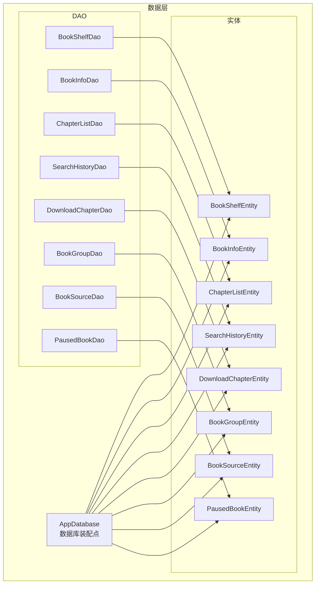
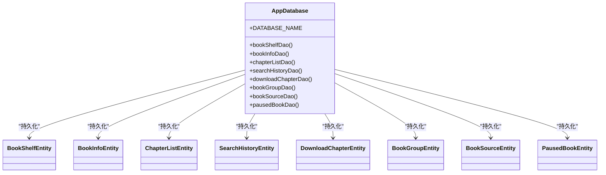
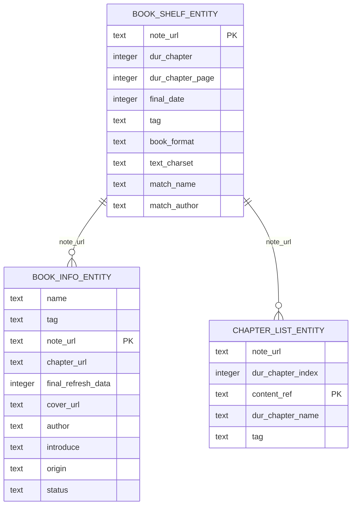
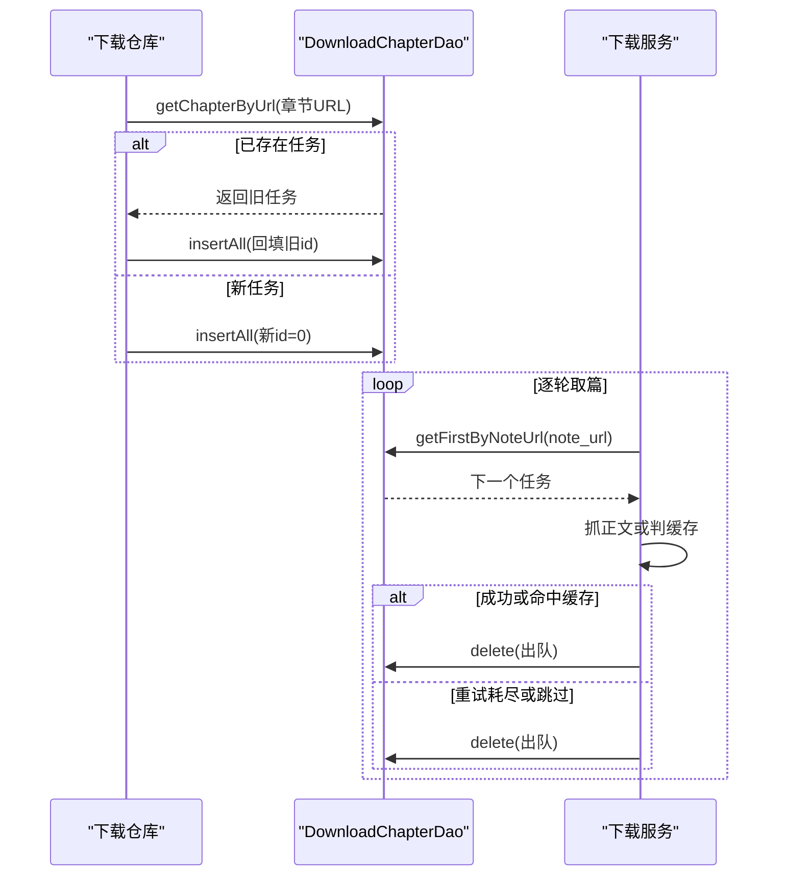
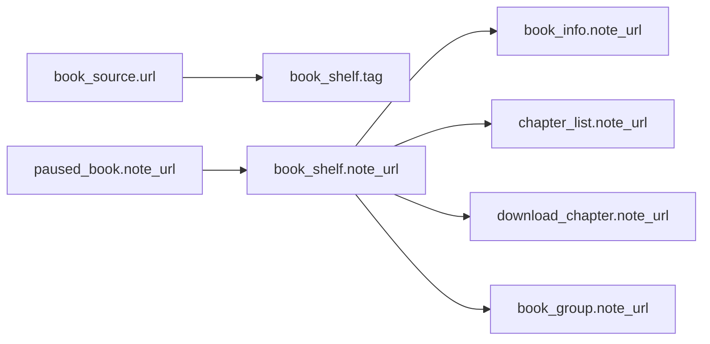
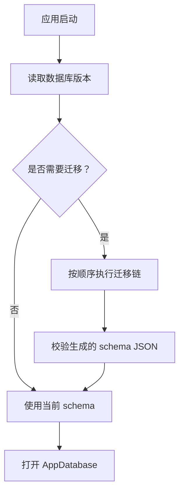

# 数据模型

<cite>
**本文引用的文件**   
- [AppDatabase.kt](file://lib_ebook_db/src/main/java/com/ebook/db/AppDatabase.kt)
- [BookInfoEntity.kt](file://lib_ebook_db/src/main/java/com/ebook/db/entity/BookInfoEntity.kt)
- [ChapterListEntity.kt](file://lib_ebook_db/src/main/java/com/ebook/db/entity/ChapterListEntity.kt)
- [BookShelfEntity.kt](file://lib_ebook_db/src/main/java/com/ebook/db/entity/BookShelfEntity.kt)
- [SearchHistoryEntity.kt](file://lib_ebook_db/src/main/java/com/ebook/db/entity/SearchHistoryEntity.kt)
- [DownloadChapterEntity.kt](file://lib_ebook_db/src/main/java/com/ebook/db/entity/DownloadChapterEntity.kt)
- [BookGroupEntity.kt](file://lib_ebook_db/src/main/java/com/ebook/db/entity/BookGroupEntity.kt)
- [BookSourceEntity.kt](file://lib_ebook_db/src/main/java/com/ebook/db/entity/BookSourceEntity.kt)
- [PausedBookEntity.kt](file://lib_ebook_db/src/main/java/com/ebook/db/entity/PausedBookEntity.kt)
- [BookShelfFullInfo.kt](file://lib_ebook_db/src/main/java/com/ebook/db/entity/BookShelfFullInfo.kt)
- [BookInfoDao.kt](file://lib_ebook_db/src/main/java/com/ebook/db/dao/BookInfoDao.kt)
- [ChapterListDao.kt](file://lib_ebook_db/src/main/java/com/ebook/db/dao/ChapterListDao.kt)
- [BookShelfDao.kt](file://lib_ebook_db/src/main/java/com/ebook/db/dao/BookShelfDao.kt)
- [SearchHistoryDao.kt](file://lib_ebook_db/src/main/java/com/ebook/db/dao/SearchHistoryDao.kt)
- [DownloadChapterDao.kt](file://lib_ebook_db/src/main/java/com/ebook/db/dao/DownloadChapterDao.kt)
- [BookGroupDao.kt](file://lib_ebook_db/src/main/java/com/ebook/db/dao/BookGroupDao.kt)
- [BookSourceDao.kt](file://lib_ebook_db/src/main/java/com/ebook/db/dao/BookSourceDao.kt)
- [PausedBookDao.kt](file://lib_ebook_db/src/main/java/com/ebook/db/dao/PausedBookDao.kt)
- [1.json](file://lib_ebook_db/schemas/com.ebook.db.AppDatabase/1.json)
- [8.json](file://lib_ebook_db/schemas/com.ebook.db.AppDatabase/8.json)
</cite>

## 目录

1. [引言](#引言)
2. [项目结构](#项目结构)
3. [核心实体与表设计](#核心实体与表设计)
4. [数据库架构总览](#数据库架构总览)
5. [详细组件分析](#详细组件分析)
6. [依赖关系与关联约束](#依赖关系与关联约束)
7. [数据访问模式](#数据访问模式)
8. [生命周期管理](#生命周期管理)
9. [Schema 演进历史与版本兼容](#schema-演进历史与版本兼容)
10. [性能与查询优化](#性能与查询优化)
11. [数据验证、业务约束与安全](#数据验证业务约束与安全)
12. [常见问题排查](#常见问题排查)
13. [结论](#结论)

## 引言

本项目是一个 Android 小说阅读器，Room 数据库承担“离线可读”的核心本地数据职责。当前 AppDatabase 声明为第 8 版，持久化八张表：书架、书籍信息、章节目录、搜索历史、下载队列、作品分组、书源和按书暂停标记。正文内容已迁移到 BookStore 的章节文件，不再由 `book_content` 表承载。

本数据模型文档聚焦以下目标：

- 说明 Room 实体的字段定义、数据类型、主键策略和索引。
- 解释自然键与自增键的设计取舍。
- 描述 DAO 层的 CRUD、批量操作、事务语义和 Flow 响应式查询。
- 梳理数据同步、缓存、清理和数据迁移策略。
- 给出 Schema 演进历史和版本兼容性规则。
- 总结数据验证、业务约束和安全注意事项。
- 为开发者提供可追溯的数据操作参考路径。

## 项目结构

数据层集中在 `lib_ebook_db` 模块，采用 Room 3.0.0，artifact 群组为 `androidx.room3`。包组织方式以“实体 + DAO + 数据库装配类”为主：

**图表来源**
- [AppDatabase.kt:1-76](file://lib_ebook_db/src/main/java/com/ebook/db/AppDatabase.kt#L1-L76)

**章节来源**
- [AppDatabase.kt:1-76](file://lib_ebook_db/src/main/java/com/ebook/db/AppDatabase.kt#L1-L76)

## 核心实体与表设计

### 书架表：BookShelfEntity

书架表是用户收藏书籍及其阅读进度的事实源。主键使用自然键 `note_url`，表示“某本书在某书源下的根地址或本地书标识”。

| 字段 | Kotlin 属性 | 类型 | 是否必填 | 说明 |
|---|---|---|---:|---|
| `note_url` | `noteUrl` | TEXT | 是 | 自然主键；与 `book_info.note_url` 对应 |
| `dur_chapter` | `durChapter` | INTEGER | 是 | 当前章节序号 |
| `dur_chapter_page` | `durChapterPage` | INTEGER | 是 | 当前页码，默认从阅读内容开始页常量取值 |
| `final_date` | `finalDate` | INTEGER | 是 | 最后阅读时间戳，用于书架排序 |
| `tag` | `tag` | TEXT | 是 | 书源归属标记；网络书为书源 URL，本地书为常量 `loc_book` |
| `book_format` | `bookFormat` | TEXT | 否 | 本地书格式名，用于重解析 |
| `text_charset` | `textCharset` | TEXT | 否 | 源文件编码，探测后固化，供重解析使用 |
| `match_name` | `matchName` | TEXT | 否 | 评论匹配名，为空回落到书名 |
| `match_author` | `matchAuthor` | TEXT | 否 | 评论匹配作者，为空回落到作者 |

业务约束要点：

- `tag` 决定这本书用哪套书源规则解析；禁用书源不会切断已有归属，删除书源才会让书解析失败。
- `book_format` 和 `text_charset` 只在本地书重解析时用到。
- `match_name` 和 `match_author` 用于生成评论桶键，不直接等同于显示名。
- `bookInfo` 和 `chapterList` 标注为忽略字段，不参与持久化，由 UI 层拼装。

**章节来源**
- [BookShelfEntity.kt:1-83](file://lib_ebook_db/src/main/java/com/ebook/db/entity/BookShelfEntity.kt#L1-L83)

### 书籍信息表：BookInfoEntity

书籍信息表存储书名、作者、封面、简介、状态等元数据。它与书架表一对一关联，主键同为 `note_url`。

| 字段 | Kotlin 属性 | 类型 | 是否必填 | 说明 |
|---|---|---|---:|---|
| `name` | `name` | TEXT | 是 | 书名 |
| `tag` | `tag` | TEXT | 是 | 书源归属标记，与书架行 `tag` 同值 |
| `note_url` | `noteUrl` | TEXT | 是 | 自然主键；网页书为根地址，本地书为 MD5 |
| `chapter_url` | `chapterUrl` | TEXT | 是 | 章节目录地址 |
| `final_refresh_data` | `finalRefreshData` | INTEGER | 是 | 章节目录最后更新时间 |
| `cover_url` | `coverUrl` | TEXT | 是 | 封面地址 |
| `author` | `author` | TEXT | 是 | 作者 |
| `introduce` | `introduce` | TEXT | 是 | 简介 |
| `origin` | `origin` | TEXT | 是 | 来源 |
| `status` | `status` | TEXT | 是 | 连载或完结状态 |

关键行为：

- 更新元数据使用 REPLACE upsert，适合“重新抓取详情后覆盖整行”。
- 只更新刷新时间时使用定向 UPDATE，避免先读后写导致其他字段被实体默认值覆盖。
- `chapterList` 标注为忽略字段；章节列表通过独立 DAO 写入。

**章节来源**
- [BookInfoEntity.kt:1-73](file://lib_ebook_db/src/main/java/com/ebook/db/entity/BookInfoEntity.kt#L1-L73)
- [BookInfoDao.kt:1-50](file://lib_ebook_db/src/main/java/com/ebook/db/dao/BookInfoDao.kt#L1-L50)

### 章节目录表：ChapterListEntity

章节目录表保存一本书的章节清单。主键是 `content_ref`，代表“内容定位符”：本地书是相对路径，网络书是章节 URL。

| 字段 | Kotlin 属性 | 类型 | 是否必填 | 说明 |
|---|---|---|---:|---|
| `note_url` | `noteUrl` | TEXT | 是 | 所属书籍的自然键 |
| `dur_chapter_index` | `durChapterIndex` | INTEGER | 是 | 章节序号 |
| `content_ref` | `contentRef` | TEXT | 是 | 自然主键；章节唯一标识 |
| `dur_chapter_name` | `durChapterName` | TEXT | 是 | 章节名称 |
| `tag` | `tag` | TEXT | 是 | 书源归属标记 |

索引设计：

- 在 `note_url` 上建立普通索引 `idx_chapter_list_note_url`，支撑按书取目录和按书计数。

重要变更：

- 原字段 `dur_chapter_url` 已改名为 `content_ref`，原因是该字段同时曾承担“章节 URL”和“评论关联键”两个角色；评论聚合键迁移到 `comment_key` 后，才能安全改名。
- `has_cache` 列已在 v4 迁移中移除，缓存存在性改为由 BookStore 章文件判定。

**章节来源**
- [ChapterListEntity.kt:1-52](file://lib_ebook_db/src/main/java/com/ebook/db/entity/ChapterListEntity.kt#L1-L52)
- [ChapterListDao.kt:1-54](file://lib_ebook_db/src/main/java/com/ebook/db/dao/ChapterListDao.kt#L1-L54)

### 搜索历史表：SearchHistoryEntity

搜索历史是流水型数据，使用自增主键 `id`，而不是自然键。它服务搜索页面的历史面板，按搜索类型隔离展示。

| 字段 | Kotlin 属性 | 类型 | 是否必填 | 说明 |
|---|---|---|---:|---|
| `id` | `id` | INTEGER | 是 | 自增主键；0 表示由数据库分配新行 |
| `type` | `type` | INTEGER | 是 | 搜索类型；当前主要为书籍搜索 |
| `content` | `content` | TEXT | 是 | 搜索词原文 |
| `date` | `date` | INTEGER | 是 | 最近一次搜索时间戳，也是排序键 |

去重策略：

- 不在数据库侧做唯一约束。
- 仓库层先精确查找同一类型和内容，再带上旧 id 做 REPLACE，实现“重搜只更新时间戳，不新增重复记录”。

**章节来源**
- [SearchHistoryEntity.kt:1-43](file://lib_ebook_db/src/main/java/com/ebook/db/entity/SearchHistoryEntity.kt#L1-L43)
- [SearchHistoryDao.kt:1-66](file://lib_ebook_db/src/main/java/com/ebook/db/dao/SearchHistoryDao.kt#L1-L66)

### 下载队列表：DownloadChapterEntity

下载队列表保存尚未完成的章节下载任务。行存在即表示任务未完成；完成、跳过或取消后删除行。因此，表内行数等于剩余待下载章节数。

| 字段 | Kotlin 属性 | 类型 | 是否必填 | 说明 |
|---|---|---|---:|---|
| `id` | `id` | INTEGER | 是 | 自增主键 |
| `note_url` | `noteUrl` | TEXT | 是 | 所属书籍根地址 |
| `dur_chapter_index` | `durChapterIndex` | INTEGER | 是 | 章节序号 |
| `dur_chapter_url` | `durChapterUrl` | TEXT | 是 | 章节地址 |
| `dur_chapter_name` | `durChapterName` | TEXT | 是 | 章节名称 |
| `tag` | `tag` | TEXT | 是 | 书源归属标记，决定正文解析器 |
| `book_name` | `bookName` | TEXT | 是 | 冗余字段，用于通知和管理页展示 |
| `cover_url` | `coverUrl` | TEXT | 是 | 冗余字段，用于下载管理页缩略图 |
| `force_refresh` | `forceRefresh` | BOOLEAN | 否 | 强制刷新标记，命中缓存也重新抓取 |

索引设计：

| 索引名 | 列 | 唯一 | 用途 |
|---|---|---:|---|
| `idx_download_chapter_note_url` | `note_url` | 否 | 按书取队头、按书取消 |
| `idx_download_chapter_dur_chapter_url` | `dur_chapter_url` | 是 | 防止同一章节重复入队 |

关键不变式：

- 成功入库、命中缓存且无需强制刷新、重试耗尽跳过、取消时都要出队。
- 失败章必须出队，否则队头永远指向同一章，形成无限重试。

**章节来源**
- [DownloadChapterEntity.kt:1-88](file://lib_ebook_db/src/main/java/com/ebook/db/entity/DownloadChapterEntity.kt#L1-L88)
- [DownloadChapterDao.kt:1-131](file://lib_ebook_db/src/main/java/com/ebook/db/dao/DownloadChapterDao.kt#L1-L131)

### 作品分组表：BookGroupEntity

作品分组表把“一个来源条目”绑定到“一个评论桶键”。项目刻意没有独立的 works 表，也不暴露服务端可解释的作品 ID；“作品”仅以不透明的 `comment_key` token 存在。

| 字段 | Kotlin 属性 | 类型 | 是否必填 | 说明 |
|---|---|---|---:|---|
| `comment_key` | `commentKey` | TEXT | 是 | 客户端派生的不透明评论桶键 |
| `note_url` | `noteUrl` | TEXT | 是 | 来源条目，等于书架 `note_url` |
| `is_primary` | `isPrimary` | BOOLEAN | 是 | 是否为写评论使用的键 |

复合主键：

- 主键为 `(comment_key, note_url)`。
- 额外对 `note_url` 建普通索引，便于按来源查全部键并集。

业务约束：

- 一个 `note_url` 可有多个关联行，但恰好一行 `is_primary = true`。
- SQLite 无法表达“部分唯一”，该不变式由调用方在写事务内保证。

**章节来源**
- [BookGroupEntity.kt:1-37](file://lib_ebook_db/src/main/java/com/ebook/db/entity/BookGroupEntity.kt#L1-L37)
- [BookGroupDao.kt:1-63](file://lib_ebook_db/src/main/java/com/ebook/db/dao/BookGroupDao.kt#L1-L63)

### 书源表：BookSourceEntity

书源表存储第三方站点解析配置，支持运行时导入、启用/禁用、删除和多书源共存。

| 字段 | Kotlin 属性 | 类型 | 是否必填 | 说明 |
|---|---|---|---:|---|
| `url` | `url` | TEXT | 是 | 自然主键；站点根地址，也是业务表 `tag` 的来源 |
| `name` | `name` | TEXT | 是 | 展示名 |
| `rule_json` | `ruleJson` | TEXT | 是 | 解析规则 JSON |
| `enabled` | `enabled` | BOOLEAN | 否 | 是否启用；默认启用 |
| `weight` | `weight` | INTEGER | 否 | 排序权重，越小越靠前 |
| `group_name` | `group` | TEXT | 否 | 分组名，默认“小说” |
| `format` | `format` | TEXT | 否 | 格式出身，`native` 或 `script`，默认 `native` |
| `added_at` | `addedAt` | INTEGER | 否 | 入库时间戳 |

设计要点：

- `url` 是稳定标识；REPLACE 覆盖导入不会改变已有书的归属。
- `rule_json` 整体存储，因为规则字段仍在演进，且没有按规则内部字段过滤的需求。
- `format` 是路由键：原生规则和脚本书源共用一张表，但解析链路不同。
- 列表统一排序口径：`weight ASC, added_at ASC, url ASC`，保证界面与聚合搜索顺序一致。

**章节来源**
- [BookSourceEntity.kt:1-91](file://lib_ebook_db/src/main/java/com/ebook/db/entity/BookSourceEntity.kt#L1-L91)
- [BookSourceDao.kt:1-101](file://lib_ebook_db/src/main/java/com/ebook/db/dao/BookSourceDao.kt#L1-L101)

### 按书暂停标记表：PausedBookEntity

这是 v8 新增表，表示“某本书暂停下载”。标记存在即暂停，删除标记即继续。

| 字段 | Kotlin 属性 | 类型 | 是否必填 | 说明 |
|---|---|---|---:|---|
| `note_url` | `noteUrl` | TEXT | 是 | 自然主键；一本书最多一行 |

暂停语义：

- 保留 `download_chapter` 中的排队任务。
- 服务遍历书架取篇时跳过命中该书的任务。
- 继续则删除该行。
- 与书架行无外键约束；书移出书架后暂停行暂留，由仓库层连带清理。

**章节来源**
- [PausedBookEntity.kt:1-30](file://lib_ebook_db/src/main/java/com/ebook/db/entity/PausedBookEntity.kt#L1-L30)
- [PausedBookDao.kt:1-36](file://lib_ebook_db/src/main/java/com/ebook/db/dao/PausedBookDao.kt#L1-L36)

## 数据库架构总览

Room 数据库入口集中定义实体、DAO、版本号、导出开关和数据库文件名。所有读写经 DAO 暴露，上层仓库负责组合业务逻辑。

**图表来源**
- [AppDatabase.kt:1-76](file://lib_ebook_db/src/main/java/com/ebook/db/AppDatabase.kt#L1-L76)

当前数据库版本为 8，数据库文件名为 `ebook_db`。所有实体均位于 `com.ebook.db.entity`，DAO 位于 `com.ebook.db.dao`。非持久化传输模型如 `SearchBookEntity`、`LibraryEntity` 等不属于表映射，不应按数据库表理解。

**章节来源**
- [AppDatabase.kt:1-76](file://lib_ebook_db/src/main/java/com/ebook/db/AppDatabase.kt#L1-L76)

## 详细组件分析

### 书架完整信息视图：BookShelfFullInfo

`BookShelfFullInfo` 不是独立表，而是 Room `@Relation` 投影结果，用于一次性拼装书架行、书籍信息和章节列表。

**图表来源**
- [BookShelfEntity.kt:1-83](file://lib_ebook_db/src/main/java/com/ebook/db/entity/BookShelfEntity.kt#L1-L83)
- [BookInfoEntity.kt:1-73](file://lib_ebook_db/src/main/java/com/ebook/db/entity/BookInfoEntity.kt#L1-L73)
- [ChapterListEntity.kt:1-52](file://lib_ebook_db/src/main/java/com/ebook/db/entity/ChapterListEntity.kt#L1-L52)
- [BookShelfFullInfo.kt:1-32](file://lib_ebook_db/src/main/java/com/ebook/db/entity/BookShelfFullInfo.kt#L1-L32)

注意：

- 书架全量查询带 `@Transaction`，避免 `@Relation` 子查询在不同事务中拼出中间态。
- 关联章节没有 SQL 排序，调用方需按 `durChapterIndex` 排序。
- `info` 可能为 null，表示书架有记录但书籍信息缺失，属于孤立行，应由调用方清理。

**章节来源**
- [BookShelfFullInfo.kt:1-32](file://lib_ebook_db/src/main/java/com/ebook/db/entity/BookShelfFullInfo.kt#L1-L32)
- [BookShelfDao.kt:1-109](file://lib_ebook_db/src/main/java/com/ebook/db/dao/BookShelfDao.kt#L1-L109)

### 书架 DAO 操作语义

书架 DAO 暴露书架快照、Flow 观察、单书查询、批量 upsert、原地更新和删除。

| 操作 | 语义 | 注意事项 |
|---|---|---|
| `getAllBooksFullInfo` | 返回书架全量及关联信息 | 带事务，适合一次性页面加载 |
| `getAllBooksFullInfoFlow` | 响应式书架全量 | 不做写副作用清理 |
| `getBookFullInfoByUrl` | 单书完整信息 | 不在架返回 null |
| `getAllBooksFlow` | 只查书架行，不做关联 | 节省子查询开销 |
| `insert / insertAll` | 按 `note_url` upsert | 整行替换，未赋值字段会落默认值 |
| `update` | 按主键原地更新 | 主键不存在时静默不写 |
| `deleteByUrl` | 按 URL 删除 | 不会级联删除其他表 |

**章节来源**
- [BookShelfDao.kt:1-109](file://lib_ebook_db/src/main/java/com/ebook/db/dao/BookShelfDao.kt#L1-L109)

### 章节 DAO 操作语义

章节 DAO 提供按书取目录、计数、按 URL 取单章、批量 upsert 和按书删除。

| 操作 | 语义 | 注意事项 |
|---|---|---|
| `getChaptersForBook` | 按章节序号升序 | 显式 ORDER BY 保证稳定顺序 |
| `countForBook` | 只计数 | 避免构造大量实体 |
| `getChapterByUrl` | 主键直查 | 由进度反查章节元信息 |
| `insertAll` | 批量 upsert | REPLACE 会换 rowid，物理顺序不可靠 |
| `deleteChaptersForBook` | 清目录 | 不清章文件和下载任务 |

**章节来源**
- [ChapterListDao.kt:1-54](file://lib_ebook_db/src/main/java/com/ebook/db/dao/ChapterListDao.kt#L1-L54)

### 下载 DAO 操作语义

下载 DAO 围绕“队头消费、按书分组、去重、出队、清空”设计。

**图表来源**
- [DownloadChapterDao.kt:1-131](file://lib_ebook_db/src/main/java/com/ebook/db/dao/DownloadChapterDao.kt#L1-L131)
- [DownloadChapterEntity.kt:1-88](file://lib_ebook_db/src/main/java/com/ebook/db/entity/DownloadChapterEntity.kt#L1-L88)

**章节来源**
- [DownloadChapterDao.kt:1-131](file://lib_ebook_db/src/main/java/com/ebook/db/dao/DownloadChapterDao.kt#L1-L131)

### 书源 DAO 操作语义

书源 DAO 是 BookSourceManager 的唯一数据源，强调“按 URL upsert、禁止按 id 更新、统一排序口径”。

| 操作 | 语义 | 注意事项 |
|---|---|---|
| `observeAll` | 响应式全量 | 包含禁用源 |
| `getAll` | 一次性全量 | 默认排序 |
| `getByUrl` | 按 URL 精确查 | 返回 null 表示未收录 |
| `getEnabled` | 启用中的书源 | 排序口径相同 |
| `upsert / upsertAll` | 按 URL 整行替换 | 不要直接用它改 enabled |
| `setEnabled` | 只改启用状态 | 不存在时静默不写 |
| `deleteByUrl` | 删除用户导入的书源 | 返回受影响行数 |

**章节来源**
- [BookSourceDao.kt:1-101](file://lib_ebook_db/src/main/java/com/ebook/db/dao/BookSourceDao.kt#L1-L101)

## 依赖关系与关联约束

项目明确未使用 Room 的 `foreignKeys` 级联约束，也没有 SQLite 外键约束驱动自动级联删除。关联关系主要由业务层维护：

| 表 | 关联键 | 关联对象 | 约束方式 |
|---|---|---|---|
| `book_shelf` ↔ `book_info` | `note_url` | 书架 ↔ 书籍元数据 | 调用方清理 |
| `book_shelf` ↔ `chapter_list` | `note_url` | 书架 ↔ 章节目录 | 调用方清理 |
| `book_shelf` ↔ `download_chapter` | `note_url` | 书架 ↔ 下载任务 | 调用方清理 |
| `book_shelf` ↔ `book_group` | `note_url` | 书架 ↔ 评论桶 | 调用方清理 |
| `book_source.url` → `book_shelf.tag` | `url` / `tag` | 书源 ↔ 归属标记 | 业务约定，非外键 |

**图表来源**
- [BookShelfEntity.kt:1-83](file://lib_ebook_db/src/main/java/com/ebook/db/entity/BookShelfEntity.kt#L1-L83)
- [BookInfoEntity.kt:1-73](file://lib_ebook_db/src/main/java/com/ebook/db/entity/BookInfoEntity.kt#L1-L73)
- [ChapterListEntity.kt:1-52](file://lib_ebook_db/src/main/java/com/ebook/db/entity/ChapterListEntity.kt#L1-L52)
- [DownloadChapterEntity.kt:1-88](file://lib_ebook_db/src/main/java/com/ebook/db/entity/DownloadChapterEntity.kt#L1-L88)
- [BookGroupEntity.kt:1-37](file://lib_ebook_db/src/main/java/com/ebook/db/entity/BookGroupEntity.kt#L1-L37)
- [BookSourceEntity.kt:1-91](file://lib_ebook_db/src/main/java/com/ebook/db/entity/BookSourceEntity.kt#L1-L91)
- [PausedBookEntity.kt:1-30](file://lib_ebook_db/src/main/java/com/ebook/db/entity/PausedBookEntity.kt#L1-L30)

需要特别注意：

- `book_source.url` 与业务表 `tag` 之间是业务语义上的“稳定标识引用”，不是 Room 外键。
- 本地书 `tag` 为常量 `loc_book`，不指向任何书源行。
- 删除书架行不会自动清理 `book_info`、`chapter_list`、`download_chapter`、`book_group`。
- 删除书源也不会自动清理使用该 `tag` 的书籍行。

**章节来源**
- [AppDatabase.kt:1-76](file://lib_ebook_db/src/main/java/com/ebook/db/AppDatabase.kt#L1-L76)
- [BookShelfDao.kt:1-109](file://lib_ebook_db/src/main/java/com/ebook/db/dao/BookShelfDao.kt#L1-L109)
- [BookInfoDao.kt:1-50](file://lib_ebook_db/src/main/java/com/ebook/db/dao/BookInfoDao.kt#L1-L50)
- [ChapterListDao.kt:1-54](file://lib_ebook_db/src/main/java/com/ebook/db/dao/ChapterListDao.kt#L1-L54)
- [DownloadChapterDao.kt:1-131](file://lib_ebook_db/src/main/java/com/ebook/db/dao/DownloadChapterDao.kt#L1-L131)
- [BookGroupDao.kt:1-63](file://lib_ebook_db/src/main/java/com/ebook/db/dao/BookGroupDao.kt#L1-L63)

## 数据访问模式

### CRUD 模式

| 场景 | 推荐 DAO 方法 | 主键策略 | 冲突处理 |
|---|---|---|---|
| 新增书架 | `BookShelfDao.insert` | 自然键 `note_url` | REPLACE |
| 更新书架进度 | `BookShelfDao.update` | 自然键 `note_url` | 原地更新 |
| 新增书籍信息 | `BookInfoDao.insert` | 自然键 `note_url` | REPLACE |
| 只更新刷新时间 | `BookInfoDao.setFinalRefreshData` | 条件 WHERE | 定向 UPDATE |
| 新增章节 | `ChapterListDao.insertAll` | 自然键 `content_ref` | REPLACE |
| 新增搜索历史 | `SearchHistoryDao.insert` | 自增 `id` | REPLACE（配合查重） |
| 新增下载任务 | `DownloadChapterDao.insert / insertAll` | 自增 `id` | REPLACE（唯一索引兜底） |
| 新增书源 | `BookSourceDao.upsert / upsertAll` | 自然键 `url` | REPLACE |
| 新增评论分组 | `BookGroupDao.insert` | 复合键 `(comment_key, note_url)` | REPLACE |
| 暂停下载 | `PausedBookDao.insert` | 自然键 `note_url` | REPLACE |

### 批量操作

| 实体 | 批量方法 | 使用场景 |
|---|---|---|
| BookShelfEntity | `insertAll` | 批量加入书架 |
| ChapterListEntity | `insertAll` | 批量追加章节目录 |
| DownloadChapterEntity | `insertAll` | 批量入队，入队前需查重回填 id |
| BookSourceEntity | `upsertAll` | 批量导入书源 |

批量操作要注意：

- REPLACE 是整行替换，未赋值字段会落默认值。
- 批量插入后物理 rowid 可能变化，不能依赖物理顺序。
- 下载任务批量入队前必须先按 `dur_chapter_url` 查重，否则同章可能产生多条或错误覆盖。

**章节来源**
- [BookShelfDao.kt:1-109](file://lib_ebook_db/src/main/java/com/ebook/db/dao/BookShelfDao.kt#L1-L109)
- [ChapterListDao.kt:1-54](file://lib_ebook_db/src/main/java/com/ebook/db/dao/ChapterListDao.kt#L1-L54)
- [DownloadChapterDao.kt:1-131](file://lib_ebook_db/src/main/java/com/ebook/db/dao/DownloadChapterDao.kt#L1-L131)
- [BookSourceDao.kt:1-101](file://lib_ebook_db/src/main/java/com/ebook/db/dao/BookSourceDao.kt#L1-L101)

### 事务处理

| 场景 | 事务要求 | 原因 |
|---|---|---|
| 书架全量关联查询 | 必须加 `@Transaction` | `@Relation` 子查询需在同一个读事务 |
| 评论分组主键切换 | 调用方在 `withWriteTransaction` 内执行 | SQLite 无部分唯一索引表达“恰好一行 primary” |
| 多表一致性写入 | 调用方组合事务 | Room 未声明外键级联 |

**章节来源**
- [BookShelfDao.kt:1-109](file://lib_ebook_db/src/main/java/com/ebook/db/dao/BookShelfDao.kt#L1-L109)
- [BookGroupDao.kt:1-63](file://lib_ebook_db/src/main/java/com/ebook/db/dao/BookGroupDao.kt#L1-L63)

### 响应式查询

| DAO | Flow 方法 | 用途 |
|---|---|---|
| BookShelfDao | `getAllBooksFullInfoFlow` | 书架数据响应式刷新 |
| BookShelfDao | `getAllBooksFlow` | 只观察书架行，不做关联 |
| DownloadChapterDao | `observeRemainingCount` | 角标和通知进度 |
| BookSourceDao | `observeAll` | 书源管理页实时反映增删改 |

**章节来源**
- [BookShelfDao.kt:1-109](file://lib_ebook_db/src/main/java/com/ebook/db/dao/BookShelfDao.kt#L1-L109)
- [DownloadChapterDao.kt:1-131](file://lib_ebook_db/src/main/java/com/ebook/db/dao/DownloadChapterDao.kt#L1-L131)
- [BookSourceDao.kt:1-101](file://lib_ebook_db/src/main/java/com/ebook/db/dao/BookSourceDao.kt#L1-L101)

## 生命周期管理

### 数据同步

- 书籍元数据来自书源详情抓取，通过 `BookInfoDao.insert` 覆盖更新。
- 章节目录通过 `ChapterListDao.insertAll` 批量 upsert，按 `content_ref` 去重。
- 刷新频率由 `final_refresh_data` 控制，避免频繁抓取。
- 书源规则由 BookSourceManager 统一管理，DAO 只负责存取，解析后的规则对外暴露。

**章节来源**
- [BookInfoDao.kt:1-50](file://lib_ebook_db/src/main/java/com/ebook/db/dao/BookInfoDao.kt#L1-L50)
- [ChapterListDao.kt:1-54](file://lib_ebook_db/src/main/java/com/ebook/db/dao/ChapterListDao.kt#L1-L54)
- [BookSourceDao.kt:1-101](file://lib_ebook_db/src/main/java/com/ebook/db/dao/BookSourceDao.kt#L1-L101)

### 缓存策略

- 章节缓存不再由 `has_cache` 列判断，改由 BookStore 的章节文件判定。
- 下载任务中的 `force_refresh` 允许跳过已有缓存并重新抓取。
- 搜索结果和书源列表使用 Flow 缓存失效机制，减少手动刷新。

**章节来源**
- [ChapterListEntity.kt:1-52](file://lib_ebook_db/src/main/java/com/ebook/db/entity/ChapterListEntity.kt#L1-L52)
- [DownloadChapterEntity.kt:1-88](file://lib_ebook_db/src/main/java/com/ebook/db/entity/DownloadChapterEntity.kt#L1-L88)
- [BookSourceDao.kt:1-101](file://lib_ebook_db/src/main/java/com/ebook/db/dao/BookSourceDao.kt#L1-L101)

### 清理机制

| 资源 | 清理入口 | 说明 |
|---|---|---|
| 书架行 | `BookShelfDao.delete / deleteByUrl` | 不会级联 |
| 书籍信息 | `BookInfoDao.deleteByUrl` | 必须由调用方触发 |
| 章节目录 | `ChapterListDao.deleteChaptersForBook` | 不清章文件和下载任务 |
| 下载任务 | `DownloadChapterDao.delete / clearAll` | 完成、跳过、取消时出队 |
| 评论分组 | `BookGroupDao.deleteFor` | 随来源条目清理 |
| 暂停标记 | `PausedBookDao.delete / clearAll` | 随取消或清空队列清理 |
| 书源 | `BookSourceDao.deleteByUrl` | 用户导入的行都可删 |

**章节来源**
- [BookShelfDao.kt:1-109](file://lib_ebook_db/src/main/java/com/ebook/db/dao/BookShelfDao.kt#L1-L109)
- [BookInfoDao.kt:1-50](file://lib_ebook_db/src/main/java/com/ebook/db/dao/BookInfoDao.kt#L1-L50)
- [ChapterListDao.kt:1-54](file://lib_ebook_db/src/main/java/com/ebook/db/dao/ChapterListDao.kt#L1-L54)
- [DownloadChapterDao.kt:1-131](file://lib_ebook_db/src/main/java/com/ebook/db/dao/DownloadChapterDao.kt#L1-L131)
- [BookGroupDao.kt:1-63](file://lib_ebook_db/src/main/java/com/ebook/db/dao/BookGroupDao.kt#L1-L63)
- [PausedBookDao.kt:1-36](file://lib_ebook_db/src/main/java/com/ebook/db/dao/PausedBookDao.kt#L1-L36)
- [BookSourceDao.kt:1-101](file://lib_ebook_db/src/main/java/com/ebook/db/dao/BookSourceDao.kt#L1-L101)

### 数据迁移方案

迁移规则：

- 修改实体时必须递增 version。
- 在迁移链上追加紧邻的 `MIGRATION_n_to_nPlus1`。
- 不跳版、不删除旧迁移。
- 提交 Room 生成的 schema JSON。
- 禁止启用破坏性迁移 fallback。
- 数据库文件名改动等于换库，迁移链只对同名文件生效。

**章节来源**
- [AppDatabase.kt:1-76](file://lib_ebook_db/src/main/java/com/ebook/db/AppDatabase.kt#L1-L76)

## Schema 演进历史与版本兼容

当前 AppDatabase 声明为第 8 版，Room 已导出 1 到 8 的 schema JSON。

### 主要演进方向

| 阶段 | 变化 | 影响 |
|---|---|---|
| v1 | 初始包含书架、书籍信息、章节目录、`book_content` | 早期章节内容存储在数据库 |
| v4 | 移除 `book_content` 表和 `chapter_list.has_cache` 列 | 正文迁到 BookStore 章文件，缓存由文件系统判定 |
| v8 | 引入 `paused_book` 表 | 支持按书暂停下载 |
| 字段演进 | `chapter_list.dur_chapter_url` 改名为 `content_ref` | 分离“章节定位符”和“评论关联键” |
| 字段扩展 | `book_shelf` 增加 `book_format`、`text_charset`、`match_name`、`match_author` | 支持本地书重解析和评论匹配 |

### 当前最新版本结构

v8 schema 包含以下表：

- `book_shelf`：书架与阅读进度。
- `book_info`：书籍元数据。
- `chapter_list`：章节目录，主键为 `content_ref`。
- `search_history`：搜索历史。
- `download_chapter`：下载队列。
- `book_group`：作品分组。
- `book_source`：书源规则。
- `paused_book`：按书暂停标记。

`book_content` 表已不在 v8 schema 中，属于历史表。

**图表来源**
- [AppDatabase.kt:1-76](file://lib_ebook_db/src/main/java/com/ebook/db/AppDatabase.kt#L1-L76)
- [1.json](file://lib_ebook_db/schemas/com.ebook.db.AppDatabase/1.json#L1-L200)
- [8.json](file://lib_ebook_db/schemas/com.ebook.db.AppDatabase/8.json#L1-L200)

**章节来源**
- [AppDatabase.kt:1-76](file://lib_ebook_db/src/main/java/com/ebook/db/AppDatabase.kt#L1-L76)
- [1.json:1-200](file://lib_ebook_db/schemas/com.ebook.db.AppDatabase/1.json#L1-L200)
- [8.json:1-200](file://lib_ebook_db/schemas/com.ebook.db.AppDatabase/8.json#L1-L200)

## 性能与查询优化

### 索引设计

| 表 | 索引 | 作用 |
|---|---|---|
| `chapter_list` | `idx_chapter_list_note_url` | 按书取目录、按书计数 |
| `download_chapter` | `idx_download_chapter_note_url` | 按书取队头、按书取消 |
| `download_chapter` | `idx_download_chapter_dur_chapter_url` | 防止重复入队 |
| `book_group` | `idx_book_group_note_url` | 按来源查评论键并集 |

### 查询优化建议

- 只需要章节数量时用 `countForBook`，不要拉取整份目录。
- 不需要书名和章节时走 `getAllBooksFlow`，避免 `@Relation` 子查询。
- 下载任务按 `note_url` 和 `dur_chapter_index` 排序，保证队列顺序。
- 书源列表统一使用 `weight ASC, added_at ASC, url ASC`，避免每次刷新顺序抖动。
- Flow 查询适合常驻观察者，一次性查询适合快照读取，不要把 `first()` 用在 Flow 上伪装快照。

**章节来源**
- [ChapterListDao.kt:1-54](file://lib_ebook_db/src/main/java/com/ebook/db/dao/ChapterListDao.kt#L1-L54)
- [DownloadChapterDao.kt:1-131](file://lib_ebook_db/src/main/java/com/ebook/db/dao/DownloadChapterDao.kt#L1-L131)
- [BookSourceDao.kt:1-101](file://lib_ebook_db/src/main/java/com/ebook/db/dao/BookSourceDao.kt#L1-L101)

## 数据验证、业务约束与安全

### 数据验证规则

- 自然键必须稳定：`note_url`、`content_ref`、`url` 一旦写入应保持稳定。
- 章节定位符必须唯一：`content_ref` 是主键，重复抓取不会堆积。
- 下载任务必须去重：`dur_chapter_url` 有唯一索引，重复入队会被 REPLACE 替换。
- 搜索历史去重由仓库层精确匹配后 REPLACE。
- 评论分组主键由调用方保证“恰好一行 is_primary”。

### 业务约束

- 书架、书籍信息、章节目录、下载任务、评论分组之间无外键级联。
- 书源 `tag` 与业务表 `tag` 是业务约定，不是数据库外键。
- 本地书 `tag` 为常量，不指向 `book_source`。
- 暂停标记与书架行无外键约束，孤儿暂停标记由仓库层清理。
- 删除书架或书源必须由调用方显式清理相关数据。

### 安全考虑

- 书源规则以 JSON 字符串存储，读取后由 BookSourceManager 解析；DAO 层不解析规则内容。
- 脚本格式书源与原生格式书源共用一张表，通过 `format` 列区分解析路径。
- 不启用破坏性迁移，避免升级过程中丢失用户书架、下载任务和评论分组数据。
- 评论桶键是不透明 token，后端不得解释，客户端也不暴露类似注册表的 ID。

**章节来源**
- [BookGroupEntity.kt:1-37](file://lib_ebook_db/src/main/java/com/ebook/db/entity/BookGroupEntity.kt#L1-L37)
- [BookSourceEntity.kt:1-91](file://lib_ebook_db/src/main/java/com/ebook/db/entity/BookSourceEntity.kt#L1-L91)
- [AppDatabase.kt:1-76](file://lib_ebook_db/src/main/java/com/ebook/db/AppDatabase.kt#L1-L76)

## 常见问题排查

### 书架有记录但书籍信息为空

现象：`BookShelfFullInfo.info` 为 null。

可能原因：

- 书籍信息已被删除，书架未同步清理。
- 书架记录孤立。

处理建议：

- 调用方在获取全量书架后清理 info 为 null 的行。
- 检查是否调用了 `BookInfoDao.deleteByUrl` 但没有清理书架。

**章节来源**
- [BookShelfFullInfo.kt:1-32](file://lib_ebook_db/src/main/java/com/ebook/db/entity/BookShelfFullInfo.kt#L1-L32)
- [BookShelfDao.kt:1-109](file://lib_ebook_db/src/main/java/com/ebook/db/dao/BookShelfDao.kt#L1-L109)
- [BookInfoDao.kt:1-50](file://lib_ebook_db/src/main/java/com/ebook/db/dao/BookInfoDao.kt#L1-L50)

### 下载任务无限重试

现象：通知一直存在，始终下载同一章。

可能原因：

- 正文抓取失败后没有删除任务行。
- 队头任务未被出队。

处理建议：

- 失败重试耗尽后必须调用 `delete`。
- 命中缓存且无需强制刷新也应出队。
- 检查 `getFirstByNoteUrl` 是否能读到下一章节。

**章节来源**
- [DownloadChapterDao.kt:1-131](file://lib_ebook_db/src/main/java/com/ebook/db/dao/DownloadChapterDao.kt#L1-L131)

### 搜索历史首次打开空白

现象：搜索历史面板没有显示记录。

可能原因：

- 之前误用 LIKE 通配导致空串匹配异常。
- 当前 DAO 已收敛为“按类型全量展示 + 精确查重”，不应再混入内容过滤。

处理建议：

- 使用 `getByType` 展示全量历史。
- 使用 `findByTypeAndContent` 做 upsert 查重。

**章节来源**
- [SearchHistoryDao.kt:1-66](file://lib_ebook_db/src/main/java/com/ebook/db/dao/SearchHistoryDao.kt#L1-L66)

### 书源导入后顺序不稳定

现象：书源列表每次刷新顺序变化。

可能原因：

- `weight` 和 `added_at` 相同，缺少最终稳定排序键。

处理建议：

- 确保 DAO 查询末尾有 `url ASC`。
- 导入时尽量保持 `weight` 和 `added_at` 差异，或使用统一排序口径。

**章节来源**
- [BookSourceDao.kt:1-101](file://lib_ebook_db/src/main/java/com/ebook/db/dao/BookSourceDao.kt#L1-L101)

### 暂停标记残留

现象：重新为某书排队时仍显示暂停。

可能原因：

- 取消下载或清空队列时没有清理 `paused_book`。
- 书被移出书架后暂停行未清理。

处理建议：

- 取消本书或清空队列时调用 `PausedBookDao.clearAll` 或对应单书删除。
- 清理孤儿暂停标记时与下载任务清理逻辑保持一致。

**章节来源**
- [PausedBookDao.kt:1-36](file://lib_ebook_db/src/main/java/com/ebook/db/dao/PausedBookDao.kt#L1-L36)

## 结论

该项目的数据模型以 Room 为核心，围绕“离线可读”的目标构建了清晰的本地数据边界。其设计特点是：

- 使用自然键作为主要实体主键，保证 URL 身份稳定。
- 对流水型数据使用自增主键，并通过仓库层和业务约束实现去重。
- 不依赖外键级联，把数据一致性责任交给上层仓库和事务。
- 将章节正文迁移到文件存储，数据库只保留目录和元数据。
- 通过 schema JSON 和严格迁移规则保证版本兼容。
- 通过索引、Flow、COUNT 查询和分区 DAO 提升性能和可维护性。

对开发者的建议：

- 新增表前先确认是否真的需要持久化，还是可用内存缓存、文件或 Room 视图替代。
- 修改实体时遵循 version、迁移链、schema JSON 三件套。
- 写多表操作时显式使用事务，避免并发下出现中间态。
- 删除数据时同步清理所有关联表，不要假设外键能兜底。
- 优先使用 DAO 注释中已有的语义化方法，避免绕过约束的直接 SQL。
- 对下载、书架、书源等关键路径补充测试，覆盖队头卡死、孤立行、重复入队、排序不一致等边界情况。