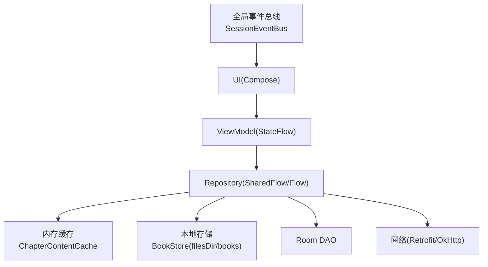
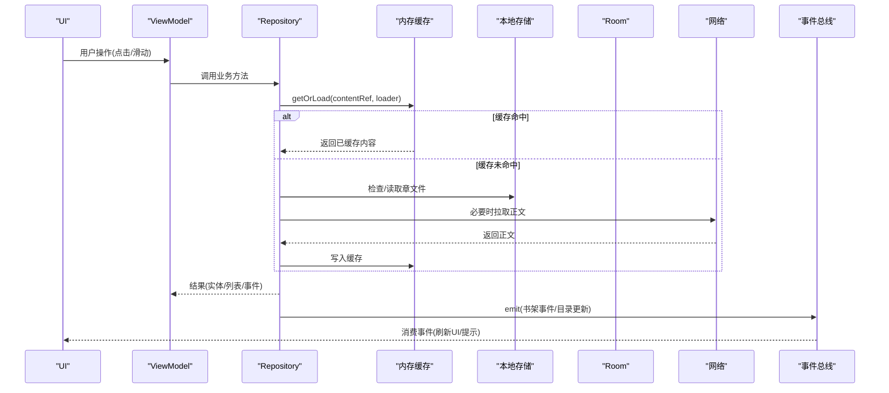
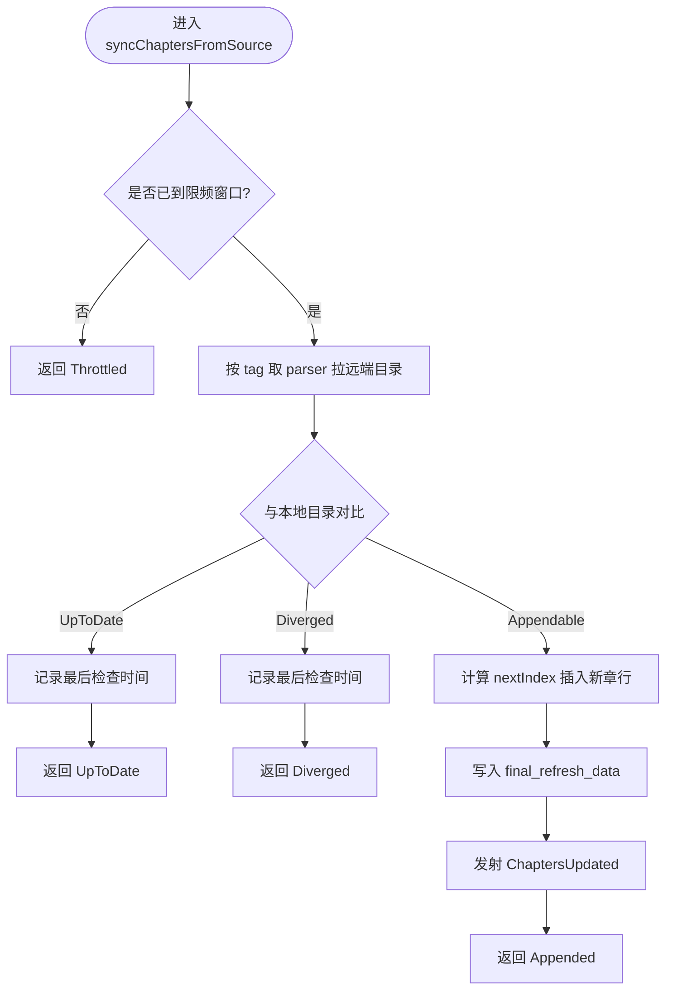
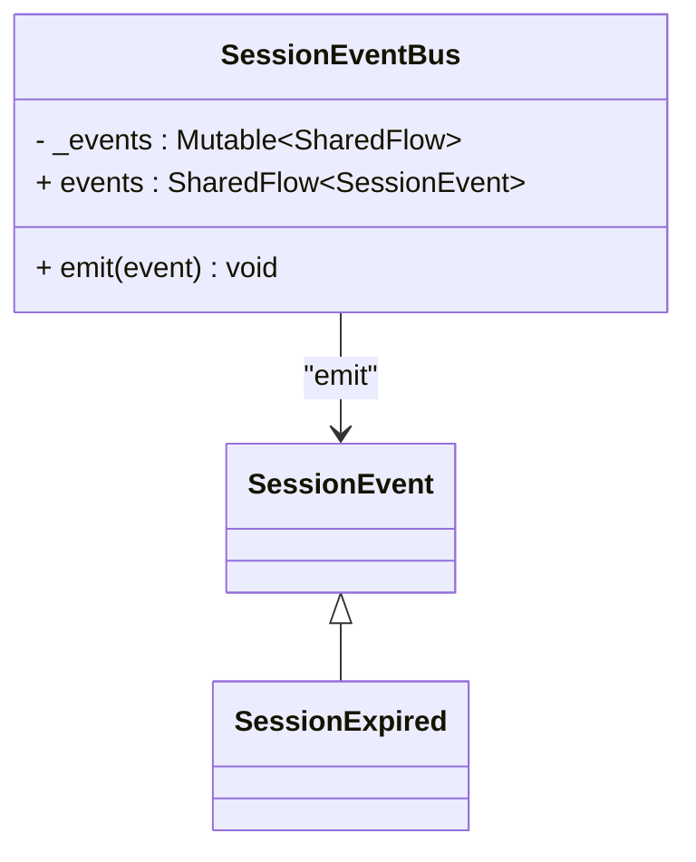
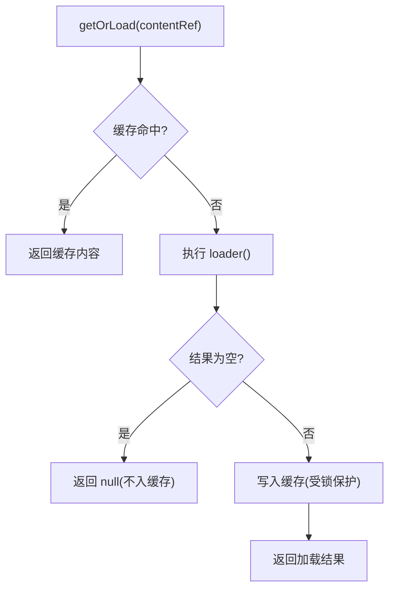
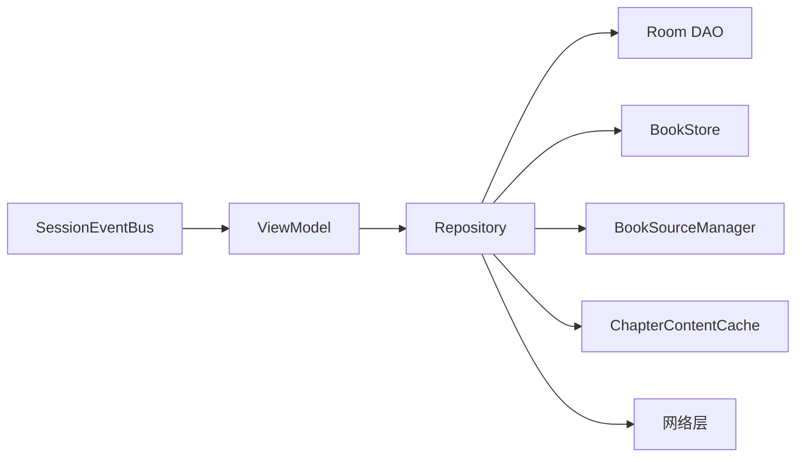

# 数据流与状态管理

<cite>
**本文引用的文件**   
- [README.MD](file://README.MD)
- [BookRepository.kt](file://lib_book_common/src/main/java/com/ebook/common/repository/BookRepository.kt)
- [SessionEventBus.kt](file://lib_ebook_api/src/main/java/com/ebook/api/auth/SessionEventBus.kt)
- [ChapterContentCache.kt](file://lib_book_common/src/main/java/com/ebook/common/store/ChapterContentCache.kt)
- [ThemeModeManager.kt](file://lib_book_common/src/main/java/com/ebook/common/domain/ThemeModeManager.kt)
- [LibraryViewModel.kt](file://module_find/src/main/java/com/ebook/find/mvvm/viewmodel/LibraryViewModel.kt)
- [BookStore.kt](file://lib_book_common/src/main/java/com/ebook/common/store/BookStore.kt)
</cite>

## 目录
1. [引言](#引言)
2. [项目结构](#项目结构)
3. [核心组件](#核心组件)
4. [架构总览](#架构总览)
5. [详细组件分析](#详细组件分析)
6. [依赖分析](#依赖分析)
7. [性能考虑](#性能考虑)
8. [故障排查指南](#故障排查指南)
9. [结论](#结论)

## 引言
本文件聚焦项目的数据流与状态管理，围绕 MVVM 单向数据流、响应式状态（StateFlow/SharedFlow）、事件总线、缓存策略、在线与本地同步、异步协调与取消机制、以及性能优化策略进行系统化说明。文档以仓库现有实现为依据，给出数据流图与状态转换图，并附带代码路径以便追溯。

## 项目结构
- 应用采用 MVVM + 多模块架构：业务模块 → lib_book_common → lib_book_source → lib_ebook_api / lib_ebook_db。
- UI 层使用 Compose；状态通过 StateFlow/SharedFlow 暴露给 UI；业务逻辑集中在 ViewModel 与 Repository；持久化与网络在底层库中实现。
- 事件总线统一使用 SharedFlow，替代旧版 RxBus。

图表来源
- [LibraryViewModel.kt:102-294](file://module_find/src/main/java/com/ebook/find/mvvm/viewmodel/LibraryViewModel.kt#L102-L294)
- [BookRepository.kt:51-892](file://lib_book_common/src/main/java/com/ebook/common/repository/BookRepository.kt#L51-L892)
- [ChapterContentCache.kt:25-63](file://lib_book_common/src/main/java/com/ebook/common/store/ChapterContentCache.kt#L25-L63)
- [BookStore.kt:37-216](file://lib_book_common/src/main/java/com/ebook/common/store/BookStore.kt#L37-L216)
- [SessionEventBus.kt:30-44](file://lib_ebook_api/src/main/java/com/ebook/api/auth/SessionEventBus.kt#L30-L44)

章节来源
- [README.MD:86-120](file://README.MD#L86-L120)

## 核心组件
- BookRepository：书架与阅读数据的核心仓库，负责书架 CRUD、阅读进度、正文读取路由、换源事务、目录重抓追加、评论键合并等，并通过 SharedFlow 广播书架事件。
- ChapterContentCache：章节正文的内存 LRU 缓存，按 content_ref 键存取，支持按书级失效。
- BookStore：本地内容仓库，按 books/<书目录>/cNNNNN.txt 组织章文件，提供读写、统计、对账能力。
- SessionEventBus：会话级全局事件总线（如 token 刷新失败），用于跨层通知 UI 清会话并跳转登录。
- ThemeModeManager：主题模式的状态与持久化，通过 StateFlow 暴露当前模式供 App 装配。
- LibraryViewModel：书城页面状态聚合，组合 currentSource 与可用性标记，驱动书库加载与刷新策略。

章节来源
- [BookRepository.kt:38-892](file://lib_book_common/src/main/java/com/ebook/common/repository/BookRepository.kt#L38-L892)
- [ChapterContentCache.kt:7-63](file://lib_book_common/src/main/java/com/ebook/common/store/ChapterContentCache.kt#L7-L63)
- [BookStore.kt:8-216](file://lib_book_common/src/main/java/com/ebook/common/store/BookStore.kt#L8-L216)
- [SessionEventBus.kt:9-44](file://lib_ebook_api/src/main/java/com/ebook/api/auth/SessionEventBus.kt#L9-L44)
- [ThemeModeManager.kt:10-92](file://lib_book_common/src/main/java/com/ebook/common/domain/ThemeModeManager.kt#L10-L92)
- [LibraryViewModel.kt:27-294](file://module_find/src/main/java/com/ebook/find/mvvm/viewmodel/LibraryViewModel.kt#L27-L294)

## 架构总览
MVVM 单向数据流：
- UI 通过 StateFlow 订阅 ViewModel 暴露的状态变化，触发重组渲染。
- ViewModel 调用 Repository 的业务方法，Repository 编排网络、数据库、本地存储与缓存。
- Repository 通过 SharedFlow 发出领域事件（如书架变更、目录更新），供多个消费者处理。
- 会话级异常通过 SessionEventBus 广播，UI 层订阅后执行统一处置（清会话、提示、跳转）。

图表来源
- [BookRepository.kt:455-475](file://lib_book_common/src/main/java/com/ebook/common/repository/BookRepository.kt#L455-L475)
- [ChapterContentCache.kt:41-46](file://lib_book_common/src/main/java/com/ebook/common/store/ChapterContentCache.kt#L41-L46)
- [BookStore.kt:50-60](file://lib_book_common/src/main/java/com/ebook/common/store/BookStore.kt#L50-L60)
- [SessionEventBus.kt:31-44](file://lib_ebook_api/src/main/java/com/ebook/api/auth/SessionEventBus.kt#L31-L44)

## 详细组件分析

### 仓库层数据流与事件（BookRepository）
- 事件通道：使用 MutableSharedFlow 暴露 bookShelfEvents，发射 Added/Removed/ProgressUpdated/ChaptersUpdated 等事件，供 UI 或跨模块消费。
- 正文读取链路：loadChapter 根据 BookFormat 路由到对应 ChapterReader，规范化段落后进入 ChapterContentCache 缓存；不存在时走网络抓取并写盘。
- 目录同步：syncChaptersFromSource 限频判断 → 解析远端目录 → 与本地对比 → 仅接受纯追加 → 写入新行并记录最后检查时间 → 成功后发射 ChaptersUpdated。
- 换源事务：switchSource 在网络外解析详情与目录，随后在一个写事务内完成“插新→吸收旧键→删旧→清旧队列”的原子落库，确保一致性。
- 缓存失效：删除书/章节重抓时调用 contentCache.invalidateBook 按书级片段剔除条目，保证后续读取能获取最新内容。

图表来源
- [BookRepository.kt:512-612](file://lib_book_common/src/main/java/com/ebook/common/repository/BookRepository.kt#L512-L612)

章节来源
- [BookRepository.kt:75-892](file://lib_book_common/src/main/java/com/ebook/common/repository/BookRepository.kt#L75-L892)

### 事件总线（SessionEventBus）
- 设计要点：单订阅语义下使用 extraBufferCapacity=1 的 SharedFlow，非阻塞 tryEmit，重复过期事件可丢弃，避免阻塞请求线程。
- 事件类型：SessionExpired 表示 refresh token 刷新失败，需清会话+提示+跳转登录。
- 作用域：事件定义与发射在 lib_ebook_api，上层模块订阅并处理，解耦网络层与 UI。

图表来源
- [SessionEventBus.kt:12-44](file://lib_ebook_api/src/main/java/com/ebook/api/auth/SessionEventBus.kt#L12-L44)

章节来源
- [SessionEventBus.kt:9-44](file://lib_ebook_api/src/main/java/com/ebook/api/auth/SessionEventBus.kt#L9-L44)

### 内存缓存（ChapterContentCache）
- 容量策略：默认容量为 3（当前章 + 前后各一章），满足翻页预读需求。
- 键设计：使用 content_ref（含书目录名片段），便于按书级失效（cacheMarker）。
- 并发安全：内部使用 Mutex 保护 entries，getOrLoad 在锁外执行 loader，避免读盘阻塞其他章。
- 失效入口：invalidateBook 按书级片段剔除条目；clear 清空全部。

图表来源
- [ChapterContentCache.kt:41-57](file://lib_book_common/src/main/java/com/ebook/common/store/ChapterContentCache.kt#L41-L57)

章节来源
- [ChapterContentCache.kt:7-63](file://lib_book_common/src/main/java/com/ebook/common/store/ChapterContentCache.kt#L7-L63)

### 本地存储（BookStore）
- 文件组织：books/<书目录>/cNNNNN.txt，UTF-8 存储，段落以 LF 分隔。
- 目录命名：dirName 对非法字符的 bookId 取 MD5，避免路径问题与冲突。
- 统计与对账：storageUsage 一次遍历得到字节数与册数；reconcile 清理无主目录、.tmp 残留与散落文件。
- 章节操作：writeChapter/readParagraphs/deleteChapter；导入过程 beginImport/commitImport/abortImport。

章节来源
- [BookStore.kt:18-216](file://lib_book_common/src/main/java/com/ebook/common/store/BookStore.kt#L18-L216)

### 主题状态（ThemeModeManager）
- 状态持久化：将用户选择的主题模式写入 SharedPreferences，并以 StateFlow 暴露当前值。
- 应用集成：installIntoCompanion 将实例挂到伴生对象，供主题装配 lambda 读取，实现全局主题即时切换。

章节来源
- [ThemeModeManager.kt:10-92](file://lib_book_common/src/main/java/com/ebook/common/domain/ThemeModeManager.kt#L10-L92)

### 书城页面状态（LibraryViewModel）
- 状态聚合：currentSource 与 _sourceUnusable 通过 combine 产出 sourceState，首帧 Unknown，待 Room 返回后再落到 Ready/NoSource/BrokenSource。
- 加载策略：默认 SWR（先展示缓存再刷新），下拉刷新强制网络；换源时清空列表并重新加载，避免错配。
- 取消机制：在途 Job 在换源或销毁时取消，防止慢请求覆盖新源数据。

章节来源
- [LibraryViewModel.kt:27-294](file://module_find/src/main/java/com/ebook/find/mvvm/viewmodel/LibraryViewModel.kt#L27-L294)

## 依赖分析
- 依赖方向：业务模块依赖 lib_book_common，后者依赖 lib_book_source、lib_ebook_api、lib_ebook_db。
- 关键耦合点：
  - Repository 依赖 DAO、Store、Parser Manager、缓存，职责清晰、边界明确。
  - 事件总线位于网络层（lib_ebook_api），上层订阅，避免反向依赖。
  - 缓存与存储分离，Repository 作为编排者，不侵入具体 IO 细节。

图表来源
- [BookRepository.kt:51-74](file://lib_book_common/src/main/java/com/ebook/common/repository/BookRepository.kt#L51-L74)
- [LibraryViewModel.kt:102-140](file://module_find/src/main/java/com/ebook/find/mvvm/viewmodel/LibraryViewModel.kt#L102-L140)
- [SessionEventBus.kt:31-44](file://lib_ebook_api/src/main/java/com/ebook/api/auth/SessionEventBus.kt#L31-L44)

章节来源
- [README.MD:86-120](file://README.MD#L86-L120)

## 性能考虑
- 懒加载与缓存：
  - 正文读取优先命中 ChapterContentCache，减少重复 I/O。
  - 书城书库采用 SWR 策略，冷启动秒开，后台静默刷新。
- 批量更新：
  - 目录追加批量插入新章行，减少多次往返。
  - storageUsage 一次遍历统计字节与册数，避免多次扫描。
- 内存优化：
  - 内存缓存容量固定为 3，避免常驻过多正文占用内存。
  - 按书级失效精准剔除，不影响其他书籍缓存。
- 线程与协程：
  - 网络与数据库操作在 Dispatchers.IO 执行，避免阻塞主线程。
  - 取消传播：ViewModel 中的 in-flight Job 在换源/销毁时取消，避免无用工作。

[本节为通用性能指导，无需特定文件引用]

## 故障排查指南
- 会话过期：
  - 现象：token 刷新失败导致会话不可用。
  - 处理：SessionEventBus 发射 SessionExpired，UI 订阅后清会话、提示并跳转登录。
- 目录分叉：
  - 现象：远端目录结构与本地不一致，无法安全追加。
  - 处理：syncChaptersFromSource 返回 Diverged，不修改本地数据，由用户换源或重新导入。
- 缓存不一致：
  - 现象：强刷或下载成功后仍显示旧内容。
  - 处理：确保调用 contentCache.invalidateBook 按书级失效，并重读正文。
- 本地文件对账：
  - 现象：存在无主文件或 .tmp 残留占用空间。
  - 处理：启动时调用 BookStore.reconcile(liveBookIds) 清理孤儿目录与散落文件。

章节来源
- [SessionEventBus.kt:12-44](file://lib_ebook_api/src/main/java/com/ebook/api/auth/SessionEventBus.kt#L12-L44)
- [BookRepository.kt:556-598](file://lib_book_common/src/main/java/com/ebook/common/repository/BookRepository.kt#L556-L598)
- [ChapterContentCache.kt:48-53](file://lib_book_common/src/main/java/com/ebook/common/store/ChapterContentCache.kt#L48-L53)
- [BookStore.kt:141-160](file://lib_book_common/src/main/java/com/ebook/common/store/BookStore.kt#L141-L160)

## 结论
本项目采用清晰的 MVVM 单向数据流，结合 StateFlow/SharedFlow 实现响应式状态与事件驱动。Repository 作为编排中心，统一处理网络、数据库、本地存储与缓存，并通过 SharedFlow 广播领域事件。缓存策略分层合理（内存 LRU + 本地文件 + 网络回源），同步机制严格限制为纯追加以避免数据漂移。异步操作通过协程作用域与取消机制保障资源安全。整体设计兼顾性能、一致性与可维护性，适合大规模电子书阅读场景。