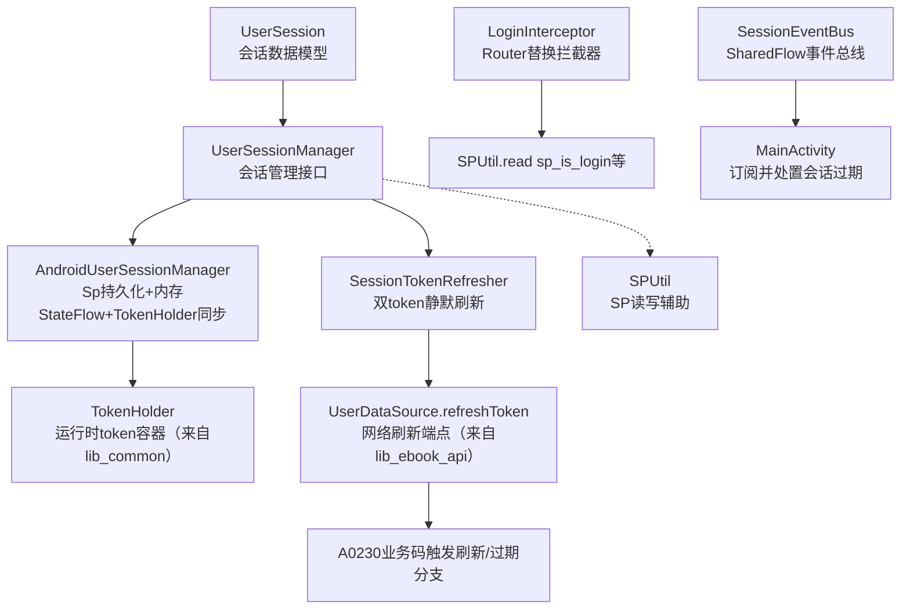
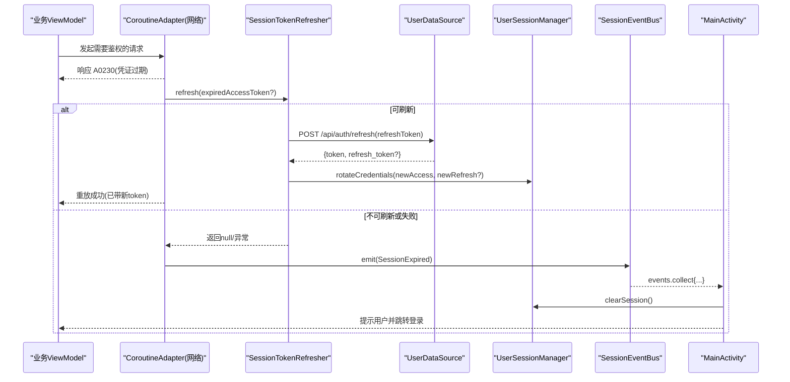
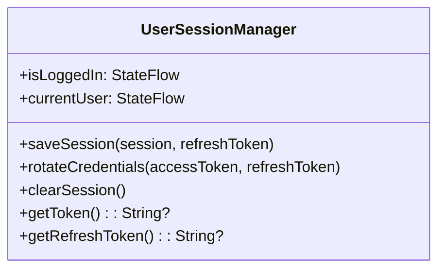
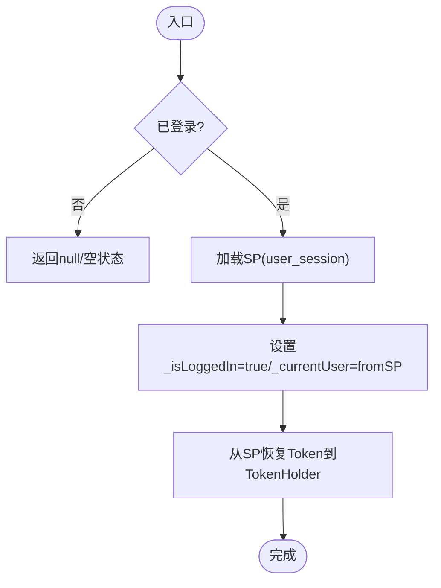
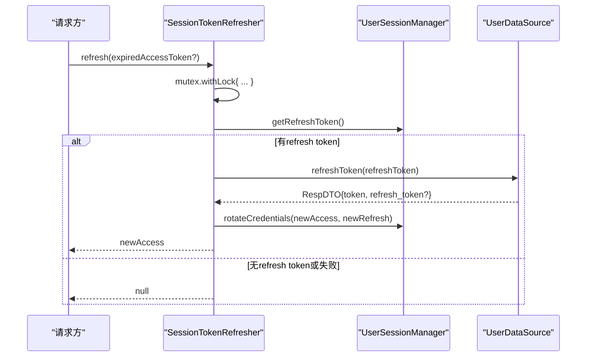
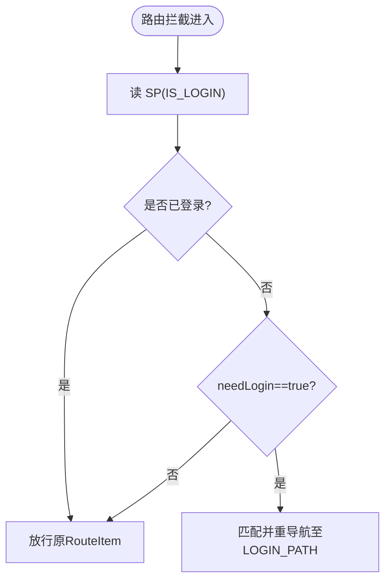

# 会话管理

<cite>
**本文引用的文件**
- [UserSession.kt](file://lib_book_common/src/main/java/com/ebook/common/domain/UserSession.kt)
- [UserSessionManager.kt](file://lib_book_common/src/main/java/com/ebook/common/domain/UserSessionManager.kt)
- [AndroidUserSessionManager.kt](file://lib_book_common/src/main/java/com/ebook/common/domain/AndroidUserSessionManager.kt)
- [SessionTokenRefresher.kt](file://lib_book_common/src/main/java/com/ebook/common/domain/SessionTokenRefresher.kt)
- [LoginInterceptor.kt](file://lib_book_common/src/main/java/com/ebook/common/interceptor/LoginInterceptor.kt)
- [SPUtil.kt](file://lib_book_common/src/main/java/com/ebook/common/util/SPUtil.kt)
- [KeyCode.kt](file://lib_book_common/src/main/java/com/ebook/common/event/KeyCode.kt)
- [SessionEventBus.kt](file://lib_ebook_api/src/main/java/com/ebook/api/auth/SessionEventBus.kt)
- [SessionModule.kt](file://lib_book_common/src/main/java/com/ebook/common/di/SessionModule.kt)
- [MainActivity.kt](file://module_main/src/main/java/com/ebook/main/MainActivity.kt)
- [0010-silent-refresh-seam-and-session-expiry-bus.md](file://docs/adr/0010-silent-refresh-seam-and-session-expiry-bus.md)
- [0011-token-identity-decoupling-token-only-refresh.md](file://docs/adr/0011-token-identity-decoupling-token-only-refresh.md)
</cite>

## 目录
1. [引言](#引言)
2. [项目结构（与会话相关的模块）](#项目结构与会话相关的模块)
3. [核心组件总览](#核心组件总览)
4. [架构概览](#架构概览)
5. [详细组件分析](#详细组件分析)
6. [依赖关系分析](#依赖关系分析)
7. [性能与并发特性](#性能与并发特性)
8. [故障排查指南](#故障排查指南)
9. [结论](#结论)

## 引言
本文聚焦于应用的“会话生命周期管理”，系统性说明用户从登录到登出、多端会话状态一致性、以及访问令牌与刷新令牌的自动续期与过期处理。围绕 UserSessionManager 的核心职责，解析 token 管理策略、事件驱动的会话过期处理、登录拦截机制、以及 SP 持久化与内存缓存的一致性保障。

## 项目结构（与会话相关的模块）
与会话相关的关键代码分布在以下位置：
- lib_book_common: 会话实体、会话管理器实现、令牌刷新器、登录拦截器、SP 工具、路由键常量、Hilt 装配
- lib_ebook_api: 会话事件总线（SharedFlow），定义并暴露全局会话级事件
- module_main: 主界面订阅会话过期事件并执行清会话、提示与跳转登录的统一处置



图表来源
- [UserSession.kt:1-17](file://lib_book_common/src/main/java/com/ebook/common/domain/UserSession.kt#L1-L17)
- [UserSessionManager.kt:5-62](file://lib_book_common/src/main/java/com/ebook/common/domain/UserSessionManager.kt#L5-L62)
- [AndroidUserSessionManager.kt:17-161](file://lib_book_common/src/main/java/com/ebook/common/domain/AndroidUserSessionManager.kt#L17-L161)
- [SessionTokenRefresher.kt:15-96](file://lib_book_common/src/main/java/com/ebook/common/domain/SessionTokenRefresher.kt#L15-L96)
- [SessionEventBus.kt:1-44](file://lib_ebook_api/src/main/java/com/ebook/api/auth/SessionEventBus.kt#L1-L44)
- [MainActivity.kt:57-80](file://module_main/src/main/java/com/ebook/main/MainActivity.kt#L57-L80)
- [LoginInterceptor.kt:14-42](file://lib_book_common/src/main/java/com/ebook/common/interceptor/LoginInterceptor.kt#L14-L42)

章节来源
- [UserSession.kt:1-17](file://lib_book_common/src/main/java/com/ebook/common/domain/UserSession.kt#L1-L17)
- [UserSessionManager.kt:5-62](file://lib_book_common/src/main/java/com/ebook/common/domain/UserSessionManager.kt#L5-L62)
- [AndroidUserSessionManager.kt:17-161](file://lib_book_common/src/main/java/com/ebook/common/domain/AndroidUserSessionManager.kt#L17-L161)
- [SessionTokenRefresher.kt:15-96](file://lib_book_common/src/main/java/com/ebook/common/domain/SessionTokenRefresher.kt#L15-L96)
- [LoginInterceptor.kt:14-42](file://lib_book_common/src/main/java/com/ebook/common/interceptor/LoginInterceptor.kt#L14-L42)
- [SPUtil.kt:13-93](file://lib_book_common/src/main/java/com/ebook/common/util/SPUtil.kt#L13-L93)
- [KeyCode.kt:13-42](file://lib_book_common/src/main/java/com/ebook/common/event/KeyCode.kt#L13-L42)
- [SessionEventBus.kt:1-44](file://lib_ebook_api/src/main/java/com/ebook/api/auth/SessionEventBus.kt#L1-L44)
- [MainActivity.kt:57-80](file://module_main/src/main/java/com/ebook/main/MainActivity.kt#L57-L80)

## 核心组件总览
- UserSession: 携带 userId/username/nickname/avatar/token/refreshToken，作为跨模块的会话语义类型，其中 refreshToken 仅用于登录结果映射后保存。
- UserSessionManager: 抽象接口，集中暴露 isLoggedIn/currentUser 的 StateFlow，提供 saveSession、rotateCredentials、clearSession、getToken、getRefreshToken。
- AndroidUserSessionManager: Android 实现，使用 SharedPreferences（user_session）持久化身份与 refresh token；access token 仅驻内存（TokenHolder）。维护内存 StateFlow，并在启动时恢复 TokenHolder。
- SessionTokenRefresher: 实现 TokenRefresher 接缝，基于 Mutex 的单飞互斥串行化刷新，刷新成功仅调用 rotateCredentials，不重建身份。
- LoginInterceptor: TheRouter 路由拦截器，在跳转前检查是否需要登录，读取 SP 中的登录态并决定是否跳登录页。
- SessionEventBus: SharedFlow 事件总线，统一对外发射“会话过期”事件，调用方零分支消费。
- MainActivity: 监听 SessionExpired 事件，执行清会话、Toast、跳转登录。

章节来源
- [UserSession.kt:1-17](file://lib_book_common/src/main/java/com/ebook/common/domain/UserSession.kt#L1-L17)
- [UserSessionManager.kt:5-62](file://lib_book_common/src/main/java/com/ebook/common/domain/UserSessionManager.kt#L5-L62)
- [AndroidUserSessionManager.kt:17-161](file://lib_book_common/src/main/java/com/ebook/common/domain/AndroidUserSessionManager.kt#L17-L161)
- [SessionTokenRefresher.kt:15-96](file://lib_book_common/src/main/java/com/ebook/common/domain/SessionTokenRefresher.kt#L15-L96)
- [LoginInterceptor.kt:14-42](file://lib_book_common/src/main/java/com/ebook/common/interceptor/LoginInterceptor.kt#L14-L42)
- [SessionEventBus.kt:1-44](file://lib_ebook_api/src/main/java/com/ebook/api/auth/SessionEventBus.kt#L1-L44)
- [MainActivity.kt:57-80](file://module_main/src/main/java/com/ebook/main/MainActivity.kt#L57-L80)

## 架构概览
会话管理贯穿“UI → 业务 → 网络 → 存储”，采用分层解耦设计：
- UI 层通过 UserSessionManager.flow 观察登录态，页面渲染受控。
- 网络层遇到会话过期时（如 A0230）交给 TokenRefresher 进行静默刷新，成功后重放一次请求；失败则通过 SessionEventBus 广播会话过期。
- 存储层通过 SP 持久化身份与 refresh token，access token 仅驻内存，避免落盘扩大攻击面。
- 路由层 LoginInterceptor 基于 SP 判断是否跳转到登录页。



图表来源
- [SessionTokenRefresher.kt:50-91](file://lib_book_common/src/main/java/com/ebook/common/domain/SessionTokenRefresher.kt#L50-L91)
- [AndroidUserSessionManager.kt:87-98](file://lib_book_common/src/main/java/com/ebook/common/domain/AndroidUserSessionManager.kt#L87-L98)
- [SessionEventBus.kt:30-43](file://lib_ebook_api/src/main/java/com/ebook/api/auth/SessionEventBus.kt#L30-L43)
- [MainActivity.kt:71-79](file://module_main/src/main/java/com/ebook/main/MainActivity.kt#L71-L79)
- [0010-silent-refresh-seam-and-session-expiry-bus.md:1-64](file://docs/adr/0010-silent-refresh-seam-and-session-expiry-bus.md#L1-L64)

## 详细组件分析

### UserSession（会话数据模型）
- 字段包括用户标识、昵称、头像、当前 token，及可选的 refreshToken（仅登录映射时填充）。
- 设计约束：refreshToken 仅在登录过程用于持久化，后续静默刷新路径不再直接写入该对象，而是通过 rotateCredentials 更新内部持久化和内存 state。

章节来源
- [UserSession.kt:1-17](file://lib_book_common/src/main/java/com/ebook/common/domain/UserSession.kt#L1-L17)

### UserSessionManager（会话管理接口）
- 暴露 StateFlow 的观察接口 isLoggedIn/currentUser。
- 关键方法：
  - saveSession：登录/注册建立会话，同步 token 到 TokenHolder 并持久化身份和 refresh token。
  - rotateCredentials：仅轮换凭证，不改身份。
  - clearSession：清除所有镜像（内存、SP、兼容SP、ProfileRepository 流）。
  - getToken/getRefreshToken：运行时 token 取自 TokenHolder；refresh token 取持久值。



图表来源
- [UserSessionManager.kt:5-62](file://lib_book_common/src/main/java/com/ebook/common/domain/UserSessionManager.kt#L5-L62)

章节来源
- [UserSessionManager.kt:5-62](file://lib_book_common/src/main/java/com/ebook/common/domain/UserSessionManager.kt#L5-L62)

### AndroidUserSessionManager（Android 实现）
- 持久化：
  - user_session SP 文件：is_logged_in、refresh_token、user_id、username、nickname、avatar。
  - 兼容层：spUtils 的 SP_IS_LOGIN、SP_USERNAME、SP_NICKNAME、SP_USER_ID、SP_IMAGE，供旧版 LoginInterceptor 读取。
- 内存状态：
  - MutableStateFlow 持有 _isLoggedIn/_currentUser；冷启动时根据 SP 恢复 currentUser。
  - 启动初始化将持久化的 token 注入 TokenHolder，供 AuthInterceptor 使用。
- 关键逻辑：
  - saveSession：写入用户信息至 SP 与 spUtils，设置登录标记与用户名/头像等兼容字段；access token 只写 TokenHolder，不落盘。
  - rotateCredentials：仅更新内存 currentUser.token 与 TokenHolder；refresh token 落盘，不会改写身份。
  - clearSession：三处镜像一致失效——内存 StateFlow、user_session、spUtils、ProfileRepository 流。



图表来源
- [AndroidUserSessionManager.kt:35-52](file://lib_book_common/src/main/java/com/ebook/common/domain/AndroidUserSessionManager.kt#L35-L52)
- [AndroidUserSessionManager.kt:135-146](file://lib_book_common/src/main/java/com/ebook/common/domain/AndroidUserSessionManager.kt#L135-L146)

章节来源
- [AndroidUserSessionManager.kt:17-161](file://lib_book_common/src/main/java/com/ebook/common/domain/AndroidUserSessionManager.kt#L17-L161)
- [SPUtil.kt:78-89](file://lib_book_common/src/main/java/com/ebook/common/util/SPUtil.kt#L78-L89)
- [KeyCode.kt:13-42](file://lib_book_common/src/main/java/com/ebook/common/event/KeyCode.kt#L13-L42)

### SessionTokenRefresher（静默刷新器）
- 单飞互斥：使用 Mutex 串行刷新；进锁后若当前 token 与触发过期的不同，视为已被其它请求刷新，直接复用。
- 刷新流程：
  - 获取 refresh token；若无则跳过。
  - 调用 UserDataSource.refreshToken(RefreshTokenRequest)。
  - 成功：调用 UserSessionManager.rotateCredentials，只更凭证。
  - 失败/无响应：记录日志，返回 null。
- 设计要点：绕过 CoroutineAdapter 的安全封装，避免 A0230 死循环；严格遵循刷新端点只返回凭证的契约。



图表来源
- [SessionTokenRefresher.kt:50-91](file://lib_book_common/src/main/java/com/ebook/common/domain/SessionTokenRefresher.kt#L50-L91)
- [AndroidUserSessionManager.kt:87-98](file://lib_book_common/src/main/java/com/ebook/common/domain/AndroidUserSessionManager.kt#L87-L98)

章节来源
- [SessionTokenRefresher.kt:15-96](file://lib_book_common/src/main/java/com/ebook/common/domain/SessionTokenRefresher.kt#L15-L96)
- [0010-silent-refresh-seam-and-session-expiry-bus.md:1-64](file://docs/adr/0010-silent-refresh-seam-and-session-expiry-bus.md#L1-L64)

### LoginInterceptor（登录拦截器）
- 在 TheRouter 路由跳转期间执行，优先级为 6。
- 依据 SP 中 is_login 标志决定放行或重定向到 LOGIN_PATH。
- 目标页面可通过 extra needLogin 指定是否需要登录态。



图表来源
- [LoginInterceptor.kt:14-42](file://lib_book_common/src/main/java/com/ebook/common/interceptor/LoginInterceptor.kt#L14-L42)
- [KeyCode.kt:13-42](file://lib_book_common/src/main/java/com/ebook/common/event/KeyCode.kt#L13-L42)
- [SPUtil.kt:13-47](file://lib_book_common/src/main/java/com/ebook/common/util/SPUtil.kt#L13-L47)

章节来源
- [LoginInterceptor.kt:14-42](file://lib_book_common/src/main/java/com/ebook/common/interceptor/LoginInterceptor.kt#L14-L42)
- [SPUtil.kt:13-47](file://lib_book_common/src/main/java/com/ebook/common/util/SPUtil.kt#L13-L47)

### SessionEventBus（会话事件总线）
- 通过 MutableSharedFlow(extraBufferCapacity=1) 实现单订阅、缓冲丢重发的幂等事件分发。
- 统一事件：SessionExpired（会话无法恢复）。
- 发射侧在 lib_ebook_api（网络层），订阅侧在上层模块（MainActivity）。

章节来源
- [SessionEventBus.kt:1-44](file://lib_ebook_api/src/main/java/com/ebook/api/auth/SessionEventBus.kt#L1-L44)

### 主进程会话过期处置（MainActivity）
- 在 onCreate 中使用 lifecycleScope 订阅 sessionEventBus.events。
- 当收到 SessionExpired 时：清除会话、提示用户、TheRouter 跳转登录页。

章节来源
- [MainActivity.kt:57-80](file://module_main/src/main/java/com/ebook/main/MainActivity.kt#L57-L80)
- [0010-silent-refresh-seam-and-session-expiry-bus.md:32-39](file://docs/adr/0010-silent-refresh-seam-and-session-expiry-bus.md#L32-L39)

### 依赖注入与装配（SessionModule）
- Hilt 模块绑定：
  - UserSessionManager 接口 -> AndroidUserSessionManager 实现
  - TokenRefresher 接口 -> SessionTokenRefresher 实现
- 将刷新能力注入网络层的 CoroutineAdapter（详见 ADR-0010）。

章节来源
- [SessionModule.kt:13-37](file://lib_book_common/src/main/java/com/ebook/common/di/SessionModule.kt#L13-L37)
- [0010-silent-refresh-seam-and-session-expiry-bus.md:18-22](file://docs/adr/0010-silent-refresh-seam-and-session-expiry-bus.md#L18-L22)

## 依赖关系分析
- 依赖方向遵循：业务模块 → lib_book_common → lib_ebook_api → lib_ebook_db。
- 会话管理跨模块协作：
  - lib_book_common 提供会话管理与刷新实现，向下依赖 lib_ebook_api 的网络接口与事件总线。
  - module_main 订阅事件并完成 UI 层兜底。

```mermaid
graph LR
    subgraph "UI层"
      M["MainActivity"]
    end
    subgraph "共享层(lib_book_common)"
      USM["AndroidUserSessionManager"]
      STR["SessionTokenRefresher"]
      LI["LoginInterceptor"]
      MOD["SessionModule(Hilt)"]
    end
    subgraph "网络层(lib_ebook_api)"
      SEB["SessionEventBus"]
      API["UserDataSource/接口"]
    end

    M -->|订阅| SEB
    M -->|清理| USM
    SEB <--|事件| NET["网络层调度"]
    NET -->|刷新| STR
    STR --> API
    STR --> USM
    LI --> USM
    MOD -->|@Binds| USM
    MOD -->|@Binds| STR
```

图表来源
- [SessionModule.kt:22-37](file://lib_book_common/src/main/java/com/ebook/common/di/SessionModule.kt#L22-L37)
- [SessionTokenRefresher.kt:41-46](file://lib_book_common/src/main/java/com/ebook/common/domain/SessionTokenRefresher.kt#L41-L46)
- [AndroidUserSessionManager.kt:28-33](file://lib_book_common/src/main/java/com/ebook/common/domain/AndroidUserSessionManager.kt#L28-L33)
- [SessionEventBus.kt:30-43](file://lib_ebook_api/src/main/java/com/ebook/api/auth/SessionEventBus.kt#L30-L43)

章节来源
- [SessionModule.kt:13-37](file://lib_book_common/src/main/java/com/ebook/common/di/SessionModule.kt#L13-L37)
- [SessionTokenRefresher.kt:15-96](file://lib_book_common/src/main/java/com/ebook/common/domain/SessionTokenRefresher.kt#L15-L96)
- [AndroidUserSessionManager.kt:17-161](file://lib_book_common/src/main/java/com/ebook/common/domain/AndroidUserSessionManager.kt#L17-L161)
- [SessionEventBus.kt:1-44](file://lib_ebook_api/src/main/java/com/ebook/api/auth/SessionEventBus.kt#L1-L44)

## 性能与并发特性
- 静默刷新单飞互斥：Mutex 确保同一时刻仅一次刷新，避免并发重复刷新导致服务端旧 refresh 被作废的问题。
- 事件非阻塞发射：tryEmit 配合缓冲容量 1，保证并发过期风暴时丢弃重复事件且不阻塞请求线程。
- 首请求静默续期：access token 只驻内存，冷启动首个请求走 A0230 触发 refresh，对用户无感。

章节来源
- [SessionTokenRefresher.kt:19-26](file://lib_book_common/src/main/java/com/ebook/common/domain/SessionTokenRefresher.kt#L19-L26)
- [SessionEventBus.kt:24-43](file://lib_ebook_api/src/main/java/com/ebook/api/auth/SessionEventBus.kt#L24-L43)
- [AndroidUserSessionManager.kt:67-78](file://lib_book_common/src/main/java/com/ebook/common/domain/AndroidUserSessionManager.kt#L67-L78)

## 故障排查指南
常见症状与根因定位建议：
- “登录后仍显示上一个身份”
  - 原因：clearSession 未调用 ProfileRepository.resetProfileState()。
  - 解决：一律调用 userSessionManager.clearSession()，由其内部统一清理三处镜像。
  - 参考路径：[AndroidUserSessionManager.kt:100-133](file://lib_book_common/src/main/java/com/ebook/common/domain/AndroidUserSessionManager.kt#L100-L133)
- “刷新失败后频繁提示或 Toast 重复”
  - 原因：调用方未识别 SessionExpired 标记，自行弹 Toast。
  - 解决：让网络层统一发事件，UI 层只做一次性处置；各 ViewModel onFailure 见过期标记仅记日志。
  - 参考路径：[0011-token-identity-decoupling-token-only-refresh.md:37-40](file://docs/adr/0011-token-identity-decoupling-token-only-refresh.md#L37-L40)
- “登录后仍可跳转到受限页面”
  - 原因：TheRouter 拦截器没有读取对应 flag 或未设置 needLogin。
  - 检查：LoginInterceptor 逻辑与页面参数是否正确传入。
  - 参考路径：[LoginInterceptor.kt:21-41](file://lib_book_common/src/main/java/com/ebook/common/interceptor/LoginInterceptor.kt#L21-L41)
- “冷启动后请求始终报权限不足”
  - 原因：TokenHolder 未恢复或 access token 为空导致校验失败。
  - 检查：启动恢复 token 是否写入 TokenHolder；首个请求是否触达刷新链路。
  - 参考路径：[AndroidUserSessionManager.kt:45-52](file://lib_book_common/src/main/java/com/ebook/common/domain/AndroidUserSessionManager.kt#L45-L52)

章节来源
- [AndroidUserSessionManager.kt:100-133](file://lib_book_common/src/main/java/com/ebook/common/domain/AndroidUserSessionManager.kt#L100-L133)
- [LoginInterceptor.kt:21-41](file://lib_book_common/src/main/java/com/ebook/common/interceptor/LoginInterceptor.kt#L21-L41)
- [SessionEventBus.kt:24-43](file://lib_ebook_api/src/main/java/com/ebook/api/auth/SessionEventBus.kt#L24-L43)
- [0011-token-identity-decoupling-token-only-refresh.md:37-40](file://docs/adr/0011-token-identity-decoupling-token-only-refresh.md#L37-L40)

## 结论
本项目的会话管理以 UserSessionManager 为核心，配合静默刷新与会话过期事件形成闭环。其关键特征如下：
- token 与身份解耦：刷新不改动身份，避免语义混淆。
- 安全存储：access token 仅驻内存，refresh token 持久化，密码不落盘。
- 高并发保护：Mutex 串行刷新、SharedFlow 非阻塞事件分发。
- 多态一致：清会话覆盖内存、SP 兼容键与 ProfileRepository 流，保证 UI 与后端一致。
- 低侵入接入：通过拦截器与事件总线对上层透明，减少散落的业务分支。