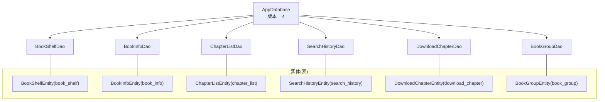
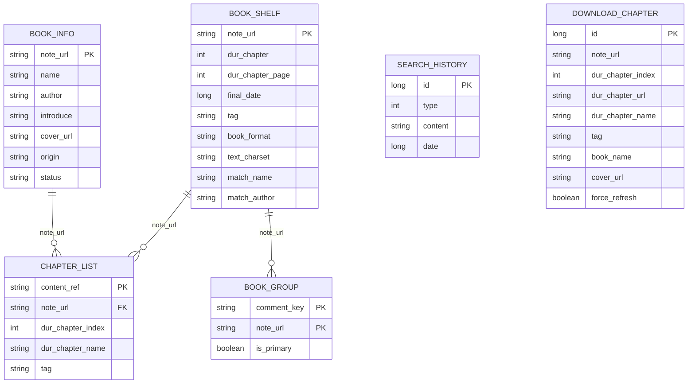
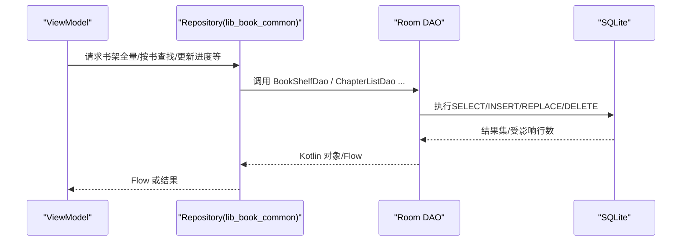
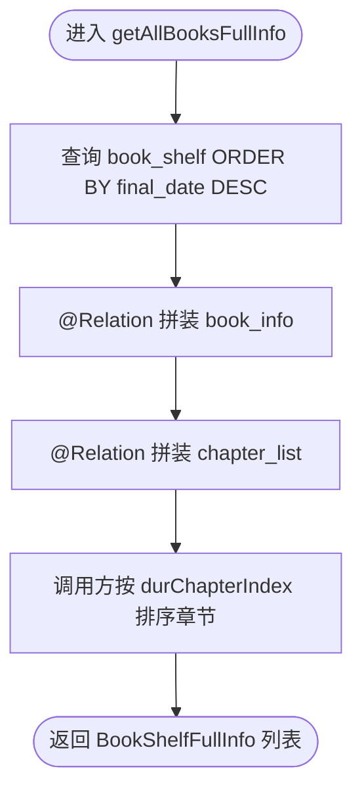
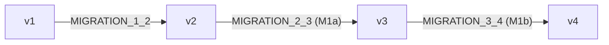

# 数据库设计

<cite>
**本文档引用的文件**
- [AppDatabase.kt](file://lib_ebook_db/src/main/java/com/ebook/db/AppDatabase.kt)
- [DatabaseModule.kt](file://lib_ebook_db/src/main/java/com/ebook/db/di/DatabaseModule.kt)
- [BookShelfEntity.kt](file://lib_ebook_db/src/main/java/com/ebook/db/entity/BookShelfEntity.kt)
- [BookInfoEntity.kt](file://lib_ebook_db/src/main/java/com/ebook/db/entity/BookInfoEntity.kt)
- [ChapterListEntity.kt](file://lib_ebook_db/src/main/java/com/ebook/db/entity/ChapterListEntity.kt)
- [SearchHistoryEntity.kt](file://lib_ebook_db/src/main/java/com/ebook/db/entity/SearchHistoryEntity.kt)
- [DownloadChapterEntity.kt](file://lib_ebook_db/src/main/java/com/ebook/db/entity/DownloadChapterEntity.kt)
- [BookGroupEntity.kt](file://lib_ebook_db/src/main/java/com/ebook/db/entity/BookGroupEntity.kt)
- [WebChapterEntity.kt](file://lib_ebook_db/src/main/java/com/ebook/db/entity/WebChapterEntity.kt)
- [BookShelfFullInfo.kt](file://lib_ebook_db/src/main/java/com/ebook/db/entity/BookShelfFullInfo.kt)
- [BookShelfDao.kt](file://lib_ebook_db/src/main/java/com/ebook/db/dao/BookShelfDao.kt)
- [BookInfoDao.kt](file://lib_ebook_db/src/main/java/com/ebook/db/dao/BookInfoDao.kt)
- [ChapterListDao.kt](file://lib_ebook_db/src/main/java/com/ebook/db/dao/ChapterListDao.kt)
- [SearchHistoryDao.kt](file://lib_ebook_db/src/main/java/com/ebook/db/dao/SearchHistoryDao.kt)
- [DownloadChapterDao.kt](file://lib_ebook_db/src/main/java/com/ebook/db/dao/DownloadChapterDao.kt)
- [BookGroupDao.kt](file://lib_ebook_db/src/main/java/com/ebook/db/dao/BookGroupDao.kt)
</cite>

## 目录
1. [简介](#简介)
2. [项目结构与数据层边界](#项目结构与数据层边界)
3. [核心实体与表结构](#核心实体与表结构)
4. [架构总览](#架构总览)
5. [关键组件深度解析](#关键组件深度解析)
6. [依赖关系与引用完整性](#依赖关系与引用完整性)
7. [版本迁移策略](#版本迁移策略)
8. [查询性能优化方案](#查询性能优化方案)
9. [并发访问与安全](#并发访问与安全)
10. [典型CRUD示例与最佳实践](#典型crud示例与最佳实践)
11. [故障排查指南](#故障排查指南)
12. [结论](#结论)

## 简介
本文件面向Android电子书阅读器的Room数据层，聚焦 lib_ebook_db 模块的数据库架构。文档从实体设计、关联约束、索引策略、迁移机制，到DAO调用模式、查询优化和并发安全给出系统化的说明，并配合图表帮助理解。目标读者既包括后端/Android工程师，也包括需要理解离线书架、章节缓存与下载队列的数据模型的业务方。

## 项目结构与数据层边界
- AppDatabase：声明当前版本号与参与的所有实体、导出Schema。六张持久化表分别是：书架（book_shelf）、书籍信息（book_info）、章节目录（chapter_list）、搜索历史（search_history）、下载队列（download_chapter）、作品分组（book_group）。正文字段在 v4 后迁至章文件，不再落库。
- DatabaseModule：Hilt注入数据库实例，集中放置 Migration 链（v1→v2、v2→v3、v3→v4），并暴露各DAO单例供上层Repository使用。
- Entity：对应SQLite表结构；部分非持久化传输模型（如 WebChapterEntity、LocBookShelfEntity、LibraryEntity）不参与 @Database(entities=...) 装配。
- DAO：每张表的CRUD入口，提供事务注解保证一致性、Flow响应式观察与高效查询接口。

**图示来源**
- [AppDatabase.kt:34-45](file://lib_ebook_db/src/main/java/com/ebook/db/AppDatabase.kt#L34-L45)
- [DatabaseModule.kt:23-124](file://lib_ebook_db/src/main/java/com/ebook/db/di/DatabaseModule.kt#L23-L124)

**本节来源**
- [AppDatabase.kt:8-64](file://lib_ebook_db/src/main/java/com/ebook/db/AppDatabase.kt#L8-L64)
- [DatabaseModule.kt:93-124](file://lib_ebook_db/src/main/java/com/ebook/db/di/DatabaseModule.kt#L93-L124)

## 核心实体与表结构
以下为各持久化实体的关键字段、主键策略、索引与注解说明。所有字段均以 @ColumnInfo 指定列名；仅作为展示或内存传递的属性以 @Ignore 标注不入库。

- book_shelf（书架行：书与书架的关系 + 进度）
  - 自然主键 note_url（对应书的来源地址）
  - dur_chapter、dur_chapter_page 保存当前阅读位置
  - final_date 最后阅读时间，用于排序
  - tag 书源归属标记
  - M1a新增：book_format、text_charset 本地书重解析元信息；match_name、match_author 评论匹配名
  - @Ignore 字段 bookInfo、chapterList 由UI/仓库填充，不落库
- book_info（书籍元数据）
  - 自然主键 note_url（网页书为根地址，本地书为MD5）
  - name、author、introduce、cover_url、origin、status
  - @Ignore chapterList 由外层拼装
- chapter_list（章节目录）
  - 自然主键 content_ref（原 dur_chapter_url，改名承载本地章文件相对路径，一章一定位符）
  - note_url 关联所属书籍
  - dur_chapter_index 序位、dur_chapter_name 名称、tag 来源标记
  - 索引 idx_chapter_list_note_url(note_url)
- search_history（搜索历史）
  - 自增主键 id
  - type、content、date（毫秒时间戳，作为展示排序键）
  - 无外键；去重在DAO层通过精确内容查询实现upsert
- download_chapter（下载队列表：未完成任务）
  - 自增主键 id（流水型数据）
  - note_url、dur_chapter_index/url/name、book_name、cover_url、tag
  - force_refresh 强制刷新标记（M2列）
  - 唯一索引 idx_download_chapter_dur_chapter_url(dur_chapter_url) 防重复排队
  - 普通索引 idx_download_chapter_note_url(note_url)
- book_group（作品分组关联）
  - 复合主键 (comment_key, note_url)
  - is_primary 标记写评论使用的键
  - 普通索引 idx_book_group_note_url(note_url)

注：ER图中未包含 search_history、download_chapter 的外键语义（均为逻辑约束+索引管理）。

**本节来源**
- [BookShelfEntity.kt:14-76](file://lib_ebook_db/src/main/java/com/ebook/db/entity/BookShelfEntity.kt#L14-L76)
- [BookInfoEntity.kt:13-69](file://lib_ebook_db/src/main/java/com/ebook/db/entity/BookInfoEntity.kt#L13-L69)
- [ChapterListEntity.kt:13-48](file://lib_ebook_db/src/main/java/com/ebook/db/entity/ChapterListEntity.kt#L13-L48)
- [SearchHistoryEntity.kt:19-43](file://lib_ebook_db/src/main/java/com/ebook/db/entity/SearchHistoryEntity.kt#L19-L43)
- [DownloadChapterEntity.kt:23-86](file://lib_ebook_db/src/main/java/com/ebook/db/entity/DownloadChapterEntity.kt#L23-L86)
- [BookGroupEntity.kt:21-37](file://lib_ebook_db/src/main/java/com/ebook/db/entity/BookGroupEntity.kt#L21-L37)

## 架构总览
数据存取边界清晰：业务模块 → Repository → DAO（Room生成的Query执行） → SQLite。AppDatabase 负责版本与装配；DatabaseModule 负责创建 Room 实例并注入DAO。

**图示来源**
- [AppDatabase.kt:46-63](file://lib_ebook_db/src/main/java/com/ebook/db/AppDatabase.kt#L46-L63)
- [DatabaseModule.kt:93-124](file://lib_ebook_db/src/main/java/com/ebook/db/di/DatabaseModule.kt#L93-L124)

**本节来源**
- [AppDatabase.kt:8-63](file://lib_ebook_db/src/main/java/com/ebook/db/AppDatabase.kt#L8-L63)
- [DatabaseModule.kt:93-124](file://lib_ebook_db/src/main/java/com/ebook/db/di/DatabaseModule.kt#L93-L124)

## 关键组件深度解析

### 书架与目录读取（@Relation 组合查询）
- BookShelfDao.getAllBooksFullInfo() 使用 @Transaction + @Relation 将 book_shelf、book_info、chapter_list 拼装为 BookShelfFullInfo。注意：
  - 必须在事务中，避免 @Relation 子查询期间被删造成中间不一致态
  - @Relation 关联的章节集合默认按物理 rowid 返回，需由调用方按 durChapterIndex 再次排序以保证稳定顺序
- 获取单本书的完整信息使用 getBookFullInfoByUrl

**图示来源**
- [BookShelfDao.kt:31-46](file://lib_ebook_db/src/main/java/com/ebook/db/dao/BookShelfDao.kt#L31-L46)
- [ChapterListDao.kt:15-22](file://lib_ebook_db/src/main/java/com/ebook/db/dao/ChapterListDao.kt#L15-L22)
- [BookShelfFullInfo.kt:18-32](file://lib_ebook_db/src/main/java/com/ebook/db/entity/BookShelfFullInfo.kt#L18-L32)

**本节来源**
- [BookShelfDao.kt:8-109](file://lib_ebook_db/src/main/java/com/ebook/db/dao/BookShelfDao.kt#L8-L109)
- [ChapterListDao.kt:6-48](file://lib_ebook_db/src/main/java/com/ebook/db/dao/ChapterListDao.kt#L6-L48)
- [BookShelfFullInfo.kt:1-32](file://lib_ebook_db/src/main/java/com/ebook/db/entity/BookShelfFullInfo.kt#L1-L32)

### 章节目录写入与去重
- ChapterListDao.insertAll 采用 REPLACE 策略，基于 content_ref 自然键去重，确保同一章节不会重复堆积
- 必须显式按 durChapterIndex 排序输出，否则目录展示可能乱序

**本节来源**
- [ChapterListDao.kt:28-38](file://lib_ebook_db/src/main/java/com/ebook/db/dao/ChapterListDao.kt#L28-L38)
- [ChapterListEntity.kt:31-40](file://lib_ebook_db/src/main/java/com/ebook/db/entity/ChapterListEntity.kt#L31-L40)

### 搜索历史 upsert
- SearchHistoryDao.findByTypeAndContent 精确匹配内容+类型定位旧行，再带旧id进行 REPLACE 实现“重搜只更新时间戳”
- clearByType 与 getByType 同范围操作，保持“显示即删除”的一致性

**本节来源**
- [SearchHistoryDao.kt:17-66](file://lib_ebook_db/src/main/java/com/ebook/db/dao/SearchHistoryDao.kt#L17-L66)

### 下载任务入队与出队
- 入队前用 getChapterByUrl 查重；存在则回填旧id，不存在再插新行
- 服务侧仅处理未完成任务：完成/重试耗尽跳过后删除该任务；失败若不删除会导致无限重试与队列阻塞
- observeRemainingCount 提供角标所需的Flow计数

**本节来源**
- [DownloadChapterDao.kt:21-127](file://lib_ebook_db/src/main/java/com/ebook/db/dao/DownloadChapterDao.kt#L21-L127)

### 作品分组键管理
- 支持添加非主键关联、清除某书的主键、按note_url查全部关联与主键行
- “恰好一行 is_primary”由调用方在 withWriteTransaction 内保证

**本节来源**
- [BookGroupDao.kt:15-63](file://lib_ebook_db/src/main/java/com/ebook/db/dao/BookGroupDao.kt#L15-L63)

### 非持久化传输模型
- WebChapterEntity<T>：书源解析结果携带 data 与 next 标志，仅作内存传输
- LocBookShelfEntity：导入链路中的临时书架载体
- LibraryEntity：书城整体数据容器

**本节来源**
- [WebChapterEntity.kt:1-11](file://lib_ebook_db/src/main/java/com/ebook/db/entity/WebChapterEntity.kt#L1-L11)
- [LocBookShelfEntity.kt:1-15](file://lib_ebook_db/src/main/java/com/ebook/db/entity/LocBookShelfEntity.kt#L1-L15)

## 依赖关系与引用完整性
- 逻辑外键（非数据库级 foreignKeys）：
  - book_shelf.note_url ↔ book_info.note_url（一对一）
  - chapter_list.note_url ↔ book_shelf/note_url（多对一）
  - download_chapter.note_url ↔ book_shelf.note_url（队列归属）
  - book_group.note_url ↔ book_shelf.note_url（作品归属映射）
- 无声明式外键约束，因此清理操作必须由调用方显式维护：
  - 从书架移除需同时清理 book_info、chapter_list、book_content（已迁移删除）、download_chapter、book_group
- 去重责任上移：search_history、download_chapter 通过DAO层查询与唯一索引保障一致性与原子性

**本节来源**
- [BookInfoDao.kt:6-33](file://lib_ebook_db/src/main/java/com/ebook/db/dao/BookInfoDao.kt#L6-L33)
- [ChapterListDao.kt:6-48](file://lib_ebook_db/src/main/java/com/ebook/db/dao/ChapterListDao.kt#L6-L48)
- [DownloadChapterDao.kt:7-20](file://lib_ebook_db/src/main/java/com/ebook/db/dao/DownloadChapterDao.kt#L7-L20)
- [BookGroupDao.kt:9-13](file://lib_ebook_db/src/main/java/com/ebook/db/dao/BookGroupDao.kt#L9-L13)

## 版本迁移策略
- 当前 version = 4，Migration 链如下：
  - MIGRATION_1_2：给 download_chapter 追加 force_refresh 列（ALTER TABLE），不破坏既有数据
  - MIGRATION_2_3（M1a）：建 book_group 表及索引；给 book_shelf 追加本地书格式/编码/匹配名相关列；将 chapter_list 主键列 dur_chapter_url 改名为 content_ref（承载本地章节文件路径）；直接删除本地书的数据（loc_book 标记的行在四张表内删除），原因参见Spec与注释（可再生数据无需背兼容）
  - MIGRATION_3_4（M1b）：删除 book_content 表、移除 chapter_list.has_cache 列，正文统一走章文件+存在性判定
- 禁止启用 fallbackToDestructiveMigration，保证用户数据迁移安全

**图示来源**
- [DatabaseModule.kt:27-89](file://lib_ebook_db/src/main/java/com/ebook/db/di/DatabaseModule.kt#L27-L89)

**本节来源**
- [DatabaseModule.kt:27-89](file://lib_ebook_db/src/main/java/com/ebook/db/di/DatabaseModule.kt#L27-L89)
- [AppDatabase.kt:34-45](file://lib_ebook_db/src/main/java/com/ebook/db/AppDatabase.kt#L34-L45)

## 查询性能优化方案
- 索引
  - chapter_list.note_url 加速按书取目录
  - download_chapter.dur_chapter_url 唯一索引避免重复排队；note_url 普通索引支撑按书取队头/取消
  - book_group.note_url 加速按书查评论键集合并提升合并/拆分效率
- 排序优化
  - 书架列表按 final_date DESC 统一排序口径，减少应用侧排序开销
  - chapter_list 读取显式 ORDER BY durChapterIndex，保障稳定输出
- 批量操作
  - insertAll/chapters 批量UPSERT减少事务次数
  - search_history 使用精确匹配 + 自增ID做upsert，避免LIKE带来的转义与成本
- Flow响应式
  - BookShelfDao.getAllBooksFullInfoFlow()、DownloadChapterDao.observeRemainingCount() 利用Room失效通知自动刷新UI，降低轮询成本

**本节来源**
- [BookShelfDao.kt:31-46](file://lib_ebook_db/src/main/java/com/ebook/db/dao/BookShelfDao.kt#L31-L46)
- [ChapterListDao.kt:15-22](file://lib_ebook_db/src/main/java/com/ebook/db/dao/ChapterListDao.kt#L15-L22)
- [DownloadChapterDao.kt:24-92](file://lib_ebook_db/src/main/java/com/ebook/db/dao/DownloadChapterDao.kt#L24-L92)

## 并发访问与安全
- 事务边界
  - BookShelfDao 的全量@Relation 方法加 @Transaction，避免多线程下主查与子查间的中间态
- 不变式保证
  - 下载任务“失败必删除”的约束，避免队头停滞导致的无限重试
  - 搜索历史“重搜更新时间戳”的不变式由精准查找+REPLACE保证
- 资源限制
  - 前台数据同步类服务受dataSync配额限制，队列与任务设计须考虑幂等与退避；任务只在完成后才删除（体现“队表行数=剩余章数”）

**本节来源**
- [BookShelfDao.kt:31-33](file://lib_ebook_db/src/main/java/com/ebook/db/dao/BookShelfDao.kt#L31-L33)
- [DownloadChapterDao.kt:33-39](file://lib_ebook_db/src/main/java/com/ebook/db/dao/DownloadChapterDao.kt#L33-L39)
- [DownloadChapterDao.kt:77-92](file://lib_ebook_db/src/main/java/com/ebook/db/dao/DownloadChapterDao.kt#L77-L92)

## 典型CRUD示例与最佳实践
以下示例描述调用方法与注意事项，避免代码片段，实际实现参考对应DAO方法的KDoc与源码路径。

- 加入书架（新建书与进度）
  - 步骤：写入 book_info（REPLACE 覆盖元数据）→ 写入 book_shelf（REPLACE upsert 自然键note_url）→ 抓取目录后 insertAll 写入 chapter_list（按 content_ref 去重）
  - 最佳实践：确保 book_info 与 chapter_list 也写入；移除时需三表联动清理（见各DAO deleteByUrl/删除章节）

- 更新阅读进度
  - 调用 BookShelfDao.insert(...) 整行替换（onConflict = REPLACE），无需先读再写；注意传入完整对象，未赋值字段会按默认值写回

- 查询书架与目录
  - 一次性全量：BookShelfDao.getAllBooksFullInfo() 返回 BookShelfFullInfo，调用方对 chapters 按 durChapterIndex 排序
  - 增量观察：getAllBooksFullInfoFlow() 返回 Flow，适合列表页流式渲染

- 搜索结果历史
  - 插入前先 findByTypeAndContent(type, content) 检查旧记录，若存在带其id进行insert(REPLACE)，否则id=0由DB分配新主键
  - 清空指定类型：clearByType(type)

- 下载任务
  - 入队：getChapterByUrl(url)查重，存在则回填旧id，再insert/repeat插入；注意force_refresh字段需回填旧值避免被默认值覆盖
  - 出队：成功下载或跳过必须delete该任务；失败不出队但要有上限/重试策略

- 作品分组
  - 添加关联：BookGroupDao.addSecondary(row) IGNORE冲突
  - 更换主键：clearPrimary(noteUrl) 随后插入新的is_primary=true行，且两步在同一事务中

**本节来源**
- [BookInfoDao.kt:15-32](file://lib_ebook_db/src/main/java/com/ebook/db/dao/BookInfoDao.kt#L15-L32)
- [BookShelfDao.kt:69-83](file://lib_ebook_db/src/main/java/com/ebook/db/dao/BookShelfDao.kt#L69-L83)
- [ChapterListDao.kt:28-38](file://lib_ebook_db/src/main/java/com/ebook/db/dao/ChapterListDao.kt#L28-L38)
- [SearchHistoryDao.kt:38-52](file://lib_ebook_db/src/main/java/com/ebook/db/dao/SearchHistoryDao.kt#L38-L52)
- [DownloadChapterDao.kt:94-126](file://lib_ebook_db/src/main/java/com/ebook/db/dao/DownloadChapterDao.kt#L94-L126)
- [BookGroupDao.kt:18-62](file://lib_ebook_db/src/main/java/com/ebook/db/dao/BookGroupDao.kt#L18-L62)

## 故障排查指南
- 章节顺序错乱
  - 现象：书架中某书章节顺序不稳定
  - 原因：@Relation 关联的章节按物理rowid返回；REPLACE 可能导致rowid变化
  - 解决：调用方对所有章节集合按 durChapterIndex 再次排序

- 无法删除搜索历史
  - 现象：面板可见但点击不清空
  - 原因：错误地使用了模糊匹配或传入了非面板范围的过滤条件
  - 解决：使用 clearByType(type)，与 getByType(type) 保持一致的范围

- 下载服务卡顿/卡死
  - 现象：某章反复抓取、通知不消失
  - 原因：任务失败未删除，导致队头始终为该章
  - 解决：确保失败/跳过路径调用 delete(chapter)；确认队列遍历与取队头逻辑

- 迁移失败或表结构不符
  - 现象：启动崩溃提示版本不匹配
  - 解决：不要开启 fallbackToDestructiveMigration；确保修改实体时同步增加 version、追加相邻的 MIGRATION_n_n+1，并提交Room生成的schema JSON

- 书架移除残留数据
  - 现象：书架条目删除后仍出现书名/章节
  - 原因：未级联删除其他表（无SQL外键）
  - 解决：在调用方依次调用各表的删除接口（book_info.deleteByUrl、chapter_list.deleteChaptersForBook、book_group.deleteFor等）

**本节来源**
- [ChapterListDao.kt:15-22](file://lib_ebook_db/src/main/java/com/ebook/db/dao/ChapterListDao.kt#L15-L22)
- [DownloadChapterDao.kt:33-39](file://lib_ebook_db/src/main/java/com/ebook/db/dao/DownloadChapterDao.kt#L33-L39)
- [SearchHistoryDao.kt:54-65](file://lib_ebook_db/src/main/java/com/ebook/db/dao/SearchHistoryDao.kt#L54-L65)
- [DatabaseModule.kt:27-31](file://lib_ebook_db/src/main/java/com/ebook/db/di/DatabaseModule.kt#L27-L31)

## 结论
本数据库设计以自然键为主、自增键为辅的分层策略，结合明确的索引与DAO职责边界，实现了“书架—元数据—目录—下载队列—搜索历史—作品分组”的稳定数据基座。通过严格的迁移链与不可退化原则保障用户数据安全；通过事务、Flow与批量操作保证一致的并发访问与性能表现。未来扩展点应优先遵循既定约定：不改实体不留后门、迁移逐版追加、DAO职责清晰、调用方承担逻辑外键一致性的清理职责。