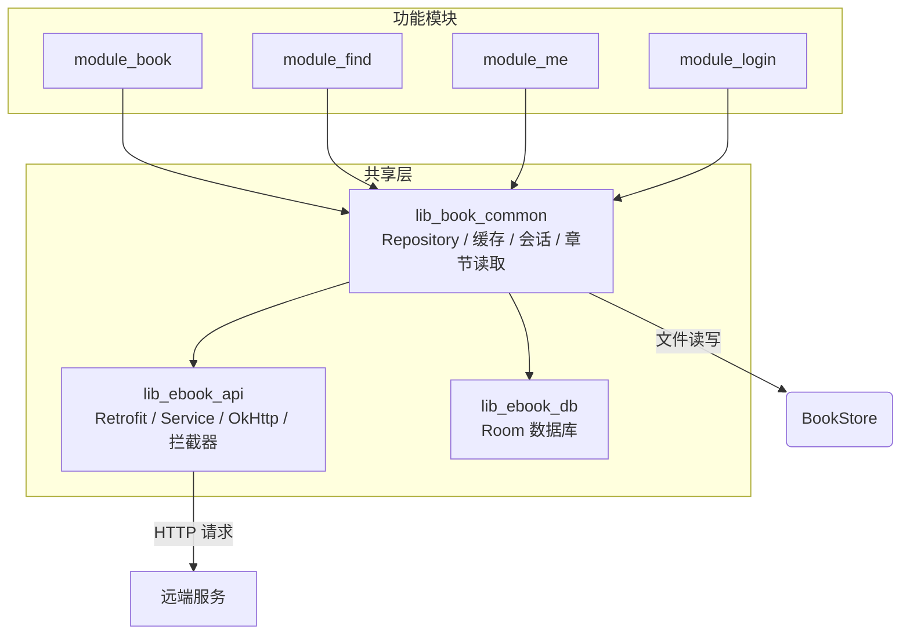
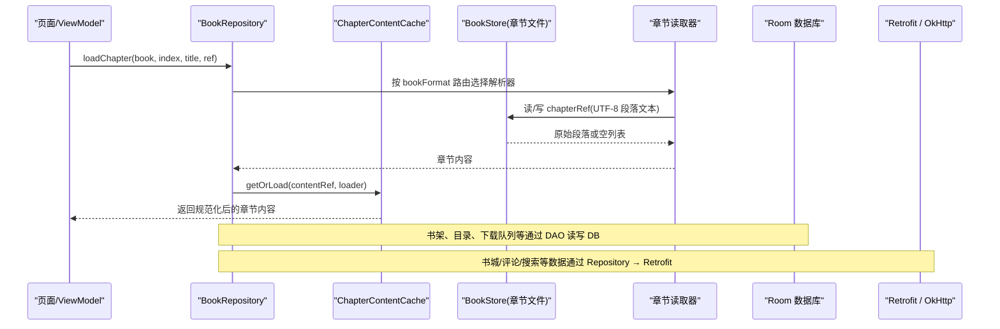
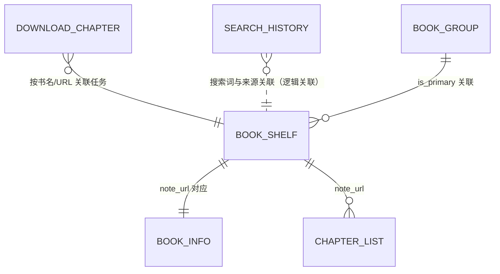
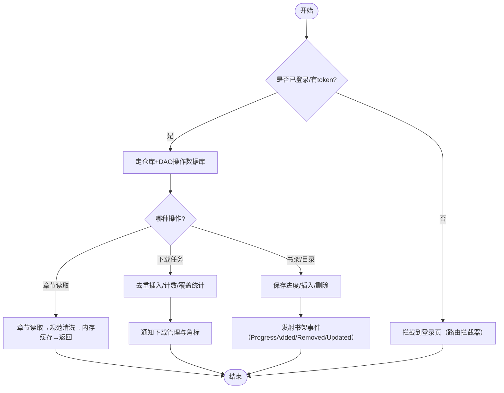
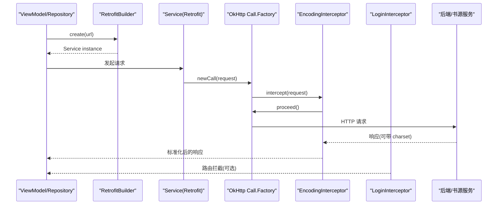
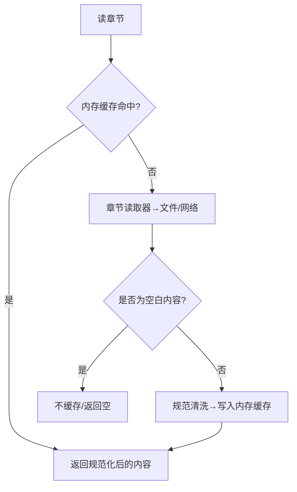
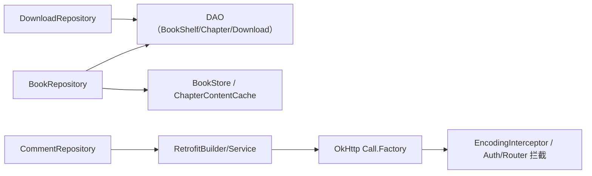

# 数据管理

<cite>
**本文引用的文件**
- [AppDatabase.kt](file://lib_ebook_db/src/main/java/com/ebook/db/AppDatabase.kt)
- [DatabaseModule.kt](file://lib_ebook_db/src/main/java/com/ebook/db/di/DatabaseModule.kt)
- [BookShelfEntity.kt](file://lib_ebook_db/src/main/java/com/ebook/db/entity/BookShelfEntity.kt)
- [BookInfoEntity.kt](file://lib_ebook_db/src/main/java/com/ebook/db/entity/BookInfoEntity.kt)
- [ChapterListEntity.kt](file://lib_ebook_db/src/main/java/com/ebook/db/entity/ChapterListEntity.kt)
- [DownloadChapterEntity.kt](file://lib_ebook_db/src/main/java/com/ebook/db/entity/DownloadChapterEntity.kt)
- [SearchHistoryEntity.kt](file://lib_ebook_db/src/main/java/com/ebook/db/entity/SearchHistoryEntity.kt)
- [BookGroupEntity.kt](file://lib_ebook_db/src/main/java/com/ebook/db/entity/BookGroupEntity.kt)
- [BookShelfDao.kt](file://lib_ebook_db/src/main/java/com/ebook/db/dao/BookShelfDao.kt)
- [ChapterListDao.kt](file://lib_ebook_db/src/main/java/com/ebook/db/dao/ChapterListDao.kt)
- [DownloadChapterDao.kt](file://lib_ebook_db/src/main/java/com/ebook/db/dao/DownloadChapterDao.kt)
- [SearchHistoryDao.kt](file://lib_ebook_db/src/main/java/com/ebook/db/dao/SearchHistoryDao.kt)
- [BookRepository.kt](file://lib_book_common/src/main/java/com/ebook/common/repository/BookRepository.kt)
- [CommentRepository.kt](file://lib_book_common/src/main/java/com/ebook/common/repository/CommentRepository.kt)
- [DownloadRepository.kt](file://module_book/src/main/java/com/ebook/book/repository/DownloadRepository.kt)
- [RetrofitBuilder.kt](file://lib_ebook_api/src/main/java/com/ebook/api/RetrofitBuilder.kt)
- [BookSourceService.kt](file://lib_ebook_api/src/main/java/com/ebook/api/service/source/BookSourceService.kt)
- [EncodingInterceptor.kt](file://lib_ebook_api/src/main/java/com/ebook/api/intercepter/EncodingInterceptor.kt)
- [LoginInterceptor.kt](file://lib_book_common/src/main/java/com/ebook/common/interceptor/LoginInterceptor.kt)
- [UserSessionManager.kt](file://lib_book_common/src/main/java/com/ebook/common/domain/UserSessionManager.kt)
- [UserSession.kt](file://lib_book_common/src/main/java/com/ebook/common/domain/UserSession.kt)
- [BookStore.kt](file://lib_book_common/src/main/java/com/ebook/common/store/BookStore.kt)
- [ChapterContentCache.kt](file://lib_book_common/src/main/java/com/ebook/common/store/ChapterContentCache.kt)
</cite>

## 目录
1. [引言](#引言)
2. [项目结构（与数据相关的范围）](#项目结构与数据相关的范围)
3. [核心组件](#核心组件)
4. [架构总览](#架构总览)
5. [详细组件分析](#详细组件分析)
6. [依赖关系分析](#依赖关系分析)
7. [性能考量](#性能考量)
8. [故障排查指南](#故障排查指南)
9. [结论](#结论)
10. [附录：API 契约与约定](#附录api-契约与约定)

## 引言
本文围绕 Android 电子书阅读器的数据存储、网络请求与缓存策略，形成一份面向产品、研发、测试与质量保障的综合性文档。重点覆盖 Room 数据库设计、Retrofit 网络层架构、多级缓存体系、用户会话与会话刷新、数据迁移、并发一致性与错误处理等主题。目标是让读者即使对代码细节不熟悉，也能理解整个数据链路如何工作以及关键决策背后的权衡。

## 项目结构（与数据相关的范围）
本项目采用多模块分层：业务模块 → lib_book_common → lib_ebook_api → lib_ebook_db。数据相关代码主要分布在：
- 数据持久化：lib_ebook_db（Room 实体与 DAO）
- 数据仓库：lib_book_common 与 module_book（Repository 聚合数据源）
- 网络层：lib_ebook_api（Retrofit、服务接口、拦截器）
- 缓存：lib_book_common（内存缓存 + BookStore 章文件）
- 会话与安全：lib_book_common（会话接口与拦截链）

**图表来源**
- [BookRepository.kt:31-199](file://lib_book_common/src/main/java/com/ebook/common/repository/BookRepository.kt#L31-L199)
- [DownloadRepository.kt:21-194](file://module_book/src/main/java/com/ebook/book/repository/DownloadRepository.kt#L21-L194)
- [RetrofitBuilder.kt:13-45](file://lib_ebook_api/src/main/java/com/ebook/api/RetrofitBuilder.kt#L13-L45)
- [AppDatabase.kt:8-63](file://lib_ebook_db/src/main/java/com/ebook/db/AppDatabase.kt#L8-L63)

**章节来源**
- [AppDatabase.kt:8-63](file://lib_ebook_db/src/main/java/com/ebook/db/AppDatabase.kt#L8-L63)

## 核心组件
- 数据库层（Room）
  - 主库入口 AppDatabase 声明表集合、版本与导出；DAO 由 DatabaseModule 提供注入。
  - 关键实体：BookShelfEntity、BookInfoEntity、ChapterListEntity、DownloadChapterEntity、SearchHistoryEntity、BookGroupEntity。
  - 迁移链：MIGRATION_1_2 → MIGRATION_2_3 → MIGRATION_3_4。
- 仓库层（Repository）
  - 书架/下载统一封装在 BookRepository、DownloadRepository，负责跨数据源的编排与事件广播。
- 网络层（Retrofit + OkHttp）
  - RetrofitBuilder 统一装配 Json 转换器与 Call.Factory；BookSourceService 针对书源动态 URL。
  - 编码拦截器 EncodingInterceptor，登录路由拦截 LoginInterceptor（跨模块跳转鉴权）。
- 会话与认证
  - UserSessionManager 抽象用户会话、双 token 轮换与获取；UserSession 作为会话载体。
- 缓存与存储
  - ChapterContentCache 内存级章节正文缓存（按 content_ref 键，容量默认 3）。
  - BookStore 章文件系统（books/<bookId>/cNNNNN.txt），提供原子导入、对齐、清理与失效标记。

**章节来源**
- [DatabaseModule.kt:23-124](file://lib_ebook_db/src/main/java/com/ebook/db/di/DatabaseModule.kt#L23-L124)
- [BookRepository.kt:31-199](file://lib_book_common/src/main/java/com/ebook/common/repository/BookRepository.kt#L31-L199)
- [RetrofitBuilder.kt:13-45](file://lib_ebook_api/src/main/java/com/ebook/api/RetrofitBuilder.kt#L13-L45)
- [EncodingInterceptor.kt:10-55](file://lib_ebook_api/src/main/java/com/ebook/api/intercepter/EncodingInterceptor.kt#L10-L55)
- [LoginInterceptor.kt:10-42](file://lib_book_common/src/main/java/com/ebook/common/interceptor/LoginInterceptor.kt#L10-L42)
- [UserSessionManager.kt:13-62](file://lib_book_common/src/main/java/com/ebook/common/domain/UserSessionManager.kt#L13-L62)
- [ChapterContentCache.kt:7-59](file://lib_book_common/src/main/java/com/ebook/common/store/ChapterContentCache.kt#L7-L59)
- [BookStore.kt:6-126](file://lib_book_common/src/main/java/com/ebook/common/store/BookStore.kt#L6-L126)

## 架构总览
数据流从 UI 进入 ViewModel/Repository，再根据数据来源分流至本地数据库、文件或远程网络；结果经 Flow/SharedFlow 回推，UI 响应式更新。

**图表来源**
- [BookRepository.kt:164-199](file://lib_book_common/src/main/java/com/ebook/common/repository/BookRepository.kt#L164-L199)
- [ChapterContentCache.kt:21-53](file://lib_book_common/src/main/java/com/ebook/common/store/ChapterContentCache.kt#L21-L53)
- [BookStore.kt:17-38](file://lib_book_common/src/main/java/com/ebook/common/store/BookStore.kt#L17-L38)
- [RetrofitBuilder.kt:24-44](file://lib_ebook_api/src/main/java/com/ebook/api/RetrofitBuilder.kt#L24-L44)

**章节来源**
- [BookRepository.kt:164-199](file://lib_book_common/src/main/java/com/ebook/common/repository/BookRepository.kt#L164-L199)

## 详细组件分析

### Room 数据库设计（表与关联、索引、迁移）
- 表角色
  - book_shelf：书架条目，含当前阅读进度、最终阅读时间、标签、来源格式、匹配名/作者等。自然主键 note_url。
  - book_info：书籍元信息（名称、作者、封面、简介、状态等），自然主键 note_url，与书架一一对应。
  - chapter_list：章节目录，主键 content_ref，按 note_url 建立索引提升按书查询效率；dur_chapter_index 用于显式排序。
  - download_chapter：下载队列表，自增 id；支持 force_refresh 标志以触发强制重抓。
  - search_history：搜索历史，流水型数据，去重在仓库层。
  - book_group：作品分组表，关联 comment_key 与 note_url，并记录 is_primary，用于评论桶键与来源条目关联。
- 主键策略
  - 书架/书籍用自然键 note_url，确保同一 URL 唯一；章节主键为 content_ref（兼容本地章文件路径）；下载/搜索为自增键并在上层做去重。
- 索引优化
  - chapter_list 在 note_url 上建索引 idx_chapter_list_note_url，加速按书取目录。
- 迁移机制
  - v1→v2：download_chapter 新增 force_refresh 列（ALTER TABLE 非破坏性）。
  - v2→v3：新建 book_group 表，book_shelf 增加本地书所需列，chapter_list 列改名 dur_chapter_url → content_ref，清空本地书旧正文与目录数据。
  - v3→v4：删除 book_content 表，移除 chapter_list.has_cache 列，缓存存在性改由 BookStore 章文件存在性判定。
- 构建期 schema 导出
  - 关闭 fallbackToDestructiveMigration，开启 exportSchema，依赖 build-logic 写入 schemas/ 目录校验演进。

**图表来源**
- [BookShelfEntity.kt:11-76](file://lib_ebook_db/src/main/java/com/ebook/db/entity/BookShelfEntity.kt#L11-L76)
- [BookInfoEntity.kt:10-69](file://lib_ebook_db/src/main/java/com/ebook/db/entity/BookInfoEntity.kt#L10-L69)
- [ChapterListEntity.kt:10-48](file://lib_ebook_db/src/main/java/com/ebook/db/entity/ChapterListEntity.kt#L10-L48)
- [DownloadChapterEntity.kt:1-L86](file://lib_ebook_db/src/main/java/com/ebook/db/entity/DownloadChapterEntity.kt#L1-L86)
- [SearchHistoryEntity.kt:1-L80](file://lib_ebook_db/src/main/java/com/ebook/db/entity/SearchHistoryEntity.kt#L1-L80)
- [BookGroupEntity.kt:1-L80](file://lib_ebook_db/src/main/java/com/ebook/db/entity/BookGroupEntity.kt#L1-L80)

**章节来源**
- [AppDatabase.kt:8-63](file://lib_ebook_db/src/main/java/com/ebook/db/AppDatabase.kt#L8-L63)
- [DatabaseModule.kt:23-124](file://lib_ebook_db/src/main/java/com/ebook/db/di/DatabaseModule.kt#L23-L124)

### 仓库层：书架与下载的编排
- BookRepository
  - 职责：书架 CRUD、阅读进度保存、章节正文统一读取（经 ChapterReader 按 BookFormat 路由）、书架变化事件发布。
  - 章节读取流程：reader.readChapter → 规范清洗（TextNormalizer.cleanParagraphs）→ ChapterContentCache 记忆 → 返回。
  - 异常/缺失处理：若结果为全空白章节，不写入缓存以便后续重试或报错。
- DownloadRepository
  - 职责：下载任务 CRUD、事件通道（replay=1，防晚开订阅丢帧）、覆盖率计算（依赖 BookStore.hasChapter）。
  - 队列优先级：遍历书架，按“下一页”或“最新一章”拉取任务，避免跨书干扰。
  - 覆盖统计：total = 目录项数，cached = 满足 hasChapter 条件章节数。

**图表来源**
- [BookRepository.kt:31-199](file://lib_book_common/src/main/java/com/ebook/common/repository/BookRepository.kt#L31-L199)
- [DownloadRepository.kt:21-194](file://module_book/src/main/java/com/ebook/book/repository/DownloadRepository.kt#L21-L194)
- [LoginInterceptor.kt:10-42](file://lib_book_common/src/main/java/com/ebook/common/interceptor/LoginInterceptor.kt#L10-L42)

**章节来源**
- [BookRepository.kt:31-199](file://lib_book_common/src/main/java/com/ebook/common/repository/BookRepository.kt#L31-L199)
- [DownloadRepository.kt:21-194](file://module_book/src/main/java/com/ebook/book/repository/DownloadRepository.kt#L21-L194)

### 网络层：Retrofit、服务与拦截器
- RetrofitBuilder
  - 复用 Hilt 提供的 Call.Factory（OkHttp），防循环依赖；JSON 转换器优先注册 kotlinx 序列化，支持 ignoreUnknownKeys 等配置； ScalarsConverterFactory 兜底处理 String（如 HTML）。
- BookSourceService
  - 面向书源的动态 URL 能力：@GET/@POST with @Url；构造统一请求头、字符集与请求体；默认 User-Agent。
- EncodingInterceptor
  - 当服务端未返回正确的 charset 时，通过反射设置 ResponseBody.contentTypeString 为期望编码，保证文本解码正确。
- 会话与路由拦截
  - LoginInterceptor：在跨模块跳转中依据 SP 判断是否需要登录；需要且未登录则替换目标为登录页。
  - UserSessionManager：提供 isLoggedIn、currentUser、saveSession、rotateCredentials、getToken、getRefreshToken 等能力，收敛认证态与双凭证生命周期。
  - CookieAdapter/CookieJar 等细节位于共享网络模块（由调用方/约定插件提供），本仓库聚焦接口与行为约束。

**图表来源**
- [RetrofitBuilder.kt:24-44](file://lib_ebook_api/src/main/java/com/ebook/api/RetrofitBuilder.kt#L24-L44)
- [BookSourceService.kt:19-91](file://lib_ebook_api/src/main/java/com/ebook/api/service/source/BookSourceService.kt#L19-L91)
- [EncodingInterceptor.kt:10-55](file://lib_ebook_api/src/main/java/com/ebook/api/intercepter/EncodingInterceptor.kt#L10-L55)
- [LoginInterceptor.kt:10-42](file://lib_book_common/src/main/java/com/ebook/common/interceptor/LoginInterceptor.kt#L10-L42)
- [UserSessionManager.kt:13-62](file://lib_book_common/src/main/java/com/ebook/common/domain/UserSessionManager.kt#L13-L62)

**章节来源**
- [RetrofitBuilder.kt:24-44](file://lib_ebook_api/src/main/java/com/ebook/api/RetrofitBuilder.kt#L24-L44)
- [BookSourceService.kt:19-91](file://lib_ebook_api/src/main/java/com/ebook/api/service/source/BookSourceService.kt#L19-L91)

### 多级缓存体系与一致性
- 层级划分
  - 内存缓存：ChapterContentCache（容量 3，按 content_ref 键，访问序淘汰）。
  - 文件缓存：BookStore（UTF-8 段落文本，章节文件名按序号零填充，保证字典序等于数值序）。
  - 数据库：书架、目录、下载任务、搜索历史等结构化数据。
  - 网络：远程服务响应（按需抓取并落盘）。
- 缓存命中与失效
  - 读取流程：loadChapter 先按 reader 从文件/网络获取原文 → 规范化清洗 → 通过 ChapterContentCache 命中/写入。
  - 失效规则：删书、重解析、合并来源后，ChapterContentCache.invalidateBook 按 bookId 片段剔除内存缓存；BookStore.deleteChapter 删除特定章节文件以触发强制重抓。
  - 完整性保证：对账时 BookStore.reconcile 清理无主目录与残留 .tmp 目录、根下散文件，保持文件系统与 DB 的一致性。
- 并发安全
  - ChapterContentCache 内部使用 Mutex 保护键空间与装载过程，避免重复加载与脏写。
  - BookRepository 将 IO 操作切换至 IO 调度器，隔离 UI 线程。

**图表来源**
- [ChapterContentCache.kt:7-59](file://lib_book_common/src/main/java/com/ebook/common/store/ChapterContentCache.kt#L7-L59)
- [BookStore.kt:17-126](file://lib_book_common/src/main/java/com/ebook/common/store/BookStore.kt#L17-L126)
- [BookRepository.kt:164-199](file://lib_book_common/src/main/java/com/ebook/common/repository/BookRepository.kt#L164-L199)

**章节来源**
- [ChapterContentCache.kt:7-59](file://lib_book_common/src/main/java/com/ebook/common/store/ChapterContentCache.kt#L7-L59)
- [BookStore.kt:6-126](file://lib_book_common/src/main/java/com/ebook/common/store/BookStore.kt#L6-L126)
- [BookRepository.kt:164-199](file://lib_book_common/src/main/java/com/ebook/common/repository/BookRepository.kt#L164-L199)

### 会话管理与 token 刷新
- 身份主标识：邮箱为登录主标识；用户名仅为展示；注册阶段不发 token。
- 双 token：access token（运行时存内存 TokenHolder，供拦截器附加请求头），refresh token（持久化在 session）。
- 会话接口：UserSessionManager 暴露登录态、会话对象、双 token 轮换、token 读取等方法。
- 刷新流程：A0230 过期由 CoroutineAdapter 收口单飞静默刷新（见相关 ADR），成功重放一次，失败上报会话过期事件并由主界面处理清会话与提示。
- 路由拦截：LoginInterceptor 在跨模块跳转时，依据需登录策略进行拦截与重定向。

**章节来源**
- [UserSessionManager.kt:13-62](file://lib_book_common/src/main/java/com/ebook/common/domain/UserSessionManager.kt#L13-L62)
- [LoginInterceptor.kt:10-42](file://lib_book_common/src/main/java/com/ebook/common/interceptor/LoginInterceptor.kt#L10-L42)
- [AGENTS.md（认证约定）](file://AGENTS.md)

### 离线数据同步与下载
- 下载队列：DownloadRepository 提供队列增删查与覆盖率计算；DownloadService 负责前台任务执行、超时处理与出队（详见 ADR-0018 与仓库注释）。
- 缓存一致性：队列任务完成或失败时与 BookStore 的章节文件存在性联动，确保“覆盖率”反映真实可用离线内容。
- 任务幂等与去重：入库前按 durChapterUrl 查重，避免重复下载。

**章节来源**
- [DownloadRepository.kt:81-156](file://module_book/src/main/java/com/ebook/book/repository/DownloadRepository.kt#L81-L156)

### 数据迁移方案与版本兼容性
- 迁移链
  - v1→v2：download_chapter 新增强制刷新标记列（ALTER TABLE，兼容语义）。
  - v2→v3：新建 book_group 表；book_shelf 补充本地书字段；chapter_list 主键列改名（dur_chapter_url → content_ref）；清空本地书旧数据以保证清洗不可逆一致性。
  - v3→v4：删除 book_content 表；移除 has_cache 列；改用 BookStore 章节文件存在性判定缓存。
- 严格约束：禁止启用 destructive migration；变更必须伴随 version 递增与紧邻迁移追加；提交生成的 schema JSON 进行构建期校验。

**章节来源**
- [DatabaseModule.kt:27-98](file://lib_ebook_db/src/main/java/com/ebook/db/di/DatabaseModule.kt#L27-L98)
- [AppDatabase.kt:26-32](file://lib_ebook_db/src/main/java/com/ebook/db/AppDatabase.kt#L26-L32)

## 依赖关系分析

**图表来源**
- [BookRepository.kt:31-199](file://lib_book_common/src/main/java/com/ebook/common/repository/BookRepository.kt#L31-L199)
- [CommentRepository.kt:16-78](file://lib_book_common/src/main/java/com/ebook/common/repository/CommentRepository.kt#L16-L78)
- [DownloadRepository.kt:35-194](file://module_book/src/main/java/com/ebook/book/repository/DownloadRepository.kt#L35-L194)
- [RetrofitBuilder.kt:24-44](file://lib_ebook_api/src/main/java/com/ebook/api/RetrofitBuilder.kt#L24-L44)
- [EncodingInterceptor.kt:10-55](file://lib_ebook_api/src/main/java/com/ebook/api/intercepter/EncodingInterceptor.kt#L10-L55)

**章节来源**
- [BookRepository.kt:31-199](file://lib_book_common/src/main/java/com/ebook/common/repository/BookRepository.kt#L31-L199)
- [CommentRepository.kt:16-78](file://lib_book_common/src/main/java/com/ebook/common/repository/CommentRepository.kt#L16-L78)
- [DownloadRepository.kt:35-194](file://module_book/src/main/java/com/ebook/book/repository/DownloadRepository.kt#L35-L194)

## 性能考量
- I/O 与协程：Repository 中将数据库与文件 I/O 切至 Dispatchers.IO，避免阻塞 UI。
- 内存缓存容量：ChapterContentCache 容量 3，兼顾前后预读，降低频繁读盘与解码开销。
- 索引优化：chapter_list.note_url 建立索引提升列表查询效率。
- 规范化前移：章节规范化清洗仅在缓存之前进行一次，避免重复消耗。
- 文件命名：章节文件序号五位数零填充，字典序即数值序，有利于高效扫描与比对。
- 覆盖统计：DownloadRepository.getCacheCoverage 基于 BookStore.hasChapter，减少数据库负担并体现真实可用性。
[本节为通用指导，无具体源码直接分析，故不添加来源]

## 故障排查指南
- 章节内容为空
  - 检查 ChapterContentCache 是否将空白结果过滤（不落缓存），导致再次加载；确认 TextNormalizer 清洗逻辑。
  - 核对 BookStore 章节文件是否存在，若缺失则需重抓。
- 下载一直停留在某一章节
  - 检查 DownloadRepository.getNextDownloadTask 是否正确取队头；确认失败重入时是否已按策略出队。
- 网络返回乱码
  - 检查 EncodingInterceptor 是否按响应/请求编码正确设置 contentTypeString；书源侧 Header 编码配置是否一致。
- 登录后跳转被截断
  - 核查 LoginInterceptor 的 needLogin 参数与 SP_IS_LOGIN 状态一致性。
- 缓存不一致
  - 删除章节时用 BookStore.deleteChapter；删除书用 BookStore.deleteBook，同时调用 ChapterContentCache.invalidateBook。

**章节来源**
- [BookRepository.kt:164-199](file://lib_book_common/src/main/java/com/ebook/common/repository/BookRepository.kt#L164-L199)
- [ChapterContentCache.kt:37-53](file://lib_book_common/src/main/java/com/ebook/common/store/ChapterContentCache.kt#L37-L53)
- [DownloadRepository.kt:54-99](file://module_book/src/main/java/com/ebook/book/repository/DownloadRepository.kt#L54-L99)
- [EncodingInterceptor.kt:20-55](file://lib_ebook_api/src/main/java/com/ebook/api/intercepter/EncodingInterceptor.kt#L20-L55)
- [LoginInterceptor.kt:21-42](file://lib_book_common/src/main/java/com/ebook/common/interceptor/LoginInterceptor.kt#L21-L42)

## 结论
本项目的数据管理遵循清晰的层次分工：Repository 协调数据源，Room 承担结构化数据的可靠持久与迁移，Retrofit/OkHttp 提供稳健的网络能力与编码兼容，内存与文件两级缓存共同保证高性能与可离线阅读体验，会话拦截与 token 刷新机制贯穿认证生命周期。通过这些设计与实现，系统在可读性、扩展性与可维护性之间取得良好平衡。

[本节为总结性内容，不直接分析具体文件，故不添加来源]

## 附录：API 契约与约定
- 请求/响应
  - Retrofit 序列化统一基于 kotlinx.serialization，JSON 转换器优先注册；Scalar 转换器兜底处理字符串。
  - 书源接口支持动态 URL，头部包含 Accept、Accept-Language、Cache-Control、自定义 headers 与默认 User-Agent；表单编码按 source rule 的 charset 设定。
- 错误码与异常
  - 业务层通过统一的 Result/RespDTO 封装，CommentRepository 以业务码 00000 表示成功；网络异常由 CoroutineAdapter 适配。
- 数据验证
  - 正文段落规范化清洗集中在一处（ChapterContentCache 加载前），避免各渲染点重复校验；空白章节不缓存，交由上层视为“内容缺失”。
- 并发安全
  - 内存缓存加互斥；IO 操作限定于 IO 调度器；下载状态通道采用 replay 与缓冲防止丢帧。
[本节为通用约定汇总，不直接引用源码片段，故不添加来源]