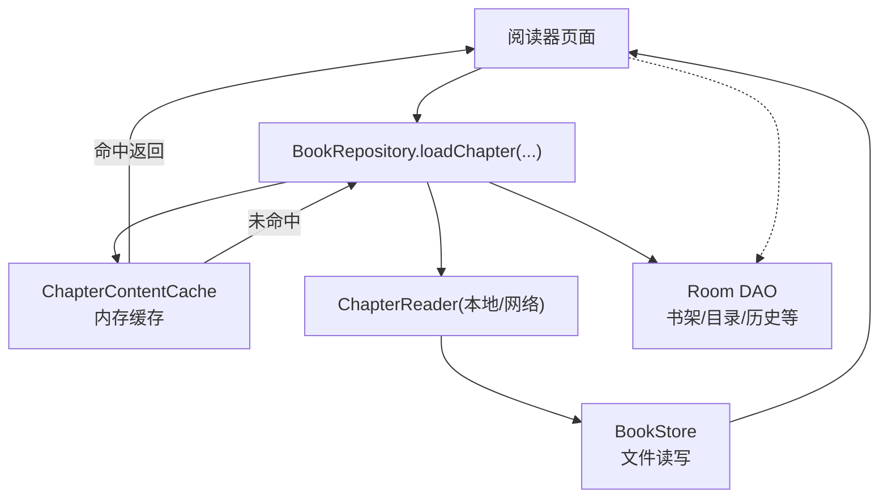
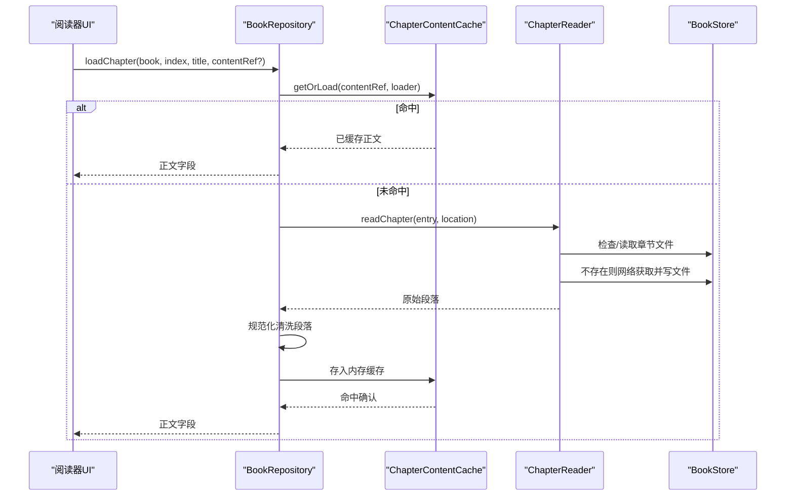
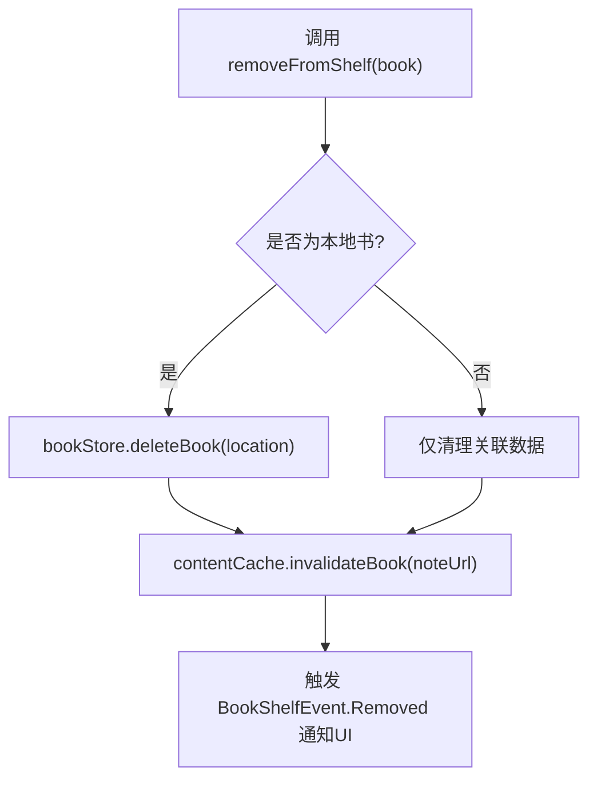
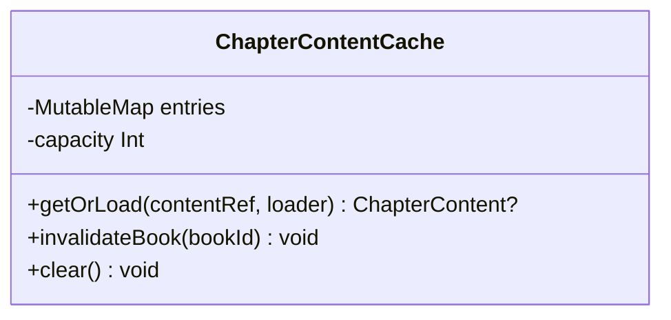
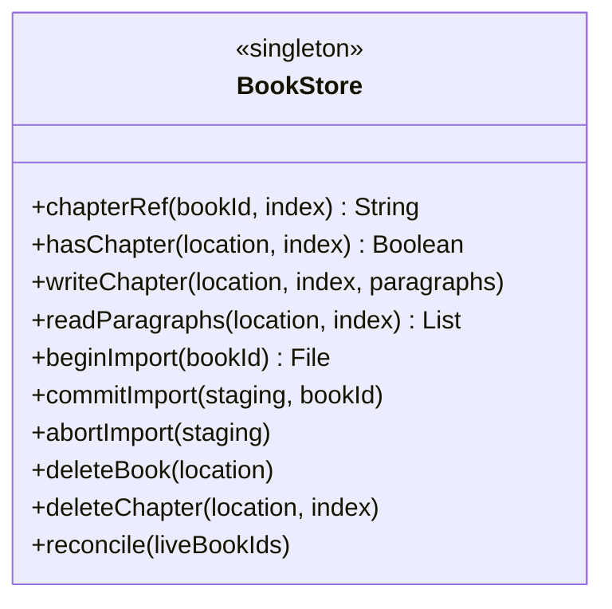
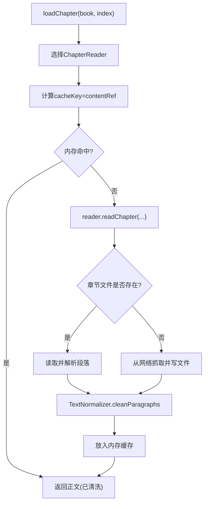
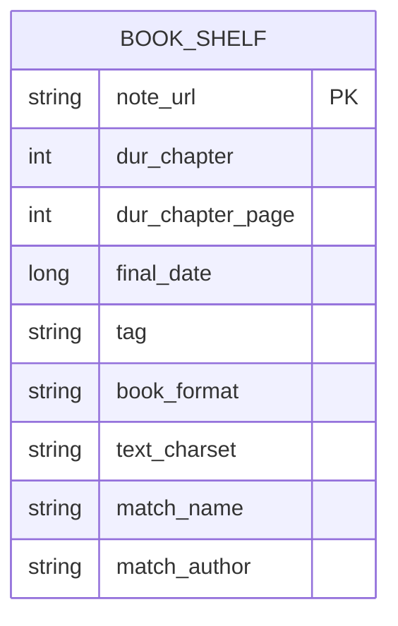
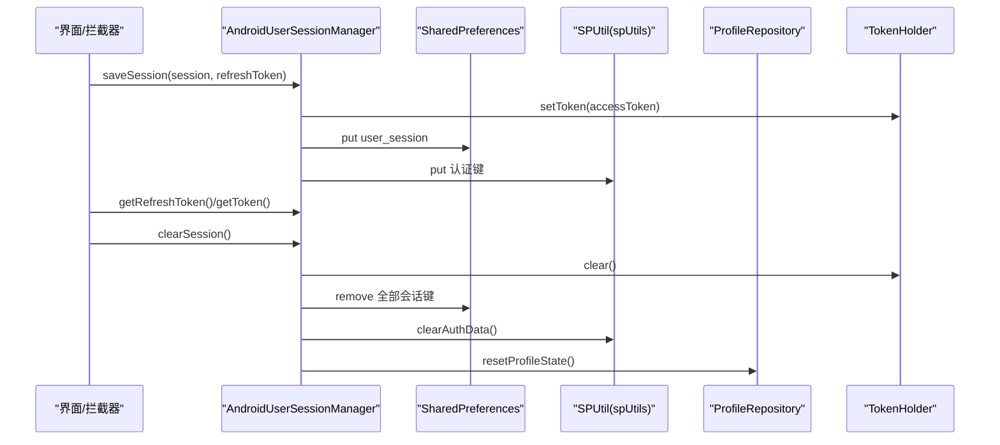
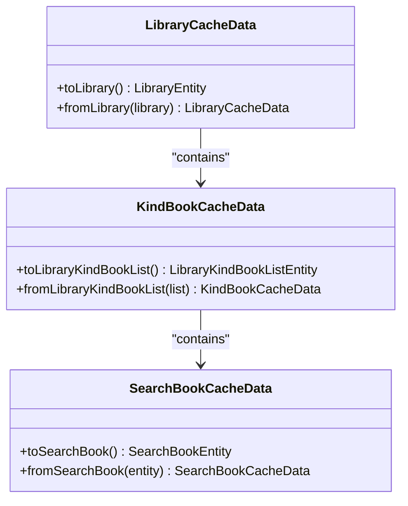
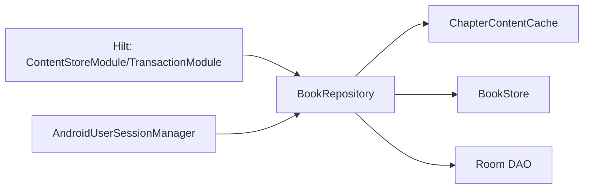

# 缓存机制

<cite>
**本文引用的文件**
- [ChapterContentCache.kt](file://lib_book_common/src/main/java/com/ebook/common/store/ChapterContentCache.kt)
- [BookStore.kt](file://lib_book_common/src/main/java/com/ebook/common/store/BookStore.kt)
- [BookRepository.kt](file://lib_book_common/src/main/java/com/ebook/common/repository/BookRepository.kt)
- [ContentStoreModule.kt](file://lib_book_common/src/main/java/com/ebook/common/di/ContentStoreModule.kt)
- [LibraryCacheData.kt](file://lib_book_common/src/main/java/com/ebook/common/analyze/source/LibraryCacheData.kt)
- [AndroidUserSessionManager.kt](file://lib_book_common/src/main/java/com/ebook/common/domain/AndroidUserSessionManager.kt)
- [SPUtil.kt](file://lib_book_common/src/main/java/com/ebook/common/util/SPUtil.kt)
- [LoginInterceptor.kt](file://lib_book_common/src/main/java/com/ebook/common/interceptor/LoginInterceptor.kt)
- [AppDatabase.kt](file://lib_ebook_db/src/main/java/com/ebook/db/AppDatabase.kt)
- [BookShelfDao.kt](file://lib_ebook_db/src/main/java/com/ebook/db/dao/BookShelfDao.kt)
- [TransactionModule.kt](file://lib_book_common/src/main/java/com/ebook/common/di/TransactionModule.kt)
</cite>

## 目录
1. [引言](#引言)
2. [项目结构与缓存分层总览](#项目结构与缓存分层总览)
3. [核心组件与职责](#核心组件与职责)
4. [架构与数据流](#架构与数据流)
5. [详细组件分析](#详细组件分析)
6. [依赖关系与一致性保障](#依赖关系与一致性保障)
7. [性能考量与优化建议](#性能考量与优化建议)
8. [故障排查指南](#故障排查指南)
9. [结论](#结论)

## 引言
本文面向 Android 电子书阅读器项目的多级缓存体系，系统性说明内存缓存、磁盘缓存（Room 持久化与文件系统）、网络数据缓存生命周期、用户会话缓存与多端兼容、缓存数据结构设计、一致性策略以及监控优化方法。内容严格基于仓库现有实现整理，不引入未实现的假设。

## 项目结构与缓存分层总览
当前项目的“书籍正文读取”链将三类缓存组织在一起：
- 内存缓存：按章为粒度的正文片段缓存，避免重复解析与解码。
- 文件缓存：以“一本一个目录、一章一个文件”的形式持久化章节文本，保证重入后仍可读。
- 数据库持久化：书架、书目元信息、章节目录、下载队列等结构化数据的持久化与响应式更新。

**图表来源**
- [BookRepository.kt:180-199](file://lib_book_common/src/main/java/com/ebook/common/repository/BookRepository.kt#L180-L199)
- [ChapterContentCache.kt:21-59](file://lib_book_common/src/main/java/com/ebook/common/store/ChapterContentCache.kt#L21-L59)
- [BookStore.kt:15-127](file://lib_book_common/src/main/java/com/ebook/common/store/BookStore.kt#L15-L127)
- [BookShelfDao.kt:19-109](file://lib_ebook_db/src/main/java/com/ebook/db/dao/BookShelfDao.kt#L19-L109)

**章节来源**
- [BookRepository.kt:180-199](file://lib_book_common/src/main/java/com/ebook/common/repository/BookRepository.kt#L180-L199)
- [ContentStoreModule.kt:27-87](file://lib_book_common/src/main/java/com/ebook/common/di/ContentStoreModule.kt#L27-L87)
- [AppDatabase.kt:8-64](file://lib_ebook_db/src/main/java/com/ebook/db/AppDatabase.kt#L8-L64)

## 核心组件与职责
- 内存缓存（ChapterContentCache）
  - 职责：以 content_ref 为键缓存章节正文，容量可配，默认覆盖“当前章+前后一章节”，提供整书失效能力。
  - 并发：使用协程互斥锁保护 LinkedHashMap，读快写分离（loader 在锁外执行）。
  - 失效：按 bookId 片段剔除条目；支持全量清空。
- 文件缓存（BookStore）
  - 职责：以“filesDir/books/<bookId>/cNNNNN.txt”存储章节，UTF-8 写入 LF 分隔段落；导入暂存 .tmp 原子提交；封面写入与删除、对账清理。
  - 定位：chapterRef / chapterFile / hasChapter 提供统一读写路径。
- 仓库编排（BookRepository）
  - 职责：统一入口 loadChapter，串联 ChapterReader → 规范化清洗 → 内存缓存 → 文件落盘（reader 内部负责存在性判断与抓取）。
  - 事件：书架增删改通过 SharedFlow 派发。
- 数据库持久化（Room）
  - 职责：书架、目录、历史等结构化数据持久化与 Flow 观察；主键策略与自然键 upsert。
- 事务封装（WriteTransactionRunner + TransactionModule）
  - 职责：统一写事务入口，便于导入器等批量写路径在测试中运行。
- 用户会话缓存（AndroidUserSessionManager + SPUtil）
  - 职责：登录态内存流与 SharedPreferences 双镜像；token 在 TokenHolder 内存驻留，refresh token 持久化；清会话同步三处镜像（内存流、spUtils、ProfileRepository）。

**章节来源**
- [ChapterContentCache.kt:21-59](file://lib_book_common/src/main/java/com/ebook/common/store/ChapterContentCache.kt#L21-L59)
- [BookStore.kt:15-127](file://lib_book_common/src/main/java/com/ebook/common/store/BookStore.kt#L15-L127)
- [BookRepository.kt:31-200](file://lib_book_common/src/main/java/com/ebook/common/repository/BookRepository.kt#L31-L200)
- [AppDatabase.kt:8-64](file://lib_ebook_db/src/main/java/com/ebook/db/AppDatabase.kt#L8-L64)
- [TransactionModule.kt:12-24](file://lib_book_common/src/main/java/com/ebook/common/di/TransactionModule.kt#L12-L24)
- [AndroidUserSessionManager.kt:28-162](file://lib_book_common/src/main/java/com/ebook/common/domain/AndroidUserSessionManager.kt#L28-L162)
- [SPUtil.kt:13-93](file://lib_book_common/src/main/java/com/ebook/common/util/SPUtil.kt#L13-L93)

## 架构与数据流
### 章节读取的缓存流程

**图表来源**
- [BookRepository.kt:180-199](file://lib_book_common/src/main/java/com/ebook/common/repository/BookRepository.kt#L180-L199)
- [ChapterContentCache.kt:37-42](file://lib_book_common/src/main/java/com/ebook/common/store/ChapterContentCache.kt#L37-L42)
- [BookStore.kt:15-38](file://lib_book_common/src/main/java/com/ebook/common/store/BookStore.kt#L15-L38)

### 书架移除时的缓存一致性

**图表来源**
- [BookRepository.kt:150-162](file://lib_book_common/src/main/java/com/ebook/common/repository/BookRepository.kt#L150-L162)
- [BookStore.kt:80-82](file://lib_book_common/src/main/java/com/ebook/common/store/BookStore.kt#L80-L82)
- [ChapterContentCache.kt:44-49](file://lib_book_common/src/main/java/com/ebook/common/store/ChapterContentCache.kt#L44-L49)

## 详细组件分析

### 内存缓存：ChapterContentCache
- 数据结构
  - LinkedHashMap + accessOrder 维护最近访问序列，超出容量移除最久未用项（LRU 行为）。
  - 键为 content_ref（内嵌 bookId），使按书级失效更简洁。
- 并发与吞吐
  - Mutex 保护读/写；loader 在锁外执行，降低 I/O 阻塞影响。
- 容量与失效
  - 默认容量 3（当前章+前后各一章）。
  - invalidateBook 使用 BookStore.cacheMarker 生成的书级片段剔除所有相关条目的键。
  - clear 全量清空。

**图表来源**
- [ChapterContentCache.kt:21-59](file://lib_book_common/src/main/java/com/ebook/common/store/ChapterContentCache.kt#L21-L59)
- [BookStore.kt:115-126](file://lib_book_common/src/main/java/com/ebook/common/store/BookStore.kt#L115-L126)

**章节来源**
- [ChapterContentCache.kt:21-59](file://lib_book_common/src/main/java/com/ebook/common/store/ChapterContentCache.kt#L21-L59)

### 文件缓存：BookStore（磁盘缓存）
- 目录结构
  - 根目录 booksRoot（注入时为 context.filesDir + "books"）。
  - 单书目录 <bookId>/，每章 cNNNNN.txt（五位零填充保证字典序等于数值序）。
- 读写语义
  - writeChapter：写入 UTF-8 文本，段间单 LF；readParagraphs：不存在时返回空表。
  - 导入阶段使用 beginImport/.tmp 暂存目录，commitImport 原子 rename 切换。
- 辅助能力
  - hasChapter、deleteChapter、deleteBook、reconcile 对账清理孤立目录与残留 tmp。

**图表来源**
- [BookStore.kt:15-127](file://lib_book_common/src/main/java/com/ebook/common/store/BookStore.kt#L15-L127)
- [ContentStoreModule.kt:31-42](file://lib_book_common/src/main/java/com/ebook/common/di/ContentStoreModule.kt#L31-L42)

**章节来源**
- [BookStore.kt:15-127](file://lib_book_common/src/main/java/com/ebook/common/store/BookStore.kt#L15-L127)
- [ContentStoreModule.kt:31-42](file://lib_book_common/src/main/java/com/ebook/common/di/ContentStoreModule.kt#L31-L42)

### 仓库编排：BookRepository
- 统一加载入口 loadChapter
  - 按格式路由到 ChapterReader，构造 BookLocation，生成 contentRef 作为缓存键。
  - 正文经 TextNormalizer 规范化后再缓存，避免重复清洗。
  - reader 内部处理“存在即读文件，否则拉取并写入”。
- 书架变更事件
  - 添加/移除/进度更新均通过 SharedFlow 发出事件。
- 移除逻辑
  - 同时删除书架 DB 记录、关联表，并调用 BookStore 清理文件、ChapterContentCache 整书失效。

**图表来源**
- [BookRepository.kt:180-199](file://lib_book_common/src/main/java/com/ebook/common/repository/BookRepository.kt#L180-L199)

**章节来源**
- [BookRepository.kt:180-199](file://lib_book_common/src/main/java/com/ebook/common/repository/BookRepository.kt#L180-L199)

### 数据库持久化：Room
- 数据库定义与实体
  - AppDatabase 声明六张实体表与多个 DAO，version 4，exportSchema=true。
  - 书架实体包含阅读进度、最后时间、匹配名/作者、本地书标识等字段。
- DAO 行为
  - BookShelfDao 提供全量查询、Flow 观察、upsert、按 URL 删除等。
  - Flow 版本自动感知变更并推送，用于“我的”页统计与列表刷新。

**图表来源**
- [AppDatabase.kt:34-64](file://lib_ebook_db/src/main/java/com/ebook/db/AppDatabase.kt#L34-L64)
- [BookShelfDao.kt:19-109](file://lib_ebook_db/src/main/java/com/ebook/db/dao/BookShelfDao.kt#L19-L109)

**章节来源**
- [AppDatabase.kt:8-64](file://lib_ebook_db/src/main/java/com/ebook/db/AppDatabase.kt#L8-L64)
- [BookShelfDao.kt:19-109](file://lib_ebook_db/src/main/java/com/ebook/db/dao/BookShelfDao.kt#L19-L109)

### 用户会话缓存：Token、登录状态与多设备兼容
- 内存层
  - StateFlow<Boolean> isLoggedIN 与 StateFlow<UserSession?> currentUser 驱动 UI。
  - AccessToken 放于 lib_common 的 TokenHolder（进程内存），首个请求若过期走静默 refresh 重放。
- 磁盘层
  - SharedPreferences 持久化 refreshToken 与身份字段（昵称、头像等）；旧版遗留明文密码键启动清理。
- 兼容性
  - 清会话同步三处镜像：本类内存、user_session SP、spUtils 认证键与 ProfileRepository 的进程内昵称/头像流。
  - LoginInterceptor 基于 spUtils 的认证键做路由拦截，保持跳转前登录态一致。

**图表来源**
- [AndroidUserSessionManager.kt:61-133](file://lib_book_common/src/main/java/com/ebook/common/domain/AndroidUserSessionManager.kt#L61-L133)
- [SPUtil.kt:78-89](file://lib_book_common/src/main/java/com/ebook/common/util/SPUtil.kt#L78-L89)
- [LoginInterceptor.kt:21-41](file://lib_book_common/src/main/java/com/ebook/common/interceptor/LoginInterceptor.kt#L21-L41)

**章节来源**
- [AndroidUserSessionManager.kt:28-162](file://lib_book_common/src/main/java/com/ebook/common/domain/AndroidUserSessionManager.kt#L28-L162)
- [SPUtil.kt:13-93](file://lib_book_common/src/main/java/com/ebook/common/util/SPUtil.kt#L13-L93)
- [LoginInterceptor.kt:1-42](file://lib_book_common/src/main/java/com/ebook/common/interceptor/LoginInterceptor.kt#L1-L42)

### 书库缓存数据：LibraryCacheData
- LibraryCacheData/KindBookCacheData/SearchBookCacheData 用于库列表/分类/搜索结果的序列化与反序列化场景，支撑上层解析后的结果缓存。
- 转换方法 between Entity 与轻量 Data 类，便于跨层传递与持久化。

**图表来源**
- [LibraryCacheData.kt:11-118](file://lib_book_common/src/main/java/com/ebook/common/analyze/source/LibraryCacheData.kt#L11-L118)

**章节来源**
- [LibraryCacheData.kt:11-118](file://lib_book_common/src/main/java/com/ebook/common/analyze/source/LibraryCacheData.kt#L11-L118)

## 依赖关系与一致性保障
- 依赖注入与装配
  - ContentStoreModule 提供 BookStore、ChapterContentCache、ChapterSplitter、ChapterReaders 的 map，由 Hilt 管理单例生命周期。
  - TransactionModule 提供 WriteTransactionRunner 的生产实现，封装 Room 写事务。
- 一致性策略
  - 章节内存缓存按 content_ref 缓存，整书失效时使用 BookStore.cacheMarker 生成标记，保证多缓存类型共用同一流水号。
  - 书架移除时：DB 记录、文件、内存缓存三者一致性由 BookRepository.removeFromShelf 收口。
  - 会话一致性：清会话集中在 AndroidUserSessionManager.clearSession，避免遗漏任一镜像导致状态漂移。
- 并发安全
  - ChapterContentCache 使用 Kotlin 协程 Mutex，确保多线程下的容量与键值操作安全。
  - Room Flow 观察自动处理线程切换与背压。

**图表来源**
- [ContentStoreModule.kt:27-87](file://lib_book_common/src/main/java/com/ebook/common/di/ContentStoreModule.kt#L27-L87)
- [TransactionModule.kt:12-24](file://lib_book_common/src/main/java/com/ebook/common/di/TransactionModule.kt#L12-L24)
- [BookRepository.kt:150-162](file://lib_book_common/src/main/java/com/ebook/common/repository/BookRepository.kt#L150-L162)
- [AndroidUserSessionManager.kt:111-133](file://lib_book_common/src/main/java/com/ebook/common/domain/AndroidUserSessionManager.kt#L111-L133)

**章节来源**
- [ContentStoreModule.kt:27-87](file://lib_book_common/src/main/java/com/ebook/common/di/ContentStoreModule.kt#L27-L87)
- [TransactionModule.kt:12-24](file://lib_book_common/src/main/java/com/ebook/common/di/TransactionModule.kt#L12-L24)
- [BookRepository.kt:150-162](file://lib_book_common/src/main/java/com/ebook/common/repository/BookRepository.kt#L150-L162)
- [AndroidUserSessionManager.kt:111-133](file://lib_book_common/src/main/java/com/ebook/common/domain/AndroidUserSessionManager.kt#L111-L133)

## 性能考量与优化建议
- 内存缓存命中率提升
  - 合理设置容量：当前默认 3 适合快速翻页与预加载上下文，可按设备内存与阅读习惯扩展为可调参数（例如根据屏幕大小或主题档位）。
  - 热点章节复用：通过 content_ref 稳定键减少重复加载。
- 文件 IO 成本
  - 分段 LF + UTF-8 读取成本低；建议保留段落切分策略，避免渲染层再次切分。
  - 导入阶段采用 .tmp 原子替换，防止中间态被读取。
- 数据库查询与 Flow
  - Flow 观察者仅在必要时订阅，避免不必要的全量刷新的开销。
  - 排序口径统一（final_date DESC）可减少后续排序成本。
- 网络缓存生命周期
  - 本章实现以“首次抓取并落盘文件”为主；建议在 reader 层增加基于服务器时间的 ETag/Last-Modified 校验与局部刷新接口，以减少重复拉取。
- 会话过期处理
  - 首请求若返回 A0230 过期，应在 Auth 拦截器侧静默刷新并原请求重试，避免 UI 抖动（由上层网络适配层负责）。
- 存储空间管理
  - reconcile 清理孤立目录和 .tmp 残留；定期任务可扫描 booksRoot，结合 liveBookIds 清理孤儿数据，释放空间。
- 监控指标（建议落地）
  - 内存缓存命中率 = 命中次数 / (命中+未命中)；未命中时可埋点分析读者行为。
  - 文件缓存容量（字节数）、章节数量；超过阈值触发告警或引导清理。
  - 刷新频率与失败率：针对网络抓取的章节统计耗时与错误码分布。

[本节为通用优化建议，不直接对应具体代码片段]

## 故障排查指南
- 章节内容为空
  - 检查 reader 是否识别格式并正确写出章节文件；确认 BookStore.hasChapter。
  - 查看 ChapterContentCache.getOrLoad 的 loader 返回值是否 null（全空白会被忽略）。
- 整书无法显示或被误删
  - 确认 removeFromShelf 是否调用了 BookStore.deleteBook 与 contentCache.invalidateBook。
  - 使用 BookStore.reconcile 对账清理 orphaned 目录。
- 登录后页面仍可拦截或未正确放行
  - 检查 AndroidUserSessionManager.saveSession 是否写入了 SP 与 spUtils；登录拦截器依赖后者。
- 清退后“我的”页仍显示旧头像/昵称
  - 确认只调用了 SessionManager.clearSession，它会统一清理三处镜像（包括 ProfileRepository 的内存流）。

**章节来源**
- [BookStore.kt:80-108](file://lib_book_common/src/main/java/com/ebook/common/store/BookStore.kt#L80-L108)
- [ChapterContentCache.kt:37-53](file://lib_book_common/src/main/java/com/ebook/common/store/ChapterContentCache.kt#L37-L53)
- [BookRepository.kt:150-162](file://lib_book_common/src/main/java/com/ebook/common/repository/BookRepository.kt#L150-L162)
- [AndroidUserSessionManager.kt:111-133](file://lib_book_common/src/main/java/com/ebook/common/domain/AndroidUserSessionManager.kt#L111-L133)
- [LoginInterceptor.kt:21-41](file://lib_book_common/src/main/java/com/ebook/common/interceptor/LoginInterceptor.kt#L21-L41)

## 结论
本项目在当前实现中围绕“章节正文”形成了清晰的三级缓存策略：
- 内存层快速命中，LRU 控制容量；
- 文件层以“一书一目录、一章一文件”的规范存储，配合原子提交与对账保持稳健；
- 数据库层提供结构化信息与响应式更新能力，并与文件/内存层协同失效。
用户会话通过内存流与 SharedPreferences/spUtils 的多处镜像统一维护，清退集中化处理，避免了状态漂移。整体设计在保证性能的同时兼顾了可靠性与可维护性；未来可在网络侧增加细粒度的过期策略与监控埋点，进一步优化工况表现。