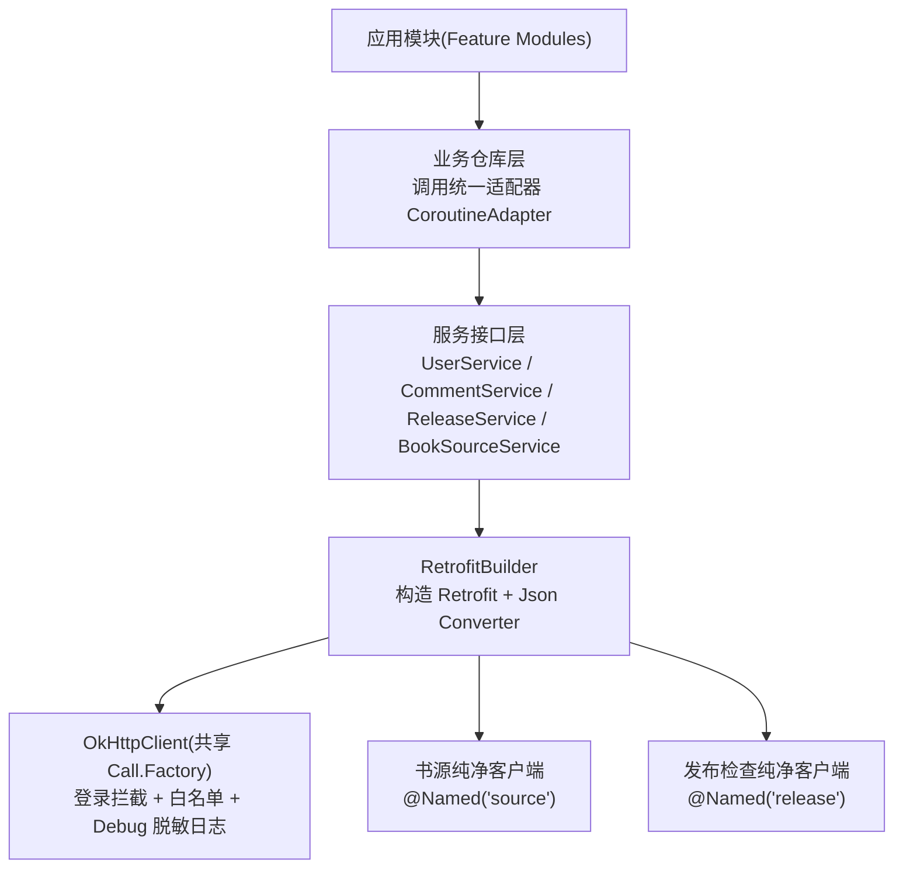
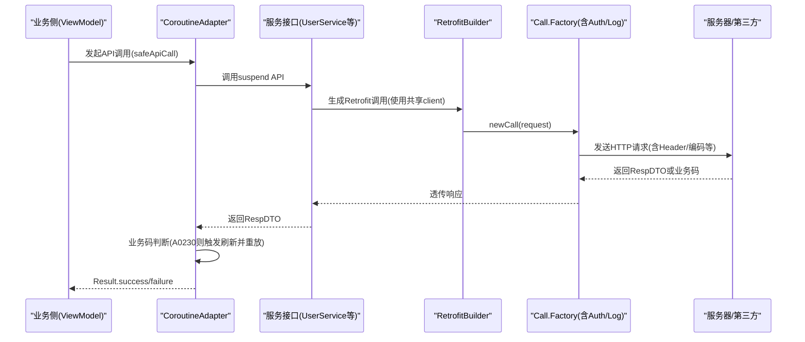
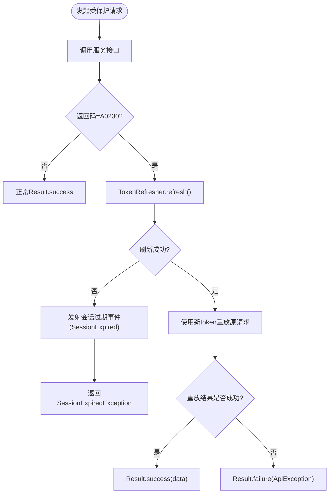
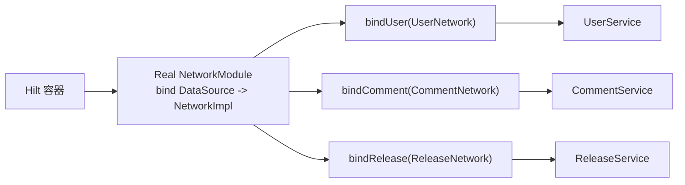

# 网络层实现

<cite>
**本文引用的文件列表**
- [RetrofitBuilder.kt](file://lib_ebook_api/src/main/java/com/ebook/api/RetrofitBuilder.kt)
- [NetworkModule.kt](file://lib_ebook_api/src/main/java/com/ebook/api/utils/NetworkModule.kt)
- [CoroutineAdapter.kt](file://lib_ebook_api/src/main/java/com/ebook/api/utils/CoroutineAdapter.kt)
- [EncodingInterceptor.kt](file://lib_ebook_api/src/main/java/com/ebook/api/intercepter/EncodingInterceptor.kt)
- [UserService.kt](file://lib_ebook_api/src/main/java/com/ebook/api/service/user/UserService.kt)
- [CommentService.kt](file://lib_ebook_api/src/main/java/com/ebook/api/service/comment/CommentService.kt)
- [BookSourceService.kt](file://lib_ebook_api/src/main/java/com/ebook/api/service/source/BookSourceService.kt)
- [ReleaseService.kt](file://lib_ebook_api/src/main/java/com/ebook/api/service/release/ReleaseService.kt)
- [NetworkModule.kt](file://module_app/src/real/java/com/ebook/di/NetworkModule.kt)
</cite>

## 目录
1. [简介](#简介)
2. [项目结构（网络层视图）](#项目结构网络层视图)
3. [核心组件](#核心组件)
4. [架构总览](#架构总览)
5. [关键组件深度解析](#关键组件深度解析)
6. [依赖关系与耦合分析](#依赖关系与耦合分析)
7. [性能与可靠性要点](#性能与可靠性要点)
8. [故障排查指南](#故障排查指南)
9. [结论](#结论)

## 简介
本篇文档围绕基于 Retrofit + OkHttp 的网络层进行系统化说明，覆盖构建装配、拦截器链、服务接口组织、认证流程、错误处理策略与 API 契约约定。目标是帮助开发者在不深入代码细节的情况下理解整个网络请求的流向与关键点，并能快速定位问题与优化点。

## 项目结构（网络层视图）
本项目将网络能力集中在 lib_ebook_api 中，并通过 Hilt 在应用层按 flavor 绑定具体数据源，形成“接口/契约 + 实现/网络层”解耦的层次：

**图表来源**
- [RetrofitBuilder.kt:13-45](file://lib_ebook_api/src/main/java/com/ebook/api/RetrofitBuilder.kt#L13-L45)
- [NetworkModule.kt:19-72](file://lib_ebook_api/src/main/java/com/ebook/api/utils/NetworkModule.kt#L19-L72)
- [NetworkModule.kt:14-35](file://module_app/src/real/java/com/ebook/di/NetworkModule.kt#L14-L35)

**章节来源**
- [RetrofitBuilder.kt:13-45](file://lib_ebook_api/src/main/java/com/ebook/api/RetrofitBuilder.kt#L13-L45)
- [NetworkModule.kt:19-72](file://lib_ebook_api/src/main/java/com/ebook/api/utils/NetworkModule.kt#L19-L72)
- [NetworkModule.kt:14-35](file://module_app/src/real/java/com/ebook/di/NetworkModule.kt#L14-L35)

## 核心组件
- RetrofitBuilder：提供统一的 Retrofit 实例构建逻辑，注入 kotlinx serialization 转换器、Scalars 转换器，并复用共享 Call.Factory 承载统一拦截链。
- NetworkModule（api utils）：提供全局 JSON 配置、书源与发布检查的专用 OkHttpClient，以及白名单 Host 配置。
- CoroutineAdapter：封装统一的结果转换、业务码翻译与 token 过期静默刷新重放流程。
- EncodingInterceptor：针对服务端未显式声明编码时的响应体字符集设置兜底方案。
- Service 接口族：按业务域划分的服务定义（用户、评论、书源抓取、发布检查）。

**章节来源**
- [RetrofitBuilder.kt:13-45](file://lib_ebook_api/src/main/java/com/ebook/api/RetrofitBuilder.kt#L13-L45)
- [NetworkModule.kt:19-72](file://lib_ebook_api/src/main/java/com/ebook/api/utils/NetworkModule.kt#L19-L72)
- [CoroutineAdapter.kt:17-150](file://lib_ebook_api/src/main/java/com/ebook/api/utils/CoroutineAdapter.kt#L17-L150)
- [EncodingInterceptor.kt:10-55](file://lib_ebook_api/src/main/java/com/ebook/api/intercepter/EncodingInterceptor.kt#L10-L55)
- [UserService.kt:22-72](file://lib_ebook_api/src/main/java/com/ebook/api/service/user/UserService.kt#L22-L72)
- [CommentService.kt:24-62](file://lib_ebook_api/src/main/java/com/ebook/api/service/comment/CommentService.kt#L24-L62)
- [BookSourceService.kt:15-92](file://lib_ebook_api/src/main/java/com/ebook/api/service/source/BookSourceService.kt#L15-L92)
- [ReleaseService.kt:15-24](file://lib_ebook_api/src/main/java/com/ebook/api/service/release/ReleaseService.kt#L15-L24)

## 架构总览
整体采用“适配器模式 + 分层解耦”：
- 业务侧通过统一适配器 CoroutineAdapter 调用，避免在业务代码中散落异常与鉴权处理。
- 服务接口层只关注“端点 + 请求/响应”，不关心底层执行细节。
- Retrofit 由 RetrofitBuilder 统一构建，复用同一套 Json 和 Scalars 转换器与共享 OkHttp Call.Factory。
- 不同用途使用不同的 OkHttpClient：
  - 主链路：共享 Call.Factory 内置登录拦截器与 debug 脱敏日志；
  - 书源抓取：@Named("source") 纯净客户端（不带 token，防泄露）；
  - 发布检查：@Named("release") 纯净客户端（面向 GitHub/Gitcode 公开接口）。

**图表来源**
- [CoroutineAdapter.kt:41-112](file://lib_ebook_api/src/main/java/com/ebook/api/utils/CoroutineAdapter.kt#L41-L112)
- [RetrofitBuilder.kt:24-44](file://lib_ebook_api/src/main/java/com/ebook/api/RetrofitBuilder.kt#L24-L44)
- [UserService.kt:22-72](file://lib_ebook_api/src/main/java/com/ebook/api/service/user/UserService.kt#L22-L72)

## 关键组件深度解析

### RetrofitBuilder 的构建过程与基础配置
- 目标：为各服务创建具备一致配置的 Retrofit 实例，确保 Json 解析一致性（忽略未知键）、对纯文本（如 HTML）支持 Scalars 解析，并在运行时复用统一的 OkHttp 拦截链。
- 关键点
  - Kotlinx Serialization 转换器优先，保证 @Serializable 响应对象可正确解码；Scalars 转换器置于其后，以便兼容 String 类型响应（如书源抓取 HTML）。
  - callFactory 注入共享 Call.Factory，来自 lib_common 的统一拦截链（包含登录态注入、白名单控制、debug 日志脱敏等），避免重复造轮子，符合 ADR 约定。
  - 每个 Network 类可自行获取 Retrofit 实例，增强解耦。

**章节来源**
- [RetrofitBuilder.kt:13-45](file://lib_ebook_api/src/main/java/com/ebook/api/RetrofitBuilder.kt#L13-L45)

### OkHttp 拦截器链设计与职责划分
- 登录/鉴权拦截器（位于 lib_common 共享 Call.Factory 中，被 RetrofitBuilder 重用）：根据 Host 白名单决定是否为受保护资源附加 Authorization 头，统一在调用入口完成认证头注入，降低业务侵入。
- 编码拦截器（EncodingInterceptor）：在服务端未明确 Content-Type 编码时，通过反射修正响应体的内容类型字符串，使乱码问题可控（主要用于第三方站点抓取等非标准场景）。
- 分角色客户端：
  - 主链路：带登录拦截器、debug 脱敏日志；
  - 书源客户端（@Named("source")）：不含 token，超时更短，附加 UTF-8 编码处理器，适合第三方站点抓取的鲁棒性需求；
  - 发布检查客户端（@Named("release")）：纯 GET、无 token、简洁超时，适配外部平台 API。

**章节来源**
- [EncodingInterceptor.kt:10-55](file://lib_ebook_api/src/main/java/com/ebook/api/intercepter/EncodingInterceptor.kt#L10-L55)
- [NetworkModule.kt:35-72](file://lib_ebook_api/src/main/java/com/ebook/api/utils/NetworkModule.kt#L35-L72)

### RESTful API 接口设计规范与服务模块化组织
- 按业务域拆分子接口：
  - UserService：认证、用户信息与头像上传等；
  - CommentService：评论的增删查改及迁移；
  - BookSourceService：动态 URL 抓取第三方页面（支持 GET/POST，HeaderMap 定制）；
  - ReleaseService：拉取最新发布信息（纯 GET，@Url 直连第三方地址）。
- 参数风格
  - Body：复杂对象使用 JSON 载荷（User/Comment/各种 Request）；
  - Query：分页常用 page、page_size 查询参数；
  - Path：动态路径片段如注释 ID；
  - Multipart：上传头像使用 Part。
- 返回值规范
  - 统一 RespDTO<T> 信封，携带 code/msg/data，业务异常由下游统一转化。
  - 书源抓取与发布检查属于特殊通路，部分接口直接返回原始数据结构而非 RespDTO，以对接第三方协议。

**章节来源**
- [UserService.kt:22-72](file://lib_ebook_api/src/main/java/com/ebook/api/service/user/UserService.kt#L22-L72)
- [CommentService.kt:24-62](file://lib_ebook_api/src/main/java/com/ebook/api/service/comment/CommentService.kt#L24-L62)
- [BookSourceService.kt:15-92](file://lib_ebook_api/src/main/java/com/ebook/api/service/source/BookSourceService.kt#L15-L92)
- [ReleaseService.kt:15-24](file://lib_ebook_api/src/main/java/com/ebook/api/service/release/ReleaseService.kt#L15-L24)

### 认证机制与 Token 流转
- 信任边界：仅白名单内的 host 会附加认证头（Authorization），防止 token 泄漏给第三方网站。
- Token 生命周期
  - 登录成功后将 token 注入到共享的 TokenHolder；
  - 后续请求由拦截链自动注入 Authorization；
  - 遇到 A0230（token 过期）时，由 CoroutineAdapter 触发单飞刷新（TokenRefresher 保障并发仅刷新一次），成功后用新 token 重放原请求一次。
  - 若刷新失败，则向上抛出会话过期标记（SessionExpiredException），交由全局处置（清理会话、跳转登录页）。

**图表来源**
- [CoroutineAdapter.kt:41-112](file://lib_ebook_api/src/main/java/com/ebook/api/utils/CoroutineAdapter.kt#L41-L112)

**章节来源**
- [NetworkModule.kt:35-43](file://lib_ebook_api/src/main/java/com/ebook/api/utils/NetworkModule.kt#L35-L43)
- [CoroutineAdapter.kt:41-112](file://lib_ebook_api/src/main/java/com/ebook/api/utils/CoroutineAdapter.kt#L41-L112)

### 错误处理策略与统一异常封装
- 所有业务 API 经 CoroutineAdapter.safeApiCall：
  - IO 线程执行、业务码判断：
    - 成功：Result.success(resp)
    - A0230：进入静默刷新与重放流程
    - 其他业务码：Result.failure(ApiException(code, msg))
  - 网络或未知异常：委托 lib_common 的统一 handler 转化为可理解异常
- 会话过期标记：当刷新失败，返回 SessionExpiredException，上层收到后应只做日志记录并由全局订阅方处理（清会话+提示+跳转登录），避免重复弹窗。

**章节来源**
- [CoroutineAdapter.kt:41-112](file://lib_ebook_api/src/main/java/com/ebook/api/utils/CoroutineAdapter.kt#L41-L112)
- [CoroutineAdapter.kt:122-150](file://lib_ebook_api/src/main/java/com/ebook/api/utils/CoroutineAdapter.kt#L122-L150)

### API 契约与分页数据处理约定
- 信封格式：统一 RespDTO<T>，code/msg/data 三字段；
- 分页参数：以 page、page_size 作为通用分页查询；
- 特殊实体：
  - 评论分页返回 CommentPage（包含 comment_key 用于去重等业务对齐）；
  - 书源抓取返回 String，需配合 EncodingInterceptor 与 BookSourceRule 的 charset 策略进行处理；
  - 发布检查直连第三方，无需 RespDTO 包裹，返回对应平台的统一投影模型。

**章节来源**
- [CommentService.kt:39-62](file://lib_ebook_api/src/main/java/com/ebook/api/service/comment/CommentService.kt#L39-L62)
- [BookSourceService.kt:15-92](file://lib_ebook_api/src/main/java/com/ebook/api/service/source/BookSourceService.kt#L15-L92)
- [ReleaseService.kt:15-24](file://lib_ebook_api/src/main/java/com/ebook/api/service/release/ReleaseService.kt#L15-L24)

### 业务层如何调用网络服务（示例指引）
- 统一入口：在仓库层或 ViewModel 中使用 CoroutineAdapter.callData 或 safeApiCall 包装具体的服务方法（如 UserService.login、CommentService.getMyComments）。
- 优势：
  - 不需要在每个调用点写 try-catch；
  - 自动切换 IO 线程；
  - 统一的业务码处理与 A0230 静默刷新。
- 参考路径
  - 安全调用：CoroutineAdapter.safeApiCall
  - 简版提取 data：CoroutineAdapter.callData
  - 认证相关服务：UserService.*
  - 评论相关服务：CommentService.*

**章节来源**
- [UserService.kt:22-72](file://lib_ebook_api/src/main/java/com/ebook/api/service/user/UserService.kt#L22-L72)
- [CommentService.kt:24-62](file://lib_ebook_api/src/main/java/com/ebook/api/service/comment/CommentService.kt#L24-L62)
- [CoroutineAdapter.kt:41-120](file://lib_ebook_api/src/main/java/com/ebook/api/utils/CoroutineAdapter.kt#L41-L120)

## 依赖关系与耦合分析
- 低耦合高内聚
  - RetrofitBuilder 不感知业务逻辑，仅负责“构建与装配”；
  - 各 Service 仅定义契约，不对传输细节做二次包装；
  - CoroutineAdapter 屏蔽异常与刷新细节，业务侧获得整洁 Result 语义。
- Hilt 模块绑定
  - module_app/real 的 NetworkModule 将 UserDataSource/CommentDataSource/ReleaseDataSource 绑定到真实网络实现；
  - mock flavor 下替换为测试数据源，确保独立开发与集成开发体验一致。

**图表来源**
- [NetworkModule.kt:14-35](file://module_app/src/real/java/com/ebook/di/NetworkModule.kt#L14-L35)

**章节来源**
- [NetworkModule.kt:14-35](file://module_app/src/real/java/com/ebook/di/NetworkModule.kt#L14-L35)

## 性能与可靠性要点
- 线程切换：统一在 Adapter 层切至 IO 线程，避免阻塞主线程。
- 超时策略：
  - 主链路：由共享 Call.Factory 提供合理默认超时（结合调试日志）；
  - 书源抓取：连接/写入/读取均为 10s，快速失败，减少不可控第三方站点的拖累；
  - 发布检查：10s 读写超时，适配外部平台。
- 重试与缓存：
  - 业务重试应在上层（仓库/ViewModel）依据业务幂等性与 UI 反馈综合决策；
  - 当前未全局启用 OkHttp 缓存，如需引入可按功能域开启，注意破坏幂等的写操作不应缓存。
- 编码健壮性：书源抓取通过 EncodingInterceptor 强制设定响应体编码，降低跨站点乱码风险。

[本节为通用指导，不直接引用具体代码]

## 故障排查指南
- 无法访问本机后端（targetSdk 37 本地网络限制）
  - 症状：网络异常且无明确服务端错误；
  - 建议：通过 adb reverse 指向 127.0.0.1 或通过 BuildConfig 配置主机名，避免触碰系统本地网络权限限制。
- 登录态无效（总是 A0230）
  - 现象：请求一直返回 A0230；
  - 排查：确认白名单 Host 是否正确注入；确认 TokenHolder 是否在登录后写入；检查静默刷新是否成功、是否需要触发“会话过期”全局处置。
- 书源页面乱码
  - 现象：HTML/Text 中文显示为问号或乱码；
  - 排查：确认 EncodingInterceptor 已生效；确认 BookSourceRule.charset 与站点实际编码一致；必要时调整接收端的字符集转换。
- 上传头像失败
  - 现象：返回错误或空响应；
  - 排查：确认使用 UserService.uploadAvatar 的 multipart 路径；检查文件大小与类型限制；确认有正确的认证头注入。

**章节来源**
- [NetworkModule.kt:35-72](file://lib_ebook_api/src/main/java/com/ebook/api/utils/NetworkModule.kt#L35-L72)
- [EncodingInterceptor.kt:10-55](file://lib_ebook_api/src/main/java/com/ebook/api/intercepter/EncodingInterceptor.kt#L10-L55)
- [CoroutineAdapter.kt:41-112](file://lib_ebook_api/src/main/java/com/ebook/api/utils/CoroutineAdapter.kt#L41-L112)
- [UserService.kt:68-72](file://lib_ebook_api/src/main/java/com/ebook/api/service/user/UserService.kt#L68-L72)

## 结论
本项目的网络层以 RetrofitBuilder + 多角色 OkHttpClient + Service 接口的组合清晰划分职责，通过 CoroutineAdapter 收口异常与认证处理，兼顾了稳定性与可维护性。通过白名单控制的鉴权、统一的响应封装以及针对第三方站点与发布检查的专线路径，既满足了核心业务需求，又保证了扩展性与容错性。建议后续仅在“必要场景”增加重试与缓存能力，并确保幂等性与会话一致性校验落地。