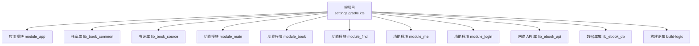
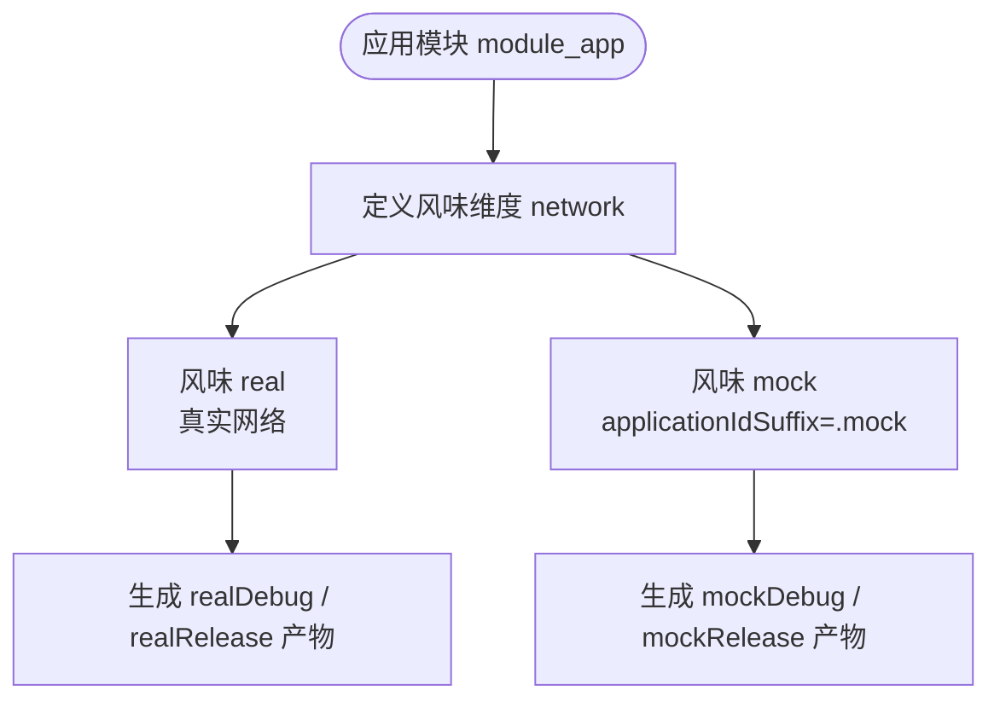
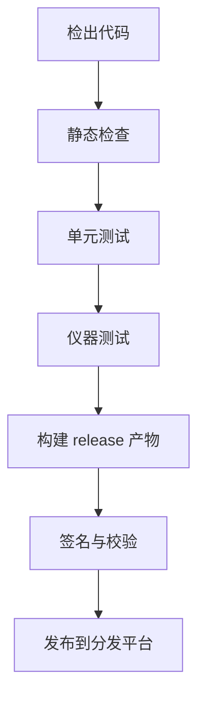

# 构建与部署

<cite>
**本文引用的文件**   
- [build.gradle.kts](file://build.gradle.kts)
- [settings.gradle.kts](file://settings.gradle.kts)
- [gradle.properties](file://gradle.properties)
- [gradle/libs.versions.toml](file://gradle/libs.versions.toml)
- [compose_compiler_config.conf](file://compose_compiler_config.conf)
- [module_app/build.gradle.kts](file://module_app/build.gradle.kts)
- [module_app/proguard-rules.pro](file://module_app/proguard-rules.pro)
- [lib_book_common/build.gradle.kts](file://lib_book_common/build.gradle.kts)
- [lib_book_common/consumer-rules.pro](file://lib_book_common/consumer-rules.pro)
- [lib_book_source/build.gradle.kts](file://lib_book_source/build.gradle.kts)
- [module_book/build.gradle.kts](file://module_book/build.gradle.kts)
- [module_book/consumer-rules.pro](file://module_book/consumer-rules.pro)
- [module_main/consumer-rules.pro](file://module_main/consumer-rules.pro)
- [module_find/consumer-rules.pro](file://module_find/consumer-rules.pro)
- [module_login/consumer-rules.pro](file://module_login/consumer-rules.pro)
- [module_me/consumer-rules.pro](file://module_me/consumer-rules.pro)
- [lib_ebook_api/consumer-rules.pro](file://lib_ebook_api/consumer-rules.pro)
- [lib_ebook_db/consumer-rules.pro](file://lib_ebook_db/consumer-rules.pro)
- [docs/versioning-practice.md](file://docs/versioning-practice.md)
- [build-logic/convention/build.gradle.kts](file://build-logic/convention/build.gradle.kts)
- [build-logic/convention/src/main/kotlin/AndroidApplicationConventionPlugin.kt](file://build-logic/convention/src/main/kotlin/AndroidApplicationConventionPlugin.kt)
- [build-logic/convention/src/main/kotlin/AndroidComponentConventionPlugin.kt](file://build-logic/convention/src/main/kotlin/AndroidComponentConventionPlugin.kt)
- [build-logic/convention/src/main/kotlin/AndroidLibraryConventionPlugin.kt](file://build-logic/convention/src/main/kotlin/AndroidLibraryConventionPlugin.kt)
</cite>

## 目录
1. [引言](#引言)
2. [项目结构与构建入口](#项目结构与构建入口)
3. [Gradle 构建配置总览](#gradle-构建配置总览)
4. [多变体构建](#多变体构建)
5. [资源混淆、代码压缩与优化](#资源混淆代码压缩与优化)
6. [多渠道打包流程](#多渠道打包流程)
7. [CI/CD 流水线建议](#cicd-流水线建议)
8. [生产环境部署策略](#生产环境部署策略)
9. [性能优化配置](#性能优化配置)
10. [依赖与模块关系](#依赖与模块关系)
11. [构建故障排查](#构建故障排查)
12. [运维部署与回滚](#运维部署与回滚)
13. [结论](#结论)

## 引言
本文面向 Android 小说阅读器项目的构建、打包、发布和运维人员，说明仓库当前使用的 Gradle 构建体系、多变体机制、ProGuard/R8 混淆策略、版本管理方式，以及可落地的 CI/CD 和部署建议。文档严格基于仓库现有源码和构建脚本分析，不虚构不存在的能力；对于仓库尚未实现的渠道签名、CI 配置等部分，以“现状”和“建议”形式给出明确边界。

## 项目结构与构建入口
该工程是一个多模块 Android 应用，根项目负责统一声明插件别名、仓库源和模块集合，核心业务被拆分为 `module_app` 应用模块及多个功能模块、库模块：

**图表来源**
- [settings.gradle.kts:36-65](file://settings.gradle.kts#L36-L65)
- [build-logic/convention/build.gradle.kts:45-79](file://build-logic/convention/build.gradle.kts#L45-L79)

**章节来源**
- [settings.gradle.kts:1-65](file://settings.gradle.kts#L1-L65)
- [build-logic/convention/build.gradle.kts:1-79](file://build-logic/convention/build.gradle.kts#L1-L79)

## Gradle 构建配置总览
### 根构建脚本
根 `build.gradle.kts` 仅声明全局插件别名，例如 Android Application、Library、Test、Baseline Profile、Compose Compiler、Hilt、KSP、Kotlin JVM、Serialization、Room、Therouter 等，并通过 `alias(libs.plugins.*) apply false` 避免在根项目重复生效。同时启用 `module.graph` 插件，用于生成模块依赖图。

**章节来源**
- [build.gradle.kts:1-15](file://build.gradle.kts#L1-L15)

### 版本与工具链
- AGP 为 `9.2.1`，Kotlin 为 `2.4.10`，KSP 为 `2.3.10`，NDK 固定为 `28.2.13676358`。
- 所有 Kotlin 编译目标为 JVM 17，Java source/target 兼容等级也为 Java 17。
- Compose BOM 统一管理 Compose 相关依赖版本。
- 仓库镜像优先使用阿里云 Google/Maven Central/Tencent 镜像，以降低国内构建环境的解析失败概率。
- Gradle 通过 `org.gradle.toolchains.foojay-resolver-convention` 自动注册 toolchain 下载仓库，配合 Gradle 9 的 auto-provisioning。

**章节来源**
- [gradle/libs.versions.toml:1-30](file://gradle/libs.versions.toml#L1-L30)
- [gradle/libs.versions.toml:30-237](file://gradle/libs.versions.toml#L30-L237)
- [settings.gradle.kts:1-35](file://settings.gradle.kts#L1-L35)

### 全局 Gradle 行为
`gradle.properties` 中关键构建开关包括：
- `android.nonTransitiveRClass=true`
- `android.useAndroidX=true`
- `ksp.incremental=true`、`ksp.incremental.log=true`、`ksp.incremental.intermodule=true`
- `isModule=false`（集成态）
- `org.gradle.jvmargs=-Xmx2048M -Dkotlin.daemon.jvm.options="-Xmx2048M"`
- `android.uniquePackageNames=false`
- `android.r8.strictFullModeForKeepRules=false`

这些属性集中控制 AndroidX、KSP 增量、JVM 内存、唯一包名行为和 R8 keep 规则严格模式。

**章节来源**
- [gradle.properties:1-35](file://gradle.properties#L1-L35)

## 多变体构建
### 产品风味
应用模块 `module_app` 定义了 `network` 维度的两个风味：
- `real`：真实网络环境。
- `mock`：模拟网络环境，并追加 `applicationIdSuffix=".mock"`，以便与真实包共存安装。

**图表来源**
- [module_app/build.gradle.kts:49-58](file://module_app/build.gradle.kts#L49-L58)

### 构建类型
应用模块当前只显式声明 `release` 构建类型，未声明 `debug` 构建类型，因此 debug 由 AGP 默认提供。`release` 开启代码压缩和 ProGuard/R8 规则。

**章节来源**
- [module_app/build.gradle.kts:59-71](file://module_app/build.gradle.kts#L59-L71)

### 变体矩阵
根据风味 × 构建类型，应用模块可生成以下主要变体：
- `realDebug`
- `realRelease`
- `mockDebug`
- `mockRelease`

若未来需要区分商店渠道，可在现有 `network` 维度外新增一个 `channel` 维度，形成风味 × 构建类型 × 渠道的多维矩阵。

**章节来源**
- [module_app/build.gradle.kts:49-71](file://module_app/build.gradle.kts#L49-L71)

## 资源混淆、代码压缩与优化
### 应用模块的 R8 配置
`module_app/release` 启用 `isMinifyEnabled = true`，并引入默认优化规则和模块级 `proguard-rules.pro`。这是整个应用的 R8 执行入口，因为其他模块在集成态下是 library，不应单独对 library 执行类剥离。

**章节来源**
- [module_app/build.gradle.kts:59-71](file://module_app/build.gradle.kts#L59-L71)

### 消费者混淆规则
各库模块通过 `consumer-rules.pro` 把必要的 keep 规则传播给最终应用的 R8。例如：
- `lib_book_common`：当前无需额外 keep 规则，并强调新增反射面时需补充证据。
- `lib_book_source`：保留沙箱相关类。
- `module_book`、`module_main`、`module_find`、`module_login`、`module_me`：保留 TheRouter 注解反射面和 ServiceProvider。
- `lib_ebook_api`、`lib_ebook_db`：要求新增反射需求时补充 keep 规则。

**章节来源**
- [lib_book_common/consumer-rules.pro:1-5](file://lib_book_common/consumer-rules.pro#L1-L5)
- [lib_book_source/build.gradle.kts:1-20](file://lib_book_source/build.gradle.kts#L1-L20)
- [module_book/consumer-rules.pro:1-30](file://module_book/consumer-rules.pro#L1-L30)
- [module_main/consumer-rules.pro:1-30](file://module_main/consumer-rules.pro#L1-L30)
- [module_find/consumer-rules.pro:1-30](file://module_find/consumer-rules.pro#L1-L30)
- [module_login/consumer-rules.pro:1-30](file://module_login/consumer-rules.pro#L1-L30)
- [module_me/consumer-rules.pro:1-30](file://module_me/consumer-rules.pro#L1-L30)
- [lib_ebook_api/consumer-rules.pro:1-20](file://lib_ebook_api/consumer-rules.pro#L1-L20)
- [lib_ebook_db/consumer-rules.pro:1-20](file://lib_ebook_db/consumer-rules.pro#L1-L20)

### 应用混淆规则要点
`module_app/proguard-rules.pro` 重点包括：
- 保留崩溃栈可读性所需属性：`SourceFile`、`LineNumberTable`，并重命名源文件名为 `SourceFile`。
- 保留 TheRouter 所需的 `@Keep` 注解和成员。
- 保留 `@Autowired` 字段。
- 禁止无证据的 `-keep` 或 `-dontwarn`。

**章节来源**
- [module_app/proguard-rules.pro:1-33](file://module_app/proguard-rules.pro#L1-L33)

### 函数内联与启动优化
仓库包含 `compose_compiler_config.conf`，用于声明 Compose 编译器稳定类，帮助减少不必要的重新组合。该文件列出部分标准库和第三方数据模型类作为稳定类。

**章节来源**
- [compose_compiler_config.conf:1-11](file://compose_compiler_config.conf#L1-L11)

## 多渠道打包流程
### 当前状态
仓库当前没有实现传统意义上的“多渠道打包”。`module_app` 只有一个 `network` 风味维度，且没有：
- `signingConfig`
- `storeFile`
- `keyAlias`
- `storePassword`
- `keyPassword`
- 渠道标识注入或渠道包生成任务
- 按渠道分发任务

因此，现有构建只能生成 `realRelease` 和 `mockRelease` 等变体产物，不能直接按应用市场渠道产出独立签名包。

**章节来源**
- [module_app/build.gradle.kts:49-71](file://module_app/build.gradle.kts#L49-L71)

### 推荐扩展方案
若后续需要对接多个应用市场，建议在现有基础上增加一个 `channel` 风味维度，并与 `network` 维度组合。典型做法包括：
- 新增 `channel` 维度，包含如 `official`、`xiaomi`、`huawei`、`oppo`、`vivo` 等渠道。
- 将渠道标识写入 `manifestPlaceholders` 或 `BuildConfig`，供运行时判断更新策略或统计来源。
- 在 `signingConfigs` 中集中管理签名信息，并通过环境变量注入密钥材料，避免硬编码。
- 使用 Gradle 自定义任务聚合渠道 APK 输出路径、校验哈希、上传到制品仓库或分发平台。
- 结合 GitHub Releases 或企业分发平台完成渠道包归档。

该方案属于建议内容，当前仓库尚未实现。

## CI/CD 流水线建议
### 现状
仓库中没有可见的 CI/CD 配置文件（例如 `.github/workflows`、`.gitlab-ci.yml`、Jenkinsfile 等）。因此，自动化构建、测试执行、代码质量检查和发布流程需要在外部流水线中实现。

### 建议流水线阶段
推荐将流水线划分为以下阶段：

1. **环境准备**
   - 安装 JDK 17。
   - 缓存 Gradle Wrapper、Gradle Daemon、Maven/Google 仓库索引。
   - 拉取代码并验证 Gradle 版本一致性。

2. **静态检查**
   - 运行 Lint。
   - 运行 KSP 增量编译验证。
   - 可选：接入 Spotless、Detekt、Ktlint 等代码风格检查。

3. **单元测试**
   - 运行纯 JVM 单测。
   - 运行 Robolectric 测试。
   - 运行 Compose UI 渲染测试。

4. **仪器测试**
   - 使用 Gradle Managed Devices 或云端设备矩阵执行 `connectedAndroidTest`。

5. **构建产物**
   - 构建 `realRelease` 变体。
   - 生成 mapping 文件和混淆日志。
   - 计算 APK 哈希值。

6. **发布**
   - 将 APK 上传至 GitHub Releases 或内部制品仓库。
   - 打语义化 tag，并生成变更摘要。

[本图为概念流程图，不对应具体源码文件]

## 生产环境部署策略
### 应用分发
仓库最近提交信息显示版本号已升级至 `1.4.0`，且注释表明发行物走 GitHub Release 分发。这意味着生产发布流程应以 GitHub Release 为主要出口，而不是 Google Play AAB 分发。

**章节来源**
- [docs/versioning-practice.md:1-200](file://docs/versioning-practice.md#L1-L200)

### 版本管理
应用模块中的版本名定义为常量 `APP_VERSION_NAME = "1.4.0"`，`versionCode` 由三段式 `MAJOR.MINOR.PATCH` 反解得到：
- 公式为 `MAJOR * 1_000_000 + MINOR * 1_000 + PATCH`。
- 预发布后缀不参与 versionCode 计算。
- 该设计保证用户修改一次 `APP_VERSION_NAME`，即可得到单调递增的内部版本号。

**章节来源**
- [module_app/build.gradle.kts:10-48](file://module_app/build.gradle.kts#L10-L48)
- [docs/versioning-practice.md:1-200](file://docs/versioning-practice.md#L1-L200)

### 更新机制
仓库中未见内置的自动更新客户端逻辑。若需实现更新机制，常见做法包括：
- 在应用中拉取远端最新版本元数据。
- 比较本地 `versionCode` 与远端 `versionCode`。
- 引导用户下载安装新的 APK。
- 记录更新来源渠道。

上述更新逻辑不属于当前仓库构建与部署能力范围，需由业务层另行实现。

## 性能优化配置
### R8 与代码压缩
- 应用模块 `release` 开启 `isMinifyEnabled = true`。
- 使用默认优化规则加模块级 `proguard-rules.pro`。
- `gradle.properties` 关闭 R8 strict full mode for keep rules，降低因严格 keep 规则引发的构建警告风险。

**章节来源**
- [module_app/build.gradle.kts:59-71](file://module_app/build.gradle.kts#L59-L71)
- [gradle.properties:24-35](file://gradle.properties#L24-L35)

### APK 大小优化
仓库未显式启用 `shrinkResources`，但 `gradle.properties` 中注释指出 `optimizedResourceShrinking` 默认值为 `true`，且在 AGP 9.2 中显式设置为 `false` 会被弃用。因此，资源优化行为主要由 AGP 默认机制决定，不建议强行覆盖。

**章节来源**
- [gradle.properties:31-35](file://gradle.properties#L31-L35)

### 启动速度优化
- Compose 编译器稳定类配置有助于减少不稳定类的重组开销。
- 仓库未启用 Baseline Profile 或 Macrobenchmark 构建任务；虽然根 `build.gradle.kts` 声明了 `baselineprofile` 插件别名，但没有对应模块使用该插件。
- 若后续需要测量冷启动，可在应用模块添加 Baseline Profile 或 Macrobenchmark 模块，并在 CI 中生成基线文件。

**章节来源**
- [compose_compiler_config.conf:1-11](file://compose_compiler_config.conf#L1-L11)
- [build.gradle.kts:1-15](file://build.gradle.kts#L1-L15)

### NDK 与原生 ABI
`lib_book_source` 在 debug 构建中向 NDK ABI 过滤器追加 `x86_64`，便于桌面模拟器调试。这会影响 debug 构建体积和加载时间，但不影响 release 默认 ABI 选择。

**章节来源**
- [lib_book_source/build.gradle.kts:1-20](file://lib_book_source/build.gradle.kts#L1-L20)

## 依赖与模块关系
### 模块职责概览
- `module_app`：应用入口，集成所有功能模块，定义风味、构建类型、版本号和混淆规则。
- `lib_book_common`：共享领域、UI、存储、事件、Provider 等通用能力。
- `lib_book_source`：书源解析、脚本执行、沙箱桥接。
- `lib_ebook_api`：网络接口、实体、拦截器、Retrofit 构建。
- `lib_ebook_db`：Room 数据库、DAO、Entity、迁移。
- `module_main`、`module_book`、`module_find`、`module_login`、`module_me`：功能页面模块。

**章节来源**
- [settings.gradle.kts:36-65](file://settings.gradle.kts#L36-L65)

### 约定插件体系
`build-logic` 暴露一组约定插件：
- `xrn1997.android.application`
- `xrn1997.android.library`
- `xrn1997.android.component`
- `xrn1997.android.lint`
- `xrn1997.hilt`
- `xrn1997.android.room`
- `xrn1997.android.compose`
- `xrn1997.android.native`

这些插件统一 Kotlin 配置、AGP 默认值、Managed Device、测试选项等，降低各模块重复配置。

**章节来源**
- [build-logic/convention/build.gradle.kts:45-79](file://build-logic/convention/build.gradle.kts#L45-L79)

### 组件与库插件差异
- `AndroidApplicationConventionPlugin`：应用 `com.android.application`，设置 targetSdk、applicationId、测试动画禁用、Managed Device，并打印 APK 列表。
- `AndroidLibraryConventionPlugin`：应用 `com.android.library`，设置测试 targetSdk、返回默认值、Managed Device、Android 测试禁用策略和通用 tracing 依赖。
- `AndroidComponentConventionPlugin`：根据 `isModule` 动态选择 application 或 library 插件，并切换 Manifest 路径和 JNI 目录。

**章节来源**
- [build-logic/convention/src/main/kotlin/AndroidApplicationConventionPlugin.kt:1-49](file://build-logic/convention/src/main/kotlin/AndroidApplicationConventionPlugin.kt#L1-L49)
- [build-logic/convention/src/main/kotlin/AndroidLibraryConventionPlugin.kt:1-69](file://build-logic/convention/src/main/kotlin/AndroidLibraryConventionPlugin.kt#L1-L69)
- [build-logic/convention/src/main/kotlin/AndroidComponentConventionPlugin.kt:1-35](file://build-logic/convention/src/main/kotlin/AndroidComponentConventionPlugin.kt#L1-L35)

## 构建故障排查
### 常见问题与定位方向
1. **KSP 与 Kotlin 编译错位**
   - 当模块处于独立调试态（`isModule=true`）时，`AndroidComponentConventionPlugin` 会额外加入 `src/main/test` 作为 Kotlin 目录，以避免 KSP 生成代码而 Kotlin 未编译的问题。
   - 若出现 KSP 生成类找不到或编译顺序异常，应检查 `isModule` 是否误设为 `true`。

2. **library 模块误执行 R8**
   - `module_book` 中根据 `isModule` 控制 `isMinifyEnabled`：独立 application 模式下开启 R8，集成 library 模式下关闭，避免 library 提前剥离类导致应用模块缺失依赖。

3. **资源不可用导致 Robolectric 测试失败**
   - `lib_book_common` 和 `module_book` 都启用 `testOptions.unitTests.isIncludeAndroidResources = true`，确保 Robolectric 能读取合并后的资源。

4. **NDK ABI 不一致**
   - `lib_book_source` 在 debug 构建追加 `x86_64`，如果本机模拟器 ABI 不符，可能无法加载原生库。

5. **R8 混淆后反射崩溃**
   - 检查对应模块的 `consumer-rules.pro` 是否保留了 TheRouter、ServiceProvider、注解反射面等必要类。

6. **Android Studio 同步失败**
   - 仓库注释说明，根 `settings.gradle.kts` 的 `includeBuild("lib-common-build")` 已临时注释；若恢复本地联动，需注意 `isModule=false` 的设置不要通过命令行 `-P` 覆盖，否则会导致 `lib_common` 同时应用 application 和 library 插件冲突。

**章节来源**
- [build-logic/convention/src/main/kotlin/AndroidComponentConventionPlugin.kt:1-35](file://build-logic/convention/src/main/kotlin/AndroidComponentConventionPlugin.kt#L1-L35)
- [module_book/build.gradle.kts:1-40](file://module_book/build.gradle.kts#L1-L40)
- [lib_book_common/build.gradle.kts:1-30](file://lib_book_common/build.gradle.kts#L1-L30)
- [lib_book_source/build.gradle.kts:1-20](file://lib_book_source/build.gradle.kts#L1-L20)
- [gradle.properties:15-35](file://gradle.properties#L15-L35)

## 运维部署与回滚
### 部署监控
仓库未包含运行时监控、埋点上报或崩溃收集的配置。若需要上线监控，建议：
- 接入崩溃收集 SDK。
- 上报应用版本、渠道、设备信息。
- 记录首次启动耗时、关键页面加载耗时。
- 区分 debug 与 release 行为，避免生产环境泄露调试信息。

### 回滚策略
由于当前发行物为 APK 并通过 GitHub Release 分发，回滚建议如下：
- 保留历史 APK 及其对应的 mapping 文件。
- 保留历史 tag 和版本元数据。
- 若新版本存在严重问题，引导用户回退到上一个可用 APK。
- 若未来接入应用市场，应遵循各市场的版本回退策略。

### 安全与密钥管理
当前仓库未包含签名配置，也不存在 keystore 文件或密钥注入逻辑。生产签名必须通过 CI 环境变量或密钥管理服务注入，严禁将 keystore、密码、密钥别名提交到仓库。

**章节来源**
- [module_app/build.gradle.kts:1-71](file://module_app/build.gradle.kts#L1-L71)

## 结论
该项目的构建体系以 Gradle 为核心，采用多模块架构、约定插件、风味变体和 R8 混淆规则。当前版本聚焦于 `real` 与 `mock` 网络环境，并通过 GitHub Release 分发 APK。版本号由 `APP_VERSION_NAME` 推导 `versionCode`，符合仓库自定的语义版本实践。仓库尚未实现多渠道签名、CI/CD 流水线和生产分发自动化，但这些能力可按本文建议逐步补齐。运维人员应在外部系统中管理密钥、产物归档、版本回退和监控上报，使构建、发布和运维过程可重复、可审计、可回滚。