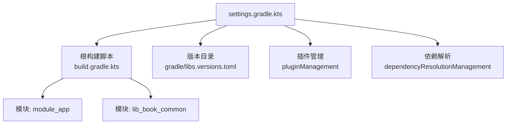
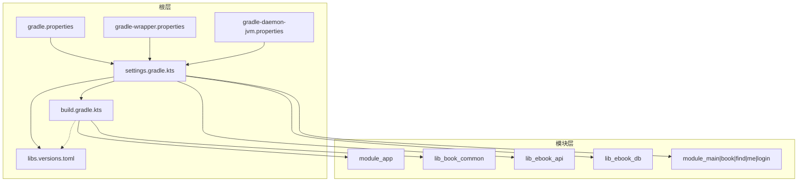
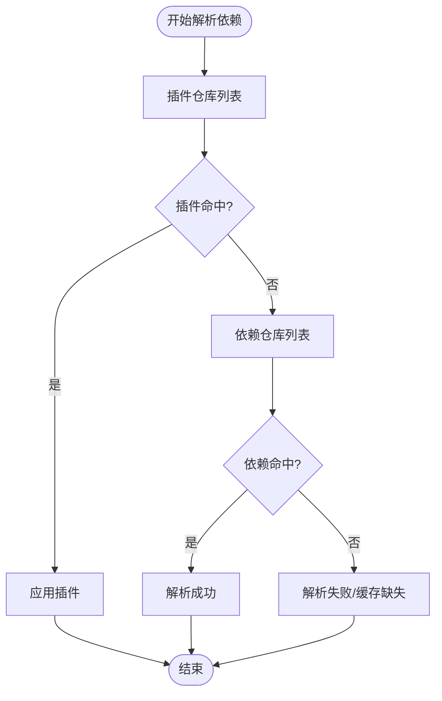

# Gradle 构建配置

<cite>
**本文引用的文件**   
- [settings.gradle.kts](file://settings.gradle.kts)
- [build.gradle.kts](file://build.gradle.kts)
- [gradle/libs.versions.toml](file://gradle/libs.versions.toml)
- [gradle.properties](file://gradle.properties)
- [gradle/gradle-daemon-jvm.properties](file://gradle/gradle-daemon-jvm.properties)
- [gradle/wrapper/gradle-wrapper.properties](file://gradle/wrapper/gradle-wrapper.properties)
- [module_app/build.gradle.kts](file://module_app/build.gradle.kts)
- [lib_book_common/build.gradle.kts](file://lib_book_common/build.gradle.kts)
</cite>

## 目录
1. [简介](#简介)
2. [项目结构](#项目结构)
3. [核心组件](#核心组件)
4. [架构总览](#架构总览)
5. [详细组件分析](#详细组件分析)
6. [依赖解析与仓库优先级](#依赖解析与仓库优先级)
7. [性能与构建优化](#性能与构建优化)
8. [常见问题与排错](#常见问题与排错)
9. [结论](#结论)
10. [附录：常用命令与最佳实践](#附录常用命令与最佳实践)

## 简介
本文件面向 Gradle 构建系统与多模块 Android 工程的维护者，系统化说明根项目的构建脚本、版本目录、仓库镜像、守护进程与 JDK Toolchain、以及多模块依赖解析策略。文档基于仓库中的实际构建脚本与配置文件编写，帮助读者在不深入源码的前提下掌握构建体系的设计与可维护性要点。

## 项目结构
- 根级使用 Kotlin DSL（settings 与 build 脚本均为 .kts）。
- 通过 settings.gradle.kts 集中声明模块、插件管理与全局仓库；通过 gradle/libs.versions.toml 统一版本与依赖分组；通过根 build.gradle.kts 应用顶层插件并启用模块图校验。
- 业务与库以独立模块组织，由约定插件收敛构建细节（如 Android Application/Library、Compose、Hilt、Room、Native 等），模块自身只声明命名空间、flavor、依赖与编译选项。

图表来源
- [settings.gradle.kts:1-66](file://settings.gradle.kts#L1-L66)
- [build.gradle.kts:1-15](file://build.gradle.kts#L1-L15)
- [gradle/libs.versions.toml:214-237](file://gradle/libs.versions.toml#L214-L237)

章节来源
- [settings.gradle.kts:1-66](file://settings.gradle.kts#L1-L66)
- [build.gradle.kts:1-15](file://build.gradle.kts#L1-L15)

## 核心组件
- 根构建脚本：集中声明插件别名与是否应用，启用模块图校验插件，便于在 CI 或本地快速发现环依赖与不合理的依赖方向。
- 版本目录：统一管理第三方库与插件版本，按 versions/bundles/libraries/plugins 分节，避免硬编码版本号。
- 约定插件：由 build-logic 提供，模块通过 xrn1997.* 前缀的插件 ID 接入统一的 Android/Compose/Hilt/Room/Native 构建规则。
- 仓库镜像：settings 中 pluginManagement 与 dependencyResolutionManagement 分别声明插件仓库与依赖仓库，优先使用阿里云镜像提升国内网络稳定性。
- 工具链与守护进程：Gradle Wrapper 锁定版本；foojay resolver 自动下载 JDK Toolchain；daemon JVM 参数在 gradle.properties 配置。

章节来源
- [build.gradle.kts:1-15](file://build.gradle.kts#L1-L15)
- [gradle/libs.versions.toml:1-237](file://gradle/libs.versions.toml#L1-L237)
- [settings.gradle.kts:1-66](file://settings.gradle.kts#L1-L66)
- [gradle.properties:1-36](file://gradle.properties#L1-L36)
- [gradle/gradle-daemon-jvm.properties:1-13](file://gradle/gradle-daemon-jvm.properties#L1-L13)
- [gradle/wrapper/gradle-wrapper.properties:1-7](file://gradle/wrapper/gradle-wrapper.properties#L1-L7)

## 架构总览
构建系统采用“集中式版本与仓库 + 模块化业务 + 约定插件”的分层设计：
- 根层负责版本、仓库、插件与跨模块约束（如模块图校验）。
- 版本目录作为单一事实源，所有模块引用 libs.xxx.yyy。
- 模块层通过约定插件屏蔽差异，专注业务依赖与产物配置。
- 仓库层通过多镜像与策略提高依赖解析成功率与速度。

图表来源
- [settings.gradle.kts:1-66](file://settings.gradle.kts#L1-L66)
- [build.gradle.kts:1-15](file://build.gradle.kts#L1-L15)
- [gradle/libs.versions.toml:1-237](file://gradle/libs.versions.toml#L1-L237)
- [gradle.properties:1-36](file://gradle.properties#L1-L36)
- [gradle/wrapper/gradle-wrapper.properties:1-7](file://gradle/wrapper/gradle-wrapper.properties#L1-L7)
- [gradle/gradle-daemon-jvm.properties:1-13](file://gradle/gradle-daemon-jvm.properties#L1-L13)

## 详细组件分析

### 根项目构建脚本（build.gradle.kts）
- 使用 alias(libs.plugins.*) 方式引入插件，保持版本集中在版本目录。
- 仅声明 apply false，避免在根项目上直接装配 Android 插件。
- 启用模块图校验插件（com.jraska.module.graph.assertion），用于在构建时检查依赖图是否符合预期。

章节来源
- [build.gradle.kts:1-15](file://build.gradle.kts#L1-L15)
- [gradle/libs.versions.toml:214-237](file://gradle/libs.versions.toml#L214-L237)

### 版本目录（gradle/libs.versions.toml）
- versions：集中定义 AGP、Kotlin、AndroidX、Compose、Retrofit、Room、OkHttp、JSoup、Protobuf、Hilt、Dagger、Therouter、Roborazzi 等版本。
- bundles：聚合测试相关的 Compose UI Test 包。
- libraries：按功能域分组（androidx、compose、retrofit、room、hilt/dagger、jsoup、protobuf、router、coil、test 等），并通过 version.ref 引用 versions 中的值。
- plugins：声明 Android/Kotlin/Compose/Hilt/KSP/Room/Router/ModuleGraph 等插件 ID 与版本；同时声明本项目自定义约定插件的 ID（xrn1997.*），这些 ID 指向 build-logic 提供的实现。

最佳实践
- 新增依赖时，先在 versions 添加版本号，再在 libraries 中声明组名与坐标，最后在模块 dependencies 中使用 libs.xxx.yyy 引用。
- 对需要传递的公共 API（如 lib_book_common 暴露给业务模块），使用 api 而非 implementation，以减少下游重复声明。

章节来源
- [gradle/libs.versions.toml:1-237](file://gradle/libs.versions.toml#L1-L237)

### 模块依赖示例
- module_app：通过约定插件接入 Android Application，声明 flavorDimensions 与 productFlavors（real/mock），并按 isModule 条件决定是否依赖各业务模块；依赖版本通过 libs.* 引用。
- lib_book_common：通过约定插件接入 Android Library，集中声明 Compose BOM、Hilt、KSP、Room、Therouter、Coil、Retrofit Converter、PermissionX 等；将通用能力以 api 形式暴露给上层模块。

章节来源
- [module_app/build.gradle.kts:1-65](file://module_app/build.gradle.kts#L1-L65)
- [lib_book_common/build.gradle.kts:1-96](file://lib_book_common/build.gradle.kts#L1-L96)

### 守护进程与 JDK Toolchain
- Gradle Wrapper：锁定 Gradle 分发版本，保证团队一致性。
- foojay resolver：通过 settings 的 plugins {} 引入 org.gradle.toolchains.foojay-resolver-convention，自动注册下载仓库，无需手写 toolchainManagement。
- 守护进程 JVM：gradle/gradle-daemon-jvm.properties 指定各平台工具链 URL 与版本；gradle.properties 中设置 org.gradle.jvmargs 控制堆大小与 Kotlin Daemon 内存。

章节来源
- [gradle/wrapper/gradle-wrapper.properties:1-7](file://gradle/wrapper/gradle-wrapper.properties#L1-L7)
- [settings.gradle.kts:22-26](file://settings.gradle.kts#L22-L26)
- [gradle/gradle-daemon-jvm.properties:1-13](file://gradle/gradle-daemon-jvm.properties#L1-L13)
- [gradle.properties:1-36](file://gradle.properties#L1-L36)

## 依赖解析与仓库优先级
- 插件仓库：pluginManagement 块中声明阿里云 Google、Maven Central、Gradle Plugin Portal、JitPack、腾讯云镜像、Apache Snapshots、Sonatype Snapshots 等，确保插件与 AGP/Kotlin 等在国内外网络环境下均可稳定解析。
- 依赖仓库：dependencyResolutionManagement 块中同样配置多镜像，并将 repositoriesMode 设置为 FAIL_ON_PROJECT_REPOS，强制禁止子模块自行声明仓库，确保全仓一致的解析策略。
- 优先级：先尝试阿里云镜像，再回退到官方仓库与其他镜像，最后到 Maven Central 与 Plugin Portal。

图表来源
- [settings.gradle.kts:4-19](file://settings.gradle.kts#L4-L19)
- [settings.gradle.kts:28-43](file://settings.gradle.kts#L28-L43)

章节来源
- [settings.gradle.kts:4-19](file://settings.gradle.kts#L4-L19)
- [settings.gradle.kts:28-43](file://settings.gradle.kts#L28-L43)

## 性能与构建优化
- 禁用子模块仓库：FAIL_ON_PROJECT_REPOS 避免每个模块重复声明仓库，减少解析开销与冲突。
- 增量构建：启用 KSP 增量与日志，提升 KSP 任务执行效率。
- 并行构建：可通过 gradle.properties 开启 org.gradle.parallel=true（按需启用）。
- 守护进程内存：调整 org.gradle.jvmargs 与 Kotlin Daemon 内存，避免 OOM。
- 版本集中：通过版本目录统一升级，减少重复工作与维护成本。
- 模块图校验：在 CI 或本地频繁运行模块图断言，尽早发现不合理的依赖关系。

章节来源
- [settings.gradle.kts:28-43](file://settings.gradle.kts#L28-L43)
- [gradle.properties:1-36](file://gradle.properties#L1-L36)
- [build.gradle.kts:1-15](file://build.gradle.kts#L1-L15)

## 常见问题与排错
- “Toolchain download repositories have not been configured”：已在 settings 中通过 foojay resolver 插件自动注册下载仓库，无需手动配置 toolchainManagement。
- 单模块独立调试导致依赖冲突：不要使用命令行 -PisModule=true 覆盖，应直接修改 gradle.properties 中的 isModule，并在调试后改回提交态，避免 includeBuild 被错误触发。
- 依赖解析失败：确认 settings 中的仓库顺序与镜像可用性；必要时清理 Gradle 缓存并重试。
- 模块图校验失败：根据报错信息调整模块间依赖，避免循环或不必要的耦合。
- R8 混淆与 consumer-rules.pro：遵循仓库约定的消费规则放置位置，避免重复或缺失导致的类丢失。

章节来源
- [settings.gradle.kts:22-26](file://settings.gradle.kts#L22-L26)
- [gradle.properties:21-30](file://gradle.properties#L21-L30)
- [settings.gradle.kts:28-43](file://settings.gradle.kts#L28-L43)

## 结论
该项目采用成熟的 Gradle 多模块构建体系：通过版本目录集中管理依赖与插件版本，通过 settings 统一仓库与解析策略，通过约定插件收敛模块构建细节，配合守护进程与工具链管理保障构建稳定性与效率。遵循本文的最佳实践与排错建议，可在团队协作与持续集成中保持一致性与高可用性的构建体验。

## 附录：常用命令与最佳实践
- 构建与测试
  - 构建整个项目：./gradlew build
  - 构建指定模块（debug）：./gradlew :module_app:assembleDebug
  - 清理并构建：./gradlew clean build
  - 生成 release APK：./gradlew :module_app:assembleRelease
  - 单元测试：./gradlew test
  - 集成测试（需设备/模拟器）：./gradlew connectedAndroidTest
  - Lint 检查：./gradlew lint
- 最佳实践
  - 新增依赖：先在版本目录添加版本与库定义，再在模块 dependencies 中引用。
  - 变更仓库：仅在 settings 中修改，避免在模块内重复声明。
  - 切换构建形态：通过 gradle.properties 的 isModule 控制独立/集成模式，勿用命令行 -P 覆盖。
  - 升级工具链：通过版本目录与 foojay resolver 管理，无需本地预装 JDK。
  - 定期运行模块图校验，及时修复依赖问题。

章节来源
- [gradle/libs.versions.toml:1-237](file://gradle/libs.versions.toml#L1-L237)
- [settings.gradle.kts:28-43](file://settings.gradle.kts#L28-L43)
- [gradle.properties:21-30](file://gradle.properties#L21-L30)