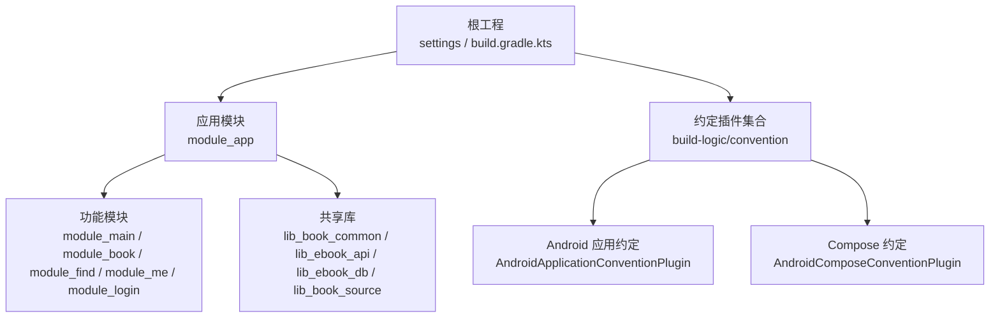
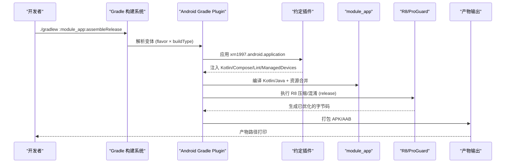
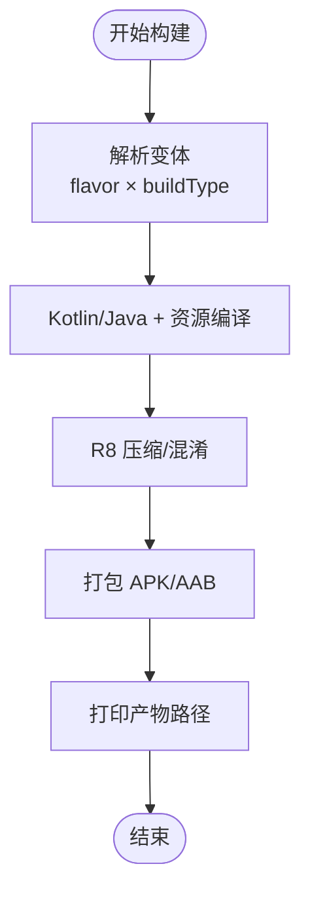

# Release 版本构建

<cite>
**本文引用的文件**
- [build.gradle.kts](file://build.gradle.kts)
- [settings.gradle.kts](file://settings.gradle.kts)
- [gradle.properties](file://gradle.properties)
- [compose_compiler_config.conf](file://compose_compiler_config.conf)
- [gradle/libs.versions.toml](file://gradle/libs.versions.toml)
- [module_app/build.gradle.kts](file://module_app/build.gradle.kts)
- [module_app/proguard-rules.pro](file://module_app/proguard-rules.pro)
- [build-logic/convention/build.gradle.kts](file://build-logic/convention/build.gradle.kts)
- [build-logic/convention/src/main/kotlin/AndroidApplicationConventionPlugin.kt](file://build-logic/convention/src/main/kotlin/AndroidApplicationConventionPlugin.kt)
- [build-logic/convention/src/main/kotlin/AndroidComposeConventionPlugin.kt](file://build-logic/convention/src/main/kotlin/AndroidComposeConventionPlugin.kt)
</cite>

## 目录
1. [简介](#简介)
2. [项目结构](#项目结构)
3. [核心组件](#核心组件)
4. [架构总览](#架构总览)
5. [详细组件分析](#详细组件分析)
6. [依赖分析](#依赖分析)
7. [性能考量](#性能考量)
8. [故障排查指南](#故障排查指南)
9. [结论](#结论)
10. [附录](#附录)

## 简介
本文件聚焦 Release 版本的构建流程与发布产物，覆盖以下关键主题：
- release 构建类型配置（签名、混淆、资源优化）
- Compose 编译器配置与优化选项
- APK/AAB 生成过程与产物分析
- 版本管理策略与版本号生成规则
- 构建性能优化建议与常见问题排查
- 持续集成环境下的自动化构建要点

## 项目结构
本项目为多模块 Android 工程，采用约定插件集中管理构建配置。根工程负责仓库级 Gradle 设置与插件声明；应用入口 module_app 承担 application 的发布配置（如 release 开启混淆、applicationId、versionCode/versionName）；build-logic 提供统一约定插件，确保各模块在 release 下具备一致的编译、Lint、测试设备与打印产物行为。

图表来源
- [settings.gradle.kts:1-66](file://settings.gradle.kts#L1-L66)
- [build-logic/convention/build.gradle.kts:40-78](file://build-logic/convention/build.gradle.kts#L40-L78)
- [module_app/build.gradle.kts:1-47](file://module_app/build.gradle.kts#L1-L47)

章节来源
- [settings.gradle.kts:1-66](file://settings.gradle.kts#L1-L66)
- [build-logic/convention/build.gradle.kts:1-79](file://build-logic/convention/build.gradle.kts#L1-L79)
- [module_app/build.gradle.kts:1-47](file://module_app/build.gradle.kts#L1-L47)

## 核心组件
- 根构建脚本：集中声明插件与工具链，启用模块图校验等横切能力。
- settings 与版本目录：统一仓库源、依赖版本、Gradle 插件版本。
- 约定插件：封装 AGP/Kotlin/Compose/Lint/Managed Devices 等通用配置，避免在各模块重复配置。
- 应用模块：定义 applicationId、versionCode/versionName、product flavor、release 混淆与 proguard 规则。
- Compose 编译器配置：通过全局配置文件声明稳定类白名单，提升重组稳定性。

章节来源
- [build.gradle.kts:1-15](file://build.gradle.kts#L1-L15)
- [gradle/libs.versions.toml:1-237](file://gradle/libs.versions.toml#L1-L237)
- [build-logic/convention/src/main/kotlin/AndroidApplicationConventionPlugin.kt:28-49](file://build-logic/convention/src/main/kotlin/AndroidApplicationConventionPlugin.kt#L28-L49)
- [build-logic/convention/src/main/kotlin/AndroidComposeConventionPlugin.kt:37-58](file://build-logic/convention/src/main/kotlin/AndroidComposeConventionPlugin.kt#L37-L58)
- [compose_compiler_config.conf:1-11](file://compose_compiler_config.conf#L1-L11)

## 架构总览
Release 构建由 Gradle 任务驱动，AGP 根据 product flavor 与 build type 组合出最终变体（例如 :module_app:assembleRelease）。约定插件统一注入 Kotlin、Compose、Lint、测试设备等能力；应用模块在 release 中开启 R8 代码压缩与资源优化，并挂载混淆规则。Compose 编译器使用仓库根配置的稳定性白名单，以减少不必要的重组。

图表来源
- [build-logic/convention/src/main/kotlin/AndroidApplicationConventionPlugin.kt:28-49](file://build-logic/convention/src/main/kotlin/AndroidApplicationConventionPlugin.kt#L28-L49)
- [build-logic/convention/src/main/kotlin/AndroidComposeConventionPlugin.kt:37-58](file://build-logic/convention/src/main/kotlin/AndroidComposeConventionPlugin.kt#L37-L58)
- [module_app/build.gradle.kts:27-36](file://module_app/build.gradle.kts#L27-L36)

## 详细组件分析

### Release 构建类型与签名配置
- 应用模块在 release 构建类型中启用代码压缩与混淆，并引入默认优化规则与模块级 proguard-rules.pro。
- 当前仓库未内置 keystore 或签名配置，release 产物需由 CI 或本地通过 signingConfig 注入密钥后完成签名。建议在 CI 中以安全变量注入 keyAlias/keyPassword/storeFile/storePassword，并在 module_app 的 buildTypes.release 中引用。

章节来源
- [module_app/build.gradle.kts:27-36](file://module_app/build.gradle.kts#L27-L36)
- [module_app/proguard-rules.pro:1-34](file://module_app/proguard-rules.pro#L1-L34)

### 代码压缩与资源优化
- 代码压缩：module_app 的 release 开启 isMinifyEnabled，使用 R8 进行优化与混淆。
- 资源优化：AGP 默认启用资源压缩与优化；仓库 gradle.properties 显式关闭了“严格保留规则模式”，以规避误删风险。
- 混淆规则：module_app/proguard-rules.pro 包含崩溃栈可读性相关属性与 TheRouter 反射面 keep 规则；其他模块的 consumer-rules.pro 随 AAR 传播，避免重复。

章节来源
- [module_app/build.gradle.kts:27-36](file://module_app/build.gradle.kts#L27-L36)
- [gradle.properties:14-36](file://gradle.properties#L14-L36)
- [module_app/proguard-rules.pro:1-34](file://module_app/proguard-rules.pro#L1-L34)

### Compose 编译器配置与优化
- 仓库根存在 Compose 编译器配置文件，用于声明稳定类白名单，减少重组开销。
- Compose 能力由约定插件统一注入，无需在各模块重复开启；该插件会按 isModule 选择 application 或 library 基础插件，再应用 compose 编译器。

章节来源
- [compose_compiler_config.conf:1-11](file://compose_compiler_config.conf#L1-L11)
- [build-logic/convention/src/main/kotlin/AndroidComposeConventionPlugin.kt:37-58](file://build-logic/convention/src/main/kotlin/AndroidComposeConventionPlugin.kt#L37-L58)

### APK 生成过程与产物分析
- 变体：module_app 定义了 real/mock 两个 flavor，配合 build types 可产生多种变体（如 assembleRelease）。
- 产物：构建完成后会在 module_app/build/outputs/apk/release 等路径生成 APK；同时约定插件会打印产物路径以便定位。
- 映射文件：启用混淆时，mapping.txt 位于 outputs/mapping/<variant>/，用于崩溃堆栈还原。

图表来源
- [module_app/build.gradle.kts:17-36](file://module_app/build.gradle.kts#L17-L36)
- [build-logic/convention/src/main/kotlin/AndroidApplicationConventionPlugin.kt:44-46](file://build-logic/convention/src/main/kotlin/AndroidApplicationConventionPlugin.kt#L44-L46)

章节来源
- [module_app/build.gradle.kts:17-36](file://module_app/build.gradle.kts#L17-L36)
- [build-logic/convention/src/main/kotlin/AndroidApplicationConventionPlugin.kt:44-46](file://build-logic/convention/src/main/kotlin/AndroidApplicationConventionPlugin.kt#L44-L46)

### 版本管理策略与版本号生成规则
- 当前应用模块的 versionCode 与 versionName 硬编码在 module_app 的 defaultConfig 中。
- 建议结合 Git 标签或 CI 流水线动态注入 versionName（如语义化版本），versionCode 可由 CI 递增。
- 若后续接入签名，可在 CI 中基于 tag 生成带签名的发布包，并通过 artifact 上传至制品库。

章节来源
- [module_app/build.gradle.kts:11-16](file://module_app/build.gradle.kts#L11-L16)

### 持续集成环境下的自动化构建配置要点
- 构建命令：CI 中执行 ./gradlew :module_app:assembleRelease 生成发布包。
- 缓存：缓存 Gradle 用户目录与构建缓存以提升速度。
- 签名：通过环境变量注入 keystore 与密码，在 CI 步骤中临时写入 module_app 的 signingConfig。
- 产物：将 APK/AAB 与 mapping.txt 作为 CI 工件保存，便于下载与归档。
- 并行与守护进程：仓库已配置 Gradle JVM 参数，CI 可复用同一工作节点保持守护进程活跃。

章节来源
- [gradle.properties:21-36](file://gradle.properties#L21-L36)
- [module_app/build.gradle.kts:27-36](file://module_app/build.gradle.kts#L27-L36)

## 依赖分析
仓库通过版本目录统一管理依赖与插件版本，根构建脚本仅做插件开关与模块图断言；约定插件屏蔽差异，保证各模块构建一致。

图表来源
- [gradle/libs.versions.toml:214-237](file://gradle/libs.versions.toml#L214-L237)
- [build.gradle.kts:1-15](file://build.gradle.kts#L1-L15)
- [build-logic/convention/build.gradle.kts:40-78](file://build-logic/convention/build.gradle.kts#L40-L78)

章节来源
- [gradle/libs.versions.toml:1-237](file://gradle/libs.versions.toml#L1-L237)
- [build.gradle.kts:1-15](file://build.gradle.kts#L1-L15)
- [build-logic/convention/build.gradle.kts:1-79](file://build-logic/convention/build.gradle.kts#L1-L79)

## 性能考量
- 增量与并行：仓库已开启 KSP 增量与日志；建议 CI 使用 Gradle 并行与守护进程。
- 资源优化：AGP 默认开启资源压缩与优化；谨慎使用 -keep/-dontwarn，避免扩大保留范围。
- 构建缓存：启用 Gradle 构建缓存与远程缓存（CI 中），显著缩短冷启动时间。
- 模块图：启用模块图断言有助于提前发现错误依赖，降低后期重构成本。
- Compose 重组：通过稳定性白名单减少重组，提升 UI 渲染性能。

章节来源
- [gradle.properties:14-36](file://gradle.properties#L14-L36)
- [compose_compiler_config.conf:1-11](file://compose_compiler_config.conf#L1-L11)
- [build.gradle.kts:1-15](file://build.gradle.kts#L1-L15)

## 故障排查指南
- 构建失败：优先查看 Gradle 日志中的错误堆栈；确认是否缺少签名配置或依赖解析失败。
- 运行崩溃：启用混淆后出现崩溃，需结合 mapping.txt 还原行号；确保 release 构建生成了 mapping 文件。
- 页面不显示/路由失效：TheRouter 的反射面需要 keep；检查 module_app/proguard-rules.pro 是否包含必要规则。
- 资源问题：确认资源未被误删（strictFullModeForKeepRules=false 已关闭严格模式），必要时缩小保留范围。
- Compose 性能：检查稳定性白名单是否遗漏第三方类，导致重组频繁。

章节来源
- [module_app/proguard-rules.pro:1-34](file://module_app/proguard-rules.pro#L1-L34)
- [gradle.properties:14-36](file://gradle.properties#L14-L36)
- [compose_compiler_config.conf:1-11](file://compose_compiler_config.conf#L1-L11)

## 结论
本项目通过约定插件与版本目录实现了统一的 Release 构建流程：应用模块在 release 开启 R8 压缩与混淆，Compose 编译器通过全局配置文件提升重组稳定性；APK 产物由 Gradle 自动产出并打印路径。建议在生产环境完善签名注入与版本动态化，结合 CI 实现一键发布与工件归档。

## 附录
- 常用构建命令（参考仓库 README 中说明）：
  - 构建 Release：./gradlew :module_app:assembleRelease
  - 清理构建：./gradlew clean
  - 全量构建：./gradlew build

章节来源
- [module_app/build.gradle.kts:27-36](file://module_app/build.gradle.kts#L27-L36)