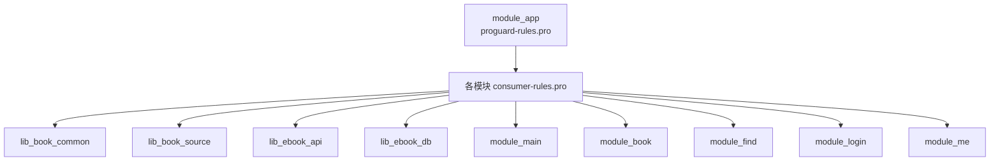
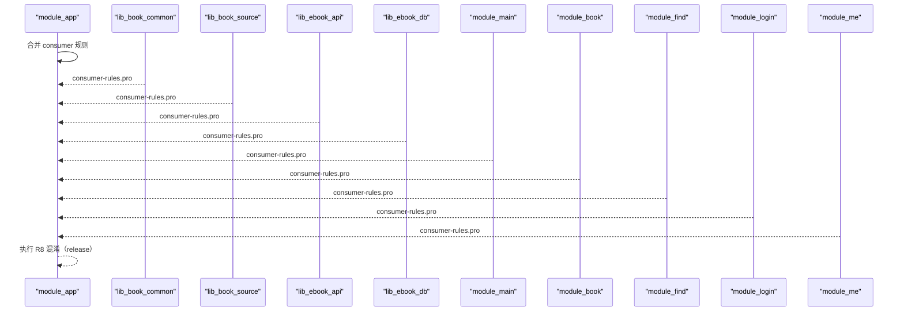
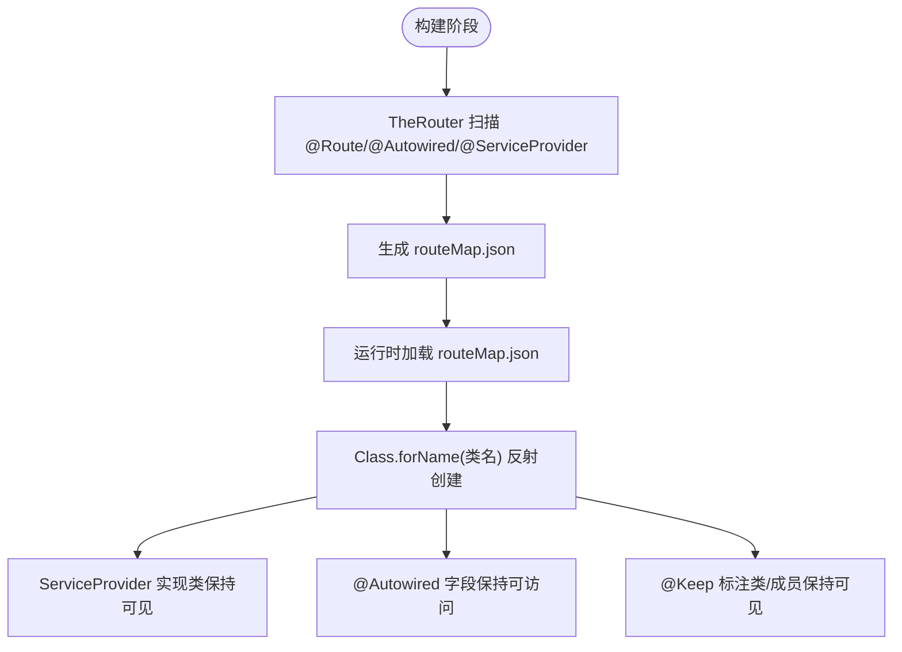
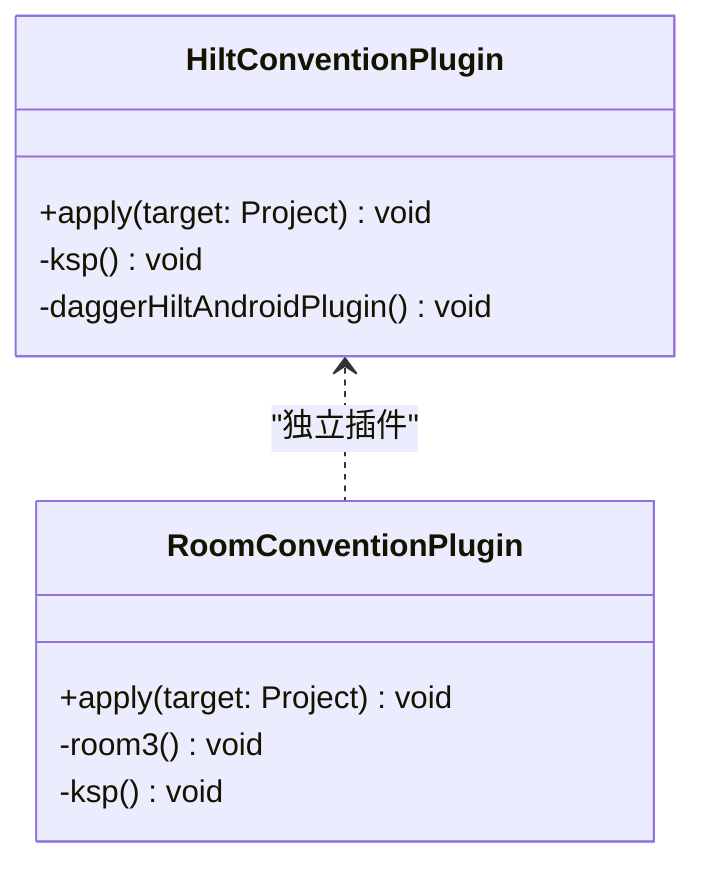
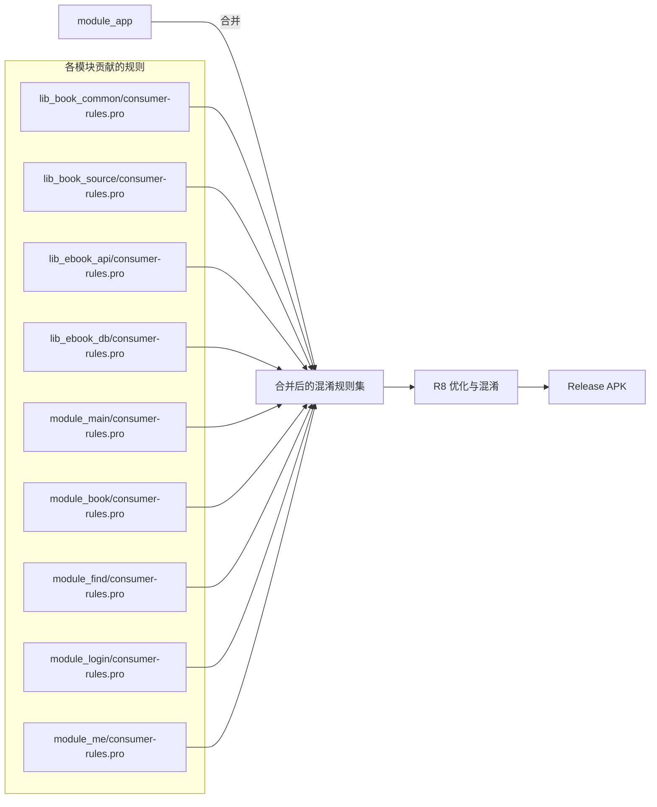

# 代码混淆与优化

<cite>
**本文引用的文件**
- [module_app/proguard-rules.pro](file://module_app/proguard-rules.pro)
- [module_book/consumer-rules.pro](file://module_book/consumer-rules.pro)
- [module_main/consumer-rules.pro](file://module_main/consumer-rules.pro)
- [module_login/consumer-rules.pro](file://module_login/consumer-rules.pro)
- [module_find/consumer-rules.pro](file://module_find/consumer-rules.pro)
- [module_me/consumer-rules.pro](file://module_me/consumer-rules.pro)
- [lib_ebook_api/consumer-rules.pro](file://lib_ebook_api/consumer-rules.pro)
- [lib_ebook_db/consumer-rules.pro](file://lib_ebook_db/consumer-rules.pro)
- [lib_book_source/consumer-rules.pro](file://lib_book_source/consumer-rules.pro)
- [lib_book_common/consumer-rules.pro](file://lib_book_common/consumer-rules.pro)
- [HiltConventionPlugin.kt](file://build-logic/convention/src/main/kotlin/HiltConventionPlugin.kt)
- [AndroidRoomConventionPlugin.kt](file://build-logic/convention/src/main/kotlin/AndroidRoomConventionPlugin.kt)
- [routeMap.json（module_app）](file://module_app/src/main/assets/therouter/routeMap.json)
- [routeMap.json（module_book）](file://module_book/src/main/assets/therouter/routeMap.json)
</cite>

## 目录
1. [简介](#简介)
2. [项目结构与混淆配置总览](#项目结构与混淆配置总览)
3. [核心组件与规则归属](#核心组件与规则归属)
4. [架构总览](#架构总览)
5. [详细组件分析](#详细组件分析)
6. [依赖关系与传播路径](#依赖关系与传播路径)
7. [性能与体积考量](#性能与体积考量)
8. [故障排查指南](#故障排查指南)
9. [结论](#结论)
10. [附录：新增反射面时的规则添加流程](#附录新增反射面时的规则添加流程)

## 简介
本文件聚焦项目的 R8 混淆与优化策略，系统性说明：
- 混淆规则的分布与职责边界：module_app 的 proguard-rules.pro 与各模块的 consumer-rules.pro。
- TheRouter 的混淆适配：@Route 注解处理、RouteMapKt 运行时反射支持、ServiceProvider 实现类保护。
- Hilt 生成类的混淆处理、Room 实体保护、第三方库的混淆适配原则。
- 映射文件生成与分析方法。
- 新增反射面时的规则添加规范与常见混淆问题调试方法。

## 项目结构与混淆配置总览
本项目采用多模块 Gradle 工程，混淆规则严格遵循 Android 标准约定：
- 应用入口 module_app 在 release 开启 isMinifyEnabled，R8 在此执行并合并所有 consumer 规则。
- 功能模块与库模块仅维护自身所需的 consumer-rules.pro，通过 consumerProguardFiles 传播给消费方。
- 功能模块的 proguard-rules.pro 通常仅包含 -include consumer-rules.pro，避免重复维护。

图表来源
- [module_app/proguard-rules.pro:1-15](file://module_app/proguard-rules.pro#L1-L15)
- [module_book/consumer-rules.pro:1-33](file://module_book/consumer-rules.pro#L1-L33)
- [module_main/consumer-rules.pro:1-33](file://module_main/consumer-rules.pro#L1-L33)
- [module_login/consumer-rules.pro:1-33](file://module_login/consumer-rules.pro#L1-L33)
- [module_find/consumer-rules.pro:1-33](file://module_find/consumer-rules.pro#L1-L33)
- [module_me/consumer-rules.pro:1-33](file://module_me/consumer-rules.pro#L1-L33)
- [lib_ebook_api/consumer-rules.pro:1-11](file://lib_ebook_api/consumer-rules.pro#L1-L11)
- [lib_ebook_db/consumer-rules.pro:1-9](file://lib_ebook_db/consumer-rules.pro#L1-L9)
- [lib_book_source/consumer-rules.pro:1-13](file://lib_book_source/consumer-rules.pro#L1-L13)
- [lib_book_common/consumer-rules.pro:1-6](file://lib_book_common/consumer-rules.pro#L1-L6)

章节来源
- [module_app/proguard-rules.pro:1-15](file://module_app/proguard-rules.pro#L1-L15)
- [module_book/consumer-rules.pro:1-33](file://module_book/consumer-rules.pro#L1-L33)

## 核心组件与规则归属
- 应用层（module_app）
  - 负责 release 混淆入口、崩溃栈可读性保留、TheRouter 基础 keep 规则（官方 README 要求）、行号属性保留与源文件名隐藏。
  - 不写业务模块反射面规则，这些规则由各模块 consumer-rules.pro 提供并通过 consumer 传播。
- 业务模块（module_main、module_book、module_find、module_login、module_me）
  - 各自维护 consumer-rules.pro，声明本模块的 TheRouter 规则（@Keep、@Autowired、@ServiceProvider）。
  - @Route 的 Activity 由 manifest aapt 规则兜底，无需显式 keep；但 ServiceProvider 实现类需保持可见以支持 RouteMapKt 反射创建。
- 共享库（lib_book_common、lib_book_source、lib_ebook_api、lib_ebook_db）
  - lib_ebook_api：无手写 keep，依赖 kotlinx-serialization-core 与 Retrofit 自带 consumer 规则覆盖 DTO 与网络接口反射。
  - lib_ebook_db：无手写 keep，Room3 运行时 AAR 自带 consumer 规则覆盖实体/DAO/生成代码；无运行时反射。
  - lib_book_source：仅保留 JNI 桥反射面（HostDispatcher），QuickJsNative 的 native 方法由 AGP 默认规则覆盖。
  - lib_book_common：当前无反射需求，无需手写 keep。

章节来源
- [module_app/proguard-rules.pro:12-34](file://module_app/proguard-rules.pro#L12-L34)
- [module_book/consumer-rules.pro:8-32](file://module_book/consumer-rules.pro#L8-L32)
- [lib_ebook_api/consumer-rules.pro:1-11](file://lib_ebook_api/consumer-rules.pro#L1-L11)
- [lib_ebook_db/consumer-rules.pro:1-9](file://lib_ebook_db/consumer-rules.pro#L1-L9)
- [lib_book_source/consumer-rules.pro:1-13](file://lib_book_source/consumer-rules.pro#L1-L13)
- [lib_book_common/consumer-rules.pro:1-6](file://lib_book_common/consumer-rules.pro#L1-L6)

## 架构总览
混淆规则的组织遵循“单一事实源”原则：
- module_app 作为唯一集成态执行者，集中处理崩溃栈可读性与通用 TheRouter 基础规则。
- 各模块 consumer-rules.pro 仅声明本模块反射面需求，避免重复和冲突。
- 第三方库依赖自带 consumer 规则，不重复编写 keep/dontwarn。

图表来源
- [module_app/proguard-rules.pro:1-15](file://module_app/proguard-rules.pro#L1-L15)
- [module_book/consumer-rules.pro:1-33](file://module_book/consumer-rules.pro#L1-L33)
- [module_main/consumer-rules.pro:1-33](file://module_main/consumer-rules.pro#L1-L33)
- [module_login/consumer-rules.pro:1-33](file://module_login/consumer-rules.pro#L1-L33)
- [module_find/consumer-rules.pro:1-33](file://module_find/consumer-rules.pro#L1-L33)
- [module_me/consumer-rules.pro:1-33](file://module_me/consumer-rules.pro#L1-L33)
- [lib_ebook_api/consumer-rules.pro:1-11](file://lib_ebook_api/consumer-rules.pro#L1-L11)
- [lib_ebook_db/consumer-rules.pro:1-9](file://lib_ebook_db/consumer-rules.pro#L1-L9)
- [lib_book_source/consumer-rules.pro:1-13](file://lib_book_source/consumer-rules.pro#L1-L13)
- [lib_book_common/consumer-rules.pro:1-6](file://lib_book_common/consumer-rules.pro#L1-L6)

## 详细组件分析

### TheRouter 混淆规则与反射支持
- @Route 注解页面
  - 通过 manifest aapt 规则兜底，无需额外 keep。
  - 路由表由 TheRouter transform 回写到 assets/therouter/routeMap.json，用于运行时解析。
- @Autowired 字段注入
  - 需在 consumer-rules.pro 中保留 @Autowired 字段成员，确保字段不被移除或重命名导致注入失败。
- @ServiceProvider 实现类
  - 运行时通过 RouteMapKt 按类名字符串反射创建实例，必须保持可见。
- Keep 注解
  - 保留 androidx.annotation.Keep 及其标注的类、方法、字段、构造器，防止被误删。

图表来源
- [module_app/proguard-rules.pro:16-34](file://module_app/proguard-rules.pro#L16-L34)
- [module_book/consumer-rules.pro:8-32](file://module_book/consumer-rules.pro#L8-L32)
- [module_main/consumer-rules.pro:8-32](file://module_main/consumer-rules.pro#L8-L32)
- [module_login/consumer-rules.pro:8-32](file://module_login/consumer-rules.pro#L8-L32)
- [module_find/consumer-rules.pro:8-32](file://module_find/consumer-rules.pro#L8-L32)
- [module_me/consumer-rules.pro:8-32](file://module_me/consumer-rules.pro#L8-L32)
- [routeMap.json（module_app）:1-150](file://module_app/src/main/assets/therouter/routeMap.json#L1-L150)
- [routeMap.json（module_book）:1-39](file://module_book/src/main/assets/therouter/routeMap.json#L1-L39)

章节来源
- [module_app/proguard-rules.pro:16-34](file://module_app/proguard-rules.pro#L16-L34)
- [module_book/consumer-rules.pro:8-32](file://module_book/consumer-rules.pro#L8-L32)

### Hilt 生成的类混淆处理
- Hilt 通过 KSP 生成代码，常规注入点（@Inject、@Module、@Component）由 Hilt 自带 consumer 规则覆盖。
- 本项目约定插件启用 KSP 与 Hilt Android 插件，无需额外 keep 规则。
- Application 上避免 eager @Inject 字段，防止沙箱进程启动异常。

图表来源
- [HiltConventionPlugin.kt:24-49](file://build-logic/convention/src/main/kotlin/HiltConventionPlugin.kt#L24-L49)
- [AndroidRoomConventionPlugin.kt:26-52](file://build-logic/convention/src/main/kotlin/AndroidRoomConventionPlugin.kt#L26-L52)

章节来源
- [HiltConventionPlugin.kt:24-49](file://build-logic/convention/src/main/kotlin/HiltConventionPlugin.kt#L24-L49)

### Room 实体保护
- Room3 运行时 AAR 自带 consumer 规则，覆盖实体、DAO 及生成代码。
- 项目未引入旧版 SQLCipher 或 Rx 相关遗留规则，已清理无用 keep/dontwarn。
- 实体与 DAO 由编译期生成代码直接引用，无运行时反射。

章节来源
- [lib_ebook_db/consumer-rules.pro:1-9](file://lib_ebook_db/consumer-rules.pro#L1-L9)
- [AndroidRoomConventionPlugin.kt:26-52](file://build-logic/convention/src/main/kotlin/AndroidRoomConventionPlugin.kt#L26-L52)

### 第三方库混淆适配
- kotlinx-serialization-core：DTO 反射式序列化查找由内置 META-INF/proguard/kotlinx-serialization-common.pro 覆盖。
- Retrofit：网络接口反射由 retrofit jar 内置 META-INF/proguard/retrofit2.pro 覆盖。
- OkHttp：EncodingInterceptor 不再反射私有字段 contentTypeString，改用公开 API。
- QuickJS Native：native 方法由 AGP 默认规则覆盖，无需手动 keep。

章节来源
- [lib_ebook_api/consumer-rules.pro:1-11](file://lib_ebook_api/consumer-rules.pro#L1-L11)
- [lib_book_source/consumer-rules.pro:1-13](file://lib_book_source/consumer-rules.pro#L1-L13)

### 崩溃栈可读性与映射文件
- 保留 SourceFile 与 LineNumberTable，便于 release 崩溃栈还原。
- 使用 -renamesourcefileattribute 隐藏原始文件名，避免泄露源码路径。
- 映射文件位于 build/outputs/mapping/<variant>/mapping.txt，用于混淆后堆栈还原。

章节来源
- [module_app/proguard-rules.pro:12-15](file://module_app/proguard-rules.pro#L12-L15)

## 依赖关系与传播路径
- consumerProguardFiles 机制确保各模块规则在集成态下自动合并至 module_app 的 R8 任务。
- 规则优先级：更具体的规则应放在对应模块的 consumer-rules.pro，避免全局污染。
- 禁止无证据的 -keep/-dontwarn，减少不必要的保留与警告噪音。

图表来源
- [module_app/proguard-rules.pro:1-15](file://module_app/proguard-rules.pro#L1-L15)
- [module_book/consumer-rules.pro:1-33](file://module_book/consumer-rules.pro#L1-L33)
- [module_main/consumer-rules.pro:1-33](file://module_main/consumer-rules.pro#L1-L33)
- [module_login/consumer-rules.pro:1-33](file://module_login/consumer-rules.pro#L1-L33)
- [module_find/consumer-rules.pro:1-33](file://module_find/consumer-rules.pro#L1-L33)
- [module_me/consumer-rules.pro:1-33](file://module_me/consumer-rules.pro#L1-L33)
- [lib_ebook_api/consumer-rules.pro:1-11](file://lib_ebook_api/consumer-rules.pro#L1-L11)
- [lib_ebook_db/consumer-rules.pro:1-9](file://lib_ebook_db/consumer-rules.pro#L1-L9)
- [lib_book_source/consumer-rules.pro:1-13](file://lib_book_source/consumer-rules.pro#L1-L13)
- [lib_book_common/consumer-rules.pro:1-6](file://lib_book_common/consumer-rules.pro#L1-L6)

章节来源
- [module_app/proguard-rules.pro:1-15](file://module_app/proguard-rules.pro#L1-L15)

## 性能与体积考量
- 最小化 keep 范围：仅保留必要的反射面与注解目标，避免过度保留导致体积膨胀。
- 依赖自带规则优先：利用第三方库提供的 consumer 规则，减少重复定义。
- 行号保留与源文件名隐藏：平衡调试便利与源码泄露风险。
- 关闭不必要的 -dontwarn：仅在确有必要时添加，并保持注释说明原因。

## 故障排查指南
- 路由跳转失败
  - 检查 routeMap.json 是否包含新路由；确认 @Route 注解所在类未被移除。
  - 独立模式下跨模块路由可能静默丢失，需在 src/main/test/debug 提供占位路由。
- ServiceProvider 反射失败
  - 确认 @ServiceProvider 实现类未被混淆移除；consumer-rules.pro 中是否有对应 keep。
- Hilt 注入失败
  - 检查 KSP 生成代码是否可用；Application 避免 eager @Inject 字段。
- Room 数据异常
  - 确认实体与 DAO 未被误删；Room3 自带规则生效。
- JNI 桥回调失败
  - 检查 HostDispatcher 是否保持可见；QuickJsNative 的 native 方法由 AGP 默认规则覆盖。

章节来源
- [module_app/proguard-rules.pro:16-34](file://module_app/proguard-rules.pro#L16-L34)
- [module_book/consumer-rules.pro:8-32](file://module_book/consumer-rules.pro#L8-L32)
- [lib_book_source/consumer-rules.pro:4-13](file://lib_book_source/consumer-rules.pro#L4-L13)

## 结论
本项目通过清晰的规则分工与严格的证据驱动实践，实现了安全、可维护且高效的 R8 混淆体系：
- 应用层统一入口，业务模块按需声明反射面。
- 第三方库规则优先，避免重复与冲突。
- 崩溃栈可读性与源码泄露防护兼顾。
- 文档化规则归属与传播路径，便于团队协作与演进。

## 附录：新增反射面时的规则添加流程
- 定位反射面：确定需要保持的类、方法或字段（如 @Route、@Autowired、@ServiceProvider）。
- 选择文件：
  - 若属于某业务模块，添加到该模块的 consumer-rules.pro。
  - 若为共享库反射面，添加到对应库的 consumer-rules.pro。
- 编写规则：
  - 仅保留必要元素，附带注释说明证据（如字节码中的 Class.forName 调用）。
  - 避免无证据的 -keep/-dontwarn。
- 验证：
  - 构建 release 包，检查路由跳转与服务提供者初始化是否正常。
  - 查看 mapping.txt 还原崩溃栈，确认行号可读。
- 更新文档：
  - 同步更新本文档的规则归属与示例。

章节来源
- [module_book/consumer-rules.pro:8-32](file://module_book/consumer-rules.pro#L8-L32)
- [lib_ebook_api/consumer-rules.pro:1-11](file://lib_ebook_api/consumer-rules.pro#L1-L11)
- [lib_ebook_db/consumer-rules.pro:1-9](file://lib_ebook_db/consumer-rules.pro#L1-L9)
- [lib_book_source/consumer-rules.pro:1-13](file://lib_book_source/consumer-rules.pro#L1-L13)
- [module_app/proguard-rules.pro:12-15](file://module_app/proguard-rules.pro#L12-L15)