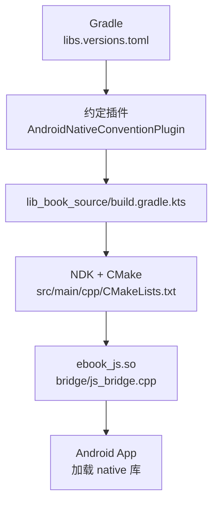
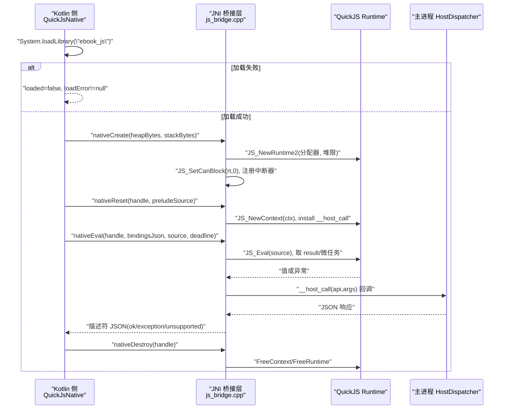
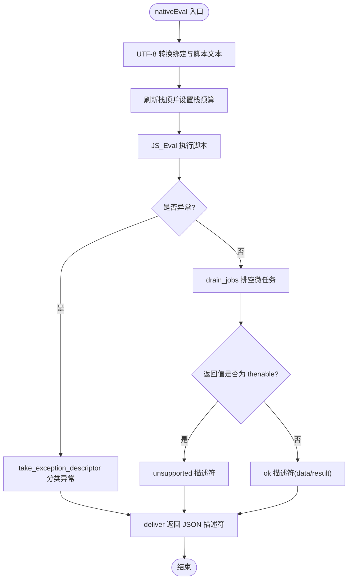
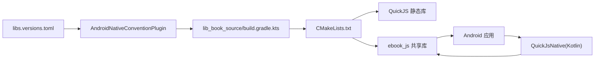

# 原生代码构建

<cite>
**本文引用的文件**
- [lib_book_source/build.gradle.kts](file://lib_book_source/build.gradle.kts)
- [lib_book_source/src/main/cpp/CMakeLists.txt](file://lib_book_source/src/main/cpp/CMakeLists.txt)
- [lib_book_source/src/main/cpp/bridge/js_bridge.cpp](file://lib_book_source/src/main/cpp/bridge/js_bridge.cpp)
- [build-logic/convention/src/main/kotlin/AndroidNativeConventionPlugin.kt](file://build-logic/convention/src/main/kotlin/AndroidNativeConventionPlugin.kt)
- [gradle/libs.versions.toml](file://gradle/libs.versions.toml)
- [scripts/build-desktop-js.sh](file://scripts/build-desktop-js.sh)
- [lib_book_source/src/main/java/com/ebook/source/sandbox/QuickJsNative.kt](file://lib_book_source/src/main/java/com/ebook/source/sandbox/QuickJsNative.kt)
</cite>

## 目录
1. [简介](#简介)
2. [项目结构与入口](#项目结构与入口)
3. [核心组件](#核心组件)
4. [架构总览](#架构总览)
5. [详细组件分析](#详细组件分析)
6. [依赖关系分析](#依赖关系分析)
7. [性能考量](#性能考量)
8. [故障排查指南](#故障排查指南)
9. [结论](#结论)
10. [附录](#附录)

## 简介
本文件聚焦 lib_book_source 模块的原生（C++）构建与集成，覆盖 NDK 版本管理、CMake 配置、ABI 目标策略、QuickJS 引擎 vendored 集成与 JNI 桥接层实现、跨平台构建注意事项、测试与调试方法，以及性能优化建议。内容基于仓库内现有脚本、构建约定与源码注释整理，便于不同背景读者快速上手与维护。

## 项目结构与入口
- 原生代码位于 lib_book_source 模块的 src/main/cpp 目录：
  - CMakeLists.txt：定义 QuickJS 静态库与 ebook_js 共享库的编译选项与链接关系。
  - bridge/js_bridge.cpp：JNI 桥接层，负责创建/销毁 runtime、设置内存与栈限制、执行脚本、结果序列化与主进程回调。
- 构建由 Gradle 约定插件 xrn1997.android.native 统一注入 NDK 版本、ABI 过滤与 CMake 路径；lib_book_source 在 debug 中显式放宽模拟器 ABI。

图表来源
- [gradle/libs.versions.toml:1-10](file://gradle/libs.versions.toml#L1-L10)
- [build-logic/convention/src/main/kotlin/AndroidNativeConventionPlugin.kt:22-48](file://build-logic/convention/src/main/kotlin/AndroidNativeConventionPlugin.kt#L22-L48)
- [lib_book_source/build.gradle.kts:13-25](file://lib_book_source/build.gradle.kts#L13-L25)
- [lib_book_source/src/main/cpp/CMakeLists.txt:1-39](file://lib_book_source/src/main/cpp/CMakeLists.txt#L1-L39)

章节来源
- [lib_book_source/build.gradle.kts:13-25](file://lib_book_source/build.gradle.kts#L13-L25)
- [build-logic/convention/src/main/kotlin/AndroidNativeConventionPlugin.kt:22-48](file://build-logic/convention/src/main/kotlin/AndroidNativeConventionPlugin.kt#L22-L48)
- [gradle/libs.versions.toml:1-10](file://gradle/libs.versions.toml#L1-L10)

## 核心组件
- NDK/CMake 构建管线：通过约定插件统一 NDK 版本与 ABI 过滤，CMakeLists 将 vendored QuickJS 作为静态库链接到 ebook_js 共享库。
- QuickJS 引擎集成：vendored 内核源文件直接纳入编译，启用必要宏与编译选项，确保与 Android bionic 兼容。
- JNI 桥接层：提供 nativeCreate/nativeReset/nativeEval/nativeDestroy 四元 API，封装运行时生命周期、资源限制、微任务处理、异常分类与主进程回调。
- 桌面端构建脚本：为开发机测试提供 Windows/Linux 动态库产物，供 JVM 侧 DesktopJsHostTest 加载。

章节来源
- [lib_book_source/src/main/cpp/CMakeLists.txt:1-39](file://lib_book_source/src/main/cpp/CMakeLists.txt#L1-L39)
- [lib_book_source/src/main/cpp/bridge/js_bridge.cpp:691-820](file://lib_book_source/src/main/cpp/bridge/js_bridge.cpp#L691-L820)
- [scripts/build-desktop-js.sh:1-93](file://scripts/build-desktop-js.sh#L1-L93)

## 架构总览
整体流程：Kotlin 侧通过 QuickJsNative 声明 external 函数并尝试 System.loadLibrary("ebook_js")；若成功则调用 nativeCreate 建立 runtime，nativeReset 重建 context 并安装宿主回调，nativeEval 执行脚本并返回描述符，nativeDestroy 释放资源。CMake 将 QuickJS 内核与桥接层编译为共享库，按 ABI 过滤打包进 APK。

图表来源
- [lib_book_source/src/main/java/com/ebook/source/sandbox/QuickJsNative.kt:15-59](file://lib_book_source/src/main/java/com/ebook/source/sandbox/QuickJsNative.kt#L15-L59)
- [lib_book_source/src/main/cpp/bridge/js_bridge.cpp:691-820](file://lib_book_source/src/main/cpp/bridge/js_bridge.cpp#L691-L820)

## 详细组件分析

### NDK 版本管理与 ABI 策略
- NDK 版本钉死在版本目录 androidNdk，避免 AGP 默认值漂移导致构建不可复现。
- 约定插件为 release 限定最小 ABI 集 arm64-v8a；debug 下 lib_book_source 自行追加 x86_64 以支持模拟器调试，使“谁多带了一份内核”可见于 diff。
- CMake 版本同样从版本目录读取，保持工具链一致。

章节来源
- [gradle/libs.versions.toml:1-10](file://gradle/libs.versions.toml#L1-L10)
- [build-logic/convention/src/main/kotlin/AndroidNativeConventionPlugin.kt:22-48](file://build-logic/convention/src/main/kotlin/AndroidNativeConventionPlugin.kt#L22-L48)
- [lib_book_source/build.gradle.kts:13-25](file://lib_book_source/build.gradle.kts#L13-L25)

### CMake 配置与 QuickJS 集成
- 将 vendored QuickJS 源码（quickjs.c、libregexp.c、libunicode.c、cutils.c、dtoa.c）编译为静态库 quickjs。
- 定义 CONFIG_VERSION 宏以满足内核要求；使用 -O2、-fwrapv、-funsigned-char 等关键编译选项保证行为稳定。
- ebook_js 共享库仅包含桥接层 js_bridge.cpp，搜索路径指向 third_party 父目录以避免头冲突；链接 log、dl、m 系统库。
- 不链接 pthread：bionic 自 API 23 起已将 pthread 实现在 libc 中，避免链接错误。

章节来源
- [lib_book_source/src/main/cpp/CMakeLists.txt:1-39](file://lib_book_source/src/main/cpp/CMakeLists.txt#L1-L39)

### JNI 桥接层设计与职责
- 生命周期管理：nativeCreate 建立 runtime 并设置堆限、中断器；nativeReset 重建 context 并安装全局宿主回调；nativeEval 执行脚本并产出描述符；nativeDestroy 释放资源。
- 资源限制：
  - 堆限制：自定义分配器拦截 malloc/realloc/free 并统计用量，拒绝超限分配，用于准确归类 OOM。
  - 栈限制：每次执行前根据当前线程剩余栈计算预算，防止深递归导致 SIGSEGV。
  - 超时控制：基于单调时钟的截止时间与中断器，区分超时与运行期异常。
- 异常分类：对裸 null/undefined、字符串化失败、不支持特性等进行分类，输出稳定描述符，便于上层统一处理。
- 主进程回调：通过 globalThis.__host_call 调用 Kotlin 侧 HostDispatcher.handle，传递 API 与参数，解析 JSON 响应回脚本上下文。
- 微任务处理：执行完成后排空 pending job，限制最大轮数，检测 Promise 循环并上报不支持。

图表来源
- [lib_book_source/src/main/cpp/bridge/js_bridge.cpp:764-820](file://lib_book_source/src/main/cpp/bridge/js_bridge.cpp#L764-L820)
- [lib_book_source/src/main/cpp/bridge/js_bridge.cpp:467-539](file://lib_book_source/src/main/cpp/bridge/js_bridge.cpp#L467-L539)

章节来源
- [lib_book_source/src/main/cpp/bridge/js_bridge.cpp:85-107](file://lib_book_source/src/main/cpp/bridge/js_bridge.cpp#L85-L107)
- [lib_book_source/src/main/cpp/bridge/js_bridge.cpp:139-212](file://lib_book_source/src/main/cpp/bridge/js_bridge.cpp#L139-L212)
- [lib_book_source/src/main/cpp/bridge/js_bridge.cpp:228-270](file://lib_book_source/src/main/cpp/bridge/js_bridge.cpp#L228-L270)
- [lib_book_source/src/main/cpp/bridge/js_bridge.cpp:522-551](file://lib_book_source/src/main/cpp/bridge/js_bridge.cpp#L522-L551)
- [lib_book_source/src/main/cpp/bridge/js_bridge.cpp:580-637](file://lib_book_source/src/main/cpp/bridge/js_bridge.cpp#L580-L637)
- [lib_book_source/src/main/cpp/bridge/js_bridge.cpp:691-820](file://lib_book_source/src/main/cpp/bridge/js_bridge.cpp#L691-L820)

### 桌面端构建与测试集成
- 脚本 build-desktop-js.sh 在 Windows 上需 MinGW-w64，Linux 上使用 gcc/g++ 生成 ebook_js.dll 或 libebook_js.so。
- 生成 android/log.h 垫片以绕过加密头，桥接层仅在非 Android 环境打印日志。
- Gradle 任务 buildDesktopJsLib 仅在验证阶段触发，并将 java.library.path 指向构建产物目录，供 DesktopJsHostTest 按需加载。

章节来源
- [scripts/build-desktop-js.sh:1-93](file://scripts/build-desktop-js.sh#L1-L93)
- [lib_book_source/build.gradle.kts:71-111](file://lib_book_source/build.gradle.kts#L71-L111)

### 不同 ABI 的构建差异与最小集策略
- Release：仅 arm64-v8a，减少可被逆向的内核副本体积与风险面。
- Debug：追加 x86_64 以便在模拟器调试；放宽点写在模块内，便于审查与定位“哪个模块多带了二进制”。
- 桌面测试：独立脚本产出 Windows/Linux 动态库，不影响发布产物。

章节来源
- [build-logic/convention/src/main/kotlin/AndroidNativeConventionPlugin.kt:22-48](file://build-logic/convention/src/main/kotlin/AndroidNativeConventionPlugin.kt#L22-L48)
- [lib_book_source/build.gradle.kts:13-25](file://lib_book_source/build.gradle.kts#L13-L25)
- [scripts/build-desktop-js.sh:1-93](file://scripts/build-desktop-js.sh#L1-L93)

## 依赖关系分析
- 构建时依赖：
  - NDK/CMake 版本来自版本目录。
  - CMakeLists 引入 vendored QuickJS 源码与第三方头目录。
- 运行时依赖：
  - Android 系统库：log、dl、m；pthread 符号由 libc 提供。
  - JNI：JVM 与 Android ART/JNI 边界。
- 模块内依赖：
  - Kotlin 侧 QuickJsNative 声明 native 接口并负责加载。
  - 桥接层通过 HostDispatcher 与 Kotlin 侧交互，形成单向依赖。

图表来源
- [gradle/libs.versions.toml:1-10](file://gradle/libs.versions.toml#L1-L10)
- [build-logic/convention/src/main/kotlin/AndroidNativeConventionPlugin.kt:22-48](file://build-logic/convention/src/main/kotlin/AndroidNativeConventionPlugin.kt#L22-L48)
- [lib_book_source/build.gradle.kts:13-25](file://lib_book_source/build.gradle.kts#L13-L25)
- [lib_book_source/src/main/cpp/CMakeLists.txt:1-39](file://lib_book_source/src/main/cpp/CMakeLists.txt#L1-L39)

章节来源
- [lib_book_source/src/main/cpp/CMakeLists.txt:1-39](file://lib_book_source/src/main/cpp/CMakeLists.txt#L1-L39)
- [lib_book_source/src/main/java/com/ebook/source/sandbox/QuickJsNative.kt:15-59](file://lib_book_source/src/main/java/com/ebook/source/sandbox/QuickJsNative.kt#L15-L59)

## 性能考量
- 堆与栈限制：自定义分配器精确记录用量，避免误判或越界；栈预算按线程实时计算，防止崩溃。
- 微任务上限：限制 pending job 轮数，检测自驱动 Promise 循环，防止无限调度。
- 超时与中断：基于单调时钟与中断器，区分超时与运行期异常，避免挂起。
- 编译优化：统一 -O2、-fwrapv、-funsigned-char 等，保证行为一致性与性能。
- 资源复用：runtime 常驻、context 逐任务重建，降低开销并隔离状态。

[本节为通用指导，无需具体文件引用]

## 故障排查指南
- 库加载失败：
  - 现象：QuickJsNative.loaded=false，loadError 不为空。
  - 排查：确认 ABI 是否随包（release 仅 arm64-v8a；debug 追加 x86_64），检查 System.loadLibrary 调用时机与类加载器。
- 脚本执行失败：
  - 现象：描述符为 exception/unsupported。
  - 排查：查看异常分类逻辑、超时/内存/微任务限制；确认 prelude 与绑定 JSON 有效。
- 主进程回调异常：
  - 现象：__host_call 返回非法 JSON 或抛出异常。
  - 排查：检查 HostDispatcher.handle 实现与返回格式；注意局部引用与 UTF-8 编码问题。
- 桌面测试无法加载：
  - 现象：DesktopJsHostTest 跳过或找不到库。
  - 排查：确认 buildDesktopJsLib 已执行、java.library.path 指向产物目录、MinGW/gcc 可用。

章节来源
- [lib_book_source/src/main/java/com/ebook/source/sandbox/QuickJsNative.kt:15-59](file://lib_book_source/src/main/java/com/ebook/source/sandbox/QuickJsNative.kt#L15-L59)
- [lib_book_source/src/main/cpp/bridge/js_bridge.cpp:467-539](file://lib_book_source/src/main/cpp/bridge/js_bridge.cpp#L467-L539)
- [lib_book_source/src/main/cpp/bridge/js_bridge.cpp:580-637](file://lib_book_source/src/main/cpp/bridge/js_bridge.cpp#L580-L637)
- [scripts/build-desktop-js.sh:1-93](file://scripts/build-desktop-js.sh#L1-L93)
- [lib_book_source/build.gradle.kts:71-111](file://lib_book_source/build.gradle.kts#L71-L111)

## 结论
本项目通过约定插件集中管理 NDK/CMake 与 ABI 策略，将 QuickJS 内核 vendored 并以 JNI 桥接层安全地嵌入 Android 应用。桥接层在堆栈限制、超时、微任务与异常分类方面做了充分防御性设计，配合桌面端脚本支持开发与测试。遵循最小集 ABI、版本目录与构建约定，可确保构建可复现、产物可控、问题易定位。

## 附录
- 常用命令（参考仓库根文档）：
  - 构建全部：./gradlew build
  - 构建指定模块：./gradlew :lib_book_source:assembleDebug
  - 清理构建：./gradlew clean
  - 单元测试：./gradlew test
  - 插桩测试：./gradlew connectedAndroidTest
- 桌面端脚本：
  - 触发构建：./gradlew :lib_book_source:buildDesktopJsLib
  - 条件：Windows 需 MinGW-w64；Linux 需 gcc/g++；JAVA_HOME 或 PATH 含 java。

[本节为通用指引，无需具体文件引用]