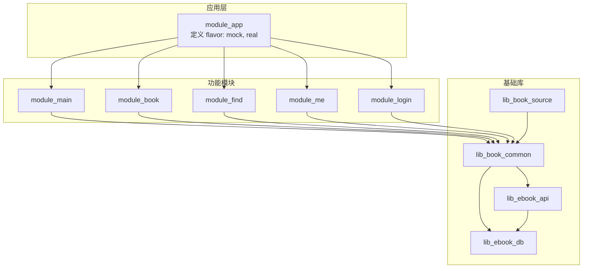
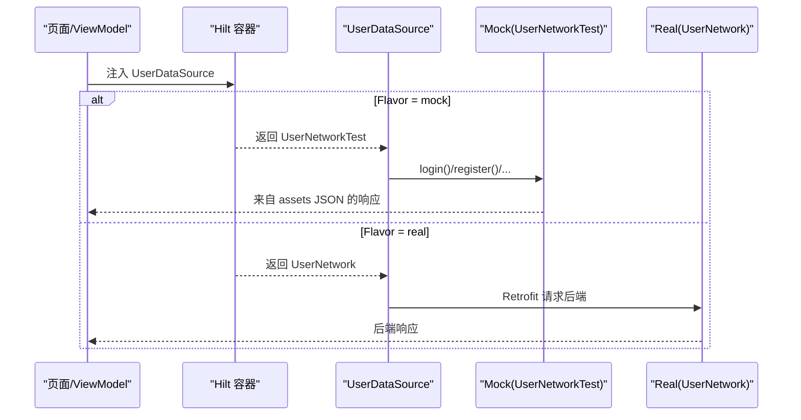
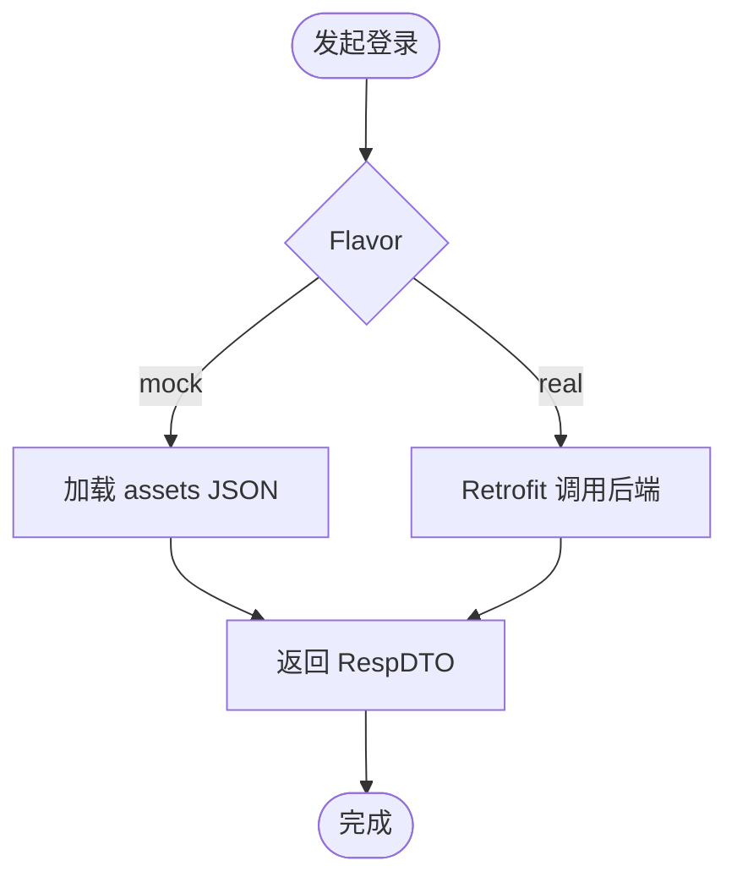
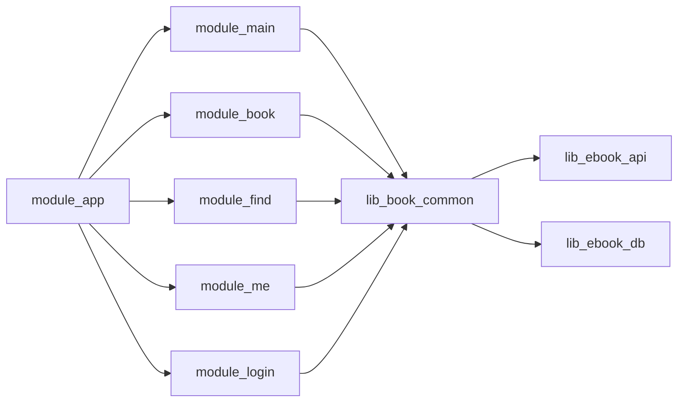

# 多渠道打包

<cite>
**本文引用的文件**
- [settings.gradle.kts](file://settings.gradle.kts)
- [module_app/build.gradle.kts](file://module_app/build.gradle.kts)
- [module_app/src/mock/java/com/ebook/di/NetworkModule.kt](file://module_app/src/mock/java/com/ebook/di/NetworkModule.kt)
- [module_app/src/real/java/com/ebook/di/NetworkModule.kt](file://module_app/src/real/java/com/ebook/di/NetworkModule.kt)
- [lib_ebook_api/src/main/java/com/ebook/api/service/user/UserNetworkTest.kt](file://lib_ebook_api/src/main/java/com/ebook/api/service/user/UserNetworkTest.kt)
- [lib_ebook_api/src/main/java/com/ebook/api/service/user/UserNetwork.kt](file://lib_ebook_api/src/main/java/com/ebook/api/service/user/UserNetwork.kt)
- [module_main/build.gradle.kts](file://module_main/build.gradle.kts)
- [module_main/src/main/test/debug/MockNetworkModule.kt](file://module_main/src/main/test/debug/MockNetworkModule.kt)
</cite>

## 目录
1. [简介](#简介)
2. [项目结构](#项目结构)
3. [核心组件](#核心组件)
4. [架构总览](#架构总览)
5. [详细组件分析](#详细组件分析)
6. [依赖关系分析](#依赖关系分析)
7. [性能与构建特性](#性能与构建特性)
8. [故障排查指南](#故障排查指南)
9. [结论](#结论)
10. [附录](#附录)

## 简介
本文面向本仓库的多渠道打包能力，聚焦产品变体（flavor）与 source set 的组织方式，说明 mock 与 real 两种网络实现如何切换，以及如何通过 isModule 在独立模块与集成应用之间切换。同时给出新增产品变体的步骤、注意事项以及常见问题定位方法。

## 项目结构
本项目采用多模块 Gradle 工程，根 settings 声明所有子模块；业务入口为 module_app，其下按 flavor 提供不同的网络绑定（mock/real），功能模块通过约定插件支持独立运行与集成运行两种形态。

图示来源
- [settings.gradle.kts:55-65](file://settings.gradle.kts#L55-L65)
- [module_app/build.gradle.kts:17-26](file://module_app/build.gradle.kts#L17-L26)

章节来源
- [settings.gradle.kts:55-65](file://settings.gradle.kts#L55-L65)

## 核心组件
- 产品变体维度：network
  - real：真实后端网络实现
  - mock：内存 Mock 数据源（资产 JSON），无需后端
- Source Set 组织
  - module_app 的 src/mock 与 src/real 分别提供同名 NetworkModule，Hilt 在编译期根据 flavor 选择其一
  - 独立模式（isModule=true）时，功能模块将 src/main/test 并入 main，其中 debug 下的 MockNetworkModule 参与编译以启用 mock
- 网络模块差异
  - mock：UserDataSource → UserNetworkTest（读 assets JSON）
  - real：UserDataSource → UserNetwork（Retrofit 请求后端）

章节来源
- [module_app/build.gradle.kts:17-26](file://module_app/build.gradle.kts#L17-L26)
- [module_app/src/mock/java/com/ebook/di/NetworkModule.kt:14-37](file://module_app/src/mock/java/com/ebook/di/NetworkModule.kt#L14-L37)
- [module_app/src/real/java/com/ebook/di/NetworkModule.kt:14-35](file://module_app/src/real/java/com/ebook/di/NetworkModule.kt#L14-L35)
- [lib_ebook_api/src/main/java/com/ebook/api/service/user/UserNetworkTest.kt:24-95](file://lib_ebook_api/src/main/java/com/ebook/api/service/user/UserNetworkTest.kt#L24-L95)
- [lib_ebook_api/src/main/java/com/ebook/api/service/user/UserNetwork.kt:20-67](file://lib_ebook_api/src/main/java/com/ebook/api/service/user/UserNetwork.kt#L20-L67)

## 架构总览
下图展示从 UI 到数据源的调用链，以及 Hilt 如何通过 flavor 注入不同实现。

图示来源
- [module_app/src/mock/java/com/ebook/di/NetworkModule.kt:26-37](file://module_app/src/mock/java/com/ebook/di/NetworkModule.kt#L26-L37)
- [module_app/src/real/java/com/ebook/di/NetworkModule.kt:24-35](file://module_app/src/real/java/com/ebook/di/NetworkModule.kt#L24-L35)
- [lib_ebook_api/src/main/java/com/ebook/api/service/user/UserNetworkTest.kt:24-95](file://lib_ebook_api/src/main/java/com/ebook/api/service/user/UserNetworkTest.kt#L24-L95)
- [lib_ebook_api/src/main/java/com/ebook/api/service/user/UserNetwork.kt:20-67](file://lib_ebook_api/src/main/java/com/ebook/api/service/user/UserNetwork.kt#L20-L67)

## 详细组件分析

### 产品变体与构建类型
- 维度与变体
  - flavorDimensions 仅包含 network
  - productFlavors 包含 real 与 mock
  - mock 使用 applicationIdSuffix .mock，避免与 real 安装冲突
- 构建类型
  - release 开启混淆，遵循仓库 ADR 的混淆规则

章节来源
- [module_app/build.gradle.kts:17-36](file://module_app/build.gradle.kts#L17-L36)

### Source Set 与模块化
- 集成态（isModule=false）
  - module_app 依赖各功能模块，构成完整应用
  - flavor 由 module_app 的 src/mock 与 src/real 决定
- 独立态（isModule=true）
  - 约定插件将 src/main/test 作为额外 Kotlin 源码目录并入 main
  - 该 source set 下的 debug/MockNetworkModule 生效，使功能模块可独立运行并默认走 mock

章节来源
- [module_main/build.gradle.kts:10-35](file://module_main/build.gradle.kts#L10-L35)
- [module_main/src/main/test/debug/MockNetworkModule.kt:12-27](file://module_main/src/main/test/debug/MockNetworkModule.kt#L12-L27)

### MockNetworkModule vs RealNetworkModule
- 角色与职责
  - mock 模块：将 UserDataSource/CommentDataSource/ReleaseDataSource 绑定到测试实现（UserNetworkTest/CommentNetworkTest/ReleaseNetworkTest），读取 assets JSON
  - real 模块：将上述接口绑定到真实实现（UserNetwork/CommentNetwork/ReleaseNetwork），通过 Retrofit 访问后端或公开 Releases API
- 互斥性
  - 二者位于同名包的同名类，分属 mock 与 real flavor source set，编译期只保留一个

章节来源
- [module_app/src/mock/java/com/ebook/di/NetworkModule.kt:14-37](file://module_app/src/mock/java/com/ebook/di/NetworkModule.kt#L14-L37)
- [module_app/src/real/java/com/ebook/di/NetworkModule.kt:14-35](file://module_app/src/real/java/com/ebook/di/NetworkModule.kt#L14-L35)

### 网络实现差异与使用场景
- Mock 实现（UserNetworkTest）
  - 从 lib_ebook_api/assets 读取固定 JSON，模拟登录、注册、刷新 token、修改密码等流程
  - 适合离线开发、CI 与回归演练
- Real 实现（UserNetwork）
  - 基于 RetrofitBuilder 创建客户端，调用后端 API
  - 适合联调与发布验证

图示来源
- [lib_ebook_api/src/main/java/com/ebook/api/service/user/UserNetworkTest.kt:24-95](file://lib_ebook_api/src/main/java/com/ebook/api/service/user/UserNetworkTest.kt#L24-L95)
- [lib_ebook_api/src/main/java/com/ebook/api/service/user/UserNetwork.kt:20-67](file://lib_ebook_api/src/main/java/com/ebook/api/service/user/UserNetwork.kt#L20-L67)

### 资源文件替换与 Manifest 差异
- 清单文件
  - 独立态与集成态分别使用不同的 AndroidManifest.xml（src/main/module 与 src/main），需保持 Activity 声明一致
- 资源覆盖
  - 通过 flavor 的 src/mock/res 与 src/real/res 进行资源覆盖（如图标、文案等）
- 注意
  - 两处清单必须同步维护，否则行为不一致

章节来源
- [module_app/build.gradle.kts:17-26](file://module_app/build.gradle.kts#L17-L26)

### 独立模块模式（isModule=true）与集成模式的差异
- 独立模式
  - 功能模块以 application 形式运行，默认走 mock，便于单模块调试
  - 混淆在独立态开启，尽早暴露规则缺口
- 集成模式
  - 功能模块作为 library 被 module_app 聚合，由 module_app 统一执行混淆
  - 通过 flavor 控制整体网络策略

章节来源
- [module_main/build.gradle.kts:10-35](file://module_main/build.gradle.kts#L10-L35)
- [module_app/build.gradle.kts:47-64](file://module_app/build.gradle.kts#L47-L64)

### 新增产品变体的指导
- 步骤
  - 在 module_app/build.gradle.kts 中新增 flavorDimension 与 productFlavors
  - 如需差异化 applicationId，可在对应 flavor 中设置 applicationIdSuffix
  - 若需资源或代码差异，创建对应 flavor 的 source set（如 src/newFlavor/java 与 src/newFlavor/res）
- 注意事项
  - 新增 flavor 后，确保 Hilt 模块、资源、清单等按需覆盖
  - 若涉及网络实现，需在 newFlavor 下提供对应的 NetworkModule 绑定
  - 保持与其他 flavor 的兼容性，避免引入未使用的依赖

[本节为通用指导，不直接分析具体文件]

## 依赖关系分析
- 模块依赖方向
  - 业务模块依赖 lib_book_common，进而依赖 lib_ebook_api 与 lib_ebook_db
  - module_app 在集成态依赖所有功能模块；独立态不依赖其他功能模块
- 构建逻辑
  - flavor 仅影响 module_app 的产物；功能模块通过 isModule 切换运行形态

图示来源
- [settings.gradle.kts:55-65](file://settings.gradle.kts#L55-L65)
- [module_app/build.gradle.kts:47-64](file://module_app/build.gradle.kts#L47-L64)

章节来源
- [settings.gradle.kts:55-65](file://settings.gradle.kts#L55-L65)
- [module_app/build.gradle.kts:47-64](file://module_app/build.gradle.kts#L47-L64)

## 性能与构建特性
- 构建缓存与守护进程
  - 使用 Gradle 守护进程与版本目录管理依赖，提升构建效率
- 混淆与体积
  - release 开启混淆，遵循 ADR 规则；独立态提前暴露问题
- 资源合并
  - flavor 资源按优先级合并，避免重复与冲突

[本节提供通用建议，不直接分析具体文件]

## 故障排查指南
- 现象：install 失败或应用无法启动
  - 检查是否安装了同包名的多个 flavor 导致冲突（确认 applicationIdSuffix 配置正确）
- 现象：页面不闪退但数据永远加载不出来
  - 检查 mock 资产类型是否与接口 T 一致（序列化异常会被上层吞掉）
  - 检查本地后端地址与权限（Android 17+ 对本地网段限制）
- 现象：独立模式路由失效
  - 确认 src/main/test/debug 下有占位路由；重新构建以使 TheRouter 回写 routeMap
- 现象：清单不一致导致行为差异
  - 核对独立态与集成态两份清单的 Activity 声明是否一致

章节来源
- [lib_ebook_api/src/main/java/com/ebook/api/service/user/UserNetworkTest.kt:78-84](file://lib_ebook_api/src/main/java/com/ebook/api/service/user/UserNetworkTest.kt#L78-L84)
- [module_main/src/main/test/debug/MockNetworkModule.kt:12-27](file://module_main/src/main/test/debug/MockNetworkModule.kt#L12-L27)

## 结论
本项目通过 flavor 与 source set 实现了灵活的网络实现切换与模块化运行。mock 与 real 双实现解耦了开发与联调路径；isModule 开关让功能模块既可独立调试又可集成打包。遵循仓库的构建约定与 ADR，可稳定扩展新的产品变体并保持质量。

## 附录
- 常用命令
  - 构建 mock 调试包：./gradlew :module_app:assembleMockDebug
  - 构建 real 调试包：./gradlew :module_app:assembleRealDebug
  - 独立模块调试：临时将 isModule 改为 true，完成后务必改回 false

[本节为操作指引，不直接分析具体文件]