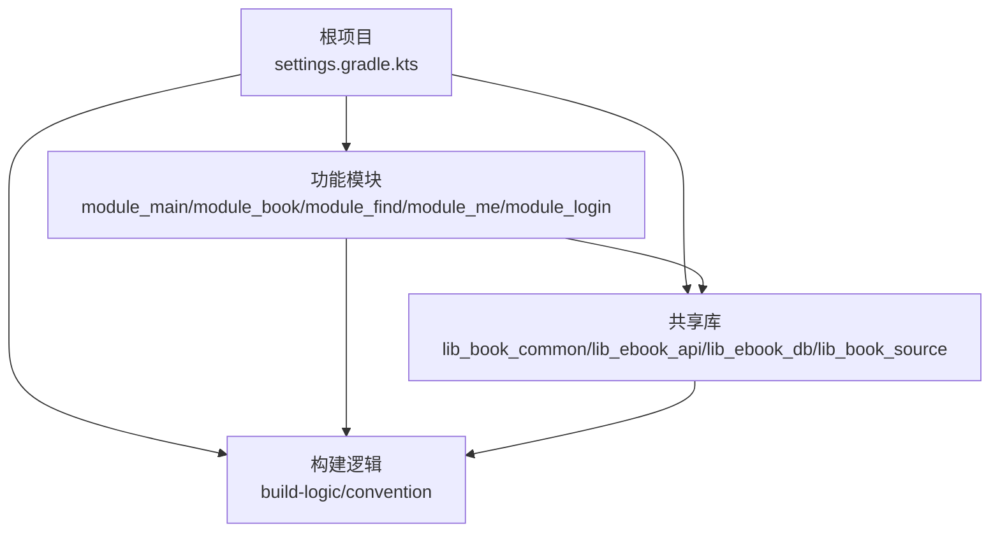
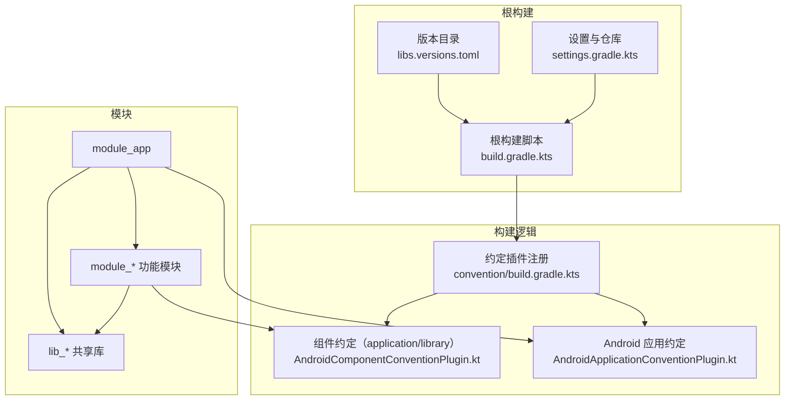
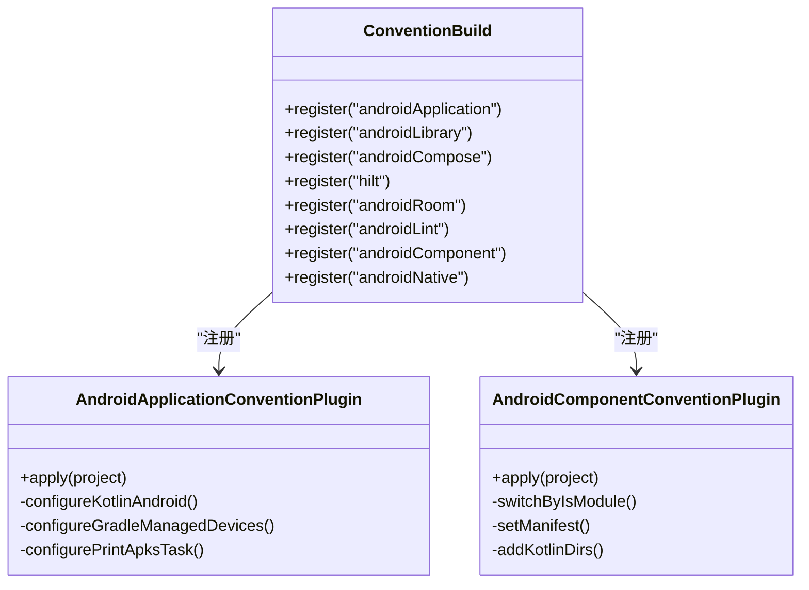
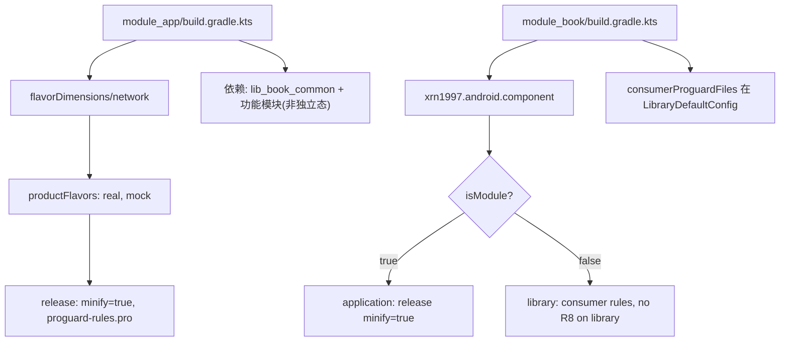
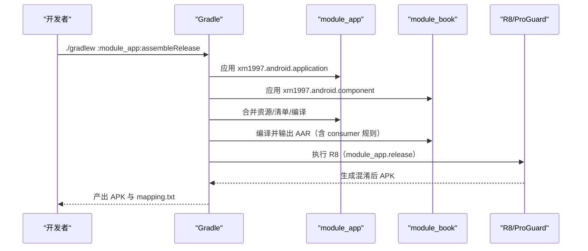
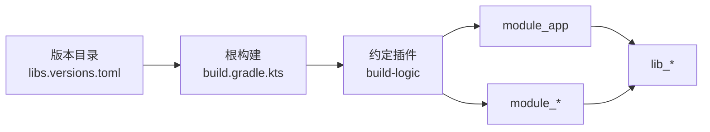

# 构建与部署

<cite>
**本文引用的文件**   
- [settings.gradle.kts](file://settings.gradle.kts)
- [build.gradle.kts](file://build.gradle.kts)
- [gradle/libs.versions.toml](file://gradle/libs.versions.toml)
- [gradle.properties](file://gradle.properties)
- [build-logic/settings.gradle.kts](file://build-logic/settings.gradle.kts)
- [build-logic/convention/build.gradle.kts](file://build-logic/convention/build.gradle.kts)
- [AndroidApplicationConventionPlugin.kt](file://build-logic/convention/src/main/kotlin/AndroidApplicationConventionPlugin.kt)
- [AndroidComponentConventionPlugin.kt](file://build-logic/convention/src/main/kotlin/AndroidComponentConventionPlugin.kt)
- [KotlinAndroid.kt](file://build-logic/convention/src/main/kotlin/com/xrn1997/convention/KotlinAndroid.kt)
- [GradleManagedDevices.kt](file://build-logic/convention/src/main/kotlin/com/xrn1997/convention/GradleManagedDevices.kt)
- [PrintTestApks.kt](file://build-logic/convention/src/main/kotlin/com/xrn1997/convention/PrintTestApks.kt)
- [module_app/build.gradle.kts](file://module_app/build.gradle.kts)
- [module_book/build.gradle.kts](file://module_book/build.gradle.kts)
</cite>

## 目录
1. [简介](#简介)
2. [项目结构](#项目结构)
3. [核心组件](#核心组件)
4. [架构总览](#架构总览)
5. [详细组件分析](#详细组件分析)
6. [依赖分析](#依赖分析)
7. [性能考虑](#性能考虑)
8. [故障排查指南](#故障排查指南)
9. [结论](#结论)
10. [附录](#附录)

## 简介
本文件面向构建系统与发布流程，聚焦 Gradle 构建配置、自定义约定插件、多渠道打包、代码混淆与优化、Release 版本构建流程、持续集成建议以及发布前检查清单。内容基于仓库中的 Gradle 脚本与约定插件实现，提供可操作的步骤与排错指引。

## 项目结构
本项目采用多模块 Android 工程，根项目通过 settings 集中管理模块引入与仓库源；所有依赖版本集中在版本目录；构建逻辑统一下沉到 build-logic 的约定插件中，业务模块仅声明少量必要配置。

**图表来源**
- [settings.gradle.kts:28-65](file://settings.gradle.kts#L28-L65)
- [build-logic/settings.gradle.kts:41-49](file://build-logic/settings.gradle.kts#L41-L49)

**章节来源**
- [settings.gradle.kts:28-65](file://settings.gradle.kts#L28-L65)
- [build-logic/settings.gradle.kts:16-49](file://build-logic/settings.gradle.kts#L16-L49)

## 核心组件
- 根级构建：启用并声明第三方插件，统一仓库源与依赖解析策略。
- 版本目录：集中管理 AGP、Kotlin、Compose、Room、Hilt、Retrofit 等所有依赖版本。
- 约定插件：封装 Android Application/Library/Compose/Lint/Room/Hilt/Native/Component 等通用配置，保证跨模块一致性与可维护性。
- 模块应用：各模块仅声明插件别名、命名空间、基础编译选项与必要依赖，减少重复配置。

**章节来源**
- [build.gradle.kts:1-15](file://build.gradle.kts#L1-L15)
- [gradle/libs.versions.toml:214-237](file://gradle/libs.versions.toml#L214-L237)
- [build-logic/convention/build.gradle.kts:40-78](file://build-logic/convention/build.gradle.kts#L40-L78)
- [module_app/build.gradle.kts:1-46](file://module_app/build.gradle.kts#L1-L46)
- [module_book/build.gradle.kts:1-57](file://module_book/build.gradle.kts#L1-L57)

## 架构总览
下图展示了“根项目—版本目录—约定插件—模块”的整体关系，以及应用入口模块对功能模块的聚合。

**图表来源**
- [build.gradle.kts:1-15](file://build.gradle.kts#L1-L15)
- [gradle/libs.versions.toml:214-237](file://gradle/libs.versions.toml#L214-L237)
- [settings.gradle.kts:28-65](file://settings.gradle.kts#L28-L65)
- [build-logic/convention/build.gradle.kts:40-78](file://build-logic/convention/build.gradle.kts#L40-L78)
- [AndroidApplicationConventionPlugin.kt:28-48](file://AndroidApplicationConventionPlugin.kt#L28-L48)
- [AndroidComponentConventionPlugin.kt:7-34](file://AndroidComponentConventionPlugin.kt#L7-L34)

## 详细组件分析

### 根构建与仓库管理
- 根脚本声明并禁用式应用第三方插件（AGP、Hilt、KSP、Room、TheRouter、Compose 编译器、BaselineProfile、模块图断言等）。
- 使用版本目录中的插件 ID，避免在根脚本硬编码版本号。
- 根设置集中定义仓库源与依赖解析模式，强制子模块不重复声明仓库。

**章节来源**
- [build.gradle.kts:1-15](file://build.gradle.kts#L1-L15)
- [settings.gradle.kts:28-43](file://settings.gradle.kts#L28-L43)

### 版本目录与依赖治理
- 所有依赖以 versions、libraries、bundles、plugins 四段组织，模块通过 alias(libs.plugins.*) 或 libs.* 引用。
- 关键工具链版本：AGP、NDK、Kotlin、Compose BOM、Hilt、Room、Retrofit、OkHttp、JSoup、Coil 等均受控于该文件。
- 插件 ID 与版本统一由版本目录提供，便于全局升级与一致性控制。

**章节来源**
- [gradle/libs.versions.toml:1-71](file://gradle/libs.versions.toml#L1-L71)
- [gradle/libs.versions.toml:75-213](file://gradle/libs.versions.toml#L75-L213)
- [gradle/libs.versions.toml:214-237](file://gradle/libs.versions.toml#L214-L237)

### 约定插件体系
- convention 模块使用 kotlin-dsl 编写，目标 JVM 17，并通过 gradlePlugin 块注册多个约定插件，统一暴露为 xrn1997.* 插件 ID。
- AndroidApplicationConventionPlugin：应用 com.android.application、xrn1997.android.lint，配置 Kotlin、targetSdk、applicationId=namespace、测试动画禁用、Gradle Managed Devices、打印测试 APK 任务。
- AndroidComponentConventionPlugin：根据 isModule 切换 application 或 library 插件，并处理 manifest 与独立态源码目录注入。
- 其他约定（KotlinAndroid、GradleManagedDevices、PrintTestApks 等）封装公共构建细节。

**图表来源**
- [build-logic/convention/build.gradle.kts:40-78](file://build-logic/convention/build.gradle.kts#L40-L78)
- [AndroidApplicationConventionPlugin.kt:28-48](file://AndroidApplicationConventionPlugin.kt#L28-L48)
- [AndroidComponentConventionPlugin.kt:7-34](file://AndroidComponentConventionPlugin.kt#L7-L34)

**章节来源**
- [build-logic/convention/build.gradle.kts:1-78](file://build-logic/convention/build.gradle.kts#L1-L78)
- [AndroidApplicationConventionPlugin.kt:28-48](file://AndroidApplicationConventionPlugin.kt#L28-L48)
- [AndroidComponentConventionPlugin.kt:7-34](file://AndroidComponentConventionPlugin.kt#L7-L34)

### 模块构建配置
- module_app：应用 xrn1997.android.application、ksp、therouter、xrn1997.hilt；定义 flavorDimensions 与 productFlavors（real/mock），release 开启混淆与 proguard-rules.pro；依赖 lib_book_common 与若干功能模块（非独立态）。
- module_book：应用 xrn1997.android.component（按 isModule 切换 application/library）、compose.compiler、ksp、xrn1997.hilt；在 LibraryDefaultConfig 下设置 consumerProguardFiles；release 下 isMinifyEnabled=isModule；测试包含 Robolectric 与 Compose UI 测试相关依赖。

**图表来源**
- [module_app/build.gradle.kts:1-46](file://module_app/build.gradle.kts#L1-L46)
- [module_book/build.gradle.kts:1-57](file://module_book/build.gradle.kts#L1-L57)

**章节来源**
- [module_app/build.gradle.kts:1-46](file://module_app/build.gradle.kts#L1-L46)
- [module_book/build.gradle.kts:1-57](file://module_book/build.gradle.kts#L1-L57)

### 多渠道打包（Product Flavors）
- 维度：network
- 渠道：
  - real：连接真实后端
  - mock：applicationIdSuffix=.mock，用于本地 Mock 数据开发调试
- 产物：assembleRealDebug / assembleMockDebug 等组合任务可按需执行

**章节来源**
- [module_app/build.gradle.kts:17-26](file://module_app/build.gradle.kts#L17-L26)

### 代码混淆与优化（ProGuard/R8）
- module_app.release：启用 isMinifyEnabled=true，使用 getDefaultProguardFile 与模块级 proguard-rules.pro。
- module_book.release：isMinifyEnabled=isModule，即独立态开启 R8 尽早暴露规则缺口；集成态关闭以避免对 library 执行 R8 剥离类。
- consumer 规则：在 LibraryDefaultConfig 中设置 consumerProguardFiles，随 AAR 传播给 module_app 的 R8。
- 注意：混淆映射文件位于 module_app 的 outputs/mapping，崩溃定位需要该文件。

**章节来源**
- [module_app/build.gradle.kts:27-35](file://module_app/build.gradle.kts#L27-L35)
- [module_book/build.gradle.kts:24-35](file://module_book/build.gradle.kts#L24-L35)

### Release 版本构建流程
- 入口：module_app 的 release buildType 启用混淆与规则文件。
- 产物：assembleRelease 生成签名前的 APK；如需签名，需在 module_app 中配置 signingConfigs（本仓库未展示具体签名配置片段）。
- 版本：versionCode 与 versionName 在 module_app defaultConfig 中定义。
- 映射：混淆映射输出到 module_app 的 outputs/mapping，供崩溃分析。

**图表来源**
- [module_app/build.gradle.kts:27-35](file://module_app/build.gradle.kts#L27-L35)
- [module_book/build.gradle.kts:24-35](file://module_book/build.gradle.kts#L24-L35)

**章节来源**
- [module_app/build.gradle.kts:11-35](file://module_app/build.gradle.kts#L11-L35)
- [module_book/build.gradle.kts:19-35](file://module_book/build.gradle.kts#L19-L35)

### 持续集成（CI/CD）建议
- 推荐流水线阶段：
  - 环境准备：拉取 JDK Toolchain、缓存 Gradle Wrapper 与依赖
  - 构建：./gradlew assembleRelease assembleDebug
  - 测试：./gradlew test connectedAndroidTest
  - 质量：./gradlew lint
  - 产物：上传 APK/AAB 与混淆映射
- 说明：仓库未提供 CI 配置文件，以上为通用建议，可按团队平台（GitHub Actions/GitLab CI/Jenkins）落地。

[本节为通用指导，不直接引用具体代码文件]

### 发布前检查清单
- 代码审查：确认依赖变更、权限/清单改动遵循 ADR 与模块边界
- 测试验证：单元测试与插桩测试通过；关键页面手工验证
- 性能测试：启动时间、渲染帧率、内存占用基线对比
- 安全检查：权限最小化、网络白名单、敏感信息清理
- 构建产物：APK/AAB、mapping.txt、变更记录齐全

[本节为通用指导，不直接引用具体代码文件]

## 依赖分析
- 版本集中：所有依赖版本集中于 libs.versions.toml，模块通过 alias 与 libs.* 引用，降低版本漂移风险。
- 插件集中：根脚本与 build-logic 共同管理插件生命周期与版本来源。
- 模块耦合：module_app 聚合功能模块与共享库；功能模块互不依赖，均依赖 lib_book_common。

**图表来源**
- [gradle/libs.versions.toml:214-237](file://gradle/libs.versions.toml#L214-L237)
- [build.gradle.kts:1-15](file://build.gradle.kts#L1-L15)
- [build-logic/convention/build.gradle.kts:40-78](file://build-logic/convention/build.gradle.kts#L40-L78)

**章节来源**
- [gradle/libs.versions.toml:75-213](file://gradle/libs.versions.toml#L75-L213)
- [settings.gradle.kts:28-65](file://settings.gradle.kts#L28-L65)

## 性能考虑
- 构建并行与缓存：启用 Gradle 守护进程与并行构建（gradle.properties 已预留相关参数）；合理配置依赖缓存与构建缓存。
- R8 优化：仅在必要时开启 R8；保持 consumer 规则精简，避免不必要的 -keep/-dontwarn。
- 增量编译：KSP 增量已启用，有助于提升构建速度。
- 测试隔离：单元测试与插桩测试分离，避免不必要的资源加载。

**章节来源**
- [gradle.properties:16-35](file://gradle.properties#L16-L35)
- [module_book/build.gradle.kts:42-47](file://module_book/build.gradle.kts#L42-L47)

## 故障排查指南
- 依赖冲突
  - 现象：同步失败或编译报版本冲突
  - 排查：统一通过版本目录管理，避免在模块内硬编码版本；使用 ./gradlew dependencies 查看依赖树
  - 参考：版本目录与根仓库源配置
- 编译错误
  - 现象：找不到符号或类型不匹配
  - 排查：检查模块是否应用了正确的约定插件；确认 source set 与 manifest 路径；独立态与集成态差异
  - 参考：AndroidComponentConventionPlugin 对 manifest 与源码目录的处理
- 运行时异常
  - 现象：启动崩溃或页面空白
  - 排查：核对混淆映射；检查 consumer 规则是否遗漏；验证 TheRouter 路由表是否重新生成
  - 参考：module_app 的 release 混淆配置与 module_book 的 consumer 规则

**章节来源**
- [AndroidComponentConventionPlugin.kt:7-34](file://AndroidComponentConventionPlugin.kt#L7-L34)
- [module_app/build.gradle.kts:27-35](file://module_app/build.gradle.kts#L27-L35)
- [module_book/build.gradle.kts:19-35](file://module_book/build.gradle.kts#L19-L35)

## 结论
本项目通过根级构建、版本目录与约定插件实现了高度一致的构建体验与可维护性。模块化设计清晰，多渠道与混淆策略明确，Release 流程具备可追溯性。建议在 CI 中固化构建、测试与发布阶段，配合严格的发布前检查清单，保障交付质量。

[本节为总结性内容，不直接引用具体代码文件]

## 附录

### 常用命令
- 构建全部：./gradlew build
- 构建 Debug：./gradlew assembleDebug
- 构建 Release：./gradlew :module_app:assembleRelease
- 单元测试：./gradlew test
- 插桩测试：./gradlew connectedAndroidTest
- Lint 检查：./gradlew lint

**章节来源**
- [README.MD:常用命令段落](file://README.MD)

### 环境变量与属性
- isModule：控制模块独立运行与集成构建
- org.gradle.jvmargs：JVM 内存与 Kotlin daemon 参数
- android.r8.strictFullModeForKeepRules：R8 keep 规则严格模式开关

**章节来源**
- [gradle.properties:16-35](file://gradle.properties#L16-L35)