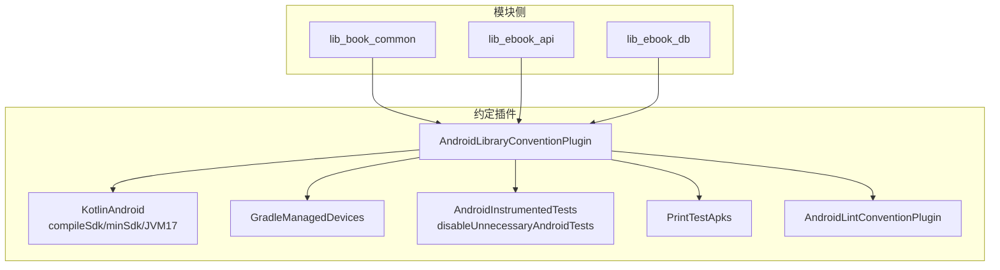
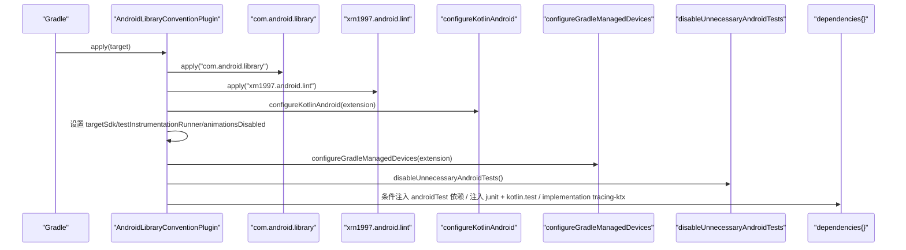
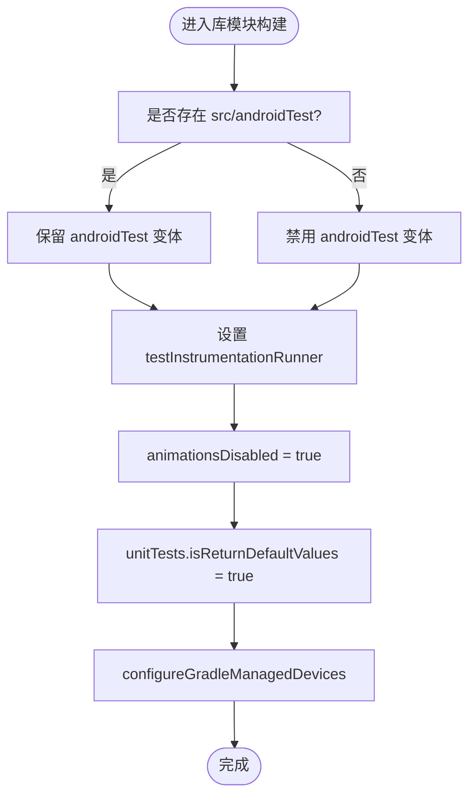
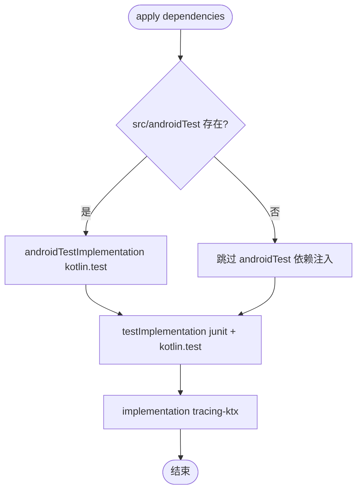
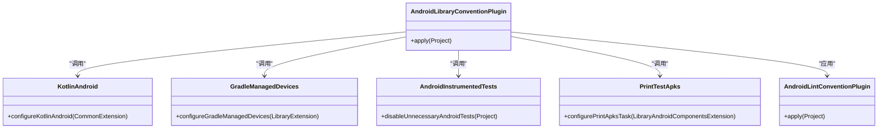

# Android 库模块约定插件

<cite>
**本文引用的文件**
- [AndroidLibraryConventionPlugin.kt](file://build-logic/convention/src/main/kotlin/AndroidLibraryConventionPlugin.kt)
- [AndroidComponentConventionPlugin.kt](file://build-logic/convention/src/main/kotlin/AndroidComponentConventionPlugin.kt)
- [KotlinAndroid.kt](file://build-logic/convention/src/main/kotlin/com/xrn1997/convention/KotlinAndroid.kt)
- [GradleManagedDevices.kt](file://build-logic/convention/src/main/kotlin/com/xrn1997/convention/GradleManagedDevices.kt)
- [AndroidInstrumentedTests.kt](file://build-logic/convention/src/main/kotlin/com/xrn1997/convention/AndroidInstrumentedTests.kt)
- [PrintTestApks.kt](file://build-logic/convention/src/main/kotlin/com/xrn1997/convention/PrintTestApks.kt)
- [AndroidLintConventionPlugin.kt](file://build-logic/convention/src/main/kotlin/AndroidLintConventionPlugin.kt)
- [lib_book_common/build.gradle.kts](file://lib_book_common/build.gradle.kts)
- [lib_ebook_api/build.gradle.kts](file://lib_ebook_api/build.gradle.kts)
- [lib_ebook_db/build.gradle.kts](file://lib_ebook_db/build.gradle.kts)
</cite>

## 目录
1. [简介](#简介)
2. [项目结构](#项目结构)
3. [核心组件](#核心组件)
4. [架构总览](#架构总览)
5. [详细组件分析](#详细组件分析)
6. [依赖关系分析](#依赖关系分析)
7. [性能与构建特性](#性能与构建特性)
8. [故障排查指南](#故障排查指南)
9. [结论](#结论)
10. [附录：使用示例](#附录使用示例)

## 简介
本文件聚焦于 Android 库模块约定插件的落地实践，围绕 AndroidLibraryConventionPlugin 的配置逻辑、依赖注入策略以及测试配置展开。该插件通过统一应用 com.android.library 与 Lint 检查、集中配置 Kotlin/AGP 行为、统一单元测试与插桩测试行为、按需注入测试依赖、并集成 Gradle Managed Devices，为所有共享库模块提供一致的构建基座。文档同时说明条件依赖注入的最佳实践、Tracing KTX 的注入目的，以及在 lib_book_common、lib_ebook_api、lib_ebook_db 等共享库中的应用方式。

## 项目结构
约定插件位于 build-logic 子工程中，以 Kotlin DSL 实现；各业务/共享模块通过 apply plugin 的方式复用统一的 Android 库构建配置。核心文件包括：
- 约定插件入口：AndroidLibraryConventionPlugin.kt
- 组件开关与 source set 管理：AndroidComponentConventionPlugin.kt
- Kotlin/AGP 基础配置：KotlinAndroid.kt
- Gradle Managed Devices：GradleManagedDevices.kt
- 插桩测试禁用与打印任务：AndroidInstrumentedTests.kt、PrintTestApks.kt
- Lint 约定：AndroidLintConventionPlugin.kt

图表来源
- [AndroidLibraryConventionPlugin.kt:31-68](file://build-logic/convention/src/main/kotlin/AndroidLibraryConventionPlugin.kt#L31-L68)
- [KotlinAndroid.kt:34-56](file://build-logic/convention/src/main/kotlin/com/xrn1997/convention/KotlinAndroid.kt#L34-L56)
- [AndroidComponentConventionPlugin.kt:9-34](file://build-logic/convention/src/main/kotlin/AndroidComponentConventionPlugin.kt#L9-L34)

章节来源
- [AndroidLibraryConventionPlugin.kt:31-68](file://build-logic/convention/src/main/kotlin/AndroidLibraryConventionPlugin.kt#L31-L68)
- [AndroidComponentConventionPlugin.kt:9-34](file://build-logic/convention/src/main/kotlin/AndroidComponentConventionPlugin.kt#L9-L34)

## 核心组件
- 自动应用 com.android.library：在库模块中启用 AGP Library 变体，从而获得资源、清单、编译流水线等能力。
- Lint 检查：通过 xrn1997.android.lint 约定插件统一接入 Lint 规则与报告。
- Kotlin/AGP 基础配置：设置 compileSdk、minSdk、JDK 17、core library desugaring、Kotlin JVM 目标与编译器参数。
- 测试配置：
  - unitTests.isReturnDefaultValues = true：纯 JVM 测试中对 android.util.Log 调用返回默认值，避免 mock Log。
  - testInstrumentationRunner：统一使用 AndroidJUnitRunner。
  - animationsDisabled = true：关闭动画以加速 UI 相关测试。
- Gradle Managed Devices：统一配置设备运行环境（由 GradleManagedDevices 扩展）。
- 条件依赖注入：仅在存在 androidTest 源码目录时注入 kotlin.test，避免 AGP 警告。
- Tracing KTX：为库模块统一引入 Tracing KTX，便于性能追踪与诊断。

章节来源
- [AndroidLibraryConventionPlugin.kt:31-68](file://build-logic/convention/src/main/kotlin/AndroidLibraryConventionPlugin.kt#L31-L68)
- [KotlinAndroid.kt:34-56](file://build-logic/convention/src/main/kotlin/com/xrn1997/convention/KotlinAndroid.kt#L34-L56)

## 架构总览
AndroidLibraryConventionPlugin 作为库模块的“构建基座”，将 AGP、Kotlin、测试、Lint、GMD 等横切关注点收敛到一处，确保所有共享库模块拥有一致的构建行为。其关键流程如下：

图表来源
- [AndroidLibraryConventionPlugin.kt:31-68](file://build-logic/convention/src/main/kotlin/AndroidLibraryConventionPlugin.kt#L31-L68)
- [KotlinAndroid.kt:34-56](file://build-logic/convention/src/main/kotlin/com/xrn1997/convention/KotlinAndroid.kt#L34-L56)
- [GradleManagedDevices.kt](file://build-logic/convention/src/main/kotlin/com/xrn1997/convention/GradleManagedDevices.kt)
- [AndroidInstrumentedTests.kt](file://build-logic/convention/src/main/kotlin/com/xrn1997/convention/AndroidInstrumentedTests.kt)

## 详细组件分析

### 自动应用 com.android.library 与 Lint 检查
- 自动应用 com.android.library：使模块具备 Android Library 构建能力，包含资源处理、清单合并、产物生成等。
- Lint 检查：通过 xrn1997.android.lint 统一接入，保证跨模块代码质量一致。

章节来源
- [AndroidLibraryConventionPlugin.kt:35-36](file://build-logic/convention/src/main/kotlin/AndroidLibraryConventionPlugin.kt#L35-L36)
- [AndroidLintConventionPlugin.kt](file://build-logic/convention/src/main/kotlin/AndroidLintConventionPlugin.kt)

### Kotlin/AGP 基础配置（configureKotlinAndroid）
- compileSdk 与 minSdk：固定版本以确保一致性。
- JDK 17 与 core library desugaring：提升语言与 API 支持面。
- Kotlin 编译器选项：JVM 目标、警告策略、协程实验性 API 开关等。

章节来源
- [KotlinAndroid.kt:34-56](file://build-logic/convention/src/main/kotlin/com/xrn1997/convention/KotlinAndroid.kt#L34-L56)
- [KotlinAndroid.kt:73-91](file://build-logic/convention/src/main/kotlin/com/xrn1997/convention/KotlinAndroid.kt#L73-L91)

### 测试相关配置
- unitTests.isReturnDefaultValues = true：对纯 JVM 测试生效，android.util.Log 调用返回默认值，无需 mock Logger。
- testInstrumentationRunner：统一 AndroidJUnitRunner，便于插桩测试执行。
- animationsDisabled = true：关闭动画以提升 UI 测试稳定性与速度。
- Gradle Managed Devices：统一设备配置，减少本地环境差异。
- 禁用不必要的 Android 测试：当不存在 androidTest 源码目录时，自动禁用以避免无意义的构建阶段。

图表来源
- [AndroidLibraryConventionPlugin.kt:38-46](file://build-logic/convention/src/main/kotlin/AndroidLibraryConventionPlugin.kt#L38-L46)
- [AndroidInstrumentedTests.kt](file://build-logic/convention/src/main/kotlin/com/xrn1997/convention/AndroidInstrumentedTests.kt)
- [GradleManagedDevices.kt](file://build-logic/convention/src/main/kotlin/com/xrn1997/convention/GradleManagedDevices.kt)

章节来源
- [AndroidLibraryConventionPlugin.kt:38-46](file://build-logic/convention/src/main/kotlin/AndroidLibraryConventionPlugin.kt#L38-L46)
- [AndroidInstrumentedTests.kt](file://build-logic/convention/src/main/kotlin/com/xrn1997/convention/AndroidInstrumentedTests.kt)
- [GradleManagedDevices.kt](file://build-logic/convention/src/main/kotlin/com/xrn1997/convention/GradleManagedDevices.kt)

### 条件依赖注入逻辑
- 仅当存在 androidTest 源码目录时才注入 kotlin.test 到 androidTestImplementation，避免触发 AGP 的“androidTest 被禁用”的警告。
- 单元测试始终注入 junit 与 kotlin.test，保障纯 JVM 测试可用性。
- 所有库模块统一 implementation 引入 androidx.tracing.ktx，用于性能追踪与问题定位。

图表来源
- [AndroidLibraryConventionPlugin.kt:55-66](file://build-logic/convention/src/main/kotlin/AndroidLibraryConventionPlugin.kt#L55-L66)

章节来源
- [AndroidLibraryConventionPlugin.kt:55-66](file://build-logic/convention/src/main/kotlin/AndroidLibraryConventionPlugin.kt#L55-L66)

### resourcePrefix 配置的注释原因
- 代码中存在 resourcePrefix 的行已被注释，原因是资源前缀通常根据模块名动态派生；若强制设置需与模块路径/命名强绑定，易造成维护成本。当前仓库选择以注释形式保留该思路，但不启用。

章节来源
- [AndroidLibraryConventionPlugin.kt:47-49](file://build-logic/convention/src/main/kotlin/AndroidLibraryConventionPlugin.kt#L47-L49)

### 组件模式切换与 Manifest 选择
- AndroidComponentConventionPlugin 根据 isModule 属性决定应用 application 或 library 约定插件，并切换 main 的 manifest 源集：
  - isModule=true：应用 application 约定、使用 module/AndroidManifest.xml、并将 src/main/test 加入 Kotlin 源码目录（独立运行态）。
  - isModule=false：应用 library 约定、使用标准 AndroidManifest.xml（集成态）。

章节来源
- [AndroidComponentConventionPlugin.kt:9-34](file://build-logic/convention/src/main/kotlin/AndroidComponentConventionPlugin.kt#L9-L34)

## 依赖关系分析
- 插件内部依赖：
  - KotlinAndroid：提供 compileSdk/minSdk/JDK17 等基础配置。
  - GradleManagedDevices：统一 GMD 设备配置。
  - AndroidInstrumentedTests：按是否有 androidTest 目录决定是否禁用 androidTest 变体。
  - PrintTestApks：打印测试 APK 信息（由 LibraryAndroidComponentsExtension 钩入）。
  - Lint 约定：统一 Lint 规则与报告。
- 模块侧依赖：
  - lib_book_common、lib_ebook_api、lib_ebook_db 均通过应用 xrn1997.android.library 复用上述约定。

图表来源
- [AndroidLibraryConventionPlugin.kt:31-68](file://build-logic/convention/src/main/kotlin/AndroidLibraryConventionPlugin.kt#L31-L68)
- [KotlinAndroid.kt:34-56](file://build-logic/convention/src/main/kotlin/com/xrn1997/convention/KotlinAndroid.kt#L34-L56)
- [GradleManagedDevices.kt](file://build-logic/convention/src/main/kotlin/com/xrn1997/convention/GradleManagedDevices.kt)
- [AndroidInstrumentedTests.kt](file://build-logic/convention/src/main/kotlin/com/xrn1997/convention/AndroidInstrumentedTests.kt)
- [PrintTestApks.kt](file://build-logic/convention/src/main/kotlin/com/xrn1997/convention/PrintTestApks.kt)
- [AndroidLintConventionPlugin.kt](file://build-logic/convention/src/main/kotlin/AndroidLintConventionPlugin.kt)

章节来源
- [AndroidLibraryConventionPlugin.kt:31-68](file://build-logic/convention/src/main/kotlin/AndroidLibraryConventionPlugin.kt#L31-L68)

## 性能与构建特性
- 单元测试更快更稳定：
  - unitTests.isReturnDefaultValues = true：避免在纯 JVM 测试中因 android.util.Log 导致的异常或额外开销。
  - animationsDisabled = true：关闭 UI 动画，减少 UI 测试的不确定性。
- 统一设备执行：Gradle Managed Devices 屏蔽本地设备差异，提升 CI 稳定性。
- 按需注入依赖：条件注入 androidTest 依赖，避免无用依赖与警告，缩短构建时间。
- Tracing KTX：统一引入 Tracing KTX，便于在各库模块中插入性能埋点，辅助性能分析与问题定位。

[本节为通用指导，不直接分析具体文件]

## 故障排查指南
- AGP 警告：“androidTestImplementation dependencies are ignored because androidTest is disabled”
  - 现象：未定义 androidTest 却注入了 androidTest 依赖。
  - 解决：保持现有条件注入逻辑（仅当 src/androidTest 存在才注入），或在模块内删除多余的 androidTest 依赖声明。
  - 依据：见插件中的条件判断与注释说明。
- 单元测试中 Log 输出异常
  - 现象：单元测试抛异常或无法输出日志。
  - 解决：确认已启用 unitTests.isReturnDefaultValues = true，避免在纯 JVM 测试中依赖 Android 框架。
- 插桩测试无法运行
  - 现象：connectedAndroidTest 失败。
  - 解决：检查是否启用了 androidTest 源码目录；若无，则会被自动禁用；若有，检查 testInstrumentationRunner 是否正确设置为 AndroidJUnitRunner。
- 资源冲突或命名不规范
  - 建议：遵循资源命名规范，必要时可参考 resourcePrefix 的思路进行约束（当前仓库选择注释掉，保持灵活）。

章节来源
- [AndroidLibraryConventionPlugin.kt:41-45](file://build-logic/convention/src/main/kotlin/AndroidLibraryConventionPlugin.kt#L41-L45)
- [AndroidLibraryConventionPlugin.kt:55-61](file://build-logic/convention/src/main/kotlin/AndroidLibraryConventionPlugin.kt#L55-L61)

## 结论
AndroidLibraryConventionPlugin 通过集中化配置与条件化依赖注入，为 Android 库模块提供了稳定、一致且高效的构建基座。它自动应用 com.android.library 与 Lint，统一 Kotlin/AGP 基础配置，规范化测试行为，并在必要时注入测试依赖与 Tracing KTX。配合 AndroidComponentConventionPlugin 的模块开关机制，既满足集成态的统一约束，又兼顾独立开发态的灵活性。建议在所有共享库模块中沿用此约定，以保证跨模块构建的一致性与可维护性。

[本节为总结，不直接分析具体文件]

## 附录：使用示例
以下共享库模块均通过应用约定插件获得统一构建行为：
- lib_book_common：应用 xrn1997.android.library，获得统一的 Kotlin/AGP、测试、Lint 与依赖注入。
- lib_ebook_api：同上，统一网络层库的构建与测试体验。
- lib_ebook_db：同上，统一数据库层的构建与测试体验。

各模块在其 build.gradle.kts 中应用约定插件后，即可享受：
- 自动应用 com.android.library 与 Lint
- 统一的 Kotlin/AGP 基础配置
- 统一的测试配置与设备管理
- 条件化的测试依赖注入
- 统一的 Tracing KTX 引入

章节来源
- [lib_book_common/build.gradle.kts](file://lib_book_common/build.gradle.kts)
- [lib_ebook_api/build.gradle.kts](file://lib_ebook_api/build.gradle.kts)
- [lib_ebook_db/build.gradle.kts](file://lib_ebook_db/build.gradle.kts)