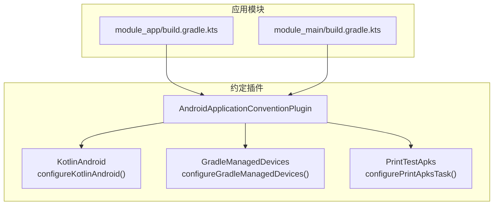
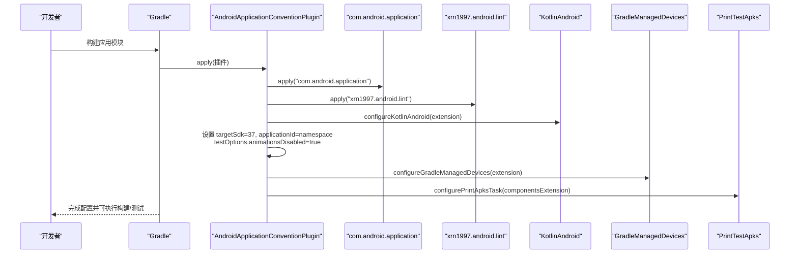
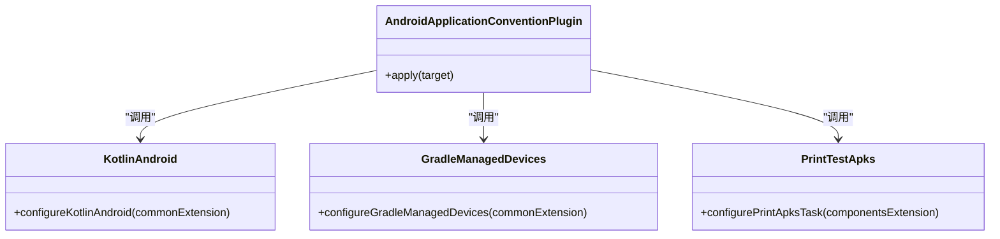
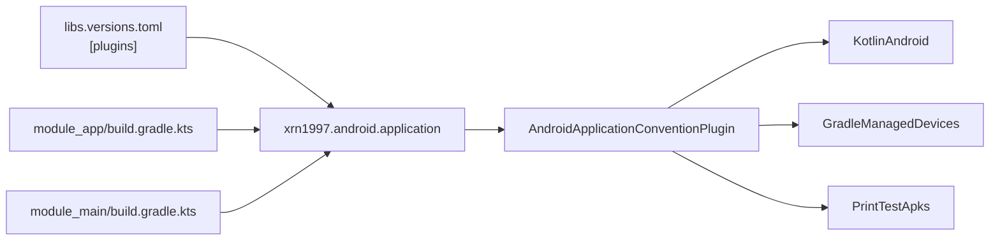

# Android 应用模块约定插件

<cite>
**本文引用的文件**
- [AndroidApplicationConventionPlugin.kt](file://build-logic/convention/src/main/kotlin/AndroidApplicationConventionPlugin.kt)
- [KotlinAndroid.kt](file://build-logic/convention/src/main/kotlin/com/xrn1997/convention/KotlinAndroid.kt)
- [GradleManagedDevices.kt](file://build-logic/convention/src/main/kotlin/com/xrn1997/convention/GradleManagedDevices.kt)
- [PrintTestApks.kt](file://build-logic/convention/src/main/kotlin/com/xrn1997/convention/PrintTestApks.kt)
- [module_app/build.gradle.kts](file://module_app/build.gradle.kts)
- [module_main/build.gradle.kts](file://module_main/build.gradle.kts)
- [libs.versions.toml](file://gradle/libs.versions.toml)
- [0002-agp-built-in-kotlin.md](file://docs/adr/0002-agp-built-in-kotlin.md)
</cite>

## 目录
1. [简介](#简介)
2. [项目结构](#项目结构)
3. [核心组件](#核心组件)
4. [架构总览](#架构总览)
5. [详细组件分析](#详细组件分析)
6. [依赖关系分析](#依赖关系分析)
7. [性能与构建特性](#性能与构建特性)
8. [常见问题排查](#常见问题排查)
9. [结论](#结论)
10. [附录：使用示例](#附录使用示例)

## 简介
本文件围绕 Android 应用模块约定插件（xrn1997.android.application）的实现与行为展开，重点解释其自动应用的 com.android.application 与 xrn1997.android.lint 插件、默认配置项（targetSdk、applicationId、测试动画禁用等）、Gradle Managed Devices 配置、APK 信息打印任务，以及与 AGP 9 内置 Kotlin 的兼容方式。文末提供在 module_app 及其他应用模块中的使用示例与常见问题排查建议。

## 项目结构
约定插件位于 build-logic/convention 中，通过 Gradle 约定插件机制统一为所有 Android 应用模块注入一致的构建配置与工具链设置。相关实现集中在以下文件：
- 应用模块约定插件入口：AndroidApplicationConventionPlugin.kt
- Kotlin/AGP 基础配置：KotlinAndroid.kt
- Gradle Managed Devices：GradleManagedDevices.kt
- 测试 APK 输出任务：PrintTestApks.kt
- 版本与插件声明：libs.versions.toml
- 应用模块使用示例：module_app/build.gradle.kts、module_main/build.gradle.kts
- AGP 9 内置 Kotlin 决策记录：0002-agp-built-in-kotlin.md

图示来源
- [AndroidApplicationConventionPlugin.kt:28-48](file://build-logic/convention/src/main/kotlin/AndroidApplicationConventionPlugin.kt#L28-L48)
- [KotlinAndroid.kt:34-56](file://build-logic/convention/src/main/kotlin/com/xrn1997/convention/KotlinAndroid.kt#L34-L56)
- [GradleManagedDevices.kt:27-57](file://build-logic/convention/src/main/kotlin/com/xrn1997/convention/GradleManagedDevices.kt#L27-L57)
- [PrintTestApks.kt:40-68](file://build-logic/convention/src/main/kotlin/com/xrn1997/convention/PrintTestApks.kt#L40-L68)
- [module_app/build.gradle.kts:1-8](file://module_app/build.gradle.kts#L1-L8)
- [module_main/build.gradle.kts:1-9](file://module_main/build.gradle.kts#L1-L9)

章节来源
- [AndroidApplicationConventionPlugin.kt:28-48](file://build-logic/convention/src/main/kotlin/AndroidApplicationConventionPlugin.kt#L28-L48)
- [libs.versions.toml:214-237](file://gradle/libs.versions.toml#L214-L237)

## 核心组件
- AndroidApplicationConventionPlugin：应用模块约定的总入口，负责加载 com.android.application、xrn1997.android.lint，并统一配置 Kotlin、targetSdk、applicationId、测试选项、Gradle Managed Devices 以及测试 APK 输出任务。
- KotlinAndroid.configureKotlinAndroid：集中设置 compileSdk、minSdk、Java/Kotlin 目标版本、Desugar 支持等。
- GradleManagedDevices.configureGradleManagedDevices：定义一组设备与 CI 设备组，便于执行仪器化测试。
- PrintTestApks.configurePrintApksTask：为包含 androidTest 的变体注册任务，打印生成的测试 APK 路径，辅助调试。

章节来源
- [AndroidApplicationConventionPlugin.kt:28-48](file://build-logic/convention/src/main/kotlin/AndroidApplicationConventionPlugin.kt#L28-L48)
- [KotlinAndroid.kt:34-56](file://build-logic/convention/src/main/kotlin/com/xrn1997/convention/KotlinAndroid.kt#L34-L56)
- [GradleManagedDevices.kt:27-57](file://build-logic/convention/src/main/kotlin/com/xrn1997/convention/GradleManagedDevices.kt#L27-L57)
- [PrintTestApks.kt:40-68](file://build-logic/convention/src/main/kotlin/com/xrn1997/convention/PrintTestApks.kt#L40-L68)

## 架构总览
约定插件以“单一职责”的方式将 Android 模块的通用构建逻辑内聚，并在应用模块通过插件 ID 引用后自动生效，减少重复配置与差异。

图示来源
- [AndroidApplicationConventionPlugin.kt:28-48](file://build-logic/convention/src/main/kotlin/AndroidApplicationConventionPlugin.kt#L28-L48)
- [KotlinAndroid.kt:34-56](file://build-logic/convention/src/main/kotlin/com/xrn1997/convention/KotlinAndroid.kt#L34-L56)
- [GradleManagedDevices.kt:27-57](file://build-logic/convention/src/main/kotlin/com/xrn1997/convention/GradleManagedDevices.kt#L27-L57)
- [PrintTestApks.kt:40-68](file://build-logic/convention/src/main/kotlin/com/xrn1997/convention/PrintTestApks.kt#L40-L68)

## 详细组件分析

### AndroidApplicationConventionPlugin 实现要点
- 自动应用插件
  - com.android.application：启用 Android 应用构建管线。
  - xrn1997.android.lint：启用统一的 lint 检查能力（由仓库约定插件提供）。
- 默认配置
  - targetSdk = 37：统一目标 API 级别，确保在新系统上的行为一致。
  - applicationId = namespace：默认让应用包名等于命名空间，避免不一致导致的混淆或安装冲突；若业务需要覆盖，可在模块 build.gradle.kts 中显式设置 applicationId。
  - testOptions.animationsDisabled = true：禁用测试动画，加速 UI 自动化测试，减少时序抖动。
- Gradle Managed Devices
  - 调用 configureGradleManagedDevices，预设若干虚拟设备与 CI 分组，便于本地与 CI 执行仪器化测试。
- 测试 APK 输出
  - 调用 configurePrintApksTask，为含 androidTest 的变体注册打印任务，构建后输出测试 APK 路径，方便定位产物。

章节来源
- [AndroidApplicationConventionPlugin.kt:28-48](file://build-logic/convention/src/main/kotlin/AndroidApplicationConventionPlugin.kt#L28-L48)

#### 类图（概念映射到源码）

图示来源
- [AndroidApplicationConventionPlugin.kt:28-48](file://build-logic/convention/src/main/kotlin/AndroidApplicationConventionPlugin.kt#L28-L48)
- [KotlinAndroid.kt:34-56](file://build-logic/convention/src/main/kotlin/com/xrn1997/convention/KotlinAndroid.kt#L34-L56)
- [GradleManagedDevices.kt:27-57](file://build-logic/convention/src/main/kotlin/com/xrn1997/convention/GradleManagedDevices.kt#L27-L57)
- [PrintTestApks.kt:40-68](file://build-logic/convention/src/main/kotlin/com/xrn1997/convention/PrintTestApks.kt#L40-L68)

### KotlinAndroid.configureKotlinAndroid
- compileSdk/minSdk：统一编译与最低支持版本。
- Java/Kotlin 目标：JVM 17，启用 coreLibraryDesugaring。
- 与 AGP 9 内置 Kotlin 的兼容：不再需要单独应用 org.jetbrains.kotlin.android；顶层 kotlin {} 块仍可用，编译器选项集中在此处管理。

章节来源
- [KotlinAndroid.kt:34-56](file://build-logic/convention/src/main/kotlin/com/xrn1997/convention/KotlinAndroid.kt#L34-L56)
- [0002-agp-built-in-kotlin.md:1-17](file://docs/adr/0002-agp-built-in-kotlin.md#L1-L17)

### GradleManagedDevices.configureGradleManagedDevices
- 定义一组常用设备（Pixel 4/6/C）及 CI 分组，便于：
  - 本地快速执行仪器化测试；
  - 在 CI 中以固定设备矩阵运行测试，提升稳定性与可复现性。
- 效果：生成对应的 managed device 任务，可直接执行特定设备的 connectedAndroidTest。

章节来源
- [GradleManagedDevices.kt:27-57](file://build-logic/convention/src/main/kotlin/com/xrn1997/convention/GradleManagedDevices.kt#L27-L57)

### PrintTestApks.configurePrintApksTask
- 作用：为每个包含 androidTest 的变体注册一个打印任务，构建完成后输出测试 APK 的路径。
- 影响：
  - 当存在 androidTest 源码时才会打印；
  - 便于调试时快速定位产物位置，缩短定位问题的时间。

章节来源
- [PrintTestApks.kt:40-68](file://build-logic/convention/src/main/kotlin/com/xrn1997/convention/PrintTestApks.kt#L40-L68)

### 与 AGP 9 内置 Kotlin 的兼容性
- 约定插件不再应用 org.jetbrains.kotlin.android，Kotlin 支持由 AGP 9 内置提供；
- 各模块顶层 kotlin { compilerOptions {} } 块仍可用，用于统一 JVM 目标、警告策略等；
- 这简化了插件组合，避免了旧 DSL 与弃用开关带来的维护成本。

章节来源
- [AndroidApplicationConventionPlugin.kt:28-48](file://build-logic/convention/src/main/kotlin/AndroidApplicationConventionPlugin.kt#L28-L48)
- [0002-agp-built-in-kotlin.md:1-17](file://docs/adr/0002-agp-built-in-kotlin.md#L1-L17)

## 依赖关系分析
- 插件 ID 由版本目录统一管理，应用模块通过 alias 引用约定插件；
- AndroidApplicationConventionPlugin 依赖约定库中的工具函数，形成松耦合的扩展点。

图示来源
- [libs.versions.toml:214-237](file://gradle/libs.versions.toml#L214-L237)
- [module_app/build.gradle.kts:1-8](file://module_app/build.gradle.kts#L1-L8)
- [module_main/build.gradle.kts:1-9](file://module_main/build.gradle.kts#L1-L9)
- [AndroidApplicationConventionPlugin.kt:28-48](file://build-logic/convention/src/main/kotlin/AndroidApplicationConventionPlugin.kt#L28-L48)

章节来源
- [libs.versions.toml:214-237](file://gradle/libs.versions.toml#L214-L237)

## 性能与构建特性
- targetSdk 37：统一平台目标，利于在新系统上获得一致的权限、网络、前台服务等行为。
- testOptions.animationsDisabled = true：关闭测试动画，减少 UI 测试耗时与不稳定因素。
- Gradle Managed Devices：标准化设备矩阵，有助于在 CI 中稳定地执行仪器化测试。
- 打印测试 APK：快速定位产物，提高调试效率。

[本节为通用指导，不直接分析具体代码文件]

## 常见问题排查

- applicationId 与 namespace 不一致
  - 约定插件默认将 applicationId 设置为 namespace。若业务需要在 flavor 或 buildType 中覆盖 applicationId，请在模块 build.gradle.kts 中显式设置。注意不同 flavor 的 applicationIdSuffix 可能产生最终包名变化，需确保安装与更新策略符合预期。
  - 参考：模块 app 的 build.gradle.kts 中对 applicationId 与 flavor 的设置。

- 测试动画禁用的影响范围
  - animationsDisabled 仅作用于测试环境（androidTest），不影响正常运行的应用行为。它主要消除 UI 动画对测试时序的影响，加快用例执行速度。

- 找不到测试 APK 路径
  - 只有当变体包含 androidTest 源码时才会注册打印任务；若无 androidTest 源码，不会输出路径。请确认已添加测试源集并重新构建。

- 为什么不再应用 org.jetbrains.kotlin.android
  - AGP 9 起 Kotlin 支持内置，无需再应用 KGP Android 插件。顶层 kotlin {} 块仍可配置编译器选项。此举减少插件数量与告警，简化构建脚本。

章节来源
- [module_app/build.gradle.kts:9-26](file://module_app/build.gradle.kts#L9-L26)
- [AndroidApplicationConventionPlugin.kt:36-43](file://build-logic/convention/src/main/kotlin/AndroidApplicationConventionPlugin.kt#L36-L43)
- [PrintTestApks.kt:40-68](file://build-logic/convention/src/main/kotlin/com/xrn1997/convention/PrintTestApks.kt#L40-L68)
- [0002-agp-built-in-kotlin.md:1-17](file://docs/adr/0002-agp-built-in-kotlin.md#L1-L17)

## 结论
AndroidApplicationConventionPlugin 将 Android 应用模块的通用构建配置收敛到约定插件中，通过自动应用 com.android.application 与 xrn1997.android.lint，并提供 targetSdk、applicationId、测试选项、Gradle Managed Devices 与测试 APK 打印等能力，使各应用模块保持一致的构建体验。配合 AGP 9 内置 Kotlin，进一步简化了插件组合与维护成本。

[本节为总结，不直接分析具体代码文件]

## 附录：使用示例

- 在 module_app 中使用约定插件
  - 在模块的 build.gradle.kts 中通过插件 ID 引用约定插件，并设置 namespace、defaultConfig、flavors 等。
  - 示例路径：[module_app/build.gradle.kts:1-8](file://module_app/build.gradle.kts#L1-L8)、[module_app/build.gradle.kts:9-26](file://module_app/build.gradle.kts#L9-L26)

- 在其他应用模块中使用
  - 同样通过约定插件引入统一的 Android 应用配置，保持多模块一致性。
  - 示例路径：[module_main/build.gradle.kts:1-9](file://module_main/build.gradle.kts#L1-L9)

- 版本与插件声明
  - 约定插件 ID 与版本通过 libs.versions.toml 管理，避免散落的版本号。
  - 示例路径：[libs.versions.toml:214-237](file://gradle/libs.versions.toml#L214-L237)