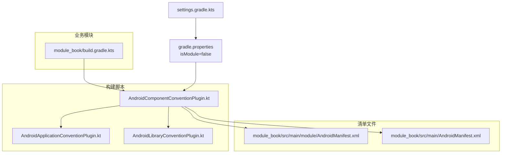
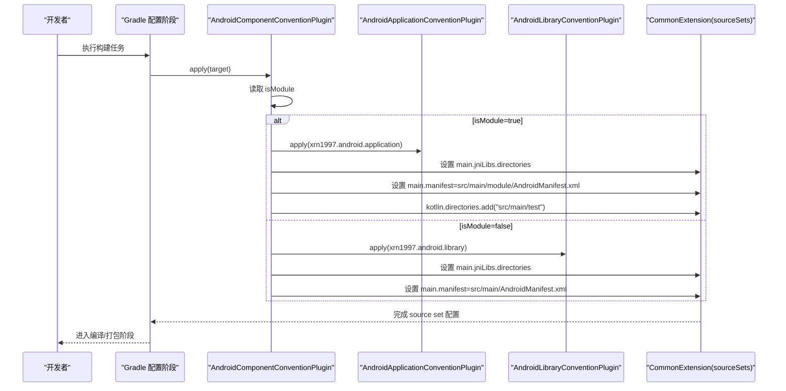
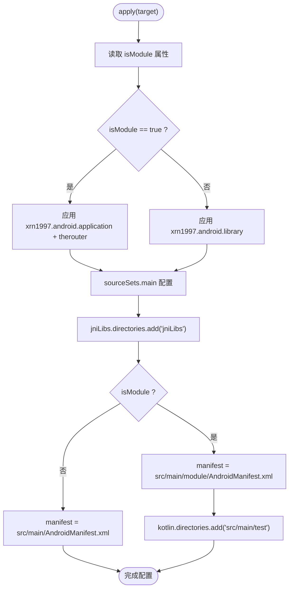
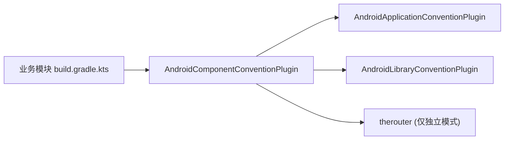

# Android 组件化约定插件

<cite>
**本文引用的文件**
- [AndroidComponentConventionPlugin.kt](file://build-logic/convention/src/main/kotlin/AndroidComponentConventionPlugin.kt)
- [AndroidApplicationConventionPlugin.kt](file://build-logic/convention/src/main/kotlin/AndroidApplicationConventionPlugin.kt)
- [AndroidLibraryConventionPlugin.kt](file://build-logic/convention/src/main/kotlin/AndroidLibraryConventionPlugin.kt)
- [module_book/build.gradle.kts](file://module_book/build.gradle.kts)
- [gradle.properties](file://gradle.properties)
- [settings.gradle.kts](file://settings.gradle.kts)
- [module_book/src/main/module/AndroidManifest.xml](file://module_book/src/main/module/AndroidManifest.xml)
- [module_book/src/main/AndroidManifest.xml](file://module_book/src/main/AndroidManifest.xml)
</cite>

## 目录
1. [简介](#简介)
2. [项目结构](#项目结构)
3. [核心组件](#核心组件)
4. [架构总览](#架构总览)
5. [详细组件分析](#详细组件分析)
6. [依赖关系分析](#依赖关系分析)
7. [性能与构建特性](#性能与构建特性)
8. [故障排查指南](#故障排查指南)
9. [结论](#结论)

## 简介
本文件围绕 Android 组件化约定插件，系统性说明 AndroidComponentConventionPlugin 如何以 isModule 属性为开关，统一抽象“模块独立运行”和“集成构建”两种形态。重点覆盖：
- isModule 的读取与分支逻辑
- Manifest 选择机制（独立模式 vs 集成模式）及同步维护要求
- AGP 9 新 DSL 下 jniLibs 与 sourceSets 的配置方式
- kotlin.directories.add("src/main/test") 的原因、KSP 与 Kotlin 编译任务的差异
- 组件化开发工作流（切换 isModule、跨模块路由限制）
- 常见陷阱与规避方法

## 项目结构
仓库通过 build-logic 提供统一的 Gradle 约定插件，功能模块在各自的 build.gradle.kts 中通过别名应用 xrn1997.android.component 约定插件。该约定插件根据 isModule 动态决定应用 application 或 library 基线配置，并差异化设置 Manifest、源码集等构建细节。

图表来源
- [AndroidComponentConventionPlugin.kt:7-34](file://build-logic/convention/src/main/kotlin/AndroidComponentConventionPlugin.kt#L7-L34)
- [AndroidApplicationConventionPlugin.kt:28-48](file://build-logic/convention/src/main/kotlin/AndroidApplicationConventionPlugin.kt#L28-L48)
- [AndroidLibraryConventionPlugin.kt:30-69](file://build-logic/convention/src/main/kotlin/AndroidLibraryConventionPlugin.kt#L30-L69)
- [module_book/build.gradle.kts:1-8](file://module_book/build.gradle.kts#L1-L8)
- [gradle.properties:21-29](file://gradle.properties#L21-L29)
- [settings.gradle.kts:1-66](file://settings.gradle.kts#L1-L66)

章节来源
- [AndroidComponentConventionPlugin.kt:7-34](file://build-logic/convention/src/main/kotlin/AndroidComponentConventionPlugin.kt#L7-L34)
- [AndroidApplicationConventionPlugin.kt:28-48](file://build-logic/convention/src/main/kotlin/AndroidApplicationConventionPlugin.kt#L28-L48)
- [AndroidLibraryConventionPlugin.kt:30-69](file://build-logic/convention/src/main/kotlin/AndroidLibraryConventionPlugin.kt#L30-L69)
- [module_book/build.gradle.kts:1-8](file://module_book/build.gradle.kts#L1-L8)
- [gradle.properties:21-29](file://gradle.properties#L21-L29)
- [settings.gradle.kts:1-66](file://settings.gradle.kts#L1-L66)

## 核心组件
- AndroidComponentConventionPlugin：统一入口，按 isModule 分支应用 application/library 约定，并配置 sourceSets 的 manifest 与 jniLibs；独立模式下将 src/main/test 加入 Kotlin 源码目录。
- AndroidApplicationConventionPlugin：application 基线配置（targetSdk、默认 applicationId、测试选项等）。
- AndroidLibraryConventionPlugin：library 基线配置（单元测试支持、测试依赖注入、资源前缀等）。

这些组件共同实现“同一份模块代码，两套构建形态”的抽象，避免在业务模块重复书写构建配置。

章节来源
- [AndroidComponentConventionPlugin.kt:7-34](file://build-logic/convention/src/main/kotlin/AndroidComponentConventionPlugin.kt#L7-L34)
- [AndroidApplicationConventionPlugin.kt:28-48](file://build-logic/convention/src/main/kotlin/AndroidApplicationConventionPlugin.kt#L28-L48)
- [AndroidLibraryConventionPlugin.kt:30-69](file://build-logic/convention/src/main/kotlin/AndroidLibraryConventionPlugin.kt#L30-L69)

## 架构总览
下图展示 AndroidComponentConventionPlugin 在构建期对模块的装配流程：读取 isModule → 应用不同插件 → 配置 CommonExtension.sourceSets.main → 选择 Manifest → 配置 jniLibs → 独立态追加 Kotlin 源码目录。

图表来源
- [AndroidComponentConventionPlugin.kt:7-34](file://build-logic/convention/src/main/kotlin/AndroidComponentConventionPlugin.kt#L7-L34)
- [AndroidApplicationConventionPlugin.kt:28-48](file://build-logic/convention/src/main/kotlin/AndroidApplicationConventionPlugin.kt#L28-L48)
- [AndroidLibraryConventionPlugin.kt:30-69](file://build-logic/convention/src/main/kotlin/AndroidLibraryConventionPlugin.kt#L30-L69)

## 详细组件分析

### AndroidComponentConventionPlugin：isModule 分支与 Manifest 选择
- isModule 读取与分支
  - 从 project 属性读取 isModule，默认 false。
  - true：应用 xrn1997.android.application 与 therouter；false：应用 xrn1997.android.library。
- Manifest 选择
  - 独立模式（isModule=true）：使用 src/main/module/AndroidManifest.xml。
  - 集成模式（isModule=false）：使用 src/main/AndroidManifest.xml。
  - 两份清单是替换关系，必须同步维护权限、Activity/Service 声明与启动属性，否则两种模式行为不一致。
- jniLibs 配置
  - 在 AGP 9 新 DSL 下，通过 extensions.configure<CommonExtension> 访问 sourceSets.main，并使用 jniLibs.directories.add("jniLibs") 添加原生库目录。
- 独立模式 Kotlin 源码目录
  - 通过 kotlin.directories.add("src/main/test") 将独立模式的调试宿主与占位路由纳入 main 源码集参与编译。
  - 原因与影响见下文“为什么不能用 java.srcDirs()”。

图表来源
- [AndroidComponentConventionPlugin.kt:7-34](file://build-logic/convention/src/main/kotlin/AndroidComponentConventionPlugin.kt#L7-L34)

章节来源
- [AndroidComponentConventionPlugin.kt:7-34](file://build-logic/convention/src/main/kotlin/AndroidComponentConventionPlugin.kt#L7-L34)
- [module_book/src/main/module/AndroidManifest.xml:1-108](file://module_book/src/main/module/AndroidManifest.xml#L1-L108)
- [module_book/src/main/AndroidManifest.xml:1-96](file://module_book/src/main/AndroidManifest.xml#L1-L96)

### 为什么独立模式使用 src/main/test 而非 java.srcDirs()
- 背景
  - 独立模式需要在该模块内提供一个可运行的宿主（如 debug MainActivity/TestApplication），并通过 TheRouter 挂出占位路由，用于模拟跨模块跳转。
- 技术约束
  - AGP 9 内置 Kotlin：Kotlin 编译由 AGP 直接管理，不再单独应用 KGP。此时向 Java 编译器暴露源码目录的方式是 kotlin.directories，而不是传统的 java.srcDirs()。
  - KSP 仍可见到 java.srcDirs() 下的源文件，但 Kotlin 编译任务不会将其纳入编译，导致“KSP 生成了代码而 Kotlin 未编译”的错位。
- 结论
  - 独立模式必须用 kotlin.directories.add("src/main/test")，才能确保调试宿主与占位路由被 Kotlin 编译并随 APK 打包。

章节来源
- [AndroidComponentConventionPlugin.kt:18-31](file://build-logic/convention/src/main/kotlin/AndroidComponentConventionPlugin.kt#L18-L31)

### 模块级构建脚本如何使用约定插件
- 模块通过别名引入 xrn1997.android.component 约定插件。
- 模块内部可根据 isModule 控制 consumer-proguard 与 R8 行为：
  - 集成态（library）：仅输出 consumer-rules.pro 给上层合并。
  - 独立态（application）：开启 R8，尽早暴露混淆规则缺口。

章节来源
- [module_book/build.gradle.kts:1-8](file://module_book/build.gradle.kts#L1-L8)
- [module_book/build.gradle.kts:12-34](file://module_book/build.gradle.kts#L12-L34)

## 依赖关系分析
- 约定插件之间的耦合
  - AndroidComponentConventionPlugin 依赖 AndroidApplicationConventionPlugin 与 AndroidLibraryConventionPlugin 提供的基线配置。
  - 两者均复用通用工具（如 configureKotlinAndroid、configureGradleManagedDevices 等）。
- 模块与约定插件的耦合
  - 业务模块仅通过插件别名接入约定，减少重复配置。
- 外部依赖
  - therouter 仅在独立模式应用，用于在独立运行时提供占位路由与宿主。

图表来源
- [AndroidComponentConventionPlugin.kt:12-17](file://build-logic/convention/src/main/kotlin/AndroidComponentConventionPlugin.kt#L12-L17)
- [module_book/build.gradle.kts:1-8](file://module_book/build.gradle.kts#L1-L8)

章节来源
- [AndroidComponentConventionPlugin.kt:12-17](file://build-logic/convention/src/main/kotlin/AndroidComponentConventionPlugin.kt#L12-L17)
- [module_book/build.gradle.kts:1-8](file://module_book/build.gradle.kts#L1-L8)

## 性能与构建特性
- AGP 9 新 DSL
  - 通过 CommonExtension 访问 sourceSets，统一配置 manifest、jniLibs 等，避免多版本兼容问题。
- 独立模式调试
  - 将 src/main/test 作为额外 Kotlin 源码目录，使调试宿主与占位路由参与 main 编译，无需拆分 source set，降低维护成本。
- 混淆与产物
  - 独立态开启 R8，尽早发现规则缺口；集成态关闭 R8 以避免对 library 剥离类导致 module_app 的 R8 找不到依赖。

章节来源
- [AndroidComponentConventionPlugin.kt:18-31](file://build-logic/convention/src/main/kotlin/AndroidComponentConventionPlugin.kt#L18-L31)
- [module_book/build.gradle.kts:24-34](file://module_book/build.gradle.kts#L24-L34)

## 故障排查指南
- isModule 属性设置位置
  - 必须在 gradle.properties 中设置，不要使用命令行 -P 参数覆盖。因为 -P 会渗入 settings.gradle.kts 的 includeBuild，导致 lib_common 也被套上 application 插件，与它的 library 插件冲突。
  - 提交态必须保持 isModule=false，临时调试改为 true，调试完改回。
- 两份 Manifest 不同步
  - 独立模式只生效 src/main/module/AndroidManifest.xml，集成模式只生效 src/main/AndroidManifest.xml。二者是替换关系，权限、Activity/Service 声明、launchMode/theme 等必须同步修改，否则会出现行为差异。
- TheRouter 在独立模式下静默丢失
  - 跨模块路由在独立模块里不存在时，TheRouter 不报错也不闪退，仅记录日志。需要在 src/main/test/debug/ 中以 @Route 挂同名路径占位，保证独立调试可用。
  - 新增/改动 @Route 后，routeMap 资产由 TheRouter transform 回写，当次构建的 APK 仍装旧路由表，需再构建一次才生效。
- 独立模式路由与宿主
  - 独立模式通过 src/main/module/AndroidManifest.xml 指定 Application、MainActivity 等调试宿主，以及占位路由页面，确保独立运行可启动并可模拟跨模块跳转。

章节来源
- [gradle.properties:21-29](file://gradle.properties#L21-L29)
- [settings.gradle.kts:46-53](file://settings.gradle.kts#L46-L53)
- [module_book/src/main/module/AndroidManifest.xml:29-49](file://module_book/src/main/module/AndroidManifest.xml#L29-L49)
- [module_book/src/main/AndroidManifest.xml:29-96](file://module_book/src/main/AndroidManifest.xml#L29-L96)

## 结论
AndroidComponentConventionPlugin 通过 isModule 属性在构建期统一抽象了“独立运行”和“集成构建”两种形态：
- 独立模式：应用 application 基线与 therouter，使用独立的 module 清单，并将 src/main/test 作为 Kotlin 源码目录，便于本地调试与占位路由。
- 集成模式：应用 library 基线，使用标准清单，按库方式参与 module_app 的组装。

遵循以下最佳实践可避免常见陷阱：
- 只在 gradle.properties 中设置 isModule，勿用 -P 覆盖。
- 两份清单严格同步维护，确保权限与组件声明一致。
- 独立模式下为跨模块路由准备占位 @Route，并在变更 routeMap 后二次构建。
- 使用 kotlin.directories 而非 java.srcDirs()，避免 KSP 与 Kotlin 编译任务错位。