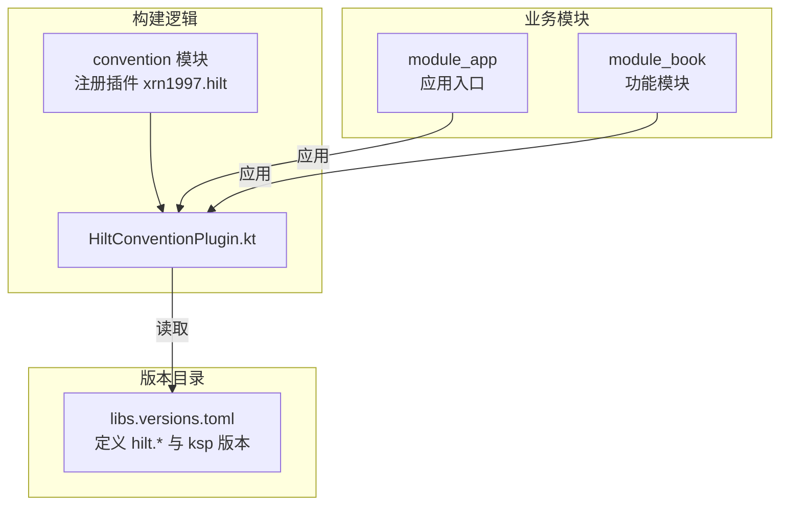
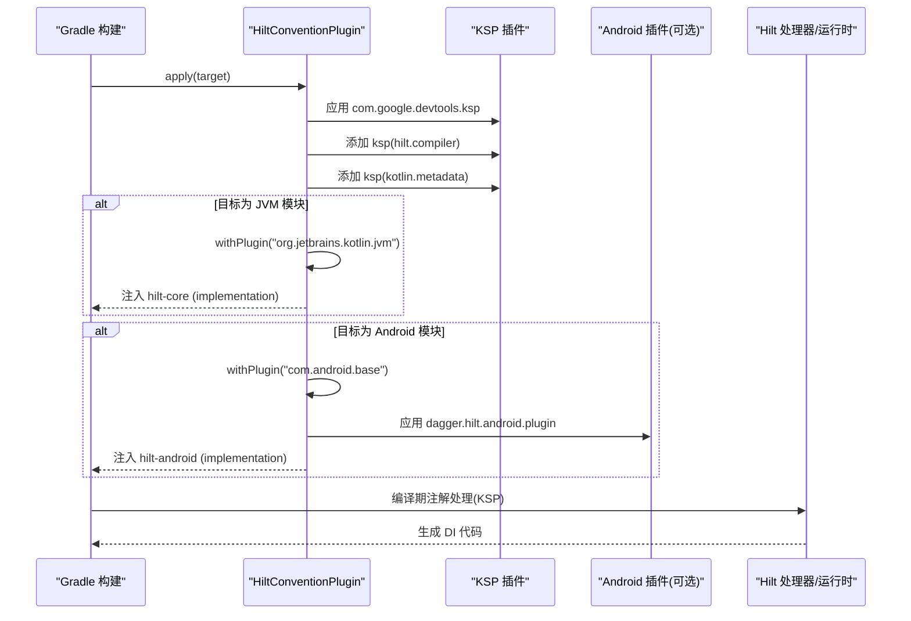
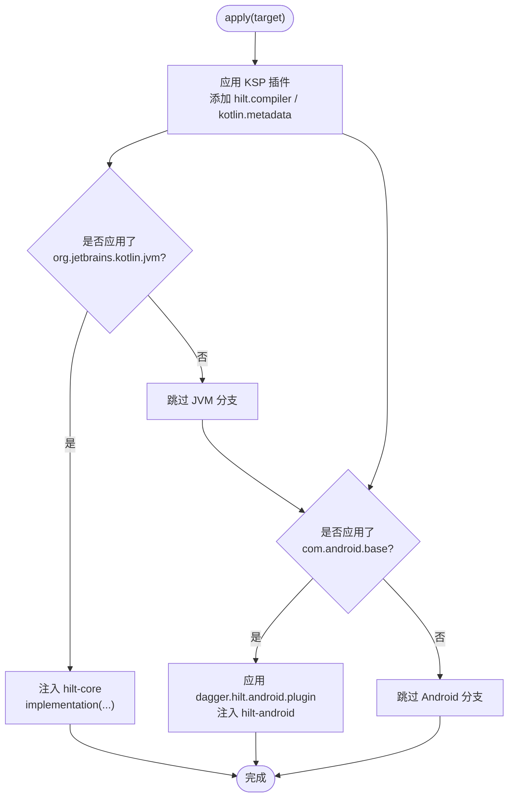
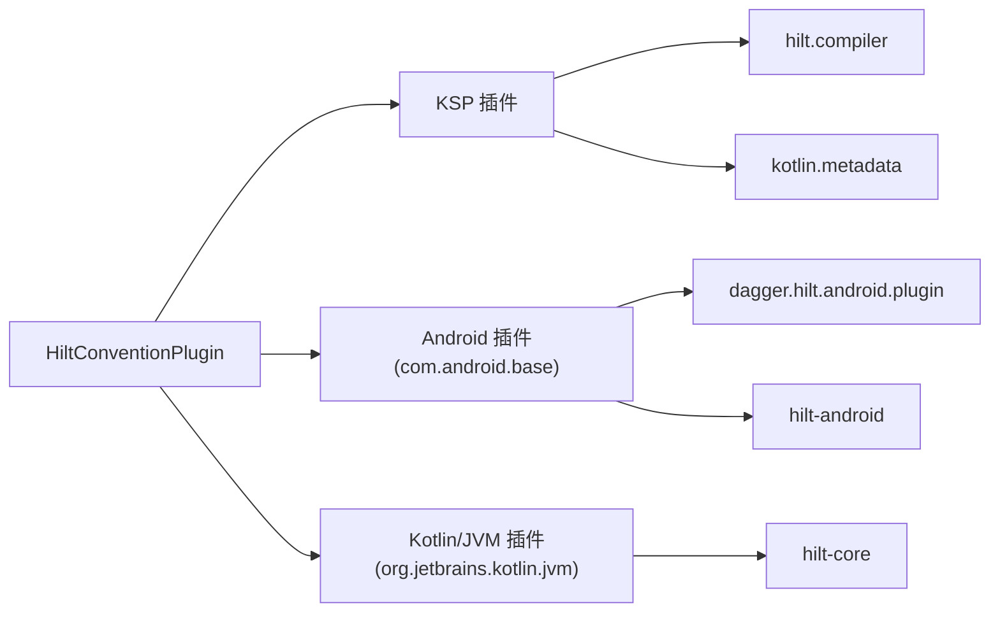

# Hilt 依赖注入约定插件

<cite>
**本文引用的文件**
- [HiltConventionPlugin.kt](file://build-logic/convention/src/main/kotlin/HiltConventionPlugin.kt)
- [build.gradle.kts（convention 模块）](file://build-logic/convention/build.gradle.kts)
- [libs.versions.toml](file://gradle/libs.versions.toml)
- [module_app/build.gradle.kts](file://module_app/build.gradle.kts)
- [module_book/build.gradle.kts](file://module_book/build.gradle.kts)
- [MyApplication.kt](file://module_app/src/main/java/com/ebook/MyApplication.kt)
</cite>

## 目录
1. [简介](#简介)
2. [项目结构](#项目结构)
3. [核心组件](#核心组件)
4. [架构总览](#架构总览)
5. [详细组件分析](#详细组件分析)
6. [依赖关系分析](#依赖关系分析)
7. [性能与构建特性](#性能与构建特性)
8. [故障排查指南](#故障排查指南)
9. [结论](#结论)
10. [附录：在不同模块中使用 Hilt 的配置示例](#附录：在不同模块中使用-hilt-的配置示例)

## 简介
本文件围绕 build-logic 中的 Hilt 约定插件，系统化说明其如何为不同模块类型自动装配 Hilt 支持。重点包括：
- KSP 插件的启用以及编译器参数 hilt.compiler、kotlin.metadata 的注入目的与作用。
- 对 JVM 模块的支持：基于 org.jetbrains.kotlin.jvm 检测并注入 hilt.core。
- 对 Android 模块的支持：基于 com.android.base 检测并应用 dagger.hilt.android.plugin，同时注入 hilt.android。
- 采用“检测式依赖注入”的优势：仅在需要 Hilt 的模块中引入相关依赖与插件，避免污染无 Hilt 的模块。
- 在 Application、Activity、ViewModel 等组件中与约定插件协同工作的配置要点。
- 常见问题：KSP 配置错误、JVM 与 Android 差异、生成代码位置与作用域管理。
- 与 Compose 集成时的注意事项与最佳实践。

## 项目结构
约定插件位于 build-logic 子工程中，通过 gradlePlugin 注册自定义插件 ID xrn1997.hilt，实现类为 HiltConventionPlugin。版本与依赖统一由 gradle/libs.versions.toml 管理。业务模块通过在各自的 build.gradle.kts 中应用该约定插件，即可按需获得 Hilt 能力。

**图表来源**
- [build.gradle.kts（convention 模块）:40-78](file://build-logic/convention/build.gradle.kts#L40-L78)
- [HiltConventionPlugin.kt:24-49](file://build-logic/convention/src/main/kotlin/HiltConventionPlugin.kt#L24-L49)
- [libs.versions.toml:158-170](file://gradle/libs.versions.toml#L158-L170)

**章节来源**
- [build.gradle.kts（convention 模块）:40-78](file://build-logic/convention/build.gradle.kts#L40-L78)
- [HiltConventionPlugin.kt:24-49](file://build-logic/convention/src/main/kotlin/HiltConventionPlugin.kt#L24-L49)
- [libs.versions.toml:158-170](file://gradle/libs.versions.toml#L158-L170)

## 核心组件
- HiltConventionPlugin：统一启用 KSP，并在检测到目标模块使用 Kotlin/JVM 或 Android Base 时分别注入对应 Hilt 能力。
- 版本目录 libs.versions.toml：集中声明 hilt、hilt-core、hilt-android、hilt-compiler、kotlin-metadata、ksp 等依赖与插件版本。
- 业务模块的 build.gradle.kts：应用约定插件与 KSP 插件，AndroidTest 下按需补充测试用 KSP。

**章节来源**
- [HiltConventionPlugin.kt:24-49](file://build-logic/convention/src/main/kotlin/HiltConventionPlugin.kt#L24-L49)
- [libs.versions.toml:158-170](file://gradle/libs.versions.toml#L158-L170)
- [module_app/build.gradle.kts:3-8](file://module_app/build.gradle.kts#L3-L8)
- [module_book/build.gradle.kts:3-8](file://module_book/build.gradle.kts#L3-L8)

## 架构总览
约定插件在 apply(target) 中执行以下关键步骤：
- 始终应用 KSP 插件，并将 hilt.compiler 与 kotlin.metadata 作为 KSP 任务依赖加入。
- 当目标模块应用了 org.jetbrains.kotlin.jvm 时，注入 hilt-core 到 implementation 配置。
- 当目标模块应用了 com.android.base 时，应用 dagger.hilt.android.plugin，并注入 hilt-android 到 implementation 配置。

这种“按插件存在性检测 + 条件注入”的方式，使得只有真正需要 Hilt 的模块才会被引入相应依赖和处理器，减少无关编译开销。

**图表来源**
- [HiltConventionPlugin.kt:24-49](file://build-logic/convention/src/main/kotlin/HiltConventionPlugin.kt#L24-L49)

**章节来源**
- [HiltConventionPlugin.kt:24-49](file://build-logic/convention/src/main/kotlin/HiltConventionPlugin.kt#L24-L49)

## 详细组件分析

### HiltConventionPlugin 行为解析
- 应用 KSP 插件并注入 hilt.compiler 与 kotlin.metadata：
  - hilt.compiler：用于处理 Hilt/Dagger 注解，生成依赖注入代码。
  - kotlin.metadata：提供 Kotlin 元数据，帮助 Hilt 正确识别 Kotlin 函数签名、默认参数、扩展等，保证生成的注入代码与 Kotlin 语义一致。
- JVM 模块分支：
  - 当模块应用了 org.jetbrains.kotlin.jvm 时，注入 hilt-core，使纯 Kotlin/JVM 模块也能使用 Hilt。
- Android 模块分支：
  - 当模块应用了 com.android.base 时，应用 dagger.hilt.android.plugin 并注入 hilt-android，从而启用 Android 专属能力（如 @AndroidEntryPoint、@HiltAndroidApp、生命周期感知等）。

**图表来源**
- [HiltConventionPlugin.kt:24-49](file://build-logic/convention/src/main/kotlin/HiltConventionPlugin.kt#L24-L49)

**章节来源**
- [HiltConventionPlugin.kt:24-49](file://build-logic/convention/src/main/kotlin/HiltConventionPlugin.kt#L24-L49)

### 版本与依赖管理
- 所有 Hilt 与 KSP 依赖均通过 libs.versions.toml 统一管理，便于升级与一致性控制。
- convention 模块本身仅以 compileOnly 引用各 Gradle 插件 API，确保约定插件轻量且可复用。

**章节来源**
- [libs.versions.toml:158-170](file://gradle/libs.versions.toml#L158-L170)
- [libs.versions.toml:214-237](file://gradle/libs.versions.toml#L214-L237)
- [build.gradle.kts（convention 模块）:23-31](file://build-logic/convention/build.gradle.kts#L23-L31)

### 模块侧接入点
- module_app：应用 xrn1997.android.application、ksp、therouter 以及 xrn1997.hilt；作为 Android 应用入口，配合 Hilt 完成全局依赖图初始化。
- module_book：应用 xrn1997.android.component、compose.compiler、ksp 与 xrn1997.hilt；在 androidTest 中额外声明 kspAndroidTest(libs.hilt.compiler)，以便测试环境生成 Hilt 所需代码。

**章节来源**
- [module_app/build.gradle.kts:3-8](file://module_app/build.gradle.kts#L3-L8)
- [module_book/build.gradle.kts:3-8](file://module_book/build.gradle.kts#L3-L8)
- [module_book/build.gradle.kts:89-96](file://module_book/build.gradle.kts#L89-L96)

### Application、Activity、ViewModel 协作
- Application：使用 @HiltAndroidApp 标记，由 Hilt 生成对应的组件初始化代码，负责构建应用级依赖图。
- Activity：使用 @AndroidEntryPoint 标注，使 Activity 参与 Hilt 注入；页面内可通过 viewModels() 获取由 Hilt 管理的 ViewModel。
- ViewModel：使用 @HiltViewModel 与 @Inject 构造器，由 Hilt 负责实例化与依赖注入。

注意：约定插件并不直接管理这些注解的使用方式，而是确保启用 Hilt 的模块具备正确的 KSP 处理器与依赖。具体的注解使用应遵循项目的 MVVM 与 Hilt 约定。

**章节来源**
- [MyApplication.kt:19-61](file://module_app/src/main/java/com/ebook/MyApplication.kt#L19-L61)

## 依赖关系分析
- 约定插件对 Gradle 插件的依赖：
  - compileOnly 引入 android gradle plugin、kotlin gradle plugin、ksp gradle plugin、room gradle plugin、router gradle plugin，确保构建期可用但不会引入到最终产物。
- 业务模块对 Hilt 的能力：
  - Android 模块：通过 dagger.hilt.android.plugin 启用 Android 特性，并通过 hilt-android 提供运行时能力。
  - JVM 模块：通过 hilt-core 提供基础依赖注入能力。
- KSP 管线：
  - 统一启用 com.google.devtools.ksp，并将 hilt.compiler 与 kotlin.metadata 作为处理器依赖，确保注解处理链完整。

**图表来源**
- [HiltConventionPlugin.kt:24-49](file://build-logic/convention/src/main/kotlin/HiltConventionPlugin.kt#L24-L49)
- [libs.versions.toml:158-170](file://gradle/libs.versions.toml#L158-L170)

**章节来源**
- [HiltConventionPlugin.kt:24-49](file://build-logic/convention/src/main/kotlin/HiltConventionPlugin.kt#L24-L49)
- [libs.versions.toml:158-170](file://gradle/libs.versions.toml#L158-L170)

## 性能与构建特性
- 检测式依赖注入优势：
  - 仅在目标模块实际使用了相关插件时才注入依赖与应用插件，避免在未使用 Hilt 的模块中引入不必要的处理器与运行时库，缩短编译时间并减小产物体积。
- KSP 处理器优化：
  - 将 hilt.compiler 与 kotlin.metadata 放在 ksp 配置中，确保注解处理阶段才加载，降低常规编译阶段的负担。
- Android 与 JVM 双态支持：
  - 同一约定插件同时服务 Android 与纯 JVM 模块，减少重复配置与维护成本。

[本节为通用指导，不直接分析具体文件]

## 故障排查指南
- KSP 配置错误
  - 症状：注解未处理、生成代码缺失、注入点为空。
  - 排查要点：
    - 确认模块已应用 KSP 插件（约定插件会自动应用），并检查是否缺少 hilt.compiler 与 kotlin.metadata 的 ksp 依赖。
    - 在 Android 测试源集（androidTest）中，若需生成 Hilt 测试代码，需自行声明 kspAndroidTest(libs.hilt.compiler)。
- JVM 模块与 Android 模块的差异
  - JVM 模块：注入 hilt-core，适用于纯 Kotlin/JVM 场景。
  - Android 模块：需应用 dagger.hilt.android.plugin 并注入 hilt-android，才能使用 @HiltAndroidApp、@AndroidEntryPoint 等 Android 专属能力。
- Hilt 生成的代码位置与作用域管理
  - 生成代码由 KSP 产出，通常位于模块 build/generated 目录下（由 Gradle/KSP 约定决定）。
  - 作用域管理由 Hilt 注解与组件决定（如 SingletonComponent、ActivityRetainedComponent、ViewModelComponent 等），需根据业务需求选择合适的作用域。
- 常见构建问题
  - 未应用约定插件：导致缺少 hilt/compiler 或 hilt/android 依赖。
  - 多模块冲突：确保仅在需要 Hilt 的模块应用约定插件，避免在不需要的模块引入冗余依赖。
  - 独立运行与集成模式：确保清单与插件配置在两种模式下保持一致，避免因清单差异导致的启动异常。

**章节来源**
- [module_book/build.gradle.kts:89-96](file://module_book/build.gradle.kts#L89-L96)
- [HiltConventionPlugin.kt:24-49](file://build-logic/convention/src/main/kotlin/HiltConventionPlugin.kt#L24-L49)

## 结论
Hilt 约定插件通过“检测式依赖注入”策略，为不同模块类型精准装配 Hilt 能力：
- 统一启用 KSP 并注入 hilt.compiler 与 kotlin.metadata，确保注解处理链完整。
- 对 JVM 模块注入 hilt-core，对 Android 模块应用 dagger.hilt.android.plugin 并注入 hilt-android。
- 借助版本目录集中管理依赖，提升可维护性与升级效率。
- 在 Application、Activity、ViewModel 等组件中，配合 Hilt 注解实现依赖注入与生命周期管理。
- 针对常见问题提供排查路径，确保构建稳定与运行可靠。

[本节为总结性内容，不直接分析具体文件]

## 附录：在不同模块中使用 Hilt 的配置示例
- Android 应用模块（module_app）
  - 应用约定插件 xrn1997.hilt 与 KSP 插件。
  - 在 Application 上使用 @HiltAndroidApp，以初始化 Hilt 组件。
  - 参考文件：
    - [module_app/build.gradle.kts:3-8](file://module_app/build.gradle.kts#L3-L8)
    - [MyApplication.kt:19-61](file://module_app/src/main/java/com/ebook/MyApplication.kt#L19-L61)
- 功能模块（module_book）
  - 应用约定插件 xrn1997.hilt 与 KSP 插件。
  - 在 androidTest 中声明 kspAndroidTest(libs.hilt.compiler)，以支持测试环境下的 Hilt 代码生成。
  - 参考文件：
    - [module_book/build.gradle.kts:3-8](file://module_book/build.gradle.kts#L3-L8)
    - [module_book/build.gradle.kts:89-96](file://module_book/build.gradle.kts#L89-L96)
- 与 Compose 集成
  - 使用 hilt-navigation-compose 提供的 hiltViewModel()，替代 Fragment 的 viewModels()，以便在 Compose 中直接注入 ViewModel。
  - 参考文件：
    - [module_book/build.gradle.kts:72-74](file://module_book/build.gradle.kts#L72-L74)

**章节来源**
- [module_app/build.gradle.kts:3-8](file://module_app/build.gradle.kts#L3-L8)
- [module_book/build.gradle.kts:3-8](file://module_book/build.gradle.kts#L3-L8)
- [module_book/build.gradle.kts:72-74](file://module_book/build.gradle.kts#L72-L74)
- [module_book/build.gradle.kts:89-96](file://module_book/build.gradle.kts#L89-L96)
- [MyApplication.kt:19-61](file://module_app/src/main/java/com/ebook/MyApplication.kt#L19-L61)