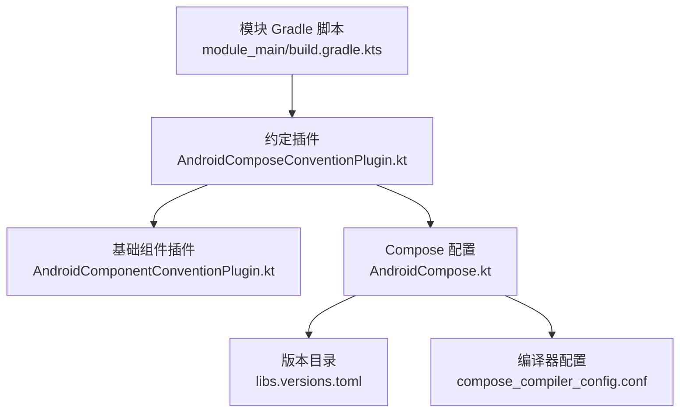
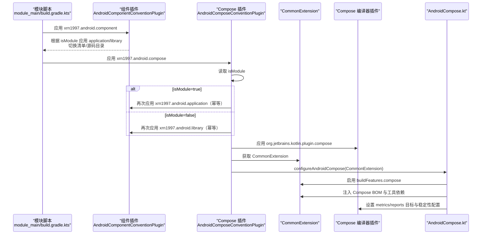
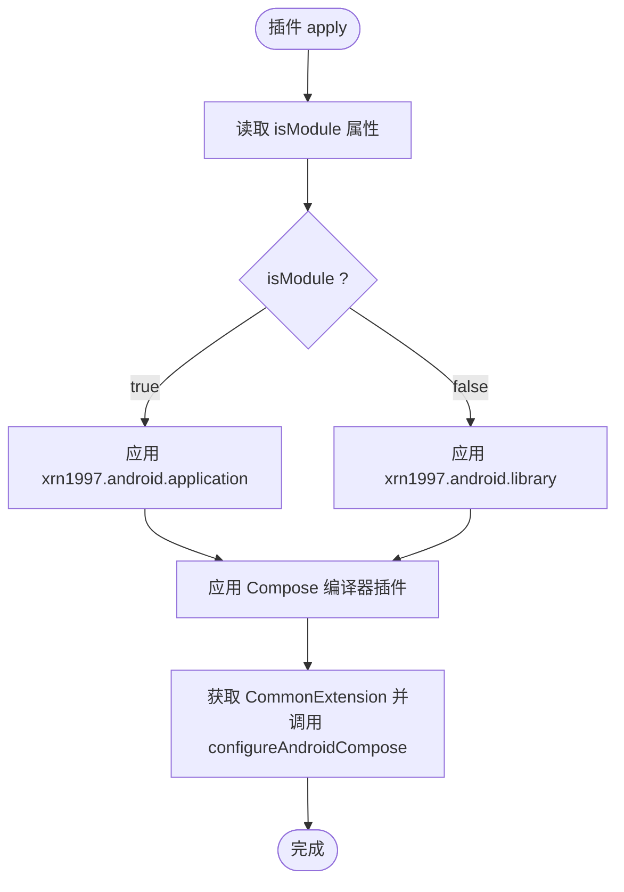
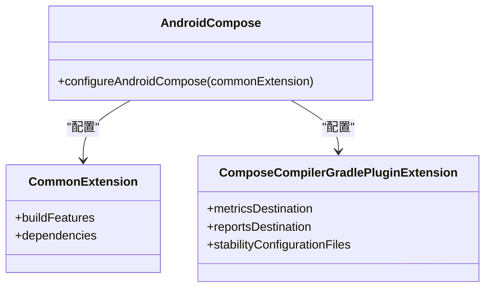
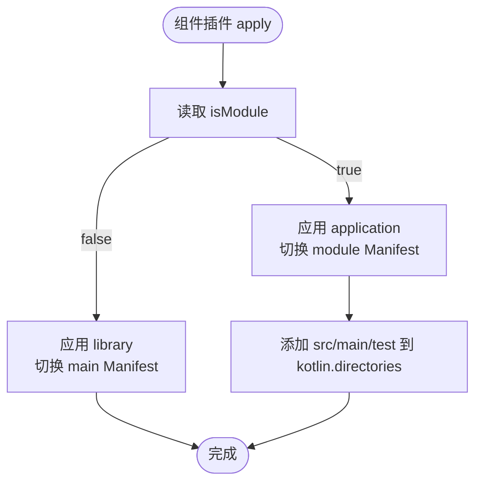
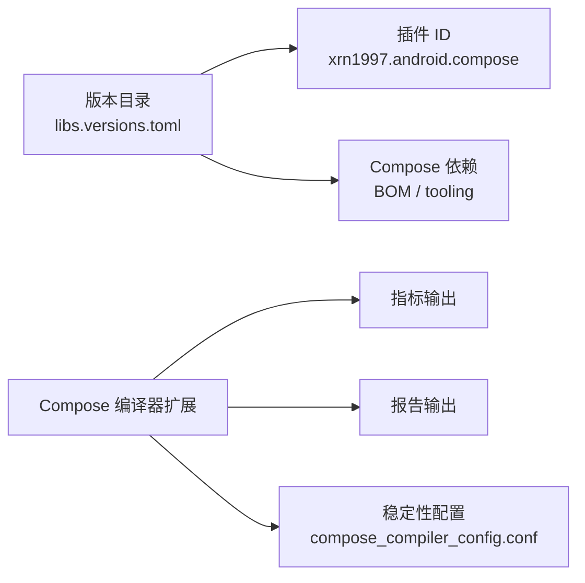

# Jetpack Compose 约定插件

<cite>
**本文引用的文件**
- [AndroidComposeConventionPlugin.kt](file://build-logic/convention/src/main/kotlin/AndroidComposeConventionPlugin.kt)
- [AndroidCompose.kt](file://build-logic/convention/src/main/kotlin/com/xrn1997/convention/AndroidCompose.kt)
- [AndroidComponentConventionPlugin.kt](file://build-logic/convention/src/main/kotlin/AndroidComponentConventionPlugin.kt)
- [libs.versions.toml](file://gradle/libs.versions.toml)
- [module_main/build.gradle.kts](file://module_main/build.gradle.kts)
- [compose_compiler_config.conf](file://compose_compiler_config.conf)
- [0020-compose-convention-plugin-id-unification.md](file://docs/adr/0020-compose-convention-plugin-id-unification.md)
</cite>

## 目录
1. [简介](#简介)
2. [项目结构](#项目结构)
3. [核心组件](#核心组件)
4. [架构总览](#架构总览)
5. [详细组件分析](#详细组件分析)
6. [依赖关系分析](#依赖关系分析)
7. [性能考量](#性能考量)
8. [故障排查指南](#故障排查指南)
9. [结论](#结论)
10. [附录](#附录)

## 简介
本仓库通过 build-logic 中的约定插件为 Android 模块提供统一的 Compose 构建能力。其中，Jetpack Compose 约定插件负责：
- 统一启用 Compose 编译能力（Kotlin Compose 编译器插件）
- 注入 Compose BOM 与工具链依赖
- 在复合构建环境下，与 android-practice 侧保持相同的插件 ID（xrn1997.android.compose），确保跨仓可解析
- 根据 isModule 属性自动套用基础应用或库插件，使仅挂 compose 的模块也能独立运行

## 项目结构
与本主题直接相关的实现位于 build-logic/convention 中，由 module_main 等 UI 模块以约定方式引用。关键位置如下：
- 约定插件入口：AndroidComposeConventionPlugin.kt
- Compose 配置封装：com.xrn1997.convention.AndroidCompose.kt
- 组件约定插件（用于 isModule 分支的基础插件套用）：AndroidComponentConventionPlugin.kt
- 版本与插件 ID 声明：gradle/libs.versions.toml
- 使用示例：module_main/build.gradle.kts
- Compose 编译器稳定性配置：compose_compiler_config.conf
- 决策文档：docs/adr/0020-compose-convention-plugin-id-unification.md

**图示来源**
- [AndroidComposeConventionPlugin.kt:38-57](file://build-logic/convention/src/main/kotlin/AndroidComposeConventionPlugin.kt#L38-L57)
- [AndroidComponentConventionPlugin.kt:9-33](file://build-logic/convention/src/main/kotlin/AndroidComponentConventionPlugin.kt#L9-L33)
- [AndroidCompose.kt:29-75](file://build-logic/convention/src/main/kotlin/com/xrn1997/convention/AndroidCompose.kt#L29-L75)
- [libs.versions.toml:214-237](file://gradle/libs.versions.toml#L214-L237)
- [compose_compiler_config.conf:1-12](file://compose_compiler_config.conf#L1-L12)

**章节来源**
- [AndroidComposeConventionPlugin.kt:17-57](file://build-logic/convention/src/main/kotlin/AndroidComposeConventionPlugin.kt#L17-L57)
- [AndroidComponentConventionPlugin.kt:1-33](file://build-logic/convention/src/main/kotlin/AndroidComponentConventionPlugin.kt#L1-L33)
- [AndroidCompose.kt:19-75](file://build-logic/convention/src/main/kotlin/com/xrn1997/convention/AndroidCompose.kt#L19-L75)
- [libs.versions.toml:214-237](file://gradle/libs.versions.toml#L214-L237)
- [module_main/build.gradle.kts:4-9](file://module_main/build.gradle.kts#L4-L9)
- [compose_compiler_config.conf:1-12](file://compose_compiler_config.conf#L1-L12)

## 核心组件
- AndroidComposeConventionPlugin：Compose 约定插件的入口，负责按 isModule 选择基础插件、激活 Compose 编译器，并调用统一配置方法。
- AndroidCompose.configureAndroidCompose：对 CommonExtension 进行统一配置，开启 Compose 构建特性、注入 BOM 与工具依赖、设置 Compose 编译器输出路径与稳定性配置文件。
- AndroidComponentConventionPlugin：提供 isModule 分支下的基础插件套用（application/library）、清单切换与源码目录管理。
- 版本与插件目录：集中声明 Compose BOM、Compose 相关依赖以及自定义插件 ID（xrn1997.android.compose）。
- 模块使用示例：module_main 同时应用 xrn1997.android.component 与 xrn1997.android.compose，演示“同 ID 幂等”的组合方式。

**章节来源**
- [AndroidComposeConventionPlugin.kt:25-57](file://build-logic/convention/src/main/kotlin/AndroidComposeConventionPlugin.kt#L25-L57)
- [AndroidCompose.kt:29-75](file://build-logic/convention/src/main/kotlin/com/xrn1997/convention/AndroidCompose.kt#L29-L75)
- [AndroidComponentConventionPlugin.kt:9-33](file://build-logic/convention/src/main/kotlin/AndroidComponentConventionPlugin.kt#L9-L33)
- [libs.versions.toml:89-108](file://gradle/libs.versions.toml#L89-L108)
- [libs.versions.toml:214-237](file://gradle/libs.versions.toml#L214-L237)
- [module_main/build.gradle.kts:4-9](file://module_main/build.gradle.kts#L4-L9)

## 架构总览
下图展示从模块 Gradle 脚本到 Compose 编译配置的完整流程，包括 isModule 分支、插件幂等性与 Compose 编译器配置。

**图示来源**
- [AndroidComposeConventionPlugin.kt:38-57](file://build-logic/convention/src/main/kotlin/AndroidComposeConventionPlugin.kt#L38-L57)
- [AndroidComponentConventionPlugin.kt:9-33](file://build-logic/convention/src/main/kotlin/AndroidComponentConventionPlugin.kt#L9-L33)
- [AndroidCompose.kt:29-75](file://build-logic/convention/src/main/kotlin/com/xrn1997/convention/AndroidCompose.kt#L29-L75)
- [module_main/build.gradle.kts:4-9](file://module_main/build.gradle.kts#L4-L9)

## 详细组件分析

### AndroidComposeConventionPlugin：命名策略与 isModule 分支
- 命名策略：插件 ID 固定为 xrn1997.android.compose，与 android-practice 侧保持一致，保证复合构建环境（lib-common-build）下双方都能解析同一 ID。
- isModule 分支：当 isModule=true 时，应用 xrn1997.android.application；否则应用 xrn1997.android.library。这样即使模块只挂 Compose 约定插件，也能在独立模式下作为 application 运行，在非独立模式下作为 library 被聚合。
- 幂等性：module_main 同时应用 xrn1997.android.component 与本插件，由于 Gradle 按 ID 应用插件是幂等的，重复套用不会冲突。
- 激活 Compose 支持：应用 org.jetbrains.kotlin.plugin.compose，从而启用 Kotlin Compose 编译器。
- 统一配置：通过 CommonExtension 调用 configureAndroidCompose，避免区分 ApplicationExtension 与 LibraryExtension。

**图示来源**
- [AndroidComposeConventionPlugin.kt:38-57](file://build-logic/convention/src/main/kotlin/AndroidComposeConventionPlugin.kt#L38-L57)

**章节来源**
- [AndroidComposeConventionPlugin.kt:25-57](file://build-logic/convention/src/main/kotlin/AndroidComposeConventionPlugin.kt#L25-L57)

### AndroidCompose.configureAndroidCompose：统一配置 Compose 能力
- 构建特性：启用 Compose 构建特性（buildFeatures.compose = true）。
- 依赖注入：通过版本目录引入 Compose BOM，并在存在 androidTest 时注入测试平台依赖；注入 UI tooling-preview 与 debug tooling。
- 单元测试资源开关：不在此处默认开启 unit test 包含 Android 资源，以避免拖慢所有模块的配置阶段，需要读资源的模块自行开启。
- Compose 编译器扩展：
  - 根据 gradle property 动态设置 metrics 与 reports 输出目录（相对根项目 build 目录）。
  - 将稳定性配置文件 compose_compiler_config.conf 加入 stabilityConfigurationFiles。

**图示来源**
- [AndroidCompose.kt:29-75](file://build-logic/convention/src/main/kotlin/com/xrn1997/convention/AndroidCompose.kt#L29-L75)
- [compose_compiler_config.conf:1-12](file://compose_compiler_config.conf#L1-L12)

**章节来源**
- [AndroidCompose.kt:29-75](file://build-logic/convention/src/main/kotlin/com/xrn1997/convention/AndroidCompose.kt#L29-L75)

### AndroidComponentConventionPlugin：isModule 下的基础插件与源码目录
- 基础插件套用：isModule=true 应用 application，否则应用 library。
- 清单切换：独立模式使用 src/main/module/AndroidManifest.xml，集成模式使用 src/main/AndroidManifest.xml。
- 源码目录：独立模式将 src/main/test 加入 kotlin.directories，使该 source set 参与编译（用于 mock/调试宿主）。

**图示来源**
- [AndroidComponentConventionPlugin.kt:9-33](file://build-logic/convention/src/main/kotlin/AndroidComponentConventionPlugin.kt#L9-L33)

**章节来源**
- [AndroidComponentConventionPlugin.kt:9-33](file://build-logic/convention/src/main/kotlin/AndroidComponentConventionPlugin.kt#L9-L33)

### 版本与插件 ID：集中管理与统一命名
- 插件 ID：xrn1997.android.compose 在版本目录中声明，供模块以 alias 引用。
- Compose 依赖：androidx-compose-bom、ui-tooling-preview、ui-tooling 等通过版本目录统一管理。
- 模块示例：module_main 使用 alias(libs.plugins.xrn1997.android.compose) 启用 Compose 能力。

**章节来源**
- [libs.versions.toml:89-108](file://gradle/libs.versions.toml#L89-L108)
- [libs.versions.toml:214-237](file://gradle/libs.versions.toml#L214-L237)
- [module_main/build.gradle.kts:4-9](file://module_main/build.gradle.kts#L4-L9)

### 与 AndroidComponentConventionPlugin 的协作关系
- module_main 同时应用 xrn1997.android.component 与 xrn1997.android.compose。
- 由于 Gradle 按 ID 应用插件是幂等的，两处套同一基础插件不会产生冲突。
- 这种设计让“仅挂 Compose 插件”的模块也能独立运行（Compose 插件内部会再套一次基础插件），而业务模块可以显式使用组件插件获得更细粒度的控制（如 manifest 切换与源码目录）。

**章节来源**
- [AndroidComposeConventionPlugin.kt:38-57](file://build-logic/convention/src/main/kotlin/AndroidComposeConventionPlugin.kt#L38-L57)
- [AndroidComponentConventionPlugin.kt:9-33](file://build-logic/convention/src/main/kotlin/AndroidComponentConventionPlugin.kt#L9-L33)
- [module_main/build.gradle.kts:4-9](file://module_main/build.gradle.kts#L4-L9)

### Compose 项目的配置示例
- 在 UI 模块的 build.gradle.kts 中，应用 xrn1997.android.component 与 xrn1997.android.compose，即可启用 Compose 构建能力并复用统一配置。
- 若模块仅需 Compose 能力且希望独立运行，可仅应用 xrn1997.android.compose；Compose 插件内部会按 isModule 自动套用基础插件。

**章节来源**
- [module_main/build.gradle.kts:4-9](file://module_main/build.gradle.kts#L4-L9)

### 重要说明：同 ID 不等于同实现
- 本仓版与 android-practice 版的 Compose 约定插件共享相同 ID，但实现不同：
  - 本仓版按 isModule 自套基础插件，并在无 androidTest 时不注入 ui-test 依赖。
  - android-practice 版不自套基础插件，并额外注入 compose ui-test 依赖。
- 差异与待删方向参考 ADR 文档（0020）与测试覆盖待办文档。
- 在恢复 lib-common-build 联动时，需先确认两条兜底事实仍成立（lib_common 已应用 library 插件、无 androidTest 导致未注入 ui-test 依赖）。

**章节来源**
- [AndroidComposeConventionPlugin.kt:25-36](file://build-logic/convention/src/main/kotlin/AndroidComposeConventionPlugin.kt#L25-L36)
- [0020-compose-convention-plugin-id-unification.md:1-34](file://docs/adr/0020-compose-convention-plugin-id-unification.md#L1-L34)

## 依赖关系分析
- 插件 ID：xrn1997.android.compose 在版本目录中声明，模块通过 alias 引用。
- Compose 依赖：BOM、UI tooling-preview、debug tooling 集中在版本目录，便于统一升级。
- 编译器配置：Compose 编译器扩展通过 gradle property 控制指标与报告输出，并加载稳定性配置文件。

**图示来源**
- [libs.versions.toml:214-237](file://gradle/libs.versions.toml#L214-L237)
- [libs.versions.toml:89-108](file://gradle/libs.versions.toml#L89-L108)
- [AndroidCompose.kt:54-75](file://build-logic/convention/src/main/kotlin/com/xrn1997/convention/AndroidCompose.kt#L54-L75)
- [compose_compiler_config.conf:1-12](file://compose_compiler_config.conf#L1-L12)

**章节来源**
- [libs.versions.toml:89-108](file://gradle/libs.versions.toml#L89-L108)
- [libs.versions.toml:214-237](file://gradle/libs.versions.toml#L214-L237)
- [AndroidCompose.kt:54-75](file://build-logic/convention/src/main/kotlin/com/xrn1997/convention/AndroidCompose.kt#L54-L75)

## 性能考量
- 单元测试资源开关：为避免全量开启导致配置阶段变慢，仅在需要读合并资源/assets 的模块自行开启，减少不必要的开销。
- Compose 编译器指标与报告：通过 gradle property 按需开启，避免每次构建都生成大量产物。
- 稳定性配置：集中维护稳定性规则，减少不必要的不稳定类带来的重组开销。

[本节为通用指导，无需具体文件分析]

## 故障排查指南
- 复合构建下解析失败：检查是否使用了正确的插件 ID（xrn1997.android.compose），并确保版本目录与 build-logic 注册一致。
- 独立运行崩溃：确认 isModule 属性正确设置；独立模式会切换到 module Manifest 与额外源码目录。
- Compose 编译异常：检查是否应用了 org.jetbrains.kotlin.plugin.compose，并确认 CommonExtension 已启用 buildFeatures.compose。
- 指标/报告未生成：确认启用了相应 gradle property（enableComposeCompilerMetrics/Reports），并检查输出目录权限。
- 稳定性警告：核对 compose_compiler_config.conf 中是否需要新增稳定类条目。

**章节来源**
- [AndroidComposeConventionPlugin.kt:38-57](file://build-logic/convention/src/main/kotlin/AndroidComposeConventionPlugin.kt#L38-L57)
- [AndroidComponentConventionPlugin.kt:9-33](file://build-logic/convention/src/main/kotlin/AndroidComponentConventionPlugin.kt#L9-L33)
- [AndroidCompose.kt:29-75](file://build-logic/convention/src/main/kotlin/com/xrn1997/convention/AndroidCompose.kt#L29-L75)

## 结论
本仓库通过 xrn1997.android.compose 约定插件，为模块提供统一的 Compose 构建能力：
- 与 android-practice 侧保持相同 ID，保障复合构建兼容性
- 通过 isModule 分支自动套用基础插件，支持模块独立运行
- 基于 CommonExtension 的统一配置，简化 Application/Lib 的差异
- 与 AndroidComponentConventionPlugin 协作，利用 Gradle 插件幂等性避免冲突
- 通过版本目录与编译器配置，集中管理依赖与性能调优

建议新模块直接使用 xrn1997.android.compose 启用 Compose；如需更细粒度控制（如 manifest/源码目录），可同时应用 xrn1997.android.component。

[本节总结性内容，无需具体文件分析]

## 附录
- 模块使用示例：module_main/build.gradle.kts 展示了如何同时应用组件与 Compose 约定插件。
- 决策依据：ADR-0020 解释了统一 ID 的原因、差异点与后续治理方向。
- 编译器配置：compose_compiler_config.conf 定义了 Compose 稳定性规则。

**章节来源**
- [module_main/build.gradle.kts:4-9](file://module_main/build.gradle.kts#L4-L9)
- [0020-compose-convention-plugin-id-unification.md:1-34](file://docs/adr/0020-compose-convention-plugin-id-unification.md#L1-L34)
- [compose_compiler_config.conf:1-12](file://compose_compiler_config.conf#L1-L12)