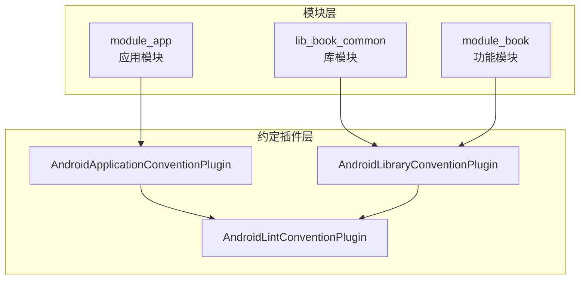
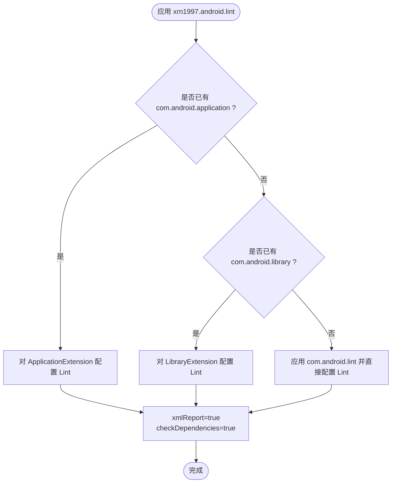
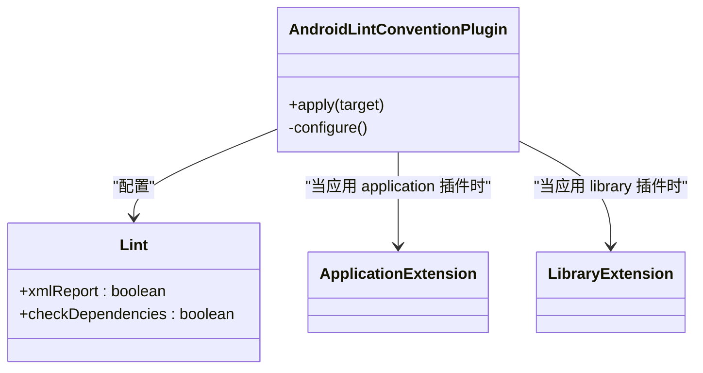
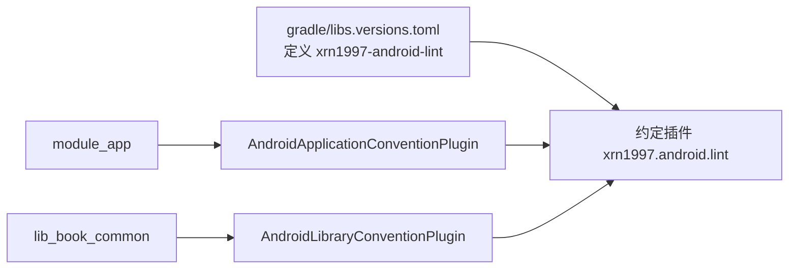

# Lint 代码检查约定插件

<cite>
**本文引用的文件**   
- [AndroidLintConventionPlugin.kt](file://build-logic/convention/src/main/kotlin/AndroidLintConventionPlugin.kt)
- [AndroidApplicationConventionPlugin.kt](file://build-logic/convention/src/main/kotlin/AndroidApplicationConventionPlugin.kt)
- [AndroidLibraryConventionPlugin.kt](file://build-logic/convention/src/main/kotlin/AndroidLibraryConventionPlugin.kt)
- [AndroidComponentConventionPlugin.kt](file://build-logic/convention/src/main/kotlin/AndroidComponentConventionPlugin.kt)
- [libs.versions.toml](file://gradle/libs.versions.toml)
- [module_app/build.gradle.kts](file://module_app/build.gradle.kts)
- [lib_book_common/build.gradle.kts](file://lib_book_common/build.gradle.kts)
- [module_book/build.gradle.kts](file://module_book/build.gradle.kts)
</cite>

## 目录
1. [简介](#简介)
2. [项目结构](#项目结构)
3. [核心组件](#核心组件)
4. [架构总览](#架构总览)
5. [详细组件分析](#详细组件分析)
6. [依赖关系分析](#依赖关系分析)
7. [性能与执行特性](#性能与执行特性)
8. [故障排查指南](#故障排查指南)
9. [结论](#结论)
10. [附录：使用示例与最佳实践](#附录使用示例与最佳实践)

## 简介
本文件面向 Android 多模块项目中的 Lint 代码检查统一配置。通过 build-logic 提供的约定插件 xrn1997.android.lint，仓库为所有 Android 模块（application、library 以及未显式应用 Android 插件的其它模块）提供一致且可维护的 Lint 行为：自动启用 XML 报告并检查依赖模块中的问题，从而在 CI 中实现“一处配置、全仓生效”的质量门禁。

## 项目结构
- 约定插件集中位于 build-logic/convention，对外暴露 xrn1997.android.lint 插件 ID
- Application 与 Library 约定插件在内部自动应用 xrn1997.android.lint，使业务模块无需感知 Lint 细节
- 版本目录统一管理 AGP/Lint 工具链版本，确保构建一致性

图表来源
- [AndroidApplicationConventionPlugin.kt:28-48](file://build-logic/convention/src/main/kotlin/AndroidApplicationConventionPlugin.kt#L28-L48)
- [AndroidLibraryConventionPlugin.kt:30-69](file://build-logic/convention/src/main/kotlin/AndroidLibraryConventionPlugin.kt#L30-L69)
- [AndroidLintConventionPlugin.kt:25-47](file://build-logic/convention/src/main/kotlin/AndroidLintConventionPlugin.kt#L25-L47)

章节来源
- [libs.versions.toml:214-237](file://gradle/libs.versions.toml#L214-L237)

## 核心组件
- AndroidLintConventionPlugin：根据已应用的插件类型智能分支，统一配置 Lint
- AndroidApplicationConventionPlugin / AndroidLibraryConventionPlugin：在应用 application/library 时自动引入 Lint 约定
- AndroidComponentConventionPlugin：按 isModule 切换 application/library 形态，间接影响 Lint 上下文

章节来源
- [AndroidLintConventionPlugin.kt:25-47](file://build-logic/convention/src/main/kotlin/AndroidLintConventionPlugin.kt#L25-L47)
- [AndroidApplicationConventionPlugin.kt:28-48](file://build-logic/convention/src/main/kotlin/AndroidApplicationConventionPlugin.kt#L28-L48)
- [AndroidLibraryConventionPlugin.kt:30-69](file://build-logic/convention/src/main/kotlin/AndroidLibraryConventionPlugin.kt#L30-L69)
- [AndroidComponentConventionPlugin.kt:7-34](file://build-logic/convention/src/main/kotlin/AndroidComponentConventionPlugin.kt#L7-L34)

## 架构总览
xrn1997.android.lint 通过 when 分支识别当前模块的插件类型，并以最小侵入方式将 Lint 配置注入到对应扩展或独立任务图中。

图表来源
- [AndroidLintConventionPlugin.kt:25-47](file://build-logic/convention/src/main/kotlin/AndroidLintConventionPlugin.kt#L25-L47)

章节来源
- [AndroidLintConventionPlugin.kt:25-47](file://build-logic/convention/src/main/kotlin/AndroidLintConventionPlugin.kt#L25-L47)

## 详细组件分析

### AndroidLintConventionPlugin 的智能检测逻辑
- 当模块已应用 com.android.application：通过 ApplicationExtension 接入 Lint
- 当模块已应用 com.android.library：通过 LibraryExtension 接入 Lint
- 否则：直接应用 com.android.lint 并配置 Lint
- 统一配置项：
  - xmlReport = true：生成 Lint XML 报告，便于 CI 解析与归档
  - checkDependencies = true：扫描该模块所依赖的库中的 Lint 问题，避免“依赖侧遗留问题逃逸”

图表来源
- [AndroidLintConventionPlugin.kt:25-47](file://build-logic/convention/src/main/kotlin/AndroidLintConventionPlugin.kt#L25-L47)

章节来源
- [AndroidLintConventionPlugin.kt:25-47](file://build-logic/convention/src/main/kotlin/AndroidLintConventionPlugin.kt#L25-L47)

### Application 与 Library 约定插件中的 Lint 集成
- AndroidApplicationConventionPlugin：应用 com.android.application 后，立即应用 xrn1997.android.lint，使应用模块获得统一的 Lint 行为
- AndroidLibraryConventionPlugin：应用 com.android.library 后，同样应用 xrn1997.android.lint，使库模块获得统一行为
- 两者不重复声明 Lint 具体配置，仅负责“何时引入”，具体规则由约定插件内聚管理

章节来源
- [AndroidApplicationConventionPlugin.kt:28-48](file://build-logic/convention/src/main/kotlin/AndroidApplicationConventionPlugin.kt#L28-L48)
- [AndroidLibraryConventionPlugin.kt:30-69](file://build-logic/convention/src/main/kotlin/AndroidLibraryConventionPlugin.kt#L30-L69)

### AndroidComponentConventionPlugin 对 Lint 的影响
- isModule=false 时以 library 形态参与构建，lint 行为遵循库模块语义
- isModule=true 时以 application 形态参与构建，lint 行为遵循应用模块语义
- 这意味着同一份模块在不同模式下可能产生不同的 Lint 结果（例如 manifest 合并差异、资源前缀等），应在两种模式均验证

章节来源
- [AndroidComponentConventionPlugin.kt:7-34](file://build-logic/convention/src/main/kotlin/AndroidComponentConventionPlugin.kt#L7-L34)

### 不同模块类型的配置差异
- 应用模块（com.android.application）：通过 ApplicationExtension 配置 Lint
- 库模块（com.android.library）：通过 LibraryExtension 配置 Lint
- 其他无 Android 插件的模块：直接应用 com.android.lint 并配置 Lint
- 三者最终都落到相同的 Lint 配置项（xmlReport、checkDependencies），保证一致性与可预期性

章节来源
- [AndroidLintConventionPlugin.kt:25-47](file://build-logic/convention/src/main/kotlin/AndroidLintConventionPlugin.kt#L25-L47)

## 依赖关系分析
- 插件 ID 与版本通过 gradle/libs.versions.toml 集中管理，AGP 与 Lint 工具链版本联动升级
- 业务模块通过 alias 引用约定插件，无需关心 Lint 细节
- 模块间依赖会影响 Lint 的检查范围（checkDependencies=true 时会递归检查依赖树）

图表来源
- [libs.versions.toml:214-237](file://gradle/libs.versions.toml#L214-L237)
- [AndroidApplicationConventionPlugin.kt:28-48](file://build-logic/convention/src/main/kotlin/AndroidApplicationConventionPlugin.kt#L28-L48)
- [AndroidLibraryConventionPlugin.kt:30-69](file://build-logic/convention/src/main/kotlin/AndroidLibraryConventionPlugin.kt#L30-L69)

章节来源
- [libs.versions.toml:214-237](file://gradle/libs.versions.toml#L214-L237)

## 性能与执行特性
- checkDependencies=true 会在依赖图中遍历依赖模块，增加 Lint 扫描范围与时间开销；在大仓库中首次运行或增量变化较大时尤为明显
- xmlReport=true 会输出结构化报告，便于 CI 快速判定与归档，同时可在本地快速定位问题
- 建议：
  - 在 CI 中缓存 Gradle 与 Lint 缓存，减少冷启动耗时
  - 对超大仓库可按模块并行执行 lint 任务（Gradle 自带并行支持）
  - 若需加速开发期反馈，可在 IDE 中单独运行受影响模块的 lint 任务

[本节为通用指导，不涉及特定文件]

## 故障排查指南
- 现象：CI 失败但本地成功
  - 可能原因：CI 环境启用了 checkDependencies，而本地未完整拉取依赖或未触发依赖级 Lint
  - 处理：在 CI 中保留 XML 报告产物，核对失败的具体模块与问题类别

- 现象：依赖模块的问题导致当前模块构建失败
  - 解释：checkDependencies=true 会检查依赖模块中的 Lint 问题，属于设计预期
  - 处理：修复依赖模块的问题，或在确有必要时对特定问题做局部豁免（谨慎使用）

- 现象：XML 报告找不到或为空
  - 可能原因：未正确应用 xrn1997.android.lint；或运行了错误的变体/任务
  - 处理：确认模块已通过约定插件引入 Lint；检查执行的 Gradle 任务与构建变体

- 现象：isModule 切换后 Lint 行为不一致
  - 解释：isModule=true 时模块以 application 形态编译，isModule=false 时为 library 形态，manifest 和资源前缀等不同可能导致 Lint 差异
  - 处理：在两种模式下分别验证 Lint，确保清单与资源保持一致

章节来源
- [AndroidLintConventionPlugin.kt:25-47](file://build-logic/convention/src/main/kotlin/AndroidLintConventionPlugin.kt#L25-L47)
- [AndroidComponentConventionPlugin.kt:7-34](file://build-logic/convention/src/main/kotlin/AndroidComponentConventionPlugin.kt#L7-L34)

## 结论
xrn1997.android.lint 通过“智能检测 + 统一配置”的方式，为整个仓库提供了稳定一致的 Lint 行为：无论模块是 application、library 还是其它形态，都会生成 XML 报告并检查依赖中的问题，从而在 CI 中形成统一的质量门禁。配合版本目录与约定插件，团队可以聚焦业务演进，而不必在每个模块中重复维护 Lint 策略。

[本节为总结，不涉及特定文件]

## 附录：使用示例与最佳实践

### 在模块中启用 Lint 约定
- 应用层模块：通过 xrn1997.android.application 间接引入 Lint
- 库模块：通过 xrn1997.android.library 间接引入 Lint
- 非 Android 模块：如需 Lint，可直接应用 xrn1997.android.lint

章节来源
- [AndroidApplicationConventionPlugin.kt:28-48](file://build-logic/convention/src/main/kotlin/AndroidApplicationConventionPlugin.kt#L28-L48)
- [AndroidLibraryConventionPlugin.kt:30-69](file://build-logic/convention/src/main/kotlin/AndroidLibraryConventionPlugin.kt#L30-L69)
- [AndroidLintConventionPlugin.kt:25-47](file://build-logic/convention/src/main/kotlin/AndroidLintConventionPlugin.kt#L25-L47)

### 在 CI 流水线中集成 Lint
- 执行任务：./gradlew lint（或指定模块 ./gradlew :module:lint）
- 参数建议：--continue 允许继续执行后续任务，--scan 生成构建扫描
- 产物处理：收集 XML 报告用于归档与质量门禁（xmlReport=true）
- 缓存：开启 Gradle 缓存与 Lint 缓存以缩短 CI 时长

章节来源
- [AndroidLintConventionPlugin.kt:25-47](file://build-logic/convention/src/main/kotlin/AndroidLintConventionPlugin.kt#L25-L47)

### 与 IDE 集成
- 在 IDE 中执行 Lint 时，同样受约定插件控制，会生成 XML 报告
- 建议在 IDE 中针对单个模块运行 Lint，以获得更快的反馈

[本节为通用指导，不涉及特定文件]

### 自定义 Lint 规则的添加方法
- 由于 Lint 配置集中在约定插件，新增规则应优先在约定插件层进行配置（例如添加 Lint 任务、注册检查器或调整阈值）
- 业务模块通常不应重复配置 Lint，以保持全仓一致性

[本节为通用指导，不涉及特定文件]

### 实际模块如何引入约定插件
- module_app：通过 xrn1997.android.application 引入，内部再引入 Lint
- lib_book_common：通过 xrn1997.android.library 引入，内部再引入 Lint
- module_book：通过 xrn1997.android.component 引入，按 isModule 决定 application/library 形态，再由对应约定插件引入 Lint

章节来源
- [module_app/build.gradle.kts:1-8](file://module_app/build.gradle.kts#L1-L8)
- [lib_book_common/build.gradle.kts:1-9](file://lib_book_common/build.gradle.kts#L1-L9)
- [module_book/build.gradle.kts:1-8](file://module_book/build.gradle.kts#L1-L8)