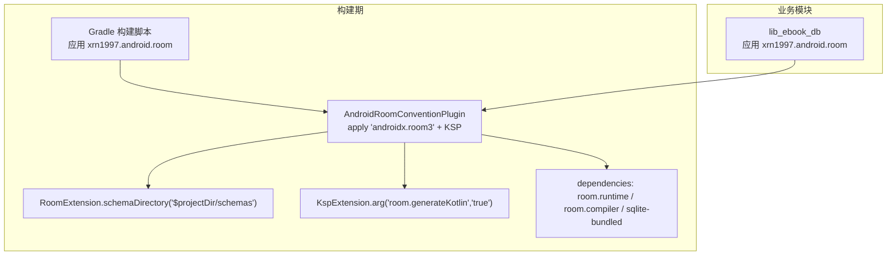
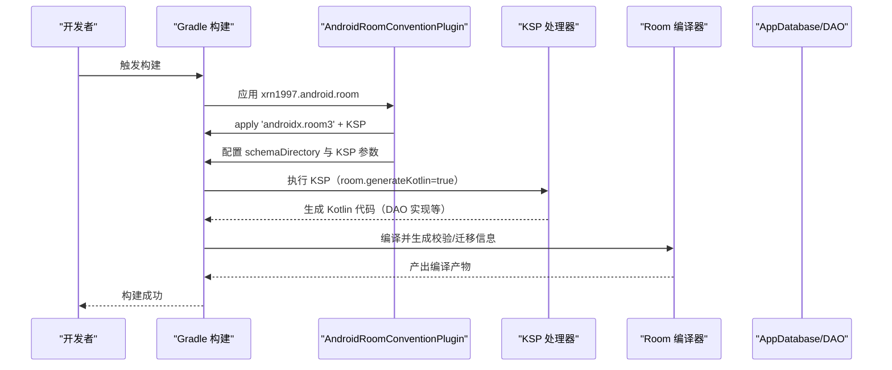
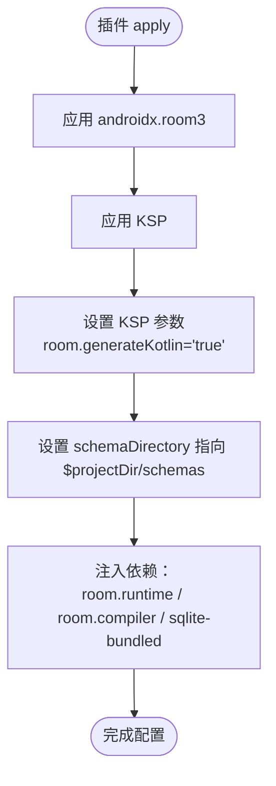
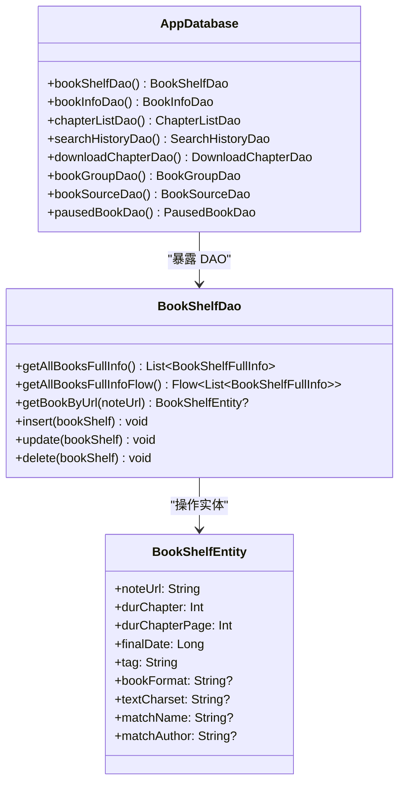
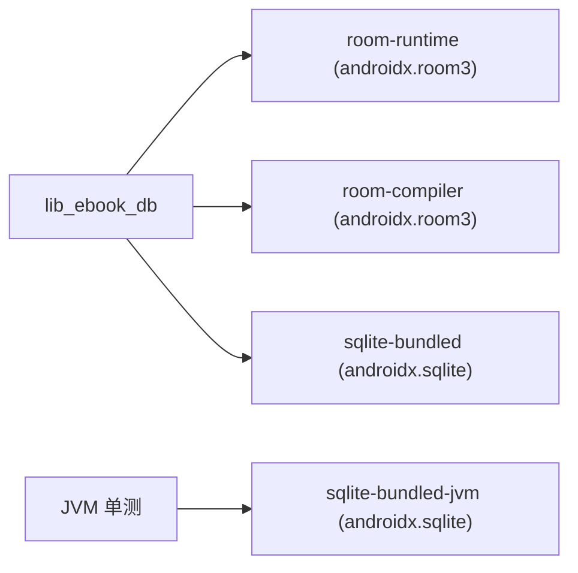

# Room 数据库约定插件

<cite>
**本文引用的文件**
- [AndroidRoomConventionPlugin.kt](file://build-logic/convention/src/main/kotlin/AndroidRoomConventionPlugin.kt)
- [libs.versions.toml](file://gradle/libs.versions.toml)
- [lib_ebook_db/build.gradle.kts](file://lib_ebook_db/build.gradle.kts)
- [AppDatabase.kt](file://lib_ebook_db/src/main/java/com/ebook/db/AppDatabase.kt)
- [BookShelfEntity.kt](file://lib_ebook_db/src/main/java/com/ebook/db/entity/BookShelfEntity.kt)
- [BookShelfDao.kt](file://lib_ebook_db/src/main/java/com/ebook/db/dao/BookShelfDao.kt)
</cite>

## 目录
1. [简介](#简介)
2. [项目结构](#项目结构)
3. [核心组件](#核心组件)
4. [架构总览](#架构总览)
5. [详细组件分析](#详细组件分析)
6. [依赖关系分析](#依赖关系分析)
7. [性能考量](#性能考量)
8. [故障排查指南](#故障排查指南)
9. [结论](#结论)
10. [附录](#附录)

## 简介
本文件面向使用 Gradle 约定插件的工程，聚焦 AndroidRoomConventionPlugin 如何为项目提供统一、一致的 Room 3.0 支持。文档覆盖以下要点：
- 从旧版 androidx.room 迁移到新版 androidx.room3 的插件 ID 与影响
- KSP 集成与 room.generateKotlin = "true" 的作用及生成代码位置
- schema 目录配置（schemaDirectory）对自动迁移的关键性
- 依赖注入策略：room.runtime、room.compiler、sqlite-bundled 的注入时机与用途
- Room 实体的使用示例：@Entity、@Dao、@Database 注解如何与约定插件配合工作
- 数据库迁移最佳实践：版本升级、迁移链维护与 schema JSON 管理
- 常见问题：Room 3.0 新特性、KSP 生成代码位置、版本升级注意事项
- sqlite-bundled 在移动平台上的优势

## 项目结构
该仓库通过 build-logic 中的约定插件统一管理各模块的构建行为。针对 Room 的约定由 AndroidRoomConventionPlugin 实现，所有需要 Room 的模块只需应用该约定插件即可启用统一的 Room 3.0 配置与依赖注入。

图表来源
- [AndroidRoomConventionPlugin.kt:17-49](file://build-logic/convention/src/main/kotlin/AndroidRoomConventionPlugin.kt#L17-L49)
- [lib_ebook_db/build.gradle.kts:3-7](file://lib_ebook_db/build.gradle.kts#L3-L7)

章节来源
- [AndroidRoomConventionPlugin.kt:17-49](file://build-logic/convention/src/main/kotlin/AndroidRoomConventionPlugin.kt#L17-L49)
- [lib_ebook_db/build.gradle.kts:3-7](file://lib_ebook_db/build.gradle.kts#L3-L7)

## 核心组件
- 约定插件 AndroidRoomConventionPlugin
  - 统一应用 androidx.room3 与 KSP 插件
  - 设置 KSP 参数 room.generateKotlin = "true"
  - 设置 schema 输出目录为 $projectDir/schemas
  - 注入三个关键依赖：room.runtime、room.compiler、sqlite-bundled
- 数据库模块 lib_ebook_db
  - 应用 xrn1997.android.room 约定插件
  - 定义 AppDatabase、实体与 DAO
  - 管理数据库版本与迁移链
  - 使用 sqlite-bundled 作为生产驱动（并在测试中使用 JVM 变体）

章节来源
- [AndroidRoomConventionPlugin.kt:17-49](file://build-logic/convention/src/main/kotlin/AndroidRoomConventionPlugin.kt#L17-L49)
- [lib_ebook_db/build.gradle.kts:3-7](file://lib_ebook_db/build.gradle.kts#L3-L7)

## 架构总览
约定插件在“构建期”完成 Room 工具链装配；在“运行期”由业务模块通过 @Database 暴露 DAO，并通过 Hilt 或其他方式获取数据库实例。KSP 负责生成 DAO 实现与查询验证相关代码；Room 编译器依据 schema 进行类型检查与自动生成。

图表来源
- [AndroidRoomConventionPlugin.kt:28-49](file://build-logic/convention/src/main/kotlin/AndroidRoomConventionPlugin.kt#L28-L49)

## 详细组件分析

### AndroidRoomConventionPlugin 详解
- 插件 ID 迁移
  - 应用 androidx.room3（而非旧版 androidx.room），对应库坐标与插件均属于 androidx.room3 组
- KSP 集成
  - 应用 com.google.devtools.ksp
  - 设置 room.generateKotlin = "true"，使生成的 DAO 实现与查询验证使用 Kotlin
- Schema 目录
  - schemaDirectory("$projectDir/schemas")，用于存放每个版本的 schema JSON，是 Room 自动迁移的前提
- 依赖注入
  - implementation(room.runtime)：运行时所需的 Room API
  - ksp(room.compiler)：编译期处理器，生成代码与校验 SQL
  - implementation(sqlite-bundled)：移动端内置 SQLite 引擎，避免系统差异

图表来源
- [AndroidRoomConventionPlugin.kt:28-49](file://build-logic/convention/src/main/kotlin/AndroidRoomConventionPlugin.kt#L28-L49)

章节来源
- [AndroidRoomConventionPlugin.kt:28-49](file://build-logic/convention/src/main/kotlin/AndroidRoomConventionPlugin.kt#L28-L49)

### 依赖与版本管理
- 版本集中管理于 gradle/libs.versions.toml
  - room 版本：3.0.0
  - sqliteBundled 版本：2.7.0
  - KSP 版本：2.3.10
- 依赖名称与坐标
  - room-runtime → androidx.room3:room3-runtime
  - room-compiler → androidx.room3:room3-compiler
  - sqlite-bundled → androidx.sqlite:sqlite-bundled
  - 另有 sqlite-bundled-jvm 用于 JVM 单测加载原生库

章节来源
- [libs.versions.toml:65-66](file://gradle/libs.versions.toml#L65-L66)
- [libs.versions.toml:197-212](file://gradle/libs.versions.toml#L197-L212)
- [libs.versions.toml:224-226](file://gradle/libs.versions.toml#L224-L226)

### 数据库模块使用约定
- 应用约定插件
  - 通过 alias(libs.plugins.xrn1997.android.room) 启用统一配置
- 显式声明 sqlite-bundled
  - 生产端直接依赖 androidx.sqlite.driver.bundled，确保可用性不受传递依赖变化影响
- 测试端使用 sqlite-bundled-jvm
  - 让 JVM 单测能在真实引擎上运行迁移 SQL，避免 UnsatisfiedLinkError

章节来源
- [lib_ebook_db/build.gradle.kts:3-7](file://lib_ebook_db/build.gradle.kts#L3-L7)
- [lib_ebook_db/build.gradle.kts:29-42](file://lib_ebook_db/build.gradle.kts#L29-L42)

### 实体、DAO 与数据库装配
- @Database 声明
  - 指定 entities、version、exportSchema=true，结合约定插件将 schema 写入 $projectDir/schemas
  - 数据库名常量便于识别与迁移
- 实体与 DAO
  - 使用 androidx.room3 注解（@Entity、@Dao、@Query 等）
  - 自然键主键与 upsert 语义清晰（如 REPLACE）
  - Flow 查询支持响应式数据流

图表来源
- [AppDatabase.kt:40-75](file://lib_ebook_db/src/main/java/com/ebook/db/AppDatabase.kt#L40-L75)
- [BookShelfDao.kt:19-109](file://lib_ebook_db/src/main/java/com/ebook/db/dao/BookShelfDao.kt#L19-L109)
- [BookShelfEntity.kt:14-83](file://lib_ebook_db/src/main/java/com/ebook/db/entity/BookShelfEntity.kt#L14-L83)

章节来源
- [AppDatabase.kt:8-39](file://lib_ebook_db/src/main/java/com/ebook/db/AppDatabase.kt#L8-L39)
- [AppDatabase.kt:40-75](file://lib_ebook_db/src/main/java/com/ebook/db/AppDatabase.kt#L40-L75)
- [BookShelfEntity.kt:14-83](file://lib_ebook_db/src/main/java/com/ebook/db/entity/BookShelfEntity.kt#L14-L83)
- [BookShelfDao.kt:19-109](file://lib_ebook_db/src/main/java/com/ebook/db/dao/BookShelfDao.kt#L19-L109)

## 依赖关系分析
- 构建期依赖
  - androidx.room3 插件与 KSP 插件
  - room-compiler（ksp）用于代码生成与 SQL 校验
- 运行期依赖
  - room-runtime（implementation）提供 Room API
  - sqlite-bundled（implementation）提供移动端内嵌 SQLite 驱动
- 测试期依赖
  - sqlite-bundled-jvm（testImplementation）用于 JVM 单测加载原生库

图表来源
- [lib_ebook_db/build.gradle.kts:29-42](file://lib_ebook_db/build.gradle.kts#L29-L42)
- [libs.versions.toml:197-212](file://gradle/libs.versions.toml#L197-L212)

章节来源
- [lib_ebook_db/build.gradle.kts:29-42](file://lib_ebook_db/build.gradle.kts#L29-L42)
- [libs.versions.toml:197-212](file://gradle/libs.versions.toml#L197-L212)

## 性能考量
- 使用 Flow 查询可减少不必要的重复查询，配合 Room 失效追踪实现响应式刷新
- 合理使用 @Transaction 保证复杂查询（含 @Relation）的数据一致性
- 使用 sqlite-bundled 可避免不同 Android 版本间 SQLite 驱动差异带来的兼容性问题
- 在测试中利用 sqlite-bundled-jvm 可在 JVM 环境运行真实引擎，提高回归测试覆盖率与稳定性

[本节为通用指导，不直接分析具体文件]

## 故障排查指南
- 未应用约定插件导致 Room/KSP 未生效
  - 确认模块已应用 xrn1997.android.room
  - 检查是否缺少 room-compiler 的 ksp 依赖
- 迁移失败或找不到 schema JSON
  - 确保 exportSchema=true 且 schemaDirectory 指向 $projectDir/schemas
  - 每次变更实体后提交最新的 schema JSON
- 版本升级错误
  - 保持 version +1，并在迁移链上追加紧邻的 MIGRATION_n_to_n+1
  - 禁止使用 fallbackToDestructiveMigration
- 单测加载原生库失败
  - 确保 testImplementation 包含 sqlite-bundled-jvm
- DAO 方法签名或 SQL 报错
  - 检查 Room 编译期生成的错误提示，修正实体字段或 SQL

章节来源
- [AndroidRoomConventionPlugin.kt:28-49](file://build-logic/convention/src/main/kotlin/AndroidRoomConventionPlugin.kt#L28-L49)
- [lib_ebook_db/build.gradle.kts:29-42](file://lib_ebook_db/build.gradle.kts#L29-L42)
- [AppDatabase.kt:8-39](file://lib_ebook_db/src/main/java/com/ebook/db/AppDatabase.kt#L8-L39)

## 结论
AndroidRoomConventionPlugin 将 Room 3.0 的配置标准化：统一的插件 ID、KSP 参数、schema 输出目录与依赖注入策略，显著降低了多模块下 Room 集成的复杂度与不一致风险。配合 lib_ebook_db 的规范用法（@Database、@Entity、@Dao 与迁移链），工程可以安全地进行数据库演进与持续交付。

[本节为总结性内容，不直接分析具体文件]

## 附录

### 迁移说明：从旧版 androidx.room 到 androidx.room3
- 插件 ID 变化
  - 旧：androidx.room
  - 新：androidx.room3（插件与库均迁移到新 group）
- 影响范围
  - 需更新依赖坐标（room-runtime、room-compiler）
  - 导入包路径更新为 androidx.room3.*
  - 确保 KSP 与 Room 版本匹配

章节来源
- [AndroidRoomConventionPlugin.kt:17-32](file://build-logic/convention/src/main/kotlin/AndroidRoomConventionPlugin.kt#L17-L32)
- [libs.versions.toml:197-212](file://gradle/libs.versions.toml#L197-L212)

### KSP 集成与生成代码位置
- 作用
  - room.generateKotlin = "true" 指示 KSP 生成 Kotlin 代码（例如 DAO 实现）
- 生成位置
  - 由 Gradle 与 KSP 约定的生成目录输出（通常位于模块的 build/generated/ksp/*/）
  - 注意：KSP 可见性与源码目录配置需一致，避免“生成了但未编译”的问题

章节来源
- [AndroidRoomConventionPlugin.kt:34-36](file://build-logic/convention/src/main/kotlin/AndroidRoomConventionPlugin.kt#L34-L36)

### Schema 目录配置与自动迁移
- 配置
  - schemaDirectory("$projectDir/schemas") 用于存放每个版本的 schema JSON
- 必要性
  - 开启 exportSchema=true，并定期提交最新 schema JSON 以支持自动迁移
- 管理建议
  - 每次实体变更都增加版本、追加迁移、提交 schema JSON
  - 严禁启用 fallbackToDestructiveMigration

章节来源
- [AndroidRoomConventionPlugin.kt:38-43](file://build-logic/convention/src/main/kotlin/AndroidRoomConventionPlugin.kt#L38-L43)
- [AppDatabase.kt:8-39](file://lib_ebook_db/src/main/java/com/ebook/db/AppDatabase.kt#L8-L39)

### 依赖注入策略与时机
- room.runtime（implementation）
  - 运行期提供 Room API（@Database、@Entity、@Dao 等）
- room.compiler（ksp）
  - 编译期生成 DAO 实现与 SQL 校验
- sqlite-bundled（implementation）
  - 运行期提供内嵌 SQLite 驱动，保证跨设备一致性
- 注入时机
  - 构建期：KSP 处理生成代码
  - 运行期：应用启动时通过 Hilt 或手动方式获取 RoomDatabase 实例

章节来源
- [AndroidRoomConventionPlugin.kt:45-49](file://build-logic/convention/src/main/kotlin/AndroidRoomConventionPlugin.kt#L45-L49)
- [lib_ebook_db/build.gradle.kts:29-42](file://lib_ebook_db/build.gradle.kts#L29-L42)

### 实体使用示例与注解协作
- @Database
  - 指定 entities、version、exportSchema，暴露 DAO 访问器
- @Entity
  - 定义表结构与列映射（如 note_url、dur_chapter 等）
- @Dao
  - 定义增删改查、Flow 查询与事务边界
- 协作方式
  - 约定插件统一配置 Room 与 KSP，业务模块仅需专注注解与 SQL

章节来源
- [AppDatabase.kt:40-75](file://lib_ebook_db/src/main/java/com/ebook/db/AppDatabase.kt#L40-L75)
- [BookShelfEntity.kt:14-83](file://lib_ebook_db/src/main/java/com/ebook/db/entity/BookShelfEntity.kt#L14-L83)
- [BookShelfDao.kt:19-109](file://lib_ebook_db/src/main/java/com/ebook/db/dao/BookShelfDao.kt#L19-L109)

### 数据库迁移最佳实践
- 步骤
  - 版本号 +1
  - 追加紧邻的 MIGRATION_n_to_n+1（不跳版、不删旧迁移）
  - 提交 Room 生成的新 schema JSON
- 约束
  - 禁止使用 fallbackToDestructiveMigration
  - 迁移逻辑应严谨，确保数据完整性

章节来源
- [AppDatabase.kt:8-39](file://lib_ebook_db/src/main/java/com/ebook/db/AppDatabase.kt#L8-L39)

### 常见问题与解答
- Room 3.0 的新特性
  - 新的插件与库坐标（androidx.room3）
  - KSP 支持生成 Kotlin 代码
- KSP 生成代码的位置
  - 由 Gradle 与 KSP 约定的生成目录输出（build/generated/ksp/*）
- 数据库版本升级的注意事项
  - 必须维护迁移链与 schema JSON
  - 避免破坏性迁移

章节来源
- [AndroidRoomConventionPlugin.kt:28-49](file://build-logic/convention/src/main/kotlin/AndroidRoomConventionPlugin.kt#L28-L49)
- [libs.versions.toml:197-212](file://gradle/libs.versions.toml#L197-L212)
- [AppDatabase.kt:8-39](file://lib_ebook_db/src/main/java/com/ebook/db/AppDatabase.kt#L8-L39)

### sqlite-bundled 的优势
- 移动端内嵌 SQLite 引擎，避免系统版本差异导致的兼容问题
- 测试场景可使用 sqlite-bundled-jvm 在 JVM 环境运行真实引擎，提升回归测试质量

章节来源
- [lib_ebook_db/build.gradle.kts:29-42](file://lib_ebook_db/build.gradle.kts#L29-L42)
- [libs.versions.toml:197-202](file://gradle/libs.versions.toml#L197-L202)