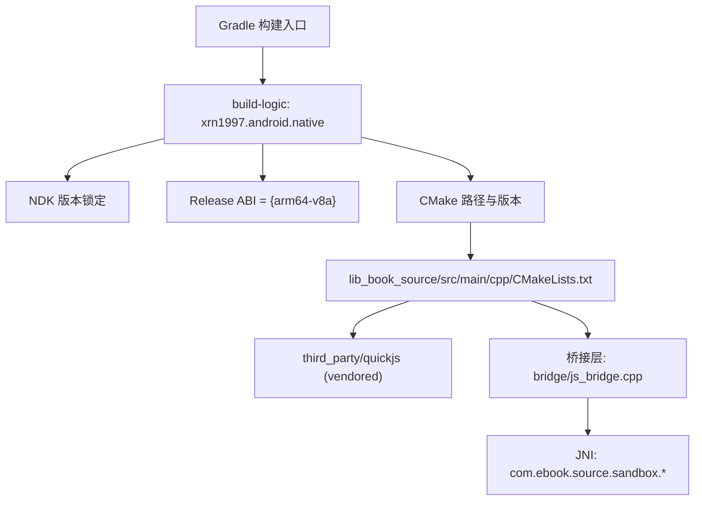
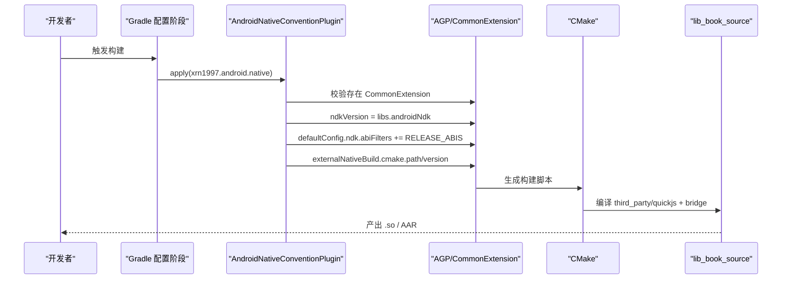
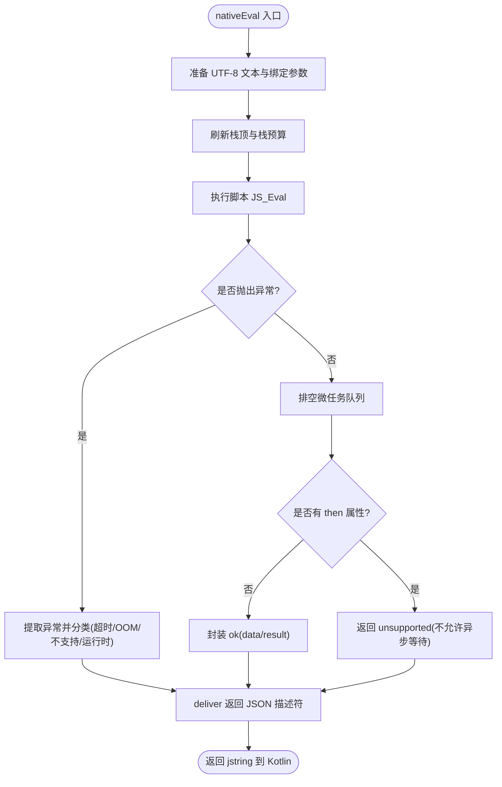
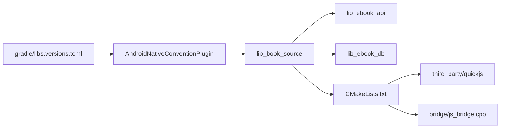

# 原生构建约定插件

<cite>
**本文引用的文件**
- [AndroidNativeConventionPlugin.kt](file://build-logic/convention/src/main/kotlin/AndroidNativeConventionPlugin.kt)
- [lib_book_source/build.gradle.kts](file://lib_book_source/build.gradle.kts)
- [CMakeLists.txt](file://lib_book_source/src/main/cpp/CMakeLists.txt)
- [js_bridge.cpp](file://lib_book_source/src/main/cpp/bridge/js_bridge.cpp)
- [libs.versions.toml](file://gradle/libs.versions.toml)
</cite>

## 目录
1. [简介](#简介)
2. [项目结构](#项目结构)
3. [核心组件](#核心组件)
4. [架构总览](#架构总览)
5. [详细组件分析](#详细组件分析)
6. [依赖关系分析](#依赖关系分析)
7. [性能考量](#性能考量)
8. [故障排查指南](#故障排查指南)
9. [结论](#结论)
10. [附录](#附录)

## 简介
本文档系统性说明 AndroidNativeConventionPlugin（xrn1997.android.native）如何为包含 C++ 的模块提供一致的 NDK/CMake 构建能力，并结合 lib_book_source 的 :js 沙箱实现，解释其 ABI 口径策略、QuickJS 内核编译与集成方式、CMakeLists 桥接层配置，以及与 Java/Kotlin 层的 JNI 调用约定。同时给出常见问题与最佳实践建议。

## 项目结构
本仓库通过 build-logic 集中管理跨模块构建约定。含原生代码的模块统一应用 xrn1997.android.native 插件以获取：
- 统一的 NDK 版本锁定
- Release ABI 最小集（仅 arm64-v8a）
- 指向 src/main/cpp/CMakeLists.txt 的 CMake 集成
- CMake 工具链版本锁定

lib_book_source 模块在 debug 中显式放宽 ABI 以支持模拟器调试（添加 x86_64），该放宽点位于模块自身构建脚本，便于审计“哪个模块多带了一份内核”。

图示来源
- [AndroidNativeConventionPlugin.kt:22-48](file://build-logic/convention/src/main/kotlin/AndroidNativeConventionPlugin.kt#L22-L48)
- [CMakeLists.txt:1-38](file://lib_book_source/src/main/cpp/CMakeLists.txt#L1-L38)

章节来源
- [AndroidNativeConventionPlugin.kt:22-48](file://build-logic/convention/src/main/kotlin/AndroidNativeConventionPlugin.kt#L22-L48)
- [lib_book_source/build.gradle.kts:13-25](file://lib_book_source/build.gradle.kts#L13-L25)

## 核心组件
- AndroidNativeConventionPlugin：为含 NDK/CMake 的模块注入统一的 NDK/CMake 配置，并限定 release ABI。
- lib_book_source/build.gradle.kts：声明使用 xrn1997.android.library 与 xrn1997.android.native；在 debug 中放宽 ABI 以支持模拟器。
- CMakeLists.txt：将 vendored QuickJS 作为静态库并入共享库 ebook_js；定义头文件搜索路径与编译选项；链接系统库。
- js_bridge.cpp：QuickJS 运行时与 Kotlin 之间的 JNI 桥接层，负责创建/销毁 runtime/context、执行脚本、内存/栈/超时控制、异常描述符序列化与回传。

章节来源
- [AndroidNativeConventionPlugin.kt:22-48](file://build-logic/convention/src/main/kotlin/AndroidNativeConventionPlugin.kt#L22-L48)
- [lib_book_source/build.gradle.kts:1-25](file://lib_book_source/build.gradle.kts#L1-L25)
- [CMakeLists.txt:1-38](file://lib_book_source/src/main/cpp/CMakeLists.txt#L1-L38)
- [js_bridge.cpp:691-820](file://lib_book_source/src/main/cpp/bridge/js_bridge.cpp#L691-L820)

## 架构总览
xrn1997.android.native 在应用时要求 Android 插件已先应用，随后：
- 从版本目录读取 androidNdk 与 cmake 版本并设置到 AGP 扩展
- 在 defaultConfig 中将 RELEASE_ABIS 追加到 abiFilters（release 仅 arm64-v8a）
- 将 externalNativeBuild.cmake.path 指向模块内 src/main/cpp/CMakeLists.txt，并设置 CMake 版本

lib_book_source 在 debug 中追加 x86_64，以便模拟器调试；release 保持最小 ABI 集合，降低包体积与可被逆向的内核副本数量。

图示来源
- [AndroidNativeConventionPlugin.kt:22-48](file://build-logic/convention/src/main/kotlin/AndroidNativeConventionPlugin.kt#L22-L48)
- [CMakeLists.txt:1-38](file://lib_book_source/src/main/cpp/CMakeLists.txt#L1-L38)

## 详细组件分析

### AndroidNativeConventionPlugin：NDK 与 ABI 策略
- 作用：集中管理 NDK 与 CMake 版本，强制 release 仅包含 arm64-v8a，避免不同机器上因默认 NDK 漂移导致不一致产物。
- 设计要点：
  - 必须后于 Android 插件应用，否则找不到 CommonExtension 会直接失败，避免“静默不生效”的隐患。
  - ABI 策略属于产品与安全语义，放在插件而非模块里，确保一处生效、一处审查。
  - 不在插件中放宽 debug ABI；模拟器所需的 x86_64 由模块自行在 debug 中添加，使“谁多带了内核”在 diff 中可见。
  - 版本来源：androidNdk 与 cmake 来自版本目录（libs.versions.toml），ABI 集合留在插件内（策略非版本）。

章节来源
- [AndroidNativeConventionPlugin.kt:6-21](file://build-logic/convention/src/main/kotlin/AndroidNativeConventionPlugin.kt#L6-L21)
- [AndroidNativeConventionPlugin.kt:22-48](file://build-logic/convention/src/main/kotlin/AndroidNativeConventionPlugin.kt#L22-L48)

### lib_book_source 构建：ABI 放宽与依赖
- 插件应用：使用 xrn1997.android.library 与 xrn1997.android.native。
- ABI 放宽：debug 中追加 x86_64，便于模拟器调试；release 仍受插件约束仅 arm64-v8a。
- 依赖：api 依赖 lib_ebook_api 与 lib_ebook_db；implementation 引入 jsoup、common、kotlinx-serialization-json；测试与仪器化测试依赖按需补齐。
- 桌面 JS 构建任务：仅在需要时构建开发机动态库（ebook_js.dll/libebook_js.so），供桌面端真内核用例加载。

章节来源
- [lib_book_source/build.gradle.kts:1-25](file://lib_book_source/build.gradle.kts#L1-L25)
- [lib_book_source/build.gradle.kts:33-69](file://lib_book_source/build.gradle.kts#L33-L69)
- [lib_book_source/build.gradle.kts:71-111](file://lib_book_source/build.gradle.kts#L71-L111)

### CMakeLists.txt：QuickJS 内核与桥接层集成
- 源码位置：third_party/quickjs 为 vendored 上游源码，本地修改与版本管理在此处进行。
- 构建目标：
  - quickjs 静态库：聚合 quickjs.c、libregexp.c、libunicode.c、cutils.c、dtoa.c。
  - ebook_js 共享库：仅桥接层 bridge/js_bridge.cpp，对外暴露 JNI。
- 头文件与宏：
  - 仅将 third_party 父目录加入 SYSTEM 搜索路径，避免 Windows 下大小写敏感问题导致的 <version> 冲突。
  - 定义 CONFIG_VERSION，以满足内核编译期需求。
- 编译选项：
  - quickjs：-O2 -fwrapv -funsigned-char 等内核必需行为开关，关闭部分警告以避免上游未覆盖的 NDK clang 告警。
  - ebook_js：-O2 -Wall -Wextra -fvisibility=hidden，隐藏内部符号减少暴露面。
- 链接库：log、dl、m；pthread 不显式链接（bionic 自 API 23 起内置 pthread 实现，-latomic 由 AGP 自动处理）。

章节来源
- [CMakeLists.txt:1-38](file://lib_book_source/src/main/cpp/CMakeLists.txt#L1-L38)

### js_bridge.cpp：JNI 桥接与运行时安全
- 职责边界：仅负责创建/管理 QuickJS runtime/context、执行脚本、资源限控、异常描述序列化与返回；不包含白名单、Binder、规则语法等业务逻辑。
- 关键机制：
  - 自定义分配器：拦截 malloc/realloc/free/usable_size，记录“分配被拒”，用于精准识别 OOM 场景。
  - 栈预算：每次执行前按当前线程剩余栈计算最大栈深，防止 SIGSEGV；对无法查询栈的场景采用保守假定值。
  - 超时中断：基于单调时钟的截止时间，到达即中断执行，避免长时间阻塞。
  - 微任务上限：限制 pending jobs 数量，阻断无界 Promise 循环。
  - 异常分类：区分超时、OOM、不支持特性、普通运行时错误，并输出稳定 JSON 描述符给 Kotlin 侧解析。
  - 宿主回调：通过全局方法引用调用 Kotlin HostDispatcher.handle，完成主进程与沙箱双向通信。
- JNI 接口：nativeCreate/nativeReset/nativeDestroy/nativeEval 暴露给 Kotlin 层，对应生命周期与执行入口。

图示来源
- [js_bridge.cpp:691-820](file://lib_book_source/src/main/cpp/bridge/js_bridge.cpp#L691-L820)
- [js_bridge.cpp:109-281](file://lib_book_source/src/main/cpp/bridge/js_bridge.cpp#L109-L281)
- [js_bridge.cpp:522-551](file://lib_book_source/src/main/cpp/bridge/js_bridge.cpp#L522-L551)

章节来源
- [js_bridge.cpp:1-108](file://lib_book_source/src/main/cpp/bridge/js_bridge.cpp#L1-L108)
- [js_bridge.cpp:109-281](file://lib_book_source/src/main/cpp/bridge/js_bridge.cpp#L109-L281)
- [js_bridge.cpp:522-551](file://lib_book_source/src/main/cpp/bridge/js_bridge.cpp#L522-L551)
- [js_bridge.cpp:691-820](file://lib_book_source/src/main/cpp/bridge/js_bridge.cpp#L691-L820)

## 依赖关系分析
- 版本管理：NDK 与 CMake 版本通过 gradle/libs.versions.toml 统一管理，避免硬编码。
- 模块依赖：lib_book_source 依赖 lib_ebook_api 与 lib_ebook_db 暴露的契约；jsoup 与序列化库仅 implementation 不向下游泄漏。
- 原生依赖：CMake 将 vendored QuickJS 静态库与桥接层合并为共享库；系统库 log/dl/m 按需链接。

图示来源
- [AndroidNativeConventionPlugin.kt:22-48](file://build-logic/convention/src/main/kotlin/AndroidNativeConventionPlugin.kt#L22-L48)
- [CMakeLists.txt:1-38](file://lib_book_source/src/main/cpp/CMakeLists.txt#L1-L38)

章节来源
- [lib_book_source/build.gradle.kts:33-69](file://lib_book_source/build.gradle.kts#L33-L69)
- [CMakeLists.txt:1-38](file://lib_book_source/src/main/cpp/CMakeLists.txt#L1-L38)

## 性能考量
- ABI 选择：release 仅 arm64-v8a 减少包体与可被逆向的内核副本；debug 增加 x86_64 提升模拟器调试效率。
- 编译优化：QuickJS 与桥接层均启用 -O2；桥接层开启 -fvisibility=hidden 减少符号暴露。
- 运行时开销：自定义分配器记录分配失败，帮助定位 OOM；栈预算与超时中断避免卡死与崩溃；微任务上限阻断无限 Promise 循环。
- 链接精简：不显式链接 pthread，依赖 bionic 内置实现，减少额外依赖。

[本节为通用指导，不直接分析具体文件]

## 故障排查指南
- NDK 版本兼容性问题
  - 现象：不同机器构建产物不一致或构建失败。
  - 排查：确认 androidNdk 版本来自版本目录且未被覆盖；若升级 NDK，需同步验证设备用例。
  - 依据：插件从版本目录取 androidNdk 并设置到 AGP。
- ABI 选择不当导致的问题
  - 现象：release 包过大或模拟器无法运行。
  - 排查：检查是否在 release 中误增 ABI；debug 如需模拟器则确保模块已在 debug 中追加 x86_64。
  - 依据：插件限定 release ABI；模块在 debug 放宽 ABI。
- 原生库混淆与保护
  - 现状：桥接层使用 -fvisibility=hidden 隐藏内部符号；如需进一步加固可在构建流程中加入符号剥离与加固策略。
  - 建议：仅暴露必要 JNI 函数；谨慎保留调试符号；结合 R8/Proguard 策略评估影响。
- JNI 桥接常见问题
  - 现象：沙箱进程启动失败、回调为空、异常信息丢失。
  - 排查：确认 ensure_dispatcher 成功；检查 host_call 返回值与异常处理；关注 deliver 兜底串的使用。
  - 依据：桥接层对 JNI 异常与 OOM 的多重兜底与日志记录。

章节来源
- [AndroidNativeConventionPlugin.kt:22-48](file://build-logic/convention/src/main/kotlin/AndroidNativeConventionPlugin.kt#L22-L48)
- [lib_book_source/build.gradle.kts:13-25](file://lib_book_source/build.gradle.kts#L13-L25)
- [js_bridge.cpp:553-578](file://lib_book_source/src/main/cpp/bridge/js_bridge.cpp#L553-L578)
- [js_bridge.cpp:653-687](file://lib_book_source/src/main/cpp/bridge/js_bridge.cpp#L653-L687)

## 结论
AndroidNativeConventionPlugin 将 NDK/CMake 配置与 ABI 策略收敛至一处，既保证构建一致性又强化安全与产品语义。lib_book_source 通过 CMake 集成 vendored QuickJS，并以桥接层实现安全的沙箱执行环境，具备内存/栈/超时/微任务等多维防护。配合版本目录管理与模块级 ABI 放宽策略，项目在可维护性、安全性与性能之间取得平衡。

[本节为总结，不直接分析具体文件]

## 附录
- 快速构建示例
  - 应用插件：在模块 build.gradle.kts 中应用 xrn1997.android.library 与 xrn1997.android.native。
  - ABI 放宽：在 debug 中追加 x86_64（如 lib_book_source 所示）。
  - CMake 集成：确保 src/main/cpp/CMakeLists.txt 存在并被插件发现。
  - 运行与测试：使用模拟器调试需包含 x86_64；release 仅 arm64-v8a。
- JNI 桥接约定与最佳实践
  - 仅暴露必要 JNI 函数；避免在主线程调用沙箱；严格管理局部引用与全局引用；异常一律转为稳定的 JSON 描述符返回。
  - 宿主回调通过 HostDispatcher.handle 统一处理；注意线程模型与回调顺序。
  - 资源限控：合理设置堆/栈/超时；关注微任务上限，防止自驱动循环。

章节来源
- [lib_book_source/build.gradle.kts:1-25](file://lib_book_source/build.gradle.kts#L1-L25)
- [CMakeLists.txt:1-38](file://lib_book_source/src/main/cpp/CMakeLists.txt#L1-L38)
- [js_bridge.cpp:691-820](file://lib_book_source/src/main/cpp/bridge/js_bridge.cpp#L691-L820)