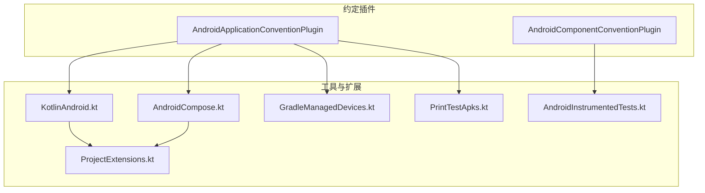
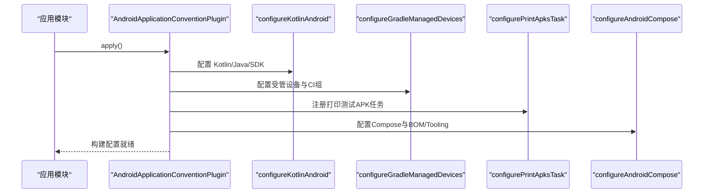
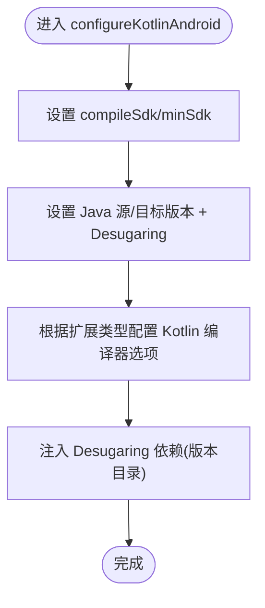
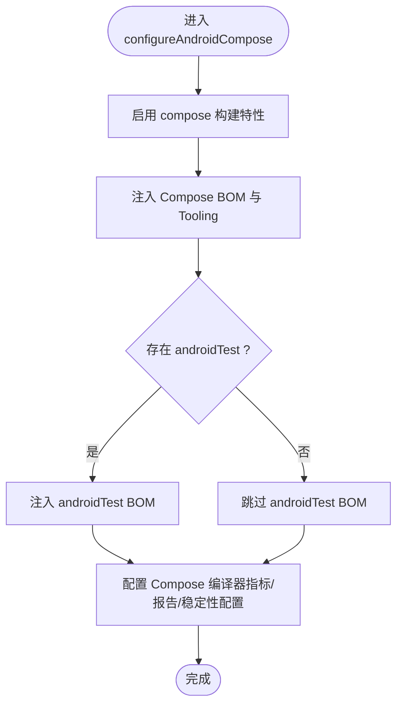
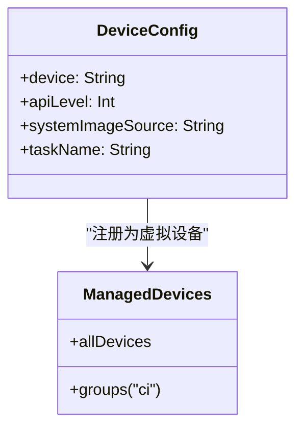
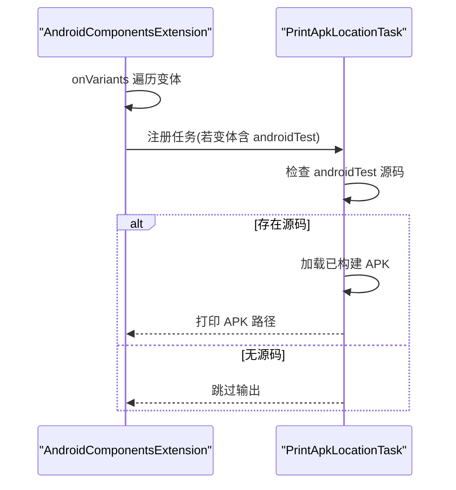
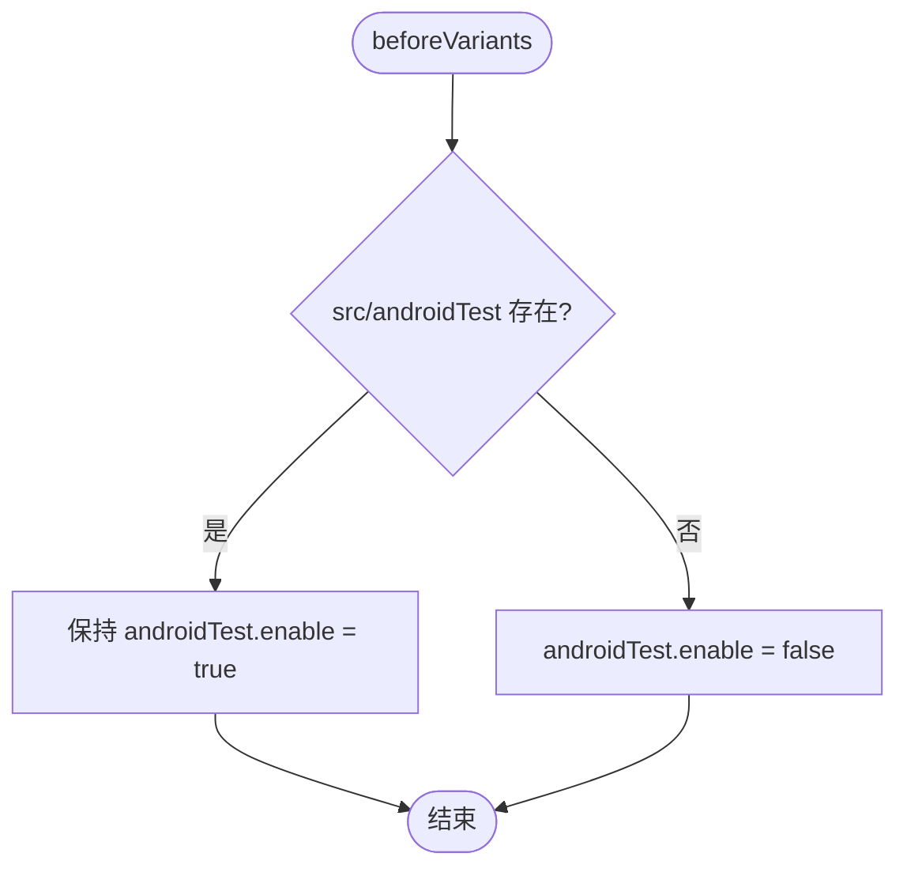
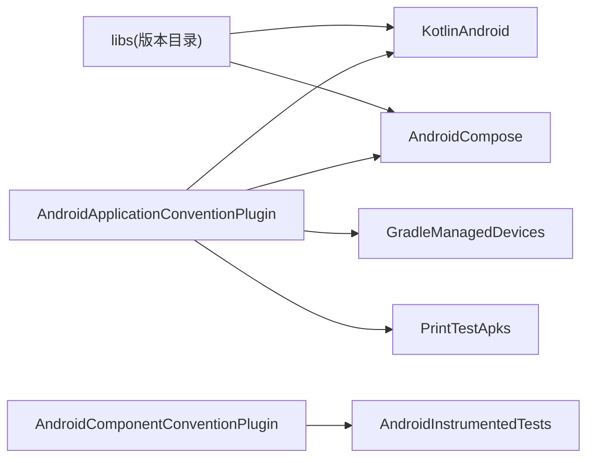

# 工具类与扩展函数

<cite>
**本文引用的文件**
- [KotlinAndroid.kt](file://build-logic/convention/src/main/kotlin/com/xrn1997/convention/KotlinAndroid.kt)
- [AndroidCompose.kt](file://build-logic/convention/src/main/kotlin/com/xrn1997/convention/AndroidCompose.kt)
- [GradleManagedDevices.kt](file://build-logic/convention/src/main/kotlin/com/xrn1997/convention/GradleManagedDevices.kt)
- [PrintTestApks.kt](file://build-logic/convention/src/main/kotlin/com/xrn1997/convention/PrintTestApks.kt)
- [AndroidInstrumentedTests.kt](file://build-logic/convention/src/main/kotlin/com/xrn1997/convention/AndroidInstrumentedTests.kt)
- [ProjectExtensions.kt](file://build-logic/convention/src/main/kotlin/com/xrn1997/convention/ProjectExtensions.kt)
- [AndroidApplicationConventionPlugin.kt](file://build-logic/convention/src/main/kotlin/AndroidApplicationConventionPlugin.kt)
- [AndroidComponentConventionPlugin.kt](file://build-logic/convention/src/main/kotlin/AndroidComponentConventionPlugin.kt)
</cite>

## 目录
1. [简介](#简介)
2. [项目结构](#项目结构)
3. [核心组件](#核心组件)
4. [架构总览](#架构总览)
5. [详细组件分析](#详细组件分析)
6. [依赖关系分析](#依赖关系分析)
7. [性能考虑](#性能考虑)
8. [故障排查指南](#故障排查指南)
9. [结论](#结论)
10. [附录：使用示例与最佳实践](#附录使用示例与最佳实践)

## 简介
本文件聚焦于 build-logic/convention 模块中的约定插件工具类与扩展函数，系统性说明它们在统一 Kotlin 编译选项、Compose 配置、设备管理、测试 APK 打印以及禁用不必要的 Android 插桩测试等方面的职责与用法。这些工具以可复用的 Gradle 扩展函数的形式组织，被上层约定插件组合调用，从而保证多模块构建行为一致、易于维护。

## 项目结构
- 工具类位于 com.xrn1997.convention 包下，提供对 Project 与 Android DSL 的扩展能力。
- 约定插件位于 build-logic/convention/src/main/kotlin 根目录下，负责将上述工具函数装配到具体 Android Application/Library 模块中。
- 通过版本目录（libs）集中管理依赖与 BOM，避免在构建脚本中硬编码版本号。

图表来源
- [AndroidApplicationConventionPlugin.kt:28-49](file://build-logic/convention/src/main/kotlin/AndroidApplicationConventionPlugin.kt#L28-L49)
- [AndroidComponentConventionPlugin.kt:7-34](file://build-logic/convention/src/main/kotlin/AndroidComponentConventionPlugin.kt#L7-L34)
- [KotlinAndroid.kt:34-91](file://build-logic/convention/src/main/kotlin/com/xrn1997/convention/KotlinAndroid.kt#L34-L91)
- [AndroidCompose.kt:29-75](file://build-logic/convention/src/main/kotlin/com/xrn1997/convention/AndroidCompose.kt#L29-L75)
- [GradleManagedDevices.kt:27-71](file://build-logic/convention/src/main/kotlin/com/xrn1997/convention/GradleManagedDevices.kt#L27-L71)
- [PrintTestApks.kt:40-107](file://build-logic/convention/src/main/kotlin/com/xrn1997/convention/PrintTestApks.kt#L40-L107)
- [AndroidInstrumentedTests.kt:30-35](file://build-logic/convention/src/main/kotlin/com/xrn1997/convention/AndroidInstrumentedTests.kt#L30-L35)
- [ProjectExtensions.kt:24-25](file://build-logic/convention/src/main/kotlin/com/xrn1997/convention/ProjectExtensions.kt#L24-L25)

章节来源
- [AndroidApplicationConventionPlugin.kt:28-49](file://build-logic/convention/src/main/kotlin/AndroidApplicationConventionPlugin.kt#L28-L49)
- [AndroidComponentConventionPlugin.kt:7-34](file://build-logic/convention/src/main/kotlin/AndroidComponentConventionPlugin.kt#L7-L34)

## 核心组件
- KotlinAndroid：统一配置 Kotlin 编译目标、Java 兼容性与 Android 编译 SDK；开启 Desugaring 并注入公共依赖。
- AndroidCompose：启用 Compose 构建特性、注入 BOM 与 UI Tooling 依赖，并配置 Compose 编译器指标与报告输出路径。
- GradleManagedDevices：声明一组受管虚拟设备，并创建 CI 设备组，便于自动化测试执行。
- PrintTestApks：为每个带 androidTest 的变体注册任务，打印最终测试 APK 的路径，辅助调试与发布定位。
- AndroidInstrumentedTests：当模块不存在 androidTest 源码时，禁用该变体的 androidTest 构建，避免无意义的打包与运行。
- ProjectExtensions：暴露 libs 版本目录访问器，供各工具函数统一引用依赖。

章节来源
- [KotlinAndroid.kt:34-91](file://build-logic/convention/src/main/kotlin/com/xrn1997/convention/KotlinAndroid.kt#L34-L91)
- [AndroidCompose.kt:29-75](file://build-logic/convention/src/main/kotlin/com/xrn1997/convention/AndroidCompose.kt#L29-L75)
- [GradleManagedDevices.kt:27-71](file://build-logic/convention/src/main/kotlin/com/xrn1997/convention/GradleManagedDevices.kt#L27-L71)
- [PrintTestApks.kt:40-107](file://build-logic/convention/src/main/kotlin/com/xrn1997/convention/PrintTestApks.kt#L40-L107)
- [AndroidInstrumentedTests.kt:30-35](file://build-logic/convention/src/main/kotlin/com/xrn1997/convention/AndroidInstrumentedTests.kt#L30-L35)
- [ProjectExtensions.kt:24-25](file://build-logic/convention/src/main/kotlin/com/xrn1997/convention/ProjectExtensions.kt#L24-L25)

## 架构总览
下图展示了应用模块约定插件如何组合上述工具函数，完成 Kotlin、Compose、设备管理、测试 APK 打印等构建期配置。

图表来源
- [AndroidApplicationConventionPlugin.kt:28-49](file://build-logic/convention/src/main/kotlin/AndroidApplicationConventionPlugin.kt#L28-L49)
- [KotlinAndroid.kt:34-91](file://build-logic/convention/src/main/kotlin/com/xrn1997/convention/KotlinAndroid.kt#L34-L91)
- [GradleManagedDevices.kt:27-71](file://build-logic/convention/src/main/kotlin/com/xrn1997/convention/GradleManagedDevices.kt#L27-L71)
- [PrintTestApks.kt:40-68](file://build-logic/convention/src/main/kotlin/com/xrn1997/convention/PrintTestApks.kt#L40-L68)
- [AndroidCompose.kt:29-75](file://build-logic/convention/src/main/kotlin/com/xrn1997/convention/AndroidCompose.kt#L29-L75)

## 详细组件分析

### KotlinAndroid：Kotlin 与 Java 编译统一配置
- 功能要点
  - 设置 compileSdk、minSdk 与 Java 源/目标版本（JDK 17）。
  - 启用 Desugaring，并注入对应依赖。
  - 通过统一的 configureKotlin<T>() 设置 JVM 目标、警告即错误开关、协程实验 API 白名单等。
  - 提供 JvmTarget 与 warningsAsErrors 的可控开关，便于在不同环境调整严格度。
- 关键流程
  - 对 CommonExtension 进行基础配置后，再按 Android/JVM 分支设置 Kotlin 编译器选项。
  - 通过版本目录统一引入 Desugaring 库。
- 复杂度与性能
  - 配置阶段仅做常量赋值与依赖注入，开销极低。
  - warningsAsErrors 可通过 gradle.properties 开关，避免本地与 CI 差异导致的失败。
- 依赖关系
  - 依赖 AGP 的 CommonExtension、Kotlin 扩展类型。
  - 通过 ProjectExtensions 的 libs 访问版本目录。

图表来源
- [KotlinAndroid.kt:34-91](file://build-logic/convention/src/main/kotlin/com/xrn1997/convention/KotlinAndroid.kt#L34-L91)
- [ProjectExtensions.kt:24-25](file://build-logic/convention/src/main/kotlin/com/xrn1997/convention/ProjectExtensions.kt#L24-L25)

章节来源
- [KotlinAndroid.kt:34-91](file://build-logic/convention/src/main/kotlin/com/xrn1997/convention/KotlinAndroid.kt#L34-L91)

### AndroidCompose：Compose 构建与工具链配置
- 功能要点
  - 启用 compose 构建特性。
  - 注入 Compose BOM 与 UI Tooling（preview/debug），并根据是否存在 androidTest 决定是否注入 androidTestImplementation 的 BOM。
  - 通过 ComposeCompilerGradlePluginExtension 配置指标与报告输出目录，并添加稳定性配置文件。
- 关键流程
  - 条件判断是否包含 androidTest 源码目录，以匹配 disableUnnecessaryAndroidTests 的行为，避免无关告警。
  - 使用相对根项目的目录策略输出指标/报告，便于集中收集。
- 性能与注意事项
  - 不默认开启 unit test 的资源包含，由需要读资源的模块自行开启，避免全量拖慢配置阶段。
  - 指标与报告仅在启用相应属性时生成，降低常规构建开销。

图表来源
- [AndroidCompose.kt:29-75](file://build-logic/convention/src/main/kotlin/com/xrn1997/convention/AndroidCompose.kt#L29-L75)

章节来源
- [AndroidCompose.kt:29-75](file://build-logic/convention/src/main/kotlin/com/xrn1997/convention/AndroidCompose.kt#L29-L75)

### GradleManagedDevices：受管设备与 CI 组
- 功能要点
  - 定义一组常用设备（Pixel 4/6/C），并为每个设备生成唯一 taskName。
  - 在 managedDevices.allDevices 中注册设备，并创建名为 ci 的设备组，仅包含适合 CI 的设备。
- 使用方式
  - 在应用模块的 ApplicationExtension 中调用，即可自动获得受管设备与 CI 组。
- 影响范围
  - 不影响普通构建，仅在执行 connected* 或受管设备相关任务时生效。

图表来源
- [GradleManagedDevices.kt:27-71](file://build-logic/convention/src/main/kotlin/com/xrn1997/convention/GradleManagedDevices.kt#L27-L71)

章节来源
- [GradleManagedDevices.kt:27-71](file://build-logic/convention/src/main/kotlin/com/xrn1997/convention/GradleManagedDevices.kt#L27-L71)

### PrintTestApks：测试 APK 打印任务
- 功能要点
  - 针对每个具有 androidTest 的变体，注册一个自定义任务用于打印最终测试 APK 路径。
  - 任务会检查 androidTest 源码是否存在，若无则直接跳过输出，避免噪音。
  - 通过 BuiltArtifactsLoader 加载已构建产物，确保路径指向真实生成的 APK。
- 执行时机
  - 在 onVariants 回调中注册任务，任务在执行阶段读取产物并打印。
- 典型用途
  - 快速定位某个变体的测试 APK，便于手动安装或上传到云端。

图表来源
- [PrintTestApks.kt:40-107](file://build-logic/convention/src/main/kotlin/com/xrn1997/convention/PrintTestApks.kt#L40-L107)

章节来源
- [PrintTestApks.kt:40-107](file://build-logic/convention/src/main/kotlin/com/xrn1997/convention/PrintTestApks.kt#L40-L107)

### AndroidInstrumentedTests：禁用不必要的 Android 插桩测试
- 功能要点
  - 对 Library 模块的变体，在未存在 src/androidTest 目录时禁用 androidTest 构建。
  - 避免“启动 0 个测试”的无效过程，提升整体构建速度。
- 适用场景
  - 纯库模块通常不需要 androidTest，但 AGP 仍可能尝试打包与安装，此扩展消除该浪费。

图表来源
- [AndroidInstrumentedTests.kt:30-35](file://build-logic/convention/src/main/kotlin/com/xrn1997/convention/AndroidInstrumentedTests.kt#L30-L35)

章节来源
- [AndroidInstrumentedTests.kt:30-35](file://build-logic/convention/src/main/kotlin/com/xrn1997/convention/AndroidInstrumentedTests.kt#L30-L35)

## 依赖关系分析
- 版本目录访问
  - 所有工具函数通过 ProjectExtensions 暴露的 libs 访问版本目录，确保依赖版本统一管理。
- 约定插件组合
  - AndroidApplicationConventionPlugin 组合了 KotlinAndroid、GradleManagedDevices、PrintTestApks、AndroidCompose。
  - AndroidComponentConventionPlugin 负责不同 isModule 下的 manifest 与源码目录选择，并配合 AndroidInstrumentedTests 优化构建。
- 耦合性
  - 工具函数均为内部函数，仅被约定插件调用，对外部模块透明，耦合低、内聚高。

图表来源
- [ProjectExtensions.kt:24-25](file://build-logic/convention/src/main/kotlin/com/xrn1997/convention/ProjectExtensions.kt#L24-L25)
- [AndroidApplicationConventionPlugin.kt:28-49](file://build-logic/convention/src/main/kotlin/AndroidApplicationConventionPlugin.kt#L28-L49)
- [AndroidComponentConventionPlugin.kt:7-34](file://build-logic/convention/src/main/kotlin/AndroidComponentConventionPlugin.kt#L7-L34)

章节来源
- [ProjectExtensions.kt:24-25](file://build-logic/convention/src/main/kotlin/com/xrn1997/convention/ProjectExtensions.kt#L24-L25)
- [AndroidApplicationConventionPlugin.kt:28-49](file://build-logic/convention/src/main/kotlin/AndroidApplicationConventionPlugin.kt#L28-L49)
- [AndroidComponentConventionPlugin.kt:7-34](file://build-logic/convention/src/main/kotlin/AndroidComponentConventionPlugin.kt#L7-L34)

## 性能考虑
- 配置阶段最小化
  - 未启用 Compose 指标/报告时，避免生成额外文件。
  - 不默认开启 unit test 的资源包含，按需启用。
- 构建速度优化
  - 通过 disableUnnecessaryAndroidTests 减少无 androidTest 模块的无效打包与安装。
  - 受管设备仅在 CI 组或显式任务时参与，不影响普通构建。
- 缓存友好
  - PrintTestApks 任务标注 DisableCachingByDefault，因其输出为日志而非构建产物，符合 Gradle 缓存语义。

[本节为通用指导，无需列出具体文件来源]

## 故障排查指南
- Compose 指标/报告未生成
  - 检查是否启用了相应的 gradle.properties 开关，并确认输出目录相对于根项目正确。
- androidTest 变体被禁用
  - 确认 src/androidTest 目录是否存在；若确实没有，这是预期行为以避免无意义构建。
- 测试 APK 路径未打印
  - 若 androidTest 无源码，任务会跳过输出；若有源码但未打印，检查是否成功构建了测试变体。
- Kotlin 编译错误或警告
  - 调整 warningsAsErrors 开关；确保 JVM 目标与 Java 版本一致。

章节来源
- [AndroidCompose.kt:54-74](file://build-logic/convention/src/main/kotlin/com/xrn1997/convention/AndroidCompose.kt#L54-L74)
- [AndroidInstrumentedTests.kt:30-35](file://build-logic/convention/src/main/kotlin/com/xrn1997/convention/AndroidInstrumentedTests.kt#L30-L35)
- [PrintTestApks.kt:88-106](file://build-logic/convention/src/main/kotlin/com/xrn1997/convention/PrintTestApks.kt#L88-L106)
- [KotlinAndroid.kt:73-91](file://build-logic/convention/src/main/kotlin/com/xrn1997/convention/KotlinAndroid.kt#L73-L91)

## 结论
这些工具类与扩展函数以“小而专”的方式封装了常见的 Android 构建配置需求，并通过约定插件组合复用，显著提升了多模块项目的一致性与可维护性。它们遵循版本目录管理、按需启用、最小化配置开销等原则，既保证了构建质量，也兼顾了开发体验与 CI 效率。

[本节为总结性内容，无需列出具体文件来源]

## 附录：使用示例与最佳实践

- 如何在应用模块中使用
  - 应用 Android 应用约定插件后，会自动触发 Kotlin 编译、Compose、设备管理与测试 APK 打印等配置，无需在模块 build.gradle.kts 中重复配置。
  - 如需独立控制某些选项，可在 gradle.properties 中切换 warningsAsErrors、enableComposeCompilerMetrics、enableComposeCompilerReports。

- 编写可复用的 Gradle 扩展函数
  - 将横切关注点抽象为内部扩展函数，参数尽量为 DSL 对象或 Provider，减少对 Project 的直接耦合。
  - 使用版本目录统一依赖，避免在多个位置硬编码版本。
  - 对可选功能使用 Provider 与条件逻辑，按需启用，降低默认开销。

- 组织工具类结构
  - 按职责拆分文件：KotlinAndroid、AndroidCompose、GradleManagedDevices、PrintTestApks、AndroidInstrumentedTests。
  - 通过 ProjectExtensions 暴露通用访问器（如 libs），提高内聚与可读性。

- 测试自定义 Gradle 插件
  - 使用 Gradle 插件测试框架对约定插件进行集成测试，验证 DSL 配置是否按预期生效。
  - 针对工具函数，可通过构造最小化 Project 与 Extension 进行测试，覆盖边界条件（如无 androidTest 目录、无 Compose 资源等）。

章节来源
- [AndroidApplicationConventionPlugin.kt:28-49](file://build-logic/convention/src/main/kotlin/AndroidApplicationConventionPlugin.kt#L28-L49)
- [ProjectExtensions.kt:24-25](file://build-logic/convention/src/main/kotlin/com/xrn1997/convention/ProjectExtensions.kt#L24-L25)
- [AndroidInstrumentedTests.kt:30-35](file://build-logic/convention/src/main/kotlin/com/xrn1997/convention/AndroidInstrumentedTests.kt#L30-L35)
- [AndroidCompose.kt:29-75](file://build-logic/convention/src/main/kotlin/com/xrn1997/convention/AndroidCompose.kt#L29-L75)
- [GradleManagedDevices.kt:27-71](file://build-logic/convention/src/main/kotlin/com/xrn1997/convention/GradleManagedDevices.kt#L27-L71)
- [PrintTestApks.kt:40-107](file://build-logic/convention/src/main/kotlin/com/xrn1997/convention/PrintTestApks.kt#L40-L107)
- [KotlinAndroid.kt:34-91](file://build-logic/convention/src/main/kotlin/com/xrn1997/convention/KotlinAndroid.kt#L34-L91)