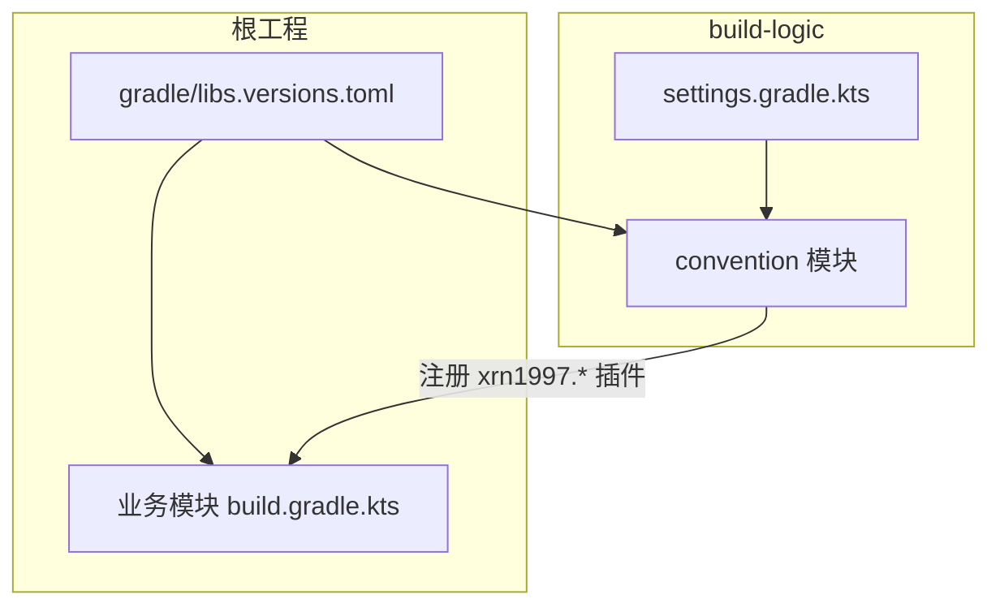
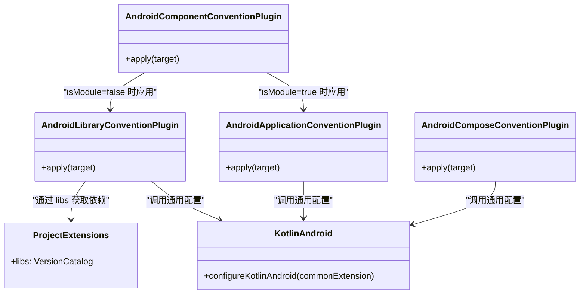
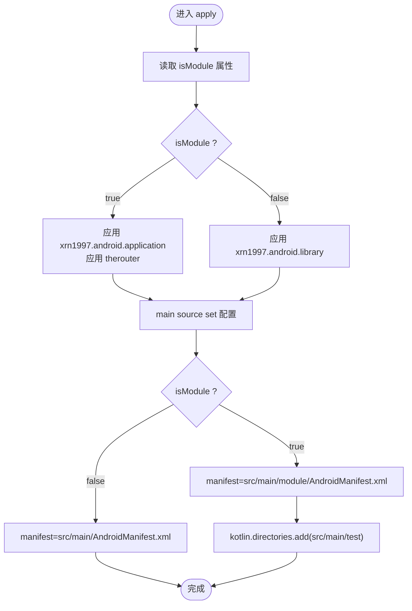

# 插件总览与约定体系

<cite>
**本文引用的文件**   
- [build-logic/settings.gradle.kts](file://build-logic/settings.gradle.kts)
- [gradle/libs.versions.toml](file://gradle/libs.versions.toml)
- [build-logic/convention/build.gradle.kts](file://build-logic/convention/build.gradle.kts)
- [AndroidComponentConventionPlugin.kt](file://build-logic/convention/src/main/kotlin/AndroidComponentConventionPlugin.kt)
- [AndroidApplicationConventionPlugin.kt](file://build-logic/convention/src/main/kotlin/AndroidApplicationConventionPlugin.kt)
- [AndroidLibraryConventionPlugin.kt](file://build-logic/convention/src/main/kotlin/AndroidLibraryConventionPlugin.kt)
- [ProjectExtensions.kt](file://build-logic/convention/src/main/kotlin/com/xrn1997/convention/ProjectExtensions.kt)
- [KotlinAndroid.kt](file://build-logic/convention/src/main/kotlin/com/xrn1997/convention/KotlinAndroid.kt)
- [AndroidComposeConventionPlugin.kt](file://build-logic/convention/src/main/kotlin/AndroidComposeConventionPlugin.kt)
</cite>

## 目录
1. [简介](#简介)
2. [项目结构](#项目结构)
3. [核心组件](#核心组件)
4. [架构总览](#架构总览)
5. [详细组件分析](#详细组件分析)
6. [依赖关系分析](#依赖关系分析)
7. [性能考量](#性能考量)
8. [故障排查指南](#故障排查指南)
9. [结论](#结论)
10. [附录：使用示例与最佳实践](#附录使用示例与最佳实践)

## 简介
本仓库通过 build-logic 模块提供一套“约定式”的 Gradle 插件体系，统一 Android、Kotlin、Compose、Hilt、Room、Lint、原生构建等基础能力装配，使业务模块只需 apply 少量约定插件即可获得一致的构建体验。约定插件 ID 统一以 xrn1997.* 前缀命名，并通过版本目录集中管理依赖与插件坐标；AndroidComponentConventionPlugin 作为门面插件，依据 isModule 属性动态选择 application 或 library 分支，实现功能模块既可被集成构建，又可独立运行。

## 项目结构
- build-logic 是独立的子工程，包含 convention 子模块，负责产出约定插件。
- convention 模块仅声明 compileOnly 对各类 Gradle 插件 API 的引用，并在 gradlePlugin {} 块中注册自定义插件 ID 到实现类映射。
- settings.gradle.kts 为 build-logic 定义仓库源、版本目录（libs），并 include :convention。
- 根级 gradle/libs.versions.toml 集中声明第三方库、Gradle 插件及自定义插件 ID 的别名，供 convention 模块与业务模块共同消费。

图表来源
- [build-logic/settings.gradle.kts:16-49](file://build-logic/settings.gradle.kts#L16-L49)
- [gradle/libs.versions.toml:214-237](file://gradle/libs.versions.toml#L214-L237)
- [build-logic/convention/build.gradle.kts:40-79](file://build-logic/convention/build.gradle.kts#L40-L79)

章节来源
- [build-logic/settings.gradle.kts:16-49](file://build-logic/settings.gradle.kts#L16-L49)
- [gradle/libs.versions.toml:214-237](file://gradle/libs.versions.toml#L214-L237)
- [build-logic/convention/build.gradle.kts:40-79](file://build-logic/convention/build.gradle.kts#L40-L79)

## 核心组件
- AndroidComponentConventionPlugin：门面插件，根据 isModule 决定应用 application 或 library 约定，并配置清单与源码集。
- AndroidApplicationConventionPlugin：应用 com.android.application、xrn1997.android.lint，并调用通用 Kotlin/AGP 配置。
- AndroidLibraryConventionPlugin：应用 com.android.library、xrn1997.android.lint，并注入测试与追踪依赖。
- AndroidComposeConventionPlugin：按 isModule 套入基础 Android 插件后启用 Compose 编译能力。
- ProjectExtensions：提供 libs 扩展，读取名为 libs 的版本目录实例。
- KotlinAndroid：集中设置 compileSdk/minSdk/Java 版本、JVM target、Desugar、Kotlin 编译器参数等。

章节来源
- [AndroidComponentConventionPlugin.kt:7-34](file://build-logic/convention/src/main/kotlin/AndroidComponentConventionPlugin.kt#L7-L34)
- [AndroidApplicationConventionPlugin.kt:28-49](file://build-logic/convention/src/main/kotlin/AndroidApplicationConventionPlugin.kt#L28-L49)
- [AndroidLibraryConventionPlugin.kt:30-69](file://build-logic/convention/src/main/kotlin/AndroidLibraryConventionPlugin.kt#L30-L69)
- [AndroidComposeConventionPlugin.kt:37-60](file://build-logic/convention/src/main/kotlin/AndroidComposeConventionPlugin.kt#L37-L60)
- [ProjectExtensions.kt:24-25](file://build-logic/convention/src/main/kotlin/com/xrn1997/convention/ProjectExtensions.kt#L24-L25)
- [KotlinAndroid.kt:34-56](file://build-logic/convention/src/main/kotlin/com/xrn1997/convention/KotlinAndroid.kt#L34-L56)
- [KotlinAndroid.kt:73-91](file://build-logic/convention/src/main/kotlin/com/xrn1997/convention/KotlinAndroid.kt#L73-L91)

## 架构总览
约定插件体系将“重复的构建脚本”收敛至 build-logic 中，各业务模块仅需 apply 约定插件即可继承统一的 AGP/Kotlin/Compose/Hilt/Room/Lint 配置。AndroidComponentConventionPlugin 承担路由职责：isModule=true 时走 application 分支（独立运行），否则走 library 分支（被 module_app 依赖）。Compose 能力通过 AndroidComposeConventionPlugin 统一开启，避免在各模块重复配置。

图表来源
- [AndroidComponentConventionPlugin.kt:7-34](file://build-logic/convention/src/main/kotlin/AndroidComponentConventionPlugin.kt#L7-L34)
- [AndroidApplicationConventionPlugin.kt:28-49](file://build-logic/convention/src/main/kotlin/AndroidApplicationConventionPlugin.kt#L28-L49)
- [AndroidLibraryConventionPlugin.kt:30-69](file://build-logic/convention/src/main/kotlin/AndroidLibraryConventionPlugin.kt#L30-L69)
- [AndroidComposeConventionPlugin.kt:37-60](file://build-logic/convention/src/main/kotlin/AndroidComposeConventionPlugin.kt#L37-L60)
- [KotlinAndroid.kt:34-56](file://build-logic/convention/src/main/kotlin/com/xrn1997/convention/KotlinAndroid.kt#L34-L56)
- [ProjectExtensions.kt:24-25](file://build-logic/convention/src/main/kotlin/com/xrn1997/convention/ProjectExtensions.kt#L24-L25)

## 详细组件分析

### 门面插件：AndroidComponentConventionPlugin
- 作用：根据 isModule 属性在 application 与 library 之间切换，并配置 Manifest 路径与 Kotlin 源码目录。
- 关键点：
  - isModule 从 project property 读取，默认 false。
  - 独立模式（isModule=true）：应用 application 约定与 therouter 插件，manifest 指向 src/main/module/AndroidManifest.xml，并将 src/main/test 加入 kotlin.directories，确保独立运行时 mock 宿主参与编译。
  - 集成模式（isModule=false）：应用 library 约定，manifest 指向 src/main/AndroidManifest.xml。
  - jniLibs 目录在 main source set 下统一添加，便于 NDK 产物接入。

图表来源
- [AndroidComponentConventionPlugin.kt:7-34](file://build-logic/convention/src/main/kotlin/AndroidComponentConventionPlugin.kt#L7-L34)

章节来源
- [AndroidComponentConventionPlugin.kt:7-34](file://build-logic/convention/src/main/kotlin/AndroidComponentConventionPlugin.kt#L7-L34)

### Application 约定：AndroidApplicationConventionPlugin
- 作用：装配 com.android.application、xrn1997.android.lint，并调用通用 Kotlin/AGP 配置（compileSdk/minSdk/JDK target 等）。
- 特点：遵循 AGP 9 内置 Kotlin 的规则，不再单独应用 KGP；通过 ApplicationAndroidComponentsExtension 打印构建产物信息。

章节来源
- [AndroidApplicationConventionPlugin.kt:28-49](file://build-logic/convention/src/main/kotlin/AndroidApplicationConventionPlugin.kt#L28-L49)

### Library 约定：AndroidLibraryConventionPlugin
- 作用：装配 com.android.library、xrn1997.android.lint，注入单元测试与 androidTest 依赖（仅在存在 androidTest 目录时注入以避免告警），统一目标 SDK 与动画禁用等。
- 通过 ProjectExtensions 提供的 libs 访问版本目录中的依赖项。

章节来源
- [AndroidLibraryConventionPlugin.kt:30-69](file://build-logic/convention/src/main/kotlin/AndroidLibraryConventionPlugin.kt#L30-L69)
- [ProjectExtensions.kt:24-25](file://build-logic/convention/src/main/kotlin/com/xrn1997/convention/ProjectExtensions.kt#L24-L25)

### Compose 约定：AndroidComposeConventionPlugin
- 作用：按 isModule 自动套入 application/library 基础插件，再应用 org.jetbrains.kotlin.plugin.compose，并以 CommonExtension 统一配置 Compose 能力。
- 说明：该插件既可用于 library 也可用于 application，ID 不带类型前缀，便于跨模块复用。

章节来源
- [AndroidComposeConventionPlugin.kt:37-60](file://build-logic/convention/src/main/kotlin/AndroidComposeConventionPlugin.kt#L37-L60)

### Kotlin 与 AGP 统一配置：KotlinAndroid
- 作用：集中设置 compileSdk、minSdk、Java 版本、Desugar、Kotlin JVM target、警告策略与协程实验特性开关。
- 影响：所有通过 configureKotlinAndroid 的 Android 模块均获得一致的基础编译行为。

章节来源
- [KotlinAndroid.kt:34-56](file://build-logic/convention/src/main/kotlin/com/xrn1997/convention/KotlinAndroid.kt#L34-L56)
- [KotlinAndroid.kt:73-91](file://build-logic/convention/src/main/kotlin/com/xrn1997/convention/KotlinAndroid.kt#L73-L91)

### 版本目录与 libs 扩展：ProjectExtensions 与 libs.versions.toml
- ProjectExtensions 提供 Project.libs 扩展，读取名为 libs 的版本目录实例。
- build-logic 的 settings.gradle.kts 通过 versionCatalogs.create("libs") 将根工程的 gradle/libs.versions.toml 暴露给 build-logic 内部模块使用。
- 根级版本目录集中定义插件与依赖坐标，包括 xrn1997.* 自定义插件 ID 的别名，以及第三方库版本。

章节来源
- [ProjectExtensions.kt:24-25](file://build-logic/convention/src/main/kotlin/com/xrn1997/convention/ProjectExtensions.kt#L24-L25)
- [build-logic/settings.gradle.kts:25-46](file://build-logic/settings.gradle.kts#L25-L46)
- [gradle/libs.versions.toml:214-237](file://gradle/libs.versions.toml#L214-L237)

## 依赖关系分析
- 插件注册：convention 模块在 gradlePlugin {} 中将 xrn1997.* 插件 ID 映射到具体实现类，这些 ID 在版本目录中以别名形式定义，便于全局统一维护。
- 依赖方向：
  - 业务模块 → 约定插件（xrn1997.android.component / .application / .library / .compose / .hilt / .room / .lint）
  - 约定插件 → 版本目录（libs）→ 第三方库与插件坐标
  - 约定插件 → AGP/Kotlin/Compose/Hilt/Room/Lint 官方插件（通过 apply 或依赖引入）

图表来源
- [build-logic/convention/build.gradle.kts:40-79](file://build-logic/convention/build.gradle.kts#L40-L79)
- [gradle/libs.versions.toml:214-237](file://gradle/libs.versions.toml#L214-L237)

章节来源
- [build-logic/convention/build.gradle.kts:40-79](file://build-logic/convention/build.gradle.kts#L40-L79)
- [gradle/libs.versions.toml:214-237](file://gradle/libs.versions.toml#L214-L237)

## 性能考量
- 使用约定插件减少重复配置，降低构建脚本解析与任务图复杂度，有助于提升增量构建效率。
- 通过 disableUnnecessaryAndroidTests 与按需注入 test 依赖，减少无关任务的执行。
- 将 Kotlin 编译选项集中在一处，避免多处重复声明导致的配置冲突与额外计算。

[本节为通用指导，不直接分析具体文件]

## 故障排查指南
- isModule 设置不当
  - 症状：集成态无法构建、独立态缺少入口或路由丢失。
  - 排查：确认 isModule 在提交态为 false；临时调试改为 true 后务必改回，不要提交。
  - 参考：AndroidComponentConventionPlugin 对 isModule 的判断与源码集/清单切换逻辑。
  - 章节来源
    - [AndroidComponentConventionPlugin.kt:7-34](file://build-logic/convention/src/main/kotlin/AndroidComponentConventionPlugin.kt#L7-L34)

- AGP 9 内置 Kotlin 的影响
  - 现象：不再需要单独应用 KGP；若错误地再次应用 KGP 可能产生冲突。
  - 处理：遵循约定插件内注释指引，保持由 AGP 提供 Kotlin 支持。
  - 章节来源
    - [AndroidApplicationConventionPlugin.kt:28-49](file://build-logic/convention/src/main/kotlin/AndroidApplicationConventionPlugin.kt#L28-L49)
    - [AndroidLibraryConventionPlugin.kt:30-69](file://build-logic/convention/src/main/kotlin/AndroidLibraryConventionPlugin.kt#L30-L69)

- KSP 与 Kotlin 编译任务的关系错位
  - 症状：KSP 生成了代码但 Kotlin 未编译导致找不到类。
  - 原因：新增源码目录应使用 kotlin.directories.add(...)，而非 java.srcDirs(...)（后者不被 Kotlin 编译任务拾取）。
  - 参考：AndroidComponentConventionPlugin 中对 kotlin.directories 的使用。
  - 章节来源
    - [AndroidComponentConventionPlugin.kt:18-31](file://build-logic/convention/src/main/kotlin/AndroidComponentConventionPlugin.kt#L18-L31)

- 版本目录不可用
  - 症状：libs.xxx 解析失败。
  - 排查：确认 build-logic 的 settings.gradle.kts 已创建 libs 版本目录，且根目录存在 gradle/libs.versions.toml。
  - 章节来源
    - [build-logic/settings.gradle.kts:25-46](file://build-logic/settings.gradle.kts#L25-L46)
    - [gradle/libs.versions.toml:214-237](file://gradle/libs.versions.toml#L214-L237)

- Compose 能力未生效
  - 症状：Composable 编译报错或缺少依赖。
  - 处理：确保模块应用了 xrn1997.android.compose；该插件会按 isModule 自动套入基础 Android 插件并启用 Compose 编译。
  - 章节来源
    - [AndroidComposeConventionPlugin.kt:37-60](file://build-logic/convention/src/main/kotlin/AndroidComposeConventionPlugin.kt#L37-L60)

## 结论
通过 build-logic 的约定插件体系，项目实现了“一次定义、处处可用”的构建一致性。AndroidComponentConventionPlugin 作为门面插件，依据 isModule 动态分发；KotlinAndroid 统一编译基线；AndroidComposeConventionPlugin 提供跨类型的 Compose 能力；版本目录集中管理依赖与插件坐标。这套体系显著降低了业务模块的构建复杂度，提升了可维护性与构建性能。

[本节为总结性内容，不直接分析具体文件]

## 附录：使用示例与最佳实践

### 插件加载顺序与依赖关系
- 门面优先：业务模块先应用 xrn1997.android.component，由其决定 application 或 library 分支。
- 能力叠加：如需 Compose/Hilt/Room/Lint，再分别应用对应约定插件。
- 版本目录：所有依赖与插件坐标通过 libs.versions.toml 管理，约定插件通过 ProjectExtensions 的 libs 扩展访问。

章节来源
- [AndroidComponentConventionPlugin.kt:7-34](file://build-logic/convention/src/main/kotlin/AndroidComponentConventionPlugin.kt#L7-L34)
- [AndroidComposeConventionPlugin.kt:37-60](file://build-logic/convention/src/main/kotlin/AndroidComposeConventionPlugin.kt#L37-L60)
- [ProjectExtensions.kt:24-25](file://build-logic/convention/src/main/kotlin/com/xrn1997/convention/ProjectExtensions.kt#L24-L25)
- [gradle/libs.versions.toml:214-237](file://gradle/libs.versions.toml#L214-L237)

### 业务模块如何获得完整构建能力
- 步骤：
  - 在模块 build.gradle.kts 中 apply plugin 使用约定插件 ID（如 xrn1997.android.component）。
  - 根据需要附加 Compose/Hilt/Room/Lint 约定插件。
  - 通过 libs 访问版本目录中的依赖项，避免硬编码版本号。
- 效果：无需手写 AGP/Kotlin/Compose/Hilt/Room/Lint 的重复配置，即可获得统一构建能力。

章节来源
- [build-logic/convention/build.gradle.kts:40-79](file://build-logic/convention/build.gradle.kts#L40-L79)
- [AndroidLibraryConventionPlugin.kt:55-66](file://build-logic/convention/src/main/kotlin/AndroidLibraryConventionPlugin.kt#L55-L66)

### 常见陷阱
- isModule 的正确设置方式
  - 提交态必须为 false；临时独立调试可改为 true，但调试完立即改回且不提交。
  - 避免通过命令行 -PisModule=true 覆盖，以免污染 includeBuild 场景下的其他模块。
  - 章节来源
    - [AndroidComponentConventionPlugin.kt:9-17](file://build-logic/convention/src/main/kotlin/AndroidComponentConventionPlugin.kt#L9-L17)

- AGP 9 内置 Kotlin 对插件编写的影响
  - 不再单独应用 KGP；顶层 kotlin {} 仍可用（AGP 注册了 KotlinAndroidProjectExtension）。
  - 章节来源
    - [AndroidApplicationConventionPlugin.kt:28-49](file://build-logic/convention/src/main/kotlin/AndroidApplicationConventionPlugin.kt#L28-L49)
    - [AndroidLibraryConventionPlugin.kt:30-69](file://build-logic/convention/src/main/kotlin/AndroidLibraryConventionPlugin.kt#L30-L69)

- KSP 与 Kotlin 编译任务的关系
  - 新增源码目录请使用 kotlin.directories.add(...)，否则可能出现 KSP 生成而 Kotlin 未编译的错位。
  - 章节来源
    - [AndroidComponentConventionPlugin.kt:22-28](file://build-logic/convention/src/main/kotlin/AndroidComponentConventionPlugin.kt#L22-L28)