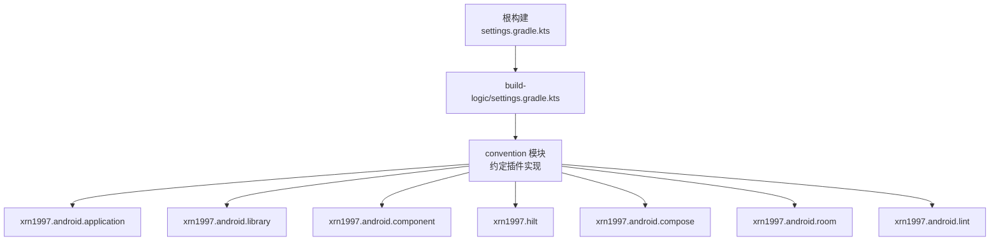
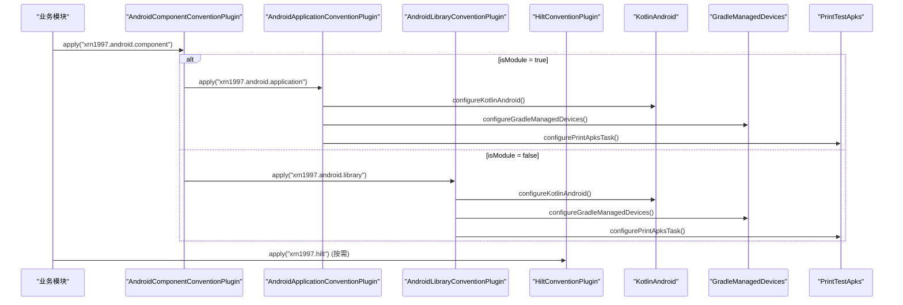
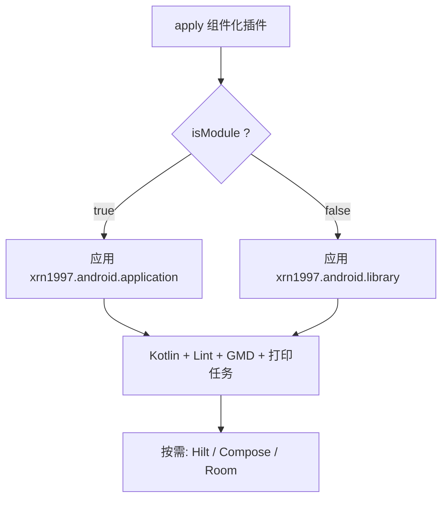

# 自定义约定插件

<cite>
**本文引用的文件**
- [build-logic/settings.gradle.kts](file://build-logic/settings.gradle.kts)
- [AndroidApplicationConventionPlugin.kt](file://build-logic/convention/src/main/kotlin/AndroidApplicationConventionPlugin.kt)
- [AndroidLibraryConventionPlugin.kt](file://build-logic/convention/src/main/kotlin/AndroidLibraryConventionPlugin.kt)
- [AndroidComponentConventionPlugin.kt](file://build-logic/convention/src/main/kotlin/AndroidComponentConventionPlugin.kt)
- [HiltConventionPlugin.kt](file://build-logic/convention/src/main/kotlin/HiltConventionPlugin.kt)
- [AndroidComposeConventionPlugin.kt](file://build-logic/convention/src/main/kotlin/AndroidComposeConventionPlugin.kt)
- [AndroidRoomConventionPlugin.kt](file://build-logic/convention/src/main/kotlin/AndroidRoomConventionPlugin.kt)
- [AndroidLintConventionPlugin.kt](file://build-logic/convention/src/main/kotlin/AndroidLintConventionPlugin.kt)
- [KotlinAndroid.kt](file://build-logic/convention/src/main/kotlin/com/xrn1997/convention/KotlinAndroid.kt)
- [ProjectExtensions.kt](file://build-logic/convention/src/main/kotlin/com/xrn1997/convention/ProjectExtensions.kt)
- [AndroidInstrumentedTests.kt](file://build-logic/convention/src/main/kotlin/com/xrn1997/convention/AndroidInstrumentedTests.kt)
- [GradleManagedDevices.kt](file://build-logic/convention/src/main/kotlin/com/xrn1997/convention/GradleManagedDevices.kt)
- [PrintTestApks.kt](file://build-logic/convention/src/main/kotlin/com/xrn1997/convention/PrintTestApks.kt)
</cite>

## 目录
1. [简介](#简介)
2. [项目结构](#项目结构)
3. [核心组件](#核心组件)
4. [架构总览](#架构总览)
5. [详细组件分析](#详细组件分析)
6. [依赖关系与加载顺序](#依赖关系与加载顺序)
7. [扩展点与配置选项](#扩展点与配置选项)
8. [性能与构建特性](#性能与构建特性)
9. [故障排查指南](#故障排查指南)
10. [结论](#结论)
11. [附录：使用示例与最佳实践](#附录使用示例与最佳实践)

## 简介
本仓库通过 build-logic 模块集中定义统一的 Android 构建约定，并以 Gradle 约定插件的形式对外暴露。所有业务与库模块均通过应用这些约定插件来复用一致的 Kotlin、测试、设备管理、Lint、Room、Hilt、Compose 等构建配置，从而减少重复脚本、降低维护成本并统一团队规范。插件 ID 采用统一前缀 xrn1997.*，便于在项目中唯一识别和引用。

## 项目结构
build-logic 是独立的 Gradle 子工程，负责提供约定插件；convention 子模块包含所有约定插件实现与通用配置工具类。根 settings 通过 pluginManagement 与 dependencyResolutionManagement 统一管理插件仓库与版本目录（libs），并在根项目内 include 该 convention 模块以便被上层构建解析。

图表来源
- [build-logic/settings.gradle.kts:16-49](file://build-logic/settings.gradle.kts#L16-L49)

章节来源
- [build-logic/settings.gradle.kts:16-49](file://build-logic/settings.gradle.kts#L16-L49)

## 核心组件
- AndroidApplicationConventionPlugin：为 application 模块注入 AGP application、默认 targetSdk、applicationId=namespace、动画禁用、Gradle Managed Devices、打印测试产物任务等。
- AndroidLibraryConventionPlugin：为 library 模块注入 AGP library、默认 targetSdk、单元测试回退策略、androidTest 依赖注入条件化、动画禁用、Gradle Managed Devices、打印测试产物任务等。
- AndroidComponentConventionPlugin：组件化开关 isModule=true/false，分别切换为 application/library，设置 Manifest 来源，并在独立态将 src/main/test 加入 Kotlin 源码目录以支持独立调试宿主。
- HiltConventionPlugin：自动启用 KSP 并装配 Hilt 编译期依赖；对 JVM 与 Android 模块分别追加对应依赖。
- AndroidComposeConventionPlugin：按需要启用 Compose 相关构建配置（由 convention 模块提供）。
- AndroidRoomConventionPlugin：按需要启用 Room 编译期配置（由 convention 模块提供）。
- AndroidLintConventionPlugin：统一接入 Lint 规则（由 convention 模块提供）。
- 公共工具：KotlinAndroid、ProjectExtensions、AndroidInstrumentedTests、GradleManagedDevices、PrintTestApks 等，被各约定插件复用。

章节来源
- [AndroidApplicationConventionPlugin.kt:28-49](file://build-logic/convention/src/main/kotlin/AndroidApplicationConventionPlugin.kt#L28-L49)
- [AndroidLibraryConventionPlugin.kt:30-69](file://build-logic/convention/src/main/kotlin/AndroidLibraryConventionPlugin.kt#L30-L69)
- [AndroidComponentConventionPlugin.kt:7-34](file://build-logic/convention/src/main/kotlin/AndroidComponentConventionPlugin.kt#L7-L34)
- [HiltConventionPlugin.kt:24-49](file://build-logic/convention/src/main/kotlin/HiltConventionPlugin.kt#L24-L49)
- [AndroidComposeConventionPlugin.kt](file://build-logic/convention/src/main/kotlin/AndroidComposeConventionPlugin.kt)
- [AndroidRoomConventionPlugin.kt](file://build-logic/convention/src/main/kotlin/AndroidRoomConventionPlugin.kt)
- [AndroidLintConventionPlugin.kt](file://build-logic/convention/src/main/kotlin/AndroidLintConventionPlugin.kt)
- [KotlinAndroid.kt](file://build-logic/convention/src/main/kotlin/com/xrn1997/convention/KotlinAndroid.kt)
- [ProjectExtensions.kt](file://build-logic/convention/src/main/kotlin/com/xrn1997/convention/ProjectExtensions.kt)
- [AndroidInstrumentedTests.kt](file://build-logic/convention/src/main/kotlin/com/xrn1997/convention/AndroidInstrumentedTests.kt)
- [GradleManagedDevices.kt](file://build-logic/convention/src/main/kotlin/com/xrn1997/convention/GradleManagedDevices.kt)
- [PrintTestApks.kt](file://build-logic/convention/src/main/kotlin/com/xrn1997/convention/PrintTestTestApks.kt)

## 架构总览
约定插件之间通过“按需启用”的机制协作：AndroidComponentConventionPlugin 根据 isModule 选择应用 application 或 library 约定；其他横切关注点（Hilt、Compose、Room、Lint）可被模块按需组合引入。所有插件共享 KotlinAndroid、ProjectExtensions 等工具方法，保证行为一致。

图表来源
- [AndroidComponentConventionPlugin.kt:7-34](file://build-logic/convention/src/main/kotlin/AndroidComponentConventionPlugin.kt#L7-L34)
- [AndroidApplicationConventionPlugin.kt:28-49](file://build-logic/convention/src/main/kotlin/AndroidApplicationConventionPlugin.kt#L28-L49)
- [AndroidLibraryConventionPlugin.kt:30-69](file://build-logic/convention/src/main/kotlin/AndroidLibraryConventionPlugin.kt#L30-L69)
- [HiltConventionPlugin.kt:24-49](file://build-logic/convention/src/main/kotlin/HiltConventionPlugin.kt#L24-L49)

## 详细组件分析

### AndroidApplicationConventionPlugin
- 职责：为 application 模块提供统一的 Android 应用构建约定。
- 关键点：
  - 应用 com.android.application，并注入 xrn1997.android.lint。
  - 调用 configureKotlinAndroid 配置 Kotlin 编译参数。
  - 设置 defaultConfig.targetSdk=37，applicationId=namespace。
  - 禁用测试动画、配置 Gradle Managed Devices。
  - 注册打印测试产物任务，便于定位 APK/AAB。

章节来源
- [AndroidApplicationConventionPlugin.kt:28-49](file://build-logic/convention/src/main/kotlin/AndroidApplicationConventionPlugin.kt#L28-L49)

### AndroidLibraryConventionPlugin
- 职责：为 library 模块提供统一的 Android 库构建约定。
- 关键点：
  - 应用 com.android.library，并注入 xrn1997.android.lint。
  - 调用 configureKotlinAndroid，设置 testOptions.targetSdk=37。
  - 开启单元测试返回默认值（适配纯 JVM Logger 测试）。
  - 条件注入 androidTest 依赖（仅当存在 androidTest 目录时）。
  - 统一注入 tracing、junit、kotlin-test 等依赖。
  - 配置 Gradle Managed Devices 与打印测试产物任务。

章节来源
- [AndroidLibraryConventionPlugin.kt:30-69](file://build-logic/convention/src/main/kotlin/AndroidLibraryConventionPlugin.kt#L30-L69)

### AndroidComponentConventionPlugin
- 职责：支撑模块化开发，根据 isModule 动态切换应用形态与清单来源，并处理独立调试所需的 Kotlin 源码目录。
- 关键点：
  - isModule=true：应用 xrn1997.android.application 与 therouter，并使用 module 清单；将 src/main/test 加入 kotlin.directories 作为额外 Kotlin 源码目录，使独立调试宿主参与编译。
  - isModule=false：应用 xrn1997.android.library，使用标准 main 清单。
  - 始终添加 jniLibs 目录用于原生库。

章节来源
- [AndroidComponentConventionPlugin.kt:7-34](file://build-logic/convention/src/main/kotlin/AndroidComponentConventionPlugin.kt#L7-L34)

### HiltConventionPlugin
- 职责：统一装配 Hilt 的 KSP 与依赖，兼容 JVM 与 Android 模块。
- 关键点：
  - 启用 com.google.devtools.ksp，并注入 hilt.compiler、kotlin.metadata。
  - 若已应用 org.jetbrains.kotlin.jvm，则注入 hilt.core。
  - 若已应用 com.android.base，则应用 dagger.hilt.android.plugin 并注入 hilt.android。

章节来源
- [HiltConventionPlugin.kt:24-49](file://build-logic/convention/src/main/kotlin/HiltConventionPlugin.kt#L24-L49)

### AndroidComposeConventionPlugin
- 职责：为需要 Jetpack Compose 的模块提供统一的 Compose 构建配置（如编译器参数、资源命名空间等），具体细节由 convention 模块内部实现。
- 使用方式：在目标模块按需 apply。

章节来源
- [AndroidComposeConventionPlugin.kt](file://build-logic/convention/src/main/kotlin/AndroidComposeConventionPlugin.kt)

### AndroidRoomConventionPlugin
- 职责：为需要 Room 的模块提供统一的 Room 编译期配置（如 schema 输出、migration 生成等），具体细节由 convention 模块内部实现。
- 使用方式：在目标模块按需 apply。

章节来源
- [AndroidRoomConventionPlugin.kt](file://build-logic/convention/src/main/kotlin/AndroidRoomConventionPlugin.kt)

### AndroidLintConventionPlugin
- 职责：为模块统一注入 Lint 检查配置，确保代码质量基线一致。
- 使用方式：被 application/library 约定插件默认应用。

章节来源
- [AndroidLintConventionPlugin.kt](file://build-logic/convention/src/main/kotlin/AndroidLintConventionPlugin.kt)

### 公共工具与扩展
- KotlinAndroid：封装 Kotlin 编译选项，供各 Android 约定插件复用。
- ProjectExtensions：项目级扩展方法（如读取 libs 版本目录、属性等）。
- AndroidInstrumentedTests：统一插桩测试配置。
- GradleManagedDevices：统一 Gradle Managed Devices 配置。
- PrintTestApks：统一打印测试产物路径的任务。

章节来源
- [KotlinAndroid.kt](file://build-logic/convention/src/main/kotlin/com/xrn1997/convention/KotlinAndroid.kt)
- [ProjectExtensions.kt](file://build-logic/convention/src/main/kotlin/com/xrn1997/convention/ProjectExtensions.kt)
- [AndroidInstrumentedTests.kt](file://build-logic/convention/src/main/kotlin/com/xrn1997/convention/AndroidInstrumentedTests.kt)
- [GradleManagedDevices.kt](file://build-logic/convention/src/main/kotlin/com/xrn1997/convention/GradleManagedDevices.kt)
- [PrintTestApks.kt](file://build-logic/convention/src/main/kotlin/com/xrn1997/convention/PrintTestApks.kt)

## 依赖关系与加载顺序
- AndroidComponentConventionPlugin 是入口，根据 isModule 决定后续加载 application 或 library 约定。
- application/library 约定插件内部会：
  - 应用 Kotlin 配置（通过 configureKotlinAndroid）。
  - 应用 Lint。
  - 配置 Gradle Managed Devices。
  - 注册打印测试产物任务。
- HiltConventionPlugin 基于已存在的 Kotlin/Android 插件进行条件装配，不改变 Android 基础插件加载顺序。
- Compose/Room/Lint 等可按需组合，避免不必要的依赖开销。

图表来源
- [AndroidComponentConventionPlugin.kt:7-34](file://build-logic/convention/src/main/kotlin/AndroidComponentConventionPlugin.kt#L7-L34)
- [AndroidApplicationConventionPlugin.kt:28-49](file://build-logic/convention/src/main/kotlin/AndroidApplicationConventionPlugin.kt#L28-L49)
- [AndroidLibraryConventionPlugin.kt:30-69](file://build-logic/convention/src/main/kotlin/AndroidLibraryConventionPlugin.kt#L30-L69)
- [HiltConventionPlugin.kt:24-49](file://build-logic/convention/src/main/kotlin/HiltConventionPlugin.kt#L24-L49)

## 扩展点与配置选项
- 模块级开关
  - isModule：布尔属性，控制模块以 application 还是 library 形态构建，同时影响清单来源与 Kotlin 源码目录。
- 默认构建参数
  - targetSdk：application/library 约定中统一设置为 37。
  - applicationId：application 约定中默认等于 namespace。
- 测试与设备
  - 动画禁用：统一关闭测试动画以提升稳定性。
  - Gradle Managed Devices：统一设备配置。
  - 单元测试返回值：library 约定开启 returnDefaultValues，便于纯 JVM Logger 测试。
- 依赖注入
  - Hilt：通过 HiltConventionPlugin 自动装配 KSP 与依赖，兼容 JVM/Android。
- 组件化路由
  - 独立态下自动应用 therouter 插件，便于独立调试时的路由占位。

章节来源
- [AndroidComponentConventionPlugin.kt:7-34](file://build-logic/convention/src/main/kotlin/AndroidComponentConventionPlugin.kt#L7-L34)
- [AndroidApplicationConventionPlugin.kt:28-49](file://build-logic/convention/src/main/kotlin/AndroidApplicationConventionPlugin.kt#L28-L49)
- [AndroidLibraryConventionPlugin.kt:30-69](file://build-logic/convention/src/main/kotlin/AndroidLibraryConventionPlugin.kt#L30-L69)
- [HiltConventionPlugin.kt:24-49](file://build-logic/convention/src/main/kotlin/HiltConventionPlugin.kt#L24-L49)

## 性能与构建特性
- 条件依赖注入：仅在存在 androidTest 目录时注入 androidTestImplementation 依赖，避免无用依赖带来的警告与增量编译负担。
- 动画禁用：统一关闭测试动画，缩短测试执行时间。
- 条件清单与源码目录：独立态仅合并必要的清单与 Kotlin 源码目录，减少不必要编译。
- 打印测试产物：集中打印 APK/AAB 路径，减少手动查找时间。

章节来源
- [AndroidLibraryConventionPlugin.kt:51-66](file://build-logic/convention/src/main/kotlin/AndroidLibraryConventionPlugin.kt#L51-L66)
- [AndroidComponentConventionPlugin.kt:19-31](file://build-logic/convention/src/main/kotlin/AndroidComponentConventionPlugin.kt#L19-L31)
- [AndroidApplicationConventionPlugin.kt:44-46](file://build-logic/convention/src/main/kotlin/AndroidApplicationConventionPlugin.kt#L44-L46)
- [AndroidLibraryConventionPlugin.kt:51-54](file://build-logic/convention/src/main/kotlin/AndroidLibraryConventionPlugin.kt#L51-L54)

## 故障排查指南
- 独立态无法编译 debug 宿主类
  - 现象：独立模式下 debug/ 下的宿主类未参与编译。
  - 原因：AGP 新 DSL 下 Kotlin 源码目录必须通过 kotlin.directories 添加。
  - 解决：确认 AndroidComponentConventionPlugin 在 isModule=true 时将 src/main/test 加入 kotlin.directories。
  - 参考
    - [AndroidComponentConventionPlugin.kt:22-27](file://build-logic/convention/src/main/kotlin/AndroidComponentConventionPlugin.kt#L22-L27)

- 独立态清单未生效
  - 现象：独立运行与集成运行的 Activity/权限不一致。
  - 原因：未正确切换 manifest.srcFile。
  - 解决：确认 isModule=true 时使用 src/main/module/AndroidManifest.xml。
  - 参考
    - [AndroidComponentConventionPlugin.kt:22-24](file://build-logic/convention/src/main/kotlin/AndroidComponentConventionPlugin.kt#L22-L24)

- Hilt 注入失败或 KSP 未执行
  - 现象：注解处理器未生成代码。
  - 原因：未启用 KSP 或未应用 Hilt 插件。
  - 解决：确保模块应用了 HiltConventionPlugin，且目标模块已应用 Kotlin/Android 基础插件。
  - 参考
    - [HiltConventionPlugin.kt:24-49](file://build-logic/convention/src/main/kotlin/HiltConventionPlugin.kt#L24-L49)

- 单元测试日志行为异常
  - 现象：Logger 在纯 JVM 测试中无法输出。
  - 原因：单元测试未启用返回默认值。
  - 解决：library 约定已开启 unitTests.isReturnDefaultValues=true。
  - 参考
    - [AndroidLibraryConventionPlugin.kt:41-44](file://build-logic/convention/src/main/kotlin/AndroidLibraryConventionPlugin.kt#L41-L44)

章节来源
- [AndroidComponentConventionPlugin.kt:19-31](file://build-logic/convention/src/main/kotlin/AndroidComponentConventionPlugin.kt#L19-L31)
- [HiltConventionPlugin.kt:24-49](file://build-logic/convention/src/main/kotlin/HiltConventionPlugin.kt#L24-L49)
- [AndroidLibraryConventionPlugin.kt:41-44](file://build-logic/convention/src/main/kotlin/AndroidLibraryConventionPlugin.kt#L41-L44)

## 结论
通过 build-logic 提供的约定插件体系，项目在 Android 构建层面实现了高度标准化与可复用性：统一的 Kotlin、测试、设备、Lint、Hilt、Compose、Room 配置，配合组件化开关 with isModule，既能满足集成构建的一致性，又能保障功能模块独立调试的灵活性。插件之间的按需加载与条件装配保证了构建效率与可扩展性。

## 附录：使用示例与最佳实践
- 应用模块
  - 在 module_app 的 build.gradle.kts 中应用 xrn1997.android.application 与 xrn1997.hilt（如需）。
  - 保持 isModule=false（默认），由 module_app 组装功能模块。
- 功能模块
  - 在 module_book/module_find/module_login/module_me 等模块中应用 xrn1997.android.component。
  - 本地独立调试时临时将 gradle.properties 中的 isModule=true，调试完成后务必改回 false。
- 库模块
  - 在 lib_* 模块中应用 xrn1997.android.library，并按需应用 Hilt/Compose/Room。
- 调试技巧
  - 使用打印测试产物任务快速定位 APK/AAB。
  - 利用 Gradle Managed Devices 统一测试设备。
  - 独立态下确保清单与路由占位同步更新，避免运行时路由丢失。

[本节为使用指导，不涉及具体文件分析]