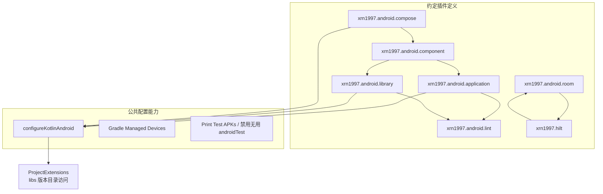
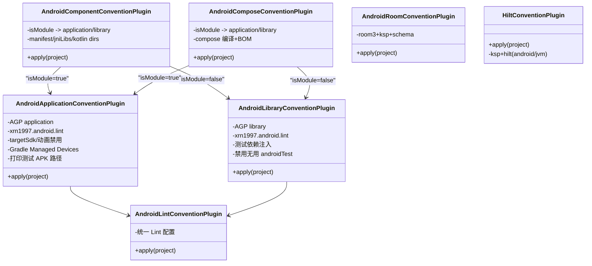
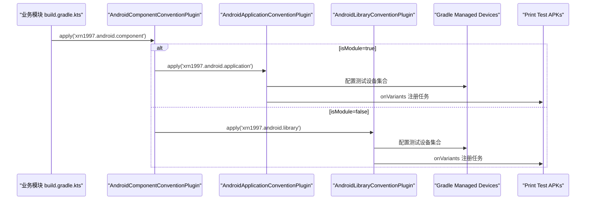

# Gradle 约定插件

<cite>
**本文引用的文件**
- [build-logic/convention/build.gradle.kts](file://build-logic/convention/build.gradle.kts)
- [AndroidApplicationConventionPlugin.kt](file://build-logic/convention/src/main/kotlin/AndroidApplicationConventionPlugin.kt)
- [AndroidLibraryConventionPlugin.kt](file://build-logic/convention/src/main/kotlin/AndroidLibraryConventionPlugin.kt)
- [AndroidComponentConventionPlugin.kt](file://build-logic/convention/src/main/kotlin/AndroidComponentConventionPlugin.kt)
- [AndroidComposeConventionPlugin.kt](file://build-logic/convention/src/main/kotlin/AndroidComposeConventionPlugin.kt)
- [AndroidLintConventionPlugin.kt](file://build-logic/convention/src/main/kotlin/AndroidLintConventionPlugin.kt)
- [AndroidRoomConventionPlugin.kt](file://build-logic/convention/src/main/kotlin/AndroidRoomConventionPlugin.kt)
- [HiltConventionPlugin.kt](file://build-logic/convention/src/main/kotlin/HiltConventionPlugin.kt)
- [ProjectExtensions.kt](file://build-logic/convention/src/main/kotlin/com/xrn1997/convention/ProjectExtensions.kt)
- [KotlinAndroid.kt](file://build-logic/convention/src/main/kotlin/com/xrn1997/convention/KotlinAndroid.kt)
- [AndroidInstrumentedTests.kt](file://build-logic/convention/src/main/kotlin/com/xrn1997/convention/AndroidInstrumentedTests.kt)
- [PrintTestApks.kt](file://build-logic/convention/src/main/kotlin/com/xrn1997/convention/PrintTestApks.kt)
- [GradleManagedDevices.kt](file://build-logic/convention/src/main/kotlin/com/xrn1997/convention/GradleManagedDevices.kt)
- [libs.versions.toml](file://gradle/libs.versions.toml)
- [module_app/build.gradle.kts](file://module_app/build.gradle.kts)
- [module_main/build.gradle.kts](file://module_main/build.gradle.kts)
- [module_me/build.gradle.kts](file://module_me/build.gradle.kts)
- [lib_book_common/build.gradle.kts](file://lib_book_common/build.gradle.kts)
- [lib_ebook_db/build.gradle.kts](file://lib_ebook_db/build.gradle.kts)
</cite>

## 目录
1. [简介](#简介)
2. [项目结构](#项目结构)
3. [核心插件总览](#核心插件总览)
4. [架构总览](#架构总览)
5. [详细组件分析](#详细组件分析)
6. [依赖与执行顺序](#依赖与执行顺序)
7. [模块引用方式与示例](#模块引用方式与示例)
8. [性能与调试](#性能与调试)
9. [常见问题排查](#常见问题排查)
10. [结论](#结论)

## 简介
本仓库通过 build-logic 集中封装了统一的构建配置，以“约定优于配置”的方式为应用与库模块提供开箱即用的 Android、Compose、KSP、Hilt、Room、Lint 等能力。开发者只需在模块的 build.gradle.kts 中通过约定插件 ID（如 xrn1997.android.application）引入对应的插件，即可复用一致的编译目标、SDK 版本、测试与工具链策略。

## 项目结构
- 约定插件实现位于 build-logic/convention，使用 kotlin-dsl 编写并注册为 Gradle 自定义插件
- 插件间通过公共扩展函数（ProjectExtensions、KotlinAndroid 等）统一基础设置
- 依赖版本集中由 gradle/libs.versions.toml 管理，避免在各模块散落硬编码版本
- 业务模块按需应用约定插件与相关依赖（如 Compose、KSP、Hilt），保证最小必要装配

图示来源
- [build-logic/convention/build.gradle.kts:40-75](file://build-logic/convention/build.gradle.kts#L40-L75)
- [KotlinAndroid.kt:34-56](file://build-logic/convention/src/main/kotlin/com/xrn1997/convention/KotlinAndroid.kt#L34-L56)
- [AndroidComponentConventionPlugin.kt:9-34](file://build-logic/convention/src/main/kotlin/AndroidComponentConventionPlugin.kt#L9-L34)
- [AndroidComposeConventionPlugin.kt:37-60](file://build-logic/convention/src/main/kotlin/AndroidComposeConventionPlugin.kt#L37-L60)
- [AndroidRoomConventionPlugin.kt:26-52](file://build-logic/convention/src/main/kotlin/AndroidRoomConventionPlugin.kt#L26-L52)
- [HiltConventionPlugin.kt:24-49](file://build-logic/convention/src/main/kotlin/HiltConventionPlugin.kt#L24-L49)

小节来源
- [build-logic/convention/build.gradle.kts:1-75](file://build-logic/convention/build.gradle.kts#L1-L75)

## 核心插件总览
- xrn1997.android.application：面向 Application 模块的统一装配，含 AGP application、Lint、默认 targetSdk 与 Gradle Managed Devices
- xrn1997.android.library：面向 Library 模块的统一装配，含 AGP library、Lint、单元测试依赖、androidTest 优化
- xnr1997.android.component：按 isModule 开关派生 application 或 library，同时处理 Manifest/JNI 源集差异
- xrn1997.android.compose：按 isModule 派生应用或库后，开启 Compose 编译与依赖 BOM；确保通用 CommonExtension 下的 compose 配置生效
- xrn1997.android.lint：统一 Lint 配置，兼容 Application/Library/Lint-only 三类场景
- xrn1997.android.room：装配 Room 3.x、KSP 生成 Kotlin、输出 Schema
- xrn1997.hilt：装配 KSP + Hilt Android/JVM 支持，条件注入依赖

小节来源
- [AndroidApplicationConventionPlugin.kt:28-49](file://build-logic/convention/src/main/kotlin/AndroidApplicationConventionPlugin.kt#L28-L49)
- [AndroidLibraryConventionPlugin.kt:30-69](file://build-logic/convention/src/main/kotlin/AndroidLibraryConventionPlugin.kt#L30-L69)
- [AndroidComponentConventionPlugin.kt:7-34](file://build-logic/convention/src/main/kotlin/AndroidComponentConventionPlugin.kt#L7-L34)
- [AndroidComposeConventionPlugin.kt:25-60](file://build-logic/convention/src/main/kotlin/AndroidComposeConventionPlugin.kt#L25-L60)
- [AndroidLintConventionPlugin.kt:25-47](file://build-logic/convention/src/main/kotlin/AndroidLintConventionPlugin.kt#L25-L47)
- [AndroidRoomConventionPlugin.kt:26-52](file://build-logic/convention/src/main/kotlin/AndroidRoomConventionPlugin.kt#L26-L52)
- [HiltConventionPlugin.kt:24-49](file://build-logic/convention/src/main/kotlin/HiltConventionPlugin.kt#L24-L49)

## 架构总览
下图展示约定插件与公共配置的层次关系与调用链：

图示来源
- [AndroidComponentConventionPlugin.kt:7-34](file://build-logic/convention/src/main/kotlin/AndroidComponentConventionPlugin.kt#L7-L34)
- [AndroidComposeConventionPlugin.kt:37-60](file://build-logic/convention/src/main/kotlin/AndroidComposeConventionPlugin.kt#L37-L60)
- [AndroidApplicationConventionPlugin.kt:28-49](file://build-logic/convention/src/main/kotlin/AndroidApplicationConventionPlugin.kt#L28-L49)
- [AndroidLibraryConventionPlugin.kt:30-69](file://build-logic/convention/src/main/kotlin/AndroidLibraryConventionPlugin.kt#L30-L69)
- [AndroidLintConventionPlugin.kt:25-47](file://build-logic/convention/src/main/kotlin/AndroidLintConventionPlugin.kt#L25-L47)

## 详细组件分析

### xrn1997.android.application
- 功能
  - 应用 com.android.application
  - 自动附加 xrn1997.android.lint 与 Kotlin 基础配置
  - 设置 targetSdk、applicationId=namespace、禁用动画
  - 配置 Gradle Managed Devices，便于 CI 执行仪表测试
  - 注册打印最终 APK 路径的任务，方便定位产物
- 适用场景
  - 工程入口模块（module_app）直接启用
- 重要参数
  - targetSdk 37
  - testOptions.animationsDisabled = true

小节来源
- [AndroidApplicationConventionPlugin.kt:28-49](file://build-logic/convention/src/main/kotlin/AndroidApplicationConventionPlugin.kt#L28-L49)
- [PrintTestApks.kt:40-69](file://build-logic/convention/src/main/kotlin/com/xrn1997/convention/PrintTestApks.kt#L40-L69)
- [GradleManagedDevices.kt:27-58](file://build-logic/convention/src/main/kotlin/com/xrn1997/convention/GradleManagedDevices.kt#L27-L58)

### xrn1997.android.library
- 功能
  - 应用 com.android.library
  - 自动附加 xrn1997.android.lint 与 Kotlin 基础配置
  - 注入单元测试依赖（JUnit、kotlin-test）、tracing-ktx 等
  - 无 androidTest 时禁用 androidTest 变体，避免无效构建成本
- 适用场景
  - 纯逻辑库（例如 lib_ebook_api、lib_ebook_db）
- 关键行为
  - testOptions.unitTests.isReturnDefaultValues = true，保障对 Log 等 Android API 的简单测试

小节来源
- [AndroidLibraryConventionPlugin.kt:30-69](file://build-logic/convention/src/main/kotlin/AndroidLibraryConventionPlugin.kt#L30-L69)
- [AndroidInstrumentedTests.kt:22-35](file://build-logic/convention/src/main/kotlin/com/xrn1997/convention/AndroidInstrumentedTests.kt#L22-L35)

### xrn1997.android.component
- 功能
  - 根据 isModule 属性自动应用 application 或 library
  - 动态修改 sourceSets.main.manifest 指向不同清单
  - 将 jniLibs 添加到 sourcesets，并补充 Kotlin 编译目录以避免 KSP/kt 产出错位
- 适用场景
  - 可独立运行的功能模块（如 module_main/module_book/module_find/module_login/module_me）
- 注意事项
  - 集成态（isModule=false）使用 src/main/AndroidManifest.xml；独立态（isModule=true）切换到 src/main/module/AndroidManifest.xml
  - 新增/改动 kotlin.srcDirs 时应遵循 AGP 9 新 DSL

小节来源
- [AndroidComponentConventionPlugin.kt:7-34](file://build-logic/convention/src/main/kotlin/AndroidComponentConventionPlugin.kt#L7-L34)

### xrn1997.android.compose
- 功能
  - 根据 isModule 派生 application/library
  - 启用 org.jetbrains.kotlin.plugin.compose 编译
  - 基于 CommonExtension 统一装配 Compose BOM、debug tooling、test BOM（当存在 androidTest 源码）
- 适用场景
  - 所有需要使用 Jetpack Compose 能力的模块
- 额外能力
  - 可通过 Gradle property 输出 Compose 编译器指标与报告
  - 引用稳定性配置文件，提升重构稳定性

小节来源
- [AndroidComposeConventionPlugin.kt:25-60](file://build-logic/convention/src/main/kotlin/AndroidComposeConventionPlugin.kt#L25-L60)
- [AndroidCompose.kt:29-75](file://build-logic/convention/src/main/kotlin/com/xrn1997/convention/AndroidCompose.kt#L29-L75)

### xrn1997.android.lint
- 功能
  - 根据是否已有 application/library 插件来配置 Lint；若无则自己引入 lint 插件
  - 开启 XML 报告、检查传递依赖中的问题
- 适用场景
  - 任何 Android 模块；也可用于纯 Java/JVM Lint 场景
- 配置项
  - xmlReport=true, checkDependencies=true

小节来源
- [AndroidLintConventionPlugin.kt:25-47](file://build-logic/convention/src/main/kotlin/AndroidLintConventionPlugin.kt#L25-L47)

### xrn1997.android.room
- 功能
  - 引入 androidx.room3 插件与 KSP
  - 设置 room.generateKotlin=true
  - 配置 schemaDirectory 用于自动迁移
  - 添加运行时与编译器依赖（包含 sqlite-bundled）
- 适用场景
  - 需要 Room 的模块（例如 lib_ebook_db）

小节来源
- [AndroidRoomConventionPlugin.kt:26-52](file://build-logic/convention/src/main/kotlin/AndroidRoomConventionPlugin.kt#L26-L52)

### xrn1997.hilt
- 功能
  - 引入 KSP，并为 hilt-compiler 与 kotlin-metadata 添加 KSP 依赖
  - 针对 org.jetbrains.kotlin.jvm 加入 hilt-core
  - 针对 com.android.base（应用/库）追加 dagger.hilt.android.plugin 与 hilt-android
- 适用场景
  - 需要使用 Hilt 进行依赖注入的所有模块（Android 与 JVM）

小节来源
- [HiltConventionPlugin.kt:24-49](file://build-logic/convention/src/main/kotlin/HiltConventionPlugin.kt#L24-L49)

## 依赖与执行顺序
下图给出应用/库在加载这些约定插件后的典型装配流程：

图示来源
- [AndroidComponentConventionPlugin.kt:9-34](file://build-logic/convention/src/main/kotlin/AndroidComponentConventionPlugin.kt#L9-L34)
- [AndroidApplicationConventionPlugin.kt:28-49](file://build-logic/convention/src/main/kotlin/AndroidApplicationConventionPlugin.kt#L28-L49)
- [AndroidLibraryConventionPlugin.kt:30-69](file://build-logic/convention/src/main/kotlin/AndroidLibraryConventionPlugin.kt#L30-L69)
- [PrintTestApks.kt:40-69](file://build-logic/convention/src/main/kotlin/com/xrn1997/convention/PrintTestApks.kt#L40-L69)

## 模块引用方式与示例
- 应用模块（module_app）
  - 使用约定插件：alias(libs.plugins.xrn1997.android.application)
  - 结合 ksp、therouter 等业务插件
- 功能模块（module_main/module_book/module_find/module_login/module_me）
  - 通常使用 alias(libs.plugins.xrn1997.android.component)，再按需附加 Compose 与 KSP
- 共享库模块（lib_book_common、lib_ebook_api）
  - 使用 alias(libs.plugins.xrn1997.android.library)，如需 Compose 单独引入 compose.compiler
- 数据库模块（lib_ebook_db）
  - 同时应用 xrn1997.android.library、xrn1997.hilt、xrn1997.android.room

小节来源
- [module_app/build.gradle.kts:3-7](file://module_app/build.gradle.kts#L3-L7)
- [module_main/build.gradle.kts:3-7](file://module_main/build.gradle.kts#L3-L7)
- [module_me/build.gradle.kts:4-9](file://module_me/build.gradle.kts#L4-L9)
- [module_book/build.gradle.kts:2-7](file://module_book/build.gradle.kts#L2-L7)
- [module_find/build.gradle.kts:3-8](file://module_find/build.gradle.kts#L3-L8)
- [module_login/build.gradle.kts:3-8](file://module_login/build.gradle.kts#L3-L8)
- [lib_book_common/build.gradle.kts:3-7](file://lib_book_common/build.gradle.kts#L3-L7)
- [lib_ebook_api/build.gradle.kts:4-8](file://lib_ebook_api/build.gradle.kts#L4-L8)
- [lib_ebook_db/build.gradle.kts:3-7](file://lib_ebook_db/build.gradle.kts#L3-L7)

## 性能与调试
- 性能优化要点
  - 在无 androidTest 源码的库中通过 beforeVariants 禁用多余仪表测试构建
  - 仅在有 androidTest 源码时注入其 BOM 依赖，减少配置体积
  - 使用版本目录集中管理依赖，减少重复解析
- 调试建议
  - 使用 Print Test APKs 快速定位 androidTest APK 输出位置
  - 通过 Gradle property enableComposeCompilerMetrics/Reports 输出 Compose 编译指标与报告
  - 用 isModule=true 在功能模块下独立调试，但需注意 gradle.properties 状态与 includeBuild 联动影响

小节来源
- [AndroidInstrumentedTests.kt:22-35](file://build-logic/convention/src/main/kotlin/com/xrn1997/convention/AndroidInstrumentedTests.kt#L22-L35)
- [PrintTestApks.kt:40-107](file://build-logic/convention/src/main/kotlin/com/xrn1997/convention/PrintTestApks.kt#L40-L107)
- [AndroidCompose.kt:54-75](file://build-logic/convention/src/main/kotlin/com/xrn1997/convention/AndroidCompose.kt#L54-L75)
- [AndroidLibraryConventionPlugin.kt:51-54](file://build-logic/convention/src/main/kotlin/AndroidLibraryConventionPlugin.kt#L51-L54)

## 常见问题排查
- “com.android.application 和 com.android.library 不能同时应用于同一项目”
  - 因 isModule 切换与 compose 插件内部分支共同作用导致重复应用；注意不要在 settings 层用 -PisModule 透传到被 includeBuild 的项目
- “androidTestImplementation 依赖被忽略”
  - 在没有 androidTest 源码的情况下，约定会禁用该变体，不要在此变体下注入依赖
- “KSP 生成了代码但 Kotlin 未编译”
  - AGP 9 新 DSL 下为 Kotlin 增加源码目录需使用 kotlin.srcDirs，不要用 java.srcDirs
- “独立运行与集成形态清单不同”
  - isModule=true 时使用 src/main/module/AndroidManifest.xml；isModule=false 时使用 src/main/AndroidManifest.xml，两处清单必须保持一致声明

小节来源
- [AndroidComposeConventionPlugin.kt:43-49](file://build-logic/convention/src/main/kotlin/AndroidComposeConventionPlugin.kt#L43-L49)
- [AndroidLibraryConventionPlugin.kt:51-54](file://build-logic/convention/src/main/kotlin/AndroidLibraryConventionPlugin.kt#L51-L54)
- [AndroidComponentConventionPlugin.kt:18-31](file://build-logic/convention/src/main/kotlin/AndroidComponentConventionPlugin.kt#L18-L31)

## 结论
本项目的约定插件体系以“少量、稳定、高内聚”的插件 ID 向业务模块暴露一致的基础构建能力。通过 isModule 开关、CommonExtension 聚合、版本目录与前置校验，既保证了多模块工程的统一性，又兼顾了独立开发调试的效率。未来可按需在上述插件中继续收敛新的公共能力，进一步降低模块复杂度与维护成本。