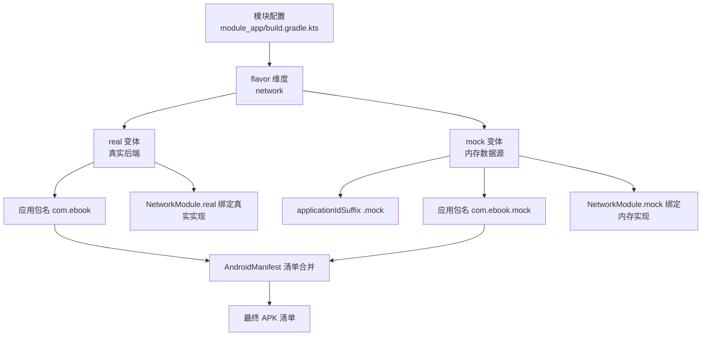
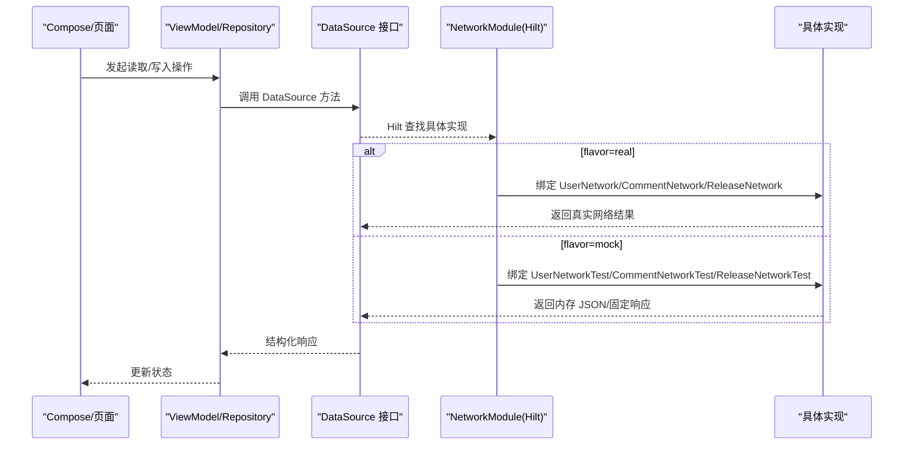
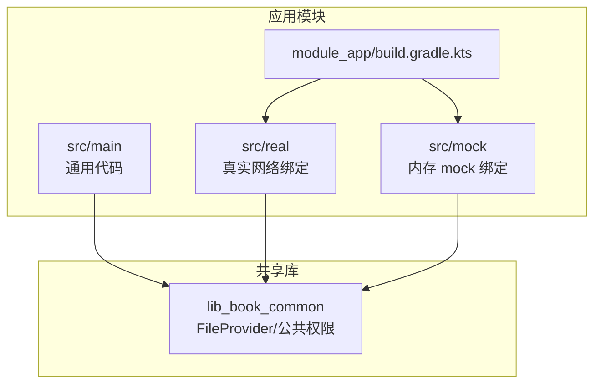
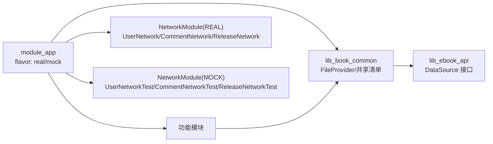

# Product Flavor 配置

<cite>
**本文引用的文件**   
- [module_app/build.gradle.kts](file://module_app/build.gradle.kts)
- [build.gradle.kts](file://build.gradle.kts)
- [gradle.properties](file://gradle.properties)
- [module_app/src/main/AndroidManifest.xml](file://module_app/src/main/AndroidManifest.xml)
- [module_main/src/main/module/AndroidManifest.xml](file://module_main/src/main/module/AndroidManifest.xml)
- [module_app/src/mock/java/com/ebook/di/NetworkModule.kt](file://module_app/src/mock/java/com/ebook/di/NetworkModule.kt)
- [module_app/src/real/java/com/ebook/di/NetworkModule.kt](file://module_app/src/real/java/com/ebook/di/NetworkModule.kt)
- [lib_book_common/src/main/AndroidManifest.xml](file://lib_book_common/src/main/AndroidManifest.xml)
</cite>

## 目录
1. [简介](#简介)
2. [项目结构与 flavor 装配位置](#项目结构与-flavor-装配位置)
3. [核心组件与数据源切换机制](#核心组件与数据源切换机制)
4. [架构总览](#架构总览)
5. [详细配置分析](#详细配置分析)
6. [依赖关系分析](#依赖关系分析)
7. [性能与构建注意事项](#性能与构建注意事项)
8. [问题排查与调试技巧](#问题排查与调试技巧)
9. [结论](#结论)
10. [附录：常用命令与产物定位](#附录：常用命令与产物定位)

## 简介
本仓库通过 Gradle 的 product flavor（产品风味）与 source set（源码集）机制，在网络数据层实现了 real（真实后端）与 mock（内存模拟）两套可切换的数据源。根级约定插件保证统一构建体验；应用入口模块 module_app 定义 network flavor dimension，并提供 real/mock 两个变体。该能力用于以下目标：
- 开发、联调阶段无需后端服务，使用内存 mock 完成全链路验证
- 测试与 CI 构建稳定离线运行，不依赖外网可达性
- 保持同一工程内“真实版本”与“Mock 版本”共存安装

下面逐项说明网络 flavor 的差异化、Hilt 绑定替换、清单替换规则、source set 优先级、applicationId 差异、以及常见问题的定位方法。

## 项目结构与 flavor 装配位置
- flavor 维度和两个变体在 app 模块定义：network dimension，包含 real 与 mock
- mock 变体额外设置 applicationIdSuffix=".mock"，因此 APK ID 为 com.ebook.mock，可与真实版本同设备并存
- Hilt 模块按 flavor source set 互斥覆盖：src/mock 与 src/real 下同名 NetworkModule 被编译器根据所选 flavor 选择其一
- 清单文件存在两套实现：集成构建生效 module_app/src/main/AndroidManifest.xml；独立模块模式生效 module_main/src/main/module/AndroidManifest.xml，两者是“替换关系”，属性需同步维护
- 默认库清单 lib_book_common/src/main/AndroidManifest.xml 声明 FileProvider 时引用 ${applicationId}，会随最终应用 package id 注入，避免重复定义 authorities

**图表来源**
- [module_app/build.gradle.kts:17-26](file://module_app/build.gradle.kts#L17-L26)
- [module_app/src/real/java/com/ebook/di/NetworkModule.kt:14-35](file://module_app/src/real/java/com/ebook/di/NetworkModule.kt#L14-L35)
- [module_app/src/mock/java/com/ebook/di/NetworkModule.kt:14-37](file://module_app/src/mock/java/com/ebook/di/NetworkModule.kt#L14-L37)

**节来源**
- [module_app/build.gradle.kts:1-63](file://module_app/build.gradle.kts#L1-L63)
- [lib_book_common/src/main/AndroidManifest.xml:1-25](file://lib_book_common/src/main/AndroidManifest.xml#L1-L25)

## 核心组件与数据源切换机制
项目采用“接口 + Hilt 绑定 + flavor 源码集”的方式切换数据源：
- 接口定义位于共享 API 层（如 UserDataSource、CommentDataSource、ReleaseDataSource），业务与模块仅依赖接口
- NetworkModule 在每个 flavor 下提供具体绑定：
  - mock：将接口绑定到内存实现（例如 UserNetworkTest、CommentNetworkTest、ReleaseNetworkTest），数据来自本地 JSON 资源或固定构造响应
  - real：将接口绑定到真实网络实现（UserNetwork、CommentNetwork、ReleaseNetwork），调用线上或代理后端
- 编译期由 Gradle source set 决定哪个 NetworkModule 参与链接，因此运行时无需分支判断

**图表来源**
- [module_app/src/real/java/com/ebook/di/NetworkModule.kt:14-35](file://module_app/src/real/java/com/ebook/di/NetworkModule.kt#L14-L35)
- [module_app/src/mock/java/com/ebook/di/NetworkModule.kt:14-37](file://module_app/src/mock/java/com/ebook/di/NetworkModule.kt#L14-L37)

**节来源**
- [module_app/src/real/java/com/ebook/di/NetworkModule.kt:14-35](file://module_app/src/real/java/com/ebook/di/NetworkModule.kt#L14-L35)
- [module_app/src/mock/java/com/ebook/di/NetworkModule.kt:14-37](file://module_app/src/mock/java/com/ebook/di/NetworkModule.kt#L14-L37)

## 架构总览
整体数据流分为三层：
- 表现层：Compose/页面/ViewModel
- 接口层：DataSource 抽象，解耦网络实现
- 实现层：按 flavor 切换的真实网络或内存 mock

构建期选择策略：
- 通过 flavorDimensions 指定维度 network
- 通过 productFlavors 定义 real、mock
- 通过 source set 优先级让同名类在不同 flavor 目录下互斥生效

**图表来源**
- [module_app/build.gradle.kts:17-26](file://module_app/build.gradle.kts#L17-L26)
- [lib_book_common/src/main/AndroidManifest.xml:1-25](file://lib_book_common/src/main/AndroidManifest.xml#L1-L25)

## 详细配置分析

### 1) flavorDimension 与变体定义
- 定义 network flavor 维度
- 创建 real、mock 两个 flavor
- mock 使用 applicationIdSuffix=".mock"，使应用包名为 com.ebook.mock，可与真实包名 com.ebook 在同一设备安装

关键点：
- flavor 与 buildType 组合形成最终构建变体，例如 realDebug、mockRelease
- 所有功能模块默认继承 app 的 flavor 维度（未在该维度自定义其他 flavor，因此只存在 real/mock 两种变体）

**节来源**
- [module_app/build.gradle.kts:17-26](file://module_app/build.gradle.kts#L17-L26)

### 2) 网络数据源替换机制（Hilt + source set）
- 接口定义位于共享层，模块仅依赖接口
- NetworkModule 在同名但不同 flavor 目录下分别提供：
  - real：绑定真实 UserNetwork/CommentNetwork/ReleaseNetwork
  - mock：绑定内存实现 UserNetworkTest/CommentNetworkTest/ReleaseNetworkTest
- 编译器会根据所选 flavor 选择对应 NetworkModule，避免重复定义报错

设计优势：
- 无运行时 if 分支，降低耦合
- 便于离线开发与 CI 稳定性
- ReleaseNetwork 的 mock 使用固定资产，稳定演示“检查更新”流程

**节来源**
- [module_app/src/real/java/com/ebook/di/NetworkModule.kt:14-35](file://module_app/src/real/java/com/ebook/di/NetworkModule.kt#L14-L35)
- [module_app/src/mock/java/com/ebook/di/NetworkModule.kt:14-37](file://module_app/src/mock/java/com/ebook/di/NetworkModule.kt#L14-L37)

### 3) 清单文件的条件包含机制
项目支持两种模式：
- 集成构建模式（isModule=false）：合并 module_app/src/main/AndroidManifest.xml
- 独立模块模式（isModule=true）：只合并 module_main/src/main/module/AndroidManifest.xml，并禁用 module_app 的 main 清单参与合并

两份清单为“替换关系”，需要逐项对齐 Application、Activity 等组件的属性，避免行为不一致。

关键项：
- module_app/src/main/AndroidManifest.xml 声明权限、网络安全策略、Application 类等
- module_main/src/main/module/AndroidManifest.xml 声明启动页、主页 Activity 与相关 intent-filter
- 修改任一清单均需考虑另一份清单的同步，必要时核对合并后的 AndroidManifest.xml

**节来源**
- [module_app/src/main/AndroidManifest.xml:1-44](file://module_app/src/main/AndroidManifest.xml#L1-L44)
- [module_main/src/main/module/AndroidManifest.xml:1-29](file://module_main/src/main/module/AndroidManifest.xml#L1-L29)

### 4) applicationId 差异化配置
- defaultConfig 中设置 applicationId=com.ebook
- mock flavor 追加 suffix=".mock"，最终包名为 com.ebook.mock
- 好处：同一设备可同时安装真实版本和 Mock 版本，数据隔离

影响点：
- FileProvider 的 authorities 引用 ${applicationId}，由系统注入最终包名，避免硬编码冲突
- 跨进程通信、URI 授权等需要以实际包名为准

**节来源**
- [module_app/build.gradle.kts:11-26](file://module_app/build.gradle.kts#L11-L26)
- [lib_book_common/src/main/AndroidManifest.xml:14-22](file://lib_book_common/src/main/AndroidManifest.xml#L14-L22)

### 5) buildTypes 与 flavor 的组合
- debug/release 构建类型与 flavor 组合生成四个主要构建变体：
  - realDebug、release、mockDebug、mockRelease
- release 类型默认关闭混淆（示例配置），可按需开启
- test 相关的 source set 遵循 Gradle 常规规则，debug/test 行为受 AGP/Gradle 约定控制

注意：
- 若需新增 flavor 或调整 dimension，需在 module_app 与可能涉及的 library 保持维度一致，避免混合构建错误

**节来源**
- [module_app/build.gradle.kts:17-35](file://module_app/build.gradle.kts#L17-L35)

### 6) source set 优先级与 debug/test 行为
- flavor 源码 set：src/real、src/mock，优先级高于主源码集 main，同名类会覆盖
- 当 isModule=true 时，某些模块以独立的宿主方式构建，其清单与路由表由 src/main/module/AndroidManifest.xml 参与合并
- 单元测试位于 src/test/**，Instrumented 测试位于 src/androidTest/**，其行为受构建变体控制
- 独立模式下，部分模块通过在 src/main/test/debug 放置占位路由，避免 TheRouter 找不到路径导致静默失败

提示：
- 变更路由、权限、Activity 声明时务必核对当前模式下的最终清单
- 对于 isModule=true 的情况，注意 TheRouter 生成的 routeMap 需再构建一次才会生效（旧构建仍携带上次资产）

**节来源**
- [module_main/src/main/module/AndroidManifest.xml:1-29](file://module_main/src/main/module/AndroidManifest.xml#L1-L29)
- [gradle.properties:21-29](file://gradle.properties#L21-L29)

### 7) 典型构建命令与输出
常用命令：
- :module_app:assembleRealDebug — 构建真实版本 Debug APK
- :module_app:assembleMockDebug — 构建 Mock 版本 Debug APK
- :module_app:assembleRealRelease / assembleMockRelease — 发布构建

产物路径（参考 AGP 输出规范）：
- app module 的 outputs/apks/ 或 outputs/bundles/（取决于类型与任务）

提示：
- Windows 环境可使用 gradlew 执行上述命令
- 建议在 clean 后首次构建，确保缓存一致性

[本节未直接引用具体代码片段]

## 依赖关系分析
- module_app 依赖 lib_book_common 与各功能模块，定义 network flavor
- lib_book_common 提供共享能力与 FileProvider，并通过 manifest 中的 ${applicationId} 注入实际包名
- Hilt 模块在各 flavor 下绑定不同实现，对上层透明

**图表来源**
- [module_app/build.gradle.kts:47-63](file://module_app/build.gradle.kts#L47-L63)
- [lib_book_common/src/main/AndroidManifest.xml:14-22](file://lib_book_common/src/main/AndroidManifest.xml#L14-L22)
- [module_app/src/real/java/com/ebook/di/NetworkModule.kt:14-35](file://module_app/src/real/java/com/ebook/di/NetworkModule.kt#L14-L35)
- [module_app/src/mock/java/com/ebook/di/NetworkModule.kt:14-37](file://module_app/src/mock/java/com/ebook/di/NetworkModule.kt#L14-L37)

**节来源**
- [module_app/build.gradle.kts:1-63](file://module_app/build.gradle.kts#L1-L63)
- [lib_book_common/src/main/AndroidManifest.xml:1-25](file://lib_book_common/src/main/AndroidManifest.xml#L1-L25)

## 性能与构建注意事项
- 构建速度：增量构建（ksp.incremental=true）已开启，合理减少全量清理
- 依赖冲突：library 与 app 需在同一 flavor dimension；否则无法正确解析
- 产物尺寸：release 可启用 R8/ProGuard 以减小体积
- 清单合并：频繁更改清单时需核对最终合并结果，避免隐式权限或组件缺失

[本节提供通用建议，未直接分析具体文件]

## 问题排查与调试技巧

常见现象与处理思路：
- 无法同时安装两个版本
  - 确认应用包名是否区分：real 为 com.ebook，mock 为 com.ebook.mock
  - 检查是否遗漏 applicationIdSuffix
- Mock 数据不生效
  - 确认选择了 mock flavor（realDebug vs mockDebug）
  - 检查 Hilt 模块是否正确绑定到内存实现
- 页面不加载数据
  - 检查日志是否出现异常（序列化/JSON 形态不匹配、网络不可达）
  - 核对 DataSource 接口与其实现的一致性，确保 asset 或合成响应匹配
- 清会话后头像昵称未清空
  - 仅调用单点清理方法，避免自行补清理镜像状态
- 路由在独立模式下失效
  - 核对 src/main/module/AndroidManifest.xml 是否声明对应的 Activity
  - 如需 TheRouter 占位路由，放置在独立模式的 test/debug 源集中

调试建议：
- 查看 merged manifest：module_app/build/intermediates/merged_manifests/*/AndroidManifest.xml 确认最终清单
- 验证签名与包名：adb 安装前检查包名与应用名
- 打印 Hilt 组件树：若怀疑注入错误，可在 Hilt component 中添加断点观察
- 检查日志与网络请求：确保 mock/real 预期数据源已被选用

**节来源**
- [module_app/build.gradle.kts:11-26](file://module_app/build.gradle.kts#L11-L26)
- [module_app/src/mock/java/com/ebook/di/NetworkModule.kt:14-37](file://module_app/src/mock/java/com/ebook/di/NetworkModule.kt#L14-L37)
- [module_app/src/real/java/com/ebook/di/NetworkModule.kt:14-35](file://module_app/src/real/java/com/ebook/di/NetworkModule.kt#L14-L35)
- [module_main/src/main/module/AndroidManifest.xml:1-29](file://module_main/src/main/module/AndroidManifest.xml#L1-L29)
- [gradle.properties:21-29](file://gradle.properties#L21-L29)

## 结论
本项目通过 Gradle flavor 与 Hilt 模块绑定，实现了清晰可插拔的网络数据源切换机制：
- real/flavor 连接真实后端，满足生产环境需求
- mock/flavor 使用内存数据源，保障开发、测试与 CI 的稳定性和离线可用性
- applicationId 差异化便于双版本共存安装
- 清单文件在集成与独立模式下分别生效，要求维护者严格同步
- source set 优先级保证了同名类的覆盖与互斥

建议在日常开发中：
- 始终根据场景选择合适的 flavor（开发优先 mock，联调切 real）
- 每次修改清单或路由后，核对目标模式的合并清单
- 关注序列化与资产形态变更，避免 JSON 结构升级导致的静默失败

## 附录：常用命令与产物定位

常用命令示例：
- ./gradlew :module_app:assembleRealDebug
- ./gradlew :module_app:assembleMockDebug
- ./gradlew :module_app:assembleRealRelease
- ./gradlew :module_app:assembleMockRelease

Windows 下可将 ./gradlew 替换为 gradlew。

产物定位：
- 构建产物位于相应模块的输出目录（如 app 模块的 outputs/）
- 清单合并结果可查看 module_app/build/intermediates/merged_manifests 下的 AndroidManifest.xml

[本节提供实用信息，未直接引用具体代码]