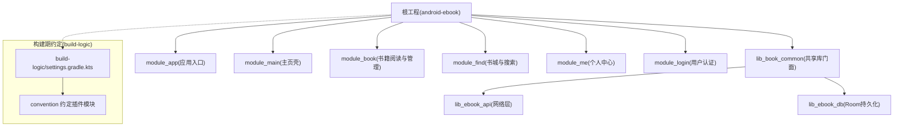
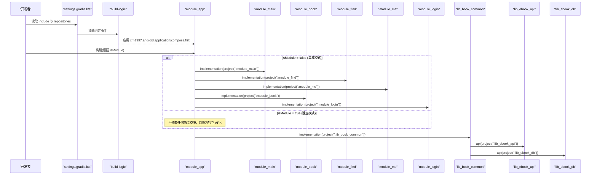
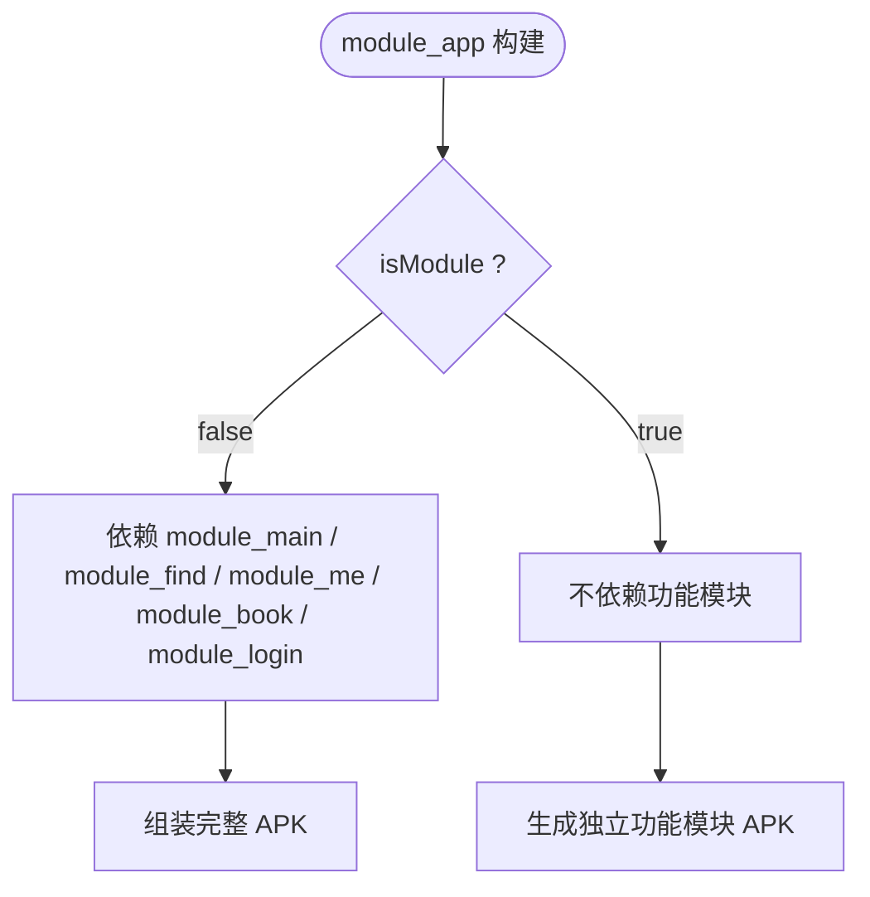
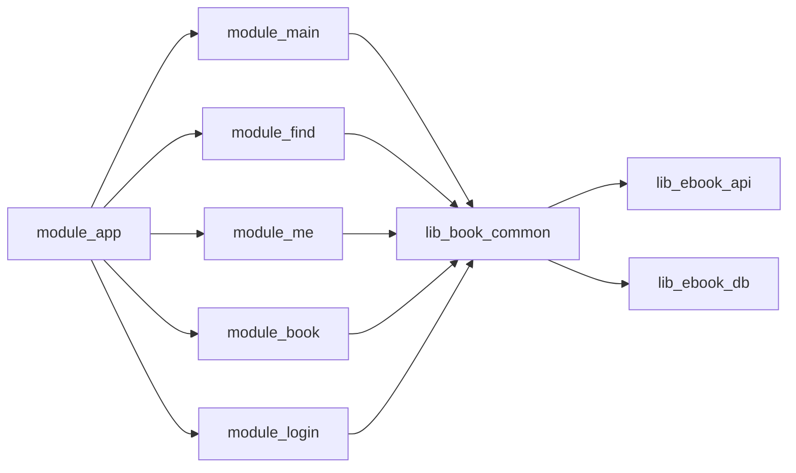

# 依赖管理策略

<cite>
**本文引用的文件**
- [settings.gradle.kts](file://settings.gradle.kts)
- [gradle/libs.versions.toml](file://gradle/libs.versions.toml)
- [gradle.properties](file://gradle.properties)
- [build-logic/settings.gradle.kts](file://build-logic/settings.gradle.kts)
- [build-logic/convention/build.gradle.kts](file://build-logic/convention/build.gradle.kts)
- [AndroidComponentConventionPlugin.kt](file://build-logic/convention/src/main/kotlin/AndroidComponentConventionPlugin.kt)
- [AndroidComposeConventionPlugin.kt](file://build-logic/convention/src/main/kotlin/AndroidComposeConventionPlugin.kt)
- [module_app/build.gradle.kts](file://module_app/build.gradle.kts)
- [lib_book_common/build.gradle.kts](file://lib_book_common/build.gradle.kts)
- [AGENTS.md](file://AGENTS.md)
</cite>

## 目录
1. 简介
2. 项目结构
3. 核心组件
4. 架构总览
5. 详细组件分析
6. 依赖关系分析
7. 性能与构建优化
8. 故障排查指南
9. 结论
10. 附录

## 简介
本文件聚焦项目的依赖管理与构建编排，围绕以下目标展开：
- 解析根 settings.gradle.kts 的 includeBuild 机制与整体引入方式
- 阐释 isModule 条件编译开关的作用原理与使用场景（功能模块独立运行 vs 集成运行）
- 说明 module_app 如何通过条件依赖注入各功能模块
- 阐述 build-logic 约定插件如何统一处理模块化配置
- 提供依赖冲突解决策略、版本统一管理方案（libs.versions.toml）与常用构建优化技巧
- 总结常见问题排查方法与最佳实践

## 项目结构
本项目为多模块 Android 工程，聚合层在根设置脚本中声明子项目和仓库源；业务与应用模块通过约定插件与版本目录获取一致能力。顶层构建还包括 Gradle 约定的自定义 build-logic 以统一插件应用和默认构建配置。

图示来源
- [settings.gradle.kts:1-65](file://settings.gradle.kts#L1-L65)
- [build-logic/settings.gradle.kts:16-49](file://build-logic/settings.gradle.kts#L16-L49)
- [build-logic/convention/build.gradle.kts:40-75](file://build-logic/convention/build.gradle.kts#L40-L75)

章节来源
- [settings.gradle.kts:1-65](file://settings.gradle.kts#L1-L65)
- [build-logic/settings.gradle.kts:16-49](file://build-logic/settings.gradle.kts#L16-L49)

## 核心组件
- 根设置脚本：集中管理仓库源、插件仓库以及 includeBuild；启用 dependencyResolutionManagement 强制全局仓库统一。
- 版本目录：统一声明所有第三方与 Android 相关依赖的版本与别名，避免在各模块硬编码版本。
- build-logic 约定插件：封装 Android、Compose、Hilt、Room、Lint 等通用配置；支持按 isModule 切换 application/library。
- 模块构建脚本：module_app 作为应用入口，通过 isModule 控制是否依赖其他功能模块；共享库声明统一的依赖边界。

章节来源
- [settings.gradle.kts:28-43](file://settings.gradle.kts#L28-L43)
- [gradle/libs.versions.toml:1-200](file://gradle/libs.versions.toml#L1-L200)
- [AndroidComponentConventionPlugin.kt:10-26](file://build-logic/convention/src/main/kotlin/AndroidComponentConventionPlugin.kt#L10-L26)
- [AndroidComposeConventionPlugin.kt:33-48](file://build-logic/convention/src/main/kotlin/AndroidComposeConventionPlugin.kt#L33-L48)
- [module_app/build.gradle.kts:46-57](file://module_app/build.gradle.kts#L46-L57)

## 架构总览
下图展示构建期到运行期的关键依赖关系与两种模式差异：

图示来源
- [settings.gradle.kts:55-65](file://settings.gradle.kts#L55-L65)
- [build-logic/convention/build.gradle.kts:40-75](file://build-logic/convention/build.gradle.kts#L40-L75)
- [module_app/build.gradle.kts:46-57](file://module_app/build.gradle.kts#L46-L57)
- [lib_book_common/build.gradle.kts:34-88](file://lib_book_common/build.gradle.kts#L34-L88)

## 详细组件分析

### 1) includeBuild 与复合构建
- 根 settings 中使用 pluginManagement 的 includeBuild("build-logic") 将自定义 build-logic 作为子构建包含，使各个功能模块可使用同名的约定插件 ID，实现一致构建体验。
- dependencyResolutionManagement 开启严格模式（FAIL_ON_PROJECT_REPOS），强制全仓只通过根定义的统一仓库解析依赖，避免子项目自行声明仓库造成不一致。

建议与实践
- 新增/调整仓库顺序时仅修改根设置，子项目不追加仓库。
- 若需联调外部本地源码，可采用 includeBuild + dependencySubstitution 的方式替换中央坐标，如注释示例中的 lib-common 替换；但需注意该特性与 isModule 的联动坑位（见“依赖冲突”小节）。

章节来源
- [settings.gradle.kts:1-27](file://settings.gradle.kts#L1-L27)
- [settings.gradle.kts:28-43](file://settings.gradle.kts#L28-L43)

### 2) isModule 条件编译开关
isModule 是贯穿构建与运行时行为的关键布尔开关：
- 位置与传递：定义在 gradle.properties，并在 module_app/build.gradle.kts 通过 project.findProperty 读取。
- 行为影响：
  - isModule=false（默认提交态）：module_app 以 Application 形式存在，并依赖全部功能模块（main/find/me/book/login），构成完整可安装的 APK。
  - isModule=true：模块可作为独立的 Application 单独调试运行（约定插件把清单指向独立 manifest，source set 自动带入 mock 数据源等）。此时 module_app 不依赖任何功能模块，产出的是空壳应用。
- 安全提示：请勿通过 ./gradlew -PisModule=true 覆盖，因为 -P 会渗入 settings 的 includeBuild 上下文，可能导致 lib_common 误用 application 插件引发冲突。请在 gradle.properties 临时修改，改回后再提交。

章节来源
- [gradle.properties:21-29](file://gradle.properties#L21-L29)
- [module_app/build.gradle.kts:46-57](file://module_app/build.gradle.kts#L46-L57)
- [AndroidComponentConventionPlugin.kt:10-26](file://build-logic/convention/src/main/kotlin/AndroidComponentConventionPlugin.kt#L10-L26)
- [AndroidComposeConventionPlugin.kt:33-48](file://build-logic/convention/src/main/kotlin/AndroidComposeConventionPlugin.kt#L33-L48)
- [AGENTS.md:60-84](file://AGENTS.md#L60-L84)

### 3) module_app 的条件依赖注入
module_app 的依赖声明会根据 isModule 选择性地引入功能模块：
- isModule=false：引入 :module_main、:module_find、:module_me、:module_book、:module_login，形成完整的 UI 导航与业务装配。
- isModule=true：不引入任何功能模块，便于各功能模块独立构建/测试/调试。

这体现了“应用装配器”职责单一原则：app 不承载具体业务页面，只负责聚合与启动。

图示来源
- [module_app/build.gradle.kts:46-57](file://module_app/build.gradle.kts#L46-L57)

章节来源
- [module_app/build.gradle.kts:46-57](file://module_app/build.gradle.kts#L46-L57)

### 4) build-logic 约定插件的统一化处理
约定插件集中在 build-logic/convention 中注册，暴露统一插件 ID 供各模块使用：
- xrn1997.android.component：统一 AGP 组件配置，并按 isModule 决定应用 application 还是 library。
- xrn1997.android.compose：统一 Compose 编译与依赖注入。
- xrn1997.hilt、xrn1997.android.room、xrn1997.android.lint：统一 Hilt/Room/Lint 能力装配。

这些插件内部对 isModule 进行分支处理，确保同一模块既能独立调试又能被集成应用复用。同时通过版本目录给 build-logic 自身提供一致的插件依赖。

章节来源
- [build-logic/convention/build.gradle.kts:23-31](file://build-logic/convention/build.gradle.kts#L23-L31)
- [build-logic/convention/build.gradle.kts:40-75](file://build-logic/convention/build.gradle.kts#L40-L75)
- [AndroidComponentConventionPlugin.kt:10-26](file://build-logic/convention/src/main/kotlin/AndroidComponentConventionPlugin.kt#L10-L26)
- [AndroidComposeConventionPlugin.kt:33-48](file://build-logic/convention/src/main/kotlin/AndroidComposeConventionPlugin.kt#L33-L48)
- [build-logic/settings.gradle.kts:25-46](file://build-logic/settings.gradle.kts#L25-L46)

### 5) 共享库 lib_book_common 的依赖边界
- 对外暴露：api(libs.common)、api(lib_ebook_api)、lib_ebook_db、AndroidX、Material、Compose BOM、Retrofit/Serialization/OkHttp 相关能力，保证上层模块无需重复声明。
- 对内收敛：使用 implementation 限定不会透传的依赖（如 room runtime 某些扩展在 TransactionModule 内使用，不向上传播）。
- 作用：为 feature modules 提供统一的领域库能力、UI 与工具集，降低各模块重复依赖风险。

章节来源
- [lib_book_common/build.gradle.kts:34-88](file://lib_book_common/build.gradle.kts#L34-L88)

## 依赖关系分析
依赖方向约束
- 单向依赖：业务模块 → lib_book_common → lib_ebook_api → lib_ebook_db。lib_ebook_db 为基础库，无交叉依赖。
- module_app 仅在集成模式下依赖各业务模块；isModule=true 时不引入。

图示来源
- [module_app/build.gradle.kts:46-57](file://module_app/build.gradle.kts#L46-L57)
- [lib_book_common/build.gradle.kts:34-88](file://lib_book_common/build.gradle.kts#L34-L88)

版本统一管理（libs.versions.toml）
- 版本集中维护于 [gradle/libs.versions.toml]，通过 version 段、bundle 与 libraries 段统一命名与引用，避免散落在 build 脚本中。
- AGP/Kotlin/Hilt/Room/Compose 等核心依赖均在此处统一管理，升级时无需在多个模块改动版本号。

依赖冲突预防与解决策略
- 统一仓库：dependencyResolutionManagement 限制每个项目不可自声明仓库（FAIL_ON_PROJECT_REPOS），防止不同源导致版本冲突或无法解析。
- BOM 优先：Compose 等组件采用 BOM 管理兼容版本，减少横切依赖冲突。
- 显式替换：必要时通过 settings 的 dependencySubstitution 将远程工件替换为本地的 includeBuild 项目（参见根 settings 注释示例），用于局部联调，完成后恢复为中央坐标。
- 隔离 scope：尽量用 implementation 而非 api 避免不必要的依赖传递，缩小类空间。
- 冲突定位：当出现“重复类/方法”、“AAPT 资源冲突”等问题时，先打印依赖树（gradlew :module:dependencies），再根据冲突坐标在 libs.versions.toml 中统一下调或改用 BOM 对齐。

章节来源
- [settings.gradle.kts:28-43](file://settings.gradle.kts#L28-L43)
- [gradle/libs.versions.toml:1-200](file://gradle/libs.versions.toml#L1-L200)
- [lib_book_common/build.gradle.kts:34-88](file://lib_book_common/build.gradle.kts#L34-L88)

## 性能与构建优化
- Gradle Daemon 与并行
  - 已在 gradle.properties 配置 JVM 参数，建议结合并发构建（org.gradle.parallel 可根据环境开启）。
- KSP 增量编译
  - 已开启 ksp.incremental 和 intermodule，显著缩短增量构建时间。
- Compose BOM
  - 通过平台依赖锁定 Compose 组件间版本一致性，减少不必要重编。
- 插件与依赖最小化
  - 使用 xrn1997.* 约定插件，统一裁剪与装配，避免重复配置带来开销。
- R8/ProGuard
  - release 关闭混淆以便快速验证，可按需开启并进行规则精简与校验。

章节来源
- [gradle.properties:16-36](file://gradle.properties#L16-L36)
- [lib_book_common/build.gradle.kts:12-22](file://lib_book_common/build.gradle.kts#L12-L22)

## 故障排查指南
常见症状与对策
- includeBuild 联调导致插件冲突
  - 现象：提示 com.android.application 与 com.android.library 不可同时应用。
  - 原因：通过 -PisModule=true 覆盖了 settings.includeBuild 上下文，使 lib_common 误套 application 插件。
  - 处置：改为在 gradle.properties 中切换 isModule，避免命令参数渗漏；必要时注释掉 includeBuild 再构建。
- 跨模块路由在独立模式下静默丢失
  - 现象：TheRouter 跳转无日志无报错，页面缺失。
  - 原因：独立模式缺少对方模块的路由占位。
  - 处置：在 src/main/test/debug/ 对应宿主补上同名 @Route 占位，并确保重新构建刷新 routeMap 资产。
- 独立/集成清单不同步导致 Manifest 合并异常
  - 现象：两种模式权限或 Activity 不一致。
  - 原因：src/main 与 src/main/module 的 AndroidManifest.xml 是替换关系，需同步维护。
  - 处置：对比两份清单，补齐差异；构建后核查合并产物确认。
- flavor 与 source set 混合模式错误
  - 现象：Mock/Real 数据源未按预期生效。
  - 处置：核对 productFlavors dimension 名称与 source set 路径正确性，确认 MockNetworkModule 与对应接口实现处于正确 source set。
- Room/Semantics 迁移问题
  - 现象：数据库 schema 变更导致崩溃。
  - 处置：遵循 ADR 迁移链要求，递增 version 并追加 MIGRATION_n_n+1，禁止开启破坏性迁移。

章节来源
- [AGENTS.md:60-84](file://AGENTS.md#L60-L84)
- [settings.gradle.kts:46-53](file://settings.gradle.kts#L46-L53)
- [gradle.properties:21-29](file://gradle.properties#L21-L29)

## 结论
本项目的依赖管理以“中心化的仓库与版本目录 + 约定插件统一装配 + isModule 开关解耦开发与集成”为核心策略。通过根级 dependencyResolutionManagement 与 libs.versions.toml 强控版本一致性；借助 build-logic 约定插件消除样板配置与重复风险；凭借 isModule 实现灵活的功能模块独立调试与完整应用的集成构建。配合严格的依赖方向约束、BOM 管控和合理的 scope 划分，既保证了大型工程的可维护性，又兼顾了开发效率与构建速度。

## 附录
- 快速参考
  - 切换集成态/独立态：编辑 gradle.properties 的 isModule，不要使用 -P 覆盖。
  - 查看依赖树：./gradlew :module_app:dependencies
  - 构建全量：./gradlew assemble
  - 构建特定 Flavor：./gradlew :module_app:assemble{Real,Mock}Debug
  - 清理缓存与重试：./gradlew clean build --no-build-cache
- 依赖管理最佳实践清单
  - 新依赖一律加入 libs.versions.toml 并通过 alias 引用
  - 仅在必要处使用 api，其余用 implementation
  - 使用 BOM 管理横向兼容套件（如 Compose）
  - 遇到冲突优先统一版本，其次考虑排除，最后才考虑替换
  - 修改清单必须保持两套（集成/独立）一致
  - 提交前确保 isModule 为 false，保持可安装集成体