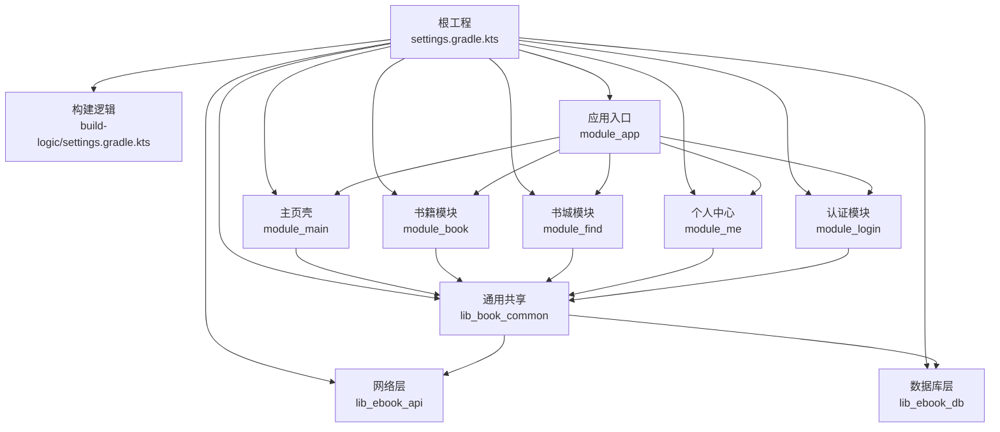
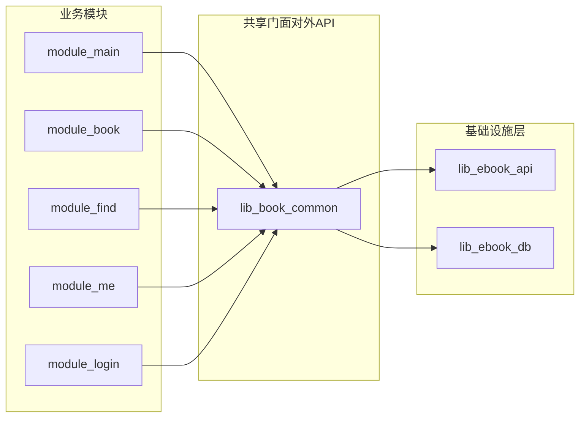
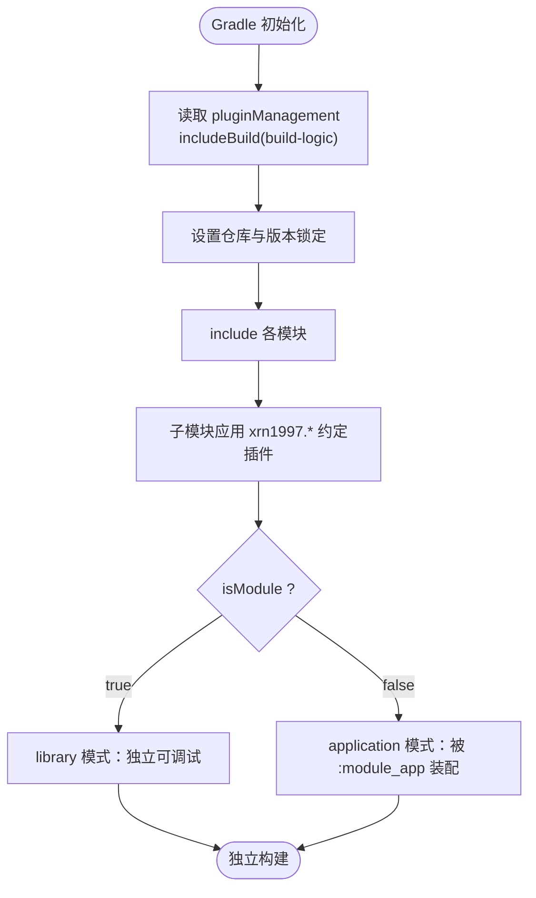
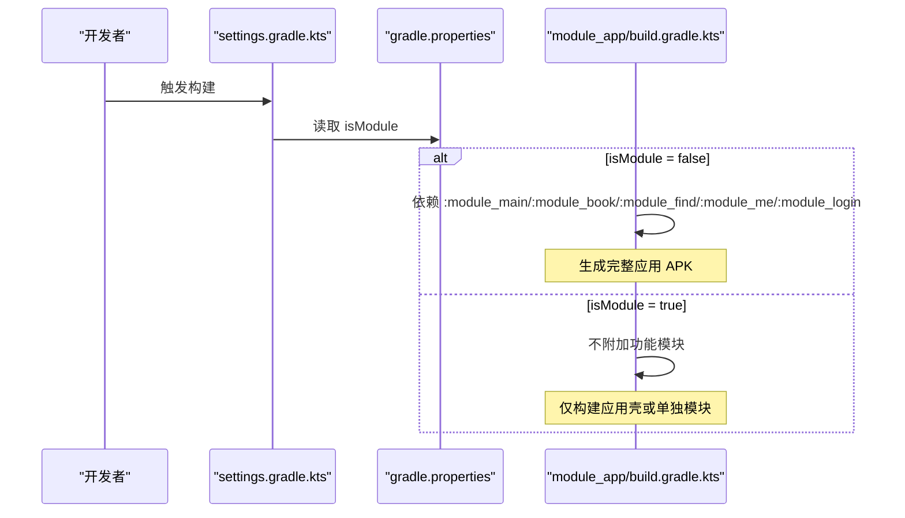
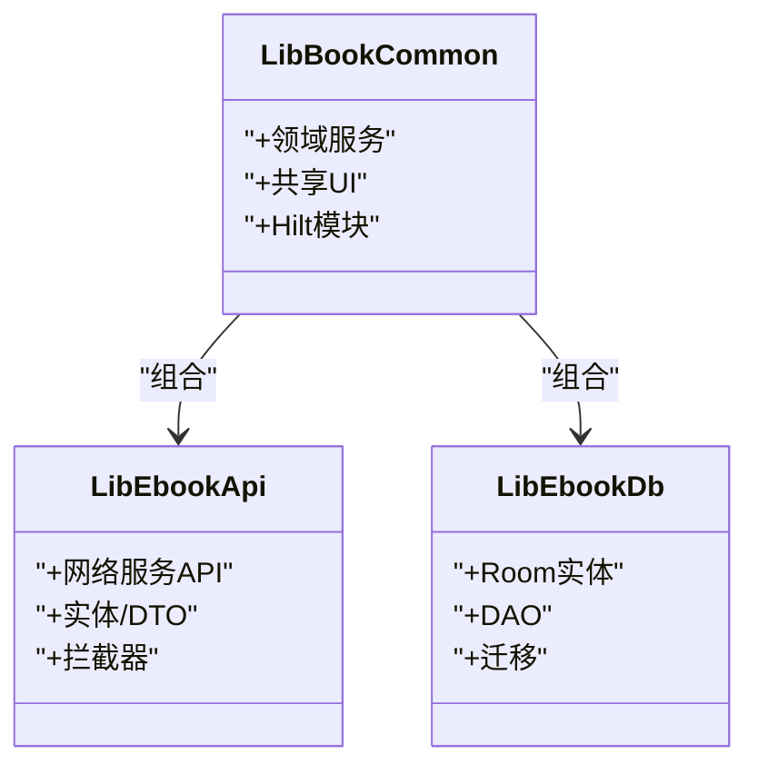
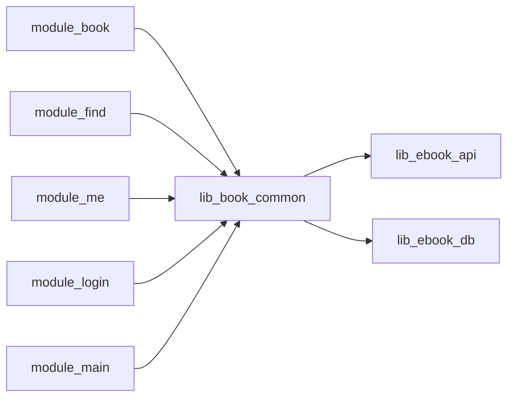

# 多模块管理策略

<cite>
**本文引用的文件**   
- [settings.gradle.kts](file://settings.gradle.kts)
- [gradle.properties](file://gradle.properties)
- [module_app/build.gradle.kts](file://module_app/build.gradle.kts)
- [module_main/build.gradle.kts](file://module_main/build.gradle.kts)
- [module_book/build.gradle.kts](file://module_book/build.gradle.kts)
- [module_find/build.gradle.kts](file://module_find/build.gradle.kts)
- [module_me/build.gradle.kts](file://module_me/build.gradle.kts)
- [module_login/build.gradle.kts](file://module_login/build.gradle.kts)
- [lib_book_common/build.gradle.kts](file://lib_book_common/build.gradle.kts)
- [lib_ebook_api/build.gradle.kts](file://lib_ebook_api/build.gradle.kts)
- [lib_ebook_db/build.gradle.kts](file://lib_ebook_db/build.gradle.kts)
- [build-logic/convention/build.gradle.kts](file://build-logic/convention/build.gradle.kts)
- [build-logic/settings.gradle.kts](file://build-logic/settings.gradle.kts)
- [lib-common-build/settings.gradle.kts](file://lib-common-build/settings.gradle.kts)
- [gradle/libs.versions.toml](file://gradle/libs.versions.toml)
- [AGENTS.md](file://AGENTS.md)
</cite>

## 目录
1. [简介](#简介)
2. [项目结构](#项目结构)
3. [核心组件](#核心组件)
4. [架构总览](#架构总览)
5. [详细组件分析](#详细组件分析)
6. [依赖关系分析](#依赖关系分析)
7. [性能与构建性能](#性能与构建性能)
8. [故障排查指南](#故障排查指南)
9. [结论](#结论)
10. [附录：模块拆分设计原则与防环策略](#附录模块拆分设计原则与防环策略)

## 简介
本文面向 Android 小说阅读器的多模块管理，系统阐述以 Gradle `include` 组织模块、通过自定义约定插件实现“独立模块/集成应用”双模式、以及基于 TheRouter + Provider 的跨模块通信机制。重点包括：
- settings 与 includeBuild 的协作方式（根聚合、构建逻辑插件与本地联动）
- 条件编译开关 `isModule` 的影响范围与使用约束
- 业务模块 → lib_book_common → lib_ebook_api → lib_ebook_db 的分层边界与解耦
- module_app 的装配职责与各功能模块的独立性

## 项目结构
本仓库采用 Gradle 多模块结构，根工程统一声明模块与仓库，并通过 build-logic 提供约定插件，实现对 AGP/Kotlin/Compose/Hilt/Room 的统一配置。关键构成如下：

- 根 settings：集中 declare 所有 `:module_*` 与 `:lib_*` 工程，定义插件管理与中央仓库镜像，默认关闭对 lib-common 源码级复合构建
- build-logic/convention：输出 `xrn1997.*` 系列约定插件，其中 `android.component` 负责切换 application/library 模式
- 共享库层：lib_book_common 是门面，向上暴露通用 UI、跨域领域能力；lib_ebook_api 提供网络与实体；lib_ebook_db 提供 Room 持久化
- 业务模块：module_app 为可安装入口，module_main/book/find/me/login 为业务功能模块，彼此不直接互依
- lib-common-build：可选复合构建，用于在开发期把 lib_common 替换成本地项目联调

图表来源
- [settings.gradle.kts:56-64](file://settings.gradle.kts#L56-L64)
- [module_app/build.gradle.kts:51-56](file://module_app/build.gradle.kts#L51-L56)
- [module_main/build.gradle.kts:44-51](file://module_main/build.gradle.kts#L44-L51)
- [module_book/build.gradle.kts:54-58](file://module_book/build.gradle.kts#L54-L58)
- [module_find/build.gradle.kts:46-51](file://module_find/build.gradle.kts#L46-L51)
- [module_me/build.gradle.kts:53-60](file://module_me/build.gradle.kts#L53-L60)
- [module_login/build.gradle.kts:45-49](file://module_login/build.gradle.kts#L45-L49)
- [lib_book_common/build.gradle.kts:34-68](file://lib_book_common/build.gradle.kts#L34-L68)
- [lib_ebook_api/build.gradle.kts:48-72](file://lib_ebook_api/build.gradle.kts#L48-L72)
- [lib_ebook_db/build.gradle.kts:38-52](file://lib_ebook_db/build.gradle.kts#L38-L52)

章节来源
- [settings.gradle.kts:1-64](file://settings.gradle.kts#L1-L64)
- [build-logic/convention/build.gradle.kts:40-75](file://build-logic/convention/build.gradle.kts#L40-L75)

## 核心组件
- 根工程与依赖解析
  - 统一声明插件管理仓库与依赖解析仓库，开启 `FAIL_ON_PROJECT_REPOS` 避免子模块各自配源
  - 包含所有模块；默认注释掉对 `lib-common-build` 的 includeBuild（当前 lib_common 走 Maven 坐标）
- 构建逻辑约定插件
  - 注册 `xrn1997.android.component` 等插件 ID；`component` 根据 `isModule` 决定 application/library 模式
- 应用入口与模块装配
  - module_app 应用 application 插件，定义 product flavors（real/mock）；在非独立模式下依赖全部功能模块
- 共享门面和基础库
  - lib_book_common 聚合 lib_ebook_api、lib_ebook_db 及 Compose UI 能力，向业务模块暴露稳定接口
  - lib_ebook_api 对外暴露网络 API 和 DTO（api 类型传递），lib_ebook_db 暴露 DAO/Entity（Room）
- 版本目录
  - gradle/libs.versions.toml 集中管理所有第三方库版本，避免在各模块重复硬编码

章节来源
- [settings.gradle.kts:1-64](file://settings.gradle.kts#L1-L64)
- [build-logic/convention/build.gradle.kts:40-75](file://build-logic/convention/build.gradle.kts#L40-L75)
- [module_app/build.gradle.kts:1-63](file://module_app/build.gradle.kts#L1-L63)
- [lib_book_common/build.gradle.kts:34-88](file://lib_book_common/build.gradle.kts#L34-L88)
- [lib_ebook_api/build.gradle.kts:48-72](file://lib_ebook_api/build.gradle.kts#L48-L72)
- [lib_ebook_db/build.gradle.kts:38-52](file://lib_ebook_db/build.gradle.kts#L38-L52)
- [gradle/libs.versions.toml:1-200](file://gradle/libs.versions.toml#L1-L200)

## 架构总览
多模块分层遵循严格的单向依赖：业务模块只面向 lib_book_common 暴露的稳定接口；lib_book_common 作为门面组合网络与数据层；网络层与数据库层互不耦合或仅单向依赖。模块之间不允许反向依赖，避免形成循环。

图表来源
- [lib_book_common/build.gradle.kts:34-68](file://lib_book_common/build.gradle.kts#L34-L68)
- [module_main/build.gradle.kts:44-51](file://module_main/build.gradle.kts#L44-L51)
- [module_book/build.gradle.kts:54-58](file://module_book/build.gradle.kts#L54-L58)
- [module_find/build.gradle.kts:46-51](file://module_find/build.gradle.kts#L46-L51)
- [module_me/build.gradle.kts:53-60](file://module_me/build.gradle.kts#L53-L60)
- [module_login/build.gradle.kts:45-49](file://module_login/build.gradle.kts#L45-L49)

## 详细组件分析

### 模块装配与 include/includeBuild 机制
- 根 settings 通过 `include(":module_*", ":lib_*")` 统一纳入所有模块，形成单 Gradle 工程的构建视图
- `pluginManagement` 将 `build-logic` 以 `includeBuild` 加入，使根工程能直接使用约定插件并享受其 DSL
- 对 lib_common 的原地联调采用可选的 `lib-common-build` 复合构建：通过 `includeBuild("lib-common-build")` 并将 `io.github.xrn1997:common` 替换为本地 `:lib_common` 项目；当前默认关闭，改回 Maven 坐标便于团队共享
- 各子模块通过约定插件快速启用 application/library/compose/hilt/room，无需手写重复配置

图表来源
- [settings.gradle.kts:4-20](file://settings.gradle.kts#L4-L20)
- [build-logic/settings.gradle.kts:48-49](file://build-logic/settings.gradle.kts#L48-L49)
- [build-logic/convention/build.gradle.kts:40-75](file://build-logic/convention/build.gradle.kts#L40-L75)
- [gradle.properties:21-29](file://gradle.properties#L21-L29)

章节来源
- [settings.gradle.kts:1-64](file://settings.gradle.kts#L1-L64)
- [build-logic/settings.gradle.kts:16-49](file://build-logic/settings.gradle.kts#L16-L49)
- [lib-common-build/settings.gradle.kts:9-67](file://lib-common-build/settings.gradle.kts#L9-L67)
- [gradle.properties:1-36](file://gradle.properties#L1-L36)

### isModule 条件编译与运行差异
- 由约定插件 `xrn1997.android.component` 驱动：值为 `true` 时，模块按 application 模式可独立运行；为 `false` 时作为 library 被组装进宿主应用
- module_app 中通过读取属性决定是否依赖各功能模块：`!isModule` 时才添加对所有功能模块的 dependency，确保集成态产出完整 APK
- 注意事项
  - 提交态必须保持 `isModule=false`，否则宿主不会组装功能模块
  - 禁止用命令行 `-PisModule=true` 覆盖，因为该值会穿透到 includedBuild 的 gradle 进程，导致 lib_common 误套 application 插件而失败

图表来源
- [gradle.properties:21-29](file://gradle.properties#L21-L29)
- [module_app/build.gradle.kts:46-57](file://module_app/build.gradle.kts#L46-L57)

章节来源
- [gradle.properties:21-29](file://gradle.properties#L21-L29)
- [module_app/build.gradle.kts:46-57](file://module_app/build.gradle.kts#L46-L57)

### module_app 装配职责与多 Flavor
- 应用入口模块定义 Application 类名、包名与应用标识，并定义 `network` flavor dimension 下的 `real` 与 `mock` 变体，分别对接真实后端或内存 mock
- 在非独立模式（`isModule=false`）下，module_app 依赖所有功能模块以完成启动、路由与页面编排；这使其成为“装配器”，自身不应承载具体业务实现
- 构建产物包含真实与 mock 两种 APK，便于前后端联调和测试

章节来源
- [module_app/build.gradle.kts:1-63](file://module_app/build.gradle.kts#L1-L63)

### 功能模块独立性
- 每个业务模块均依赖 `lib_book_common` 暴露的通用能力与接口，彼此之间不相互依赖
- 通过 TheRouter + Provider 进行跨模块导航与服务访问：调用方仅需知道路径/接口，实现由对应模块提供
- 独立模式（`isModule=true`）下，每个模块可配置独立的 test/debug 宿主与路由占位，保证模块级开发不受其他模块限制

章节来源
- [AGENTS.md](file://AGENTS.md)

### 跨模块导航：TheRouter 与 Provider 模式
- TheRouter：基于 APT 生成路由表，运行时依据路径跳转至目标页面或服务，避免直接依赖
- Provider：以接口形式暴露跨模块能力（例如登录、书城、我的书架），由各业务模块提供具体实现；module_main 持有 NavHost 按需组合页面组件
- 优势：松耦合、可按需加载、便于独立开发与 Mock 替换

说明：本段为架构与模式的总体说明，不涉及具体代码行号引用

### 分层共享库：lib_book_common / lib_ebook_api / lib_ebook_db
- lib_book_common
  - 作为门面，组合网络层（Retrofit/OkHttp）、数据库层（Room）、共享 UI（Compose 组件与主题令牌）
  - 通过 Hilt 提供领域服务与 DI 模块；对外暴露 Repository、Domain、UI、事件总线等稳定契约
- lib_ebook_api
  - 定义网络服务的 Retrofit API、DTO、拦截器与适配封装；通过 api 透传类型，让上层复用请求响应模型
- lib_ebook_db
  - 纯数据持久化层，仅依赖必要的基础库；DAO、Entity、迁移脚本在此维护

图表来源
- [lib_book_common/build.gradle.kts:34-68](file://lib_book_common/build.gradle.kts#L34-L68)
- [lib_ebook_api/build.gradle.kts:48-72](file://lib_ebook_api/build.gradle.kts#L48-L72)
- [lib_ebook_db/build.gradle.kts:38-52](file://lib_ebook_db/build.gradle.kts#L38-L52)

章节来源
- [lib_book_common/build.gradle.kts:34-88](file://lib_book_common/build.gradle.kts#L34-L88)
- [lib_ebook_api/build.gradle.kts:1-72](file://lib_ebook_api/build.gradle.kts#L1-L72)
- [lib_ebook_db/build.gradle.kts:1-52](file://lib_ebook_db/build.gradle.kts#L1-L52)

## 依赖关系分析
- 单向依赖原则
  - 业务模块只能依赖 lib_book_common；不得互相依赖
  - lib_book_common 可依赖 lib_ebook_api 与 lib_ebook_db
  - lib_ebook_api 与 lib_ebook_db 为基础层，不反向依赖上层
- 避免循环依赖的策略
  - 新增能力先问“是否可放入共享层？”若仅在单一模块使用则下沉至该模块；只有被≥2个模块需要才上提至 lib_book_common
  - 对外只保留抽象/接口（Provider、Repository、Domain Model），实现放在模块内
  - 当出现编译期循环时，优先考虑引入中间层接口或调整事件传递方式

图表来源
- [module_book/build.gradle.kts:54-58](file://module_book/build.gradle.kts#L54-L58)
- [module_find/build.gradle.kts:46-51](file://module_find/build.gradle.kts#L46-L51)
- [module_me/build.gradle.kts:53-60](file://module_me/build.gradle.kts#L53-L60)
- [module_login/build.gradle.kts:45-49](file://module_login/build.gradle.kts#L45-L49)
- [module_main/build.gradle.kts:44-51](file://module_main/build.gradle.kts#L44-L51)
- [lib_book_common/build.gradle.kts:34-68](file://lib_book_common/build.gradle.kts#L34-L68)

章节来源
- [AGENTS.md](file://AGENTS.md)

## 性能与构建性能
- 增量编译与 KSP 优化
  - 启用增量 KSP（`ksp.incremental`、`ksp.incremental.log`、`ksp.incremental.intermodule`），减少跨模块注解处理开销
- 单线程/并行构建
  - 可通过 Gradle 参数控制；建议在大工程中使用多线程构建提升编译效率
- 减少不必要依赖
  - 各模块显式声明所需依赖，避免隐式传递造成的膨胀；参考 libs.versions.toml 统一管理
- 模块粒度与编译任务隔离
  - 模块间解耦良好时，Gradle 可以并行编译不同模块；保持最小化的 cross-module 依赖有助于加速全量构建

[本节为一般性建议，不涉及特定文件内容分析]

## 故障排查指南
- 无法启动或功能缺失（集成模式）
  - 检查 `gradle.properties` 是否为 `isModule=false`；检查 module_app 是否正确依赖了全部功能模块
- 独立模式无法跳转其他模块
  - 确认已在 test/debug 宿主补充占位的 @Route 路径，且再次构建以刷新路由表
- 编译时报插件冲突（同时应用 application 与 library）
  - 不要使用 `-PisModule=true` 覆盖；应在 properties 文件中临时修改后恢复
- 构建过慢
  - 查看是否启用了不必要的依赖传递；检查是否存在跨模块未收敛的循环依赖
- 依赖解析失败或镜像问题
  - 确认根 settings 的仓库已优先指向国内镜像；必要时清理本地缓存

章节来源
- [gradle.properties:21-29](file://gradle.properties#L21-L29)
- [settings.gradle.kts:6-18](file://settings.gradle.kts#L6-L18)

## 结论
本项目通过清晰的 Gradle 模块划分、约定插件与条件编译实现了“模块化、可独立开发、易装配”的工程结构：
- 根 settings 集中治理模块与仓库
- build-logic 统一构建配置，通过 `isModule` 平滑切换独立与集成模式
- 业务模块轻量、解耦，依靠共享门面向上提供服务
- 网络与数据层位于最底层，保障稳定与可测试
- TheRouter + Provider 模式使跨模块导航与服务调用简洁可靠

## 附录：模块拆分设计原则与防环策略
- 拆分解耦
  - “单一职责+最少依赖”：每个模块只做一件事，面向抽象而非实现
  - “公共件上收、专用件下沉”：被多个模块使用的稳定能力进入 lib_book_common，单一使用者尽量留在业务模块
- 依赖方向
  - 自顶向下：业务模块 → 共享门面对象 → 网络/数据基础设施
  - 禁止反向引用；出现反向需求时重构为接口或事件通道
- 接口即契约
  - 通过 Provider/Repository/Domain 暴露稳定 API；实现变化不波及调用方
- 渐进式演进
  - 先跑通再优化；优先保证正确性与可维护性，再做规模化性能优化
- 验证与回归
  - 每次模块变更应配合单元测试、Robolectric、基线仪器测试（见模块配置）

[本节为方法论总结，不直接分析具体代码文件]