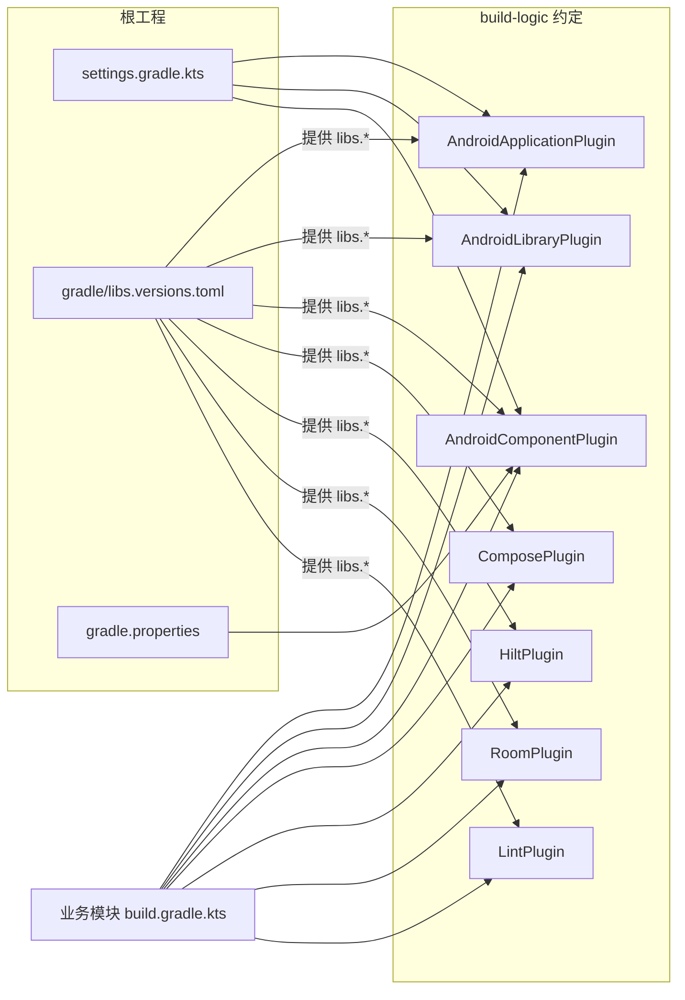
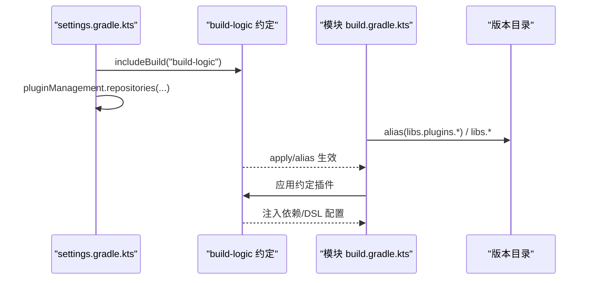

# 构建配置体系

<cite>
**本文引用的文件**
- [gradle/libs.versions.toml](file://gradle/libs.versions.toml)
- [settings.gradle.kts](file://settings.gradle.kts)
- [gradle.properties](file://gradle.properties)
- [build-logic/convention/build.gradle.kts](file://build-logic/convention/build.gradle.kts)
- [build-logic/convention/src/main/kotlin/AndroidApplicationConventionPlugin.kt](file://build-logic/convention/src/main/kotlin/AndroidApplicationConventionPlugin.kt)
- [build-logic/convention/src/main/kotlin/AndroidLibraryConventionPlugin.kt](file://build-logic/convention/src/main/kotlin/AndroidLibraryConventionPlugin.kt)
- [build-logic/convention/src/main/kotlin/AndroidComponentConventionPlugin.kt](file://build-logic/convention/src/main/kotlin/AndroidComponentConventionPlugin.kt)
- [build-logic/convention/src/main/kotlin/AndroidComposeConventionPlugin.kt](file://build-logic/convention/src/main/kotlin/AndroidComposeConventionPlugin.kt)
- [build-logic/convention/src/main/kotlin/HiltConventionPlugin.kt](file://build-logic/convention/src/main/kotlin/HiltConventionPlugin.kt)
- [build-logic/convention/src/main/kotlin/AndroidRoomConventionPlugin.kt](file://build-logic/convention/src/main/kotlin/AndroidRoomConventionPlugin.kt)
- [build-logic/convention/src/main/kotlin/AndroidLintConventionPlugin.kt](file://build-logic/convention/src/main/kotlin/AndroidLintConventionPlugin.kt)
- [build-logic/convention/src/main/kotlin/com/xrn1997/convention/KotlinAndroid.kt](file://build-logic/convention/src/main/kotlin/com/xrn1997/convention/KotlinAndroid.kt)
- [build-logic/convention/src/main/kotlin/com/xrn1997/convention/AndroidCompose.kt](file://build-logic/convention/src/main/kotlin/com/xrn1997/convention/AndroidCompose.kt)
- [build-logic/convention/src/main/kotlin/com/xrn1997/convention/GradleManagedDevices.kt](file://build-logic/convention/src/main/kotlin/com/xrn1997/convention/GradleManagedDevices.kt)
- [build-logic/convention/src/main/kotlin/com/xrn1997/convention/PrintTestApks.kt](file://build-logic/convention/src/main/kotlin/com/xrn1997/convention/PrintTestApks.kt)
- [module_app/build.gradle.kts](file://module_app/build.gradle.kts)
- [lib_book_common/build.gradle.kts](file://lib_book_common/build.gradle.kts)
- [compose_compiler_config.conf](file://compose_compiler_config.conf)
</cite>

## 目录
1. [简介](#简介)
2. [项目结构](#项目结构)
3. [核心组件](#核心组件)
4. [架构总览](#架构总览)
5. [详细组件分析](#详细组件分析)
6. [依赖与版本管理](#依赖与版本管理)
7. [性能优化与可维护性](#性能优化与可维护性)
8. [故障排查指南](#故障排查指南)
9. [结论](#结论)
10. [附录：新模块接入模板与最佳实践](#附录：新模块接入模板与最佳实践)

## 简介
本仓库采用 Gradle 约定插件（Convention Plugins）将 Android 项目的构建配置、Kotlin 编译选项、AGP 配置、Compose 支持、Hilt、Room、LInt 等能力统一到 build-logic 中，并通过根级版本目录 gradle/libs.versions.toml 实现全仓版本集中管理。本文面向“如何理解并高效使用构建配置体系”，同时给出扩展建议、调试方法与常见问题处理。

## 项目结构
构建体系围绕以下关键区域展开：
- 根级依赖与脚本入口：settings.gradle.kts、gradle/libs.versions.toml、gradle.properties
- build-logic：自定义约定插件的定义、注册与通用逻辑实现
- 各模块的 build.gradle.kts：通过 apply 或 alias 引入约定插件，组合出最终构建行为

```mermaid
graph TB
    A["settings.gradle.kts"] --> B["includeBuild(\"build-logic\")"]
    B --> C["build-logic/convention<br/>自定义插件注册"]
    C --> D["xrn1997.android.application<br/>xrn1997.android.library<br/>xrn1997.android.component"]
    C --> E["xrn1997.android.compose"]
    C --> F["xrn1997.hilt / xrn1997.android.room / xrn1997.android.lint"]
    G["模块 build.gradle.kts"] -->|apply/alias| D
    G -->|可选| E
    G -->|可选| F
```

图表来源
- [settings.gradle.kts:4-6](file://settings.gradle.kts#L4-L6)
- [build-logic/convention/build.gradle.kts:40-74](file://build-logic/convention/build.gradle.kts#L40-L74)

章节来源
- [settings.gradle.kts:1-65](file://settings.gradle.kts#L1-L65)
- [gradle/libs.versions.toml:1-200](file://gradle/libs.versions.toml#L1-L200)

## 核心组件
- 应用/库/组件三类基础约定插件
  - AndroidApplicationConventionPlugin：统一 application 默认 targetSdk=37、applicationId=namespace、受管设备等
  - AndroidLibraryConventionPlugin：统一 library 测试目标、JUnit/test dependencies、受管设备等
  - AndroidComponentConventionPlugin：根据 isModule 自动注入 application/library 主题，并在独立模式下切换 manifest 与 Kotlin 源集
- Compose 约定插件：启用 Compose、装配 Compose BOM、可选开启度量与报告输出
- Hilt 约定插件：在 Android 与 JVM 上下文中按需启用 Hilt 及其注解处理器
- Room 约定插件：启用 androidx.room3 与 KSP、设置 schema 目录、注入 runtime/sqlite-bundled
- Lint 约定插件：按类型自动挂载并输出 xmlReport、检查依赖
- Kotlin/Compose 通用配置：JDK 17、compileSdk/minSdk、desugaring、warningsAsErrors、协程实验 API

章节来源
- [AndroidApplicationConventionPlugin.kt:28-49](file://build-logic/convention/src/main/kotlin/AndroidApplicationConventionPlugin.kt#L28-L49)
- [AndroidLibraryConventionPlugin.kt:30-68](file://build-logic/convention/src/main/kotlin/AndroidLibraryConventionPlugin.kt#L30-L68)
- [AndroidComponentConventionPlugin.kt:7-34](file://build-logic/convention/src/main/kotlin/AndroidComponentConventionPlugin.kt#L7-L34)
- [AndroidComposeConventionPlugin.kt:25-60](file://build-logic/convention/src/main/kotlin/AndroidComposeConventionPlugin.kt#L25-L60)
- [HiltConventionPlugin.kt:24-49](file://build-logic/convention/src/main/kotlin/HiltConventionPlugin.kt#L24-L49)
- [AndroidRoomConventionPlugin.kt:26-52](file://build-logic/convention/src/main/kotlin/AndroidRoomConventionPlugin.kt#L26-L52)
- [AndroidLintConventionPlugin.kt:25-47](file://build-logic/convention/src/main/kotlin/AndroidLintConventionPlugin.kt#L25-L47)
- [KotlinAndroid.kt:34-91](file://build-logic/convention/src/main/kotlin/com/xrn1997/convention/KotlinAndroid.kt#L34-L91)
- [AndroidCompose.kt:29-75](file://build-logic/convention/src/main/kotlin/com/xrn1997/convention/AndroidCompose.kt#L29-L75)

## 架构总览
下面以“模块化 + 约定插件 + 版本目录”为中心说明构建体系的工作方式与数据流。



图表来源
- [settings.gradle.kts:4-6,28-43](file://settings.gradle.kts#L4-L6)
- [build-logic/convention/build.gradle.kts:23-74](file://build-logic/convention/build.gradle.kts#L23-L74)
- [AndroidComponentConventionPlugin.kt:9-33](file://build-logic/convention/src/main/kotlin/AndroidComponentConventionPlugin.kt#L9-L33)
- [AndroidComposeConventionPlugin.kt:37-58](file://build-logic/convention/src/main/kotlin/AndroidComposeConventionPlugin.kt#L37-L58)
- [HiltConventionPlugin.kt:24-49](file://build-logic/convention/src/main/kotlin/HiltConventionPlugin.kt#L24-L49)
- [AndroidRoomConventionPlugin.kt:26-52](file://build-logic/convention/src/main/kotlin/AndroidRoomConventionPlugin.kt#L26-L52)
- [AndroidLintConventionPlugin.kt:25-47](file://build-logic/convention/src/main/kotlin/AndroidLintConventionPlugin.kt#L25-L47)

## 详细组件分析

### AndroidApplicationConventionPlugin
- 目标：为 app 模块统一 AGP 基础配置与发布产物任务。
- 关键点：
  - 不再手动应用 Kotlin 插件，由 AGP 9 内置 Kotlin 提供；顶层 kotlin{} 仍可用。
  - 设定 defaultConfig.targetSdk=37，applicationId 默认等于 namespace。
  - 自动启用受管设备（Managed Devices），便于 CI 集成测试。
  - 打印已构建 APK 路径的任务（配合 print-test-apk）。

章节来源
- [AndroidApplicationConventionPlugin.kt:28-49](file://build-logic/convention/src/main/kotlin/AndroidApplicationConventionPlugin.kt#L28-L49)
- [PrintTestApks.kt:40-107](file://build-logic/convention/src/main/kotlin/com/xrn1997/convention/PrintTestApks.kt#L40-L107)

### AndroidLibraryConventionPlugin
- 目标：为 library 模块统一测试与构建环境。
- 关键点：
  - testOptions.targetSdk=37、单元测试返回默认值（适配纯 JVM Logger 测试）、动画禁用。
  - 仅在存在 androidTest 时才注入相关依赖，避免告警。
  - 自动注入 tracing、受管设备等。

章节来源
- [AndroidLibraryConventionPlugin.kt:30-68](file://build-logic/convention/src/main/kotlin/AndroidLibraryConventionPlugin.kt#L30-L68)

### AndroidComponentConventionPlugin（模块化开关）
- 目标：根据 isModule 决定“独立运行”还是“作为库被集成”。
- 关键点：
  - isModule=true：注入 application、TheRouter、manifest 指向 src/main/module、扩展 Kotlin 源码目录包含 src/main/test。
  - isModule=false：注入 library、manifest 指向标准 AndroidManifest.xml。
  - 该开关影响清单合并与源码可见范围。

章节来源
- [AndroidComponentConventionPlugin.kt:7-34](file://build-logic/convention/src/main/kotlin/AndroidComponentConventionPlugin.kt#L7-L34)
- [gradle.properties:21-29](file://gradle.properties#L21-L29)

### AndroidComposeConventionPlugin（Compose 开关）
- 目标：按需启用 Compose 能力及依赖装配。
- 关键点：
  - isModule=true 时自套 application，否则 library（保证“只挂 compose”也能独立运行）。
  - 启用 org.jetbrains.kotlin.plugin.compose。
  - 调用 configureAndroidCompose 装配 Compose BOM、tooling-preview/debug 依赖，以及稳定性配置文件位置。

章节来源
- [AndroidComposeConventionPlugin.kt:25-60](file://build-logic/convention/src/main/kotlin/AndroidComposeConventionPlugin.kt#L25-L60)
- [AndroidCompose.kt:29-75](file://build-logic/convention/src/main/kotlin/com/xrn1997/convention/AndroidCompose.kt#L29-L75)
- [compose_compiler_config.conf:1-12](file://compose_compiler_config.conf#L1-L12)

### HiltConventionPlugin
- 目标：在 Android/JVM 模块中按需启用 Hilt 与编译器。
- 关键点：
  - 启用 KSP，注入 hilt.compiler 与 kotlin.metadata。
  - 检测 com.android.base 插件后注入 dagger.hilt.android.plugin 和 hilt-android。
  - JVM 模块中按需注入 hilt-core。

章节来源
- [HiltConventionPlugin.kt:24-49](file://build-logic/convention/src/main/kotlin/HiltConventionPlugin.kt#L24-L49)

### AndroidRoomConventionPlugin
- 目标：统一 Room 3.0 构建配置。
- 关键点：
  - 应用 androidx.room3 与 KSP。
  - 配置 room.generateKotlin=true、schema 目录于 module schemas。
  - 注入 room-runtime、room-compiler、sqlite-bundled。

章节来源
- [AndroidRoomConventionPlugin.kt:26-52](file://build-logic/convention/src/main/kotlin/AndroidRoomConventionPlugin.kt#L26-L52)

### AndroidLintConventionPlugin
- 目标：为 application/library/jvm 三种上下文统一 Lint 行为。
- 关键点：
  - 自动输出 XML 报告、检查依赖。

章节来源
- [AndroidLintConventionPlugin.kt:25-47](file://build-logic/convention/src/main/kotlin/AndroidLintConventionPlugin.kt#L25-L47)

### Kotlin 与 Compose 通用配置
- JDK/字节码：JavaVersion.VERSION_17、jvmTarget=JVM_17。
- compileSdk=37、minSdk=26、coreLibraryDesugaring 启用。
- warningsAsErrors：可通过 gradle.properties 的 warningsAsErrors 控制全局是否报错。
- Compose：启用 buildFeatures.compose、BOM 注入、tooling，可按属性开启 metrics/reports。

章节来源
- [KotlinAndroid.kt:34-91](file://build-logic/convention/src/main/kotlin/com/xrn1997/convention/KotlinAndroid.kt#L34-L91)
- [AndroidCompose.kt:29-75](file://build-logic/convention/src/main/kotlin/com/xrn1997/convention/AndroidCompose.kt#L29-L75)
- [gradle.properties:30](file://gradle.properties#L30)

### 受管设备与测试产物
- 预设 Pixel 4/6/C 多 API 级别设备与 CI 组。
- 针对无 androidTest 的代码库禁用测试以避免无效构建。
- 为有 androidTest 的变体生成打印 APK 路径的任务。

章节来源
- [GradleManagedDevices.kt:27-71](file://build-logic/convention/src/main/kotlin/com/xrn1997/convention/GradleManagedDevices.kt#L27-L71)
- [PrintTestApks.kt:40-107](file://build-logic/convention/src/main/kotlin/com/xrn1997/convention/PrintTestApks.kt#L40-L107)
- [AndroidInstrumentedTests.kt:22-35](file://build-logic/convention/src/main/kotlin/com/xrn1997/convention/AndroidInstrumentedTests.kt#L22-L35)

## 依赖与版本管理
- 版本目录：全部依赖与插件版本集中于 gradle/libs.versions.toml 的 versions、libraries、bundles、plugins（由 alias 引用）区段。
- 插件别名：build-logic 中将约定插件 ID（如 xrn1997.android.application）映射到对应实现类，并通过 pluginManagement.repositories 声明远程仓库（含阿里云镜像与 Google/Maven Central）。
- 模块引用：所有模块使用 alias(libs.plugins.xxxx) 或 implementation(libs.xxx) 引用统一坐标，禁止硬编码版本号。
- 示例：应用模块与共享库均通过约定插件装配 Compose/Hilt/Room/Lint，不重复书写相同配置。



图表来源
- [settings.gradle.kts:1-43](file://settings.gradle.kts#L1-L43)
- [build-logic/convention/build.gradle.kts:40-74](file://build-logic/convention/build.gradle.kts#L40-L74)
- [gradle/libs.versions.toml:71-200](file://gradle/libs.versions.toml#L71-L200)

章节来源
- [gradle/libs.versions.toml:1-200](file://gradle/libs.versions.toml#L1-L200)
- [module_app/build.gradle.kts:1-63](file://module_app/build.gradle.kts#L1-L63)
- [lib_book_common/build.gradle.kts:1-89](file://lib_book_common/build.gradle.kts#L1-L89)

## 性能优化与可维护性
- 增量与缓存
  - KSP 增量编译日志与跨模块增强：gradle.properties 中 ksp.incremental、ksp.incremental.log、ksp.incremental.intermodule。
  - AGP 9 默认启用多项优化（如 optimizedResourceShrinking），无需显式开关。
- 并发与进程参数
  - org.gradle.jvmargs 配置 JVM 内存，提升守护进程性能。
- 受管设备分组
  - CI 场景仅选取部分设备（ci 组）加速并行验证。
- Compose 构建优化
  - 稳定性配置文件 compose_compiler_config.conf 定义稳定类集合，减少不稳定导致的重新计算。
  - 指标与报告可按 gradle 属性动态开关，避免日常开发开销。
- 测试资源开关
  - 未打开 isIncludeAndroidResources：避免 Robolectric/测试读取 APK 资源带来的配置耗时。

章节来源
- [gradle.properties:16-35](file://gradle.properties#L16-L35)
- [AndroidCompose.kt:49-75](file://build-logic/convention/src/main/kotlin/com/xrn1997/convention/AndroidCompose.kt#L49-L75)
- [GradleManagedDevices.kt:27-71](file://build-logic/convention/src/main/kotlin/com/xrn1997/convention/GradleManagedDevices.kt#L27-L71)

## 故障排查指南
- 问题：isModule=true 导致其他库也按 application 处理
  - 现象：includeBuild(lib-common-build) 开启时，命令行覆盖 isModule 会污染 settings 中的复合构建逻辑，使 lib_common 误用 com.android.application。
  - 处理：保持 gradle.properties 的 isModule=false 提交；单模块调试时直接改文件，勿使用 -P 覆盖。
  - 依据：模块独立/集成模式的清单切换与 TheRouter 插件注入。
  
  章节来源
  - [AndroidComponentConventionPlugin.kt:9-33](file://build-logic/convention/src/main/kotlin/AndroidComponentConventionPlugin.kt#L9-L33)
  - [gradle.properties:21-29](file://gradle.properties#L21-L29)

- 问题：KSP 生成代码但 Kotlin 未编译
  - 原因：在 AGP 9 下新增 Kotlin 源码目录必须使用 kotlin.directories，java.srcDirs 不会被 Kotlin 编译任务拾取。
  - 处理：对需要补充源码的模块，确保使用 CommonExtension.sourceSets.main.kotlin.directories 追加目录。

  章节来源
  - [AndroidComponentConventionPlugin.kt:19-31](file://build-logic/convention/src/main/kotlin/AndroidComponentConventionPlugin.kt#L19-L31)

- 问题：独立模式页面路由丢失
  - 原因：TheRouter 在其他模块未包含时，找不到 @Route 仅记日志不抛错。
  - 处理：为独立运行准备占位路由（在 src/main/test/debug 下），避免功能缺失。

  章节来源
  - [AndroidComponentConventionPlugin.kt:19-31](file://build-logic/convention/src/main/kotlin/AndroidComponentConventionPlugin.kt#L19-L31)

- 问题：Composble 稳定性不足导致重绘
  - 原因：第三方或公共数据模型不够稳定。
  - 处理：在 compose_compiler_config.conf 中添加 stable 类白名单。

  章节来源
  - [AndroidCompose.kt:71-75](file://build-logic/convention/src/main/kotlin/com/xrn1997/convention/AndroidCompose.kt#L71-L75)
  - [compose_compiler_config.conf:1-12](file://compose_compiler_config.conf#L1-L12)

- 问题：受管设备构建失败
  - 现象：镜像解析失败或工具链下载失败。
  - 处理：检查 pluginManagement 的 maven 列表是否可达；确认 foojay resolver 插件可用。

  章节来源
  - [settings.gradle.kts:4-19](file://settings.gradle.kts#L4-L19)

- 问题：Room 迁移失败
  - 原因：未保持迁移链连续、未提交 schema JSON。
  - 处理：严格追加 MIGRATION_n_n+1、更新 version、提交生成的 schema。

  章节来源
  - [AndroidRoomConventionPlugin.kt:38-43](file://build-logic/convention/src/main/kotlin/AndroidRoomConventionPlugin.kt#L38-L43)

## 结论
本项目以 build-logic 约定插件为核心，结合 Gradle 版本目录与模块化策略，达成了高一致性、可扩展与可维护的构建系统。通过 isModule、alias(plugins)、受管设备、KSP/Room/Lint/Compose 等约定，大幅降低样板配置与错误面。推荐遵循“版本目录统一管理、插件按约定装配、差异仅在模块 build.gradle.kts 最小化声明”的原则进行后续演进。

## 附录：新模块接入模板与最佳实践

- 基础模板（模块根 build.gradle.kts）
  - 应用层模块：
    - 使用 alias(libs.plugins.xrn1997.android.application)
    - 若需 Compose，叠加 alias(libs.plugins.compose.compiler)
    - 如需 Hilt，叠加 alias(libs.plugins.xrn1997.hilt)
    - 指定 namespace、defaultConfig（applicationId、versionCode/Name）
  - 库模块：
    - 使用 alias(libs.plugins.xrn1997.android.library)
    - 如需 Compose，叠加 alias(libs.plugins.compose.compiler)
    - 如需 Hilt/Room/Lint，分别叠加对应约定插件
  - 若该模块既可作为库，也可独立运行，应用：
    - alias(libs.plugins.xrn1997.android.component)
    - 并按需附加 Compose/Hilt/Room/Lint
  - 依赖统一通过 libs.xxx 引用，版本在 gradle/libs.versions.toml 管理

- 常见搭配
  - Compose：启用 buildFeatures.compose（由约定插件负责），并在需要时通过 composeCompilerMetricsReports 等属性输出诊断。
  - Hilt：在 Android 模块中通过 Hilt 约定插件注入 hilt-android、ksp(hilt-compiler)。
  - Room：通过 AndroidRoomConventionPlugin 自动启用 room3 与 KSP，schema 置于 module/schemas。
  - Lint：通过 AndroidLintConventionPlugin 自动生成 XML 报告并校验依赖。

- 最佳实践
  - 保持 isModule=false 提交，临时独立调试再改回。
  - 不在模块内硬编码版本号，一律走版本目录。
  - 新增 Kotlin 源码目录时使用 kotlin.directories。
  - 新功能优先收敛到 build-logic，通过新约定插件暴露；尽量避免在多个模块重复编写相同构建逻辑。
  - 新增依赖先在 libs.versions.toml 声明，再在模块中引用。

章节来源
- [build-logic/convention/build.gradle.kts:40-74](file://build-logic/convention/build.gradle.kts#L40-L74)
- [module_app/build.gradle.kts:1-63](file://module_app/build.gradle.kts#L1-L63)
- [lib_book_common/build.gradle.kts:1-89](file://lib_book_common/build.gradle.kts#L1-L89)
- [gradle/libs.versions.toml:1-200](file://gradle/libs.versions.toml#L1-L200)
- [AndroidComponentConventionPlugin.kt:7-34](file://build-logic/convention/src/main/kotlin/AndroidComponentConventionPlugin.kt#L7-L34)
- [AndroidComposeConventionPlugin.kt:25-60](file://build-logic/convention/src/main/kotlin/AndroidComposeConventionPlugin.kt#L25-L60)
- [HiltConventionPlugin.kt:24-49](file://build-logic/convention/src/main/kotlin/HiltConventionPlugin.kt#L24-L49)
- [AndroidRoomConventionPlugin.kt:26-52](file://build-logic/convention/src/main/kotlin/AndroidRoomConventionPlugin.kt#L26-L52)
- [AndroidLintConventionPlugin.kt:25-47](file://build-logic/convention/src/main/kotlin/AndroidLintConventionPlugin.kt#L25-L47)