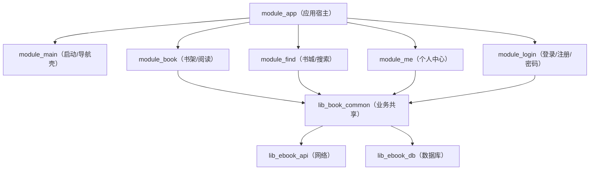
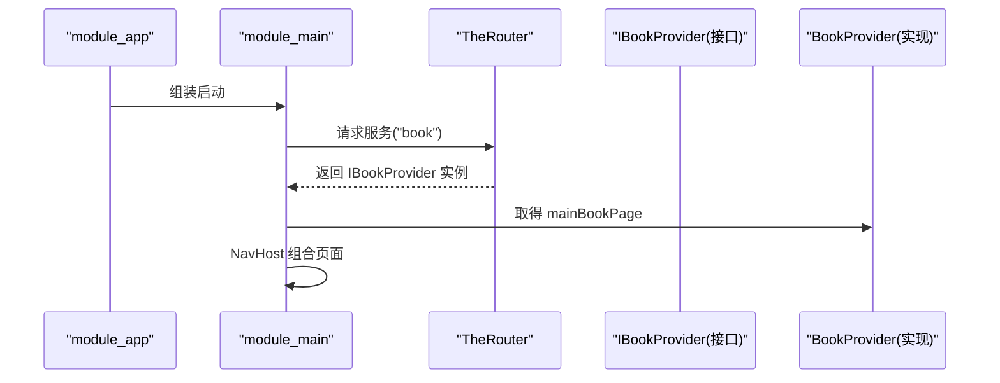
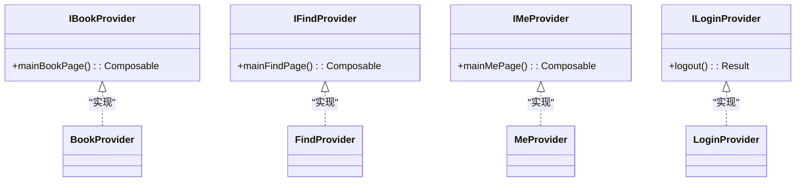
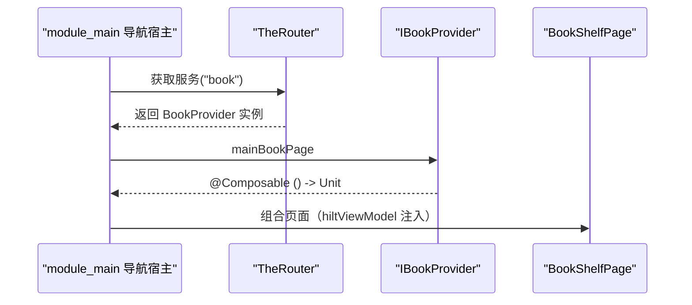

# 模块开发指南

<cite>
**本文件引用的源码路径**
- [settings.gradle.kts](file://settings.gradle.kts)
- [gradle/libs.versions.toml](file://gradle/libs.versions.toml)
- [AndroidComponentConventionPlugin.kt](file://build-logic/convention/src/main/kotlin/AndroidComponentConventionPlugin.kt)
- [module_app/build.gradle.kts](file://module_app/build.gradle.kts)
- [module_main/build.gradle.kts](file://module_main/build.gradle.kts)
- [module_book/build.gradle.kts](file://module_book/build.gradle.kts)
- [module_me/build.gradle.kts](file://module_me/build.gradle.kts)
- [module_find/build.gradle.kts](file://module_find/build.gradle.kts)
- [IBookProvider.kt](file://lib_book_common/src/main/java/com/ebook/common/provider/IBookProvider.kt)
- [IFindProvider.kt](file://lib_book_common/src/main/java/com/ebook/common/provider/IFindProvider.kt)
- [IMeProvider.kt](file://lib_book_common/src/main/java/com/ebook/common/provider/IMeProvider.kt)
- [ILoginProvider.kt](file://lib_book_common/src/main/java/com/ebook/common/provider/ILoginProvider.kt)
- [BookProvider.kt](file://module_book/src/main/java/com/ebook/book/provider/BookProvider.kt)
- [FindProvider.kt](file://module_find/src/main/java/com/ebook/find/provider/FindProvider.kt)
- [MeProvider.kt](file://module_me/src/main/java/com/ebook/me/provider/MeProvider.kt)
- [LoginProvider.kt](file://module_login/src/main/java/com/ebook/login/provider/LoginProvider.kt)
- [module_app AndroidManifest.xml](file://module_app/src/main/AndroidManifest.xml)
</cite>

## 目录
1. 引言
2. 项目结构总览
3. 核心模块类型与差异
4. 标准开发流程（新增业务模块）
5. 共享库构建与发布建议
6. 测试、Mock 数据与独立调试
7. 代码审查约束与常见陷阱
8. 架构与依赖关系图
9. 结论与最佳实践清单
10. 附录：快速检查表

## 引言
本指南面向需要在本仓库新增“业务功能模块”或“共享库”的开发者，目标是帮助你以一致的方式创建、配置、集成和验证新模块。本文覆盖：
- 模块命名与结构规范
- 不同模块类型（业务模块 module_* 与共享库 lib_*）的区别
- 依赖声明、路由注册、Provider 接口约定
- 单元测试、Mock 数据源与独立调试环境搭建
- 代码审查关注点与规避常见设计陷阱
- 从设计到集成的完整示例步骤

## 项目结构总览
本仓库采用多模块 Gradle 组织，根通过 settings.gradle.kts 聚合所有应用模块与共享库；构建期由 build-logic 中的约定插件统一 AGP/Kotlin/Compose/Hilt/Room 等配置。依赖方向为：业务模块 → lib_book_common → lib_ebook_api → lib_ebook_db（基础库），互不循环依赖。

- 模块入口与聚合：module_app 作为宿主，组合各业务模块并定义 real/mock 双 flavor
- 壳页模块：module_main 提供启动页、主页壳、导航容器与 TheRouter/Hilt 装配
- 业务模块：module_book、module_find、module_me、module_login
- 共享库：lib_book_common（业务共享 UI/Provider 接口/会话/注解桥接等）、lib_ebook_api（网络层）、lib_ebook_db（数据库层）
- 约定插件：build-logic/convention/* 提供统一的 xrn1997.* 插件 ID 与构建行为

图表来源
- [settings.gradle.kts](file://settings.gradle.kts#L45-L65)
- [AndroidComponentConventionPlugin.kt](file://build-logic/convention/src/main/kotlin/AndroidComponentConventionPlugin.kt#L7-L34)
- [module_app/build.gradle.kts](file://module_app/build.gradle.kts#L46-L63)

章节来源
- [settings.gradle.kts:45-65](file://settings.gradle.kts#L45-L65)
- [AndroidComponentConventionPlugin.kt:7-34](file://build-logic/convention/src/main/kotlin/AndroidComponentConventionPlugin.kt#L7-L34)
- [module_app/build.gradle.kts:46-63](file://module_app/build.gradle.kts#L46-L63)

## 核心模块类型与差异
- 业务模块（module_*）
  - 职责：面向用户的功能页面与业务交互，包含 Compose UI、ViewModel、Repository 调用、跨模块 Provider 暴露等
  - 插件：统一使用 xrn1997.android.component（isModule=true 时自动套用 application，false 时 library）
  - 注入：Hilt（@AndroidEntryPoint/@HiltViewModel）
  - 路由：TheRouter（页面 @Route + ServiceProvider 注册跨模块能力）
- 共享库（lib_*）
  - lib_book_common：聚合业务相关共享能力（UI 组件、Provider 接口、会话管理、工具类等），向业务模块开放稳定 API
  - lib_ebook_api：网络能力与服务接口（Retrofit/OkHttp、DTO、拦截器）
  - lib_ebook_db：Room 数据库实体与 DAO
  - 构建：统一 library 配置；必要时暴露 api/implementation 边界

区别要点
- 依赖方向：业务模块依赖共享库，但共享库不应反向依赖业务模块
- 路由与可插拔：跨模块能力通过 Provider 接口在 lib_book_common 定义，实现放在具体业务模块，遵循 SPI 原则
- 独立运行：功能模块可在 isModule=true 时独立编译、调试（source set 替换 manifest、Kotlin 源码目录调整见约定插件）

章节来源
- [AndroidComponentConventionPlugin.kt:7-34](file://build-logic/convention/src/main/kotlin/AndroidComponentConventionPlugin.kt#L7-L34)
- [module_book/build.gradle.kts:52-84](file://module_book/build.gradle.kts#L52-L84)
- [module_me/build.gradle.kts:52-72](file://module_me/build.gradle.kts#L52-L72)
- [module_find/build.gradle.kts:44-60](file://module_find/build.gradle.kts#L44-L60)
- [lib_book_common/build.gradle.kts:34-89](file://lib_book_common/build.gradle.kts#L34-L89)

## 标准开发流程（新增业务模块）
目标：新增一个具备独立页面、Provider 接口、Hilt 注入与 TheRouter 注册的模块，能被宿主正确组合与导航。

1. 创建模块
   - 新建 module_xxx 目录与 Gradle 脚本
   - 复用 xrn1997.android.component + compose/hilt 约定插件
   - 设置 namespace 为 com.ebook.xxx
   - 添加 dependencies：implementation(project(":lib_book_common"))，以及必要的 AndroidX、Hilt、Router 等
   - 如需网络，显式声明 implementation(project(":lib_ebook_api")) 或从 lib_book_common 间接获得

2. 定义跨模块能力接口
   - 在 lib_book_common/provider 下新增 XxxProvider.kt（Composable () -> Unit 或 suspend 方法）
   - 接口保持最小且向后兼容，文档说明用途与返回语义

3. 在业务模块中实现接口与注册
   - 在 module_xxx 中实现 XxxProvider，并使用 @ServiceProvider 标注
   - 如需 Activity/Fragment，按需要在 src/main/module/AndroidManifest.xml（独立模式）与 src/main/AndroidManifest.xml（集成模式）声明
   - 页面类使用 @Route(path = ...)，并通过 KeyCode 常量集中管理路径

4. 宿主持有与组合
   - module_main 通过 TheRouter 创建 Provider 实例，并将 mainXxxPage 组合进 NavHost
   - 页面级 ViewModel 使用 hiltViewModel()，作用域由当前 NavBackStackEntry 决定

5. 构建与路由生效
   - 首次添加/修改 @Route 后需再构建一次以回写路由表（transform 产物）
   - 独立调试时可临时将 gradle.properties isModule=true，确保该模块独立可运行

图示：模块注册到宿主流程

图表来源
- [module_main/build.gradle.kts:43-56](file://module_main/build.gradle.kts#L43-L56)
- [IBookProvider.kt:1-13](file://lib_book_common/src/main/java/com/ebook/common/provider/IBookProvider.kt#L1-L13)
- [BookProvider.kt:1-15](file://module_book/src/main/java/com/ebook/book/provider/BookProvider.kt#L1-L15)

章节来源
- [AndroidComponentConventionPlugin.kt:7-34](file://build-logic/convention/src/main/kotlin/AndroidComponentConventionPlugin.kt#L7-L34)
- [module_main/build.gradle.kts:43-56](file://module_main/build.gradle.kts#L43-L56)
- [IBookProvider.kt:1-13](file://lib_book_common/src/main/java/com/ebook/common/provider/IBookProvider.kt#L1-L13)
- [BookProvider.kt:1-15](file://module_book/src/main/java/com/ebook/book/provider/BookProvider.kt#L1-L15)

## 共享库构建与发布建议
- 选择场景
  - 新增通用能力（如解析器、存储、网络封装、公共 UI 组件）→ 放入 lib_* 或 lib_book_common
  - 新增面向用户的界面逻辑 → 放入 module_*
- 依赖治理
  - 严格单向依赖：lib_* 不被业务模块反向依赖；业务模块间不直接依赖
  - 通过版本目录统一管理依赖坐标
- 导出边界
  - 仅对需要外部消费的 API 使用 api，其余用 implementation 隐藏实现细节
- 构建开关
  - 默认 isModule=false，提交前务必恢复默认值，否则主 App 会缺少功能模块
  - 避免命令行 -PisModule=true 污染配置（会引发 includeBuild 链异常）

章节来源
- [gradle/libs.versions.toml:1-70](file://gradle/libs.versions.toml#L1-L70)
- [lib_book_common/build.gradle.kts:34-89](file://lib_book_common/build.gradle.kts#L34-L89)
- [AndroidComponentConventionPlugin.kt:7-34](file://build-logic/convention/src/main/kotlin/AndroidComponentConventionPlugin.kt#L7-L34)

## 测试、Mock 数据与独立调试
- 单元测试
  - 使用 JUnit 4，位于各模块 src/test/java；插桩测试在 androidTest
  - 行为变更同步更新已有测试；保持测试与实现一致
- Mock 数据源
  - 项目通过 product flavor 与 source set 切换：module_app 的 real/mock 双 flavor 可分别连接真实后端或使用内存 mock
  - 独立运行（isModule=true）时，各模块 src/main/test/debug/ 下的 MockNetworkModule 自动参与编译并绑定 mock 实现，无需额外配置
- 独立调试
  - 临时把 gradle.properties isModule=true，各模块可作为独立 application 运行
  - 两份 Manifest 是替换关系：isModule=true 走 src/main/module/AndroidManifest.xml；isModule=false 走 src/main/AndroidManifest.xml
  - 跨模块路由在独立模式下若不存在对应 @Route，只会静默记录日志，不会崩溃——因此在独立模式下应放置占位 @Route

章节来源
- [AGENTS.md（测试与独立调试段落）](file://AGENTS.md)
- [AndroidComponentConventionPlugin.kt:19-31](file://build-logic/convention/src/main/kotlin/AndroidComponentConventionPlugin.kt#L19-L31)
- [module_app/build.gradle.kts:17-26](file://module_app/build.gradle.kts#L17-L26)

## 代码审查约束与常见陷阱
必备约束
- 命名规范
  - 模块命名：module_ 前缀用于业务模块；lib_ 前缀用于共享库
  - namespace 与包名：遵循 com.ebook.<模块名>
- 依赖与插件
  - 统一通过 xrn1997.android.component/compose/hilt 等约定插件
  - 依赖通过版本目录 libs.versions.toml 集中管理，不得硬编码版本
- 路由与 Provider
  - 跨模块能力必须通过 Provider 接口暴露；实现使用 @ServiceProvider
  - 路径通过 TheRouter 注册，路径常量集中维护，避免散落的字符串
- 清单与权限
  - 两份清单替换机制：isModule 两种模式要同步行文，避免合并结果不一致
  - 权限最小化，改动前核对合并后的清单输出
- 数据流与状态
  - 统一协程 + Flow，避免引入 RxJava；事件总线使用 SharedFlow
  - 认证与会话清理统一收敛，不要在多处重复处理

常见陷阱
- 未在 lib_book_common 抽象新的 Provider 接口，导致紧耦合跨模块调用
- 忘记启用 Router APT/KSP，导致路由未生成、跳转失败
- 漏改另一份清单导致集成/独立模式表现不一致
- isModule 遗留为 true 导致发布产物不完整
- 在 shared library 中反向依赖了业务模块
- 列表项 key 未去重导致分页加载抛异常
- 使用固定 JSON 资产表达无法固定的响应（写接口/上传接口不适合静态资源）

章节来源
- [AGENTS.md（多段约束与建议）](file://AGENTS.md)
- [AndroidComponentConventionPlugin.kt:7-34](file://build-logic/convention/src/main/kotlin/AndroidComponentConventionPlugin.kt#L7-L34)
- [module_app/build.gradle.kts:17-26](file://module_app/build.gradle.kts#L17-L26)

## 架构与依赖关系图

### 模块依赖与 Provider 体系

图表来源
- [IBookProvider.kt:1-13](file://lib_book_common/src/main/java/com/ebook/common/provider/IBookProvider.kt#L1-L13)
- [IFindProvider.kt:1-13](file://lib_book_common/src/main/java/com/ebook/common/provider/IFindProvider.kt#L1-L13)
- [IMeProvider.kt:1-13](file://lib_book_common/src/main/java/com/ebook/common/provider/IMeProvider.kt#L1-L13)
- [ILoginProvider.kt:1-19](file://lib_book_common/src/main/java/com/ebook/common/provider/ILoginProvider.kt#L1-L19)
- [BookProvider.kt:1-15](file://module_book/src/main/java/com/ebook/book/provider/BookProvider.kt#L1-L15)
- [FindProvider.kt:1-20](file://module_find/src/main/java/com/ebook/find/provider/FindProvider.kt#L1-L20)
- [MeProvider.kt:1-20](file://module_me/src/main/java/com/ebook/me/provider/MeProvider.kt#L1-L20)
- [LoginProvider.kt:1-20](file://module_login/src/main/java/com/ebook/login/provider/LoginProvider.kt#L1-L20)

### 典型路由导航序列（以书架为例）

图表来源
- [IBookProvider.kt:1-13](file://lib_book_common/src/main/java/com/ebook/common/provider/IBookProvider.kt#L1-L13)
- [BookProvider.kt:1-15](file://module_book/src/main/java/com/ebook/book/provider/BookProvider.kt#L1-L15)
- [module_main/build.gradle.kts:43-56](file://module_main/build.gradle.kts#L43-L56)

## 结论与最佳实践清单
- 先设计接口（Provider），再实现模块
- 依赖方向遵守：业务 → 共享库，禁止反向或横向耦合
- 所有版本与依赖通过版本目录管理
- 路由与清单按双模式一致性要求配置与核查
- 测试先行，保持行为契约不变
- 审查重点：模块化边界、依赖闭合、路由有效性、清单合并结果、isModule 状态

[本节为总结性内容，不包含具体文件分析]

## 附录：快速检查表
- 模块已加入 settings.gradle.kts？
- module_*.build.gradle.kts 使用了 xrn1997.android.component 及 compose/hilt？
- 跨模块能力是否抽象为 lib_book_common 中的 Provider 接口？
- 业务模块是否以 @ServiceProvider 实现接口？
- 是否需要页面级路由？@Route 路径是否在常量表内集中管理？
- 两份清单是否保持一致（isModule=real vs false）？
- 依赖是否通过版本目录声明？是否存在未使用的依赖？
- 是否已在独立模式（isModule=true）验证能单独运行？
- 是否补充了相关单元测试与 Mock 数据（如有后端对接）？
- 是否更新了 ADR/文档（重大决策需沉淀）？