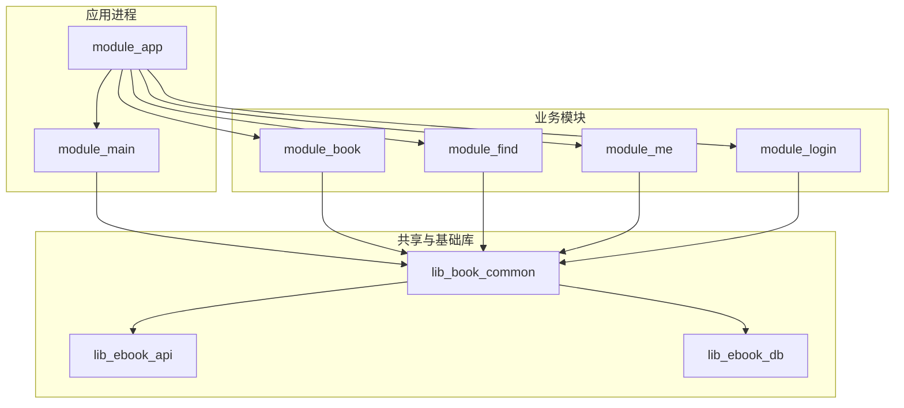
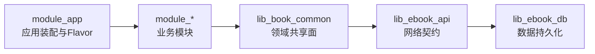
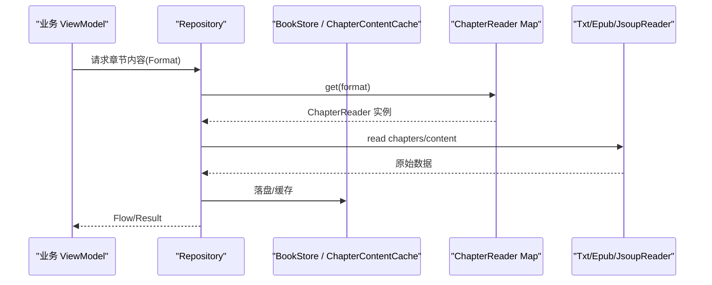
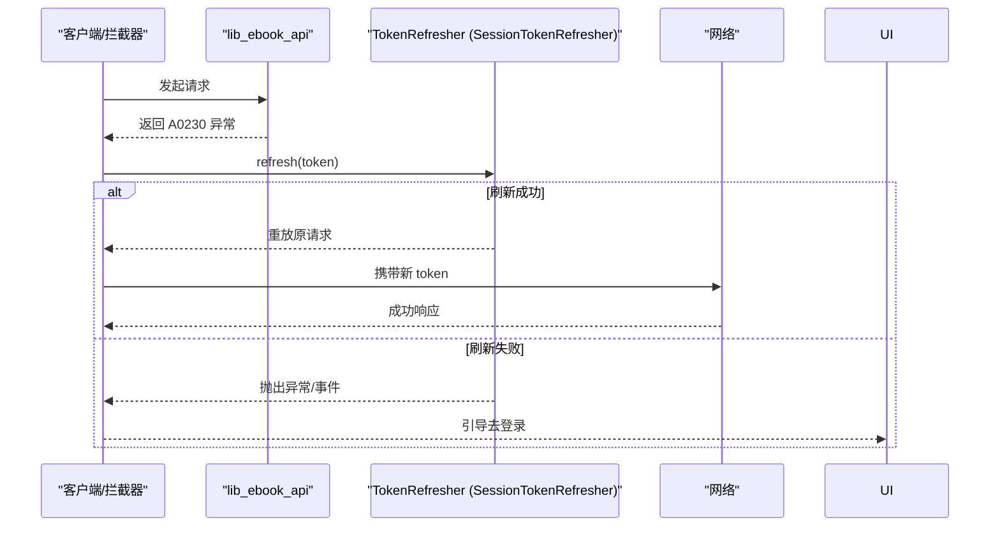
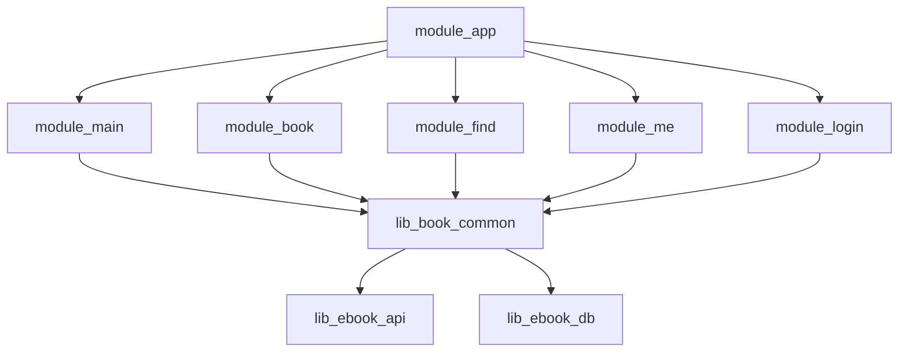
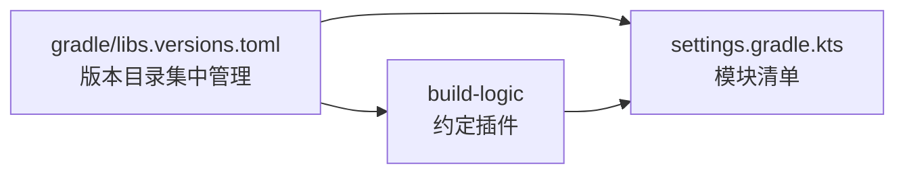

# 模块架构概览

<cite>
**本文引用的文件列表**
- [settings.gradle.kts](file://settings.gradle.kts)
- [gradle/libs.versions.toml](file://gradle/libs.versions.toml)
- [module_app/build.gradle.kts](file://module_app/build.gradle.kts)
- [lib_book_common/build.gradle.kts](file://lib_book_common/build.gradle.kts)
- [lib_ebook_api/build.gradle.kts](file://lib_ebook_api/build.gradle.kts)
- [lib_ebook_db/build.gradle.kts](file://lib_ebook_db/build.gradle.kts)
- [module_main/build.gradle.kts](file://module_main/build.gradle.kts)
- [module_book/build.gradle.kts](file://module_book/build.gradle.kts)
- [lib_book_common/src/main/java/com/ebook/common/di/ContentStoreModule.kt](file://lib_book_common/src/main/java/com/ebook/common/di/ContentStoreModule.kt)
- [lib_book_common/src/main/java/com/ebook/common/di/SessionModule.kt](file://lib_book_common/src/main/java/com/ebook/common/di/SessionModule.kt)
- [lib_book_common/src/main/java/com/ebook/common/provider/IBookProvider.kt](file://lib_book_common/src/main/java/com/ebook/common/provider/IBookProvider.kt)
- [lib_book_common/src/main/java/com/ebook/common/provider/IFindProvider.kt](file://lib_book_common/src/main/java/com/ebook/common/provider/IFindProvider.kt)
- [lib_book_common/src/main/java/com/ebook/common/provider/ILoginProvider.kt](file://lib_book_common/src/main/java/com/ebook/common/provider/ILoginProvider.kt)
- [lib_book_common/src/main/java/com/ebook/common/provider/IMeProvider.kt](file://lib_book_common/src/main/java/com/ebook/common/provider/IMeProvider.kt)
</cite>

## 目录
1. 引言
2. 项目结构
3. 核心组件
4. 架构总览
5. 关键组件详解
6. 依赖关系分析
7. 性能与构建优化
8. 故障排查指南
9. 结论
10. 附录

## 引言
本章节概括项目的模块化设计理念与分层目标。整体采用“业务模块 → 共享库 → 接口层 → 数据持久化”的分层架构：业务功能（书架、书城、个人中心、登录等）只关注界面与交互；跨模块协作通过 Provider 接口与路由解耦；所有共享能力收敛在 lib_book_common，网络契约集中在 lib_ebook_api，数据表与 DAO 集中在 lib_ebook_db。该分层带来清晰职责边界、更好的可测试性与更低的耦合度，同时借助 Gradle 多模块与约定插件实现独立的增量构建与组合装配。

## 项目结构
项目根通过 settings.gradle.kts 声明所有子模块，并以 build-logic 中的约定插件统一 AGP/Kotlin/Compose/Hilt/Room 构建配置。按类型划分如下：

- 应用入口与壳：module_app（宿主）、module_main（启动与主页壳）
- 业务功能模块：module_book（阅读与管理）、module_find（书城搜索）、module_me（个人中心）、module_login（认证）
- 共享库层：lib_book_common（业务领域通用能力、UI、Provider SPI、Hilt 模块）、lib_ebook_api（Retrofit/OkHttp、网络实体与服务 API）、lib_ebook_db（Room 实体与 DAO）
- 构建期：build-logic 提供 xrn1997.* 约定插件，集中版本与编译策略



**图表来源**
- [settings.gradle.kts:55-64](file://settings.gradle.kts#L55-L64)
- [module_app/build.gradle.kts:47-56](file://module_app/build.gradle.kts#L47-L56)
- [lib_book_common/build.gradle.kts:34-38](file://lib_book_common/build.gradle.kts#L34-L38)
- [lib_ebook_api/build.gradle.kts:48-66](file://lib_ebook_api/build.gradle.kts#L48-L66)
- [lib_ebook_db/build.gradle.kts:38-43](file://lib_ebook_db/build.gradle.kts#L38-L43)

**章节来源**
- [settings.gradle.kts:55-64](file://settings.gradle.kts#L55-L64)
- [gradle/libs.versions.toml:1-200](file://gradle/libs.versions.toml#L1-L200)

## 核心组件
- module_app：应用入口与应用级装配者（Hilt Application、flavor 维度 network=real/mock），仅在 isModule=false 时组合其他业务模块
- module_main：启动/主页壳与 Compose 导航根，聚合 Provider 页并挂载到 NavHost
- lib_book_common：领域共享能力的门面。向上暴露 Provider SPI、通用 UI 与工具，向下依赖 lib_ebook_api 与 lib_ebook_db 的契约与数据源；内部通过 Hilt 装配 ContentStoreModule、SessionModule 等横切能力
- lib_ebook_api：网络层契约——Retrofit 服务、OkHttp 拦截器、数据实体与序列化适配
- lib_ebook_db：Room 数据库——AppDatabase、迁移链、DAO、数据库装配

以上各组件通过依赖方向强约束：业务模块仅能向下访问 lib_book_common，而不能反向依赖；共享库之间遵循单向依赖：common → api → db。

**章节来源**
- [lib_book_common/build.gradle.kts:34-88](file://lib_book_common/build.gradle.kts#L34-L88)
- [lib_ebook_api/build.gradle.kts:48-72](file://lib_ebook_api/build.gradle.kts#L48-L72)
- [lib_ebook_db/build.gradle.kts:38-52](file://lib_ebook_db/build.gradle.kts#L38-L52)
- [module_app/build.gradle.kts:47-56](file://module_app/build.gradle.kts#L47-L56)
- [module_main/build.gradle.kts:43-52](file://module_main/build.gradle.kts#L43-L52)
- [module_book/build.gradle.kts:52-84](file://module_book/build.gradle.kts#L52-L84)

## 架构总览
模块之间的依赖方向呈严格分层：

- 顶层：module_app（仅装配模块与 flavor），module_main（壳与导航）
- 中层：module_book/module_find/module_me/module_login（业务实现，仅依赖 lib_book_common）
- 底层：lib_book_common（领域共享），lib_ebook_api（网络契约），lib_ebook_db（数据持久化）
- 最底层：lib_ebook_db 无交叉依赖其它库（除第三方依赖）

这种分层的好处：
- 解耦：业务模块之间无直接依赖，跨模块通信通过 Provider + TheRouter
- 可测试性：mock/real 由 product flavor 和 test/debug source set 隔离，无需后端可开发调试
- 构建优化：Gradle 按模块增量构建，稳定基础库变更不影响无关业务模块的全量重编



**图表来源**
- [settings.gradle.kts:55-64](file://settings.gradle.kts#L55-L64)
- [module_app/build.gradle.kts:47-56](file://module_app/build.gradle.kts#L47-L56)
- [lib_book_common/build.gradle.kts:34-38](file://lib_book_common/build.gradle.kts#L34-L38)
- [lib_ebook_api/build.gradle.kts:48-66](file://lib_ebook_api/build.gradle.kts#L48-L66)
- [lib_ebook_db/build.gradle.kts:38-43](file://lib_ebook_db/build.gradle.kts#L38-L43)

## 关键组件详解

### 模块角色与职责边界
- module_app
  - 应用入口（Hilt Application）
  - 定义 network 维度的 real/mock flavor，选择不同 NetworkModule 实现
  - 仅在集成模式下组合其他功能模块（isModule=false）
- module_main
  - 应用壳：Splash/MainActivity、Compose NavHost
  - 以 Provider SPI 聚合主 Tab 页面，并由 TheRouter 解析创建
- 功能模块（book/find/me/login）
  - 面向具体业务的 UI 与流程
  - 通过 provider/* 下实现的 Provider 类对外暴露 Composable 入口或能力
  - 仅依赖 lib_book_common，不直接互相调用
- lib_book_common
  - 领域共享：书籍解析/存储、会话管理、公共 UI、Hilt 模块装配点
  - 通过 ContentStoreModule 将文件格式解析与章节缓存注入上层仓库
  - 通过 SessionModule 将 TokenRefresher 与 UserSessionManager 绑定 Android 实现
- lib_ebook_api
  - 统一 Retrofit + OkHttp，封装用户/评论/书源等服务的 API
  - 注入 BuildConfig.EBOOK_SERVER_HOST，集中管理网络基址
- lib_ebook_db
  - Room 持久化：实体/DAO/迁移链，提供 AppDatabase 单例装配

**章节来源**
- [module_app/build.gradle.kts:47-56](file://module_app/build.gradle.kts#L47-L56)
- [module_main/build.gradle.kts:43-52](file://module_main/build.gradle.kts#L43-L52)
- [lib_book_common/src/main/java/com/ebook/common/di/ContentStoreModule.kt:27-87](file://lib_book_common/src/main/java/com/ebook/common/di/ContentStoreModule.kt#L27-L87)
- [lib_book_common/src/main/java/com/ebook/common/di/SessionModule.kt:22-37](file://lib_book_common/src/main/java/com/ebook/common/di/SessionModule.kt#L22-L37)
- [lib_ebook_api/build.gradle.kts:12-24](file://lib_ebook_api/build.gradle.kts#L12-L24)
- [lib_ebook_db/build.gradle.kts:38-52](file://lib_ebook_db/build.gradle.kts#L38-L52)

### 模块间通信：Provider 与路由原则
- 跨模块能力通过 Provider 接口暴露，位于 lib_book_common：IBookProvider/IFindProvider/IMeProvider/ILoginProvider
- 功能模块各自实现对应 Provider，module_main 根据路由组装这些 Composable 页面
- ILoginProvider 仅暴露服务端登出能力，本地会话清理由统一入口负责，避免多处重复清理导致不一致
- 该设计有效避免了业务模块间的直接编译期依赖，也规避了循环依赖风险

```mermaid
classDiagram
    class IBookProvider {
        <<interface>>
        +mainBookPage : Composable()
    }
    class IFindProvider {
        <<interface>>
        +mainFindPage : Composable()
    }
    class IMeProvider {
        <<interface>>
        +mainMePage : Composable()
    }
    class ILoginProvider {
        <<interface>>
        +logout() Result~Unit~
    }

    IBookProvider <.. "module_book 提供实现"
    IFindProvider <.. "module_find 提供实现"
    IMeProvider <.. "module_me 提供实现"
    ILoginProvider <.. "module_login 提供实现"
```

**图表来源**
- [lib_book_common/src/main/java/com/ebook/common/provider/IBookProvider.kt:5-13](file://lib_book_common/src/main/java/com/ebook/common/provider/IBookProvider.kt#L5-L13)
- [lib_book_common/src/main/java/com/ebook/common/provider/IFindProvider.kt:5-13](file://lib_book_common/src/main/java/com/ebook/common/provider/IFindProvider.kt#L5-L13)
- [lib_book_common/src/main/java/com/ebook/common/provider/IMeProvider.kt:5-13](file://lib_book_common/src/main/java/com/ebook/common/provider/IMeProvider.kt#L5-L13)
- [lib_book_common/src/main/java/com/ebook/common/provider/ILoginProvider.kt:3-19](file://lib_book_common/src/main/java/com/ebook/common/provider/ILoginProvider.kt#L3-L19)

**章节来源**
- [lib_book_common/src/main/java/com/ebook/common/provider/IBookProvider.kt:5-13](file://lib_book_common/src/main/java/com/ebook/common/provider/IBookProvider.kt#L5-L13)
- [lib_book_common/src/main/java/com/ebook/common/provider/IFindProvider.kt:5-13](file://lib_book_common/src/main/java/com/ebook/common/provider/IFindProvider.kt#L5-L13)
- [lib_book_common/src/main/java/com/ebook/common/provider/IMeProvider.kt:5-13](file://lib_book_common/src/main/java/com/ebook/common/provider/IMeProvider.kt#L5-L13)
- [lib_book_common/src/main/java/com/ebook/common/provider/ILoginProvider.kt:3-19](file://lib_book_common/src/main/java/com/ebook/common/provider/ILoginProvider.kt#L3-L19)

### 内容读取与导入链路（示例流程）
内容读取按格式分派：TXT/EPUB 使用本地 SourceReader；非导入场景的 NETWORK 使用 JsoupSourceReader。导入期通过 @ImportScratch 提供的临时目录进行 Uri→File 转换后复用拷贝即哈希流水线。章节缓存与拆分由共享基础设施提供。



**图表来源**
- [lib_book_common/src/main/java/com/ebook/common/di/ContentStoreModule.kt:27-87](file://lib_book_common/src/main/java/com/ebook/common/di/ContentStoreModule.kt#L27-L87)

**章节来源**
- [lib_book_common/src/main/java/com/ebook/common/di/ContentStoreModule.kt:27-87](file://lib_book_common/src/main/java/com/ebook/common/di/ContentStoreModule.kt#L27-L87)

### 会话刷新与鉴权衔接（示例流程）
会话过期处理与 token 刷新在上层完成：SessionModule 将 api 层的 TokenRefresher 接口绑定到 SessionTokenRefresher（含会话持久化的实现）。当网络响应返回 A0230 时由协程适配器触发静默刷新并尝试重放一次请求，失败则广播会话过期事件以便 UI 跳转登录。



**图表来源**
- [lib_book_common/src/main/java/com/ebook/common/di/SessionModule.kt:22-37](file://lib_book_common/src/main/java/com/ebook/common/di/SessionModule.kt#L22-L37)
- [lib_ebook_api/build.gradle.kts:48-66](file://lib_ebook_api/build.gradle.kts#L48-L66)

**章节来源**
- [lib_book_common/src/main/java/com/ebook/common/di/SessionModule.kt:22-37](file://lib_book_common/src/main/java/com/ebook/common/di/SessionModule.kt#L22-L37)

### 依赖图与分层校验
从构建脚本可以直观验证分层依赖：
- 业务模块仅依赖 lib_book_common
- lib_book_common 依赖 lib_ebook_api 与 lib_ebook_db（api 方式透出类型供上游使用）
- lib_ebook_api 依赖 shared 基础库（如注解、序列化与 JSON/HTML 解析）
- lib_ebook_db 依赖 sqlite-bundled，独立存在



**图表来源**
- [module_app/build.gradle.kts:47-56](file://module_app/build.gradle.kts#L47-L56)
- [module_main/build.gradle.kts:43-52](file://module_main/build.gradle.kts#L43-L52)
- [module_book/build.gradle.kts:52-58](file://module_book/build.gradle.kts#L52-L58)
- [module_find/build.gradle.kts:1-20](file://module_find/build.gradle.kts#L1-L20)
- [module_me/build.gradle.kts:48-56](file://module_me/build.gradle.kts#L48-L56)
- [module_login/build.gradle.kts:40-46](file://module_login/build.gradle.kts#L40-L46)
- [lib_book_common/build.gradle.kts:34-38](file://lib_book_common/build.gradle.kts#L34-L38)
- [lib_ebook_api/build.gradle.kts:48-66](file://lib_ebook_api/build.gradle.kts#L48-L66)
- [lib_ebook_db/build.gradle.kts:38-43](file://lib_ebook_db/build.gradle.kts#L38-L43)

## 依赖关系分析
- 分层单向依赖有效防止循环依赖：业务模块无法直接引用同层其他模块，必须通过 Provider + 路由通信
- 依赖可见性策略：lib_book_common 对 lib_ebook_api/lib_ebook_db 采用 api，使上层能拿到必要的类型与 DAO；若仅需运行时类型而不需要源码可见，应尽可能改为 implementation 以降低传递依赖半径
- 外部依赖统一管理于 gradle/libs.versions.toml，所有模块通过 libs.xxx 引用，避免版本号散落各处
- 构建期通过约定插件统一配置 AGP/Kotlin/Compose/Hilt/Room，降低各模块维护成本



**图表来源**
- [gradle/libs.versions.toml:1-200](file://gradle/libs.versions.toml#L1-L200)
- [settings.gradle.kts:1-64](file://settings.gradle.kts#L1-L64)

**章节来源**
- [gradle/libs.versions.toml:1-200](file://gradle/libs.versions.toml#L1-L200)
- [settings.gradle.kts:1-64](file://settings.gradle.kts#L1-L64)

## 性能与构建优化
- 多模块拆分使得增量编译与并行编译收益显著；稳定基础库（如 lib_ebook_db）改动不会触发业务模块全量重编
- 基于 flavor 的 mock 数据源减少联调环境搭建成本，单元测试可使用 Robolectric 快速验证逻辑
- 通过 Provider SPI 将 UI 组合延迟到运行时，避免不必要代码加载
- 内容读取通过 Cache + 文件落盘提升后续读取效率；章节缓存与拆分在服务内单例复用，减少 I/O 开销

[本节为通用指导，不直接分析具体文件]

## 故障排查指南
- 跨模块页面不可见/空页
  - 检查 Module 是否被 module_app 包含（isModule=false）
  - 检查 Provider 路径与路由映射是否生效（依赖 TheRouter 生成的 routeMap）
- 网络请求失败
  - 确认 BuildConfig.EBOOK_SERVER_HOST 是否为预期值（来源于 local.properties）
  - 区分书源请求是否误带 token（应使用纯净客户端）
- 会话过期未处理
  - 确认 SessionModule 是否正确绑定 TokenRefresher
  - 检查协程适配器对 A0230 的处理流程与回调
- 内容读取错乱
  - 检查 BookFormat 路由是否正确（TXT/EPUB/NETWORK）
  - 确认章节解析与分页规则是否符合站点形态

**章节来源**
- [module_app/build.gradle.kts:17-26](file://module_app/build.gradle.kts#L17-L26)
- [module_app/build.gradle.kts:47-56](file://module_app/build.gradle.kts#L47-L56)
- [lib_ebook_api/build.gradle.kts:12-24](file://lib_ebook_api/build.gradle.kts#L12-L24)
- [lib_book_common/src/main/java/com/ebook/common/di/SessionModule.kt:22-37](file://lib_book_common/src/main/java/com/ebook/common/di/SessionModule.kt#L22-L37)
- [lib_book_common/src/main/java/com/ebook/common/di/ContentStoreModule.kt:27-87](file://lib_book_common/src/main/java/com/ebook/common/di/ContentStoreModule.kt#L27-L87)

## 结论
本项目通过严格的模块分层与清晰的依赖方向，实现了高内聚低耦合的架构。业务模块聚焦界面与交互，跨模块通信通过 Provider 与路由，避免直接依赖；lib_book_common 作为领域共享面，对上提供稳定能力边界，对下依赖 lib_ebook_api 与 lib_ebook_db；网络契约与数据持久化逐层下沉，确保稳定性与可维护性。结合 Gradle 多模块、product flavor 与约定插件，项目在团队协作、迭代速度、构建性能与可测试性方面均具备良好基础。

## 附录
- 模块命名规范：业务模块以 module_ 前缀，共享库以 lib_ 前缀
- 新增模块建议：遵循现有分层（新功能优先放在独立模块，并通过 Provider 暴露能力），依赖方向自上而下
- 跨模块新增 API：在 lib_book_common 中定义接口并实现于对应模块，保持调用方仅依赖抽象

[本节为通用指导，不直接分析具体文件]