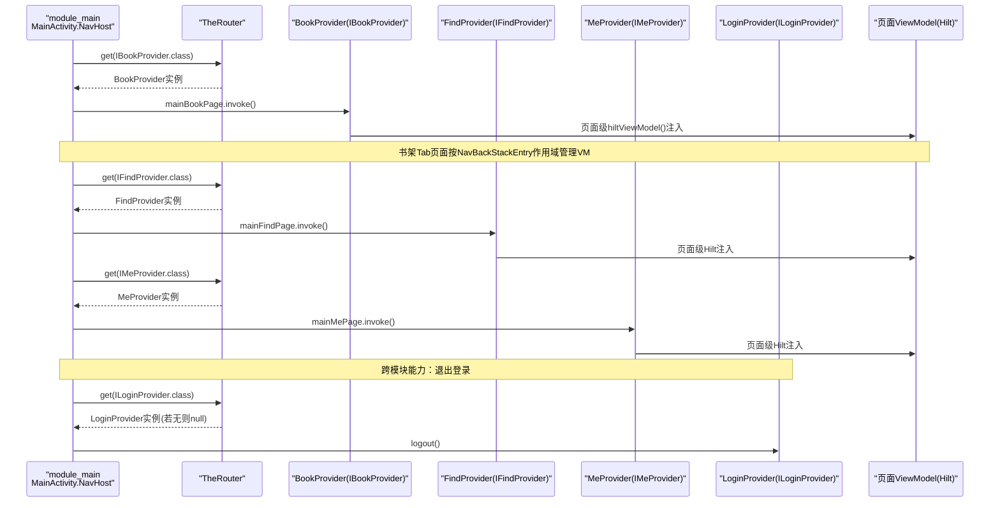
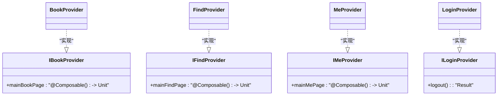
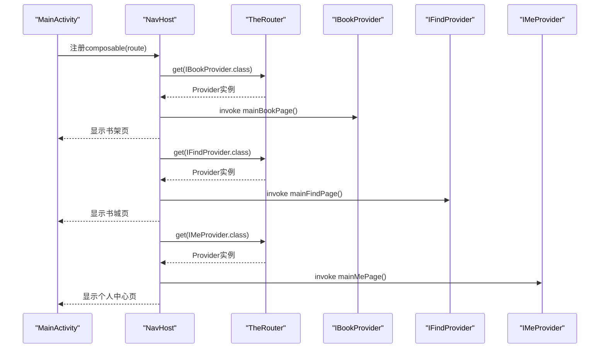
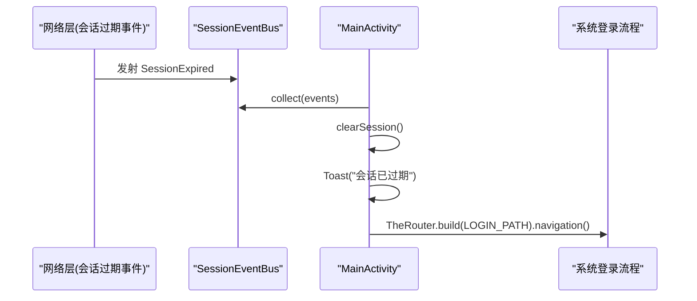
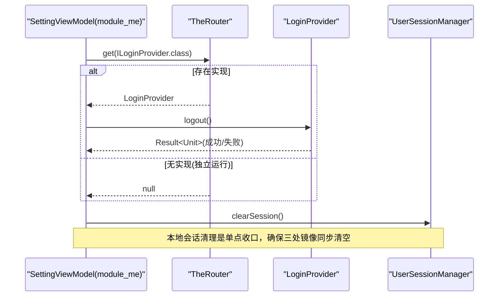
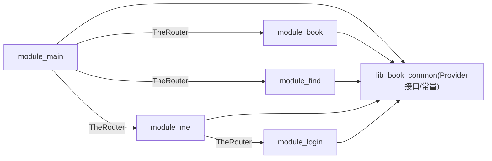

# 跨模块通信机制

<cite>
**本文引用的文件**   
- [IBookProvider.kt](file://lib_book_common/src/main/java/com/ebook/common/provider/IBookProvider.kt)
- [IFindProvider.kt](file://lib_book_common/src/main/java/com/ebook/common/provider/IFindProvider.kt)
- [IMeProvider.kt](file://lib_book_common/src/main/java/com/ebook/common/provider/IMeProvider.kt)
- [ILoginProvider.kt](file://lib_book_common/src/main/java/com/ebook/common/provider/ILoginProvider.kt)
- [BookProvider.kt](file://module_book/src/main/java/com/ebook/book/provider/BookProvider.kt)
- [FindProvider.kt](file://module_find/src/main/java/com/ebook/find/provider/FindProvider.kt)
- [MeProvider.kt](file://module_me/src/main/java/com/ebook/me/provider/MeProvider.kt)
- [LoginProvider.kt](file://module_login/src/main/java/com/ebook/login/provider/LoginProvider.kt)
- [MainActivity.kt](file://module_main/src/main/java/com/ebook/main/MainActivity.kt)
- [RouteArgs.kt](file://lib_book_common/src/main/java/com/ebook/common/event/RouteArgs.kt)
- [KeyCode.kt](file://lib_book_common/src/main/java/com/ebook/common/event/KeyCode.kt)
</cite>

## 目录
1. [引言](#引言)
2. [项目结构与跨模块边界](#项目结构与跨模块边界)
3. [核心组件](#核心组件)
4. [架构总览](#架构总览)
5. [详细组件分析](#详细组件分析)
6. [依赖关系与耦合分析](#依赖关系与耦合分析)
7. [性能与健壮性考虑](#性能与健壮性考虑)
8. [故障排查指南](#故障排查指南)
9. [结论](#结论)
10. [附录：新增跨模块能力的最小步骤清单](#附录新增跨模块能力的最小步骤清单)

## 引言
本文件围绕“跨模块通信机制”展开，重点解释 TheRouter 的跨模块导航与服务发现模式、Provider 接口设计以及跨模块页面组合方式。目标是帮助你在不引入直接模块依赖的前提下，安全地在多模块之间进行路由跳转、能力扩展和 UI 组合，并保证参数传递、生命周期管理与异常处理的清晰与可维护。

## 项目结构与跨模块边界
- 功能模块（module_book、module_find、module_me、module_login）相互不依赖，统一依赖共享库 lib_book_common。
- lib_book_common 提供跨模块暴露的 Provider 接口、路由常量与通用事件参数键等契约。
- module_main 作为首页宿主容器，使用 NavHost 通过 TheRouter 获取各模块 Provider 并组合对应的 Composable 页面，实现“零耦合”的主页 Tab。
- 关键约束：
  - 跨模块导航一律走 TheRouter，禁止跨模块直接 import 对方 Activity/Fragment/页面。
  - Provider 由 TheRouter 创建与查找，页面级 VM 通过 Hilt 注入，解耦服务获取与视图模型。
  - 独立的模块构建场景下（isModule=true），缺少 provider 时调用方需允许空结果，避免崩溃。

```mermaid
graph TB
    Main["module_main<br/>主页容器"] --> BookProv["IBookProvider<br/>提供方: BookProvider"]
    Main --> FindProv["IFindProvider<br/>提供方: FindProvider"]
    Main --> MeProv["IMeProvider<br/>提供方: MeProvider"]
    MeProv --> LoginProv["ILoginProvider<br/>提供方: LoginProvider"]
    BookProv -.-> "书架/阅读"
    FindProv -.-> "书城/搜索"
    MeProv -.-> "我的/设置"
    LoginProv -.-> "登录域能力(服务端登出)"
```

图示来源
- [MainActivity.kt:175-195](file://module_main/src/main/java/com/ebook/main/MainActivity.kt#L175-L195)
- [IBookProvider.kt:11-13](file://lib_book_common/src/main/java/com/ebook/common/provider/IBookProvider.kt#L11-L13)
- [IFindProvider.kt:11-13](file://lib_book_common/src/main/java/com/ebook/common/provider/IFindProvider.kt#L11-L13)
- [IMeProvider.kt:11-13](file://lib_book_common/src/main/java/com/ebook/common/provider/IMeProvider.kt#L11-L13)
- [ILoginProvider.kt:12-19](file://lib_book_common/src/main/java/com/ebook/common/provider/ILoginProvider.kt#L12-L19)

小节来源
- [IBookProvider.kt:1-13](file://lib_book_common/src/main/java/com/ebook/common/provider/IBookProvider.kt#L1-L13)
- [IFindProvider.kt:1-13](file://lib_book_common/src/main/java/com/ebook/common/provider/IFindProvider.kt#L1-L13)
- [IMeProvider.kt:1-13](file://lib_book_common/src/main/java/com/ebook/common/provider/IMeProvider.kt#L1-L13)
- [ILoginProvider.kt:1-19](file://lib_book_common/src/main/java/com/ebook/common/provider/ILoginProvider.kt#L1-L19)
- [BookProvider.kt:1-15](file://module_book/src/main/java/com/ebook/book/provider/BookProvider.kt#L1-L15)
- [FindProvider.kt:1-19](file://module_find/src/main/java/com/ebook/find/provider/FindProvider.kt#L1-L19)
- [MeProvider.kt:1-20](file://module_me/src/main/java/com/ebook/me/provider/MeProvider.kt#L1-L20)
- [LoginProvider.kt:1-35](file://module_login/src/main/java/com/ebook/login/provider/LoginProvider.kt#L1-L35)
- [MainActivity.kt:175-195](file://module_main/src/main/java/com/ebook/main/MainActivity.kt#L175-L195)

## 核心组件
- TheRouter 路由：用于跨模块导航与服务发现（@ServiceProvider、TheRouter.build、TheRouter.get）。
- Provider 接口契约：IBookProvider、IFindProvider、IMeProvider、ILoginProvider 在 lib_book_common 中声明，被各自模块实现并以 @ServiceProvider 注册。
- 路由常量与传参：
  - KeyCode：集中定义各模块的路由 PATH。
  - RouteArgs：集中定义跨模块 Bundle key，避免字符串散落在各处。
- 主页容器：MainActivity 中的 NavHost 通过 TheRouter.get 拉取 Provider 返回的 Composable() -> Unit，并直接组合渲染。

小节来源
- [KeyCode.kt:1-98](file://lib_book_common/src/main/java/com/ebook/common/event/KeyCode.kt#L1-L98)
- [RouteArgs.kt:1-33](file://lib_book_common/src/main/java/com/ebook/common/event/RouteArgs.kt#L1-L33)
- [MainActivity.kt:28-41](file://module_main/src/main/java/com/ebook/main/MainActivity.kt#L28-L41)

## 架构总览
下图展示从主页到各业务模块页面与服务的全链路：主页 NavHost 根据路由目的地组合 Provider 暴露的 Composable；跨模块能力（如登出）经 ILoginProvider 调 module_login 的实现，内部通过 Hilt EntryPointAccessors 桥接到模块内仓库。



图示来源
- [MainActivity.kt:175-195](file://module_main/src/main/java/com/ebook/main/MainActivity.kt#L175-L195)
- [BookProvider.kt:1-15](file://module_book/src/main/java/com/ebook/book/provider/BookProvider.kt#L1-L15)
- [FindProvider.kt:1-19](file://module_find/src/main/java/com/ebook/find/provider/FindProvider.kt#L1-L19)
- [MeProvider.kt:1-20](file://module_me/src/main/java/com/ebook/me/provider/MeProvider.kt#L1-L20)
- [LoginProvider.kt:1-35](file://module_login/src/main/java/com/ebook/login/provider/LoginProvider.kt#L1-L35)

## 详细组件分析

### 1. Provider 接口设计与作用
- IBookProvider：暴露书架入口页面 Composable，供主容器直接组合。
- IFindProvider：暴露书城入口页面 Composable。
- IMeProvider：暴露个人中心入口页面 Composable。
- ILoginProvider：暴露跨模块登录域能力（服务端登出），仅关注服务端侧失效；本地会话清理统一走 UserSessionManager.clearSession。

特点
- 所有 Provider 在实现类上标注 @ServiceProvider，交由 TheRouter 管理生命周期与获取。
- Provider 内部只持有页面级闭包或轻量封装，页面 ViewModel 通过页面级 hiltViewModel() 绑定到 NavBackStackEntry，切回 Tab 恢复状态，返回栈销毁时 VM 自动销毁。
- ILoginProvider 通过 Hilt EntryPointAccessors 在运行时获取模块内仓库，避免在共享库引入业务依赖。

小节来源
- [IBookProvider.kt:5-13](file://lib_book_common/src/main/java/com/ebook/common/provider/IBookProvider.kt#L5-L13)
- [IFindProvider.kt:5-13](file://lib_book_common/src/main/java/com/ebook/common/provider/IFindProvider.kt#L5-L13)
- [IMeProvider.kt:5-13](file://lib_book_common/src/main/java/com/ebook/common/provider/IMeProvider.kt#L5-L13)
- [ILoginProvider.kt:3-19](file://lib_book_common/src/main/java/com/ebook/common/provider/ILoginProvider.kt#L3-L19)
- [BookProvider.kt:8-15](file://module_book/src/main/java/com/ebook/book/provider/BookProvider.kt#L8-L15)
- [FindProvider.kt:8-19](file://module_find/src/main/java/com/ebook/find/provider/FindProvider.kt#L8-L19)
- [MeProvider.kt:8-20](file://module_me/src/main/java/com/ebook/me/provider/MeProvider.kt#L8-L20)
- [LoginProvider.kt:11-34](file://module_login/src/main/java/com/ebook/login/provider/LoginProvider.kt#L11-L34)

#### 类关系图（Provider 与其实现）


图示来源
- [IBookProvider.kt:11-13](file://lib_book_common/src/main/java/com/ebook/common/provider/IBookProvider.kt#L11-L13)
- [IFindProvider.kt:11-13](file://lib_book_common/src/main/java/com/ebook/common/provider/IFindProvider.kt#L11-L13)
- [IMeProvider.kt:11-13](file://lib_book_common/src/main/java/com/ebook/common/provider/IMeProvider.kt#L11-L13)
- [ILoginProvider.kt:12-19](file://lib_book_common/src/main/java/com/ebook/common/provider/ILoginProvider.kt#L12-L19)
- [BookProvider.kt:8-15](file://module_book/src/main/java/com/ebook/book/provider/BookProvider.kt#L8-L15)
- [FindProvider.kt:8-19](file://module_find/src/main/java/com/ebook/find/provider/FindProvider.kt#L8-L19)
- [MeProvider.kt:8-20](file://module_me/src/main/java/com/ebook/me/provider/MeProvider.kt#L8-L20)
- [LoginProvider.kt:21-34](file://module_login/src/main/java/com/ebook/login/provider/LoginProvider.kt#L21-L34)

### 2. TheRouter 路由注册与发现
- 注册：Provider 实现类以 @ServiceProvider 注解注册到 TheRouter（非 Hilt 管理）。
- 发现：调用方通过 TheRouter.get(Interface::class.java) 获取具体实现；若模块未启用（独立运行）可能返回 null，调用方需要容错。
- 路由跳转：通过 TheRouter.build(path).navigation() 配合 KeyCode.*PATH 完成跨模块 Activity/页面跳转。
- 主页组合：MainActivity 中的 NavHost 分别对三个 Tab 调用 TheRouter.get 得到 Provider 并执行 Composable，从而组合对应页面。

小节来源
- [MainActivity.kt:28-41](file://module_main/src/main/java/com/ebook/main/MainActivity.kt#L28-L41)
- [MainActivity.kt:175-195](file://module_main/src/main/java/com/ebook/main/MainActivity.kt#L175-L195)
- [KeyCode.kt:6-38](file://lib_book_common/src/main/java/com/ebook/common/event/KeyCode.kt#L6-L38)

#### 主页 Tab 路由与组合时序


图示来源
- [MainActivity.kt:175-195](file://module_main/src/main/java/com/ebook/main/MainActivity.kt#L175-L195)

### 3. 路由参数传递与生命周期管理
- 路由常量：KeyCode 汇总各模块路由 PATH，跨模块统一引用，避免魔法字符串。
- 传参 key：RouteArgs 统一定义跨模块 Bundle key（例如章节/书籍相关），发送与接收双方共用同一常量，避免改 key 导致的静默丢参。
- 生命周期：
  - 主页 Tab 的页面通过 hiltViewModel() 绑定到 NavBackStackEntry，切换 Tab 保存状态，离开栈销毁 VM。
  - 会话过期处理：MainActivity 订阅 SessionEventBus，统一清会话、提示并跳转到登录页（TheRouter.build(...).navigation()）。

小节来源
- [RouteArgs.kt:3-33](file://lib_book_common/src/main/java/com/ebook/common/event/RouteArgs.kt#L3-L33)
- [KeyCode.kt:4-98](file://lib_book_common/src/main/java/com/ebook/common/event/KeyCode.kt#L4-L98)
- [MainActivity.kt:57-79](file://module_main/src/main/java/com/ebook/main/MainActivity.kt#L57-L79)
- [MainActivity.kt:175-195](file://module_main/src/main/java/com/ebook/main/MainActivity.kt#L175-L195)

#### 会话过期处理时序


图示来源
- [MainActivity.kt:57-79](file://module_main/src/main/java/com/ebook/main/MainActivity.kt#L57-L79)

### 4. 跨模块能力：退出登录流程
- 调用方（设置页 VM）通过 TheRouter.get(ILoginProvider.class) 获取登录域能力，尝试调用服务端登出。
- 失败不阻塞：即使服务端登出失败，仍继续执行本地会话清理（UserSessionManager.clearSession），确保用户不被锁在当前会话。
- 独立运行：当 module_login 不在当前依赖图中时，provider 为 null，调用方需兼容该情形，仅做本地清理。

小节来源
- [ILoginProvider.kt:3-19](file://lib_book_common/src/main/java/com/ebook/common/provider/ILoginProvider.kt#L3-L19)
- [LoginProvider.kt:11-34](file://module_login/src/main/java/com/ebook/login/provider/LoginProvider.kt#L11-L34)
- [MainActivity.kt:57-79](file://module_main/src/main/java/com/ebook/main/MainActivity.kt#L57-L79)

#### 登出流程时序


图示来源
- [ILoginProvider.kt:12-19](file://lib_book_common/src/main/java/com/ebook/common/provider/ILoginProvider.kt#L12-L19)
- [LoginProvider.kt:21-34](file://module_login/src/main/java/com/ebook/login/provider/LoginProvider.kt#L21-L34)

## 依赖关系与耦合分析
- 模块间耦合：
  - module_main 仅依赖 lib_book_common 提供的 Provider 接口与路径常量，不感知具体实现模块。
  - 各功能模块只依赖 lib_book_common，互不引用对方的实现类，避免循环依赖与编译期耦合。
  - 跨模块能力（如登出）经由 Provider SPI，调用方通过 TheRouter 获取，保持弱耦合。
- 间接依赖：
  - 登录域能力通过 Hilt EntryPointAccessors 在运行时获取 UserRepository，避免在共享库引入业务模块代码。
- 风险点：
  - 如果某模块未启用（独立运行场景），Provider 可能为空，调用方必须判空并降级处理。
  - RouteArgs/KeyCode 一旦修改，需在发送与接收两侧保持一致，建议使用集中常量以避免键名漂移。



图示来源
- [MainActivity.kt:175-195](file://module_main/src/main/java/com/ebook/main/MainActivity.kt#L175-L195)
- [ILoginProvider.kt:12-19](file://lib_book_common/src/main/java/com/ebook/common/provider/ILoginProvider.kt#L12-L19)
- [LoginProvider.kt:21-34](file://module_login/src/main/java/com/ebook/login/provider/LoginProvider.kt#L21-L34)

小节来源
- [IBookProvider.kt:11-13](file://lib_book_common/src/main/java/com/ebook/common/provider/IBookProvider.kt#L11-L13)
- [IFindProvider.kt:11-13](file://lib_book_common/src/main/java/com/ebook/common/provider/IFindProvider.kt#L11-L13)
- [IMeProvider.kt:11-13](file://lib_book_common/src/main/java/com/ebook/common/provider/IMeProvider.kt#L11-L13)
- [ILoginProvider.kt:3-19](file://lib_book_common/src/main/java/com/ebook/common/provider/ILoginProvider.kt#L3-L19)
- [MainActivity.kt:175-195](file://module_main/src/main/java/com/ebook/main/MainActivity.kt#L175-L195)
- [LoginProvider.kt:21-34](file://module_login/src/main/java/com/ebook/login/provider/LoginProvider.kt#L21-L34)

## 性能与健壮性考虑
- 性能：
  - Provider 仅返回 Composable 闭包，不包含重逻辑，组合成本极低。
  - 页面级 VM 由 Hilt 按需创建与复用，随 NavBackStackEntry 生命周期管理，减少不必要的重建。
- 健壮性：
  - 独立运行场景下 TheRouter.get 可能返回 null，调用处应判空并提供降级行为（如记录日志或隐藏能力入口）。
  - 会话过期的统一处置集中在 MainActivity，避免多处重复逻辑导致的不一致。
  - 路由参数键集中管理（RouteArgs），降低因键名变更导致的参数丢失问题。

## 故障排查指南
- 现象：点击某个 Tab 后内容不显示或闪退
  - 检查 MainActivity 是否成功拿到对应 Provider，确认 Provider 是否正确标注 @ServiceProvider，且模块已被集成进当前构建。
  - 在独立运行模式下，确认 TheRouter.get 返回是否 null；若是，需添加空保护与降级 UI。
- 现象：跨模块参数丢失或乱码
  - 核对发送端与接收端使用的 Bundle key 是否完全来自 RouteArgs 常量，避免因手写字符串不一致导致传参失败。
- 现象：退出登录后仍保持登录态或数据残留
  - 确认调用方先调用 ILoginProvider.logout（可选），随后务必调用 UserSessionManager.clearSession；该方法是清理三处镜像的唯一入口。
- 现象：设置页无法获取 ILoginProvider
  - 确认构建配置中是否启用了 module_login（isModule=false），或独立运行场景是否期望跳过服务端登出。

小节来源
- [MainActivity.kt:175-195](file://module_main/src/main/java/com/ebook/main/MainActivity.kt#L175-L195)
- [RouteArgs.kt:3-33](file://lib_book_common/src/main/java/com/ebook/common/event/RouteArgs.kt#L3-L33)
- [ILoginProvider.kt:3-19](file://lib_book_common/src/main/java/com/ebook/common/provider/ILoginProvider.kt#L3-L19)

## 结论
本项目的跨模块通信采用 TheRouter + Provider 的模式，实现了“界面组合能力”与“后端业务能力”的双重解耦：
- 界面：通过 Provider 返回 Composable，由主容器统一组合，VM 由页面级 Hilt 管理，生命周期清晰。
- 能力：通过 Provider SPI（如 ILoginProvider）暴露模块能力，调用方通过 TheRouter 发现，避免直接依赖。
- 参数与路由常量集中管理，增强一致性并降低出错面。
该方案既适用于集成模式，也支持各模块独立运行时的渐进式能力开关。

## 附录：新增跨模块能力的最小步骤清单
目标：在另一个功能模块新增一项跨模块能力（例如新增一个工具方法或回调），并在主模块或第三方模块调用。

步骤
1. 在 lib_book_common 新增 Provider 接口（参考 IBookProvider/IFindProvider/IMeProvider/ILoginProvider 形式）。
   - 小节来源
     - [IBookProvider.kt:11-13](file://lib_book_common/src/main/java/com/ebook/common/provider/IBookProvider.kt#L11-L13)
     - [IFindProvider.kt:11-13](file://lib_book_common/src/main/java/com/ebook/common/provider/IFindProvider.kt#L11-L13)
     - [IMeProvider.kt:11-13](file://lib_book_common/src/main/java/com/ebook/common/provider/IMeProvider.kt#L11-L13)
     - [ILoginProvider.kt:12-19](file://lib_book_common/src/main/java/com/ebook/common/provider/ILoginProvider.kt#L12-L19)

2. 在具体模块实现 Provider，并用 @ServiceProvider 注解，内部委托模块真实逻辑。
   - 示例参考：
     - [BookProvider.kt:8-15](file://module_book/src/main/java/com/ebook/book/provider/BookProvider.kt#L8-L15)
     - [FindProvider.kt:8-19](file://module_find/src/main/java/com/ebook/find/provider/FindProvider.kt#L8-L19)
     - [MeProvider.kt:8-20](file://module_me/src/main/java/com/ebook/me/provider/MeProvider.kt#L8-L20)
     - [LoginProvider.kt:21-34](file://module_login/src/main/java/com/ebook/login/provider/LoginProvider.kt#L21-L34)

3. 如需跨模块路由跳转，统一用 TheRouter.build(KeyCode.*PATH).navigation()，PATH 放在 KeyCode 集中定义。
   - 小节来源
     - [KeyCode.kt:6-98](file://lib_book_common/src/main/java/com/ebook/common/event/KeyCode.kt#L6-L98)
     - [MainActivity.kt:57-79](file://module_main/src/main/java/com/ebook/main/MainActivity.kt#L57-L79)

4. 如需传递参数，使用 RouteArgs 中的常量作为 Bundle key，确保发送与接收一致。
   - 小节来源
     - [RouteArgs.kt:3-33](file://lib_book_common/src/main/java/com/ebook/common/event/RouteArgs.kt#L3-L33)

5. 调用侧通过 TheRouter.get(你的接口::class.java) 获取并调用，注意独立运行下的 null 判定与降级。
   - 小节来源
     - [MainActivity.kt:175-195](file://module_main/src/main/java/com/ebook/main/MainActivity.kt#L175-L195)

[本节不直接引用特定源码片段，因此不添加“小节来源”]