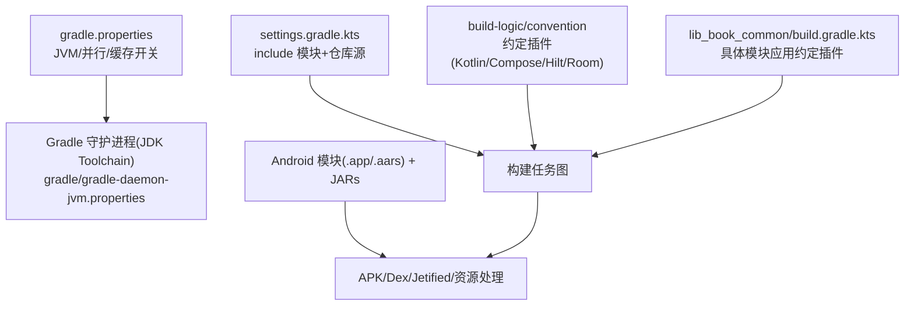
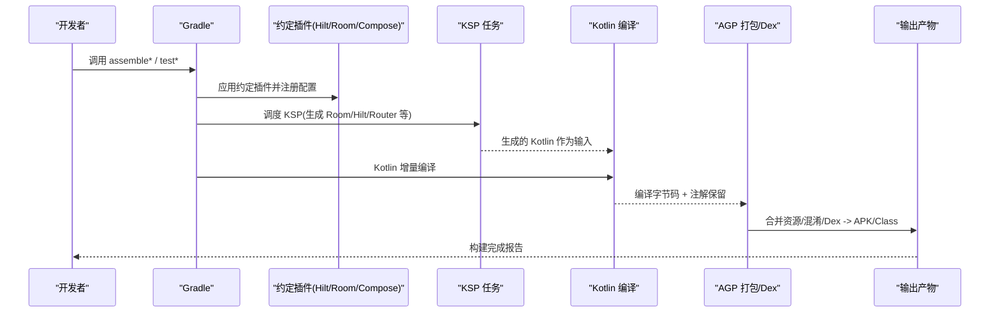
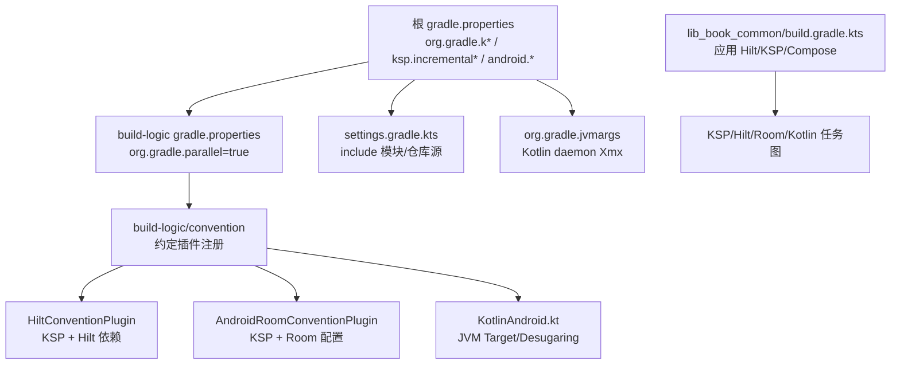

# 构建优化策略

<cite>
**本文引用的文件列表**
- [gradle.properties](file://gradle.properties)
- [build-logic/gradle.properties](file://build-logic/gradle.properties)
- [gradle/gradle-daemon-jvm.properties](file://gradle/gradle-daemon-jvm.properties)
- [settings.gradle.kts](file://settings.gradle.kts)
- [lib_book_common/build.gradle.kts](file://lib_book_common/build.gradle.kts)
- [build-logic/convention/build.gradle.kts](file://build-logic/convention/build.gradle.kts)
- [KotlinAndroid.kt](file://build-logic/convention/src/main/kotlin/com/xrn1997/convention/KotlinAndroid.kt)
- [HiltConventionPlugin.kt](file://build-logic/convention/src/main/kotlin/HiltConventionPlugin.kt)
- [AndroidRoomConventionPlugin.kt](file://build-logic/convention/src/main/kotlin/AndroidRoomConventionPlugin.kt)
- [AndroidComponentConventionPlugin.kt](file://build-logic/convention/src/main/kotlin/com/xrn1997/convention/AndroidComponentConventionPlugin.kt)
</cite>

## 目录
1. [简介](#简介)
2. [项目结构（与构建视角）](#项目结构与构建视角)
3. [核心组件（构建相关）](#核心组件构建相关)
4. [架构总览](#架构总览)
5. [详细组件分析](#详细组件分析)
6. [依赖关系分析](#依赖关系分析)
7. [性能考虑](#性能考虑)
8. [故障排查指南](#故障排查指南)
9. [结论](#结论)
10. [附录](#附录)

## 简介
本文件面向构建系统负责人与维护者，结合仓库中 Gradle、约定插件、编译工具链与 Kotlin/AI 代码生成等实际配置，梳理一套可落地的“增量编译 + 并行构建 + 缓存 + 内存管理 + 分析定位”的构建优化策略。内容完全基于当前仓库已有配置与脚本，不引入未经证实的外部假设；对尚未开启的能力给出在该项目上的启用建议与安全路径。

## 项目结构与构建视角
该工程采用多模块结构：应用入口与各功能模块通过共享库聚合能力；构建逻辑集中在 build-logic 中的约定插件，统一封装 Android/Kotlin/Compose/Hilt/Room 等通用设置。这种组织使性能优化点相对清晰：全局开关在 gradle 层，增量与缓存依赖编译链（KGP/Hilt/Room/KSP），任务执行与隔离依赖 AGP/Kotlin 插件行为。

图表来源
- [gradle.properties:18-35](file://gradle.properties#L18-L35)
- [gradle/gradle-daemon-jvm.properties:1-13](file://gradle/gradle-daemon-jvm.properties#L1-L13)
- [settings.gradle.kts:28-64](file://settings.gradle.kts#L28-L64)
- [build-logic/convention/build.gradle.kts:40-75](file://build-logic/convention/build.gradle.kts#L40-L75)
- [lib_book_common/build.gradle.kts:1-90](file://lib_book_common/build.gradle.kts#L1-L90)

章节来源
- [settings.gradle.kts:28-64](file://settings.gradle.kts#L28-L64)
- [gradle.properties:18-35](file://gradle.properties#L18-L35)
- [gradle/gradle-daemon-jvm.properties:1-13](file://gradle/gradle-daemon-jvm.properties#L1-L13)

## 核心组件（构建相关）
- 全局构建参数：org.gradle.*、ksp.incremental.*、android.* 选项位于根 gradle.properties
- 约定插件：构建逻辑抽象到 build-logic/convention，为 Android/Kotlin/Compose/Hilt/Room 提供一致配置
- KSP 使用：Hilt、Router APT、Room 3.0 均通过 KSP（或兼容方式）运行代码生成
- AGP 版本与内置 Kotlin：AGP 9 自带 Kotlin 支持，不再重复注入 KGP 插件；kotlin {} 块仍可配编译器选项
- 多模块拆分：lib_ebook_db 与 lib_ebook_api 下沉为独立库，降低根工程编译负担

章节来源
- [build-logic/convention/build.gradle.kts:11-75](file://build-logic/convention/build.gradle.kts#L11-L75)
- [lib_book_common/build.gradle.kts:1-90](file://lib_book_common/build.gradle.kts#L1-L90)

## 架构总览
下面的序列图展示了典型的一次模块构建中，构建期关键阶段如何联动：Gradle 解析 → 配置阶段加载约定插件 → 组装任务图 → 执行 KSP/KAPT→Kotlin/AAPT→Dex → 产物输出。优化目标是在尽可能多的阶段命中缓存并保证任务间无错误串行化。

图表来源
- [HiltConventionPlugin.kt:24-48](file://build-logic/convention/src/main/kotlin/HiltConventionPlugin.kt#L24-L48)
- [AndroidRoomConventionPlugin.kt:26-51](file://build-logic/convention/src/main/kotlin/AndroidRoomConventionPlugin.kt#L26-L51)
- [KotlinAndroid.kt:31-91](file://build-logic/convention/src/main/kotlin/com/xrn1997/convention/KotlinAndroid.kt#L31-L91)
- [build-logic/convention/build.gradle.kts:40-75](file://build-logic/convention/build.gradle.kts#L40-L75)

## 详细组件分析

### 1) 增量编译：Kotlin 与代码生成链路
- Kotlin 增量与 JVM Target：约定插件为 Kotlin Android/JVM 设置 jvmTarget=17，启用 coreLibraryDesugaring，利于后续新特性编译。
- KSP 增量：根 gradle.properties 已启用 ksp.incremental=true、ksp.incremental.intermodule=true、ksp.incremental.log=true，确保跨模块代码生成能更快响应变更。
- Hilt 与 Room：两者均以 KSP 集成（Hilt 用 KSP，Room 3.0 也通过 KSP）。在约定插件中集中添加 compiler 与 runtime 依赖，减少重复配置与误用。
- Android 源码目录问题：Android 9 下 Kotlin 编译仅识别 *.srcDirs 下的 kotlin 目录，旧 java.srcDirs 会导致“KSP 生成了代码但 Kotlin 未编译”的错位，已在约定注释中警示。

实践要点
- 保持 ksp.incremental 开启并与 Kotlin 增量同时生效
- Room 必须配合 KSP，且 schemaDirectory 指向规范路径
- Hilt 在 Android/Kotlin JVM 两类目标都需正确挂载依赖
- 避免将生成产物的 source set 误放入非 kotlin 目录

章节来源
- [KotlinAndroid.kt:31-91](file://build-logic/convention/src/main/kotlin/com/xrn1997/convention/KotlinAndroid.kt#L31-L91)
- [gradle.properties:18-20](file://gradle.properties#L18-L20)
- [HiltConventionPlugin.kt:24-48](file://build-logic/convention/src/main/kotlin/HiltConventionPlugin.kt#L24-L48)
- [AndroidRoomConventionPlugin.kt:26-51](file://build-logic/convention/src/main/kotlin/AndroidRoomConventionPlugin.kt#L26-L51)
- [AndroidComponentConventionPlugin.kt:25-26](file://build-logic/convention/src/main/kotlin/com/xrn1997/convention/AndroidComponentConventionPlugin.kt#L25-L26)

### 2) 并行构建与多进程
- 当前状态：root gradle.properties 中的 org.gradle.parallel 被注释；而 build-logic/gradle.properties 中已设置 org.gradle.parallel=true。由于 build-logic 是 includeBuild，其属性可能被部分场景继承或被覆盖，需以 root 为准进行一致性对齐。
- 多进程编译：未在仓库中发现显式设置 org.gradle.workers.max 或 --parallel/--no-build-cache 的命令行；可在本地或 CI 通过命令行附加实现灵活控制。
- 安全建议：在 AGP/Kotlin 新版本上通常建议开启 parallel，并结合构建扫描评估是否触发某些 task 串行规则。

章节来源
- [gradle.properties:12,30](file://gradle.properties#L12,L30)
- [build-logic/gradle.properties:1-5](file://build-logic/gradle.properties#L1-L5)

### 3) 构建缓存：文件缓存、构建缓存与配置缓存
- 文件缓存（Task Input Caching）：Gradle 默认开启，增量编译、KSP、Hilt、Room 的代码生成与字节码处理均受益于文件缓存；本项目已将 Kotlin/JVM/KSP 设置为增量模式，有利于命中缓存。
- 构建缓存（Build Cache）：未显式启用。建议在团队环境（特别是 CI）集中配置远程构建缓存以提升跨机复用率。
- 配置缓存（Configuration Cache）：未显式启用。对大型多模块工程，配置缓存可显著缩短二次构建时间，需在逐步解决不兼容项后开启。
- R8/资源压缩：根 gradle.properties 关闭了 strictFullModeForKeepRules，这有助于提升构建速度，避免严格模式带来的额外扫描。

实践建议
- CI 侧开启构建缓存（local + remote 可选）并持久化 ~/.gradle/caches/build-cache
- 逐步启用 Configuration Cache：先在开发机以 -Porg.gradle.configuration-cache=true 验证兼容性
- 继续使用 R8 strictFullModeForKeepRules=false 的折中策略

章节来源
- [gradle.properties:34](file://gradle.properties#L34)
- [KotlinAndroid.kt:44-55](file://build-logic/convention/src/main/kotlin/com/xrn1997/convention/KotlinAndroid.kt#L44-L55)
- [HiltConventionPlugin.kt:24-48](file://build-logic/convention/src/main/kotlin/HiltConventionPlugin.kt#L24-L48)
- [AndroidRoomConventionPlugin.kt:26-51](file://build-logic/convention/src/main/kotlin/AndroidRoomConventionPlugin.kt#L26-L51)

### 4) 内存管理最佳实践：gradle.properties 中的 JVM 参数
- 当前值：org.gradle.jvmargs=-Xmx2048M，并通过 -Dkotlin.daemon.jvm.options="-Xmx2048M" 给 Kotlin 守护进程分配堆内存，避免 Kapt 或 KSP 时 OOM。
- 工具链版本：gradle/gradle-daemon-jvm.properties 声明 toolchainVersion=25（自动拉取 JDK，无需本地预装），有利于在多机器/CI 上一致地运行 Gradle/Kotlin。
- Android 专属开关：android.nonTransitiveRClass=true 减少 R 类体积与构建压力；android.useAndroidX=true 启用 AndroidX。

优化指引
- 若仍遇到构建期 OOM：可适度提高 Xmx（如至 4096M），并结合 --scan 观察 JVM GC 情况
- 确认 KSP/Hilt/Room 生成任务未占用异常堆；必要时单独对某模块增加 -Dkotlin.daemon.jvm.options

章节来源
- [gradle.properties:30-31](file://gradle.properties#L30-L31)
- [gradle/gradle-daemon-jvm.properties:12-13](file://gradle/gradle-daemon-jvm.properties#L12-L13)

### 5) Kotlin 编译器选项优化
- jvmTarget=17、allWarningsAsErrors（可通过 gradle.properties 开关）、coreLibraryDesugaring 已启用
- Compose 编译由 Compose 编译器插件参与（模块中启用了 compose.compiler 插件），与增量编译协同工作
- Room 与 Hilt 通过约定插件统一接入，避免模块级重复与错配

章节来源
- [KotlinAndroid.kt:73-91](file://build-logic/convention/src/main/kotlin/com/xrn1997/convention/KotlinAndroid.kt#L73-L91)
- [lib_book_common/build.gradle.kts:4-9](file://lib_book_common/build.gradle.kts#L4-L9)
- [HiltConventionPlugin.kt:24-48](file://build-logic/convention/src/main/kotlin/HiltConventionPlugin.kt#L24-L48)
- [AndroidRoomConventionPlugin.kt:26-51](file://build-logic/convention/src/main/kotlin/AndroidRoomConventionPlugin.kt#L26-L51)

### 6) Docker/CI 环境构建优化
- 镜像预热：首次拉取 Gradle Wrapper 与依赖可能耗时，建议预构建 Gradle 缓存层（~/.gradle/wrapper 和 ~./gradle/caches），并在 CI 中缓存 build-logic 及约定插件产物
- 增量同步：利用 Git 子集检出（shallow clone）+ 只恢复需要分支；开启文件系统监视器（docker 内视宿主机卷挂载策略而定）
- 并行：建议使用 --parallel 与 workers 上限限制，避免 CI 资源争抢导致抖动
- 远程构建缓存：建议在 CI 配置统一的远程构建缓存后端

[本节为通用实践建议，不涉及具体代码文件]

### 7) 性能基准测试与指标监控
- 构建扫描：通过 ./gradlew <task> --scan 打开构建扫描，重点观测：
  - 配置阶段耗时 vs 任务执行阶段耗时
  - Task 树中“缓存命中”“跳过”的比率
  - Java/GC 信息，是否存在频繁 Full GC
  - 哪些 Task 未参与缓存（例如打印/写入外部文件的任务）
- 关键指标
  - 全量构建、干净构建、增量构建三次用时对比
  - 单一模块修改后的局部构建耗时
  - KSP/Hilt/Room 任务在增量时的命中情况
  - CPU 利用率峰值与 GC Pause Time
- 推荐基线流程
  - 冷启动构建（删除 .gradle、build 输出）记录总时长
  - 第二次增量构建记录总时长与缓存命中率
  - 修改单个 .kt 文件后，测量受影响的最小任务集合

[本节为方法论说明，不直接引用具体文件]

## 依赖关系分析
下图展示了本次构建优化相关的“配置 → 插件 → 任务”关系，便于理解各优化手段的作用域与耦合点。

图表来源
- [gradle.properties:18-35](file://gradle.properties#L18-L35)
- [build-logic/gradle.properties:1-5](file://build-logic/gradle.properties#L1-L5)
- [build-logic/convention/build.gradle.kts:40-75](file://build-logic/convention/build.gradle.kts#L40-L75)
- [HiltConventionPlugin.kt:24-48](file://build-logic/convention/src/main/kotlin/HiltConventionPlugin.kt#L24-L48)
- [AndroidRoomConventionPlugin.kt:26-51](file://build-logic/convention/src/main/kotlin/AndroidRoomConventionPlugin.kt#L26-L51)
- [KotlinAndroid.kt:44-91](file://build-logic/convention/src/main/kotlin/com/xnr1997/convention/KotlinAndroid.kt#L44-L91)
- [lib_book_common/build.gradle.kts:1-90](file://lib_book_common/build.gradle.kts#L1-L90)

章节来源
- [build-logic/convention/build.gradle.kts:40-75](file://build-logic/convention/build.gradle.kts#L40-L75)
- [gradle.properties:18-35](file://gradle.properties#L18-L35)
- [lib_book_common/build.gradle.kts:1-90](file://lib_book_common/build.gradle.kts#L1-L90)

## 性能考虑
- 增量编译优先级最高：保持 ksp.incremental、Kotlin incremental 同时开启；确认依赖变更不会引发全量失效（例如修改公共 API）
- 合理模块化：当前 lib_ebook_db、lib_ebook_api 拆出，进一步减少不必要编译；未来可按领域继续解耦
- 代码生成任务收敛：通过约定插件统一管理 Hilt/Room 编译依赖，减少重复与误配，提升缓存友好度
- R8 严格模式取舍：strictFullModeForKeepRules=false 能带来明显构建加速；如需最终发布更严格校验，可用 flavor/profile 区分
- JVM 内存调优：结合 --scan 的 JVM/GC 视图，按模块规模逐步调整 Xmx；注意别超过容器/CPU/磁盘限额

[本节为通用指导，无需具体文件来源]

## 故障排查指南
常见构建慢/卡住/失败的排查思路
- 首次冷启动很慢
  - 检查 Gradle 仓库镜像与网络连接
  - 确认依赖缓存目录是否被持久化（CI）
  - 首次包含构建时 build-logic 本身会编译
- 增量编译不生效
  - 核对 ksp.incremental.* 是否开启（根 gradle.properties）
  - 确认修改的是 kotlin 目录而非 java.srcDirs（否则 KSP 与 Kotlin 不一致）
  - 清理临时缓存后重试（有时 stale cache 会导致假命中）
- OOM/长时间 GC
  - 增大 org.gradle.jvmargs 与 kotlin.daemon 堆大小
  - 使用 --scan 查看 GC 与 Task 分布，找到瓶颈任务
- 并行无效
  - root gradle.properties 中未开启 org.gradle.parallel，需要统一配置或在命令里传入
  - 某些任务无法并发（如打包/Dex），关注 --scan 的依赖边

章节来源
- [gradle.properties:18-31](file://gradle.properties#L18-L31)
- [AndroidComponentConventionPlugin.kt:25-26](file://build-logic/convention/src/main/kotlin/com/xrn1997/convention/AndroidComponentConventionPlugin.kt#L25-L26)
- [gradle/gradle-daemon-jvm.properties:12-13](file://gradle/gradle-daemon-jvm.properties#L12-L13)

## 结论
本项目在构建层面已经具备较好的基础：模块化清晰、约定插件统一、KSP 增量配置到位、JVM 内存策略明确。下一步最显著的收益来自三件事：统一并行开关、启用并逐步拥抱配置缓存、系统化地用构建扫描度量改进效果。配合 CI 缓存预热与远程构建缓存，可将日常开发与流水线构建效率显著提升。

## 附录
- 常用增强命令（按需使用）
  - 并行构建：./gradlew assembleDebug --parallel --no-daemon（临时）或统一写入 gradle.properties
  - 构建扫描：./gradlew assembleDebug --scan
  - 逐模块增量：./gradlew :lib_book_common:compileDebugKotlin 验证 KSP/增量
  - 清空后重建：./gradlew clean assembleDebug（用于校准冷启动基线）
- 持续改进清单
  - 根 gradle.properties 统一 org.gradle.parallel 开关（与 build-logic 保持一致）
  - 在 CI 启用构建缓存与远程缓存（如有条件）
  - 分批启用 configuration-cache 并修复不兼容任务

[本节为操作性补充，不包含具体代码片段]