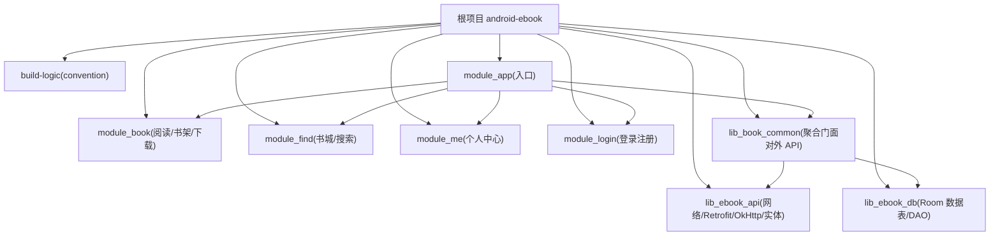
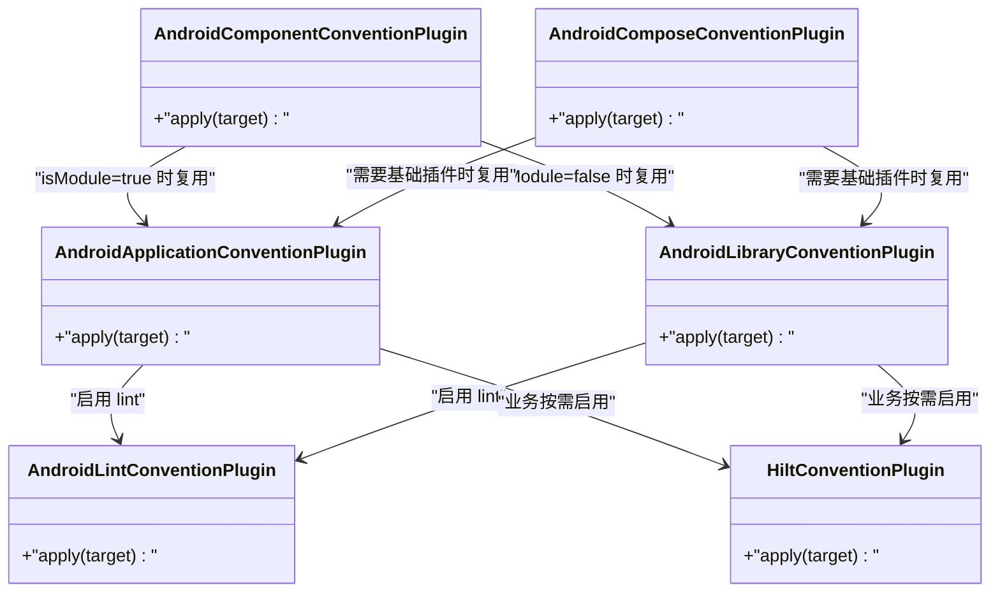
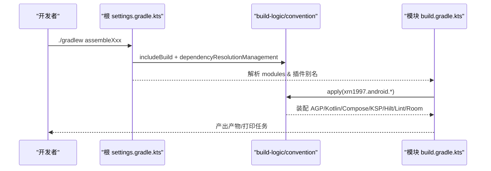
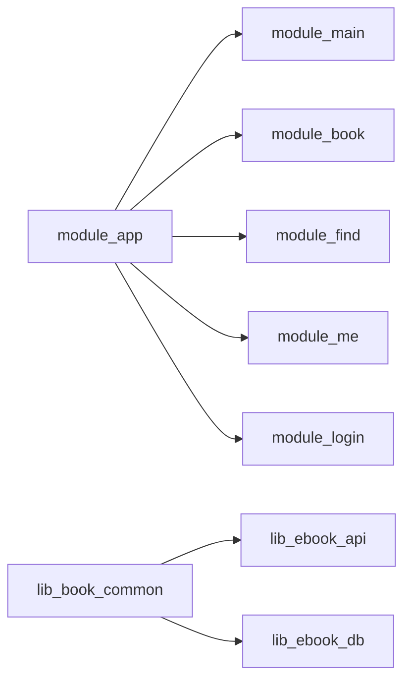
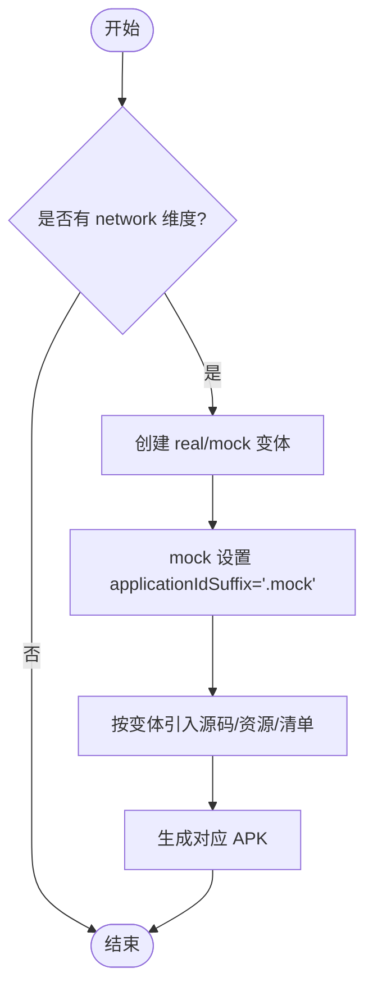

# 构建系统

<cite>
**本文引用的文件**   
- [settings.gradle.kts](file://settings.gradle.kts)
- [gradle.properties](file://gradle.properties)
- [gradle/libs.versions.toml](file://gradle/libs.versions.toml)
- [build-logic/settings.gradle.kts](file://build-logic/settings.gradle.kts)
- [build-logic/convention/build.gradle.kts](file://build-logic/convention/build.gradle.kts)
- [AndroidApplicationConventionPlugin.kt](file://build-logic/convention/src/main/kotlin/AndroidApplicationConventionPlugin.kt)
- [AndroidLibraryConventionPlugin.kt](file://build-logic/convention/src/main/kotlin/AndroidLibraryConventionPlugin.kt)
- [AndroidComponentConventionPlugin.kt](file://build-logic/convention/src/main/kotlin/AndroidComponentConventionPlugin.kt)
- [AndroidComposeConventionPlugin.kt](file://build-logic/convention/src/main/kotlin/AndroidComposeConventionPlugin.kt)
- [HiltConventionPlugin.kt](file://build-logic/convention/src/main/kotlin/HiltConventionPlugin.kt)
- [AndroidLintConventionPlugin.kt](file://build-logic/convention/src/main/kotlin/AndroidLintConventionPlugin.kt)
- [module_app/build.gradle.kts](file://module_app/build.gradle.kts)
- [lib_book_common/build.gradle.kts](file://lib_book_common/build.gradle.kts)
- [lib_ebook_api/build.gradle.kts](file://lib_ebook_api/build.gradle.kts)
</cite>

## 目录
1. [简介](#简介)
2. [项目结构与构建组织](#项目结构与构建组织)
3. [核心构建插件与约定](#核心构建插件与约定)
4. [架构总览](#架构总览)
5. [详细组件分析](#详细组件分析)
6. [依赖与模块关系](#依赖与模块关系)
7. [性能与缓存优化](#性能与缓存优化)
8. [多渠道与构建变体](#多渠道与构建变体)
9. [版本目录与依赖升级](#版本目录与依赖升级)
10. [CI/CD 集成指南](#cicd-集成指南)
11. [故障排查](#故障排查)
12. [结论](#结论)

## 简介
本文档系统性解析 Android 电子书阅读器的 Gradle 构建体系与自定义插件（build-logic）方案。重点覆盖：
- 多模块项目组织与 includeBuild 使用
- 自定义 Gradle 约定插件 xrn1997.android.component、xrn1997.android.library/application/compose/hilt/lint/room 的职责与配置方式
- Product Flavor 维度 network 下的 real/mock 构建变体及条件编译
- 版本目录 libs.versions.toml 的集中式版本管理策略
- 构建性能调优：增量编译、并行构建、缓存利用
- 签名管理与资源清单合并策略（按本地工程实际情况给出约束与建议）
- CI/CD 流水线设计思路与落地要点

## 项目结构与构建组织
本项目采用 Gradle 多模块结构，根 settings 通过 pluginManagement.dependencyResolutionManagement 统一管理仓库源，并通过 includeBuild 引用了同仓 build-logic，形成“业务模块 + 共享库 + build-logic 约定插件”的三层构建。

关键特性：
- 顶层设置统一仓库镜像（含阿里云 google/central、gradle-plugin、jitpack 等），避免国内环境直连下载失败；启用 gradle-toolchains foojay resolver，自动拉取 toolchain，无需本地预装 JDK。
- 强制集中依赖解析（FAIL_ON_PROJECT_REPOS），各子模块不得再自行声明仓库，保证依赖来源可控与可追溯。
- module_* 功能模块与 lib_* 共享库分离；应用入口 module_app 聚合功能模块；网络层与数据库持久化分别收敛在 lib_ebook_api 与 lib_ebook_db；lib_book_common 作为门面聚合两者，对外提供统一的 Compose UI、会话与会话刷新、书籍解析等能力。

图示来源
- [settings.gradle.kts:28-64](file://settings.gradle.kts#L28-L64)
- [module_app/build.gradle.kts:47-57](file://module_app/build.gradle.kts#L47-L57)
- [lib_book_common/build.gradle.kts:34-68](file://lib_book_common/build.gradle.kts#L34-L68)

章节来源
- [settings.gradle.kts:1-64](file://settings.gradle.kts#L1-L64)
- [gradle.properties:1-36](file://gradle.properties#L1-L36)

## 核心构建插件与约定
build-logic/convention 暴露一组以 xrn1997.* 为前缀的约定插件，将通用的 AGP/KSP/Hilt/Room/Lint/Compose/Kotlin 配置下沉到插件内，使业务模块 build 脚本尽量薄而一致。

已注册的插件 ID 及其职责摘要：
- xrn1997.android.application：应用模块基座，装配 Kotlin、AGP application、目标 SDK、Managed Devices、打印 APK 任务、lint 等。
- xrn1997.android.library：库模块基座，装配 Kotlin、AGP library、测试选项、单元测试/集成测试依赖注入、禁用多余 androidTest 变体等。
- xrn1997.android.component：面向功能模块的智能开关。当 isModule=true 时套用 xrn1997.android.application 并替换 manifest、扩展源码集；否则套用 xrn1997.android.library。便于同一模块既可作为功能独立运行又可被应用聚合集成。
- xrn1997.android.compose：启用 Jetpack Compose 编译器与 BOM 导入，根据 isModule 选择基础应用/库插件并统一配置 CommonExtension。
- xrn1997.hilt：自动启用 KSP、添加 Hilt 相关 KSP 注解处理器与依赖，并按是否检测到 Android base 插件添加 dagger.hilt.android.plugin。
- xrn1997.android.lint：在 Application/Library 或纯 Java/JVM 模块中启用 Lint，开启 XML 报告与依赖检查。
- xrn1997.android.room：Room 插件装配（由 convention 模块注册）。

以上插件均通过 gradlePlugin.plugins.register 暴露，并在 module 中以 id("xxx") 或 alias(libs.plugins.xxx) 形式引入，保持各模块一致性与可维护性。

图示来源
- [AndroidApplicationConventionPlugin.kt:28-48](file://build-logic/convention/src/main/kotlin/AndroidApplicationConventionPlugin.kt#L28-L48)
- [AndroidLibraryConventionPlugin.kt:30-68](file://build-logic/convention/src/main/kotlin/AndroidLibraryConventionPlugin.kt#L30-L68)
- [AndroidComponentConventionPlugin.kt:7-34](file://build-logic/convention/src/main/kotlin/AndroidComponentConventionPlugin.kt#L7-L34)
- [AndroidComposeConventionPlugin.kt:37-60](file://build-logic/convention/src/main/kotlin/AndroidComposeConventionPlugin.kt#L37-L60)
- [HiltConventionPlugin.kt:24-49](file://build-logic/convention/src/main/kotlin/HiltConventionPlugin.kt#L24-L49)
- [AndroidLintConventionPlugin.kt:25-47](file://build-logic/convention/src/main/kotlin/AndroidLintConventionPlugin.kt#L25-L47)

章节来源
- [build-logic/convention/build.gradle.kts:40-75](file://build-logic/convention/build.gradle.kts#L40-L75)

## 架构总览
整体构建流程遵循“根 settings -> build-logic -> 模块约定插件 -> 模块业务配置”的顺序。根 settings 先加载 repository 与 plugin 管理中心，然后 includeBuild 本地 build-logic 源码以便联调。各模块按自身类型应用相应约定插件，获得一致的 Kotlin、AGP、Composed、KSP、Hilt、Room、Lint 等能力。业务模块仅需少量 flavor、依赖与资源路径的配置。

图示来源
- [settings.gradle.kts:4-43](file://settings.gradle.kts#L4-L43)
- [build-logic/convention/build.gradle.kts:40-75](file://build-logic/convention/build.gradle.kts#L40-L75)
- [module_app/build.gradle.kts:1-45](file://module_app/build.gradle.kts#L1-L45)

章节来源
- [settings.gradle.kts:1-64](file://settings.gradle.kts#L1-L64)
- [build-logic/convention/build.gradle.kts:1-75](file://build-logic/convention/build.gradle.kts#L1-L75)
- [module_app/build.gradle.kts:1-45](file://module_app/build.gradle.kts#L1-L45)

## 详细组件分析

### AndroidComponent 约定插件：模块化开关（isModule）
- 根据 gradle.properties 的 isModule 属性决定当前模块是“独立 App”还是“被聚合 Library”。
- isModule=true 时：
  - 应用 xrn1997.android.application 与 theRouter；
  - 将 main source set 的 Manifest 指向 src/main/module/AndroidManifest.xml（替代默认 AndroidManifest.xml）；
  - 向 Kotlin 源码目录追加 src/main/test（用于在该 source set 下放置独立模式所需的占位路由等）。
- isModule=false 时：
  - 应用 xrn1997.android.library；
  - 使用默认 src/main/AndroidManifest.xml。

这为每个功能模块提供了“既能独立调试又能参与应用构建”的能力，极大提升单模块开发效率。

章节来源
- [AndroidComponentConventionPlugin.kt:7-34](file://build-logic/convention/src/main/kotlin/AndroidComponentConventionPlugin.kt#L7-L34)
- [gradle.properties:21-29](file://gradle.properties#L21-L29)

### AndroidCompose 约定插件：Compose 能力装配
- 根据 isModule 动态应用 xrn1997.android.application 或 xrn1997.android.library（确保存在 CommonExtension）；
- 引入 org.jetbrains.kotlin.plugin.compose；
- 调用 configureAndroidCompose(CommonExtension)，完成 Compose BOM 和常用依赖装配。

章节来源
- [AndroidComposeConventionPlugin.kt:37-60](file://build-logic/convention/src/main/kotlin/AndroidComposeConventionPlugin.kt#L37-L60)
- [lib_book_common/build.gradle.kts:4-8](file://lib_book_common/build.gradle.kts#L4-L8)

### Hilt 约定插件：KSP + Dagger/Hilt 自动化
- 启用 KSP 并添加 hilt.compiler 与 kotlin-metadata；
- 如果检测到 JVM 模块，注入 hilt-core；
- 如果检测到 Android base 模块，额外应用 dagger.hilt.android.plugin 并注入 hilt-android。

章节来源
- [HiltConventionPlugin.kt:24-49](file://build-logic/convention/src/main/kotlin/HiltConventionPlugin.kt#L24-L49)

### Lint 约定插件：统一静态检查
- 对 Application 与 Library 模块直接通过 extension 配置 lint；
- 非 Android 模块则应用 com.android.lint 并同样启用 XML 报告与依赖检查。

章节来源
- [AndroidLintConventionPlugin.kt:25-47](file://build-logic/convention/src/main/kotlin/AndroidLintConventionPlugin.kt#L25-L47)

### 模块级配置
- module_app：定义 namespace、版本号、flavorDimensions=network（real/mock），并选择性依赖功能模块（集成态依赖全部功能模块，独立态不依赖）；release 关闭混淆但保留规则文件位置；JDK 17 编译目标。
- lib_book_common：应用 ksp、hilt、compose 编译器、kotlin serialization；依赖外部 common、lib_ebook_api、lib_ebook_db 以及 Compose BOM 与主要 UI/工具库；通过 debugApi 仅 debug 引入 tooling；router KSP 启用。
- lib_ebook_api：从 local.properties 读取 ebook.server.host（缺省模拟器回环地址 10.0.2.2），并以 BuildConfig 注入，实现“免改代码切换后端”。

章节来源
- [module_app/build.gradle.kts:1-45](file://module_app/build.gradle.kts#L1-L45)
- [lib_book_common/build.gradle.kts:1-89](file://lib_book_common/build.gradle.kts#L1-L89)
- [lib_ebook_api/build.gradle.kts:1-73](file://lib_ebook_api/build.gradle.kts#L1-L73)

## 依赖与模块关系
项目的依赖方向严格遵循：业务模块 → lib_book_common → lib_ebook_api/lib_ebook_db。lib_ebook_db 为基础持久化层，无交叉依赖。

模块聚合：
- module_app 集成所有功能模块（module_main/module_book/module_find/module_me/module_login），形成完整应用入口。
- lib_book_common 对外暴露统一 UI、会话、书签/评论、书源解析等能力，屏蔽下游细节。

图示来源
- [module_app/build.gradle.kts:47-57](file://module_app/build.gradle.kts#L47-L57)
- [lib_book_common/build.gradle.kts:34-68](file://lib_book_common/build.gradle.kts#L34-L68)

章节来源
- [module_app/build.gradle.kts:47-57](file://module_app/build.gradle.kts#L47-L57)
- [lib_book_common/build.gradle.kts:34-68](file://lib_book_common/build.gradle.kts#L34-L68)

## 性能与缓存优化
本项目在多个层面启用了构建性能优化：
- Gradle Daemon 内存与 Kotlin 进程内存通过 gradle.properties 调优；
- KSP 增量构建开启且跨模块生效（ksp.incremental、ksp.incremental.log、ksp.incremental.intermodule），显著加速注解处理；
- R8 全量规则校验关闭 strictFullModeForKeepRules，避免不必要的慢路径；
- AGP 9 内置 Kotlin 支持，不再重复引入 KGP，减少编译阶段复杂度；
- Android Managed Devices 在约定插件中统一配置，利于本地模拟设备快速构建；
- 插件层 validatePlugins 开启更强校验，提前发现插件问题；
- PrintTestApksTask 在应用中打印构建产物位置，便于快速定位输出。

建议在实践中配合如下命令行参数：
- --parallel：启用多模块并行构建
- --build-cache：使用 Gradle 构建缓存
- --configuration-cache：启用配置缓存（注意第三方插件兼容性）
- --no-daemon 仅在必要时关闭守护进程

[本节为通用实践建议，未直接分析具体文件]

## 多渠道与构建变体
本项目使用 product flavor dimension = network 来区分后端接入方式：
- real：连接真实服务端
- mock：applicationIdSuffix 为 .mock，便于与 real 包名共存安装进行对比调试

通过该维度可实现：
- 不同后端行为（通过 flavor-specific source set 的 NetworkModule、assets、配置）
- 差异化的 applicationId（例如 .mock）以支持同时安装两个变种
- 构建命令如 assembleRealDebug / assembleMockDebug 即可切换

结合 isModule 开关还可以在同一模块内实现“集成态 vs 独立态”两套清单与源码集的差异化。

图示来源
- [module_app/build.gradle.kts:17-25](file://module_app/build.gradle.kts#L17-L25)

章节来源
- [module_app/build.gradle.kts:17-25](file://module_app/build.gradle.kts#L17-L25)

## 版本目录与依赖升级
版本统一集中在 gradle/libs.versions.toml 中，包含 versions、bundles、libraries 三大部分：
- versions：集中声明版本号（AGP、Kotlin、Jetpack、Hilt、Room、Retrofit、Coil、Okhttp 等）
- libraries：以名称键引用 group/name/version（或通过 ref 引用 versions）
- bundles：组合常用依赖组（例如 compose ui-test）

好处：
- 单一事实来源，避免多处散落版本导致不一致
- 依赖升级时只需修改 toml，所有模块自动同步
- 模块中使用 libs.xxx.yyy 保持简洁可读

最佳实践：
- 新增依赖必须走版本目录，不允许硬编码版本号
- 升级时优先升级小版本，观察构建与测试稳定性
- 对于 AOSP/Google 仓库依赖，关注镜像可用性，避免因网络问题导致构建失败

章节来源
- [gradle/libs.versions.toml:1-67](file://gradle/libs.versions.toml#L1-L67)
- [gradle/libs.versions.toml:68-200](file://gradle/libs.versions.toml#L68-L200)

## CI/CD 集成指南
基于本项目的构建体系，CI 流水线可按以下步骤组织：
- 初始化：克隆代码、配置 Gradle Wrapper、配置 Maven 镜像（已在 settings 中声明），准备本地 properties（如 local.properties）
- 构建与测试：执行 ./gradlew test 及指定模块 assembleDebug/assembleRelease
- 产物归档：使用约定插件打印的任务或直接归档 build outputs 中的 APK/AAB
- 安全与签名：签名信息建议使用密钥管理服务（如云 KeyStore、Secrets Manager），不在仓库中存储明文；通过环境变量注入签名路径与口令
- 发布与分发：可选接入 signing 与上传步骤（Google Play 内部测试轨道、蒲公英等）

[本节为通用指导原则，不涉及具体 CI 脚本实现]

## 故障排查
常见构建问题与解决思路：
- 本地服务器地址访问失败：targetSdk 37 起访问本机需本地网络权限；建议在真机使用 adb reverse 映射后搭配 localhost 或公网 IP 调试
- isModule 错误使用：勿用 -PisModule=true 覆盖；应在 gradle.properties 临时切换，并提交前改回 isModule=false
- 清单合并不一致：isModule=true 时模块只合并 src/main/module/AndroidManifest.xml，两处清单需保持同步
- Mock 资产形态错配：Mock JSON 与运行时反序列化类型必须一致，否则会出现“数据始终为空”的静默失败
- Room 迁移：新增实体必须补齐 migration 链，禁止使用破坏性迁移回退

章节来源
- [gradle.properties:21-35](file://gradle.properties#L21-L35)
- [AndroidComponentConventionPlugin.kt:20-30](file://build-logic/convention/src/main/kotlin/AndroidComponentConventionPlugin.kt#L20-L30)
- [lib_ebook_api/build.gradle.kts:12-25](file://lib_ebook_api/build.gradle.kts#L12-L25)

## 结论
本项目通过 build-logic 提供的 xrn1997.* 约定插件，将 Android、Compose、KSP、Hilt、Room、Lint 等横切关注点统一收口，模块侧仅需关注领域特性与业务配置。结合 Gradle 版本目录、flavor 维度与 isModule 开关，实现了清晰的模块解耦、稳定的依赖治理与高效的增量构建。对于团队持续迭代而言，该体系具备良好的可扩展性与可维护性。