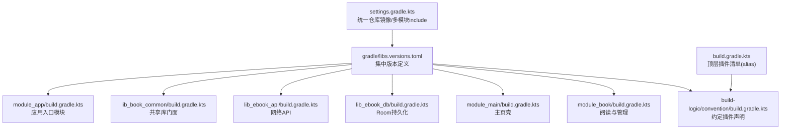
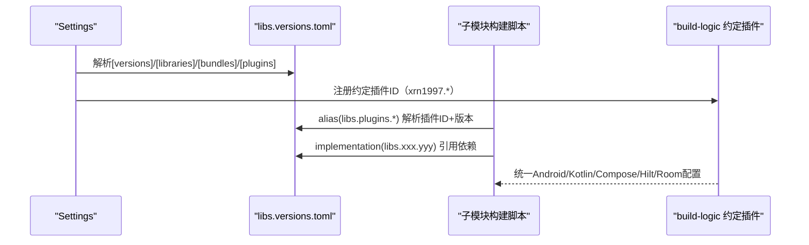

# 版本目录管理

<cite>
**本文件中引用的文件**
- [gradle/libs.versions.toml](file://gradle/libs.versions.toml)
- [settings.gradle.kts](file://settings.gradle.kts)
- [build.gradle.kts](file://build.gradle.kts)
- [module_app/build.gradle.kts](file://module_app/build.gradle.kts)
- [lib_book_common/build.gradle.kts](file://lib_book_common/build.gradle.kts)
- [lib_ebook_api/build.gradle.kts](file://lib_ebook_api/build.gradle.kts)
- [lib_ebook_db/build.gradle.kts](file://lib_ebook_db/build.gradle.kts)
- [module_main/build.gradle.kts](file://module_main/build.gradle.kts)
- [module_book/build.gradle.kts](file://module_book/build.gradle.kts)
- [build-logic/convention/build.gradle.kts](file://build-logic/convention/build.gradle.kts)
</cite>

## 目录
1. [简介](#简介)
2. [项目结构](#项目结构)
3. [核心组件](#核心组件)
4. [架构总览](#架构总览)
5. [详细组件解析](#详细组件解析)
6. [依赖关系分析](#依赖关系分析)
7. [性能考虑](#性能考虑)
8. [故障排查指南](#故障排查指南)
9. [结论](#结论)
10. [附录](#附录)（如需）

## 简介
本文聚焦 Gradle 版本目录（Version Catalog）的集中式版本管理机制，围绕根级配置文件 gradle/libs.versions.toml，说明 versions、bundles、libraries 三个段落的组织方式与作用范围；阐述各模块如何通过 alias(libs.plugins.xxx) 与 dependency(versions.xxx) 引用版本；给出依赖升级最佳实践、兼容性检查与渐进式策略；解释 Bundle 的概念与使用场景；提供版本冲突排查流程与 ./gradlew dependencies 用法；梳理外部仓库镜像配置及优化；最后给出自动化脚本思路与 CI 集成方案。

## 项目结构
该工程通过 settings.gradle.kts 引入 build-logic 中的自定义约定插件，所有模块以统一的约定插件装配，构建层统一在 gradle/libs.versions.toml 维护版本，业务模块与共享库均不硬编码版本号。



图示来源
- [settings.gradle.kts:4-18](file://settings.gradle.kts#L4-L18)
- [gradle/libs.versions.toml:207-229](file://gradle/libs.versions.toml#L207-L229)
- [build-logic/convention/build.gradle.kts:40-75](file://build-logic/convention/build.gradle.kts#L40-L75)

章节来源
- [settings.gradle.kts:4-18](file://settings.gradle.kts#L4-L18)
- [gradle/libs.versions.toml:207-229](file://gradle/libs.versions.toml#L207-L229)

## 核心组件
- 版本集中源：gradle/libs.versions.toml
  - [versions]：全局版本别名，例如 kotlin、androidGradlePlugin、hilt、room、retrofit 等
  - [libraries]：按功能域分组列出版本化依赖项，引用 versions 中对应 key
  - [bundles]：依赖组合，便于一次性引入一组相关库
  - [plugins]：统一声明插件及其版本，并通过 libs.plugins 暴露给模块使用
- 模块构建脚本：仅通过 libs.xxx 引用，零硬编码版本号
  - 顶层 build.gradle.kts 集中 aliased plugins 列表
  - 各业务/库模块仅在 dependencies{} 中用 libs 引用版本

章节来源
- [gradle/libs.versions.toml:1-66](file://gradle/libs.versions.toml#L1-L66)
- [gradle/libs.versions.toml:68-199](file://gradle/libs.versions.toml#L68-L199)
- [gradle/libs.versions.toml:207-229](file://gradle/libs.versions.toml#L207-L229)
- [build.gradle.kts:1-15](file://build.gradle.kts#L1-L15)

## 架构总览
以下图展示 Version Catalog 如何贯穿 Settings、顶层与子模块，以及约定插件的统一发布点。



图示来源
- [gradle/libs.versions.toml:207-229](file://gradle/libs.versions.toml#L207-L229)
- [build-logic/convention/build.gradle.kts:40-75](file://build-logic/convention/build.gradle.kts#L40-L75)

章节来源
- [settings.gradle.kts:4-18](file://settings.gradle.kts#L4-L18)

## 详细组件解析

### [versions] 段落
- 作用：集中声明所有可复用的版本号，包含 Android 工具链（AGP、tools）、Kotlin、Compose BOM、Hilt/Dagger、Room、Retrofit/OkHttp、测试、第三方库等。
- 使用方式：在 [libraries] 中以 version.ref = "<key>" 引用；在 [plugins] 中以 version.ref 或固定值引用（如 foojay resolver 为 settings 内字面量）。

关键点
- AGP、Tools、Kotlin 需协同升级（注释提示“需要一起更新”），避免 ABI/字节码不一致。
- Compose 生态推荐通过 BOM 统一版本对齐（见 libraries 中的 compose-bom 条目）。

章节来源
- [gradle/libs.versions.toml:1-66](file://gradle/libs.versions.toml#L1-L66)
- [gradle/libs.versions.toml:207-229](file://gradle/libs.versions.toml#L207-L229)

### [libraries] 段落
- 作用：为每个依赖定义名称与坐标，绑定到 versions 中的某个 key。
- 使用示例（路径指引）：
  - Kotlin 标准库与 Coroutines：kotlin-stdlib / kotlinx-coroutines-* 使用 kotlin/kotlinxCoroutines 版本键
  - 数据层：room-runtime / room-compiler 与 sqlite-bundled 分别引用 room/sqliteBundled 版本键
  - 网络层：retrofit-kotlin-serialization / okhttp-logging 统一来自 retrofit/okhttp 版本键
  - UI 与系统组件：androidx-composition 全家桶、Activity/Lifecycle/Navigation/Work 等

注意
- 某些依赖未显式指定 version 而依赖 BOM 或传递性版本（如 Compose 部分库由 BOM 管理），需确认版本一致性。

章节来源
- [gradle/libs.versions.toml:71-199](file://gradle/libs.versions.toml#L71-L199)

### [bundles] 段落
- 概念：将多个依赖编组，供模块按需“打包”引用，提升可读性与可维护性。
- 当前内容：定义了 androidx-compose-ui-test 组合包，用于 UI 测试时一次性引入 ui-test-junit4 与 ui-test-manifest。
- 典型用法：在 module/test 依赖中使用 platform/bundles 聚合测试环境。

章节来源
- [gradle/libs.versions.toml:68-70](file://gradle/libs.versions.toml#L68-L70)

### [plugins] 段落
- 作用：集中声明公共插件与其版本，并在子模块通过 alias(libs.plugins.*) 应用。
- 覆盖范围：
  - Google/官方插件：com.android.application/library/lint/test、org.jetbrains.kotlin.*、ksp、androidx.baselineprofile、androidx.room3、cn.therouter
  - 项目自研约定插件：xrn1997.android.application/compose/library/lint/hilt/room/component（由 build-logic 提供）
- 重要约束：settings 的 plugins{} 块中使用的 foojay resolver 插件版本为字面量（settings 读不到版本目录），属于已知结构性豁免。

章节来源
- [gradle/libs.versions.toml:207-229](file://gradle/libs.versions.toml#L207-L229)
- [build-logic/convention/build.gradle.kts:40-75](file://build-logic/convention/build.gradle.kts#L40-L75)

### 版本引用规范与实践
- 插件应用：在各模块中通过 alias(libs.plugins.*) 引入插件，不写死版本。参考
  - 顶层：build.gradle.kts 对插件 apply false/true 的集中声明
  - 模块：module_* / lib_* 的 build.gradle.kts 直接使用 alias 应用
- 依赖声明：dependencies{} 中一律使用 libs.<group>.<name>，如 libs.retrofit.kotlin.serialization、libs.room.runtime、libs.hilt.compiler 等
- BOM 使用：Composable 生态通过 platform(libs.androidx.compose.bom) 统一版本

章节来源
- [build.gradle.kts:1-15](file://build.gradle.kts#L1-L15)
- [lib_book_common/build.gradle.kts:52-58](file://lib_book_common/build.gradle.kts#L52-L58)
- [lib_book_common/build.gradle.kts:64-88](file://lib_book_common/build.gradle.kts#L64-L88)
- [lib_ebook_api/build.gradle.kts:48-72](file://lib_ebook_api/build.gradle.kts#L48-L72)

## 依赖关系分析
- 模块间依赖方向遵循：业务模块 → lib_book_common → lib_ebook_api → lib_ebook_db（DB 基础无环依赖）
- 版本集中于 Version Catalog，模块构建脚本仅消费 libs，形成单一事实源
- 约定插件在 build-logic 统一封装，确保不同模块的 Android/Kotlin/Compose/Hilt/Room 设置一致

```mermaid
graph LR
  A["module_app"] --> B["lib_book_common"]
  B --> C["lib_ebook_api"]
  C --> D["lib_ebook_db"]
  A -.alias(libs.plugins.*) .-> P["build-logic 约定插件"]
  subgraph "Version Catalog"
    L["libs.versions.toml"]
  end
  A -.dependencies libs.*.--> L
  B -.dependencies libs.*.--> L
  C -.dependencies libs.*.--> L
  D -.dependencies libs.*.--> L
```

图示来源
- [lib_book_common/build.gradle.kts:34-88](file://lib_book_common/build.gradle.kts#L34-L88)
- [lib_ebook_api/build.gradle.kts:48-72](file://lib_ebook_api/build.gradle.kts#L48-L72)
- [lib_ebook_db/build.gradle.kts:38-52](file://lib_ebook_db/build.gradle.kts#L38-L52)

章节来源
- [module_app/build.gradle.kts:47-63](file://module_app/build.gradle.kts#L47-L63)

## 性能考虑
- 合理划分依赖范围：尽量使用 api/implementation/implementationOnly 精准控制传递依赖，减少不必要编译/构建产物体积
- 合理使用 BOM：Compose 生态统一依赖 BOM，有助于避免版本漂移引起的增量编译抖动
- 仓库镜像顺序：将常用镜像放在靠前位置可减少解析耗时，同时保留 fallback（mavenCentral()/google()）提高鲁棒性

## 故障排查指南
- 使用依赖树分析冲突
  - 命令建议：./gradlew :module:dependencies --configuration debugImplementation
  - 定位重复依赖后，可使用 resolutionStrategy 或统一版本键修正
- 常见症状与对策
  - 类找不到/签名冲突：检查是否被上层库覆盖；确认 AGP/Kotlin/Compiler 版本协同
  - Compose 页面报错：确认 Compose BOM 与各 compose-* 依赖均来自同一 BOM 管控
  - Room SQL 校验失败：关注 Room 与 SQLite Bundled 版本组合，必要时调整至兼容集合
- 插件解析失败
  - 检查 settings 中 repositories 顺序，保证阿里/腾讯云/Google/JitPack/MavenCentral 均可达
  - 若本地无缓存，优先尝试切换镜像或代理

## 结论
本项目采用规范的 Version Catalog + 约定插件体系，将所有版本与插件集中在单文件管理，模块层仅消费，降低维护成本、提升一致性。结合合理的仓库镜像与 BOM 管理，可在团队协作中更顺畅地进行依赖升级和回归验证。

## 附录

### 依赖升级最佳实践
- 小步快跑：每次变更一个关键库的 major/minor 版本，配合单元测试/构建脚本验证
- 先升级间接依赖（如工具链、编译器），再升级业务依赖（框架、三方库）
- 借助 BOM 与统一版本键，批量同步 Compose、AndroidX、Coroutines 等套件
- 升级前记录影响面：导出依赖树并对比差异，标记潜在 API 不兼容点

### 版本冲突排查方法与 ./gradlew dependencies
- 打印完整依赖树：./gradlew <module>:dependencies
- 针对特定变体（如 testDebugImplementation）精确排查
- 使用 --exclude-group 或 --configuration 缩小范围定位
- 结合 IDE 的 Dependency Analyzer 视图快速锁定重复依赖

### 外部仓库配置与优化
- 已在 settings 中集中配置 maven 镜像：
  - 阿里云 google/central/public/gradle-plugin
  - JitPack（用于第三方 GitHub 发布）
  - 腾讯云镜像
  - Apache snapshots 与 Sonatype Snapshots
  - 回退到 mavenCentral()/google()
- 建议在团队内统一开启 Nexus/R3/CNPM-like 私有缓存以降低带宽与时延
- 对于频繁访问的仓库（Google、MavenCentral）建议启用并行解析与 daemon 调优

### 依赖包的 Bundle 组织建议
- 已有示例：androidx-compose-ui-test 作为测试 UI 所需组件组合
- 新增建议：
  - 测试套件：uiTest、espresso、roborazzi、turbine
  - 协程测试：coroutines-test、assertj/kotlinx-coroutines-test
  - DI/Hilt 测试：hilt-android-testing + hilt-compiler
- 在模块 test 依赖中使用 bundles，使测试依赖可编排、可替换

### 自动化脚本与 CI 集成思路
- 批量升级与预检
  - 定期拉取远端可用版本信息（如利用 deps.agree、Dependabot 或自有脚本）
  - 自动发起 PR 更新 libs.versions.toml，CI 执行 ./gradlew assemble/connectedAndroidTest
- 兼容性检查
  - 使用 ./gradlew lint/verifyReleaseResources/dex 验证打包链路
  - 运行 Robolectric/Instrumented tests，拦截 API 行为变化导致的不兼容
- 安全扫描
  - 在 CI 集成 OWASP 依赖检查（可选）