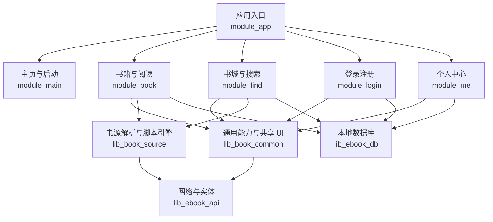
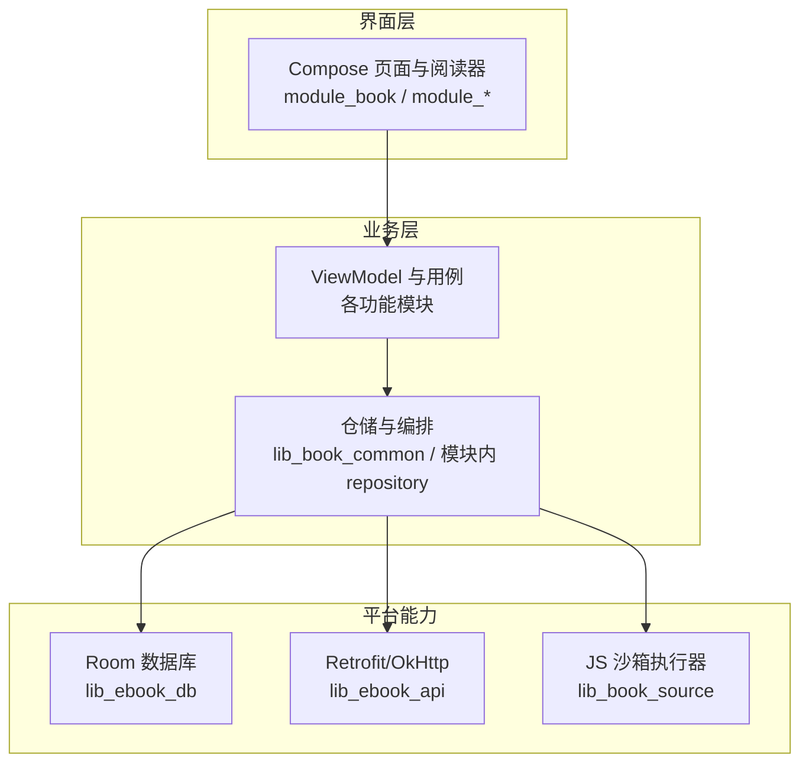
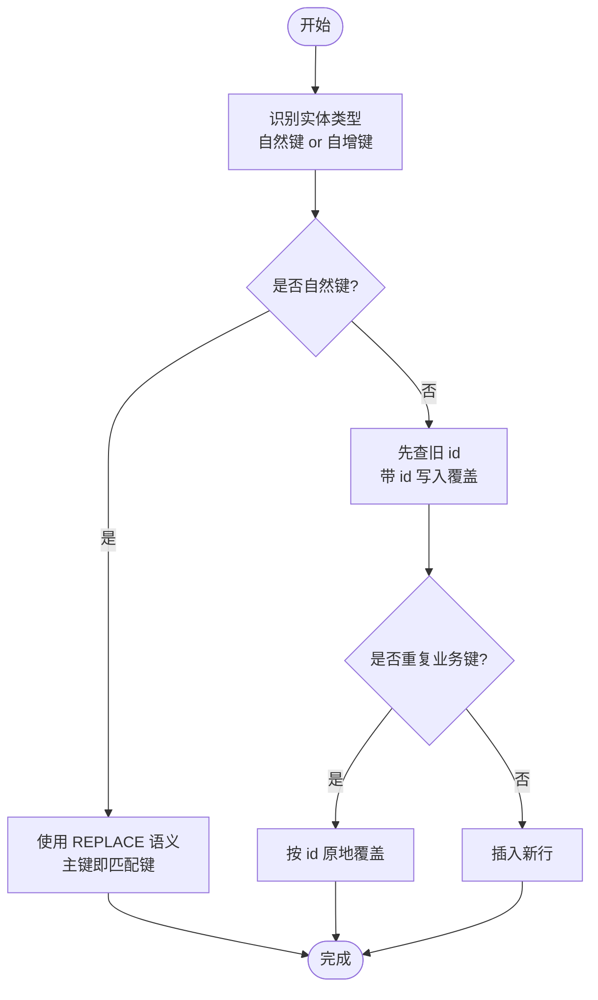
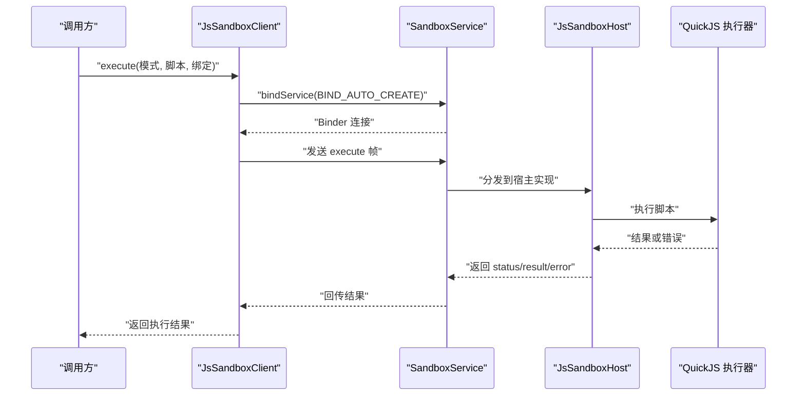
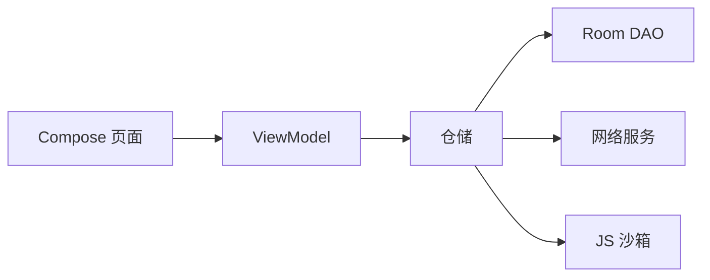

# 架构决策记录

<cite>
**本文引用的文件**   
- [README.MD](file://README.MD)
- [0001-compose-migration-endstate.md](file://docs/adr/0001-compose-migration-endstate.md)
- [0003-objectbox-to-room.md](file://docs/adr/0003-objectbox-to-room.md)
- [0028-untrusted-js-sandbox.md](file://docs/adr/0028-untrusted-js-sandbox.md)
- [AppDatabase.kt](file://lib_ebook_db/src/main/java/com/ebook/db/AppDatabase.kt)
- [SandboxService.kt](file://lib_book_source/src/main/java/com/ebook/source/sandbox/SandboxService.kt)
- [SandboxProcess.kt](file://lib_book_source/src/main/java/com/ebook/source/sandbox/SandboxProcess.kt)
- [JsSandboxHost.kt](file://lib_book_source/src/main/java/com/ebook/source/sandbox/JsSandboxHost.kt)
- [JsSandboxClient.kt](file://lib_book_source/src/main/java/com/ebook/source/sandbox/JsSandboxClient.kt)
</cite>

## 目录
1. [引言](#引言)
2. [项目结构](#项目结构)
3. [核心组件](#核心组件)
4. [架构总览](#架构总览)
5. [详细组件分析](#详细组件分析)
6. [依赖关系分析](#依赖关系分析)
7. [性能与可维护性考量](#性能与可维护性考量)
8. [故障排查指南](#故障排查指南)
9. [结论](#结论)
10. [附录：ADR 流程与模板](#附录adr-流程与模板)

## 引言
本文件面向 Android 小说阅读器项目的架构演进，聚焦三项关键架构决策：从传统 View 到 Jetpack Compose 的迁移终态、从 ObjectBox 到 Room 的数据库切换、以及对不可信 JavaScript 书源的零权限隔离沙箱设计。这些决策共同塑造了当前 MVVM + 多模块 + Compose UI + Room 数据层 + 独立 JS 执行器的系统形态。

为便于追踪，文档以“背景与问题 → 可选方案对比 → 最终决策 → 实施影响 → 后续跟踪”的结构展开，并在文末给出 ADR 变更记录和统一模板，帮助团队在后续技术选型中保持透明与一致。

## 项目结构
仓库采用多模块架构：应用入口 `module_app` 装配功能模块；业务模块包括 `module_main`、`module_book`、`module_find`、`module_login`、`module_me`；共享库包括 `lib_book_common`（通用 UI 与领域能力）、`lib_book_source`（书源解析与 JS 沙箱）、`lib_ebook_api`（网络与服务）、`lib_ebook_db`（Room 实体与 DAO）。构建侧使用 `build-logic` 约定插件统一 AGP、KSP、Hilt、Room、Compose 等工程化配置。

**图表来源**
- [README.MD:1-212](file://README.MD#L1-L212)

**章节来源**
- [README.MD:1-212](file://README.MD#L1-L212)

## 核心组件
- Compose UI 层：全部页面（含阅读器）已迁移至 Jetpack Compose，移除 XML 布局与 ViewBinding，统一状态驱动渲染。
- 数据层：Room 作为唯一持久化 ORM，通过 DAO 暴露 suspend/Flow 接口，配合 Migration 管理表结构演进。
- 书源引擎：原生规则解析器与脚本解释器并存，脚本在独立隔离进程中由 QuickJS 内核执行，并通过 Binder JSON 协议与主进程通信。
- 跨模块：TheRouter + Provider 解耦模块边界，避免循环依赖。

**章节来源**
- [README.MD:1-212](file://README.MD#L1-L212)

## 架构总览
下图把三个关键决策映射到代码结构：UI 层全面 Compose，数据层使用 Room，脚本执行走独立隔离进程。

**图表来源**
- [README.MD:1-212](file://README.MD#L1-L212)
- [AppDatabase.kt](file://lib_ebook_db/src/main/java/com/ebook/db/AppDatabase.kt)
- [SandboxService.kt](file://lib_book_source/src/main/java/com/ebook/source/sandbox/SandboxService.kt)

## 详细组件分析

### 从传统 View 到 Jetpack Compose 的迁移终态
- 背景与问题：项目长期处于 View 与 Compose 混合状态，阅读器是最复杂且收益最高的页面；保留两套 UI 体系将带来持续维护成本。
- 可选方案对比：
  - 保留阅读器为 View，仅包裹 Compose 外壳：短期稳定，但长期分裂 UI 技术栈。
  - 维持混合态为终态：失去统一技术栈目标，新增页面缺乏一致性依据。
  - 全量迁移到 Compose：一次性重写，风险可控，收益明确。
- 最终决策：所有 Activity/Fragment（含阅读器）迁移至 Compose，删除 ViewBinding 与 XML 布局；阅读器直接全量重写，不引入过渡壳。
- 实施影响：
  - UI 实现收敛于 Compose，样式分为正文层（读者自选阅读背景主题，不受深浅色模式影响）与控制层（继承全局主题）。
  - 阅读界面行为（翻页状态机、章节目录、设置面板）移植到 Compose。
- 后续跟踪：
  - 新页面一律使用 Compose；
  - 不再引入 ViewBinding/XML；
  - 主题策略按正文/控制两层规范执行。

**章节来源**
- [0001-compose-migration-endstate.md:1-14](file://docs/adr/0001-compose-migration-endstate.md#L1-L14)
- [README.MD:1-212](file://README.MD#L1-L212)

### 从 ObjectBox 到 Room 的数据库切换
- 背景与问题：ObjectBox 响应式 API 是 RxJava 风格，与 Coroutines + Flow 统一方向冲突；同时存在 ID 复用等已知问题。
- 可选方案对比：
  - 保留 ObjectBox：维持现状，但与协程主线冲突。
  - 数据迁移后切换：开发阶段用户基数小，跨引擎迁移成本高、收益低。
  - 切换到 Room：原生支持 Flow/suspend，官方 ORM，生态成熟。
- 最终决策：整体切换到 Room，实体与 DAO 在 `lib_ebook_db` 中实现，导出 schema 并由 Migration 链管理演进；ObjectBox 遗留数据不清空也不迁移。
- 实施影响：
  - 主键策略区分自然键与自增键：自然键用于去重定位，自增键用于流水型数据。
  - 迁移链显式定义 v1→v7 变更，禁止破坏性迁移，schema JSON 随版本提交。
  - 数据出 DB 进章文件，`book_content` 实体被移除。
- 后续跟踪：
  - 改动实体必须同步升级版本号、追加 Migration、提交 schema JSON；
  - DEFAULT 值必须与实体声明一致，列名避开 SQL 关键字；
  - 不得再清库。

**图表来源**
- [0003-objectbox-to-room.md:1-66](file://docs/adr/0003-objectbox-to-room.md#L1-L66)

**章节来源**
- [0003-objectbox-to-room.md:1-66](file://docs/adr/0003-objectbox-to-room.md#L1-L66)
- [AppDatabase.kt](file://lib_ebook_db/src/main/java/com/ebook/db/AppDatabase.kt)

### 不可信 JavaScript 沙箱执行环境
- 背景与问题：社区书源大量内嵌 JavaScript，属于完全不可信代码；若在主进程执行，可能获得应用权限并引发内存、网络、文件系统攻击面。
- 可选方案对比：
  - 在主进程执行受限脚本：实现简单但安全边界脆弱。
  - 使用 WebView 沙箱：能力较强，但资源消耗大、边界不够清晰。
  - 独立隔离进程 + QuickJS 内核 + 最小白名单 Host API：deny-by-default，多层防御。
- 最终决策：
  - 使用 Android `isolatedProcess` 零权限进程承载 QuickJS C 内核；
  - 通过 Binder JSON 协议与主进程通信，白名单限制 Host API；
  - 四层资源限制：挂钟超时、堆上限、JS 栈上限、请求/响应大小上限；
  - 主进程永不加载引擎，失败有名字且不传染。
- 实施影响：
  - 执行器进程通过 `SandboxService` 暴露服务，客户端通过 `JsSandboxClient` 发起任务；
  - 进程自检确保真正隔离，否则拒绝执行；
  - 宿主 API 分类处理：计算类在隔离进程内执行，网络类经主进程代理白名单访问。
- 后续跟踪：
  - 任何扩展 Host API 需评审并纳入白名单；
  - 资源限额参数变更需结合设备实测校准；
  - ABI 与 NDK/CMake 版本受控，避免不同机器产出差异。

**图表来源**
- [JsSandboxClient.kt](file://lib_book_source/src/main/java/com/ebook/source/sandbox/JsSandboxClient.kt)
- [SandboxService.kt](file://lib_book_source/src/main/java/com/ebook/source/sandbox/SandboxService.kt)
- [JsSandboxHost.kt](file://lib_book_source/src/main/java/com/ebook/source/sandbox/JsSandboxHost.kt)

**章节来源**
- [0028-untrusted-js-sandbox.md:1-65](file://docs/adr/0028-untrusted-js-sandbox.md#L1-L65)
- [SandboxService.kt](file://lib_book_source/src/main/java/com/ebook/source/sandbox/SandboxService.kt)
- [SandboxProcess.kt](file://lib_book_source/src/main/java/com/ebook/source/sandbox/SandboxProcess.kt)
- [JsSandboxHost.kt](file://lib_book_source/src/main/java/com/ebook/source/sandbox/JsSandboxHost.kt)
- [JsSandboxClient.kt](file://lib_book_source/src/main/java/com/ebook/source/sandbox/JsSandboxClient.kt)

## 依赖关系分析
- UI 层依赖 ViewModel 与仓储，不直接访问 Room 或沙箱。
- 仓储协调网络、Room、沙箱三类外部依赖，保证业务语义。
- 沙箱执行器对主进程无反向依赖，仅通过协议回调提供受限能力。
- Room 层通过 Migration 链保证数据一致性，不依赖业务逻辑。

**图表来源**
- [README.MD:1-212](file://README.MD#L1-L212)

**章节来源**
- [README.MD:1-212](file://README.MD#L1-L212)

## 性能与可维护性考量
- Compose 统一 UI 栈减少维护负担，提升渲染一致性与调试体验。
- Room 原生 Flow 与 suspend 简化异步模型，降低协程与 Rx 混用复杂度。
- JS 沙箱在隔离进程中运行，失败不影响主进程；资源限制四件套防止恶意脚本拖垮系统。
- Schema 导出与 Migration 链保障数据库升级可追溯、可回归。

[本节为通用指导，不直接分析具体文件]

## 故障排查指南
- Compose 迁移相关：
  - 若出现主题不一致，检查是否为正文层误受深浅色模式影响；
  - 确认未引入 ViewBinding/XML 新布局。
- Room 迁移相关：
  - 若出现重复词条或索引冲突，检查自然键 vs 自增键 upsert 写法是否正确回填旧 id；
  - 若覆盖安装后表结构异常，核对 Migration 语句与实体默认值是否逐字对齐；
  - 若发生崩溃，检查是否存在破坏性迁移或未提交的 schema JSON。
- JS 沙箱相关：
  - 若提示沙箱不可用，检查隔离进程自检是否通过、Binder 连接是否超时；
  - 若执行异常，查看 Host API 是否在白名单、是否违反字节/超时/深度限制；
  - 若进程冷启动慢，注意绑定期限与规则预算不要混用。

**章节来源**
- [0001-compose-migration-endstate.md:1-14](file://docs/adr/0001-compose-migration-endstate.md#L1-L14)
- [0003-objectbox-to-room.md:1-66](file://docs/adr/0003-objectbox-to-room.md#L1-L66)
- [0028-untrusted-js-sandbox.md:1-65](file://docs/adr/0028-untrusted-js-sandbox.md#L1-L65)

## 结论
三项决策共同推动项目走向更清晰、更安全、更易维护的架构：UI 全面 Compose 化消除技术债；Room 替代 ObjectBox 统一异步模型并固化 schema 演进；JS 沙箱以隔离进程与 deny-by-default 白名单保护主进程。未来任何新能力都应遵循“可观测、可回归、可审计”的原则，并以 ADR 形式沉淀决策背景与权衡。

[本节为总结性内容，不直接分析具体文件]

## 附录：ADR 流程与模板
- 变更记录建议：
  - 新增决策时创建 `docs/adr/NNNN-title.md`，编号连续；
  - 每个 ADR 包含：背景、可选方案、决策、影响、后续跟踪；
  - 涉及数据模型的 ADR 应关联 schema 迁移与测试覆盖；
  - 重大变更需在 README 或版本说明中汇总。
- ADR 模板：
  - 标题：简明描述决策主题
  - 状态：提议 / 已采纳 / 已弃用 / 已更新
  - 背景：问题陈述与动机
  - 可选方案：列出主要备选及其优劣
  - 决策：明确最终选择
  - 影响：对架构、性能、安全、维护的影响
  - 后续跟踪：需要跟进的任务、风险、监控指标
  - 参考：相关文件路径与链接

[本节为流程性内容，不直接分析具体文件]