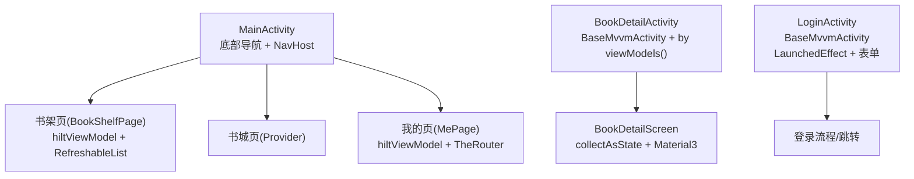
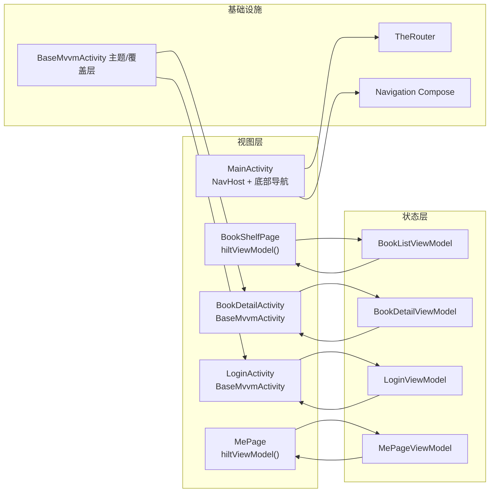
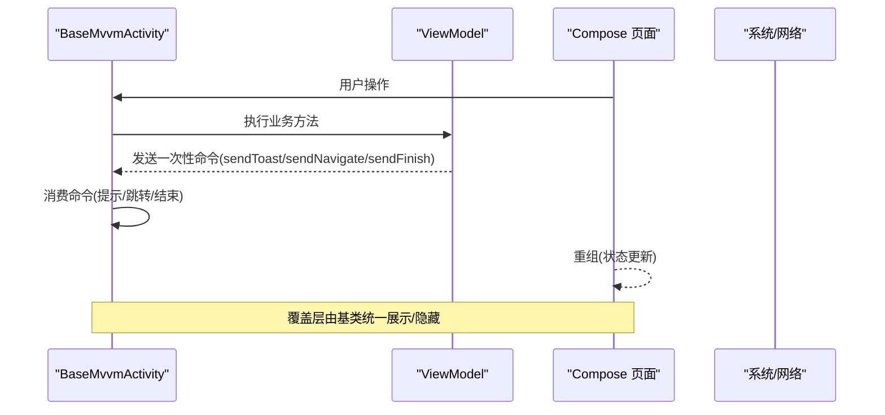
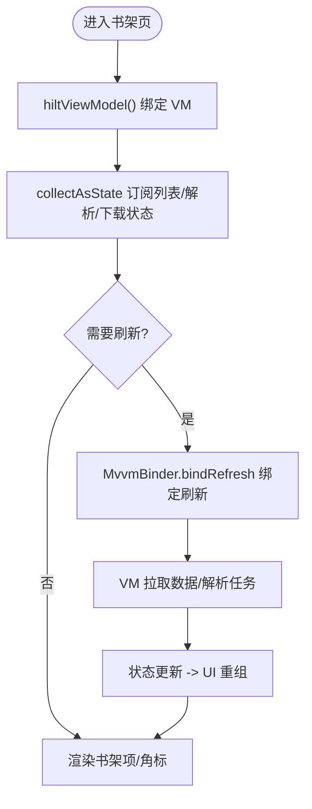
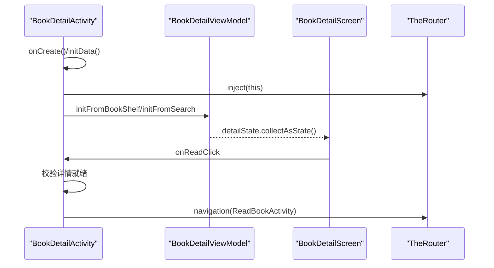
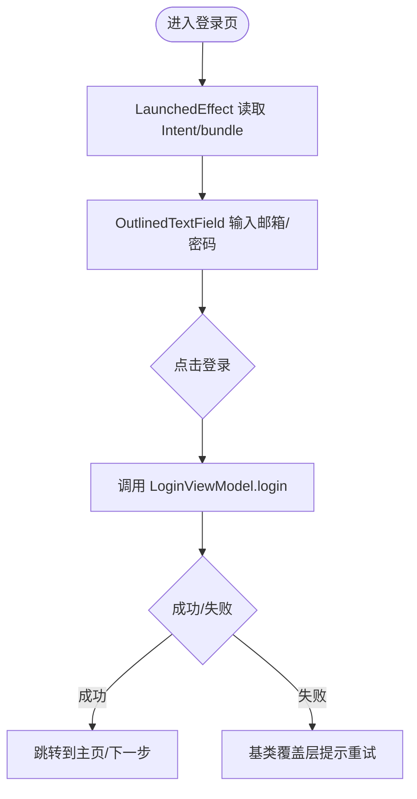
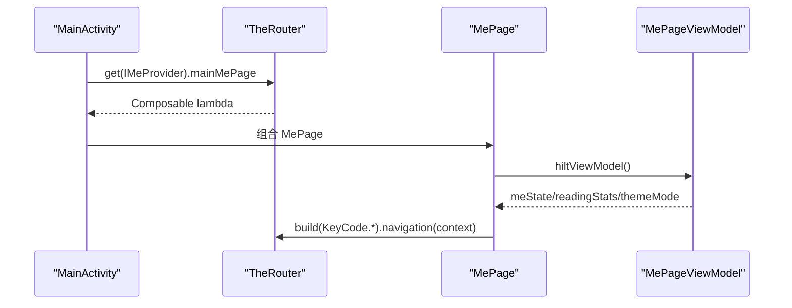
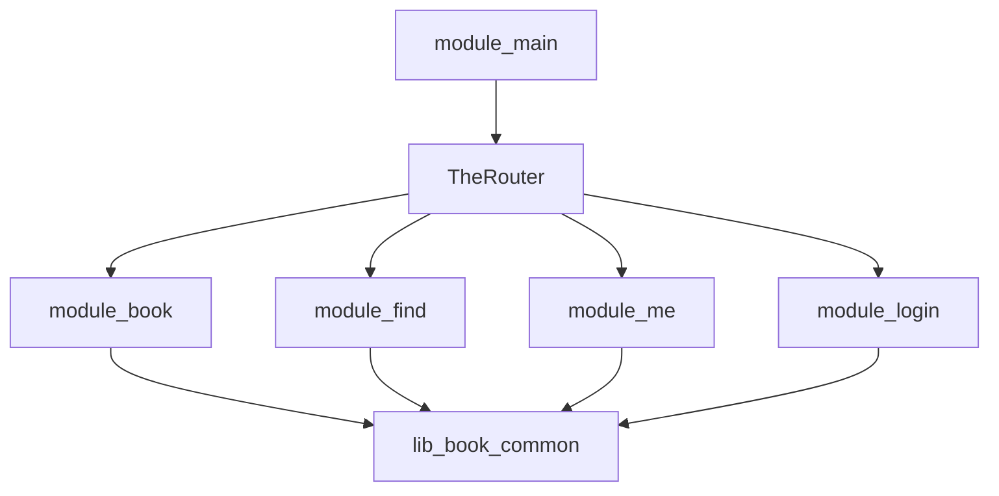

# Compose 集成模式

<cite>
**本文引用的文件**   
- [MainActivity.kt](file://module_main/src/main/java/com/ebook/main/MainActivity.kt)
- [BookDetailActivity.kt](file://module_book/src/main/java/com/ebook/book/BookDetailActivity.kt)
- [LoginActivity.kt](file://module_login/src/main/java/com/ebook/login/LoginActivity.kt)
- [BookShelfPage.kt](file://module_book/src/main/java/com/ebook/book/page/BookShelfPage.kt)
- [MePage.kt](file://module_me/src/main/java/com/ebook/me/page/MePage.kt)
- [0001-compose-migration-endstate.md](file://docs/adr/0001-compose-migration-endstate.md)
</cite>

## 目录
1. [引言](#引言)
2. [项目结构](#项目结构)
3. [核心组件](#核心组件)
4. [架构总览](#架构总览)
5. [详细组件分析](#详细组件分析)
6. [依赖关系分析](#依赖关系分析)
7. [性能考量](#性能考量)
8. [故障排查指南](#故障排查指南)
9. [结论](#结论)
10. [附录](#附录)

## 引言
本文件聚焦于 MVVM 与 Jetpack Compose 的集成模式，围绕 BaseMvvmActivity 的设计职责、页面生命周期与命令通道、加载覆盖层、ViewModel 绑定、状态提升、副作用处理、导航与主题适配等主题展开。文档基于仓库中现有实现（主界面宿主、书架页、详情页、登录页、迁移 ADR）进行归纳与可视化说明，帮助读者快速理解并复用该项目的 Compose 集成范式。

## 项目结构
- 应用入口与主页容器：module_main 中的 MainActivity 负责底部导航与三个 Tab 的 NavHost，通过 TheRouter 注入各模块 Provider 暴露的 Composable 页面。
- 功能页面：
  - 书架页：module_book/page/BookShelfPage.kt，列表+刷新容器，使用 hiltViewModel() 获取 ViewModel，结合 MvvmBinder 与 RefreshableList。
  - 详情页：module_book/BookDetailActivity.kt，继承 BaseMvvmActivity，使用 by viewModels() 绑定 ViewModel，页面内组合 BookDetailScreen。
  - 登录页：module_login/LoginActivity.kt，表单型页面，关闭 Toolbar 与系统栏偏移，使用 LaunchedEffect 处理一次性副作用。
  - 我的页：module_me/page/MePage.kt，Provider 暴露的 Composable，hiltViewModel() 绑定 ViewModel，跨模块导航通过 TheRouter。
- 统一迁移策略：docs/adr/0001-compose-migration-endstate.md 明确全仓迁移到 Compose，移除 ViewBinding/XML，阅读界面分两层配色（正文层豁免深浅色）。

图表来源
- [MainActivity.kt:99-197](file://module_main/src/main/java/com/ebook/main/MainActivity.kt#L99-L197)
- [BookShelfPage.kt:76-100](file://module_book/src/main/java/com/ebook/book/page/BookShelfPage.kt#L76-L100)
- [BookDetailActivity.kt:53-121](file://module_book/src/main/java/com/ebook/book/BookDetailActivity.kt#L53-L121)
- [LoginActivity.kt:49-193](file://module_login/src/main/java/com/ebook/login/LoginActivity.kt#L49-L193)
- [MePage.kt:77-94](file://module_me/src/main/java/com/ebook/me/page/MePage.kt#L77-L94)

章节来源
- [MainActivity.kt:45-197](file://module_main/src/main/java/com/ebook/main/MainActivity.kt#L45-L197)
- [BookShelfPage.kt:66-100](file://module_book/src/main/java/com/ebook/book/page/BookShelfPage.kt#L66-L100)
- [BookDetailActivity.kt:53-121](file://module_book/src/main/java/com/ebook/book/BookDetailActivity.kt#L53-L121)
- [LoginActivity.kt:49-193](file://module_login/src/main/java/com/ebook/login/LoginActivity.kt#L49-L193)
- [MePage.kt:61-94](file://module_me/src/main/java/com/ebook/me/page/MePage.kt#L61-L94)
- [0001-compose-migration-endstate.md:1-15](file://docs/adr/0001-compose-migration-endstate.md#L1-L15)

## 核心组件
- BaseMvvmActivity（来自 lib_common 的 Compose 基类）
  - 提供统一的主题装配、Toolbar/insets 控制开关（enableToolbar/enableFitsSystemWindows）、加载/空态/错误覆盖层、一次性命令通道（sendToast/sendFinish/sendNavigate）。
  - 要求页面继承 BaseMvvmActivity 以启用命令通道与覆盖层；若未继承，命令将静默失效。
- ViewModel 绑定方式
  - Activity 级页面：by viewModels() 绑定，配合 @AndroidEntryPoint 与 @HiltViewModel。
  - Composable 级页面（Provider 暴露）：hiltViewModel() 在组合时按 NavBackStackEntry 生命周期持有 VM，切换 Tab 保留状态，返回栈退出销毁。
- 状态提升与副作用
  - UI 层通过 collectAsState 订阅 StateFlow 或 State，避免在页面内部维护重复状态。
  - 一次性副作用使用 LaunchedEffect；SideEffect 用于与外部系统同步（如设置状态栏颜色）。
- 导航
  - 跨模块使用 TheRouter；Tab 内使用 Navigation Compose 的 NavHost，backStackEntry 驱动选中态。
- 主题
  - 全局主题由基类装配；业务页面不重复包裹 MaterialTheme；阅读界面正文层豁免深浅色，控制器层随主题切换。

章节来源
- [BookDetailActivity.kt:53-121](file://module_book/src/main/java/com/ebook/book/BookDetailActivity.kt#L53-L121)
- [BookShelfPage.kt:76-100](file://module_book/src/main/java/com/ebook/book/page/BookShelfPage.kt#L76-L100)
- [MePage.kt:77-94](file://module_me/src/main/java/com/ebook/me/page/MePage.kt#L77-L94)
- [0001-compose-migration-endstate.md:10-15](file://docs/adr/0001-compose-migration-endstate.md#L10-L15)

## 架构总览
下图展示 MVVM + Compose 的集成路径：Activity/Composable 作为视图层，ViewModel 管理状态与业务逻辑，通过 Flow/StateFlow 暴露给 UI；导航由 TheRouter 与 Navigation Compose 共同承担；主题由基类统一管理。

图表来源
- [MainActivity.kt:99-197](file://module_main/src/main/java/com/ebook/main/MainActivity.kt#L99-L197)
- [BookShelfPage.kt:76-100](file://module_book/src/main/java/com/ebook/book/page/BookShelfPage.kt#L76-L100)
- [BookDetailActivity.kt:53-121](file://module_book/src/main/java/com/ebook/book/BookDetailActivity.kt#L53-L121)
- [LoginActivity.kt:49-193](file://module_login/src/main/java/com/ebook/login/LoginActivity.kt#L49-L193)
- [MePage.kt:77-94](file://module_me/src/main/java/com/ebook/me/page/MePage.kt#L77-L94)

## 详细组件分析

### BaseMvvmActivity 的职责与页面生命周期
- 主题与覆盖层：统一装配 AppTheme，提供加载/空态/错误覆盖层，页面可通过基类开关控制是否显示 Toolbar 与 insets 处理。
- 命令通道：UI 层触发操作后，通过 ViewModel 发送一次性命令（提示、跳转、结束页面），基类消费命令，避免状态泄漏。
- 生命周期：页面 onCreate 中可订阅事件总线（如会话过期），由基类保证在合适时机执行清理与导航。

图表来源
- [BookDetailActivity.kt:53-121](file://module_book/src/main/java/com/ebook/book/BookDetailActivity.kt#L53-L121)
- [LoginActivity.kt:49-193](file://module_login/src/main/java/com/ebook/login/LoginActivity.kt#L49-L193)

章节来源
- [BookDetailActivity.kt:53-121](file://module_book/src/main/java/com/ebook/book/BookDetailActivity.kt#L53-L121)
- [LoginActivity.kt:49-193](file://module_login/src/main/java/com/ebook/login/LoginActivity.kt#L49-L193)

### 列表页：书架页（BookShelfPage）
- ViewModel 绑定：hiltViewModel() 在组合时按 NavBackStackEntry 生命周期持有 VM，切 Tab 保留状态。
- 刷新机制：RefreshableList + MvvmBinder.bindRefresh(view, viewModel) 将刷新信号映射到本地状态，避免孤儿收集器。
- 状态提升：列表数据、解析中书籍、下载剩余数均通过 collectAsState 订阅，UI 仅负责渲染。
- 导航与交互：导入、阅读等操作通过 TheRouter 或 startActivity 完成。

图表来源
- [BookShelfPage.kt:76-100](file://module_book/src/main/java/com/ebook/book/page/BookShelfPage.kt#L76-L100)

章节来源
- [BookShelfPage.kt:66-100](file://module_book/src/main/java/com/ebook/book/page/BookShelfPage.kt#L66-L100)

### 详情页：书籍详情（BookDetailActivity）
- 页面继承 BaseMvvmActivity，使用 by viewModels() 绑定 ViewModel。
- 参数传递：通过 TheRouter.inject 注入 from/data/data_key，区分书架与搜索入口。
- 状态提升：detailState 经 collectAsState 驱动 UI，包含 loading/loadError/tocDiverged 等状态。
- 导航：开始阅读前校验详情就绪，防止空白阅读器；编辑元数据通过 TheRouter 跳转。

图表来源
- [BookDetailActivity.kt:53-121](file://module_book/src/main/java/com/ebook/book/BookDetailActivity.kt#L53-L121)

章节来源
- [BookDetailActivity.kt:53-121](file://module_book/src/main/java/com/ebook/book/BookDetailActivity.kt#L53-L121)

### 表单页：登录页（LoginActivity）
- 页面继承 BaseMvvmActivity，关闭 Toolbar 与系统栏偏移，内容自行避让状态栏。
- 副作用处理：LaunchedEffect 读取 Intent 预填邮箱、设置 bundle；onNewIntent 复用实例时通过状态触发重组。
- 状态提升：邮箱/密码为页面局部状态，提交动作调用 VM.login，结果通过覆盖层/命令通道反馈。
- 导航：注册/忘记密码通过 startActivity 跳转。

图表来源
- [LoginActivity.kt:49-193](file://module_login/src/main/java/com/ebook/login/LoginActivity.kt#L49-L193)

章节来源
- [LoginActivity.kt:49-193](file://module_login/src/main/java/com/ebook/login/LoginActivity.kt#L49-L193)

### 我的页：MePage（Provider 暴露的 Composable）
- 页面由 TheRouter 创建，非 Hilt 直接实例化；内部使用 hiltViewModel() 获取 ViewModel。
- 状态提升：meState/readingStats/themeMode 通过 collectAsState 订阅，UI 仅渲染。
- 导航：跨模块跳转统一通过 TheRouter.build().navigation(context)，避免依赖路由器内部 Activity 探测。

图表来源
- [MainActivity.kt:184-197](file://module_main/src/main/java/com/ebook/main/MainActivity.kt#L184-L197)
- [MePage.kt:77-94](file://module_me/src/main/java/com/ebook/me/page/MePage.kt#L77-L94)

章节来源
- [MainActivity.kt:184-197](file://module_main/src/main/java/com/ebook/main/MainActivity.kt#L184-L197)
- [MePage.kt:77-94](file://module_me/src/main/java/com/ebook/me/page/MePage.kt#L77-L94)

### 导航与返回栈管理
- 底部导航：rememberNavController 管理路由，currentBackStackEntryAsState 派生选中态，popUpTo/findStartDestination/launchSingleTop/restoreState 保持 Tab 状态。
- 跨模块导航：TheRouter 统一入口，支持参数注入与跳转；独立模式下需占位路由避免静默丢失。
- 返回处理：BackHandler 统一拦截返回键，交由宿主动作（如二次点击退出）。

章节来源
- [MainActivity.kt:139-197](file://module_main/src/main/java/com/ebook/main/MainActivity.kt#L139-L197)

### 主题集成与 Material Design 3
- 全局主题：基类统一装配 AppTheme，业务页面不重复包裹 MaterialTheme。
- 阅读界面分层：正文层使用阅读背景主题（四档纸张色），不受深浅色影响；控制器层（顶/底栏、面板）随主题切换。
- 语义色：文本/按钮/卡片等使用 MaterialTheme.colorScheme/typography，避免硬编码颜色。

章节来源
- [0001-compose-migration-endstate.md:10-15](file://docs/adr/0001-compose-migration-endstate.md#L10-L15)

## 依赖关系分析
- 模块耦合：module_main 通过 TheRouter 解耦各模块 Provider，避免直接依赖；功能模块互不依赖，统一依赖 lib_book_common。
- 视图与状态：ViewModel 通过 Flow/StateFlow 暴露状态，UI 层仅订阅与渲染，降低耦合。
- 导航解耦：跨模块跳转通过 TheRouter，模块内跳转通过 Navigation Compose，职责清晰。

图表来源
- [MainActivity.kt:184-197](file://module_main/src/main/java/com/ebook/main/MainActivity.kt#L184-L197)

章节来源
- [MainActivity.kt:184-197](file://module_main/src/main/java/com/ebook/main/MainActivity.kt#L184-L197)

## 性能考量
- 列表性能：书架页使用 LazyColumn（RefreshableList），key 稳定且唯一，避免重排与锚点漂移。
- 状态订阅：collectAsState 在组合范围内订阅，减少不必要的重组；MvvmBinder 绑定刷新，避免孤儿收集器。
- 导航状态：NavHost 使用 restoreState/saveState 保持 Tab 状态，减少重建开销。
- 主题渲染：遵循 Material 语义色，避免重复计算与硬编码导致的重绘。

## 故障排查指南
- 页面不弹提示/不跳转：检查是否继承 BaseMvvmActivity，否则命令通道无法消费；确认 ViewModel 已正确绑定。
- 列表无数据：检查 collectAsState 订阅是否正确；确认 MvvmBinder 绑定刷新；查看 VM 是否发起请求。
- 登录预填无效：singleTask 复用实例时，确保 onNewIntent 更新状态并触发重组；LaunchedEffect 仅在首次组合运行。
- 导航丢失：独立模式下需占位路由；跨模块跳转需传入 context；TheRouter 找不到路由只记日志不报错。
- 主题不一致：不要在页面重复包裹 MaterialTheme；阅读正文层使用阅读背景主题。

章节来源
- [LoginActivity.kt:49-193](file://module_login/src/main/java/com/ebook/login/LoginActivity.kt#L49-L193)
- [BookShelfPage.kt:76-100](file://module_book/src/main/java/com/ebook/book/page/BookShelfPage.kt#L76-L100)
- [MainActivity.kt:139-197](file://module_main/src/main/java/com/ebook/main/MainActivity.kt#L139-L197)

## 结论
本项目采用 BaseMvvmActivity + Compose + Hilt + TheRouter 的统一 MVVM 架构，页面职责清晰、状态单向流动、导航解耦、主题统一。通过状态提升、副作用处理与覆盖层机制，实现了高内聚、低耦合的 UI 层实现。遵循本文模式的页面可快速复用模板，保证一致性与可维护性。

## 附录
- 参考实现路径：
  - 主界面与导航：[MainActivity.kt:99-197](file://module_main/src/main/java/com/ebook/main/MainActivity.kt#L99-L197)
  - 书架页刷新与状态：[BookShelfPage.kt:76-100](file://module_book/src/main/java/com/ebook/book/page/BookShelfPage.kt#L76-L100)
  - 详情页状态与导航：[BookDetailActivity.kt:53-121](file://module_book/src/main/java/com/ebook/book/BookDetailActivity.kt#L53-L121)
  - 登录页副作用与表单：[LoginActivity.kt:49-193](file://module_login/src/main/java/com/ebook/login/LoginActivity.kt#L49-L193)
  - 我的页 Provider 与导航：[MePage.kt:77-94](file://module_me/src/main/java/com/ebook/me/page/MePage.kt#L77-L94)
  - 迁移策略与主题规范：[0001-compose-migration-endstate.md:10-15](file://docs/adr/0001-compose-migration-endstate.md#L10-L15)