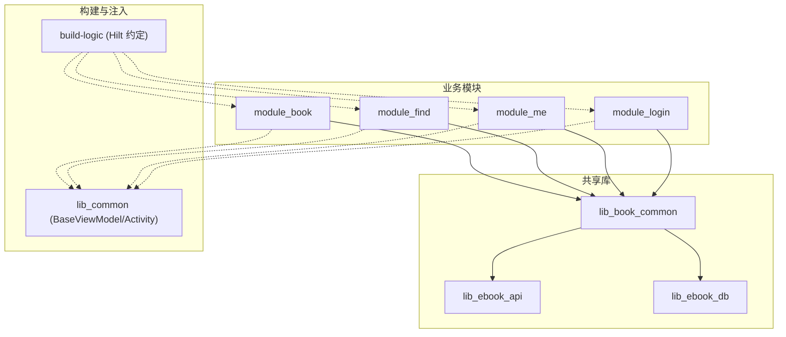
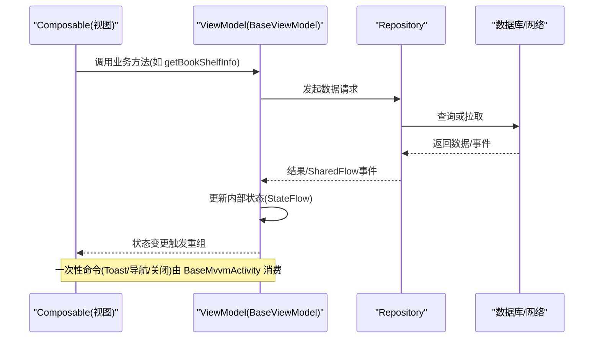
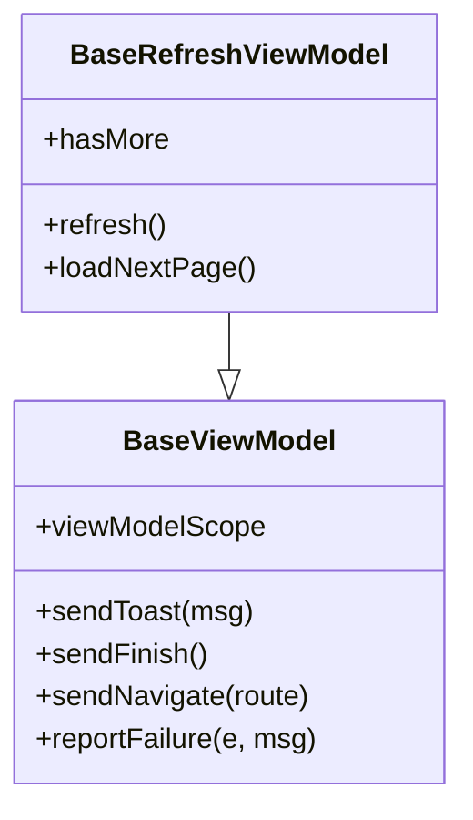
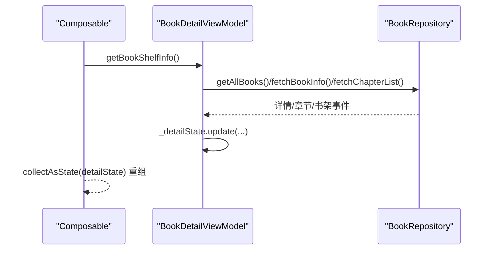
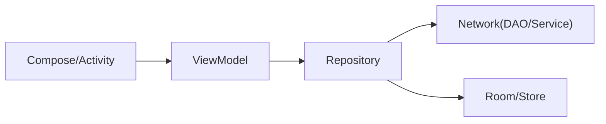

# MVVM 架构模式

<cite>
**本文引用的文件**
- [AGENTS.md](file://AGENTS.md)
- [BookDetailViewModel.kt](file://module_book/src/main/java/com/ebook/book/mvvm/viewmodel/BookDetailViewModel.kt)
- [SettingViewModel.kt](file://module_me/src/main/java/com/ebook/me/mvvm/viewmodel/SettingViewModel.kt)
- [LoginViewModel.kt](file://module_login/src/main/java/com/ebook/login/mvvm/viewmodel/LoginViewModel.kt)
- [LibraryViewModel.kt](file://module_find/src/main/java/com/ebook/find/mvvm/viewmodel/LibraryViewModel.kt)
- [BookRepository.kt](file://lib_book_common/src/main/java/com/ebook/common/repository/BookRepository.kt)
- [CommentRepository.kt](file://lib_book_common/src/main/java/com/ebook/common/repository/CommentRepository.kt)
- [HiltConventionPlugin.kt](file://build-logic/convention/src/main/kotlin/HiltConventionPlugin.kt)
</cite>

## 目录
1. [简介](#简介)
2. [项目结构](#项目结构)
3. [核心组件](#核心组件)
4. [架构总览](#架构总览)
5. [详细组件分析](#详细组件分析)
6. [依赖关系分析](#依赖关系分析)
7. [性能与线程安全](#性能与线程安全)
8. [故障排查指南](#故障排查指南)
9. [结论](#结论)
10. [附录](#附录)

## 简介
本仓库采用严格的 Model → ViewModel → View 三层分离的 MVVM 架构。业务模块通过 Hilt 注入 ViewModel，ViewModel 继承 lib_common 提供的 BaseViewModel/BaseRefreshViewModel，统一状态管理、事件通道与生命周期；View 层全面使用 Jetpack Compose，通过 StateFlow 订阅 VM 暴露的状态，实现响应式 UI。数据流从 Repository 出发，经 ViewModel 封装为可观察状态，再由 Compose 消费并驱动重组。

## 项目结构
- 功能模块（module_*）：每个模块包含 mvvm/viewmodel、repository、page、view 等子包，遵循“按功能域组织”的分层方式。
- 共享库（lib_book_common）：提供通用领域模型、仓库接口、UI 组件与工具；MVVM 基类来自外部库 lib_common（通过 settings 与约定插件接入）。
- 构建逻辑（build-logic）：统一 Gradle 约定插件，含 Hilt 集成配置，保证全仓一致的编译与注入行为。

图表来源
- [HiltConventionPlugin.kt:1-200](file://build-logic/convention/src/main/kotlin/HiltConventionPlugin.kt#L1-L200)
- [AGENTS.md:60-200](file://AGENTS.md#L60-L200)

章节来源
- [AGENTS.md:60-200](file://AGENTS.md#L60-L200)

## 核心组件
- BaseViewModel / BaseRefreshViewModel（来自 lib_common）
  - 职责：统一协程作用域、一次性命令通道（Toast/导航/结束页面）、加载覆盖层、刷新能力；子类仅关注业务状态与动作。
  - 状态命名约定：避免覆盖基类的 uiState（覆盖层专用），各页面使用「页面名 + State」如 detailState/meState/cacheState。
- BaseMvvmActivity（来自 lib_common）
  - 职责：持有 ViewModel、绑定一次性命令通道、提供 loading/空态/错误覆盖层、Compose 主题与 insets 处理；页面需覆写 PageContent()。
- Hilt 注入
  - @HiltViewModel 用于声明 ViewModel 由 Hilt 管理；@AndroidEntryPoint 用于 Activity 注入；无 Model 门面时使用 NoOpModel 占位。
- Compose 集成
  - 使用 collectAsState 订阅 StateFlow；副作用用 LaunchedEffect/rememberCoroutineScope 等；状态提升由 VM 持有，View 只消费。

章节来源
- [AGENTS.md:60-200](file://AGENTS.md#L60-L200)
- [BookDetailViewModel.kt:1-299](file://module_book/src/main/java/com/ebook/book/mvvm/viewmodel/BookDetailViewModel.kt#L1-L299)

## 架构总览
下图展示了从 Repository 到 ViewModel 再到 Compose View 的数据流向与状态流转。

图表来源
- [BookDetailViewModel.kt:156-209](file://module_book/src/main/java/com/ebook/book/mvvm/viewmodel/BookDetailViewModel.kt#L156-L209)
- [AGENTS.md:60-200](file://AGENTS.md#L60-L200)

## 详细组件分析

### BaseViewModel / BaseRefreshViewModel 继承体系
- BaseViewModel
  - 提供 viewModelScope、一次性命令通道、loading/错误覆盖层、事件上报与提示的统一入口。
  - 约束：子类必须继承该基类；纯展示页用 NoOpModel 占位；状态流命名避开 uiState。
- BaseRefreshViewModel
  - 在 BaseViewModel 基础上增强分页与下拉刷新能力，适配列表型页面。
- 设计收益
  - 统一的异步与状态语义，减少样板代码；
  - 集中处理一次性命令与覆盖层，避免页面散落 UI 细节；
  - 便于测试与替换（以 Repository/Domain 为边界）。

图表来源
- [AGENTS.md:60-200](file://AGENTS.md#L60-L200)

章节来源
- [AGENTS.md:60-200](file://AGENTS.md#L60-L200)

### BaseMvvmActivity 职责
- 持有并注入 ViewModel，绑定一次性命令通道（Toast/导航/关闭）；
- 提供 Compose 页面容器 PageContent()，统一 Toolbar、状态栏 insets、覆盖层；
- 强制页面继承以保障命令与覆盖层生效，避免“静默失效”。

章节来源
- [AGENTS.md:60-200](file://AGENTS.md#L60-L200)

### Compose 与 ViewModel 集成
- 状态提升：所有可观察状态集中在 VM（StateFlow），View 仅通过 collectAsState 订阅；
- 副作用：在 VM 中用 viewModelScope.launch 启动协程，避免在 Composable 中直接做 IO；
- 事件流：跨组件事件使用 SharedFlow（例如书架事件），VM 内收集并在合适时机更新状态。

章节来源
- [BookDetailViewModel.kt:61-100](file://module_book/src/main/java/com/ebook/book/mvvm/viewmodel/BookDetailViewModel.kt#L61-L100)
- [AGENTS.md:60-200](file://AGENTS.md#L60-L200)

### Hilt 依赖注入在 MVVM 中的应用
- @HiltViewModel：将 ViewModel 交由 Hilt 管理生命周期与作用域；
- @AndroidEntryPoint：在 Activity 中启用字段注入与基类绑定；
- 最佳实践：
  - 构造函数注入依赖（Repository/Manager），禁止在构造外获取；
  - 无 Model 门面时使用 NoOpModel 占位，保持基类一致性；
  - Application 上避免 eager 注入字段，防止沙箱进程崩溃。

章节来源
- [AGENTS.md:60-200](file://AGENTS.md#L60-L200)
- [HiltConventionPlugin.kt:1-200](file://build-logic/convention/src/main/kotlin/HiltConventionPlugin.kt#L1-L200)

### 完整数据流示例：从 Repository 到 View
以书籍详情页为例：
- 视图调用 VM 的 getBookShelfInfo；
- VM 通过 BookRepository 拉取详情与章节；
- 成功后更新 detailState（bookShelf/inBookShelf/loading/loadError/tocDiverged）；
- Compose 侧 collectAsState 订阅 detailState，自动重组 UI；
- 失败时设置 loadError 并允许重试；
- 书架事件通过 SharedFlow 推送，VM 更新 inBookShelf 状态。

图表来源
- [BookDetailViewModel.kt:156-209](file://module_book/src/main/java/com/ebook/book/mvvm/viewmodel/BookDetailViewModel.kt#L156-L209)
- [BookDetailViewModel.kt:75-100](file://module_book/src/main/java/com/ebook/book/mvvm/viewmodel/BookDetailViewModel.kt#L75-L100)

章节来源
- [BookDetailViewModel.kt:156-209](file://module_book/src/main/java/com/ebook/book/mvvm/viewmodel/BookDetailViewModel.kt#L156-L209)
- [BookDetailViewModel.kt:75-100](file://module_book/src/main/java/com/ebook/book/mvvm/viewmodel/BookDetailViewModel.kt#L75-L100)

### 状态管理模式：StateFlow 与 SharedFlow
- StateFlow
  - 用途：页面级可组合状态（如 detailState/meState/cacheState）；
  - 特点：有初始值、热流、背压、顺序更新；适合驱动 UI 重组。
- SharedFlow
  - 用途：一次性或广播事件（如书架事件 bookShelfEvents）；
  - 特点：事件型流，通常配合 replay=0 或按需缓冲；用于跨层通知。
- 线程安全
  - VM 内用 viewModelScope 管理协程；对共享集合加锁（如 synchronized）；
  - 更新 StateFlow 使用 update/copy 新实例确保不可变性与正确重发。

章节来源
- [BookDetailViewModel.kt:57-67](file://module_book/src/main/java/com/ebook/book/mvvm/viewmodel/BookDetailViewModel.kt#L57-L67)
- [BookDetailViewModel.kt:75-100](file://module_book/src/main/java/com/ebook/book/mvvm/viewmodel/BookDetailViewModel.kt#L75-L100)
- [AGENTS.md:60-200](file://AGENTS.md#L60-L200)

### 典型 ViewModel 模式与差异
- 详情页（BookDetailViewModel）
  - 聚合多源数据（本地书架+远端详情+章节），分路径初始化（书架入口/搜索入口）；
  - 静默检查目录变化，区分成功/分叉/失败场景；
  - 使用单一 StateFlow 收敛 UI 状态，避免多处分散状态导致不同步。
- 登录页（LoginViewModel）
  - 基于 BaseViewModel 封装登录流程；错误通过 reportFailure/sendToast 统一处理；
  - 通过 Repository 与 Session 管理交互。
- 书城页（LibraryViewModel）
  - 管理默认源发现、分类切换、分页加载；
  - 使用 StateFlow 表达加载/错误/数据状态，结合 SharedFlow 分发刷新事件。
- 设置页（SettingViewModel）
  - 纯展示或轻量操作，可能以 NoOpModel 占位；
  - 状态独立（如 cacheState），不污染全局 uiState。

章节来源
- [BookDetailViewModel.kt:1-299](file://module_book/src/main/java/com/ebook/book/mvvm/viewmodel/BookDetailViewModel.kt#L1-L299)
- [LoginViewModel.kt:1-200](file://module_login/src/main/java/com/ebook/login/mvvm/viewmodel/LoginViewModel.kt#L1-L200)
- [LibraryViewModel.kt:1-200](file://module_find/src/main/java/com/ebook/find/mvvm/viewmodel/LibraryViewModel.kt#L1-L200)
- [SettingViewModel.kt:1-200](file://module_me/src/main/java/com/ebook/me/mvvm/viewmodel/SettingViewModel.kt#L1-L200)

## 依赖关系分析
- 模块间依赖方向：业务模块 → lib_book_common → lib_ebook_api/lib_ebook_db；
- MVVM 层依赖：ViewModel 依赖 Repository/Domain，不感知 UI；View 仅依赖 VM 暴露的状态与动作；
- Hilt 装配：通过 build-logic 的约定插件统一开启注解处理与生成，避免手工配置差异。

图表来源
- [BookDetailViewModel.kt:52-56](file://module_book/src/main/java/com/ebook/book/mvvm/viewmodel/BookDetailViewModel.kt#L52-L56)
- [BookRepository.kt:1-200](file://lib_book_common/src/main/java/com/ebook/common/repository/BookRepository.kt#L1-L200)
- [CommentRepository.kt:1-200](file://lib_book_common/src/main/java/com/ebook/common/repository/CommentRepository.kt#L1-L200)
- [HiltConventionPlugin.kt:1-200](file://build-logic/convention/src/main/kotlin/HiltConventionPlugin.kt#L1-L200)

章节来源
- [BookDetailViewModel.kt:52-56](file://module_book/src/main/java/com/ebook/book/mvvm/viewmodel/BookDetailViewModel.kt#L52-L56)
- [HiltConventionPlugin.kt:1-200](file://build-logic/convention/src/main/kotlin/HiltConventionPlugin.kt#L1-L200)

## 性能与线程安全
- 协程与背压
  - 使用 viewModelScope 管理生命周期，避免泄漏；
  - 使用 StateFlow 提供有序、可控的状态更新；SharedFlow 用于事件广播。
- 并发安全
  - 对共享可变集合使用 synchronized 保护（如书架列表）；
  - 更新 StateFlow 时创建新对象（copy）以保证不可变性与重发。
- 渲染优化
  - 首帧优先本地数据渲染，后台静默检查目录，避免白屏；
  - 失败态不覆盖已有有效数据，保留用户可用内容。
- 资源与内存
  - 避免在 Application 中 eager 注入导致沙箱进程崩溃；
  - 大对象（图片/正文）通过 Store/缓存管理，不在 VM 中长期持有。

章节来源
- [BookDetailViewModel.kt:103-154](file://module_book/src/main/java/com/ebook/book/mvvm/viewmodel/BookDetailViewModel.kt#L103-L154)
- [BookDetailViewModel.kt:156-209](file://module_book/src/main/java/com/ebook/book/mvvm/viewmodel/BookDetailViewModel.kt#L156-L209)
- [AGENTS.md:60-200](file://AGENTS.md#L60-L200)

## 故障排查指南
- 页面不弹提示/不跳转/不关闭
  - 原因：页面未继承 BaseMvvmActivity，导致一次性命令无法被消费；
  - 解决：统一继承 BaseMvvmActivity，确保 MvvmBinder 绑定生效。
- 状态不更新/界面不刷新
  - 原因：直接修改 StateFlow 内的可变对象而未产生新引用；
  - 解决：使用 update{ it.copy(...) } 提交新实例。
- 列表重复/错位
  - 原因：事件收集未在 VM init 中幂等地收集，或 key 不稳定；
  - 解决：在 VM init 收集事件，使用稳定且唯一的 key。
- 会话过期/鉴权失败
  - 原因：未在报告层统一处理；
  - 解决：使用 reportFailure 上报，避免手写分支。

章节来源
- [AGENTS.md:60-200](file://AGENTS.md#L60-L200)
- [BookDetailViewModel.kt:103-154](file://module_book/src/main/java/com/ebook/book/mvvm/viewmodel/BookDetailViewModel.kt#L103-L154)

## 结论
本项目以 lib_common 的 BaseViewModel/BaseRefreshViewModel 与 BaseMvvmActivity 为核心，结合 Hilt 注入与 Compose 的响应式状态，构建了清晰、一致、可测试的 MVVM 架构。通过 StateFlow/SharedFlow 统一管理状态与事件，Repository 作为数据访问边界，实现了“数据→状态→UI”的可追踪数据流。遵循上述约定可有效降低维护成本、提高稳定性与可测试性。

## 附录
- 关键约定速查
  - 页面继承 BaseMvvmActivity；
  - VM 继承 BaseViewModel/BaseRefreshViewModel；
  - 状态流命名避开 uiState；
  - 一次性命令通过 VM 暴露，由 Activity 消费；
  - 事件总线使用 SharedFlow；
  - 无 Model 门面时用 NoOpModel 占位。

章节来源
- [AGENTS.md:60-200](file://AGENTS.md#L60-L200)