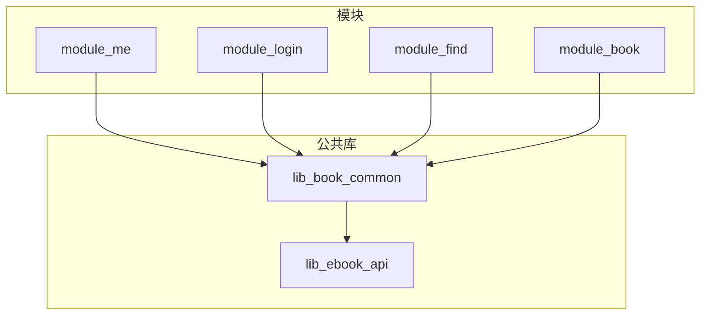
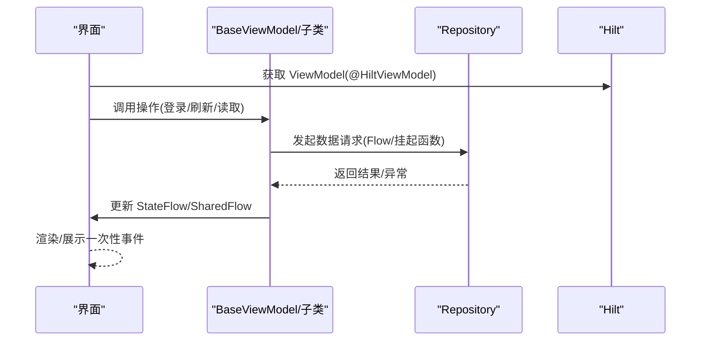
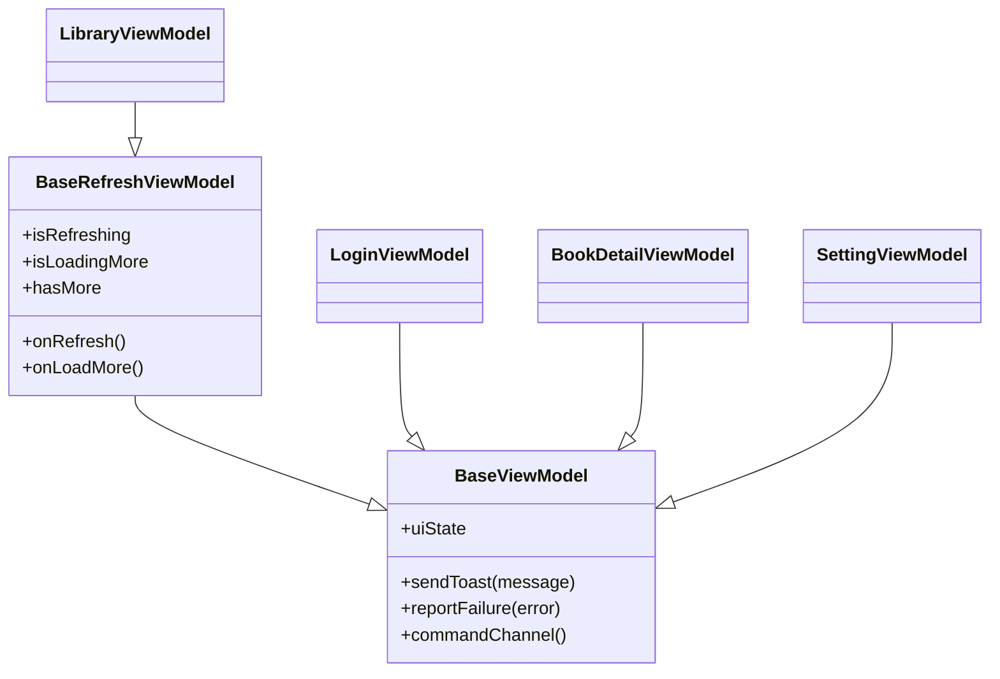
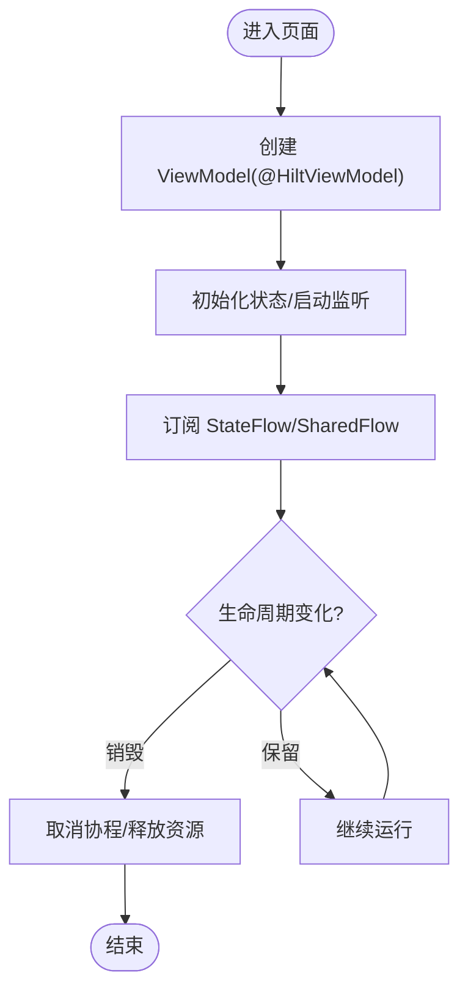
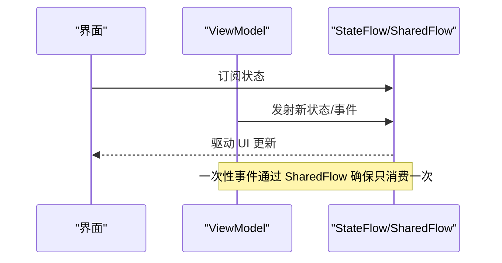
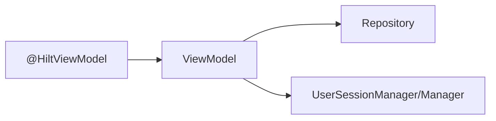
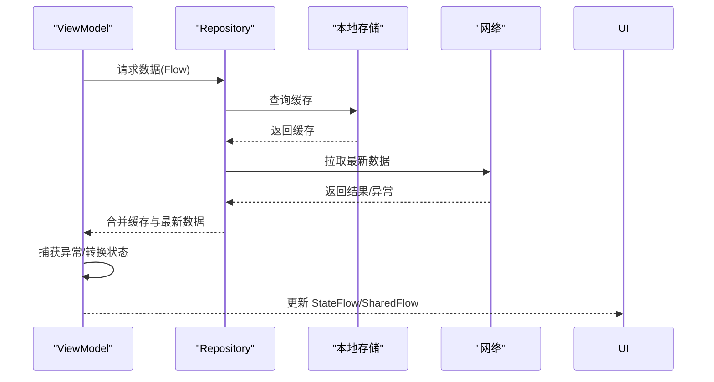
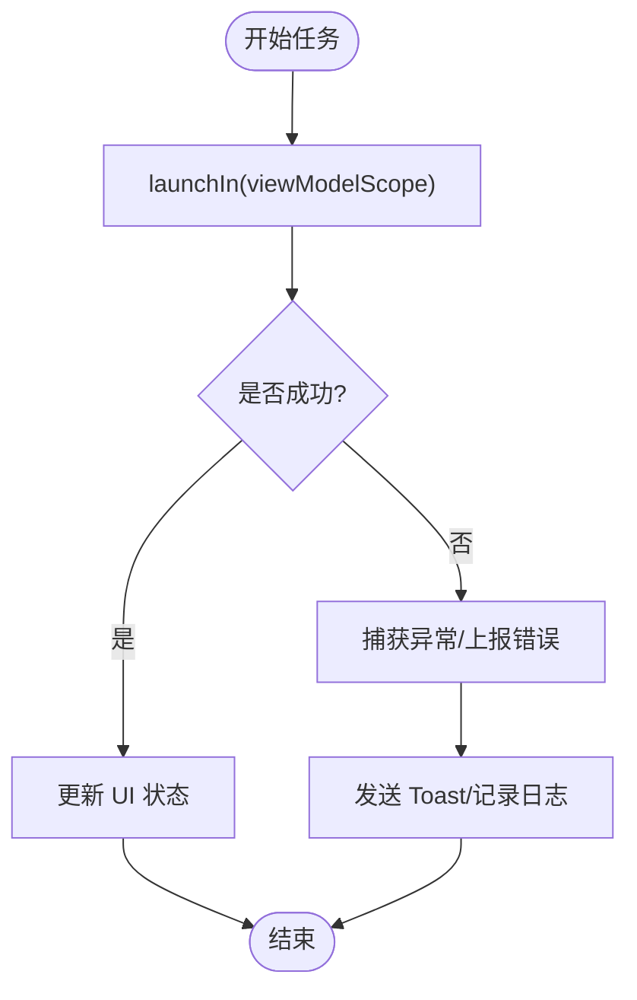
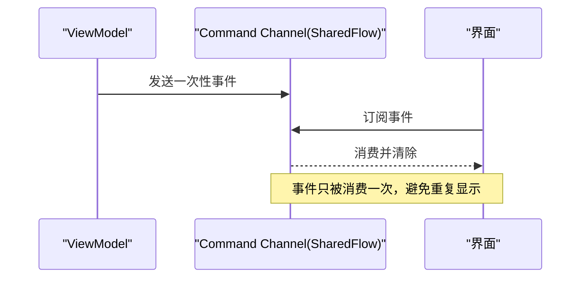
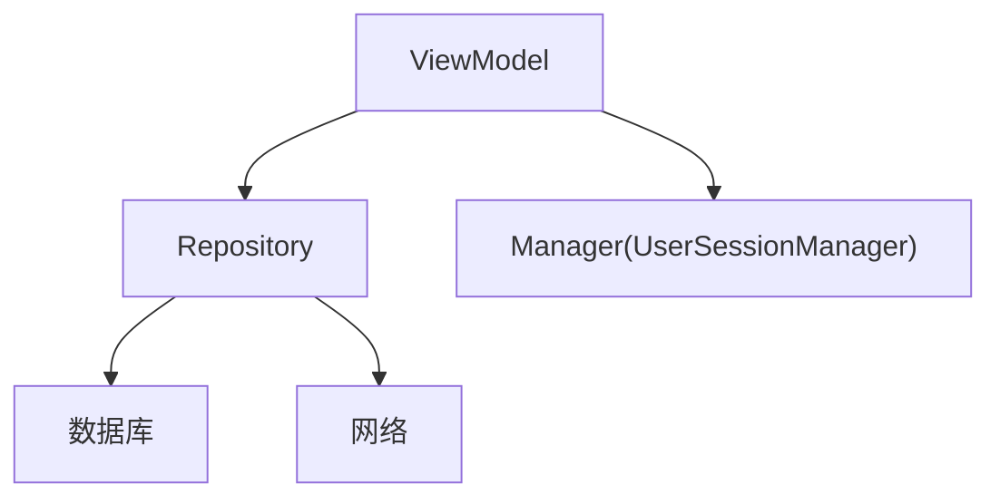

# ViewModel 层设计

<cite>
**本文引用的文件**
- [SettingViewModel.kt](file://module_me/src/main/java/com/ebook/me/mvvm/viewmodel/SettingViewModel.kt)
- [MePageViewModel.kt](file://module_me/src/main/java/com/ebook/me/mvvm/viewmodel/MePageViewModel.kt)
- [BookSourceViewModel.kt](file://module_me/src/main/java/com/ebook/me/mvvm/viewmodel/BookSourceViewModel.kt)
- [CacheManageViewModel.kt](file://module_me/src/main/java/com/ebook/me/mvvm/viewmodel/CacheManageViewModel.kt)
- [CommentViewModel.kt](file://module_me/src/main/java/com/ebook/me/mvvm/viewmodel/CommentViewModel.kt)
- [LibraryViewModel.kt](file://module_find/src/main/java/com/ebook/find/mvvm/viewmodel/LibraryViewModel.kt)
- [SearchViewModel.kt](file://module_find/src/main/java/com/ebook/find/mvvm/viewmodel/SearchViewModel.kt)
- [ChoiceBookViewModel.kt](file://module_find/src/main/java/com/ebook/find/mvvm/viewmodel/ChoiceBookViewModel.kt)
- [BookListViewModel.kt](file://module_book/src/main/java/com/ebook/book/mvvm/viewmodel/BookListViewModel.kt)
- [BookCommentsViewModel.kt](file://module_book/src/main/java/com/ebook/book/mvvm/viewmodel/BookCommentsViewModel.kt)
- [LoginViewModel.kt](file://module_login/src/main/java/com/ebook/login/mvvm/viewmodel/LoginViewModel.kt)
- [RegisterViewModel.kt](file://module_login/src/main/java/com/ebook/login/mvvm/viewmodel/RegisterViewModel.kt)
- [ModifyPwdViewModel.kt](file://module_login/src/main/java/com/ebook/login/mvvm/viewmodel/ModifyPwdViewModel.kt)
- [BookDetailViewModel.kt](file://module_book/src/main/java/com/ebook/book/mvvm/viewmodel/BookDetailViewModel.kt)
- [BookReadViewModel.kt](file://module_book/src/main/java/com/ebook/book/mvvm/viewmodel/BookReadViewModel.kt)
- [EditBookMetaViewModel.kt](file://module_book/src/main/java/com/ebook/book/mvvm/viewmodel/EditBookMetaViewModel.kt)
- [BookImportViewModel.kt](file://module_book/src/main/java/com/ebook/book/mvvm/viewmodel/BookImportViewModel.kt)
- [DownloadManageViewModel.kt](file://module_book/src/main/java/com/ebook/book/mvvm/viewmodel/DownloadManageViewModel.kt)
- [SourceSwitchViewModel.kt](file://module_book/src/main/java/com/ebook/book/mvvm/viewmodel/SourceSwitchViewModel.kt)
- [AddBookFailure.kt](file://module_find/src/main/java/com/ebook/find/mvvm/viewmodel/AddBookFailure.kt)
- [FailureReport.kt](file://lib_book_common/src/main/java/com/ebook/common/util/FailureReport.kt)
- [BookRepository.kt](file://lib_book_common/src/main/java/com/ebook/common/repository/BookRepository.kt)
- [CommentRepository.kt](file://lib_book_common/src/main/java/com/ebook/common/repository/CommentRepository.kt)
- [ProfileRepository.kt](file://lib_book_common/src/main/java/com/ebook/common/repository/ProfileRepository.kt)
- [UserSessionManager.kt](file://lib_book_common/src/main/java/com/ebook/common/domain/UserSessionManager.kt)
- [AndroidUserSessionManager.kt](file://lib_book_common/src/main/java/com/ebook/common/domain/AndroidUserSessionManager.kt)
- [SessionEventBus.kt](file://lib_ebook_api/src/main/java/com/ebook/api/auth/SessionEventBus.kt)
- [DownloadRepository.kt](file://module_book/src/main/java/com/ebook/book/repository/DownloadRepository.kt)
</cite>

## 目录
1. [简介](#简介)
2. [项目结构](#项目结构)
3. [核心组件](#核心组件)
4. [架构总览](#架构总览)
5. [详细组件分析](#详细组件分析)
6. [依赖关系分析](#依赖关系分析)
7. [性能与线程安全](#性能与线程安全)
8. [故障排查指南](#故障排查指南)
9. [结论](#结论)
10. [附录：典型 ViewModel 示例索引](#附录典型-viewmodel-示例索引)

## 简介
本设计文档聚焦于 MVVM 中的 ViewModel 层，系统性说明 BaseViewModel 与 BaseRefreshViewModel 的基类职责、继承体系、生命周期管理、状态封装模式，以及与 Repository 层的协作方式。文档同时覆盖 @HiltViewModel 的使用、协程作用域管理、错误处理策略、命令通道机制（一次性事件与 UI 状态分离）、以及 StateFlow/SharedFlow 的使用场景与线程安全注意事项。

## 项目结构
- 业务模块按功能拆分：module_me、module_login、module_find、module_book 等，每个模块内部采用“mvvm/viewmodel”组织 ViewModel，通过“repository”对接数据源。
- ViewModel 统一继承自通用基类 BaseViewModel 或 BaseRefreshViewModel，复用加载态、错误态、提示消息与分页刷新能力。
- 数据访问通过 Repository 暴露 Flow，ViewModel 使用协程在合适的调度器上消费并转换为 UI 状态。
- 通过 Hilt 注入依赖（如 Repository），保持 ViewModel 无状态初始化、可测试性强。

**图表来源**
- [SettingViewModel.kt:19-71](file://module_me/src/main/java/com/ebook/me/mvvm/viewmodel/SettingViewModel.kt#L19-L71)
- [BookRepository.kt:26-26](file://lib_book_common/src/main/java/com/ebook/common/repository/BookRepository.kt#L26-L26)
- [CommentRepository.kt:12-12](file://lib_book_common/src/main/java/com/ebook/common/repository/CommentRepository.kt#L12-L12)

**章节来源**
- [SettingViewModel.kt:19-71](file://module_me/src/main/java/com/ebook/me/mvvm/viewmodel/SettingViewModel.kt#L19-L71)
- [BookRepository.kt:26-26](file://lib_book_common/src/main/java/com/ebook/common/repository/BookRepository.kt#L26-L26)
- [CommentRepository.kt:12-12](file://lib_book_common/src/main/java/com/ebook/common/repository/CommentRepository.kt#L12-L12)

## 核心组件
- BaseViewModel：提供统一的 ViewModel 基座，包括：
  - 生命周期感知：结合 Activity/Fragment 生命周期进行资源清理与协程取消。
  - 状态封装：统一的 uiState 用于驱动加载/错误覆盖层；业务状态通过独立 StateFlow/SharedFlow 暴露。
  - 命令通道：一次性事件（如 Toast、导航）通过 SharedFlow 发送，确保只消费一次。
  - 便捷方法：sendToast、reportFailure 等扩展，简化错误与提示下发。
- BaseRefreshViewModel：在 BaseViewModel 基础上增加分页刷新能力：
  - isRefreshing/isLoadingMore/hasMore 等刷新相关状态。
  - 统一触发下拉刷新与上拉加载更多流程。
- NoOpModel：占位 Model，用于无门面需求的页面，避免为简单场景引入冗余抽象。

**章节来源**
- [MePageViewModel.kt:55-75](file://module_me/src/main/java/com/ebook/me/mvvm/viewmodel/MePageViewModel.kt#L55-L75)
- [BookSourceViewModel.kt:28-69](file://module_book/src/main/java/com/ebook/book/mvvm/viewmodel/SourceSwitchViewModel.kt#L28-L69)
- [BookListViewModel.kt:9-31](file://module_book/src/main/java/com/ebook/book/mvvm/viewmodel/BookListViewModel.kt#L9-L31)
- [LibraryViewModel.kt:100-106](file://module_find/src/main/java/com/ebook/find/mvvm/viewmodel/LibraryViewModel.kt#L100-L106)

## 架构总览
ViewModel 作为 UI 与业务逻辑的桥梁，遵循以下原则：
- 依赖注入：通过 @HiltViewModel 声明，使用构造器注入 Repository，避免单例耦合。
- 数据流：Repository 暴露 Flow；ViewModel 在协程中收集并转化为 UI 状态。
- 状态隔离：uiState 仅用于覆盖层（加载中/错误），业务状态由各自 StateFlow 管理。
- 一次性事件：通过 SharedFlow 实现命令通道，保证事件只被消费一次。
- 错误处理：统一捕获异常并通过 reportFailure/sendToast 下发到 UI。

**图表来源**
- [LoginViewModel.kt:16-34](file://module_login/src/main/java/com/ebook/login/mvvm/viewmodel/LoginViewModel.kt#L16-L34)
- [RegisterViewModel.kt:12-33](file://module_login/src/main/java/com/ebook/login/mvvm/viewmodel/RegisterViewModel.kt#L12-L33)
- [BookRepository.kt:26-26](file://lib_book_common/src/main/java/com/ebook/common/repository/BookRepository.kt#L26-L26)

**章节来源**
- [LoginViewModel.kt:16-34](file://module_login/src/main/java/com/ebook/login/mvvm/viewmodel/LoginViewModel.kt#L16-L34)
- [RegisterViewModel.kt:12-33](file://module_login/src/main/java/com/ebook/login/mvvm/viewmodel/RegisterViewModel.kt#L12-L33)
- [BookRepository.kt:26-26](file://lib_book_common/src/main/java/com/ebook/common/repository/BookRepository.kt#L26-L26)

## 详细组件分析

### 基类与继承体系
- BaseViewModel：所有非列表型页面的基础，负责：
  - 生命周期管理：在宿主销毁时取消协程、释放资源。
  - 状态封装：uiState 控制加载/错误覆盖层；业务状态通过独立的 StateFlow/SharedFlow 暴露。
  - 命令通道：一次性事件（Toast、跳转）通过 SharedFlow 下发，消费后自动移除。
  - 工具方法：sendToast/reportFailure 等。
- BaseRefreshViewModel：在 BaseViewModel 之上增加分页能力：
  - 刷新信号族：isRefreshing、isLoadingMore、hasMore。
  - 标准回调：onRefresh、onLoadMore，子类实现具体逻辑。
- NoOpModel：当页面不需要 Model 门面时，使用 NoOpModel 占位，减少样板代码。

**图表来源**
- [LoginViewModel.kt:16-34](file://module_login/src/main/java/com/ebook/login/mvvm/viewmodel/LoginViewModel.kt#L16-L34)
- [LibraryViewModel.kt:100-106](file://module_find/src/main/java/com/ebook/find/mvvm/viewmodel/LibraryViewModel.kt#L100-L106)
- [BookDetailViewModel.kt:56-65](file://module_book/src/main/java/com/ebook/book/mvvm/viewmodel/BookDetailViewModel.kt#L56-L65)
- [SettingViewModel.kt:19-71](file://module_me/src/main/java/com/ebook/me/mvvm/viewmodel/SettingViewModel.kt#L19-L71)

**章节来源**
- [LoginViewModel.kt:16-34](file://module_login/src/main/java/com/ebook/login/mvvm/viewmodel/LoginViewModel.kt#L16-L34)
- [LibraryViewModel.kt:100-106](file://module_find/src/main/java/com/ebook/find/mvvm/viewmodel/LibraryViewModel.kt#L100-L106)
- [BookDetailViewModel.kt:56-65](file://module_book/src/main/java/com/ebook/book/mvvm/viewmodel/BookDetailViewModel.kt#L56-L65)
- [SettingViewModel.kt:19-71](file://module_me/src/main/java/com/ebook/me/mvvm/viewmodel/SettingViewModel.kt#L19-L71)

### 生命周期管理
- ViewModel 由 Hilt 管理实例，随宿主（Activity/Fragment）创建与销毁。
- BaseViewModel 在销毁阶段取消所有协程，防止内存泄漏。
- 对于需要长期运行的任务（如监听 Session 事件），应在 ViewModel 内建立并绑定生命周期。

**图表来源**
- [MePageViewModel.kt:55-75](file://module_me/src/main/java/com/ebook/me/mvvm/viewmodel/MePageViewModel.kt#L55-L75)
- [AndroidUserSessionManager.kt:9-9](file://lib_book_common/src/main/java/com/ebook/common/domain/AndroidUserSessionManager.kt#L9-L9)

**章节来源**
- [MePageViewModel.kt:55-75](file://module_me/src/main/java/com/ebook/me/mvvm/viewmodel/MePageViewModel.kt#L55-L75)
- [AndroidUserSessionManager.kt:9-9](file://lib_book_common/src/main/java/com/ebook/common/domain/AndroidUserSessionManager.kt#L9-L9)

### 状态封装模式
- uiState：用于覆盖层（加载中/错误），避免与业务状态混淆。
- 业务状态：通过独立的 StateFlow 暴露，例如评论列表、设置项、书架数据。
- 一次性事件：通过 SharedFlow 实现命令通道，例如 Toast、导航指令，确保只消费一次。

**图表来源**
- [BookDetailViewModel.kt:56-65](file://module_book/src/main/java/com/ebook/book/mvvm/viewmodel/BookDetailViewModel.kt#L56-L65)
- [SettingViewModel.kt:19-71](file://module_me/src/main/java/com/ebook/me/mvvm/viewmodel/SettingViewModel.kt#L19-L71)

**章节来源**
- [BookDetailViewModel.kt:56-65](file://module_book/src/main/java/com/ebook/book/mvvm/viewmodel/BookDetailViewModel.kt#L56-L65)
- [SettingViewModel.kt:19-71](file://module_me/src/main/java/com/ebook/me/mvvm/viewmodel/SettingViewModel.kt#L19-L71)

### @HiltViewModel 与依赖注入最佳实践
- 使用 @HiltViewModel 注解声明 ViewModel，便于 Hilt 管理生命周期与作用域。
- 通过构造器注入 Repository，避免静态依赖，提高可测试性。
- 对跨进程/全局会话（如 Token 刷新）使用专用 Manager（如 UserSessionManager），在 ViewModel 中按需调用。

**图表来源**
- [LoginViewModel.kt:16-34](file://module_login/src/main/java/com/ebook/login/mvvm/viewmodel/LoginViewModel.kt#L16-L34)
- [UserSessionManager.kt:9-9](file://lib_book_common/src/main/java/com/ebook/common/domain/UserSessionManager.kt#L9-L9)

**章节来源**
- [LoginViewModel.kt:16-34](file://module_login/src/main/java/com/ebook/login/mvvm/viewmodel/LoginViewModel.kt#L16-L34)
- [UserSessionManager.kt:9-9](file://lib_book_common/src/main/java/com/ebook/common/domain/UserSessionManager.kt#L9-L9)

### ViewModel 与 Repository 交互
- Repository 暴露 Flow，ViewModel 在协程中收集并转换数据。
- 错误统一捕获并通过 reportFailure/sendToast 下发。
- 对于网络请求失败，优先尝试重试或降级策略（如缓存）。

**图表来源**
- [BookRepository.kt:26-26](file://lib_book_common/src/main/java/com/ebook/common/repository/BookRepository.kt#L26-L26)
- [CommentRepository.kt:12-12](file://lib_book_common/src/main/java/com/ebook/common/repository/CommentRepository.kt#L12-L12)

**章节来源**
- [BookRepository.kt:26-26](file://lib_book_common/src/main/java/com/ebook/common/repository/BookRepository.kt#L26-L26)
- [CommentRepository.kt:12-12](file://lib_book_common/src/main/java/com/ebook/common/repository/CommentRepository.kt#L12-L12)

### 协程作用域管理与错误处理策略
- 使用 viewModelScope 或自定义 CoroutineScope 管理异步任务。
- 统一捕获异常，通过 reportFailure/sendToast 上报。
- 对于长时间运行的任务，注意取消与恢复逻辑，避免重复执行。

**图表来源**
- [FailureReport.kt:40-40](file://lib_book_common/src/main/java/com/ebook/common/util/FailureReport.kt#L40-L40)
- [CacheManageViewModel.kt:33-40](file://module_me/src/main/java/com/ebook/me/mvvm/viewmodel/CacheManageViewModel.kt#L33-L40)

**章节来源**
- [FailureReport.kt:40-40](file://lib_book_common/src/main/java/com/ebook/common/util/FailureReport.kt#L40-L40)
- [CacheManageViewModel.kt:33-40](file://module_me/src/main/java/com/ebook/me/mvvm/viewmodel/CacheManageViewModel.kt#L33-L40)

### 命令通道机制
- 一次性事件通过 SharedFlow 发送，确保只消费一次。
- UI 侧订阅后消费并清除，避免重复触发。
- 常见用途：Toast 提示、导航跳转、弹窗确认。

**图表来源**
- [BookCommentsActivity.kt:62-62](file://module_book/src/main/java/com/ebook/book/BookCommentsActivity.kt#L62-L62)
- [ReadBookActivity.kt:367-367](file://module_book/src/main/java/com/ebook/book/ReadBookActivity.kt#L367-L367)

**章节来源**
- [BookCommentsActivity.kt:62-62](file://module_book/src/main/java/com/ebook/book/BookCommentsActivity.kt#L62-L62)
- [ReadBookActivity.kt:367-367](file://module_book/src/main/java/com/ebook/book/ReadBookActivity.kt#L367-L367)

## 依赖关系分析
- ViewModel 依赖 Repository，Repository 可能依赖数据库、网络、缓存等。
- 通过 Hilt 注入，降低耦合度，提升可测试性。
- 跨模块依赖通过接口或 Manager 解耦（如 UserSessionManager）。

**图表来源**
- [LoginViewModel.kt:16-34](file://module_login/src/main/java/com/ebook/login/mvvm/viewmodel/LoginViewModel.kt#L16-L34)
- [BookRepository.kt:26-26](file://lib_book_common/src/main/java/com/ebook/common/repository/BookRepository.kt#L26-L26)
- [UserSessionManager.kt:9-9](file://lib_book_common/src/main/java/com/ebook/common/domain/UserSessionManager.kt#L9-L9)

**章节来源**
- [LoginViewModel.kt:16-34](file://module_login/src/main/java/com/ebook/login/mvvm/viewmodel/LoginViewModel.kt#L16-L34)
- [BookRepository.kt:26-26](file://lib_book_common/src/main/java/com/ebook/common/repository/BookRepository.kt#L26-L26)
- [UserSessionManager.kt:9-9](file://lib_book_common/src/main/java/com/ebook/common/domain/UserSessionManager.kt#L9-L9)

## 性能与线程安全
- 使用 StateFlow/SharedFlow 确保线程安全的状态共享。
- 避免在主线程执行耗时操作，使用 IO 调度器。
- 合理控制 Flow 的背压策略，避免内存溢出。
- 对于分页数据，合理使用 hasMore 控制加载边界。

[本节为通用指导，不直接分析具体文件]

## 故障排查指南
- 常见问题：
  - 状态未更新：检查是否正确订阅 StateFlow/SharedFlow。
  - 重复事件：确认一次性事件是否被正确消费。
  - 内存泄漏：检查协程是否在 ViewModel 销毁时取消。
  - 网络错误：查看 reportFailure 是否被正确调用。
- 调试建议：
  - 使用日志输出关键状态变化。
  - 模拟 Repository 返回异常，验证错误处理路径。
  - 使用 Hilt 提供的测试支持，注入 Mock 依赖。

**章节来源**
- [FailureReport.kt:40-40](file://lib_book_common/src/main/java/com/ebook/common/util/FailureReport.kt#L40-L40)
- [CacheManageViewModel.kt:33-40](file://module_me/src/main/java/com/ebook/me/mvvm/viewmodel/CacheManageViewModel.kt#L33-L40)

## 结论
本项目通过 BaseViewModel 与 BaseRefreshViewModel 构建了统一的 ViewModel 基座，实现了生命周期管理、状态封装、命令通道与分页刷新能力。结合 @HiltViewModel 与 Repository 层，形成了清晰的数据流与依赖关系。通过 StateFlow/SharedFlow 保证了线程安全的状态共享与一次性事件处理。整体架构具备良好的可维护性与可扩展性。

[本节为总结，不直接分析具体文件]

## 附录：典型 ViewModel 示例索引
- 纯展示型 ViewModel（使用 NoOpModel）：
  - [MePageViewModel.kt:55-75](file://module_me/src/main/java/com/ebook/me/mvvm/viewmodel/MePageViewModel.kt#L55-L75)
  - [BookSourceViewModel.kt:28-69](file://module_book/src/main/java/com/ebook/book/mvvm/viewmodel/SourceSwitchViewModel.kt#L28-L69)
- 数据操作型 ViewModel：
  - [LoginViewModel.kt:16-34](file://module_login/src/main/java/com/ebook/login/mvvm/viewmodel/LoginViewModel.kt#L16-L34)
  - [RegisterViewModel.kt:12-33](file://module_login/src/main/java/com/ebook/login/mvvm/viewmodel/RegisterViewModel.kt#L12-L33)
  - [ModifyPwdViewModel.kt:13-39](file://module_login/src/main/java/com/ebook/login/mvvm/viewmodel/ModifyPwdViewModel.kt#L13-L39)
- 分页加载型 ViewModel：
  - [LibraryViewModel.kt:100-106](file://module_find/src/main/java/com/ebook/find/mvvm/viewmodel/LibraryViewModel.kt#L100-L106)
  - [SearchViewModel.kt:14-61](file://module_find/src/main/java/com/ebook/find/mvvm/viewmodel/SearchViewModel.kt#L14-L61)
  - [BookListViewModel.kt:9-31](file://module_book/src/main/java/com/ebook/book/mvvm/viewmodel/BookListViewModel.kt#L9-L31)
  - [BookCommentsViewModel.kt:14-23](file://module_book/src/main/java/com/ebook/book/mvvm/viewmodel/BookCommentsViewModel.kt#L14-L23)

[本节为索引，不直接分析具体文件]