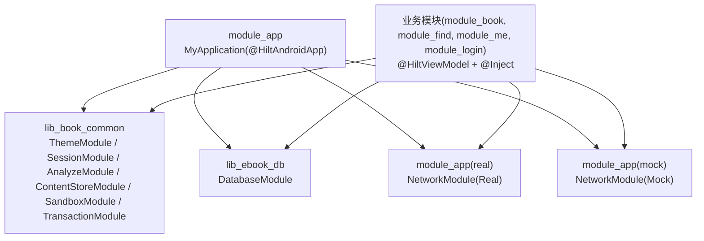
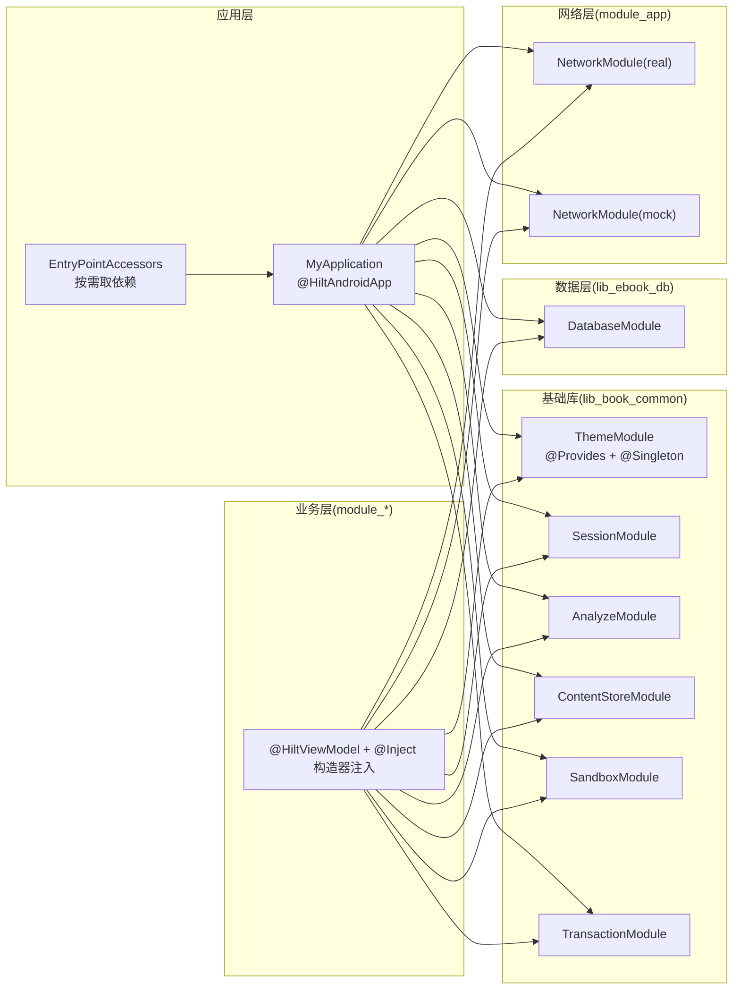
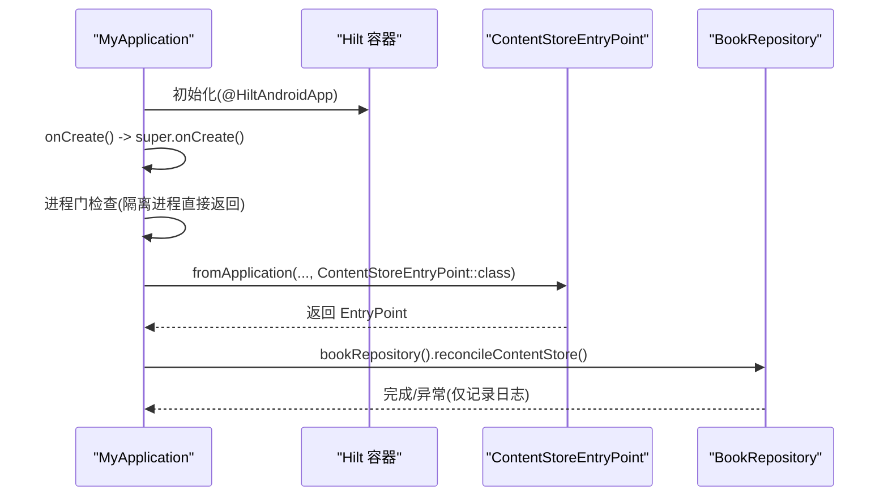
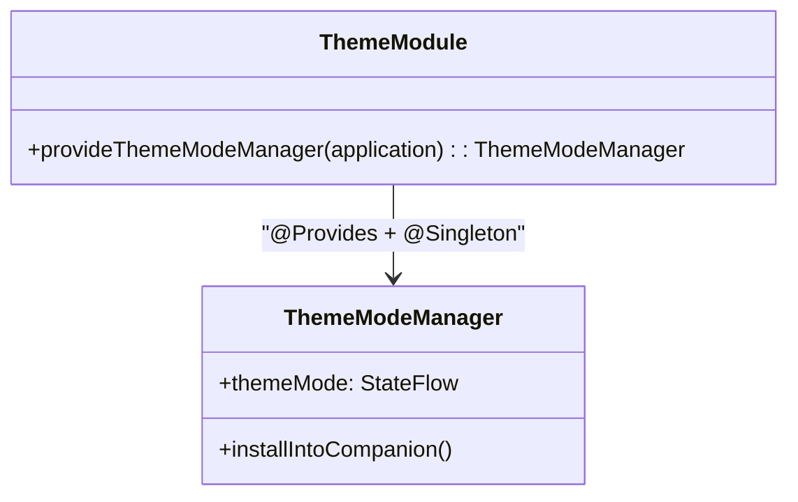
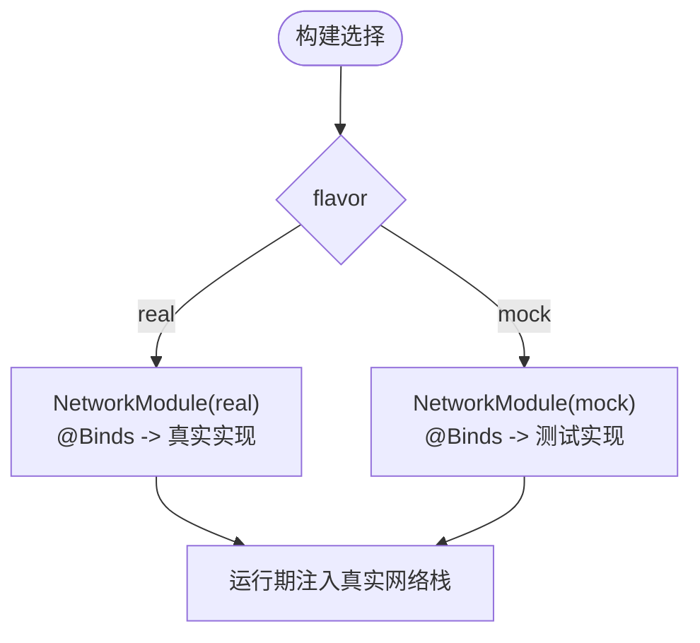
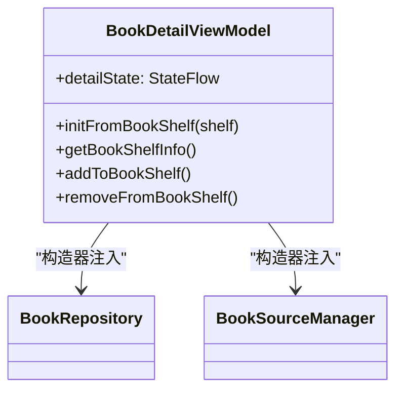
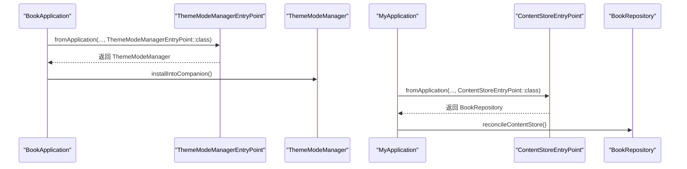
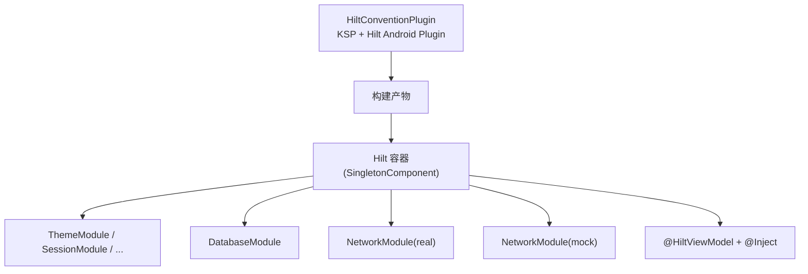

# 依赖注入

<cite>
**本文引用的文件**
- [MyApplication.kt](file://module_app/src/main/java/com/ebook/MyApplication.kt)
- [BookApplication.kt](file://lib_book_common/src/main/java/com/ebook/common/BookApplication.kt)
- [HiltConventionPlugin.kt](file://build-logic/convention/src/main/kotlin/HiltConventionPlugin.kt)
- [ThemeModule.kt](file://lib_book_common/src/main/java/com/ebook/common/di/ThemeModule.kt)
- [DatabaseModule.kt](file://lib_ebook_db/src/main/java/com/ebook/db/di/DatabaseModule.kt)
- [NetworkModule(Real).kt](file://module_app/src/real/java/com/ebook/di/NetworkModule.kt)
- [NetworkModule(Mock).kt](file://module_app/src/mock/java/com/ebook/di/NetworkModule.kt)
- [BookDetailViewModel.kt](file://module_book/src/main/java/com/ebook/book/mvvm/viewmodel/BookDetailViewModel.kt)
- [SessionModule.kt](file://lib_book_common/src/main/java/com/ebook/common/di/SessionModule.kt)
- [AnalyzeModule.kt](file://lib_book_common/src/main/java/com/ebook/common/di/AnalyzeModule.kt)
- [ContentStoreModule.kt](file://lib_book_common/src/main/java/com/ebook/common/di/ContentStoreModule.kt)
- [SandboxModule.kt](file://lib_book_common/src/main/java/com/ebook/common/di/SandboxModule.kt)
- [TransactionModule.kt](file://lib_book_common/src/main/java/com/ebook/common/di/TransactionModule.kt)
- [AGENTS.md](file://AGENTS.md)
</cite>

## 目录
1. [简介](#简介)
2. [项目结构](#项目结构)
3. [核心组件](#核心组件)
4. [架构总览](#架构总览)
5. [详细组件分析](#详细组件分析)
6. [依赖关系分析](#依赖关系分析)
7. [性能与生命周期](#性能与生命周期)
8. [故障排查指南](#故障排查指南)
9. [结论](#结论)
10. [附录：最佳实践清单](#附录最佳实践清单)

## 简介
本文件围绕 Hilt 在本仓库中的落地使用，系统化说明应用级单例、业务层依赖、UI 层 ViewModel 的注入方式；阐述 @HiltAndroidApp 的配置与模块装配；解释 @Singleton、@Inject、@Provides/@Binds 的使用模式；说明多环境（mock/real）依赖切换机制；并给出 EntryPointAccessors 在 Application 中获取依赖的正确用法，以及依赖生命周期与内存泄漏防护建议。

## 项目结构
- 构建期通过约定插件统一接入 Hilt 与 KSP，自动为 Android 模块启用 Hilt 插件与依赖，为 JVM 模块启用 core。
- 应用入口 MyApplication 标注 @HiltAndroidApp，负责启动流程与按需通过 EntryPointAccessors 获取依赖。
- 基础库 lib_book_common 提供主题、会话、解析器、内容存储等模块，按功能拆分到多个 Module。
- 数据库层 lib_ebook_db 提供 Room 相关的 Module。
- 网络层以 module_app 的 real/mock flavor 分别绑定真实实现与 mock 实现，实现运行时依赖切换。
- 业务模块（如 module_book/module_find/module_me/module_login）通过 @HiltViewModel + @Inject 构造器注入依赖。

**图示来源**
- [MyApplication.kt:19-61](file://module_app/src/main/java/com/ebook/MyApplication.kt#L19-L61)
- [ThemeModule.kt:17-26](file://lib_book_common/src/main/java/com/ebook/common/di/ThemeModule.kt#L17-L26)
- [DatabaseModule.kt:1-200](file://lib_ebook_db/src/main/java/com/ebook/db/di/DatabaseModule.kt)
- [NetworkModule(Real).kt:24-35](file://module_app/src/real/java/com/ebook/di/NetworkModule.kt#L24-L35)
- [NetworkModule(Mock).kt:26-37](file://module_app/src/mock/java/com/ebook/di/NetworkModule.kt#L26-L37)

**章节来源**
- [HiltConventionPlugin.kt:24-48](file://build-logic/convention/src/main/kotlin/HiltConventionPlugin.kt#L24-L48)
- [MyApplication.kt:19-61](file://module_app/src/main/java/com/ebook/MyApplication.kt#L19-L61)
- [BookApplication.kt:17-59](file://lib_book_common/src/main/java/com/ebook/common/BookApplication.kt#L17-L59)

## 核心组件
- 应用组件根：@HiltAndroidApp 标记的应用类负责初始化 Hilt 容器，并提供进程门控与按需取用依赖。
- 主题模块：通过 @Module + @InstallIn(SingletonComponent) + @Provides + @Singleton 提供 ThemeModeManager。
- 数据库模块：集中管理 Room 相关依赖（具体实现见 DatabaseModule）。
- 会话模块：集中管理与 Token/Session 相关的依赖（具体实现见 SessionModule）。
- 解析与沙箱模块：解析器、脚本沙箱执行器等基础设施（AnalyzeModule、SandboxModule）。
- 内容存储模块：内容仓库、缓存等（ContentStoreModule）。
- 事务模块：数据库事务相关封装（TransactionModule）。
- 网络模块：通过 real/mock flavor 切换 UserDataSource/CommentDataSource/ReleaseDataSource 的具体实现。

**章节来源**
- [ThemeModule.kt:17-26](file://lib_book_common/src/main/java/com/ebook/common/di/ThemeModule.kt#L17-L26)
- [DatabaseModule.kt:1-200](file://lib_ebook_db/src/main/java/com/ebook/db/di/DatabaseModule.kt)
- [SessionModule.kt:1-200](file://lib_book_common/src/main/java/com/ebook/common/di/SessionModule.kt)
- [AnalyzeModule.kt:1-200](file://lib_book_common/src/main/java/com/ebook/common/di/AnalyzeModule.kt)
- [ContentStoreModule.kt:1-200](file://lib_book_common/src/main/java/com/ebook/common/di/ContentStoreModule.kt)
- [SandboxModule.kt:1-200](file://lib_book_common/src/main/java/com/ebook/common/di/SandboxModule.kt)
- [TransactionModule.kt:1-200](file://lib_book_common/src/main/java/com/ebook/common/di/TransactionModule.kt)
- [NetworkModule(Real).kt:24-35](file://module_app/src/real/java/com/ebook/di/NetworkModule.kt#L24-L35)
- [NetworkModule(Mock).kt:26-37](file://module_app/src/mock/java/com/ebook/di/NetworkModule.kt#L26-L37)

## 架构总览
下图展示 Hilt 容器在各层的装配与依赖流向：应用层通过 @HiltAndroidApp 生成组件；基础库通过多个 @Module 暴露单例；业务层通过 @HiltViewModel + @Inject 构造器注入依赖；网络层通过 flavor 切换实现 mock/real 替换。

**图示来源**
- [MyApplication.kt:19-61](file://module_app/src/main/java/com/ebook/MyApplication.kt#L19-L61)
- [ThemeModule.kt:17-26](file://lib_book_common/src/main/java/com/ebook/common/di/ThemeModule.kt#L17-L26)
- [DatabaseModule.kt:1-200](file://lib_ebook_db/src/main/java/com/ebook/db/di/DatabaseModule.kt)
- [NetworkModule(Real).kt:24-35](file://module_app/src/real/java/com/ebook/di/NetworkModule.kt#L24-L35)
- [NetworkModule(Mock).kt:26-37](file://module_app/src/mock/java/com/ebook/di/NetworkModule.kt#L26-L37)

## 详细组件分析

### 应用级单例与 @HiltAndroidApp
- MyApplication 标注 @HiltAndroidApp，作为 Hilt 组件根，负责初始化与生命周期管理。
- 在 onCreate 中优先调用父类初始化，随后进行进程门控制与路由拦截。
- 采用 EntryPointAccessors.fromApplication 在“用到时”从 SingletonComponent 取出 BookRepository 进行内容仓库对账，避免在 Application 字段上 eager 注入导致隔离进程崩溃。
- 同时定义 ContentStoreEntryPoint，将 BookRepository 暴露为可访问的端点。

**图示来源**
- [MyApplication.kt:19-61](file://module_app/src/main/java/com/ebook/MyApplication.kt#L19-L61)

**章节来源**
- [MyApplication.kt:19-61](file://module_app/src/main/java/com/ebook/MyApplication.kt#L19-L61)

### 主题模块与 @Provides/@Singleton
- ThemeModule 以 object 形式声明，安装到 SingletonComponent，提供 ThemeModeManager 单例。
- 依赖 android.app.Application，用于读取 SharedPreferences 持久化主题模式。
- BookApplication 在初始化后通过 EntryPointAccessors 获取 ThemeModeManager 并安装至伴生对象，供 Compose 重组读取。

**图示来源**
- [ThemeModule.kt:17-26](file://lib_book_common/src/main/java/com/ebook/common/di/ThemeModule.kt#L17-L26)
- [BookApplication.kt:44-59](file://lib_book_common/src/main/java/com/ebook/common/BookApplication.kt#L44-L59)

**章节来源**
- [ThemeModule.kt:17-26](file://lib_book_common/src/main/java/com/ebook/common/di/ThemeModule.kt#L17-L26)
- [BookApplication.kt:17-59](file://lib_book_common/src/main/java/com/ebook/common/BookApplication.kt#L17-L59)

### 数据库模块
- DatabaseModule 位于 lib_ebook_db，负责装配 Room 数据库实例及 DAO 等依赖，供业务层通过注入使用。
- 结合项目规则（Room schema 演进、迁移链），确保数据层稳定与可升级。

**章节来源**
- [DatabaseModule.kt:1-200](file://lib_ebook_db/src/main/java/com/ebook/db/di/DatabaseModule.kt)

### 会话与解析/沙箱/内容存储/事务模块
- SessionModule：统一管理 Token/Session 生命周期与刷新策略。
- AnalyzeModule：书源解析器、解析结果处理等。
- SandboxModule：脚本沙箱执行器客户端与 Host 桥接。
- ContentStoreModule：内容仓库、本地内容存取。
- TransactionModule：数据库事务封装。

以上模块均以 @Module + @InstallIn(SingletonComponent) 暴露，内部通过 @Provides/@Binds 提供具体实现或绑定接口。

**章节来源**
- [SessionModule.kt:1-200](file://lib_book_common/src/main/java/com/ebook/common/di/SessionModule.kt)
- [AnalyzeModule.kt:1-200](file://lib_book_common/src/main/java/com/ebook/common/di/AnalyzeModule.kt)
- [SandboxModule.kt:1-200](file://lib_book_common/src/main/java/com/ebook/common/di/SandboxModule.kt)
- [ContentStoreModule.kt:1-200](file://lib_book_common/src/main/java/com/ebook/common/di/ContentStoreModule.kt)
- [TransactionModule.kt:1-200](file://lib_book_common/src/main/java/com/ebook/common/di/TransactionModule.kt)

### 多环境配置：mock 与 real 的网络依赖切换
- 通过 product flavor 的 source set 分别提供同名 NetworkModule：
  - real：将 UserDataSource/CommentDataSource/ReleaseDataSource 绑定到真实后端实现。
  - mock：将这些接口绑定到基于静态 JSON 资产的测试实现，便于离线开发调试。
- 构建产物由 flavor 决定，Hilt 容器在编译期根据 source set 选择对应模块。

**图示来源**
- [NetworkModule(Real).kt:24-35](file://module_app/src/real/java/com/ebook/di/NetworkModule.kt#L24-L35)
- [NetworkModule(Mock).kt:26-37](file://module_app/src/mock/java/com/ebook/di/NetworkModule.kt#L26-L37)

**章节来源**
- [NetworkModule(Real).kt:24-35](file://module_app/src/real/java/com/ebook/di/NetworkModule.kt#L24-L35)
- [NetworkModule(Mock).kt:26-37](file://module_app/src/mock/java/com/ebook/di/NetworkModule.kt#L26-L37)

### ViewModel 的依赖注入
- 业务 ViewModel 使用 @HiltViewModel 注解，并通过 @Inject 构造器注入依赖（如 BookRepository、BookSourceManager）。
- 示例 BookDetailViewModel：
  - 通过构造器注入 BookRepository 与 BookSourceManager。
  - 在 viewModelScope 中发起异步任务，更新 UI 状态。
  - 通过 BaseViewModel 的命令通道发送一次性提示或导航。

**图示来源**
- [BookDetailViewModel.kt:52-56](file://module_book/src/main/java/com/ebook/book/mvvm/viewmodel/BookDetailViewModel.kt#L52-L56)

**章节来源**
- [BookDetailViewModel.kt:52-56](file://module_book/src/main/java/com/ebook/book/mvvm/viewmodel/BookDetailViewModel.kt#L52-L56)

### EntryPointAccessors 的使用场景
- 在 Application 中避免字段式 eager 注入，改为在“需要时”通过 EntryPointAccessors 从 SingletonComponent 取出依赖，降低隔离进程启动失败风险。
- 本项目在 MyApplication 与 BookApplication 中分别定义了 ContentStoreEntryPoint 与 ThemeModeManagerEntryPoint，遵循同一模式。

**图示来源**
- [BookApplication.kt:44-59](file://lib_book_common/src/main/java/com/ebook/common/BookApplication.kt#L44-L59)
- [MyApplication.kt:37-61](file://module_app/src/main/java/com/ebook/MyApplication.kt#L37-L61)

**章节来源**
- [BookApplication.kt:44-59](file://lib_book_common/src/main/java/com/ebook/common/BookApplication.kt#L44-L59)
- [MyApplication.kt:37-61](file://module_app/src/main/java/com/ebook/MyApplication.kt#L37-L61)

## 依赖关系分析
- 构建期：约定插件统一引入 Hilt Android 插件与 KSP 编译器，确保各模块具备依赖注入能力。
- 运行期：
  - 应用层：@HiltAndroidApp 创建 SingletonComponent。
  - 基础库：各 @Module 提供单例依赖。
  - 业务层：@HiltViewModel + @Inject 构造器注入。
  - 网络层：flavor 决定具体实现绑定。

**图示来源**
- [HiltConventionPlugin.kt:24-48](file://build-logic/convention/src/main/kotlin/HiltConventionPlugin.kt#L24-L48)
- [NetworkModule(Real).kt:24-35](file://module_app/src/real/java/com/ebook/di/NetworkModule.kt#L24-L35)
- [NetworkModule(Mock).kt:26-37](file://module_app/src/mock/java/com/ebook/di/NetworkModule.kt#L26-L37)

**章节来源**
- [HiltConventionPlugin.kt:24-48](file://build-logic/convention/src/main/kotlin/HiltConventionPlugin.kt#L24-L48)

## 性能与生命周期
- 单例范围：
  - @Singleton 适用于全局共享且无上下文绑定的服务（如主题管理器、网络客户端、会话管理等）。
  - 注意：依赖 android.app.Application 的组件应通过 @Provides 显式传入 Application 参数，避免隐式持有引用造成问题。
- 视图模型范围：
  - @HiltViewModel 由 Hilt 管理生命周期，随 ViewModel 销毁而释放，适合持有 UI 状态与协程作用域。
- 按需获取：
  - Application 中通过 EntryPointAccessors 按需获取依赖，避免过早构建和跨进程问题。
- 内存泄漏防护：
  - 避免在 Application 字段上使用 eager @Inject，防止隔离进程启动即崩溃（参见项目约定）。
  - 避免在长生命周期对象中持有短生命周期 Context（如 Activity/Fragment）的直接引用。
  - 网络请求与数据库操作使用 viewModelScope/coroutineScope，避免悬挂协程。

[本节为通用指导，不直接分析具体文件]

## 故障排查指南
- 启动阶段崩溃（隔离进程）：
  - 症状：在 :js 沙箱进程中出现崩溃或无法访问资源。
  - 原因：Application 字段 eager 注入导致 Hilt 在进程门之前尝试初始化。
  - 处理：改用 EntryPointAccessors 在 super.onCreate() 之后按需取用依赖。
- 页面永不刷新：
  - 症状：网络拉取完成后页面未更新。
  - 原因：旧实现使用普通字段而非 StateFlow，Compose 重组未触发。
  - 处理：收敛为单一 StateFlow，并在 ViewModel init 中收集事件流。
- 网络请求异常被吞：
  - 症状：页面不闪退但数据永远加载不出来。
  - 原因：未知错误被 CoroutineAdapter 捕获并记录日志。
  - 处理：检查 mock 资产契约与解码类型是否一致，确认网络层错误上报路径。

**章节来源**
- [MyApplication.kt:19-61](file://module_app/src/main/java/com/ebook/MyApplication.kt#L19-L61)
- [BookDetailViewModel.kt:25-38](file://module_book/src/main/java/com/ebook/book/mvvm/viewmodel/BookDetailViewModel.kt#L25-L38)
- [AGENTS.md](file://AGENTS.md)

## 结论
本项目以 Hilt 为核心，通过模块化 @Module 与 @InstallIn(SingletonComponent) 组织依赖，结合 flavor 实现多环境切换；应用层通过 @HiltAndroidApp 管理容器，并在 Application 中谨慎使用 EntryPointAccessors 按需获取依赖；业务层通过 @HiltViewModel + @Inject 构造器注入依赖，保证职责清晰与可测试性。遵循上述模式可有效降低耦合、提升可维护性与可测试性，同时避免常见的生命周期与内存泄漏问题。

## 附录：最佳实践清单
- 应用级：
  - 使用 @HiltAndroidApp 标记应用类；避免在 Application 字段上 eager 注入。
  - 通过 EntryPointAccessors 在“用到时”获取依赖。
- 模块级：
  - 将依赖装配拆分为多个 @Module，按功能划分（主题、会话、解析、存储、事务、数据库、网络）。
  - 使用 @Provides/@Binds 明确接口与实现绑定，便于 mock/real 切换。
- ViewModel 级：
  - 使用 @HiltViewModel + @Inject 构造器注入依赖；在 viewModelScope 中执行异步任务。
- 多环境：
  - 通过 product flavor 的 source set 提供同名模块，实现运行时依赖切换。
- 生命周期与内存安全：
  - 单例只承载无上下文绑定的服务；含 Context 的依赖通过 @Provides 显式传入。
  - 避免在长生命周期对象中持有短生命周期 Context 引用；合理使用协程作用域。

[本节为通用指导，不直接分析具体文件]